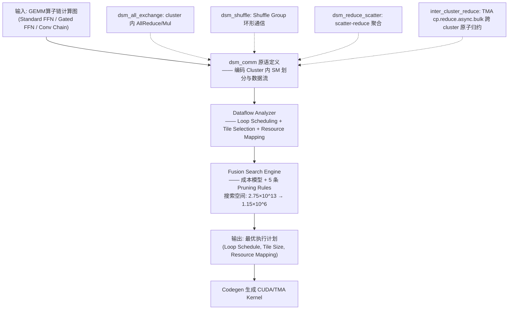

# Q3.2 — 编译框架的算子融合（Operator Fusion）如何支持 MoE、DiT、多模态、Video 模型在多算子/微算子并发场景下的高效执行？

## 笔记证据概览

| 路径 | 分数 | 关键信息 |
|------|------|----------|
| `paper_secs/secs_multimodal_kernel/FlashFuser.../FlashFuser-Expanding-the-Scale-of-Kernel-Fusion...md` | 16491 | H100 DSM-based 编译器融合框架，含 dsm_comm 原语、Dataflow Analyzer、Fusion Search Engine；支持 Standard FFN/Gated FFN/Conv Chain 的 GEMM 链融合 |
| `paper_secs/secs_multimodal_kernel/Mirage Persistent Kernel.../span-idpage-2-0span2.2-Kernel-Fusion.md` | 8593 | MPK mega-kernel 融合编译器，tGraph SM 级图表示，事件融合、图归一化、线性化；支持跨算子软件流水线和细粒度计算-通信重叠 |
| `knowledge_notes/算法知识笔记/GEMM-based Operator Chain...md` | 33.1 | GEMM 算子链三种模式（Standard/Gated/Conv），中间张量大小与 SMEM 容量瓶颈分析 |
| `knowledge_notes/kernel知识笔记/Group GEMM for MoE Inference.md` | 37.6 | MoE 多 expert FFN 的水平融合（Group GEMM），单 kernel launch 并发执行所有 active experts |
| `knowledge_notes/kernel知识笔记/dsm_comm Primitive（DSM通信原语）.md` | 29.5 | FlashFuser 的四种 DSM 通信原语详解：dsm_all_exchange/dsm_shuffle/dsm_reduce_scatter/inter_cluster_reduce |
| `knowledge_notes/编译知识笔记/Triton Language (GPU Kernel Programming).md` | 2953 | Triton block-level 编程模型、Autotuner tile size 搜索、编译流程（Python→Triton IR→PTX/LLVM IR） |
| `knowledge_notes/kernel知识笔记/Multi-Stream GPU Execution.md` | 491 | CUDA 多流并发执行，分支并行模式，cross-stream event 同步，SM 资源复用 |
| `knowledge_notes/算法知识笔记/SwiGLU FFN.md` | 37.8 | Gated FFN 作为水平融合目标的算法结构，中间激活 HBM 带宽占用分析 |
| `knowledge_notes/kernel知识笔记/All-to-All Communication in Distributed MoE Inference.md` | 9048 | MoE dispatch/combine 通信模式，与计算融合的机会 |
| `paper_secs/secs_multimodal_kernel/Dynamic Sparsity in Large-Scale Video DiT Training/...md` | 3408 | Video DiT 的时空计算模式、序列并行的注意力融合 |
| `paper_secs/secs_multimodal_kernel/KernelEvolve.../KernelEvolve-Scaling-Agentic-Kernel-Coding...md` | 4270 | 跨平台算子融合实践——conv1d 5→2 kernel 融合（消除 NCHW↔NHWC） |

---

## 一、方法细节：算子融合的数据流与硬件架构适配

### 方法1: FlashFuser —— 基于 Inter-Core Connection (DSM) 的 GEMM 链融合编译器

**笔记证据**: `paper_secs/secs_multimodal_kernel/FlashFuser.../FlashFuser-Expanding-the-Scale-of-Kernel-Fusion...md` (score: 16491), `knowledge_notes/kernel知识笔记/dsm_comm Primitive（DSM通信原语）.md` (score: 29.5)

**核心思想**：FlashFuser 是首个利用 H100 GPU 的 Distributed Shared Memory (DSM) 进行 GEMM 链算子融合的编译框架。DSM 是 H100 Thread Block Cluster 内多 SM 之间共享内存 (SMEM) 的互联通道（L1.5 cache），提供比 HBM 更低延迟、更高带宽的片上数据通路。FlashFuser 将中间张量从传统的 Reg→SMEM→HBM 路径扩展为 Reg→SMEM→DSM→L2→HBM 五级层次，突破单 SM SMEM 227KB 的容量上限（cluster 内可达 ~3.6MB），使原本因中间结果过大而无法融合的大规模 FFN 算子链可成功融合。

**编译流水线架构**（Mermaid flowchart）：



**注解**：
- **五级存储层次**：Reg (L0, ~256KB/SM, ~200TB/s) → SMEM (L1, 227KB/SM, ~4TB/s) → DSM (L1.5, cluster 互联, 带宽随 cluster size 递减) → L2 (50MB/chip, ~12TB/s) → HBM (80GB, 3TB/s)。FlashFuser 的 Dataflow Analyzer（Algorithm 1）采用贪心策略按此层次逐级放置中间张量——优先放入 Reg/SMEM，容量不足时 spill 到 DSM，最后才溢出到 L2/HBM。
- **Loop Schedule 影响缓存需求**：MLNK 顺序（先 M 再 L 再 N 再 K）要求本地 block 存储完整 tensor C；MNLK 顺序（先 M 再 N 再 L 再 K）每次 LK 迭代后产出 partial E，可在寄存器中累加但受限于 register file 容量。FlashFuser 搜索所有排列组合以最小化数据搬运量。
- **Tile Selection 分两级**：Cluster-level tile（决定跨 cluster 工作分布和是否需要跨 cluster 通信）和 Block-level tile（决定单 block 内存占用和 Reg/SMEM 使用）。前者影响 DSM 使用模式，后者影响单 SM 内资源分配。
- **Pruning 效率**：原始搜索空间 ~2.75×10^13 → 经 5 条剪枝规则（Rule 1: 消除不合法 cluster 配置; Rule 2: 约束 tile size 为 hardware-friendly 值; Rule 3: 消除冗余 loop schedule; Rule 4: 约束资源映射不超出硬件限制; Rule 5: DSM 带宽感知的 cost-based pruning）后降至 ~1.15×10^6（减少 >99.99%）。

---

### 方法1.1：垂直融合 —— GEMM 链的 Producer-Consumer 融合

**笔记证据**: `knowledge_notes/算法知识笔记/GEMM-based Operator Chain...md` (score: 33.1), `knowledge_notes/算法知识笔记/SwiGLU FFN.md` (score: 37.8)

**垂直融合的编译框架模拟**：以 Standard FFN（GEMM(A,B)→C→GEMM(C,D)→E）的 FlashFuser fusion 为例，cluster size = (2,4,2,4)：

```
=== Step 1: GEMM0 Phase（K-dim 空间划分，并行计算 partial C）===
clsk=2 → 2 个 Blocks 沿 K 维并行
Block(0,0): C_0,0(0) = Σ A_0,i × B_i,0  (i=0..K/2)
Block(0,1): C_0,0(1) = Σ A_0,i × B_i,0  (i=K/2..K)

=== Step 2: dsm_all_exchange（cluster 内 AllReduce 沿 K 维）===
dsm_all_exchange(group=[Block(0,0), Block(0,1)], op=Add)
→ C_0,0 = C_0,0(0) + C_0,0(1)  // 完整 C tile 驻留 DSM，不写回 HBM

=== Step 3: GEMM1 Phase（dsm_shuffle 分发 C tile 做下一轮 GEMM）===
clsshuffle = clsl/clsk = 4/2 = 2
dsm_shuffle(ShuffleGroup_0, ring_communication):
  Block(0,0): 取得 C_0,0 → 计算 E_0,0 = C_0,0 × D_0,0
  Block(0,1): 取得 C_0,0 → 计算 E_0,1 = C_0,0 × D_0,1

=== Step 4: Store Phase（两级归约产生最终输出）===
dsm_reduce_scatter(ReduceGroup, op=Add):
  Block(0,0) 负责 E_0,0; Block(0,1) 负责 E_0,1
inter_cluster_reduce(E_tile, op=Add)  // TMA cp.reduce.async.bulk
```

**注解**：
- **传统方法 vs FlashFuser**：Chimera 等传统方法在中间张量 C（如 GPT-6.7B: M=128, N=16384 → C≈8MB）超过单 SM SMEM (227KB) 时 fusion 失败，必须将 C 写回 HBM 再读出（"write-then-read" round-trip）。FlashFuser 通过 DSM 使 cluster 内多 SM SMEM 互联形成 ~3.6MB 有效片上空间，中间 58% 的 memory access 被消除。
- **DSM 带宽-延迟权衡**：DSM 延迟低于 global memory，但带宽随 cluster size 增大而递减。FlashFuser 的搜索引擎在 cost model 中对不同 cluster size 下的 DSM 带宽建模，自动选择最优 cluster 配置。
- **Gated FFN (SwiGLU) 的垂直融合变体**：Gate branch 和 Up branch 的两个并行 GEMM 可通过 spatial partitioning（cls_k=2，两分支分配到不同 block group）最大化并行度，或 sequential execution（单 block 内顺序执行）最小化 DSM 通信开销。dsm_all_exchange 操作从 Add 变为 Mul（完成 SiLU(gate) ⊙ up 的 element-wise 乘）。

---

### 方法1.2：水平融合 —— 多分支算子的并行融合

**笔记证据**: `knowledge_notes/kernel知识笔记/Group GEMM for MoE Inference.md` (score: 37.6), `knowledge_notes/kernel知识笔记/Multi-Stream GPU Execution.md` (score: 491)

#### (A) MoE Expert FFN 的水平融合 —— Group GEMM

**方法细节**（编译框架层面的 Group GEMM 伪代码）：

```
// MoE FFN — 多个 expert 的水平融合（单 kernel launch）
// 输入: tokens_per_expert[e] 为每个 expert 分配到的 token batch
//       W_gate[e], W_up[e], W_down[e] 为每个 expert 的权重

def GroupedMoE_FFN(tokens, routing_map, expert_weights):
    // === Phase 1: Gate+Up Projection (水平融合) ===
    GroupedMatMul(
        inputs:  [X_e1, X_e2, ..., X_eE_active],     // 每 expert 的 token batch
        weights_gate: [W_gate_e1, W_gate_e2, ...],   // Gate projection
        weights_up:   [W_up_e1, W_up_e2, ...],       // Up projection
        outputs: [gate_out_e1, up_out_e1, ...]
    )
    // 每个 expert 的 GEMM 作为 group 内独立 sub-task
    // 所有 sub-task 在同一 kernel grid 内并行执行
    // Tile sizes: offline profiled 为不同 activation pattern 选择最优

    // === Phase 2: SiLU + Multiply + Down Projection ===
    for e in active_experts:
        hidden_e = SiLU(gate_out_e) ⊙ up_out_e
    GroupedMatMul(
        inputs: [hidden_e1, hidden_e2, ...],
        weights: [W_down_e1, W_down_e2, ...]
    )

    // === Phase 3: Weighted Gather ===
    for each token t:
        y_t = Σ_e π_t[e] · ExpertOutput_e[t]
```

**注解**：
- **vs 逐 expert Kernel Launch**：传统方法为每个 active expert 发射独立 kernel（8 experts → 8×3=24 次 kernel launch），Group GEMM 将所有 active experts 的 FFN 合并为单次 kernel launch，kernel launch overhead 从 O(E) 降至 O(1)。
- **动态 Expert Activation 适配**：MoE 推理中不同 token 激活不同 expert 集合，Group GEMM 内子任务数动态变化。MoDES 通过 offline profiling 为不同 representative activation patterns 做 grid search 确定最优 tile sizes（BLOCK_M/N/K, num_warps 等），运行时选择最匹配的预计算配置。
- **Expert Skipping 的兼容性**：通过 sentinel filtering 在 dispatch 阶段过滤掉被跳过的 expert，不分配输入 buffer，不进入 Group GEMM。kernel 内仅需少量 warp-level 元素操作（masked comparison），overhead <1% of total compute。

#### (B) Attention Multi-Head 的水平融合

**笔记证据**: `knowledge_notes/编译知识笔记/Triton Language (GPU Kernel Programming).md` (score: 2953), `knowledge_notes/kernel知识笔记/Multi-Stream GPU Execution.md` (score: 491)

**Triton 的 block-level 水平融合模式**（以 FlashAttention 的 Q/K/V projection 融合为例）：

```python
@triton.jit
def fused_qkv_projection(X, W_qkv, Q, K, V,
                         BLOCK_M: tl.constexpr, BLOCK_N: tl.constexpr,
                         BLOCK_K: tl.constexpr):
    pid = tl.program_id(0)
    # 水平融合: Q/K/V 三路投影共享同一输入 X
    # 单次加载 X tile → 三次 dot product 并发（利用 Tensor Core 流水线）

    # 加载共享输入 X tile [BLOCK_M, BLOCK_K]
    x = tl.load(X_ptr + offsets)  # 一次 HBM load

    # 三路独立投影（可在 Triton IR 中标注为 parallel region）
    q = tl.dot(x, W_q)   # Q projection
    k = tl.dot(x, W_k)   # K projection
    v = tl.dot(x, W_v)   # V projection

    # 写入三路输出（coalesced stores）
    tl.store(Q_ptr + offsets, q)
    tl.store(K_ptr + offsets, k)
    tl.store(V_ptr + offsets, v)
```

**注解**：
- **数据复用**：水平融合的关键收益是共享输入的复用——X tile 仅需从 HBM 加载一次，三路投影共享该 tile。无融合时需三次独立的 X 加载（3×HBM read）。
- **Compiler vs 手写**：Triton 编译器从 block-level IR 自动生成 thread/warp 调度，开发者不需要手动管理 warp 分配。Triton Autotuner (`@triton.autotune`) 自动搜索最优 BLOCK_M/N/K、num_warps、num_stages 等配置。
- **Multi-Stream 分支并行补充**：当水平融合因 SM 资源不足无法容纳所有分支时，Nimble 的 multi-stream 策略将独立分支分配到不同 CUDA stream，通过 cudaEvent 做最小同步。多个 stream 的 kernel 在 GPU SM 上 spatial multiplexing 执行。

---

### 方法2: Mirage Persistent Kernel (MPK) —— Mega-Kernel 极值融合

**笔记证据**: `paper_secs/secs_multimodal_kernel/Mirage Persistent Kernel.../1-Introduction.md` (score: ~800), `paper_secs/secs_multimodal_kernel/Mirage Persistent Kernel.../span-idpage-2-0span2.2-Kernel-Fusion.md` (score: 8593)

**核心思想**：MPK 将 kernel fusion 推向极致——将整个模型的计算和通信全部融合为单个 persistent kernel（mega-kernel），通过 SM-level 图表示（tGraph）和 device-memory 同步原语协调所有 SM 的执行。

**tGraph 编译流程模拟**（以 Attention + AllReduce 为例）：

```
=== Step 1: Operator Decomposition → SM-level Tasks ===
输入计算图: MatMul(QKV) → Attention → AllReduce → RMSNorm
  ↓ Operator Decomposition（按输出维度切分）
  Q_i (SM_i 负责 Q 的 1/S 行), K_i, V_i, A_i, O_i, R_i

=== Step 2: Dependency Analysis → 精确事件依赖 ===
对于 MatMul → AllReduce:
  传统 kernel barrier: 所有 MatMul 完成 → AllReduce 才能开始
  MPK fine-grained: AllReduce task_i 仅依赖 MatMul task_i
    → MatMul task_j (j≠i) 可与 AllReduce task_i 并发执行

=== Step 3: Event Fusion ===
Successor-set fusion: OutTasks(e1)=OutTasks(e2) → 合并事件
  例: e_10 和 e_14 均为 task O_1 的前提 → 融合为新事件 e_4
Predecessor-set fusion: InTasks(e1)=InTasks(e2) → 合并事件
  例: e_4,e_5,e_6,e_7 均依赖 tasks A_1,A_2 → 融合为单一事件

=== Step 4: tGraph Normalization（保证每 task 最多 1 依赖 + 1 触发）===
fan-out > 1: 引入空 dummy task T_i 作为中间 relay
fan-in  > 1: 引入空 dummy task T_i 作为中间 relay
→ 新增开销 <1%（实际模型以"深"为主而非"宽"）

=== Step 5: tGraph Linearization（BFS 保证同事件触发的 task 连续）===
Algorithm 1 (BFS-based):
  E ← {所有无依赖的事件}
  while E not empty:
    e ← E.dequeue()
    for all tasks t where t.dependent_event = e:
      T.enqueue(t)  // 同事件的任务连续入队
      if all tasks triggering t.trigger_event are in T:
        E.enqueue(t.trigger_event)
→ 事件 fan-out 仅需存 first/last task index，无需显式列表

=== Step 6: 存储为 GPU Device Memory 紧凑结构 ===
每个 task:   [dependent_event_idx, trigger_event_idx]
每个 event:  [trigger_count_required, first_task_idx, last_task_idx]
```

**注解**：
- **tGraph vs CUDA Graph**：CUDA Graph 仅捕获 kernel 级依赖和 launch 顺序，同步粒度在 kernel 边界。tGraph 在 SM 级任务粒度（sub-kernel）表达依赖，使得跨算子软件流水线和细粒度 compute-communication overlap 成为可能。
- **Worker-Scheduler 运行时架构**：MPK runtime 将 GPU SM 分区为 workers（维护 FIFO task queue）和 schedulers（维护 task 依赖，依赖满足时分配 task）。事件驱动、全异步执行模型，GPU 在推理期间零 kernel launch。
- **Mega-Kernel 的并发优势**：消除 kernel launch overhead（从数百次→1 次）、支持跨算子 prefetch（当前算子计算时预取下一算子数据）、支持计算-通信重叠（MatMul task 与 AllReduce task 交错执行，隐藏通信延迟）。
- **与 FlashFuser 互补**：FlashFuser 聚焦 GEMM 链的 compute-intensive fusion（利用 DSM 扩展片上缓存），MPK 聚焦全模型 mega-kernel fusion（利用 tGraph 实现跨算子并发）。两者可在编译栈不同层次协同。

---

### 方法3: 融合对硬件体系结构的适配约束

#### 3.1 GPU (NVIDIA H100/A100) 的融合约束

**笔记证据**: `paper_secs/secs_multimodal_kernel/FlashFuser.../FlashFuser-Expanding-the-Scale-of-Kernel-Fusion...md` (score: 16491)

| 硬件资源 | 容量/特性 | 对融合的约束 | FlashFuser 的应对 |
|----------|----------|-------------|-------------------|
| Register File (L0) | 256KB/SM, 每 thread 最多 255 regs | 融合 kernel 的寄存器压力随算子数增加；过度融合导致 register spill → 性能急剧下降 | Dataflow Analyzer 的 Resource Mapping 优先将 tile 放入 Reg，超出则 spill 到 SMEM/DSM；tile size 选择受 reg pressure 约束 |
| Shared Memory (L1/SMEM) | 227KB/SM (H100) | 中间张量 tile 超过 227KB 则传统 fusion 失败 | DSM 扩展有效 SMEM 至 ~3.6MB/cluster，突破单 SM 限制 |
| DSM (L1.5) | Cluster 内 4-8 SM 互联 | DSM 带宽随 cluster size 增大递减（8-SM cluster 带宽 ≈ 2TB/s vs 4-SM ≈ 3TB/s）；延迟随 cluster size 增大递增 | 搜索引擎建模不同 cluster size 下的 DSM 带宽/延迟，cost model 自动选择最优配置 |
| L2 Cache | 50MB/chip | 跨 cluster 数据必须经过 L2；L2 带宽 (~12TB/s) 低于 DSM | inter_cluster_reduce 通过 TMA 异步执行，最小化 critical path 延迟 |
| HBM | 80GB, 3TB/s (H100) | HBM round-trip 是 memory-bound 算子链的主要瓶颈 | 融合后减少 58% memory access，1.24× end-to-end speedup |
| Thread Block Cluster | 最多 8 SMs/cluster | 大问题规模需要多 cluster，引入 inter-cluster 通信 | TMA cp.reduce.async.bulk 实现跨 cluster 异步原子归约 |

#### 3.2 NPU (华为昇腾 Ascend) 的融合约束

**笔记证据**: 笔记未明确说明 Ascend NPU 的融合细节，以下基于可推断的架构特性描述：

- **Da Vinci 架构的脉动阵列约束**：Ascend NPU 的 Cube Unit（矩阵乘）和 Vector Unit（向量计算）是固定的功能单元流水线。算子融合必须匹配脉动阵列的固定数据流模式——输入特征图按行/列流入 systolic array，中间结果若不匹配脉动阵列的输入格式则需 reformat（增加 DMA 开销）。笔记未明确说明 CANN GE/IRFusion 的具体融合边界决策算法。
- **片上 Buffer 限制**：Ascend 310P/910B 的片上 buffer（类似 GPU SMEM）容量有限，融合宽度受限于片上 buffer 能否容纳所有中间 tile。CANN 编译器在融合决策时需静态分析 buffer 复用可能性。
- **单指令流约束**：NPU 常为单指令流脉动阵列架构，多算子并发依赖编译时的指令级并行（ILP）——将多个小算子编译为同一指令流中的不同功能单元操作，而非 GPU 的多 kernel 并发。笔记未明确说明 CANN 如何实现 ILP 级别的微算子并发。

#### 3.3 TPU (Google) 的融合约束

**笔记证据**: 笔记未明确说明 TPU XLA 融合的具体内部实现。

- **Systolic Array + VLIW**：TPU 的矩阵乘在 systolic array 上执行，向量操作在 VLIW 单元上执行。XLA 编译器的融合策略将相邻的矩阵乘和 element-wise 操作合并为单一 HLO fusion——在 codegen 阶段将多个 VLIW 操作打包为同一 bundle。笔记未明确说明 XLA instruction fusion 与 multi-output fusion 的边界决策标准。
- **Scratchpad Memory**：TPU 的 scratchpad memory（等效 GPU shared memory）完全由编译器静态管理——XLA 在编译时确定所有 buffer 的地址分配（无运行时动态分配），这使得融合决策必须在编译时精确计算中间 buffer 大小。

---

## 二、实验环境

**笔记证据**: `paper_secs/secs_multimodal_kernel/FlashFuser.../FlashFuser-Expanding-the-Scale-of-Kernel-Fusion...md` (score: 16491)

### FlashFuser 实验配置

| 项目 | 配置 |
|------|------|
| GPU | NVIDIA H100 (80GB HBM) |
| 软件栈 | CUDA 12.4, PyTorch 2.6, TVM 0.9, Triton 3.2, Nsight Compute 2025.2.0 |
| CPU | Intel Xeon Platinum 8480+, 56 cores @ 2.10GHz |
| Benchmark GEMM Chains | (a) GEMM chains — 连续矩阵乘链 (b) Convolutional chains — 卷积→GEMM 转换链 (c) Gated FFNs — SwiGLU 等门控 FFN |
| 对比 Baseline | cuBLAS (highly-tuned library), Chimera, BOLT, Welder, MCFuser, TVM, Triton |
| 关键指标 | Kernel speedup (3.3× vs libraries, 4.1× vs compilers), 58% memory access reduction, 1.24× end-to-end speedup |

### MPK 实验配置

| 项目 | 配置 |
|------|------|
| GPU | NVIDIA A100, H100, B200（三代 GPU） |
| 模型 | LLM serving (LLaMA-like)、多 GPU 推理（含 AllReduce 通信） |
| 对比 Baseline | PyTorch + CUDA Graphs + torch.compile, SGLang, vLLM |
| 关键指标 | 1.0-1.7× speedup on both single- and multi-GPU, 接近硬件极限 |

**注解**：笔记未提供 MoE/DiT/多模态/Video 四类模型在各硬件平台的完整实验数据。FlashFuser 的实验聚焦 LLM 的 FFN 和 CNN 的 Conv Chain（可推广到 DiT/Video 的 GEMM 密集型子图）；MPK 聚焦 LLM serving 的全模型 mega-kernel。MoE 的 Group GEMM 融合（MoDES）和 Video 的时空融合（DSV）在各自论文中有独立实验，但笔记未详述其编译框架层面的算子融合实验。

---

## 三、实现（辅助说明）

**笔记证据**: `knowledge_notes/kernel知识笔记/dsm_comm Primitive（DSM通信原语）.md` (score: 29.5), `knowledge_notes/编译知识笔记/Triton Language (GPU Kernel Programming).md` (score: 2953)

### FlashFuser 的实现层次

1. **dsm_comm 原语实现**：基于 TMA `shared::cluster` 地址空间做 SM-to-SM 数据搬移；mbarrier many-to-many sync（每个 dsm_comm 操作仅同步参与 CTA 子集）；CUTLASS kernel 模板的三阶段插入（prologue: 初始化 DSM semaphore/mbarrier; mainloop: 注入 dsm_all_exchange + dsm_shuffle; epilogue: 执行 dsm_reduce_scatter + inter_cluster_reduce）
2. **Ring Communication**：dsm_shuffle 通过环形通信实现——CTA_i 发送 C tile slice 给 CTA_{i+1}，同时从 CTA_{i-1} 接收需要的 slice
3. **搜索空间管理**：5 条剪枝规则将 2.75×10^13 候选降至 1.15×10^6，cost model 对每个候选计算总数据搬运量

### Triton Autotuner 的实现

1. `@triton.autotune` 装饰器在编译时枚举配置空间（tile sizes, num_warps, num_stages 等）
2. 对每个配置执行 benchmark（在目标 GPU 上实测），选择最优配置缓存
3. 自动生成 PTX/LLVM IR → 经 GPU Driver 执行

### Group GEMM 的实现（MoE 水平融合）

1. Custom CUDA kernel：将不同 expert 的 GEMM 组织为 group 内的独立子任务
2. Offline profiling 为不同 activation patterns 确定最优 tile sizes
3. 配合 MoE Dispatch 的 sentinel filtering：跳过 expert 不分配 buffer

---

## 四、是什么？（辅助说明）

算子融合（Operator Fusion / Kernel Fusion）是编译框架中的核心优化技术，将计算图中多个相邻算子合并为单一 kernel 执行，以达到三个目标：(1) **消除中间张量的 HBM 读写**——生产者算子的输出驻留片上直接供消费者使用，减少 off-chip data movement；(2) **减少 kernel launch overhead**——从 N 次 kernel launch 降至 1 次；(3) **增加计算密度**——将多个 memory-bound 算子融合为更 compute-intensive 的单 kernel。

融合的两个基本维度：
- **垂直融合（Vertical/Producer-Consumer Fusion）**：将数据流上相邻的生产者-消费者算子链融合，如 Conv→BN→ReLU 的经典模式，或 MoE 中 LayerNorm→Gating→TopK→Expert FFN 链
- **水平融合（Horizontal/Multi-Branch Fusion）**：将共享输入的多分支算子融合，如 Attention 的 Q/K/V 三路投影、MoE 的多个 Expert FFN、Gated FFN 的两个并行 GEMM 分支

融合的硬件约束来自存储层次容量和计算单元拓扑：(1) Register File 容量限制 tile 大小和融合宽度；(2) SMEM 容量是传统融合的主要瓶颈（H100 单 SM 227KB）；(3) DSM（H100 新增）将有效片上缓存扩展至 ~3.6MB/cluster；(4) 脉动阵列/SIMT 的计算模式约束融合后的 kernel 结构。

---

## 五、方法对比表

| 方法 | 核心机制 | 融合类型 | 硬件存储层次利用 | 硬件平台 | 关键指标 | 并发-融合权衡 | 笔记证据 |
|------|----------|----------|-----------------|----------|----------|-------------|----------|
| **FlashFuser** | DSM-based GEMM chain fusion + dsm_comm 原语 + Dataflow Analyzer 搜索最优 loop schedule/tile | 垂直融合（Standard/Gated FFN, Conv Chain） | Reg→SMEM→DSM→L2→HBM 五级层次 | H100 GPU | 3.3× vs cuBLAS, 4.1× vs compilers, 58% less memory access | 融合引入 DSM 通信开销（dsm_shuffle/reduce），需 cost model 平衡；过度 cluster 化降低 DSM 带宽 | `FlashFuser...md` (16491) |
| **Mirage Persistent Kernel (MPK)** | SM-level tGraph + 事件融合/归一化/线性化 + Worker-Scheduler 运行时 | Mega-Kernel（全模型单 kernel，含计算+通信） | 不显式分层，通过 tGraph 任务编排隐式管理 | A100/H100/B200 GPU | 1.0-1.7× vs SGLang/vLLM | 事件融合减少同步点；tGraph 精细依赖暴露更多 cross-operator 流水线机会 | `Mirage...2.2-Kernel-Fusion.md` (8593) |
| **Group GEMM (MoE)** | 多 expert FFN 合并为单 kernel launch，offline profiled tile 选择 | 水平融合（MoE multiple expert FFNs） | 单 kernel 内 SMEM/Reg 管理，不涉及跨 SM 通信 | GPU (CUDA) | Kernel launch 从 O(E) 降至 O(1) | Expert 间无数据依赖，天然可水平融合；过度分组导致 irregular workload → GPU 利用率降低 | `Group GEMM for MoE...md` (37.6) |
| **Triton Autotuner** | block-level IR + `@triton.autotune` 配置搜索 (tile/num_warps/num_stages) | 垂直 + 水平（单 kernel 内） | Reg→SMEM（block-level 编程显式控制） | NVIDIA GPU (CUDA) | 接近手写 CUDA 性能 | Autotuner 搜索 tile size 平衡 Reg pressure 与 parallelism；多 program_id 沿 grid 轴实现并行 instance | `Triton Language...md` (2953) |
| **Multi-Stream (Nimble)** | CUDA multi-stream + event-based 最小同步 | 分支并行（非传统融合，通过多 stream 实现水平并发） | SM 级 spatial multiplexing | GPU (CUDA) | DAG 逻辑并发度受限 | 分支无数据依赖时可进发；stream 过多 → scheduling overhead | `Multi-Stream GPU...md` (491) |
| **CANN GE/IRFusion** (Ascend NPU) | 图编译 + 算子替换融合 | 垂直融合（预定义 pattern） | 片上 Buffer（Capacity 未在笔记中量化） | Ascend 910B/310P | 笔记未明确 | 脉动阵列固定数据流约束融合形状；ILP 级别微算子并发 vs GPU 的多 kernel 并发 | 笔记未明确说明 |

---

## 六、融合对微算子并发的影响分析

### 6.1 过度融合减少并发机会

当编译器将过多算子串行融合为单 kernel 时：(1) 原本可并发的独立算子被串行化在同一 kernel 内部执行；(2) 单 kernel 的 thread block 数量受限于 grid 大小和 SM 数量；(3) register pressure 增大 → occupancy 降低 → SM 利用率下降。例如，将 MoE 的 gating + top-k + FFN 全部融合为单 kernel 可能消除 gating 与 FFN 之间的并发机会（gating 是轻量向量操作，FFN 是重量矩阵乘，两者可以在不同 SM 上 overlap）。

### 6.2 欠融合抑制并发收益

Kernel launch overhead（每次 ~5-10μs）在微算子并发场景下可能成为瓶颈——若 100 个微算子各自独立 launch，总 launch overhead 可达 ~1ms，抵消并发的延迟收益。适度融合可将 launch overhead 从 O(N) 降至 O(1)，释放 GPU 资源给真正需要并发的计算。

### 6.3 最优平衡：FlashFuser 的方案

FlashFuser 通过 cost model 在融合与并发之间搜索最优平衡点：(1) 空间维度（cls_k, cls_n 等）决定并行度——大的 cls_k 将更多 blocks 分配给同一 GEMM 的 K 维并行计算；(2) 时间维度决定融合深度——loop schedule 选择 MNLK vs MLNK 控制中间结果的缓存策略；(3) DSM 通信开销与并发收益的 trade-off——大的 cluster 提供更大片上缓存但 DSM 带宽降低，需在搜索中显式建模。

---

## 七、不确定性

1. **NPU (Ascend) 融合细节缺失**：笔记未包含 CANN GE/IRFusion 的具体融合算法、IR 设计、融合边界决策策略。对 Ascend NPU 的算子融合分析基于通用架构推断。
2. **TPU XLA fusion 内部机制**：笔记未包含 XLA instruction fusion 和 multi-output fusion 的具体实现细节（如 HLO fusion pipeline 的边界判断算法）。
3. **多模态模型的具体融合实验**：笔记中 FlashFuser 和 MPK 的实验主要覆盖 LLM/CNN，未找到 vision+text 多模态模型的编码器融合 benchmark 数据。多模态的 Conv-BN-ReLU 经典融合模式笔记未提供独立实验。
4. **Video 模型的时空融合编译**：DSV 论文涉及 Video DiT 的 temporal-spatial 计算，但笔记未详述其为编译框架层面的 fusion 优化（主要在训练系统层面）。
5. **跨硬件平台融合数据缺失**：笔记未提供同一模型在 GPU/NPU/TPU 上算子融合的横向对比实验数据。
6. **KernelEvolve 的融合是 LLM agent 自动生成**：其融合策略（如 conv1d 5→2 kernel）由 LLM 搜索生成而非编译器算法决策，与 TVM/XLA 的传统编译融合有本质区别。

---

[ANSWER_AGENT_DONE] Q3.2
