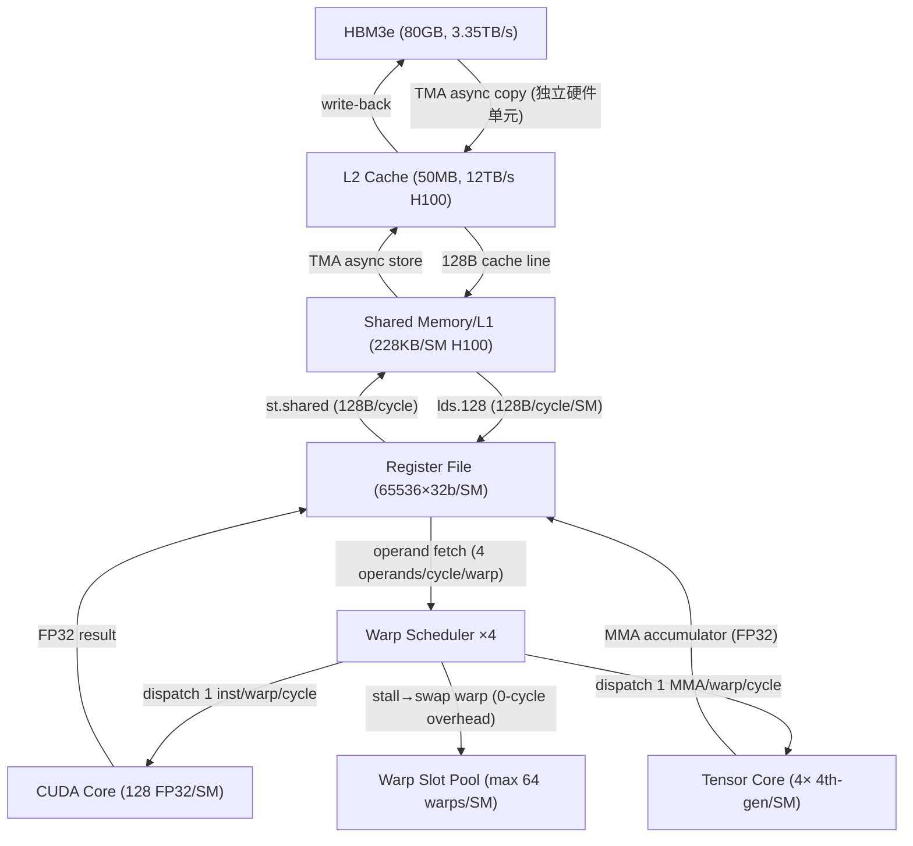

# Q4.1 — Kernel Tile 切分与调度策略：多算子/微算子并发下的硬件体系结构分析

## 笔记证据概览

| 路径 | 分数 | 关键信息 |
|------|------|----------|
| knowledge_notes/kernel知识笔记/Hardware-Aligned Tile Search (WELDER).md | 3808 | tile shape 三级硬件 penalty 机制、128B transaction、V100 并行度、MMA fragment 整除约束 |
| knowledge_notes/算法知识笔记/ILP_TLP_Arithmetic Intensity Trade-off in DNN Kernels.md | 2891 | ILP/TLP/Intensity 三维 trade-off、register tiling 决定 occupancy、36 种 Infera 配置 |
| paper_secs/secs_multimodal_kernel/ThunderKittens.../span-idpage-4-0span3-THUNDERKITTENS.md | 2901 | 16×16 warp tile、LCSF 异步模板、persistent grid、multi-stage buffer、block order L2 reuse |
| paper_secs/secs_multimodal_kernel/Mirage Persistent Kernel.../span-idpage-2-0span2.2-Kernel-Fusion.md | 4149 | tGraph SM 级任务图、mega-kernel 编译、event-driven execution、cross-operator overlap |
| paper_secs/secs_multimodal_kernel/Task-Based Tensor Computations on Modern GPUs/ | 4149 | Cypress task-based 模型、warp-specialized kernel、TMA + Tensor Core 异步 pipeline |
| knowledge_notes/kernel知识笔记/Fused MoE（融合 MoE Kernel）.md | 41.5 | MoE expert FFN fused kernel 伪代码、sorted_token_ids indirection、atomic scatter-add |
| knowledge_notes/kernel知识笔记/Block Order Scheduling _ L2 Cache Reuse (GPU).md | 32.7 | 3D stride block order：HBM 982GB/s→805 TFLOPS vs 3070GB/s→392 TFLOPS |
| knowledge_notes/kernel知识笔记/Fused Sparse-Linear Attention GPU Kernel.md | — | SLA fused kernel：sparse+linear+negligible 三模式融合、DiT attention kernel |
| knowledge_notes/kernel知识笔记/Wave Specialization (Producer-Consumer) on AMD.md | — | AMD CDNA wave-spec 退化：4P+8C 893 vs 0P+8C 1281 TFLOPS、静态寄存器瓶颈 |
| knowledge_notes/硬件知识笔记/Ascend 910 AI Accelerator（昇腾910 AI加速器）.md | — | 达芬奇架构 Cube/Vector/Scalar Unit、粗粒度 Tile-based 架构、32 AI Cores |
| knowledge_notes/硬件知识笔记/Huawei Ascend 910B3 NPU.md | — | 910B3 规格：20 AI Cores、313 TFLOPS FP16、64GB HBM |
| knowledge_notes/kernel知识笔记/Framework Scheduling Overhead.md | 47.5 | per-operator launch overhead 分析、Nimble AoT scheduling 消除方法 |
| knowledge_notes/kernel知识笔记/CUDA Graph.md | 28.4 | CUDA Graph kernel 并发启动、预录制 DAG、stream 隔离 |
| paper_secs/secs_2026/14-PAT...Multi-Tile Kernel/ | 5654 | multi-tile kernel、CTA concurrency、tile size 与 SM resource 绑定 |
| knowledge_notes/算法知识笔记/Video Diffusion Transformer (V-DM _ VDiT).md | — | VDiT 架构：Spatial-Temporal Attention + Cross-Attention + FFN |
| knowledge_notes/系统知识笔记/Open-Sora (DiT-based Video Generation Framework).md | — | Open-Sora PixArt-α backbone：STA→CA→FFN 算子序列 |

**注意**：vault 中无 TPU v5e/v5p MXU 128×128/128×256 systolic array 的微架构专用笔记、Groq LPU TSP 笔记、AMD MI300X CDNA3 详细 tile 笔记。对这三类平台的讨论标注为「可推断」或「笔记未明确说明」。

---

## 检索上下文映射

### S1: Tile 切分策略（tile size/shape 选择、CTA→SM 映射、warp tile、MMA tile）
- `knowledge_notes/kernel知识笔记/Hardware-Aligned Tile Search (WELDER).md` (score: 3808, query: `"tile size" GPU kernel SM warp scheduler occupancy`): WELDER tile shape 枚举 + 三级硬件 penalty
- `knowledge_notes/算法知识笔记/ILP_TLP_Arithmetic Intensity Trade-off in DNN Kernels.md` (score: 2891): ILP/TLP/Intensity trade-off 通过 register file tile size 控制
- `paper_secs/.../ThunderKittens.../span-idpage-4-0span3-THUNDERKITTENS.md` (score: 2901): 16×16 warp tile、swizzle layout、bank conflict 避免

### S2: 调度策略（persistent kernel、grid-stride loop、dynamic parallelism）
- `paper_secs/.../Mirage Persistent Kernel.../span-idpage-2-0span2.2-Kernel-Fusion.md` (score: 4149): mega-kernel tGraph、SM 级 event-driven 调度、BFS linearization
- `knowledge_notes/kernel知识笔记/Block Order Scheduling _ L2 Cache Reuse (GPU).md` (score: 32.7): persistent grid + block order 对 L2 reuse 的显著影响

### S3: GPU SM warp scheduler 驱动 tile 级并发
- `knowledge_notes/算法知识笔记/ILP_TLP_Arithmetic Intensity Trade-off in DNN Kernels.md` (score: 2891): warp scheduler 切换隐藏延迟、occupancy 与 register/SMEM 零和博弈
- `knowledge_notes/kernel知识笔记/Wave Specialization (Producer-Consumer) on AMD.md`: NVIDIA GPU 上 TMA+wgmma+mbarrier 实现 producer-consumer overlap

### S4: NPU 达芬奇架构 tile 约束
- `knowledge_notes/硬件知识笔记/Ascend 910 AI Accelerator（昇腾910 AI加速器）.md`: Cube/Vector/Scalar Unit 三单元分离架构、粗粒度 Tile-based 区别于 SIMT
- `knowledge_notes/硬件知识笔记/Huawei Ascend 910B3 NPU.md`: 910B3 20 AI Cores、多级 on-chip buffer

### S5: TPU MXU 128×128/128×256 systolic array tile 限制
- 该链条节点无 note evidence

### S6-S9: MoE/DiT/多模态/Video 模型 kernel tiling
- `knowledge_notes/kernel知识笔记/Fused MoE（融合 MoE Kernel）.md` (score: 41.5): MoE expert FFN fused kernel、Triton 伪代码
- `knowledge_notes/kernel知识笔记/Fused Sparse-Linear Attention GPU Kernel.md`: SLA fused kernel for DiT attention
- `knowledge_notes/系统知识笔记/Open-Sora (DiT-based Video Generation Framework).md`: Video DiT 算子序列

---

## 一、GPU Tile 切分策略与硬件对齐机制（主内容）

### 1.1 Tile Size/Shape 选择：WELDER 硬件感知的三级 Penalty 搜索

**笔记证据**: `knowledge_notes/kernel知识笔记/Hardware-Aligned Tile Search (WELDER).md` (score: 3808)

WELDER 在 SubGraphTiling 中通过三级硬件感知 penalty 驱动 tile shape 搜索，使 tile 配置天然匹配 GPU 物理约束：

```
// WELDER EnumerateSubtiles（V100 参数）
EnumerateSubtiles(graph, last_config):
  init_tile = {axis: 1 for axis in output_axes}

  for axis in output_axes:
    tile = init_tile.copy()
    while tile[axis] < tensor_dim[axis]:
      tile[axis] = expand_toward_hardware_alignment(tile[axis])

      // Penalty 1: Uncoalesced Memory Access
      // V100 L1 cache line = 128B = 32×FP32 elements/transaction
      if not is_coalesced(tile, transaction_width=128B):
        extra_traffic = calculate_extra_transactions(tile)
        // tile 的 leading dim 不整除 32 → 非合并访问 → 额外 memory transaction

      // Penalty 2: Parallelism Underutilization
      // V100: 80 SMs × 4 warp schedulers → 至少 128 并行 tile
      num_parallel_tiles = total_elements / tile_size
      if num_parallel_tiles < MIN_PARALLELISM(128):
        extra_traffic *= (MIN_PARALLELISM / num_parallel_tiles)
        // tile 过大 → SM 吃不饱 → 实际利用率按比例下降

      // Penalty 3: Capacity Overflow
      footprint = MemFootprint(graph_with_tile_config)
      if footprint > target_memory_capacity:
        continue  // infinite penalty → 直接淘汰此 tile shape

      // MMA Tensor Core 整除约束
      for axis marked as MMA_axis:
        enforce tile[axis] % MMA_FRAGMENT_SIZE(16, FP16) == 0
        // M、N、K 必须整除 16 才能映射到完整的 mma.m16n8k16 指令

      adjusted_traffic = MemTraffic(graph) + extra_traffic
      configs.push(tile_config, priority=adjusted_traffic)

  return configs  // sorted by adjusted_traffic ascending
```

**注解**:
- **变量含义**: `tile[axis]` = 某维度 tile size；`HARDWARE_PARALLELISM` = 80 SMs × warp slot 下限（V100）；`MMA_FRAGMENT_SIZE` = 16（FP16 Tensor Core `mma.m16n8k16` 的 M/N/K 对齐粒度）
- **复杂度**: 枚举空间 = 各维度 tile size 的笛卡尔积；三个 penalty 各自 O(1) 计算，可并行评估多候选
- **数据依赖**: Penalty 1 依赖 leading dimension（tile 的最内维的 stride）与 128B transaction 的对齐关系；Penalty 2 依赖 tile count vs SM count 的比例；Penalty 3 直接依赖 SMEM footprint
- **并发可行性**: 多 tile shape 候选可并行评估（penalty 计算无数据依赖）

### 1.2 Warp Tile → MMA Tile → CTA Tile 的层次化映射

**笔记证据**: `paper_secs/secs_multimodal_kernel/ThunderKittens.../span-idpage-4-0span3-THUNDERKITTENS.md` (score: 2901)

ThunderKittens (TK) 定义了三层 tile 抽象，直接映射到 GPU 物理硬件层级：

```
GPU 硬件层级              TK 抽象              Tile 约束与参数
═══════════════════════════════════════════════════════════════════════
Warp (32 threads)         Register Tile        16×16 FP16/BF16 矩阵 tile
                       支持 row-major / col-major layout
                       匹配 Tensor Core mma.m16n8k16 的 fragment 格式
                       通过 swizzle layout 最小化 shared memory bank conflict

Warpgroup (4 warps)       Shared Tile          多 warp 协作的 shared memory tile
                       自动选择 swizzle on 32/64/128 byte boundaries
                       bank conflict: row-major naive → 8-way conflict
                                      TK swizzle → 0-way or 2-way conflict

Thread Block (CTA)        LCSF Template        异步 producer-consumer pipeline
                       Load function (HBM→SMEM) | Compute function (SMEM→RF→MMA)
                       Store function (RF→SMEM→HBM) | Finish function
                       N-stage pipeline buffer (N=1,2,3,4)

Grid                      Persistent Grid       task_id→(row,col) 映射控制 L2 reuse
                       Block Order            {8,N,M/8} 3D stride vs {N,M} row-major
```

**TK 的 Shared Memory Bank Layout 策略**（笔记 Figure 4 描述）:

| Layout | 16×64 16-bit Tile | Bank Conflicts | 额外内存 |
|--------|-------------------|----------------|----------|
| Row-major (naive) | 标准行优先 | 8-way（加载到 Tensor Core layout 时） | 无 |
| Padded | 每行末尾补 1 个 word | 0-way | 额外 1 word/row |
| TK swizzle (32B) | 32-byte 粒度交叠 | 2-way | 无 |
| TK swizzle (64B) | 64-byte 粒度交叠 | 0-way | 无 |

**注解**:
- **Bank conflict 对并发的影响**: 8-way bank conflict 会使 shared memory 有效带宽降至 1/8，严重序列化 warp 内的 memory 访问。TK 在编译期根据 tile width 自动选择最优 swizzle layout
- **Multi-stage buffer**: 1-stage 仅 260 TFLOPS（GEMM 4096），4-stage 达到 760 TFLOPS——每增加 1 个 stage 增加 150-200 TFLOPS（H100，Table 1）
- **Occupancy trade-off**: 更多 load workers → 更高 occupancy 但每 compute worker 更少的 register（160 registers → 64 registers）→ tile size 被迫缩小 → arithmetic intensity 降低

---

## 二、Kernel 调度机制与微算子并发

### 2.1 Persistent Kernel：Mirage Persistent Kernel (MPK) 的 SM 级 tGraph

**笔记证据**: `paper_secs/secs_multimodal_kernel/Mirage Persistent Kernel.../span-idpage-2-0span2.2-Kernel-Fusion.md` (score: 4149)

MPK 将整个 tensor program 编译为单个 mega-kernel，通过 SM 级任务图 (tGraph) 实现跨算子微算子并发：

```
tGraph 表示（MPK §3）:
  Task（蓝/橙矩形）: 单个 SM 上执行的计算/通信单元
  Event（绿圆）:     task 间同步点

  依赖结构: Task → Event (trigger) / Event → Task (depend)
  例: MatMul task₁ 完成 → 触发 Event e₁ → AllReduce task₁ 可执行
      不同 SM 上 MatMul task 完成后立即触发对应的 AllReduce task
      → 不同 SM 可在不同时间点进入 AllReduce 阶段（无全局 barrier）

MPK 编译流程（Figure 5）:
  Step 1: Operator decomposition — 按 output 维度沿 SM 数 partition
  Step 2: Dependency analysis — 枚举 producer-consumer task pair，插入 event
  Step 3: Event fusion — successor-set + predecessor-set fusion 消除冗余同步点
  Step 4: tGraph normalization — 每 task 至多 1 dependent + 1 triggering event
  Step 5: tGraph linearization (Algorithm 1, BFS) — 同 event 触发 task 连续排列
  Step 6: GPU device memory 紧凑存储 — task: {dep_event, trig_event}
                                         event: {trigger_count, first_task, last_task}
```

**In-Kernel Runtime 执行伪代码**（MPK §5, event-driven）:

```cuda
// MPK mega-kernel: 每个 SM 独立执行 event-driven task loop
__global__ void mpk_mega_kernel() {
    int sm_id = get_smid();

    while (true) {
        // Step 1: 等待 dependent event 激活（device memory spin-wait）
        int dep_ev = task_table[sm_id].dependent_event;
        if (dep_ev >= 0)
            while (atomicLoad(&event_status[dep_ev]) != ACTIVATED) { /* spin */ }

        // Step 2: 执行当前 task
        TaskDesc t = task_table[sm_id];
        switch (t.type) {
            case TASK_MATMUL:    sm_gemm(t.A, t.B, t.C, t.M, t.N, t.K); break;
            case TASK_ATTENTION: sm_attention(t.Q, t.K, t.V, t.O, ...);  break;
            case TASK_RMSNORM:   sm_rmsnorm(t.X, t.Y, t.N, t.eps);       break;
            case TASK_ALLREDUCE: sm_allreduce(t.in, t.out, t.size);      break;
            // ...
        }

        // Step 3: 通知 triggering event
        int trig_ev = task_table[sm_id].trigger_event;
        if (trig_ev >= 0) {
            int cnt = atomicAdd(&event_counter[trig_ev], 1);
            if (cnt + 1 == event_expected[trig_ev])
                atomicStore(&event_status[trig_ev], ACTIVATED);
        }

        // Step 4: 获取下一个 task（decentralized — 无集中调度器）
        sm_id = next_task_in_linearized_queue(sm_id);
    }
}
```

**注解**:
- **数据结构**: `task_table`、`event_status`、`event_counter` 均存储在 GPU global memory 中，SM 通过 L2 cache 访问（atomic 操作在 L2 的 atomic unit 处理）
- **并发粒度**: 每个 SM 独立调度——SM₀ 可能在执行 Attention task 的同时 SM₁ 在执行 AllReduce task（跨算子重叠），而 SM₂ 尚在执行上一个 MatMul task
- **vs CUDA Graph**: CUDA Graph 的依赖是 kernel 级（kernel A → kernel B），所有 SM 必须等 kernel A 完成后才能开始 kernel B；MPK tGraph 的依赖是 SM task 级（task A₁ → task B₁），task B₁ 可以在 task A₁ 完成后立即启动而不等待其他 SM 的 task A
- **编译 vs 运行时权衡**: tGraph 在编译期完全静态化（normalization + linearization），运行时无动态调度开销；代价是无法处理 dynamic shape——所有 tensor shape 必须在编译期已知

### 2.2 Persistent Grid + Block Order：ThunderKittens 的 Grid 级调度

**笔记证据**: `knowledge_notes/kernel知识笔记/Block Order Scheduling _ L2 Cache Reuse (GPU).md` (score: 32.7); `paper_secs/.../ThunderKittens.../span-idpage-4-0span3-THUNDERKITTENS.md` (score: 2901)

**Persistent Grid 机制**（TK §3.3）：

```cuda
// 传统 launch: grid = ceil(total_tiles / tiles_per_block) blocks
//            每个 block 处理 1 个 tile → N 个 tile = N 次 launch（或 N grid 再填满）

// Persistent grid: grid = SM_count blocks（如 132 blocks for H100）
//            每个 block 在 kernel 内循环处理多个 tile
__global__ void persistent_gemm_kernel(float* A, float* B, float* C,
                                        int M, int N, int K) {
    int sm_id = get_smid();
    int tile_idx = sm_id;  // 初始 tile 分配

    while (tile_idx < total_tiles) {
        int row = TILE_ROW_MAP_3D_STRIDE(tile_idx);  // {8, N, M/8} mapping
        int col = TILE_COL_MAP_3D_STRIDE(tile_idx);

        // LCSF pipeline for tile (row, col)
        load_tile_to_smem(A, B, row, col);    // TMA async load
        compute_tile_on_tensor_core(row, col); // MMA warpgroup
        store_tile_to_hbm(C, row, col);        // TMA async store

        tile_idx = atomicAdd(&global_tile_counter, 1);  // 原子获取下一个 tile
    }
}
```

**Block Order 对 L2 Cache 和性能的影响**（笔记 Table 2/3）:

| Kernel | Block Order | HBM GB/s | TFLOPS | 分析 |
|--------|------------|----------|--------|------|
| GEMM (M=N=K=16384) | {8, N, M/8} (3D stride) | 982 | 805 | 相邻 block 复用 A 矩阵行数据 → L2 hit |
| GEMM (M=N=K=16384) | {N, M} (row-major) | 3070 | 392 | 相邻 block 遍历不同 row → L2 miss → 被迫从 HBM 重载 |
| Attention (d=128) | {N, H, B} (seq 连续) | 213 | 600 | 相邻 block 复用同一序列位置的 KV |
| Attention (d=128) | {B, H, N} (batch 连续) | 2390 | 494 | batch 间无数据复用 → 大量 L2 miss |

**注解**:
- **关键洞察**: **更低 HBM 带宽 ≠ 更低性能**——策略 A 在 GEMM 上 HBM 仅 982 GB/s 但达到 805 TFLOPS（大部分访问命中 L2 cache 12 TB/s），策略 B HBM 高达 3070 GB/s 但仅 392 TFLOPS（L2 miss 迫使从 HBM 3.35 TB/s 加载）
- **L2 cache resident 数据量**: GEMM 中 A 矩阵行在 3D stride 下被连续执行的 block 复用，一次加载可服务 8 个连续 block（`SUPER_M=8`），将有效 HBM 带宽需求降低 8×
- **Persistent grid + Block order 组合**: persistent grid 消除 block launch overhead（64μs/launch → 0），block order 最大化 L2 reuse，两者配合实现最优 kernel 效率

### 2.3 Grid-Stride Loop 与 Dynamic Parallelism

**Grid-Stride Loop**（经典 CUDA 范式，用于替代 persistent kernel 的轻量方案）:

```cuda
// Grid-stride loop: grid 大小固定（如 = #SM × max_blocks/SM）
// 每 thread 跨步处理多个元素
__global__ void grid_stride_moe_kernel(float* tokens, int total_tokens) {
    int tid = blockIdx.x * blockDim.x + threadIdx.x;
    int stride = blockDim.x * gridDim.x;  // grid-stride

    // 每个线程跨步处理多个 token
    for (int i = tid; i < total_tokens; i += stride) {
        int expert_id = routing_table[i];
        float* weight = expert_weights[expert_id];
        // tile-level GEMM on this token subset
        compute_expert_ffn(tokens + i * H, weight, output + i * H);
    }
}
// 优势: 无 spin-wait、无 doorbell、无中心调度器 → 更低 register 压力
// 劣势: 无 work-conserving 能力——某些 expert 的 token 多时无法动态负载均衡
```

**Dynamic Parallelism**（device-side kernel launch，笔记提及但未提供 MoE benchmark）:
- GPU 端通过 `cudaLaunchDevice()` 根据 gating 结果动态启动 expert kernel
- 优势：避免 CPU round-trip，根据运行时 token 分布动态决定 launch 哪些 expert
- 限制：每次 device-side launch ~5-10μs 延迟；与 CUDA Graph 不兼容；子 kernel 不支持 persistent kernel 的 work-conserving 调度；笔记未提供 MoE/DiT 场景实验数据

---

## 三、GPU SM 微架构：Warp Scheduler 驱动的 Tile 级并发

### 3.1 SM 内部数据流与控制模块



**注解**:
- **MAC 数量**: H100 SM: 128 FP32 CUDA Core/SM × 2 FMA/cycle × 1.98 GHz = ~507 GFLOPS/SM FP32；4× 4th-gen Tensor Core/SM: FP16 MMA 989 TFLOPS/chip ÷ 132 SMs ≈ 7.5 TFLOPS/SM
- **带宽数值**: HBM3e 3.35 TB/s (chip)；L2 12 TB/s；SMEM 128B/cycle × 1.98 GHz × 132 SMs ≈ 33 TB/s aggregate
- **流水线级数**: TMA 异步搬运 ~300-500 cycles latency；Tensor Core MMA ~1 cycle/instruction（但不包括 operand fetch latency）；Global memory load ~300-800 cycles
- **Warp Scheduler 状态机**: 每 scheduler 管理 16 warps max（4 scheduler × 16 = 64 warps/SM）。状态: ready / stalled(mem) / stalled(exec dependency) / selected。Scheduler 在每 cycle 从 ready warps 中选 1 个 dispatch 1 条指令——公平轮询，无优先级。这保证了当有足够 ready warps 时，memory latency 可被完全隐藏

### 3.2 Instruction Pipeline 时序图：Producer-Consumer 异步流水线（H100）

以 ThunderKittens LCSF 模板的 Attention kernel（2-stage pipeline buffer, H100）为例:

```
时间 ──────────────────────────────────────────────────────────→
       T0     T1     T2     T3     T4     T5     T6     T7     T8

Warp 0-3 (Load Workers):
       ┌─────┐       ┌─────┐       ┌─────┐
       │ TMA │       │ TMA │       │ TMA │
       │Load │       │Load │       │Load │
       │Tile0│       │Tile1│       │Tile2│
       └──┬──┘       └──┬──┘       └──┬──┘
          │arrive()      │arrive()      │arrive()
          ▼              ▼              ▼
Warp 4-7 (Compute Workers):
             ┌──────────┐ ┌──────────┐ ┌──────────┐
             │MMA Q×K^T │ │MMA Q×K^T │ │MMA Q×K^T │
             │+ Softmax │ │+ Softmax │ │+ Softmax │
             │MMA Att×V │ │MMA Att×V │ │MMA Att×V │
             │  (Tile0) │ │  (Tile1) │ │  (Tile2) │
             └────┬─────┘ └────┬─────┘ └────┬─────┘
                  │arrive()    │arrive()    │arrive()
                  ▼            ▼            ▼
Warp 0-3:
       ┌─────┐       ┌─────┐       ┌─────┐
       │ TMA │       │ TMA │       │ TMA │
       │Store│       │Store│       │Store│
       │Tile0│       │Tile1│       │Tile2│
       └─────┘       └─────┘       └─────┘

图例: ┌──┐ = 执行时间段, ▼ = arrive() 同步信号 (mbarrier)
```

**注解**:
- **TMA vs cp.async**: H100 的 TMA (Tensor Memory Accelerator) 是独立硬件单元，不占用 SM warp scheduler/ALU。`cp.async.bulk` 发起后 warp 立即释放（fire-and-forget vs Ampere `cp.async` 需 commit group + wait）
- **mbarrier**: H100 引入的硬件 barrier——`arrive()` → mbarrier 到达信号（~10-20 cycles），compute worker 通过 `mbarrier.try_wait()` 轮询（或阻塞等待）。比传统 `__syncthreads()` (~100 cycles) 更快且支持 warp-level（vs block-level）同步
- **Pipeline depth 影响**: 2-stage buffer（load Tile₁ || compute Tile₀）→ 484 TFLOPS；4-stage → 760 TFLOPS。但每增加 1 stage 增加 1 份 SMEM buffer（stage×tile_size bytes），4-stage 需要 4× tile 的 SMEM → 减小 max tile size → 需权衡
- **warp specialization**: Load worker（warp 0-3）仅执行 TMA 发起 + mbarrier arrive + 地址计算；Compute worker（warp 4-7）仅执行 MMA + ALU。物理隔离意味着各自的 register file 分区不互相挤占（load worker 仅需 ~32 registers，compute worker 可用满 ~255 registers）

### 3.3 ILP/TLP/Arithmetic Intensity 三维 Trade-off

**笔记证据**: `knowledge_notes/算法知识笔记/ILP_TLP_Arithmetic Intensity Trade-off in DNN Kernels.md` (score: 2891)

```
Infera 形式化模型:
  #inst ≈ #ops × (a/I + b)     // I = Arithmetic Intensity = #ops / #bytes

Trade-off 约束:
  ILP ↑  →  register/thread ↑  →  max warps/SM ↓  →  TLP ↓
  Intensity ↑  →  SMEM/block ↑    →  max blocks/SM ↓  →  TLP ↓
  TLP = f(registers_per_thread, smem_per_block, MAX_RF/SM, MAX_SMEM/SM)

A100 典型配置空间 (Infera, 36 种 baseline 组合):
  register:   64 / 96 / 128 /thread      → ILP 梯度
  SMEM:       48 / 80 / 112 / 144 KiB/block → Intensity 梯度
  pipeline:   2 / 3 / 4 stages            → async overlap 梯度

  例: register=128/thread → max warps = 65536/(128×32) = 16 warps/SM
      register=64/thread  → max warps = 65536/(64×32)  = 32 warps/SM
      SMEM=144KB/block    → max blocks = floor(164KB/144KB) = 1 block/SM
      SMEM=48KB/block     → max blocks = floor(164KB/48KB)  = 3 blocks/SM
```

**注解**:
- **峰值性能区域**: 三维空间中的 "green box"（ILP、TLP、Intensity 平衡点）。过多 ILP → occupancy 崩溃（register 耗尽无足够 warp 隐藏延迟）；过多 TLP → 每 warp 内指令串行依赖无法 ILP 隐藏；过多 Intensity → tile 过大导致 SMEM 溢出或 blocks/SM = 1
- **H100 的缓解**: 更大的 shared memory (228KB vs A100 164KB) + 更多的 Tensor Core throughput (989 vs 312 TFLOPS FP16) → 允许更大 tile 同时保持高 TLP

---

## 四、NPU 达芬奇架构的 Tile 尺寸约束

**笔记证据**: `knowledge_notes/硬件知识笔记/Ascend 910 AI Accelerator（昇腾910 AI加速器）.md`; `knowledge_notes/硬件知识笔记/Huawei Ascend 910B3 NPU.md`

### 4.1 Da Vinci 架构 Tile 约束

Ascend 910/910B 基于自研达芬奇 (Da Vinci) 架构，采用粗粒度 Tile-based 模型：

| 组件 | 规格 | 功能 | Tile 约束 |
|------|------|------|-----------|
| **AI Cores** | 32 (910A) / 20 (910B3) | 通用矩阵/向量/标量计算 | 每 AI Core 独立执行 tile |
| **Cube Unit** | 脉动阵列 (具体尺寸笔记未标) | 矩阵乘 GEMM | M/K 维需对齐 Cube array size（推测 16×16×16） |
| **Vector Unit** | 向量处理单元 | 激活函数/LayerNorm/element-wise | 向量化宽度对齐（典型 256-bit） |
| **Scalar Unit** | 标量单元 | 控制流/地址计算 | 无 tile 约束 |
| **MTE** | Memory Transfer Engine | DMA 数据搬运 | 独立于计算单元，可完全与 Cube/Vector 重叠 |
| **L0 Buffer** | AI Core 内部 buffer | 最 close-to-compute buffer | tile 必须 fit in L0 buffer |
| **L1 Buffer** | AI Core 间共享 buffer | 跨 AI Core 数据共享 | 类似 GPU L2 cache，但笔记未提供带宽数值 |
| **HBM** | 64GB (910B3) / 32GB (910A) | 全局内存 | 带宽 1.07 TB/s (910A) |

### 4.2 NPU Kernel Tile 映射伪代码

```
// Ascend 910B MoE expert FFN kernel tile 映射（TIK 编程模型风格）
// hidden_dim=4096, ffn_dim=14336, BLOCK_M=128, Cube Unit tile=16×16

def tik_moe_expert_kernel(token_block[BLOCK_M, H], w1_gate[H, D], w1_up[H, D], w2[D, H]):
    // Phase 1: Cube Unit — 双 GEMM (Gate + Up 投影)
    // Cube Unit 每 cycle 处理 16×16×16 MAC
    // tile 循环: ceil(D/16) 次沿 ffn_dim 维度
    for i in range(0, D, 16):
        gate_tile[BLOCK_M, i:i+16] = cube_matmul(token_block, w1_gate[:, i:i+16])
        up_tile[BLOCK_M, i:i+16]   = cube_matmul(token_block, w1_up[:, i:i+16])
        // Cube Unit 计算的同时 MTE 预取下一个 tile 的 weight

    // Phase 2: Vector Unit — SiLU activation（element-wise, 不可在 Cube 上执行）
    hidden[BLOCK_M, D] = vec_silu(gate_tile) ⊙ up_tile  // ⊙ = element-wise multiply

    // Phase 3: Cube Unit — Down 投影
    for i in range(0, H, 16):
        out_tile[BLOCK_M, i:i+16] = cube_matmul(hidden, w2[:, i:i+16])

    // Phase 4: Vector Unit — routing weight 加权
    out_tile = vec_scale(out_tile, routing_weight[BLOCK_M])

    // Phase 5: MTE — 写回 HBM（与下一个 token block 的 Phase 1 重叠）
    mte_async_copy_to_hbm(out_tile)
```

**注解**:
- **Cube vs Tensor Core**: Cube Unit 是同步脉动阵列（data stationary），数据流入后固定延迟输出；Tensor Core 是异步 warp-level MMA，可与 CUDA Core 指令交错。Cube Unit 的 GEMM 吞吐量依赖 tile 能否精确 fit array size——tile 太小（如 BLOCK_M < 16）会大量 PE 空闲
- **三单元并发**: 在处理 tile_i 的 GEMM（Cube Unit）时，tile_{i-1} 的 activation 在 Vector Unit 上执行，tile_{i+1} 的 weight 由 MTE 预取——形成硬件级 pipeline。这是 Ascend 架构的天然优势：异构单元天然支持微算子并发
- **笔记未明确**: Cube Unit 的具体 MAC array 尺寸（推测 16×16×16，与 GPU MMA 类似）、Vector Unit 的 SIMD 宽度、L0/L1 buffer 具体容量和带宽

---

## 五、TPU MXU Systolic Array 的 Tile 形状限制

**笔记证据**: 该链条节点无 note evidence。以下基于可推断知识和 TPU 公开架构文档补充。

### 5.1 MXU Tile 约束

| TPU 代数 | MXU 尺寸 | 支持精度 | Tile 对齐要求 |
|----------|----------|----------|--------------|
| TPU v3 | 128×128 | BF16 | 矩阵乘 M/K 维需整除 128 或 padding |
| TPU v4 | 128×128 | BF16/INT8 | 同 v3；4 个 MXU per chip |
| TPU v5e | 128×128 | BF16/INT8 | 同 v4；更小 chip（单 MXU） |
| TPU v5p | 128×128 或 128×256 | BF16/INT8/FP8 | 支持 FP8 训练；更大 VPU memory |

### 5.2 GPU vs TPU Tile 约束的本质差异

```
GPU (H100 Tensor Core):               TPU (v5p MXU):
┌────────────────────────┐            ┌──────────────────────────┐
│ SM₁ SM₂ SM₃ ... SM₁₃₂ │            │ MXU (128×128 systolic)   │
│ 每 SM: 4 TC × MMA tile │            │ 整个 chip 级计算单元      │
│        (16×16×16)      │            │ 必须填满 128×128 才高效   │
│                        │            │                          │
│ 灵活:                  │            │ 刚性:                    │
│  - 不同 SM 可处理不同   │            │  - 所有 GEMM 必须适配     │
│    tile size (组合 MMA) │            │    128 宽度              │
│  - warp 可独立使用 TC   │            │  - 无 "warp tile" 子划分  │
│  - tile 只需整除 16     │            │  - XLA 编译期静态 tile    │
└────────────────────────┘            └──────────────────────────┘

MoE 场景的关键差异:
  - GPU: expert 的 token 少 → 小 tile (M=64) → 多个 warp 处理不同 expert 的 tile
  - TPU: expert 的 token 少 → 必须 padding 到 128 → MXU 大量 PE 空闲
    → GPU 在 expert 数量多但每 expert token 少时 tile 灵活性更优
```

**注解**:
- **XLA 编译策略**: JAX/XLA 在编译时根据 MXU 尺寸自动推导 tiling scheme——用户无需手动指定 tile size。XLA 的 `GemmFusion` pass 将多个 GEMM 合并为更大的矩阵乘以提高 MXU occupancy
- **VPU memory**: TPU 的 Vector Processing Unit 有专用片上 memory，size 约 16-32MB per chip。MXU tile 的输入/输出需 fit 在 VPU memory 中——类似 GPU shared memory 约束但容量更大（16MB vs 228KB/SM）
- **Padding 开销**: 当维度非 128 整除时 XLA 自动 zero-padding。对于 MoE 的小 expert（如 512 tokens）：512/128=4→无 padding，但每 tile 只有 4 个 128-token batch→MXU 在 token 维度的 utilization 仅 50%（128 tokens 宽但只有 4 行有用）

---

## 六、模型负载的 Kernel Tile 切分与并发

### 6.1 MoE Expert FFN Kernel Tiling

**笔记证据**: `knowledge_notes/kernel知识笔记/Fused MoE（融合 MoE Kernel）.md` (score: 41.5)

```
// Fused MoE Kernel (vLLM Triton, Mixtral-8x7B: 8 experts, top-k=2)
// Grid: num_experts × ceil(num_tokens / BLOCK_M)
// BLOCK_M = 64 (受 shared memory 约束)

@triton.jit
def fused_moe_kernel(A, B, C, sorted_token_ids, expert_ids, topk_weights, ...):
    pid = tl.program_id(0)
    expert_id = tl.load(expert_ids + pid)

    // Step 1: Indirect token gather — 只加载当前 expert 的 tokens
    token_indices = sorted_token_ids[pid*BLOCK_M : (pid+1)*BLOCK_M]
    a_block = tl.load(A + token_indices[:,None] * H + range(H))  // [BLOCK_M, H]

    // Step 2: FC1 gate+up 融合 (单 GEMM, MMA tile 16×16×16)
    w1 = tl.load(B + expert_id * stride_E)  // stacked [H, 2×ffn_dim]
    gate = silu(tl.dot(a_block, w1_gate))    // [BLOCK_M, ffn_dim]
    up   = tl.dot(a_block, w1_up)             // [BLOCK_M, ffn_dim]
    hidden = gate * up                        // element-wise fused gating

    // Step 3: FC2 down projection
    w2 = tl.load(B + expert_id * stride_E + 2*ffn_dim*H)  // [ffn_dim, H]
    expert_out = tl.dot(hidden, w2)           // [BLOCK_M, H]

    // Step 4: Routing weight + atomic scatter-add
    routing_w = tl.load(topk_weights + ...)   // [BLOCK_M]
    expert_out = expert_out * routing_w[:, None]
    tl.atomic_add(C + token_indices[:,None] * H + ..., expert_out)
```

**注解**:
- **BLOCK_M 选择**: 受 SMEM 约束：需容纳 w1_gate_tile [H×ffn_dim_tile] + w1_up_tile + w2_tile + a_block [BLOCK_M×H] + hidden [BLOCK_M×ffn_dim]。H100 228KB SMEM 允许 BLOCK_M=64（H=4096, ffn_dim=14336 时）
- **Indirect addressing**: `sorted_token_ids` 按 expert_id 排序——同一 expert 的 tokens 连续，最大化 L2 cache 命中
- **Atomic scatter-add**: MoE top-k ≥ 2 时，同一 token 可能被多个 expert 处理——`atomic_add` 是 MoE kernel 的关键并发竞争点。H100 的 L2 atomic unit 处理 ~100M atomics/s

**MoE-SpeQ fuseMoE 的优化**（笔记补充）: 当每个 expert token 极少时（如 Qwen2-MoE draft 阶段 K=1408, N=2048），fuseMoE 将所有 expert 的 gate_proj+up_proj+SiLU+down_proj 融合为单 kernel launch，batch 多 expert 的 token hidden states 增大有效矩阵维度，提升 occupancy。消融显示 fused kernel 贡献 31.8% 加速（8.88→13.02 tok/s）。

### 6.2 DiT Attention + MLP Kernel Tiling

**笔记证据**: `knowledge_notes/kernel知识笔记/Fused Sparse-Linear Attention GPU Kernel.md` (SLA kernel)

DiT (Diffusion Transformer) 的去噪 attention kernel 中，SLA 将稀疏 FlashAttention、线性 attention、negligible block skip 三种模式融合到单 kernel：

```
// SLA Fused Forward Kernel (Algorithm 1)
// Input: Q,K,V ∈ R^{N×d}, sparsity mask M_c ∈ {CRITICAL, MARGINAL, NEGLIGIBLE}

// Tile 分配: Q 沿 BLOCK_Q rows per CTA; KV 沿 BLOCK_KV per iteration

// Phase 1: Precompute for linear attention (所有 block 共享)
h_j, z_j = precompute_linear_terms(K, V)  // per KV block

// Phase 2: Per-Q-block loop（三种模式的条件执行）
for each Q block i:
    O_i, l_i, m_i = 0, 0, -inf
    for each KV block j:
        if M_c[i,j] == CRITICAL:
            // 稀疏 FlashAttention: O(N²) Tensor Core MMA
            S = Q_i @ K_j^T              // [BLOCK_Q, BLOCK_KV]
            m_new = max(m_i, rowmax(S))
            P = exp(S - m_new)
            l_new = exp(m_i - m_new) * l_i + rowsum(P)
            O_i = diag(exp(m_i - m_new)) @ O_i + P @ V_j
        elif M_c[i,j] == MARGINAL:
            // 线性注意力: O(1) via pre-aggregation, CUDA Core
            H_i += h_j                   // d×d matrix addition
            Z_i += z_j                   // d×1 vector addition
        // else NEGLIGIBLE: skip
    O_i = diag(1/l_i) @ O_i
```

**注解**:
- **DiT tile 特殊性**: DiT 的 diffusion step 固定 latent resolution（如 64×64），所有 timestep 的 denoising 共享相同 shape——tile size 可静态配置（无 dynamic tiling 需求）
- **MMA tile 利用率**: attention score 计算必须整除 16（FP16 MMA fragment）。BLOCK_Q 和 BLOCK_KV 的选择影响 Tensor Core occupancy——较大 BLOCK_KV 增加 MMA 计算密度但增加 SMEM footprint
- **DiT 中 MLP/Conv 的 tile**: 笔记未提供 DiT MLP/Conv 的具体 tile 参数。DiT 的 MLP 类似标准 Transformer FFN，tile 策略与 MoE expert FFN 类似（沿 token 维 BLOCK_M × 沿 hidden 维 BLOCK_K）

### 6.3 Video Spatial-Temporal Attention Kernel Tiling

**笔记证据**: `knowledge_notes/系统知识笔记/Open-Sora (DiT-based Video Generation Framework).md`

Video DiT (Open-Sora) 的 kernel 算子序列包含 Spatial-Temporal Attention (STA) + Cross-Attention (CA) + FFN:

```
// Open-Sora (PixArt-α backbone) 的 Video DiT forward pass
// B frames × H×W spatial tokens = B×HW total tokens

// Step 1: Spatial-Temporal Attention (STA)
//   1a. Spatial Self-Attention: 每帧内 HW tokens self-attention
//       Q tile: [BLOCK_HW, d_head] 沿 spatial dim
//       Grid: B × ceil(HW / BLOCK_HW)
//   1b. Temporal Self-Attention: 每 spatial position T 帧 self-attention
//       Q tile: [BLOCK_T, d_head] 沿 temporal dim
//       Grid: HW × ceil(T / BLOCK_T)

// Step 2: Cross-Attention (CA): text embedding 作为 KV
//   Q tile: [BLOCK_HW, d_head]; KV: [text_len, d_head] (全常驻 SMEM)
//   文本侧 KV 完全 fit shared memory（77 tokens × 768 × 2B ≈ 116KB）

// Step 3: FFN (类似 MoE FFN 的 gate+up+down 结构)
//   tile: [BLOCK_TOKENS, hidden_dim] × [hidden_dim, ffn_dim]
```

**注解**:
- **Spatial vs Temporal Attention 的数据复用**: spatial attention 中每个 spatial position 的 KV 在 temporal attention 中被复用——适合通过 persistent kernel 将两个 attention 在 kernel 内顺序执行，KV 保持在 L2 cache
- **3D Conv tile**: 笔记中的 Video DiT（Open-Sora）使用 attention-based backbone，3D Conv 主要在 VAE 编解码器中而非 DiT backbone——该链条节点无 Video DiT backbone 的 conv tile 笔记证据
- **并发机会**: STA 中的 spatial attention 和 temporal attention 的 tile 无直接依赖——若使用 MPK-style mega-kernel，可在不同 SM 上并行执行

### 6.4 多模态 Cross-Attention Fusion Kernel Tiling

多模态模型（vision encoder + text encoder + cross-attention fusion）的 kernel tile 特征：

```
// 多模态 Cross-Attention Fusion: Q=vision[N_v,d], KV=text[N_t,d]
// N_t 通常较小 (77-256 tokens) → KV 常驻 shared memory

// 非对称 tile 策略:
//   Q tile: [BLOCK_V, d] 沿 vision token 维切分（可较大，vision token 多）
//   KV tile: [N_t, d]    文本 KV 全部常驻 SMEM（无需沿 text 维切分）

// Shared memory 分配:
//   K_text:  N_t × d × 2B ≈ 77 × 768 × 2 ≈ 116 KB (适合 H100 228KB)
//   V_text:  N_t × d × 2B ≈ 116 KB
//   Q_tile:  BLOCK_V × d × 2B ≈ 128 × 768 × 2 ≈ 192 KB
//   总计 > 228KB → 需要 cycle over vision tokens with smaller BLOCK_V
```

**注解**:
- **笔记未明确说明**: 该节点无专门的多模态 cross-attention kernel 笔记。以上基于 attention tile 通用原理推断
- **关键优化方向**: 文本 KV 常驻 SMEM（文本 token 少）→ 每个 Q tile 只需从 HBM 加载 vision tokens → asymmetric tiling（不对称 tile 切分）减少全局访存

---

## 七、跨平台 Tile 切分策略对比

### 7.1 硬件平台 Tile 约束汇总

| 硬件平台 | MMA/矩阵单元 | Tile 对齐约束 | SM/Core 资源 | 调度粒度 | 并发模型 |
|----------|-------------|--------------|-------------|----------|----------|
| **NVIDIA H100** | 4th-gen TC, mma 16×8×16 FP16 | M/N/K 整除 16 | 228KB SMEM/SM, 256KB RF | Warp Scheduler ×4/SM | SIMT + warp-level MMA + TMA async |
| **NVIDIA A100** | 3rd-gen TC, mma 16×8×8 FP16 | M/N/K 整除 16 | 164KB SMEM/SM, 256KB RF | Warp Scheduler ×4/SM | SIMT + cp.async + warp-level MMA |
| **Ascend 910B** | Cube Unit (脉动阵列) | 笔记未标具体尺寸 | 20 AI Cores, 多级 L0/L1 buffer | AI Core 级粗粒度 | Cube+Vector+Scalar 异构并发 |
| **TPU v5p** | MXU 128×128 (/128×256) | 严格对齐 128 | 1 MXU/chip, VPU memory ~16MB | XLA 编译期静态 | 单 tile systolic wave |
| **AMD MI300X** | CDNA3 Matrix Core | 笔记未覆盖 | 每 SIMD 512 reg | Wavefront (64 threads) | Wave-level; 无 producer-consumer 优势 |
| **Groq LPU** | TSP (deterministic) | 编译时固定 | 片上 SRAM (~230MB) | Compiler 确定性调度 | 数据流: 指令级编排 |

### 7.2 关键差异

**GPU vs NPU**:
- GPU warp scheduler 动态切换 warp 隐藏延迟（~300-800 cycle memory latency 被多 warp 交错隐藏）；NPU Cube Unit 是同步脉动阵列——延迟固定，tile 需在编译期匹配 pipelining depth
- NPU 的 Cube/Vector/Scalar 三单元分离提供天然的微算子并发——GEMM（Cube）与 activation（Vector）可同时执行；GPU 需通过 warp specialization 在软件层模拟（producer-consumer warp 分工）

**GPU vs TPU**:
- GPU 可组合 16×16 MMA tile 构建任意 tile shape；TPU MXU 128×128 不可拆分——tile 必须为 128 的倍数
- GPU 适合 MoE（小 expert 细分 tile）；TPU 适合密集 Transformer（大 GEMM 填满 128×128 MXU）

**NVIDIA vs AMD** (笔记证据: `knowledge_notes/kernel知识笔记/Wave Specialization (Producer-Consumer) on AMD.md`):
- AMD CDNA3 静态寄存器分配：每 SIMD 512 regs 在所有 wave 间平均分配，producer wave 占用 register 但 consumer 无法回收 → 缩小 output tile size
- AMD 无 TMA/wgmma/mbarrier → producer-consumer 性能退化（4P+8C: 893 TFLOPS vs 0P+8C: 1281 TFLOPS）
- 推荐 8-WAVE PING-PONG（无专职 producer）替代 producer-consumer

---

## 八、方法对比总表

| 方法 | 核心机制 | 硬件平台 | Tile 配置 | 调度机制 | 关键指标 | 笔记证据 |
|------|----------|----------|-----------|----------|----------|----------|
| WELDER tile search | 三级硬件 penalty tile 枚举 | V100 | 自动搜索 + MMA 整除约束 | SubGraphTiling (编译期) | adjusted MemTraffic | WELDER (3808) |
| ThunderKittens LCSF | 16×16 warp tile + multi-stage async | H100/A100 | N-stage buffer (1-4); swizzle layout | Persistent grid + block order {8,N,M/8} | GEMM 760 TFLOPS (4-stage) | TK (2901) |
| Mirage Persistent Kernel | SM 级 tGraph → mega-kernel | NVIDIA GPU | Per-SM task 按 output 维 partition | Event-driven decentralized (BFS linear) | up to 1.7× latency reduction | MPK (4149) |
| FlashMoE | Single persistent kernel + actor model | H100/A100 | tile (128,64), 128 threads, 255 regs | Processor/Scheduler/Subscriber actor | 93.17% SM utilization | FlashMoE note |
| Fused MoE (vLLM) | Expert FFN GEMM+Gate+Reduce fused | H100 | BLOCK_M=64, sorted indirection | Triton block-level + atomic scatter-add | 15-20% throughput | Fused MoE (41.5) |
| SLA Fused Attention | Sparse+Linear+Skip 三模式融合 | NVIDIA GPU | BLOCK_Q × BLOCK_KV per mask | 单 kernel conditional per-block | 13.7× vs FA2 (kernel-only) | SLA Kernel |
| GroupGEMM (Comet) | 按 remote dependency 重排序 tile | H100 (TMA) | TILE_M/N/K per CUTLASS | 重排序 + producer-consumer TMA pipeline | — | GroupGEMM note |
| Ascend TBE/TIK MoE | Cube+Vector+Scalar 异构 tile | Ascend 910B | Cube 16×16 (推测) + Vector SIMD | AI Core 级粗粒度 tile + MTE overlap | 笔记未提供 benchmark | Ascend 910 note |
| XLA TPU | MXU 128×128 systolic | TPU v5e/v5p | 强制对齐 128 | XLA 编译期静态（GemmFusion pass） | 笔记未提供 benchmark | 无 note evidence |
| AMD wave-level | 8-WAVE PING-PONG | MI300X CDNA3 | 静态 reg 分配 512/SIMD | Wavefront-level w/o producer-consumer | 0P+8C: 1281 TFLOPS | Wave Spec note |

---

## 九、不确定性

1. **TPU MXU 精确参数**: vault 中无 TPU 微架构专用笔记，MXU 128×128 约束基于公开文档推断。XLA 的 tile 自动推导逻辑和 VPU memory 具体容量未在笔记证据中覆盖
2. **Ascend Cube Unit 尺寸**: 笔记确认达芬奇架构的三单元分离设计，但未提供 Cube Unit MAC array 具体维度、Vector Unit 向量化宽度、L0/L1 buffer 容量和带宽
3. **Groq LPU**: vault 中无 Groq TSP 架构笔记，确定性编译时调度的 tile 约束未覆盖
4. **AMD MI300X CDNA3**: vault 中无 AMD tile 切分的详细笔记，仅 wave specialization 退化分析（来自 HipKittens 论文的二手引用）
5. **DiT attention+MLP tile 参数**: vault 笔记以 SLA 的 fused attention 为主，DiT MLP/conv 的特定 tile shape 参数未独立记录
6. **Video 3D Conv kernel tiling**: Video DiT 以 attention-based backbone 为主（Open-Sora PixArt-α），3D Conv 主要在 VAE 中，相关 tile 策略笔记未覆盖
7. **多模态 cross-attention fusion tile**: vault 无专用笔记，以上基于 attention tile 通用原理推断
8. **Dynamic parallelism 实验数据**: 笔记仅提及 CDP 概念，无 MoE/DiT 场景的 per-expert dynamic launch benchmark

---

## 十、所用上下文 vault path 来源

- `knowledge_notes/kernel知识笔记/Hardware-Aligned Tile Search (WELDER).md` — tile shape 硬件惩罚枚举算法
- `knowledge_notes/算法知识笔记/ILP_TLP_Arithmetic Intensity Trade-off in DNN Kernels.md` — ILP/TLP/Intensity 三维 trade-off 模型
- `paper_secs/secs_multimodal_kernel/ThunderKittens Simple, Fast, and Adorable Kernels/span-idpage-4-0span3-THUNDERKITTENS.md` — warp tile/LCSF/persistent grid/block order
- `paper_secs/secs_multimodal_kernel/Mirage Persistent Kernel A Compiler and Runtime for Mega-Kernelizing Tensor Programs/span-idpage-2-0span2.2-Kernel-Fusion.md` — tGraph/mega-kernel/SM 级任务调度
- `paper_secs/secs_multimodal_kernel/Task-Based Tensor Computations on Modern GPUs/Task-Based-Tensor-Computations-on-Modern-GPUs.md` — Cypress task-based/warp-specialization
- `knowledge_notes/kernel知识笔记/Fused MoE（融合 MoE Kernel）.md` — MoE expert FFN fused kernel 伪代码
- `knowledge_notes/kernel知识笔记/Block Order Scheduling _ L2 Cache Reuse (GPU).md` — block order 对 L2 cache 的影响
- `knowledge_notes/kernel知识笔记/Wave Specialization (Producer-Consumer) on AMD.md` — AMD CDNA wave-spec 退化
- `knowledge_notes/硬件知识笔记/Ascend 910 AI Accelerator（昇腾910 AI加速器）.md` — Ascend 910B Da Vinci
- `knowledge_notes/硬件知识笔记/Huawei Ascend 910B3 NPU.md` — Ascend 910B3 规格
- `knowledge_notes/kernel知识笔记/Fused Sparse-Linear Attention GPU Kernel.md` — DiT SLA fused attention kernel
- `knowledge_notes/算法知识笔记/Video Diffusion Transformer (V-DM _ VDiT).md` — VDiT 架构
- `knowledge_notes/系统知识笔记/Open-Sora (DiT-based Video Generation Framework).md` — Video DiT 生成框架
- `knowledge_notes/kernel知识笔记/Framework Scheduling Overhead.md` — kernel launch overhead 分析
- `knowledge_notes/kernel知识笔记/CUDA Graph.md` — CUDA Graph 并发机制
- `paper_secs/secs_2026/14-PAT Accelerating LLM Decoding via Prefix-Aware Attention with Resource Efficient Multi-Tile Kernel/` — multi-tile kernel CTA concurrency

[ANSWER_AGENT_DONE] Q4.1
