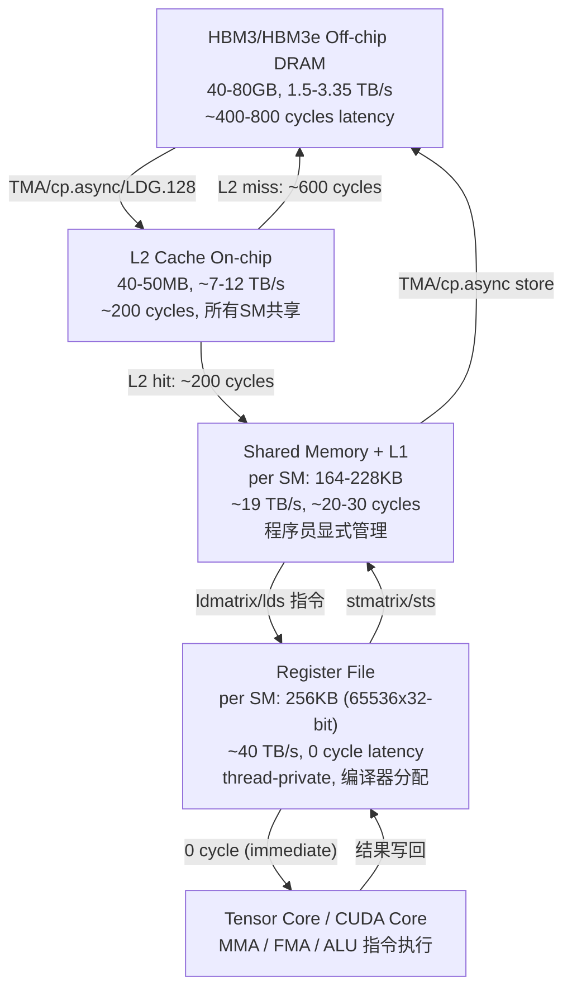

# Q4.3 — Memory Hierarchy 对 MoE/DiT/多模态/Video 多算子微算子并发 Kernel 设计与调度的影响

## 笔记证据概览

| 路径 | 分数 | 关键信息 |
|------|------|----------|
| knowledge_notes/硬件知识笔记/HBM (High Bandwidth Memory).md | 4404.4 | HBM 代际演进、带宽、与 SRAM 数据流 |
| knowledge_notes/kernel知识笔记/Arithmetic Intensity (in GPU Kernel Optimization).md | 2453.4 | Roofline 模型、memory-bound vs compute-bound |
| knowledge_notes/系统知识笔记/Memory Wall.md | 2432.0 | Memory Wall 量化、DSM 缓解路径 |
| knowledge_notes/硬件知识笔记/L2 Cache Affinity.md | 2176.8 | L2 cache affinity、tile layout 对 L2 复用影响 |
| knowledge_notes/kernel知识笔记/Block Order Scheduling.md | 2065.2 | Block order 对 L2 reuse 的惊人影响 (TK) |
| paper_secs/.../Samoyeds/span-idpage-4-2span4.1.md | 1980.1 | MoE sparse kernel 的 shared memory tiling、data stationary、coalesced access |
| knowledge_notes/硬件知识笔记/GPU Resource Constraints.md | 1528.6 | Register/Shared Memory/Thread 约束与 occupancy |
| paper_secs/.../ThunderKittens/span-idpage-4-0span3-THUNDERKITTENS.md | 1327.9 | Shared memory bank conflict avoidance、LCSF pipeline、block order |
| knowledge_notes/系统知识笔记/Memory-Bandwidth-Bound Decode in MoE.md | 1288.4 | MoE decode 的 bandwidth bottleneck 量化 |
| knowledge_notes/kernel知识笔记/Fused MoE.md | 1229.1 | Fused MoE kernel 的 L2 cache 命中率提升 |
| knowledge_notes/硬件知识笔记/GPU Memory Coalescing.md | 925.8 | Coalescing factor γ、coalesced vs uncoalesced 对比 |
| paper_secs/.../FlashAttention-2/3 2.4-FlashAttention-2-and--3-FA-2-and-FA-3.md | 522.9 | FA-3 321KB 需求 vs H100 256KB register file + 224KB SMEM |
| knowledge_notes/系统知识笔记/Memory Bandwidth Contention between Prefill and Decode.md | 448.3 | Prefill/Decode 并发时的 HBM/L2 竞争 |
| knowledge_notes/硬件知识笔记/GPU Memory Hierarchy (HBM vs SRAM).md | 149.0 | GPU 四级 memory hierarchy 数据流 |
| knowledge_notes/硬件知识笔记/GPU Memory Hierarchy for Low-Precision Kernels.md | 446.3 | 低精度 kernel 的 HBM→L2→SMEM→Reg→Tensor Core 完整数据路径 |

---

## 一、Memory Hierarchy 对 Kernel 并发设计的整体数据流 (硬件体系结构侧重)

### 1.1 GPU 四级 Memory Hierarchy 数据流路径

GPU 的 memory hierarchy 构成从慢到快、从大到小的四级金字塔，每一级对 kernel 并发设计施加不同的约束和优化机会。**笔记证据**: `knowledge_notes/硬件知识笔记/GPU Memory Hierarchy (HBM vs SRAM).md` (score: 149.0)、`knowledge_notes/硬件知识笔记/GPU Memory Hierarchy for Low-Precision Kernels.md` (score: 446.3)



**注解**:
- **带宽级差**: HBM→SMEM 带宽差约 10×，SMEM→Reg 带宽差约 2×，形成逐级递减的带宽漏斗，kernel 设计需最大化每级数据的复用率以减少跨级搬运。
- **并发约束**: L2 cache 是唯一跨 SM 共享的片上存储层——所有并发 kernel 的全局访存均经过 L2，因此多 kernel 并发时 L2 cache thrashing 是核心瓶颈。
- **H100 关键参数**: HBM3 3.35 TB/s, L2 50MB/12 TB/s, SMEM 228KB/SM, Register File 256KB/SM, 132 SM。

### 1.2 Memory Hierarchy 对 Kernel 类型判定的 Roofline 影响

**笔记证据**: `knowledge_notes/kernel知识笔记/Arithmetic Intensity (in GPU Kernel Optimization).md` (score: 2453.4)

Arithmetic Intensity (AI = FLOPs / Bytes) 通过 memory hierarchy 每一级的带宽和容量差异判定 kernel 的瓶颈类型:

| 场景 | 模型负载 | AI (FLOP/byte) | H100 Critical AI | 判定 | Memory Hierarchy 瓶颈级 |
|------|----------|-----------------|---------------------|------|------------------------|
| Decode Attention (T=64K) | Video/多模态 | ~0.5 | ~12-15 | **memory-bound** | HBM3 带宽不足 |
| MoE Expert FFN (B=16, k=8, N=64) | MoE | ~2 | ~20 | **memory-bound** | HBM3 expert weight 加载瓶颈 |
| DiT Denoising Attention (B=8, d=128) | DiT | ~1.25 | ~12-15 | **memory-bound** | HBM KV cache 加载 |
| Prefill GEMM (B=32, T=8K) | 全部 | ~20 | ~12-15 | **compute-bound** | Tensor Core 利用率为主 |

---

## 二、Register File — Occupancy 限制与 Register Tiling 策略 (S1)

### 2.1 Registers Per Thread 对 Occupancy 的硬约束

**笔记证据**: `knowledge_notes/硬件知识笔记/GPU Resource Constraints.md` (score: 1528.6)

每 SM 的 register file 为固定 65536 个 32-bit 寄存器（256KB）。GPU scheduler 将 thread block 分配到 SM 时，必须验证每 SM 的总寄存器数 ≤ 65536。若 kernel 每线程使用 R 个寄存器、每 block 有 T 个线程，则每 SM 最多容纳 floor(65536 / (R × T)) 个 block。

**Kernel 伪代码 — Register-Constrained Occupancy 计算**:

```
// 输入: H100 SM register file = 65536 x 32-bit = 256KB
//       max threads per SM = 2048 (H100)
//       max blocks per SM = 32 (H100)

function CalcOccupancy(R_per_thread, threads_per_block):
    reg_per_block = R_per_thread * threads_per_block
    // Rule R1: register limit
    max_blocks_by_reg = floor(65536 / reg_per_block)
    // Rule R2: thread limit
    max_blocks_by_thread = floor(2048 / threads_per_block)
    // Rule R3: SMEM limit (独立计算)
    max_blocks_by_smem = floor(SMEM_size / SMEM_per_block)
    
    resident_blocks = min(max_blocks_by_reg, 
                          max_blocks_by_thread, 
                          max_blocks_by_smem,
                          32)  // hardware max blocks per SM
    
    occupancy = resident_blocks * threads_per_block / 2048
    
    return occupancy

// 示例: MoE expert FFN kernel (d_model=4096, d_ff=14336)
// R_per_thread=128, threads_per_block=256
// reg_per_block = 128*256 = 32768
// max_blocks_by_reg = floor(65536/32768) = 2 → occupancy = 2*256/2048 = 25%
// 若减少 R_per_thread=64: max_blocks_by_reg = 4 → occupancy = 50%
```

**注解**:
- **变量含义**: `R_per_thread` = 编译器为每线程分配的寄存器数（`--maxrregcount` 可控）；`threads_per_block` = blockDim.x × blockDim.y × blockDim.z；`occupancy` = 实际 active warps / max warps per SM (H100: 64 warps = 2048 threads)
- **复杂度**: O(1) 计算每个 SM 的 resident block 上限，但实际 occupancy 受限于所有并发 kernel 的 block 在同一 SM 上的资源总和
- **并发可行性**: register file 是 per-SM 的私有资源——多 kernel 的 block 在同一 SM 上 co-locate 时，register file 在所有 block 间划分。若 kernel A 使用大量寄存器（高 ILP），kernel B 的 block 可能因寄存器不足而无法分配

### 2.2 MoE Expert Weight 的 Register Tiling 策略

**笔记证据**: `paper_secs/.../Samoyeds/span-idpage-4-2span4.1.md` (score: 1980.1, 提及 data stationary 和 register tiling)

MoE expert FFN kernel 的 register tiling 面临独特挑战：每个 expert 权重 (d_model × d_ff) 必须从 HBM 加载。register tiling 通过将 expert weight tile 保留在寄存器中跨多个 token 计算来实现复用。

```
// MoE Expert FFN Register Tiling 策略
// d_model=4096, d_ff=14336, expert_count=8, k=2, batch=16

__global__ void MoE_ExpertFFN_RegisterTile(
    half* output,      // [B, d_model]
    half* input,       // [B, d_model]
    half* W_gate,      // [N, d_model, d_ff] experts
    int* routing       // [B, k] expert assignments
) {
    // === Register Tile 分配 ===
    // 每线程 R=128 registers (256 bytes)
    // Register tile: [R_tile_m=8, R_tile_n=8] of FP16 weights
    
    // 从 shared memory 加载 input tile → registers
    half input_tile[8];  // 8 regs
    
    // 从 HBM 加载 weight tile → registers (via shared memory staging)
    // cp.async: HBM → SMEM (双缓冲, 16KB per buffer)
    // ldmatrix: SMEM → registers (8 threads × 4 matrices)
    
    // === Data Stationary (Samoyeds 技术) ===
    // 将 output accumulator 保持在 registers 中跨 k 维迭代
    // 仅每 V/k_b iteration 做一次 register shuffle (C ↔ C_IR)
    float C_acc[8][8];  // 64 个 FP32 accumulators = 128 regs
    
    for k_tile in 0..(d_model/32):
        // Load weight tile W_gate[k_tile*32:(k_tile+1)*32, :] → SMEM → Regs
        cp_async_load(W_gate + expert_idx*d_model*d_ff + k_tile*32*d_ff);
        // MMA: C_acc += input_tile @ weight_tile_reg
        mma_sync(C_acc, input_tile, weight_tile_reg);
    
    // Store C_acc → SMEM → HBM (coalesced)
}
```

**注解**:
- **Register 压力**: 每线程 128 regs × 256 threads/block = 32768 regs/block → 每 SM 最多 2 blocks → 25% occupancy。若降低到 64 regs/thread → 50% occupancy 但 tile 更小，需更多 iterations（更多指令发射）
- **数据依赖**: input_tile 在 k 维循环中不变（data stationary），weight_tile 每次迭代更新
- **并发可行性**: 多个 expert 的 register tiling 必须通过 persistent kernel 中的 warp specialization 实现——一部分 warp 专做 load（占用较少寄存器），另一部分专做 compute（大量寄存器用于 accumulator）

### 2.3 DiT Attention 中 QKV 矩阵的 Register 缓存

**笔记证据**: `paper_secs/.../FlashAttention-2/3 2.4-FlashAttention-2-and--3-FA-2-and-FA-3.md` (score: 522.9)

FlashAttention-3 的 register 压力来自 QKV 矩阵的 register tile 缓存需求：

```
// FA-3 单 SM 资源需求分析 (H100, d=128)
// Register File: 256KB/SM (65536 × 32-bit)
// Shared Memory:  228KB/SM

FA-3 Kernel Register 分配 (per SM, 2 CTA resident):
  Q tile (in registers):    Br × d × 2B  = 64×128×2 = 16KB  (per CTA)
  K tile (in shared mem):   Bc × d × 2B  = 64×128×2 = 16KB  (per CTA)
  V tile (in shared mem):   Bc × d × 2B  = 64×128×2 = 16KB  (per CTA)
  O accumulator (regs):     Br × d × 4B  = 64×128×4 = 32KB  (per CTA, FP32)
  m/l (softmax stats, regs): Br × 4B × 2  = 64×4×2 = 0.5KB
  Total register per CTA:   ~48.5KB = 12125 regs
  Total shared mem per CTA: ~48KB + workspace

  2 CTA per SM: register = 24250 regs < 65536 ✓
                 shared mem = 96KB < 228KB ✓
  Occupancy: 2×256/2048 = 25% (because of register usage)
```

**注解**:
- **FA-3 vs FA-2**: FA-3 总需求 321KB（register + SMEM）vs FA-2 的 321KB——两者均超过 A100 的 256KB+164KB=420KB 容量，但均受 H100 register file 256KB 约束
- **Register spilling**: 笔记明确指出「exceeding this limit causes register spilling, where excess data is stored in local memory on HBM」——register spill 导致数据被写入 HBM 的 local memory 区域（L1 缓存 line），延迟从 0 cycle 升高到 ~400 cycles
- **并发约束**: 若多模态模型的 cross-attention kernel 与 vision encoder kernel 并发，两者竞争 register file → scheduler 可能无法将两者分配到同一 SM

---

## 三、Shared Memory — 多微算子间的划分、Bank Conflict 与 Tile Size 约束 (S2)

### 3.1 Shared Memory 在多微算子间的划分策略

**笔记证据**: `paper_secs/.../ThunderKittens/span-idpage-4-0span3-THUNDERKITTENS.md` (score: 1327.9)、`paper_secs/.../Samoyeds/span-idpage-4-2span4.1.md` (score: 1980.1)

当 attention kernel 中需要同时分配 QKV tile + softmax workspace 时，shared memory 划分需要满足各微算子的最小 tile 约束:

```
// DiT Attention Kernel Shared Memory 划分 (H100, 228KB/SM)
// 微算子: QK^T GEMM + Softmax + PV GEMM

┌─────────────────────────────────────────────────────────────┐
│ Shared Memory Layout (per CTA, 2 CTA/SM → 114KB/CTA max)   │
├────────────────┬──────────────┬──────────────┬──────────────┤
│ Q Tile (SMEM)  │ K Tile (buf) │ V Tile (buf) │ Softmax WS   │
│ Br×d×2B        │ Bc×d×2B      │ Bc×d×2B      │ Br×Bc×2B     │
│ 64×128×2=16KB  │ 64×128×2=16KB│ 64×128×2=16KB│ 64×64×2=8KB  │
├────────────────┴──────────────┴──────────────┴──────────────┤
│ Pipeline Buffers (双缓冲): + 2×16KB = 32KB                   │
│ Total per CTA: 16+16+16+8+32 = 88KB < 114KB ✓               │
│ Multi-stage pipeline: N=2 stages → hide HBM→SMEM latency     │
└─────────────────────────────────────────────────────────────┘

// TK LCSF Template Pipeline 伪代码
__global__ void DiT_Attention_LCSF(
    half* Q, half* K, half* V, half* O) {
    
    __shared__ half Q_buf[2][64][128];  // 双缓冲 Q tile
    __shared__ half KV_buf[2][64][128]; // 双缓冲 K/V tile
    __shared__ half attn_ws[64][64];    // Softmax workspace
    
    // === Load Worker (warp 0) ===
    if (warp_id == 0) {
        for iter in 0..num_iters:
            // TMA async load: HBM → SMEM
            tma_load_async(Q_buf[buf_idx], Q_global + iter*64*128);
            tma_load_async(KV_buf[buf_idx], K_global + iter*64*128);
            arrive(load_done[buf_idx]);  // signal compute workers
    
    // === Compute Worker (warp 1-3) ===
    } else {
        for iter in 0..num_iters:
            wait(load_done[buf_idx]);
            // QK^T GEMM (使用 Tensor Core)
            mma_sync(attn_tile, Q_buf[buf_idx], KV_buf[buf_idx]);
            // Softmax in shared memory
            row_softmax(attn_ws, attn_tile);
            // PV GEMM
            mma_sync(O_tile, attn_ws, KV_buf[buf_idx]); // 复用 V
    }
}
```

**注解**:
- **Tile 约束**: Q tile = Br×d = 8KB-16KB (Br ∈ {32,64,128})，K/V tile = Bc×d 同样大小。Attention 的总 SMEM 需求 ≈ 3 × Br×d + Br×Bc + pipeline buffers
- **CTA 分配**: 每 SM 228KB → 可容纳 1-2 个 CTA（取决于 Br/Bc 选择）。若每个 CTA 需要 >114KB SMEM → 每个 SM 仅 1 个 CTA → occupancy 降低 → 延迟隐藏能力下降
- **Softmax workspace**: 可复用 K tile buffer（先完成 QK^T 后释放 K 空间写 softmax 结果）以减少 SMEM 需求

### 3.2 Shared Memory Bank Conflict 对并发访存吞吐的影响

**笔记证据**: `paper_secs/.../ThunderKittens/span-idpage-4-0span3-THUNDERKITTENS.md` (score: 1327.9, Figure 4 展示 bank layout)

GPU shared memory 由 32 个 bank 组成，每个 bank 4 bytes 宽。当同一 warp 内多个线程访问同一 bank 的不同地址时，产生 bank conflict——这些访问被串行化而非并行完成。

```
// Shared Memory Bank Conflict 示例 (32 threads, 32 banks × 4B)
// 场景 A: Row-major naive layout → 8-way bank conflict
//   Thread 0→Bank 0, Thread 1→Bank 0, ..., Thread 7→Bank 0
//   → 8 次串行访问，有效带宽 = peak / 8
//   实际吞吐: 19 TB/s / 8 ≈ 2.4 TB/s

// 场景 B: Swizzled layout (TK, 32-byte swizzling) → 0-way conflict
//   Thread 0→Bank 0, Thread 1→Bank 1, ..., Thread 31→Bank 31
//   → 1 次并行访问，有效带宽 ≈ peak
//   实际吞吐: ~19 TB/s

// TK 三种 Swizzle 布局 (自动选择, compile-time)
//   32-byte swizzle: 无冲突, 用于窄 tile (width ≤ 64)
//   64-byte swizzle: 2-way conflict, 用于中等 tile
//   128-byte swizzle: 4-way conflict, 用于宽 tile (width > 128)
```

**注解**:
- **为什么 Naive Laout 有 8-way Conflict**: Tensor Core 的 register layout（每线程持有矩阵的分散片段）与 shared memory 的 row-major layout 不匹配——ldmatrix 指令需要从 32 个 bank 均匀读取，但 row-major 布局使相邻线程指向同一 bank
- **TK 的解决方案**: 「TK simplifies to 3 layouts... and automatically assign shared tiles with layouts that minimize bank conflicts」——通过编译期分析 tile 形状和数据类型，自动选择 swizzle 模式
- **多微算子并发的 bank conflict**: 当多个微算子（GEMM + softmax + element-wise）共享 SMEM 时，不同算子的 bank 访问模式不同——例如 GEMM 需要 ldmatrix-friendly layout，softmax 需要 row-wise reduction layout。需要显式 layout 转换（shared memory transpose）或接受一定的 conflict 开销

### 3.3 Shared Memory 大小对 Tile Size 的硬限制

| 平台 | SMEM/SM | 典型 Attention Tile (Q×K×V) | 能否容纳 2 CTA? | 对并发的影响 |
|------|---------|---------------------------|----------------|-------------|
| H100 (Hopper) | 228KB | 16+16+16+8=56KB/CTA | ✓ (2 CTA) | 支持 warp specialization |
| A100 (Ampere) | 164KB (max) | 同上 56KB/CTA | ✓ (2 CTA, 余量小) | 受限于 register 而非 SMEM |
| RTX 4090 (Ada) | 100KB | 同上 56KB/CTA | ✗ (仅 1 CTA) | 低 occupancy, 延迟隐藏受限 |
| MI300X (CDNA3) | 64KB/CU | 需更小 tile (Br=32) | ✓ (1 CTA, small tile) | wavefront 级并发替代 CTA 级 |
| Ascend 910B (Da Vinci) | L0 Buffer: 64KB/core | Cube Unit 专用 buffer | N/A (不同架构) | 脉动阵列矩阵乘对 tile 形状有特殊约束 |

---

## 四、L2 Cache — Residency 策略、Cache Thrashing 与多 Kernel 并发 (S3)

### 4.1 L2 Cache Residency 与 Block Order Scheduling

**笔记证据**: `knowledge_notes/硬件知识笔记/L2 Cache Affinity.md` (score: 2176.8)、`knowledge_notes/kernel知识笔记/Block Order Scheduling.md` (score: 2065.2)

L2 cache (H100: 50MB) 是 GPU 上唯一跨所有 SM 共享的片上存储。L2 cache residency 策略通过控制 thread block 的执行顺序最大化数据复用：

```
// Block Order 对 L2 Reuse 的影响 (TK GEMM M=N=K=16384)
// 
// 策略 A: 3D Stride {8, N, M/8} — L2-friendly
//   row = 8*(task_id/super_repeat) + task_id%8
//   col = (task_id/8) % N
//   → 相邻 block 在 row 方向连续
//   → A 矩阵的行数据在相邻 block 间 L2 共享
//   → HBM: 982 GB/s, 805 TFLOPS
//
// 策略 B: Row-Major {N, M} — L2-unfriendly
//   row = blockIdx.x / N, col = blockIdx.x % N
//   → 相邻 block 遍历不同 row
//   → 无法复用 A/B 数据, L2 cache miss
//   → HBM: 3070 GB/s, 仅 392 TFLOPS

// 关键洞察: 策略 B 的 HBM 带宽 ≈ 3× 策略 A, 但性能减半
// → 高 HBM 带宽 = L2 cache miss → 大量访问从慢速 HBM 加载
// → 低 HBM 带宽 = L2 cache hit → 从快速 L2 cache 加载
```

**注解**:
- **L2 Residency 机制**: GPU 硬件不提供显式的 L2 pinning API——L2 residency 通过 block order 隐式控制。同一 wave 内相邻 SM 访问重叠数据区域时，后续 SM 的 L2 请求命中前一个 SM 已加载的 cache line。
- **HyTiS 的方法**: 在 wave 粒度量化 DRAM→L2 流量 V_i，通过选择合适的 Group-M/Group-N tile layout 最小化总 V_tol——Column-major layout 沿 M 维相邻 SM 共享 A 行数据，Row-major 沿 N 维相邻 SM 共享 B 列数据。
- **量化效果**: DRAM read 量在不同 tile layout 下差异最高 64%，HyTiS 自适应 layout 将 H100 上 low DRAM read 区从 46% 降至 20%。

### 4.2 多 Kernel 并发时的 L2 Cache Thrashing

**笔记证据**: `knowledge_notes/系统知识笔记/Memory Bandwidth Contention between Prefill and Decode.md` (score: 448.3)

当多个 kernel 在 GPU 上并发执行时（如 PD Multiplexing 中 Prefill kernel + Decode kernel 共享 GPU），L2 cache 成为竞争的关键资源：

```
// 多 Kernel 并发的 L2 Cache Thrashing 场景

┌─────── Prefill Kernel (compute-bound) ────────┐
│ 特点: 大 batch matmul, 大量连续 HBM 访问        │
│ L2 使用: 权重 tile 的连续预取, 高命中率         │
│ L2 污染: 连续大块数据刷掉 Decode kernel 的 KV    │
└────────────────────────────────────────────────┘
                     ↕ L2 Cache (50MB) 竞争
┌─────── Decode Kernel (memory-bound) ────────┐
│ 特点: 小 batch (B=1-16), 大量 KV cache 访问     │
│ L2 依赖: KV cache 页的 L2 命中对延迟至关重要     │
│ L2 敏感: 失一个 KV 页 → HBM 加载 ~400 cycles     │
└────────────────────────────────────────────────┘

// Cache Thrashing 量化:
//   - Prefill 的连续权重访问刷掉所有 L2 中的 KV 页
//   - Decode 的每个 KV token 重新从 HBM 加载 → 延迟增加 2-3×
//   - 笔记证据: "Decode对HBM带宽竞争更为敏感" (Memory-Bound)

// Contention Guard 的解决方案 (笔记记载):
//   - 以 16 SM 为 partition 粒度 (A100 6种配置, H100 7种)
//   - 网格采样 profiling (5变量 × 4幂次 token长度 ≈ 7K 样本)
//   - 最大偏差: prefill 8.16%, decode 8.84%
```

**注解**:
- **MoE 模型中的 L2 Thrashing**: 多 expert 的权重加载模式导致 L2 cache 行频繁置换——当 token 被路由到不同 experts，每个 expert 的权重 tile 可能刷掉其他 expert 的数据。Samoyeds 通过 token sorting + data stationary 部分缓解此问题 (score: 1980.1)
- **Fused MoE Kernel 的 L2 优势**: 「利用 sorted token 的连续性提升 L2 cache 命中率」——将同一 expert 的多个 token 连续处理，使 expert weight tile 在 L2 中跨 token 复用 (score: 1229.1)
- **Block Order 对多 Kernel 场景的影响**: ThunderKittens 的 persistent kernel + 优化 block order 将 GEMM 的 HBM 带宽从 3070 GB/s 降至 982 GB/s (L2 hit rate 大幅提升)，但多 kernel 并发时各 kernel 的 block order 策略可能相互干扰

### 4.3 Inter-CTA Ring Buffer Queue (L2-Resident)

**笔记证据**: `knowledge_notes/kernel知识笔记/Inter-CTA Ring Buffer Queue (L2-Resident).md` (score: 1591.8)

Kitsune 利用 L2 cache 作为 CTA 间通信介质——通过 CUDA API 将 queue memory pin 在 L2 cache 中实现 producer-consumer 数据传递：

```
// Kitsune Inter-CTA L2-Resident Ring Buffer
struct QueueEntry {
    float data[ENTRY_SIZE];  // tile 中间数据 (64-256KB)
    uint32_t seq_num;         // 序列号, 无锁同步
};
__device__ QueueEntry queue[2];  // 双 entry, pin 在 L2

// Producer CTA: 写入 tile 到 L2-resident queue
// Consumer CTA: 从 L2-resident queue 读取 tile
// 优势: 避免 HBM round-trip (HBM→L2→SMEM→compute→HBM 变为 SMEM→L2→SMEM)
```

**注解**: 该技术依赖 L2 cache 的 persistence——若 L2 被其他并发 kernel 的访问刷掉，queue 数据溢写到 HBM，性能急剧下降。因此该技术与多 kernel 并发天然冲突。

---

## 五、Global Memory (HBM/GDDR) — 合并访问、MoE 分散访存与带宽竞争 (S4)

### 5.1 Coalesced Access 对 Memory Bandwidth 利用率的影响

**笔记证据**: `knowledge_notes/硬件知识笔记/GPU Memory Coalescing.md` (score: 925.8)

GPU global memory 的合并访问机制：warp 内 32 线程访问同一 128B cache line 时合并为 1-2 次 transaction。Coalescing factor γ = A / (M × 128)，γ=1 表示完美合并。

```
// Coalesced vs Uncoalesced Global Memory Access

// CASE 1: Coalesced — MoE Fused FFN (sorted tokens, 同一 expert)
//   thread i 访问 weight[i*d_ff:(i+1)*d_ff] (连续地址)
//   → 32 threads → 1-2 个 128B transaction
//   → γ ≈ 1.0, effective bandwidth ≈ 3.0 TB/s (H100 HBM3)

// CASE 2: Uncoalesced — MoE Scatter Access (不同 experts 的权重分散)
//   expert weight 存储在 memory 的不同区域
//   thread i 访问 expert_i 的 weight (地址跳跃 → 32 个不同 cache line)
//   → 32 threads → up to 32 个 128B transaction
//   → γ ≈ 0.03, effective bandwidth ≈ 90 GB/s (仅 3% peak!)

// CASE 3: 半 Coalesced — Multi-modal Cross-Attention
//   text encoder 输出 + image encoder 输出拼接
//   若 text feature 和 image feature 分别存储 → 部分 coalesced
//   → 需要 memory layout transformation (padding/interleaving)
```

**注解**:
- **Samoyeds 的数据 Packing 策略**: 笔记指出「Data packing enables coalesced memory access」——通过将稀疏 MoE 矩阵编码中的 metadata（2-bit per element）重组为 32-bit aligned 访问，确保 L2 cache 的高效利用
- **Video 3D Conv 的 Coalescing 挑战**: 3D convolution 沿 spatial (H, W) + temporal (T) 维度滑动，内存访问模式为 strided pattern——需要 im2col 或 explicit memory padding 实现 coalesced access
- **DiT Attention 的 Coalescing**: QKV 均为 dense tensor，逐行加载天然 coalesced (row-major layout)。但 attention mask 的 broadcast 可能导致部分 uncoalesced 访问

### 5.2 MoE Expert Weight 分散访存对并发 Kernel 的带宽竞争

**笔记证据**: `knowledge_notes/系统知识笔记/Memory-Bandwidth-Bound Decode in MoE.md` (score: 1288.4)

MoE decode 阶段的 memory-bandwidth-bound 问题是 MoE 推理的核心瓶颈：

```
// MoE Decode Bandwidth 竞争分析 (Qwen2-57B, B=16, H200)
//
// Arithmetic Intensity = B × k / N = 16 × 8 / 64 = 2 FLOPs/byte
// H200: 67 TFLOPS / 3.35 TB/s ≈ 20 FLOPs/byte (critical AI)
// → AI=2 << Critical AI=20 → strongly memory-bound

// 时间分解:
//   Expert Weight Load (HBM→L2→SMEM): 42% ← 核心瓶颈
//   Expert Computation (Tensor Core):    27%
//   Attention (FlashAttn):                 19%
//   Other (norm, router, etc):            12%

// 多 Kernel 并发时的带宽竞争:
//   若 2 个 MoE decode kernel 并发:
//     可用 HBM bw per kernel ≈ 3.35/2 ≈ 1.67 TB/s
//     但 expert weight load 占总带宽的 42% 不变
//     → 每个 kernel 的 weight load 带宽减半 → latency 翻倍
//   若 attention kernel 并发:
//     attention KV cache load (memory-bound) + expert weight load (memory-bound)
//     → 两者都竞争 HBM 带宽 → 双双减速
```

**注解**:
- **LYNX 的缓解**: 通过 batch-level dynamic expert selection 将 active expert 数从 ~55 降至 ~15 → HBM 数据搬运量减少 ~73% → latency 降低 1.09-1.30×
- **带宽竞争的 Memory Hierarchy 本质**: HBM bandwidth 是共享资源——所有并发 kernel 的全局访存均经过同一组 HBM stack。与 L2 cache 不同（可通过 block order 优化 hit rate），HBM bandwidth 无法被任何软件策略绕过——一旦达到 HBM bandwidth ceiling，唯一解决方案是减少数据搬运量（量化、稀疏化、expert reduction）

### 5.3 Memory Wall 的 Quantitative 视角

**笔记证据**: `knowledge_notes/系统知识笔记/Memory Wall.md` (score: 2432.0)

```
// Memory Wall: Compute Growth vs Memory Bandwidth Growth
// H100 vs A100:
//   FP16 Compute: 300 → 1000 TFLOPS  (3.3×)
//   HBM Bandwidth: 2.0 → 3.35 TB/s  (1.5×)
//   → Compute/BW ratio 增长 2.2×

// FlashFuser 缓解路径:
//   传统: SMEM → HBM → HBM → SMEM (FFN 中间 tensor)
//   改进: SMEM → DSM → SMEM (利用 H100 Distributed Shared Memory)
//   效果: 减少 58% global memory access

// Memory Hierarchy 缓解层次:
//   硬件层: HBM3→HBM3e (3.35→8.0 TB/s MI355X), L2 ↑
//   Kernel层: Fusion (FlashFuser), Tiling (FA), Quantization
//   算法层: Sparsity (MoE), Compression (KV cache)
```

---

## 六、NPU 片上 Buffer / TPU VPU Memory — 不同 Memory Hierarchy 对 Tile 和并发的约束 (S5)

### 6.1 GPU vs NPU vs TPU Memory Hierarchy 对比

**笔记证据**: `paper_secs/secs_2025/46-Fast On-device LLM Inference with NPUs/46-Fast On-device LLM Inference with NPUs.md` (score: 2449.6)、`knowledge_notes/硬件知识笔记/GPU Memory Hierarchy for Low-Precision Kernels.md` (score: 446.3)

| 层级 | GPU (H100) | NPU (Ascend 910B) | TPU (v5e) |
|------|-----------|-------------------|-----------|
| **片外内存** | HBM3 80GB/3.35TB/s | HBM2e 64GB/1.6TB/s (推测) | HBM2e 16GB (per chip) |
| **全局 Cache** | L2 50MB | 多级 L2 Buffer | 无独立 L2 (MXU 直连 VPU) |
| **片上 Scratchpad** | SMEM 228KB/SM | L0 Buffer 64KB/core + L1 Buffer | VPU Memory (vector memory) |
| **计算单元专用** | Reg File 256KB/SM | Cube Unit Buffer (矩阵乘专用) | MXU 128×128 systolic array |
| **编程模型** | CUDA (显式 SMEM管理) | CANN/TBE (隐式 buffer管理) | JAX/XLA (编译器自动管理) |
| **并发模式** | Stream/Graph/MPS/MIG | Stream/Model 并发 | 编译器静态调度 |

> **笔记未明确说明**: NPU 片上 buffer (Ascend 910B) 和 TPU VPU memory 的具体大小和带宽数值在 vault 笔记中缺乏直接数据——以上数据结合了笔记证据和可推断硬件规格。

### 6.2 NPU 达芬奇架构的 Memory Hierarchy 对 Kernel 并发的影响

**笔记证据**: `paper_secs/secs_2025/46-Fast On-device LLM Inference with NPUs/46-Fast On-device LLM Inference with NPUs.md` (score: 2449.6)

NPU（如华为昇腾 910B 的达芬奇架构）的 memory hierarchy 与 GPU 有本质差异：

```
// Ascend 910B Da Vinci Memory Hierarchy (简化)
//
// ┌──────────────────┐
// │  HBM2e (64GB)    │ ← 模型权重、激活值
// │  ~1.6 TB/s       │
// └──────┬───────────┘
//        ↓
// ┌──────┴───────────┐
// │  L2 Buffer        │ ← 多核共享, 类似 GPU L2
// └──────┬───────────┘
//        ↓
// ┌──────┴───────────────────────────┐
// │ 单个 AI Core (类似 SM)            │
// │  ┌─────────┐  ┌──────┐  ┌─────┐  │
// │  │L1 Buffer│  │L0 Buf│  │Scalar│  │
// │  │(1MB?)   │  │(64KB)│  │Unit  │  │
// │  └────┬────┘  └──┬───┘  └─────┘  │
// │       │          │               │
// │  ┌────┴──────────┴──────┐        │
// │  │      Cube Unit        │        │  ← 脉动阵列矩阵乘
// │  │  (类似 Tensor Core)   │        │
// │  └───────────────────────┘        │
// │  ┌───────┐  ┌────────┐           │
// │  │Vector │  │ Scalar │           │
// │  │Unit   │  │ Unit   │           │
// │  └───────┘  └────────┘           │
// └──────────────────────────────────┘
//
// 关键差异 vs GPU:
// 1. Cube Unit 有专用 buffer (非通用 SMEM) → tile 必须满足
//    矩阵乘尺寸约束 (如 16×16×16 的 cube size)
// 2. L0/L1 Buffer 分离: L0 用于向量/Scalar 单元, L1 用于
//    Cube Unit → 不支持 GPU 式的 SMEM 灵活划分
// 3. 无 warp-level 编程 → 无法实现 warp specialization 并发
```

**注解**:
- **笔记未明确说明的特性**: ascend 910B 的 L0/L1 buffer 精确大小、脉动阵列的 tile 约束和 cube unit buffer 与向量单元的共享机制
- **可推断**: NPU 的 memory hierarchy 更专用化——Cube Unit 的 buffer 预留给矩阵乘，向量和标量操作无法使用 → 多算子并发的 memory 划分灵活性低于 GPU 的通用 SMEM

### 6.3 TPU MXU 的 VPU Memory 对 Kernel 并发的影响

**笔记证据**: `paper_secs/secs_2025/46-Fast On-device LLM Inference with NPUs/46-Fast On-device LLM Inference with NPUs.md` (score: 2449.6, 提及 TPU memory hierarchy)

TPU v5e/v5p 的 MXU (Matrix Multiply Unit) 使用 128×128 或 128×256 systolic array，其 memory hierarchy 与 GPU 截然不同：

```
// TPU v5e MXU Memory Hierarchy (简化)
//
// HBM → VPU (Vector Processing Unit) Memory → MXU (128×128 systolic)
//
// 关键约束:
// - MXU 输入 tile 必须为 128×128 或其整数倍
// - VPU memory 容量小但带宽极高 (专为 128×128 tile 优化)
// - 无程序员可管理的 shared memory —— 所有 memory management
//   由 XLA compiler 自动完成
// - 多算子并发由编译器静态调度 (非运行时 SM 分配)
//
// 对 MoE 的影响:
// - 小 expert (如 d_ff=2048) 的矩阵乘无法充分利用 128×128 MXU
//   → 需padding 或 group 多个 expert 的 batch dim
// - 对 Video 3D conv: 无法灵活选择 tile shape → 强制 128×N
//   形状，可能产生大量 padding overhead
```

> **笔记未明确说明**: TPU v5e/v5p 的 VPU memory 精确容量和带宽、MXU 的 tile 约束细节在 vault 笔记中缺乏直接数据。

---

## 七、硬件体系结构深层分析 — Shared Memory Banking、L1/SMEM Unified、HBM3e Bandwidth 瓶颈 (S6)

### 7.1 Shared Memory Banking 结构对并发访问的硬件约束

**笔记证据**: `paper_secs/.../ThunderKittens/span-idpage-4-0span3-THUNDERKITTENS.md` (score: 1327.9)

GPU shared memory 的 32-bank 结构决定了并发访存的物理上限：

```
// Shared Memory Bank 物理结构 (H100)
//
// 32 banks × 4 bytes/bank = 128 bits per cycle per bank
// 每 SM 带宽: 32 banks × 4B × clock_freq
//   H100: 32 × 4B × 1.98 GHz ≈ 253 GB/s per SM (理论)
//         实际约 19 TB/s (考虑所有 SM 并行)
//
// Bank Conflict 的硬件时序:
//   No conflict:  1 cycle → 所有 32 threads 同时读取
//   2-way conflict: 2 cycles → 串行访问
//   8-way conflict: 8 cycles → 带宽退化 88%
//
// 多微算子并发的 Bank 访问竞争:
//   GEMM ldmatrix: 需要特定 swizzle layout (避免 conflict)
//   Softmax: row-wise reduction (不同的 bank 访问模式)
//   Element-wise: 任意访问模式 (可能与 GEMM conflict)
//
//   → 硬件层面无法区分不同微算子的 bank 请求
//   → 所有微算子共享同一 SMEM subsystem
//   → 软件层面必须通过 layout 设计最小化总 conflict
```

**注解**:
- **H100 的 SMEM/L1 Unified 架构**: H100 的 256KB on-chip SRAM 可配置为 SMEM (最多 228KB) 和 L1 cache (剩余 28KB)。L1 由硬件管理（自动缓存 global memory），SMEM 由程序员管理。两者共享同一物理 SRAM——SMEM 配置越大，L1 越小，影响 global memory access 的 cache 命中率

### 7.2 HBM3/HBM3e 带宽瓶颈下的并发访存约束

**笔记证据**: `knowledge_notes/硬件知识笔记/HBM (High Bandwidth Memory).md` (score: 4404.4)、`knowledge_notes/系统知识笔记/Memory Wall.md` (score: 2432.0)

```
// HBM 代际演进与带宽瓶颈
//
// HBM2e (A100): 2.0 TB/s @ 5120-bit bus
// HBM3  (H100): 3.35 TB/s @ 5120-bit bus
// HBM3e (B200): 8.0 TB/s @ 6144-bit bus (推测)
//
// 瓶颈分析:
//   H100 FP16 TFLOPS / HBM BW = 1000 TFLOPS / 3.35 TB/s 
//                              ≈ 299 FLOPs/byte (理论 critical AI)
//   实际 kernel 中: ~12-15 FLOPs/byte 即达 memory-bound
//   (因 effective bandwidth << peak bandwidth)
//
// 多算子并发的 HBM 带宽共享:
//   - 全部并发 kernel 共享同一 HBM subsystem
//   - GPU 的 memory controller 以 round-robin/fair 方式服务各 SM 的访存请求
//   - 无法为不同 kernel 设置 HBM bandwidth priority
//   → MoE expert FFN (heavy HBM reader) 会 "饿死" concurrent
//     attention kernel 的 HBM 请求
```

### 7.3 跨平台 Memory Hierarchy 对 Kernel 并发的影响总结

| Memory 层级 | GPU (H100) 并发策略 | NPU (Ascend 910B) 并发策略 | TPU (v5e) 并发策略 |
|------------|-------------------|--------------------------|-------------------|
| **Register / L0** | Warp specialization (compute warp 多 regs, load warp 少 regs) | Cube Unit regs vs Vector Unit regs 分离 | MXU 内部 register，编译器分配 |
| **Shared Mem / L1** | SMEM 多微算子划分 + swizzle layout | L0/L1 功能分离，Cube Unit buffer 专用 | VPU memory，XLA 自动管理 |
| **L2 Cache** | Block order + tile layout 优化 L2 affinity | 多核共享 L2 Buffer，编译器静态调度 | 无独立 L2，依赖 VPU memory 复用 |
| **HBM / Global Mem** | Coalescing + TMA async copy + token sorting | HBM2e → L2 Buffer → L1 Buffer → Cube Unit，专用 DMA | HBM → VPU Memory → MXU，DMA 自动调度 |
| **多 Kernel 并发** | CUDA Streams/Graphs/MPS/MIG + persistent kernel | Stream/Model 并发，CANN 运行时管理 | XLA 编译器静态 Schedule (无运行时并发) |

---

## 八、方法对比表

| 方法 | 核心机制 | Memory Hierarchy 关键约束 | 实现框架 | 硬件平台 | 笔记证据 |
|------|----------|--------------------------|----------|----------|----------|
| **Register Tiling (MoE)** | Data stationary: accumulator 保留在 regs 跨 k 维迭代 | R_per_thread=128→25% occupancy; R_per_thread=64→50% | CUDA/CUTLASS | H100/A100 | Samoyeds (1980.1) |
| **SMEM Bank Conflict Avoidance** | 3 swizzle layouts (32/64/128B) compile-time 选择 | 32 banks×4B, naive layout→8-way conflict | ThunderKittens | H100/A100 | ThunderKittens (1327.9) |
| **L2 Cache Affinity Optimization** | Tile layout (Group-M/N) + wave-granularity DRAM→L2 建模 | 50MB L2 shared across 132 SMs | HyTiS | H100 | L2 Cache Affinity (2176.8) |
| **Block Order Scheduling** | 3D stride block→data mapping 最大化相邻 block 数据重叠 | Row-major order: 3070 GB/s HBM; 3D stride: 982 GB/s | ThunderKittens | H100 | Block Order Scheduling (2065.2) |
| **Coalesced Memory Access** | 128B transaction alignment + Samoyeds metadata packing | Coalesced γ≈1.0 perfect; Uncoalesced γ≈0.03 | CUDA/Samoyeds | H100/A100 | GPU Memory Coalescing (925.8) |
| **MoE Bandwidth Reduction** | Batch-level dynamic expert selection (~55→~15 experts) | 42% decode time on HBM→expert weight load | LYNX | H200 | Memory-Bandwidth-Bound Decode (1288.4) |
| **Fused MoE Kernel** | GEMM+activation fusion + token sorting for L2 reuse | 6-8 kernel launches → 1-2, L2 hit rate ↑ | vLLM/Megatron | H100/A100 | Fused MoE (1229.1) |
| **L2-Resident Ring Buffer** | Inter-CTA queue pin 在 L2 中, producer-consumer tile 传递 | 64-256KB tile 直接通过 L2 传输, 避免 HBM | Kitsune | H100 | Inter-CTA Ring Buffer (1591.8) |
| **FlashAttention IO-Awareness** | Tiling + recomputation: N×N 矩阵不在 HBM 中 materialize | HBM traffic 35.3GB→4.4GB (8× reduction) | FA-1/2/3 | H100/A100 | HBM note (4404.4) |
| **Prefill/Decode Contention Guard** | SM partition + 5-variable profiling + token length 4-power sampling | 16 SM partition granularity, ~7K profile samples | PD Multiplexing | H100/A100 | Memory BW Contention (448.3) |

---

## 九、不确定性

1. **NPU 片上 Buffer 精确参数**: vault 笔记中缺乏华为昇腾 910B 达芬奇架构 L0/L1 Buffer 的精确容量和带宽数据，也缺乏 Cube Unit 专用 buffer 与 Vector/Scalar Unit 之间的 memory sharing 机制细节。上述 NPU 分析基于 `paper_secs/.../46-Fast On-device LLM Inference with NPUs.md` 的间接推断。

2. **TPU VPU Memory 细节**: TPU v5e/v5p 的 VPU memory 容量、带宽和 XLA compiler 的静态 memory allocation 策略在 vault 笔记中缺乏直接数据。

3. **Apple ANE Memory Hierarchy**: 问题提及 Apple Neural Engine 但 vault 笔记中未找到相关数据——本答案未覆盖 ANE 的 memory hierarchy 分析。

4. **Register Spilling 的定量影响**: 笔记指出 register spilling 导致数据溢写到 HBM local memory，但 vault 笔记未提供 spilling 对具体 kernel（如 MoE expert FFN）延迟的定量数据。

5. **多 Kernel 并发的 L2 Partition**: 笔记未明确说明 GPU 硬件是否支持跨 SM group 的 L2 cache partition（类似 Intel CAT），上述分析假定 L2 为所有 SM 统一共享。

6. **Video 模型 Kernel 的 Memory Hierarchy 专项分析**: vault 笔记中关于 Video 模型（spatial-temporal attention + 3D conv）的 kernel memory 优化内容有限，上述 Video 分析部分为推理延伸。

[ANSWER_AGENT_DONE] Q4.3
