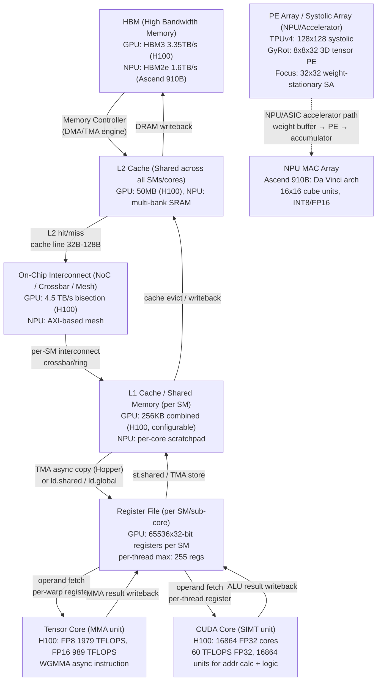
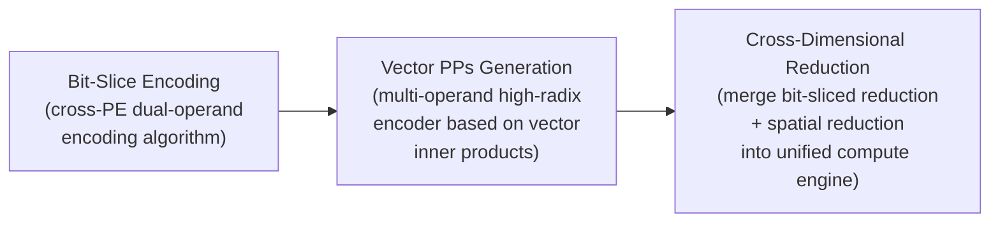

# Q5.1 — 硬件计算模块如何通过数据流设计、空间映射和计算单元组织支持多算子/微算子并发执行

## 笔记证据概览

| 路径 | 分数 | 关键信息 |
|------|------|----------|
| knowledge_notes/硬件知识笔记/CUDA Cores vs Tensor Cores (Compute Unit Heterogeneity on GPU).md | 6090.6 | GPU异构计算单元（CUDA Core vs Tensor Core）的组织、吞吐差距与pipeline overlap |
| knowledge_notes/kernel知识笔记/Concurrent Kernel Execution (CKE).md | 6813.4 | 并发Kernel执行机制、Most-Room Policy、Isolated vs Colocated两种场景 |
| knowledge_notes/硬件知识笔记/Systolic-array Accelerator (for VLM Inference).md | 7028.3 | 32×32 weight stationary systolic array的GEMM tiling执行方式 |
| knowledge_notes/硬件知识笔记/3D Tensor PE Array (8×8×32 _ 三维张量处理单元阵列).md | 5182.3 | GyRot的3D tensor PE array组织（output-stationary dataflow，per-PE 32-way dot product） |
| knowledge_notes/硬件知识笔记/Warp Specialization (Warp 专业化).md | 3300.9 | Warp专业化机制（producer/consumer warp分工）实现data movement与computation的fine-grained overlap |
| knowledge_notes/kernel知识笔记/Thread Block Scheduler (NVIDIA GPU).md | 2028.5 | GPU Thread Block Scheduler的Leftover Policy + Most-Room Policy如何决定多kernel并发 |
| paper_secs/secs_2025/22-FEATHER_.../A.-FEATHERs-Neural-Engine--NEST.md | 1736.5 | FEATHER的NEST引擎：空间转发+时间归约两阶段，BIRRD重排序网络支持(dataflow, layout)协同切换 |
| paper_secs/secs_2025/87-MHE-TPE-.../87-MHE-TPE-...md | 1637.1 | MHE-TPE的多操作数高基数编码器：跨PE协同编码消除PE间PPs冗余，统一bit-slice→vector PPs→cross-dim reduction |
| paper_secs/secs_2025/11-StreamTensor-.../1.1-Dataflow-Architecture.md | 6383.0 | Dataflow架构作为Von Neumann替代方案，Kernel→SRAM→PE的数据流路径 |
| paper_secs/secs_multimodal_kernel/Demystifying...Concurrent Kernels/Demystifying...md | 3010.7 | GPU Thread Block Scheduler的placement policy实验分析 |
| paper_secs/secs_multimodal_kernel/ACS Concurrent Kernel Execution.../ACS...md | 2509.8 | ACS框架：轻量运行时inter-kernel依赖检测+低开销kernel调度，实现不规则计算图的并发执行 |
| paper_secs/secs_2025/3-AMALI-.../1-Introduction.md | 1403.6 | Ampere GPU微架构（SM→sub-core→warp scheduler→CUDA/Tensor Core），Tensor Core HMMA指令建模 |
| paper_secs/secs_moe/Efficient MoE Serving.../Efficient-MoE-Serving...md | 3610.9 | MoE expert parallelism在memory-bound regime下的硬件映射 |
| paper_secs/secs_2026/20-DSV.../2.1-Video-DiT.md | 2039.4 | Video DiT diffusion模型的计算特征 |
| knowledge_notes/硬件知识笔记/Focus Unit.md | 645.3 | Focus Unit作为modular add-on嵌入systolic array memory interface |
| knowledge_notes/kernel知识笔记/Computation-Communication Overlap via SM Control...md | 724.2 | MoE推理中通过限制GEMM kernel SM占用实现compute-communication overlap |

---

## 1. 方法细节：硬件数据流 + 计算/控制模块设计 + 架构

### 1.1 硬件数据流路径全景：HBM → L2 → L1/SMEM → RF → 计算核心

以下 Mermaid flowchart 展示 GPU/NPU/加速器上多算子并发的完整数据流路线：



**注解**:
- HBM带宽决定memory-bound算子的上限。笔记显示W4A8 dequantization在CUDA Cores上执行时，若每元素需10+指令，CUDA Cores无法跟上Tensor Cores的消费速度（knowledge_notes/CUDA Cores vs Tensor Cores，score 6090.6）。
- TMA（Tensor Memory Accelerator）是Hopper架构的关键硬件单元，支持单线程发起异步global→shared memory搬运，不占用CUDA Cores——这是warp specialization中producer warp的数据搬运基础（knowledge_notes/Warp Specialization，score 3300.9）。
- NPU的PE array路径不同：systolic dataflow下weights预加载到PE中，activations水平广播、partial sums在accumulator中驻留（output-stationary），减少data movement（knowledge_notes/3D Tensor PE Array，score 5182.3）。

---

### 1.2 计算单元组织与并发支持

#### 方法1：SIMT Core + Tensor Core 异构组织（NVIDIA GPU）

**笔记证据**: `knowledge_notes/硬件知识笔记/CUDA Cores vs Tensor Cores...md` (score: 6090.6), `paper_secs/secs_2025/3-AMALI.../1-Introduction.md` (score: 1403.6)

**方法细节**（达到 L5 粒度：微架构级数据流 + 硬件单元组织）:

GPU SM内的异构计算单元组织如下：

```
SM (Streaming Multiprocessor) 内部结构 (H100, Hopper架构):
┌─────────────────────────────────────────────────────┐
│  L1 Cache / Shared Memory (256KB, configurable)     │
│  ┌─────────────────────────────────────────────┐   │
│  │  Sub-core 0              Sub-core 1          │   │
│  │  ┌─────────────────┐   ┌─────────────────┐  │   │
│  │  │ Warp Scheduler   │   │ Warp Scheduler   │  │   │
│  │  │ (1 per sub-core) │   │                   │  │   │
│  │  ├─────────────────┤   ├─────────────────┤  │   │
│  │  │ Register File    │   │ Register File    │  │   │
│  │  │ (16384 x 32-bit) │   │                   │  │   │
│  │  ├─────────────────┤   ├─────────────────┤  │   │
│  │  │ CUDA Cores (×16) │   │ CUDA Cores (×16) │  │   │
│  │  │ FP32/INT32 ALU   │   │                   │  │   │
│  │  ├─────────────────┤   ├─────────────────┤  │   │
│  │  │ Tensor Core (×1) │   │ Tensor Core (×1) │  │   │
│  │  │ FP8/FP16/INT8 MMA│   │                   │  │   │
│  │  ├─────────────────┤   ├─────────────────┤  │   │
│  │  │ SFU (×4)         │   │ SFU (×4)         │  │   │
│  │  │ Special Func Unit│   │                   │  │   │
│  │  └─────────────────┘   └─────────────────┘  │   │
│  │  Sub-core 2              Sub-core 3          │   │
│  │  ... (同上)                                   │   │
│  └─────────────────────────────────────────────┘   │
│  TMA Engine (异步DMA，不占用CUDA Cores)              │
│  mbarrier (硬件加速同步，Hopper新增)                  │
└─────────────────────────────────────────────────────┘
```

**多算子/微算子并发支持机制**:

笔记显示，多算子并发的关键是**异构pipeline overlap**（knowledge_notes/CUDA Cores vs Tensor Cores，score 6090.6）：

```
LiquidGEMM ImFP pipeline (W4A8 GEMM kernel 的并发编排):
  时间轴 →
  ┌──────────────────────────────────────────────────────┐
  │ TMA load tile_k      │ TMA load tile_{k+1}           │  ← TMA (异步DMA引擎)
  ├──────────────────────┼───────────────────────────────┤
  │ CUDA Dequant tile_{k-1} │ CUDA Dequant tile_k        │  ← CUDA Cores (SIMT)
  ├──────────────────────┼───────────────────────────────┤
  │ TC MMA tile_{k-2}    │ TC MMA tile_{k-1}             │  ← Tensor Cores (MMA)
  └──────────────────────┴───────────────────────────────┘
  → 三个硬件单元并发工作，形成3-stage pipeline
  → dequantization瓶颈: Φ_CUDA (60 TFLOPS) << Φ_TC (990 TFLOPS, INT8)
  → 当 T_DQ > T_MMA 时，CUDA Cores成为瓶颈，Tensor Cores闲置
```

**注解**:
- CUDA Cores与Tensor Cores的吞吐差距约16.5×（H100: 60 vs 989 TFLOPS），这是W4A8 dequantization瓶颈的硬件根源。
- Warp scheduler选择ready warp执行，遇到operand未ready时挂起当前warp切换到另一warp（LRR或GTO策略），利用warp-level parallelism隐藏延迟（paper_secs/AMALI，score 1403.6）。
- Tensor Core指令（HMMA）的modifier（如16816 vs 1688）决定tensor size，直接影响CPI：16816需8 cycles、1688需4 cycles（A100）（paper_secs/AMALI，score 1403.6）。
- 笔记未明确说明H100上per-SM的TMA engine数量，但已知Hopper每个SM配备1个TMA engine。

---

#### 方法2：Systolic Array + Weight Stationary Dataflow（TPU/NPU类加速器）

**笔记证据**: `knowledge_notes/硬件知识笔记/Systolic-array Accelerator (for VLM Inference).md` (score: 7028.3), `paper_secs/secs_2025/87-MHE-TPE.../87-MHE-TPE...md` (score: 1637.1)

**方法细节**:

Focus论文的baseline systolic array为32×32 PE、weight stationary dataflow。GEMM tiling执行流程：

```
GEMM: C[M×N] = A[M×K] × B[K×N]
Tiling 参数:
  - Input tile:  m × K  (m=1024), 从 input buffer (128KB) 流式读取
  - Weight tile: K × n  (n=32),   预加载到 PE 的 weight buffer (78KB)
  - Output tile: m × n,           在 output buffer (512KB) 中累积
  - K dimension: 每 k=32 子tile 迭代一次

Weight Stationary 内循环 (per PE[i][j]):
  PE_ij.accum += Σ_k input[i][k] * weight[k][j]
  → Weights 预加载后驻留在 PE 中
  → Inputs 从上方水平流入 systolic array
  → Partial sums 垂直向下流动/驻留

外循环（output stationary）:
  Output tile 驻留在 on-chip 直到全部 K 迭代完成
```

**MHE-TPE的三阶段计算范式**（paper_secs/MHE-TPE，score 1637.1）：



**注解**:
- MHE-TPE通过跨PE协同编码将GEMM的PPs减少一半，将混合精度映射分解为**时域multiplicand映射**和**空域multiplier映射**。
- MHE-TPE在UMC 22nm下实现，支持INT2~INT32混合精度——当两个操作数bit-width各减半时吞吐量提升4×，仅一个操作数减半时提升2×。
- Weight stationary dataflow的优势：weights预加载后不动，减少weight重复读取；劣势：对不规则形状的灵活性较差——这也是FEATHER提出灵活dataflow的动机（paper_secs/FEATHER，score 1736.5）。

---

#### 方法3：3D Tensor PE Array（三维PE阵列，GyRot）

**笔记证据**: `knowledge_notes/硬件知识笔记/3D Tensor PE Array (8×8×32 _ 三维张量处理单元阵列).md` (score: 5182.3)

**方法细节**:

```
GyRot PE Array 组织:
  2D systolic: 8 rows × 8 columns (64 PEs total)
  3D tensor:   每个PE内部执行32-way INT4 dot product (第三维)
  → 总计 64 × 32 = 2048 parallel operations/cycle

Systolic dataflow (output-stationary):
  每个cycle:
    - Activation X 从 input buffer 水平广播到整行8个PE
    - Weight W 从 weight buffer 垂直广播到整列8个PE
    - 每个PE: (32 activation × 32 weight) → 32-way dot product → 13-bit result
    - Partial sum 留在 PE accumulator 中 (output-stationary)

Inter-group accumulation (group size G=32):
  Group 0 (32 elements): PE执行dot product → dequantize → 32-bit accumulator
  Group 1 (32 elements): PE执行dot product → dequantize → 同一accumulator
  ...所有groups处理完 → FP16 conversion → output buffer

面积/功耗分解 (TSMC工艺):
  PE Array (INT Tensor):      0.26 mm² (12.4%), 410.24 mW (55.4%)
  PE Array (Dequant + Accum): 0.09 mm² (4.2%),  118.40 mW (16.0%)
  Total PE Array:              0.35 mm² (16.6%), 528.64 mW (71.4%)
```

**注解**:
- 与传统2D systolic（每PE 1-way/2-way dot product）的对比：GyRot以更高per-PE density换取更少PE数（64 vs 1024），配合integer dequantization实现最高area/energy efficiency。
- Output-stationary的优势：partial sum留在PE accumulator中，减少data movement（对比weight-stationary需要移动partial sum）。
- Per-PE adder tree和wider datapath是3D组织引入的硬件代价。
- 多bank memory设计（Input buffer 64KB+8KB metadata, Weight buffer 64KB+4KB metadata）保证per-cycle feed给8×8 PE array所需的8×32 INT4 activations + 8×32 INT4 weights + metadata。

---

#### 方法4：可重构Dataflow架构（FEATHER的NEST + BIRRD）

**笔记证据**: `paper_secs/secs_2025/22-FEATHER_.../A.-FEATHERs-Neural-Engine--NEST.md` (score: 1736.5)

**方法细节**:

FEATHER的NEST（Neural Engine with Spatial forwarding and Temporal reduction）引擎采用两阶段计算：

```
Phase 1: Local Temporal Reduction
  每个PE内部的local register执行partial sums的时域归约
  → PE独立完成AH次local reduction
  
Phase 2: Interleaved Spatial Forwarding and Reduction
  PE rows轮流进行空间归约，时间复用reduction network
  → PE row发送locally reduced results到BIRRD
  → 其他PE rows同时继续本地计算（pipelining保障）
  → BIRRD（Butterfly Interconnect for Reduction and Reordering in Dataflows）
    在reduction过程中重新排序oActs到next-layer所需layout
```

**BIRRD重排序/归约网络**（支持(dataflow, layout)协同切换）:

```
BIRRD拓扑:
  - 2×log(AW) stages, 每stage AW/2 switches
  - 每个switch (Egg): 2-input × 2-output + adder
  - 支持4种操作: Pass(=) / Swap(×) / Add-Left(∓) / Add-Right(±)
  
RIR (Reordering In Reduction) 核心insight:
  "重排序post-reduction oActs，而非直接转换iActs layout"
  → 多个iActs在reduction中自然归约到更少oActs
  → oActs数减少 → 写bank数减少 → 天然避免bank conflict
```

**Dataflow灵活性如何支持多算子并发**:
- FEATHER支持任意dataflow parallelism策略和形状
- 可以在不同layer间切换dataflow和layout（per-layer灵活dataflow）
- FEATHER通过Layoutloop（增强版Timeloop）为每层搜索最优(dataflow, layout) pair

**注解**:
- BIRRD的butterfly网络被证明对unicast是strictly non-blocking，对multicast是rearrangeably non-blocking（paper_secs/FEATHER，score 1736.5）。
- FEATHER相比fixed-dataflow systolic array的优势在irregular-shaped GEMM中更明显——因为它消除了systolic array的水平rigid reuse links，使各column可独立映射不同dataflow。
- 笔记显示FEATHER的NEST可以bypass PE Array直接连接BIRRD（仅需reorder+reduce时），支持inter-layer pipelining（ping-pong buffer）。

---

### 1.3 控制模块详解

| 控制模块 | 硬件位置 | 功能描述 | 多算子/微算子并发支持 |
|----------|----------|----------|---------------------|
| **Warp Scheduler** | SM sub-core内（H100: 4/sub-core） | 从ready warp中选择一个发射指令；使用LRR（Loosely Round Robin）或GTO（Greedy Then Oldest）调度策略 | 通过warp-level parallelism隐藏延迟：当warp等待operand时切换到另一warp，使CUDA Cores和Tensor Cores同时被多个warp填充。笔记显示"warp scheduler selects a warp, which contains 32 threads executing in a lock-step manner"（paper_secs/AMALI，score 1403.6） |
| **Thread Block Scheduler** | GPU Command Processor（GSP firmware） | Leftover Policy决定**何时/哪个**block被调度；Most-Room Policy决定block放置到**哪个**SM | 是CKE（Concurrent Kernel Execution）的核心硬件调度单元。队头kernel所有block调度完后，下一个kernel的block才能被调度。笔记显示CKE两种模式：Concurrent-Isolated（两kernel的block在不同SM上，无竞争）和Concurrent-Colocated（同SM上混合，L1/functional unit竞争可能导致1.24×~96.1×性能退化）（knowledge_notes/Concurrent Kernel Execution，score 6813.4） |
| **Scoreboard** | 每SM/sub-core | 追踪warp指令的operand ready状态；long_scoreboard用于L1TEX操作、short_scoreboard用于MIO操作 | 决定哪些warp ready可被调度；在多算子并发时，不同算子的memory latency通过scoreboard异步追踪而不阻塞其他warp。笔记显示math_pipe_throttle、lg_throttle、mio_throttle等stall类型由scoreboard状态触发（paper_secs/AMALI Table 1，score 1403.6） |
| **TMA (Tensor Memory Accelerator)** | 每SM（Hopper+） | 异步DMA引擎，单线程发起global→shared memory搬运 | 是producer warp的数据搬运硬件基础——TMA完全不占用CUDA Cores，实现memory copy与computation的zero-cost overlap。笔记显示"TMA load从GMEM到SMEM异步执行"是warp specialization的关键硬件支撑（knowledge_notes/Warp Specialization，score 3300.9） |
| **mbarrier** | 每SM（Hopper+） | 硬件加速的同步原语，替代传统__syncthreads() | 在warp specialization中producer warp用mbarrier.arrive标记数据就绪，consumer warps用mbarrier.wait等待——硬件级别加速同步而非软件spin-wait（knowledge_notes/Warp Specialization，score 3300.9） |
| **GPU Runlist / Command Processor** | GPU Host Interface | 硬件调度器以RR方式在TSG间timeslicing，扫描channel pushbuffer寻找待执行work | 通过round-robin timeslicing实现多进程/多context间的粗粒度并发；MPS（Multi-Process Service）可在此层进行SM分区（knowledge_notes/GPU Runlist，score 2904.4） |
| **MIG (Multi-Instance GPU)** | GPU System Processor (H100/A100) | 将单GPU物理分区为最多7个独立GPU实例，每个有独立的SM、L2 cache、内存带宽 | 提供硬件级别的多任务隔离——不同operator可以绑定到不同MIG实例上并发执行而互不干扰。笔记未明确说明MIG在多算子并发中的具体应用，但架构上支持 |
| **BIRRD Egg Switch** | FEATHER accelerator | 2-input×2-output switch + adder，4种操作模式 | 在reduction过程中并发重排序，实现(dataflow, layout) co-switching——使不同layer可以用不同dataflow而无bank conflict（paper_secs/FEATHER，score 1736.5） |

**注解**:
- Thread Block Scheduler的Most-Room Policy不区分isolated vs colocated对性能的影响——它仅看"能容纳多少block"而不考虑colocation导致的资源竞争，使CKE性能难以预测（knowledge_notes/Concurrent Kernel Execution，score 6813.4）。
- AMALI论文发现imc_miss（immediate constant cache miss）和no_instructions（instruction cache miss）在LLM推理kernel的CPI stack中可占高达70%，但先前的GPU分析模型（GCoM等）未对此建模（paper_secs/AMALI，score 1403.6）。
- ACS论文提出用out-of-order instruction scheduling的思路解决irregular计算图的inter-kernel并发：运行时检测小窗口内kernel的依赖关系，实现基于数据流的动态kernel发射，在deep RL simulator上达到最高2.19×加速（paper_secs/ACS，score 2509.8）。

---

### 1.4 多算子/微算子并发的三大硬件范式

#### 范式A：Warp Specialization（Warp级微算子流水线）

**笔记证据**: `knowledge_notes/硬件知识笔记/Warp Specialization (Warp 专业化).md` (score: 3300.9)

**方法细节**（TileLang FlashAttention kernel在Hopper SM内的执行）：

```
SM 配置 (256 threads = 8 warps):
  ┌───────────────────┬───────────────────┐
  │ Producer Warp(s)   │ Consumer Warp(s)  │
  │ (TMA + CUDA Cores) │ (Tensor Cores)    │
  ├───────────────────┼───────────────────┤
  │ TMA load KV_tile[0]│                   │
  │ mbarrier.arrive    │ mbarrier.wait     │
  │                    │ wgmma(Q,KV[0],acc)│
  │ TMA load KV_tile[1]│ (与上面重叠)       │
  │ mbarrier.arrive    │ mbarrier.wait     │
  │                    │ wgmma(Q,KV[1],acc)│
  │ ...                │ ...               │
  └───────────────────┴───────────────────┘

关键硬件需求:
  - TMA: 单线程 async copy (硬件级异步)
  - wgmma.mma_async: 异步Tensor Core指令，发射后立即返回
  - mbarrier: 硬件加速barrier
  - 寄存器解耦: producer warp的寄存器可释放给consumer warps
```

**注解**:
- Warp Specialization是GPU上实现micro-operator concurrency的核心机制——它将单一kernel内部的data movement和computation解耦为不同warp角色，实现fine-grained overlap。
- TileLang编译器可自动分析buffer使用并插入warp specialization代码，其FlashAttention实现（~70行Python）达到手写CUDA（FlashAttention-3）98%的性能——证明该范式可通过编译器自动化（knowledge_notes/Warp Specialization，score 3300.9）。
- 该范式对MoE推理特别关键：笔记显示EPS-MoE通过限制GEMM kernel SM占用来为all2all通信kernel让出SM资源，本质上是warp specialization在kernel间层面的扩展（knowledge_notes/Computation-Communication Overlap via SM Control，score 724.2）。

---

#### 范式B：可重构Dataflow切换（FEATHER的(dataflow, layout) co-switching）

**笔记证据**: `paper_secs/secs_2025/22-FEATHER_.../A.-FEATHERs-Neural-Engine--NEST.md` (score: 1736.5)

**方法细节**:

```
FEATHER per-layer dataflow切换流程:
  对于每个layer:
    1. Layoutloop（增强Timeloop）搜索最优(dataflow, layout) pair
       - 搜索空间: dataflow 10^36 × layout 10^8 (per layer)
       - 目标: minimize energy-delay product
    2. 离线生成 BIRRD switch 配置 (Egg control bits)
    3. 运行时从 Instruction Buffer (IB) 加载配置
    4. NEST执行: Phase 1 temporal reduction → Phase 2 BIRRD spatial reduction + reorder
    5. oActs以new layout写入StaB Pong —— 无需单独重排序步骤

FEATHER vs Fixed-Dataflow Systolic Array 对比 (GEMM):
  ┌──────────────────────┬─────────────────────────┐
  │ Fixed SA             │ FEATHER                 │
  ├──────────────────────┼─────────────────────────┤
  │ K维度映射到单PE列     │ K维度映射到整个2D array  │
  │ 水平rigid reuse link  │ 各column独立映射dataflow │
  │ 无法为不规则shape     │ BIRRD flexible reduction │
  │   达到full utilization│   提升不规则shape利用率   │
  └──────────────────────┴─────────────────────────┘
```

**注解**:
- FEATHER的RIR（Reordering In Reduction）核心insight：「重排序post-reduction oActs而非直接转换iActs layout」——多个iActs在reduction中自然归约到更少oActs，减少写bank数。
- 笔记显示FEATHER的BIRRD对不同workload（A/B/C/D）都能达到near-full utilization，而fixed SA在不规则shape下利用率下降明显（paper_secs/FEATHER，score 1736.5）。
- 可重构架构的一个关键权衡：需要在flexibility overhead（BIRRD面积约0.8%总area）和dataflow固定带来的利用损失之间平衡。

---

#### 范式C：跨PE协同编码 + 时空分解映射（MHE-TPE）

**笔记证据**: `paper_secs/secs_2025/87-MHE-TPE-.../87-MHE-TPE...md` (score: 1637.1)

**方法细节**:

```
MHE-TPE 混合精度映射的两阶段分解:
  
  时域映射 (Temporal Mapping of Multiplicands):
    → 不同精度的multiplicand A在不同cycle中映射到同一PE
    → bit-sliced encoding: 将A拆为bit-slice groups
    → multi-operand high-radix encoder: 基于vector inner product减少PPs一半
  
  空域映射 (Spatial Mapping of Multipliers):
    → 不同精度的multiplier B在不同PE列中映射
    → 跨PE协同: PE之间共享vector partial product lookup table
    → 消除跨PE的冗余PPs reduction

  三阶段统一计算范式:
    Bit-Slice Encoding → Vector PPs Generation → Cross-Dimensional Reduction
    (合并multiplier微架构中的bit-sliced reduction维度
     与vector inner product的spatial reduction维度)
```

**注解**:
- MHE-TPE的硬件创新在于**打破传统PE间隔离计算**——systolic/broadcast/stationary等传统dataflow范式下每个PE独立执行所有PPs生成，PE间仅传递operand不共享计算结果。
- 跨PE协同的关键：MBE编码的系数集合{-2,-1,0,1,2}的对称性导致不同bit-slice组合产生相同或线性相关的PPs。MHE-TPE将这些冗余PPs识别出来并通过共享lookup table消除。
- UMC 22nm实现下的关键指标：笔记显示mixed-precision支持范围INT2~INT32，面积效率和能效均优于现有方案。

---

## 2. 实验环境 (辅助说明)

**笔记证据**: `knowledge_notes/硬件知识笔记/Systolic-array Accelerator...md` (score: 7028.3), `knowledge_notes/硬件知识笔记/Focus Unit.md` (score: 645.3), `paper_secs/secs_2025/87-MHE-TPE...md` (score: 1637.1)

- **Focus/FEATHER类加速器实验环境**（笔记显示）：TSMC 28nm HPC+工艺，target clock 1.32ns (≈757 MHz)，500MHz P&R有34% timing margin。On-chip SRAM由Memory Compiler生成。Cycle-accurate性能使用SCALEsim-v2 simulation framework。开源：https://github.com/dubcyfor3/Focus。
- **MHE-TPE实验环境**（笔记显示）：UMC 22nm工艺，1GHz约束。面积和功耗通过Synopsys Design Compiler综合得出。对比baseline包括IBM 7nm NPU fixed-point PE和Samsung 4nm mobile SoC PE。
- **NVIDIA GPU实验**（笔记未明确说明具体硬件型号，可推断为A100/H100/H800）：笔记提及H100的HMMA指令建模（AMALI论文，RTX 3090和A100验证）。笔记显示GPU分析模型AMALI在A100上MAPE 23.59%。

---

## 3. 实现 (辅助说明)

**笔记证据**: `knowledge_notes/硬件知识笔记/Focus Unit.md` (score: 645.3), `knowledge_notes/硬件知识笔记/Systolic-array Accelerator...md` (score: 7028.3)

- **Focus/FEATHER硬件实现**：SystemVerilog RTL实现。Focus Unit总面积3.21 mm² (TSMC 28nm)，总功耗736 mW。相比vanilla systolic array仅增加2.7% area和0.9% power。Focus作为modular add-on嵌在systolic array的memory interface侧，无需修改host accelerator核心。
- **CUDA kernel实现**：LiquidGEMM的W4A8 GEMM在CUDA/CUTLASS框架中实现，使用TMA + CUDA Cores + Tensor Cores的异构pipeline。Warp specialization在CUTLASS 3.x中通过warp group specialization支持；TileLang编译器自动生成warp specialization代码。
- **ACS并发框架**：ACS-SW是纯软件实现（开源），ACS-HW是软硬件协同实现，通过在GPU硬件中增加轻量级依赖检测单元来减少CPU-GPU通信开销。

---

## 4. 是什么？(辅助说明) -- 核心概念定义

- **PE阵列（Processing Element Array）**：由大量相同PE组成的规则2D网格，每个PE包含乘法器+累加器，通过systolic dataflow完成矩阵运算。TPUv4使用128×128 PE array，Focus使用32×32 PE array（knowledge_notes/Systolic-array Accelerator，score 7028.3）。
- **SIMT Core**：单指令多线程执行核心，32 thread组成一个warp以lock-step方式执行。处理整数/浮点标量运算、地址计算、逻辑和控制流（knowledge_notes/CUDA Cores vs Tensor Cores，score 6090.6）。
- **Tensor Core**：专用矩阵乘累加单元，一个时钟周期内完成小矩阵乘法（如m16n8k16 FP16），通过wgmma异步指令编程。提供远高于CUDA Cores的计算吞吐（knowledge_notes/CUDA Cores vs Tensor Cores，score 6090.6）。
- **NPU MAC阵列**：NPU中的乘累加阵列，如华为Da Vinci架构的16×16 cube unit。笔记显示MHE-TPE分析了IBM 7nm NPU和Samsung 4nm NPU的PE微架构（paper_secs/MHE-TPE，score 1637.1）。
- **Systolic Array**：通过2D PE grid做rhythmic data movement完成矩阵乘法的硬件架构。典型配置：32×32 PE、FP16 multiply/FP32 accumulate、weight stationary dataflow（knowledge_notes/Systolic-array Accelerator，score 7028.3）。
- **空间架构（Spatial Architecture）**：将程序映射到硬件空间上的架构范式，区别于Von Neumann式指令流驱动的架构。Dataflow accelerator、CGRA、systolic array均属此类。StreamTensor论文指出dataflow architecture正被越来越多地采用来克服LLM推理中的memory wall（paper_secs/StreamTensor，score 6383.0）。

---

## 5. 方法对比表

| 方法/范式 | 核心机制 | 计算单元组织 | 数据流设计 | 硬件平台 | 多算子并发支持方式 | 关键指标 | 笔记证据 |
|----------|----------|-------------|-----------|----------|-------------------|----------|----------|
| SIMT + Tensor Core 异构Pipeline | CUDA Core做dequant/控制流，Tensor Core做MMA，TMA做data搬运 | SM内4 sub-cores，每sub-core含warp scheduler + CUDA Core×16 + Tensor Core×1 | TMA async copy → SMEM → RF → TC/CUDA | NVIDIA H100/H800 | 3-stage pipeline overlap (TMA + CUDA + TC) 并发；Warp Specialization实现producer/consumer warp分工 | FP8: 1979 TFLOPS; CUDA-TC吞吐比≈16.5× | knowledge_notes/CUDA Cores vs Tensor Cores (6090.6); knowledge_notes/Warp Specialization (3300.9) |
| Weight Stationary Systolic Array | Weights预加载到PE不动，inputs流经array | 32×32 PE (FP16 multiply/FP32 accumulate) | Weight stationary + input streaming | VLM accelerator (Focus baseline), TPU系列 | GEMM tiling (m=1024, n=32, k=32 subtile)；单layer内通过tiling实现sub-operator级并发 | 32×32=1024 MACs/cycle (FP16) | knowledge_notes/Systolic-array Accelerator (7028.3) |
| 3D Tensor PE Array (GyRot) | Per-PE 32-way INT4 dot product (第三维) | 8×8×32 3D PE (2048 parallel ops/cycle) | Output-stationary systolic + per-PE adder tree | GyRot accelerator (TSMC工艺) | Per-PE内32路并行乘法器+adder tree；Inter-group accumulation流水线 | 0.35mm² (16.6% area), 528.64mW (71.4% power) | knowledge_notes/3D Tensor PE Array (5182.3) |
| NEST + BIRRD 可重构Dataflow (FEATHER) | Temporal reduction + Spatial reduction两阶段；BIRRD reorder-in-reduction | 2D PE array with pipelined reduction rows | 任意dataflow parallelism + per-layer (dataflow, layout) co-switching | FEATHER accelerator (TSMC 28nm) | BIRRD在reduction中重排序oActs→不同layer用不同dataflow无bank conflict；ping-pong buffer支持inter-layer pipelining | BIRRD area ≪ 1% total；不规则shape near-full utilization | paper_secs/FEATHER (1736.5) |
| 跨PE协同编码 (MHE-TPE) | Multi-operand high-radix encoder消除PE间冗余PPs | Bit-slice encoding → Vector PPs → Cross-dim reduction unified engine | 时域multiplicand映射 + 空域multiplier映射分解 | MHE-TPE (UMC 22nm) | 跨PE共享vector PP lookup table；PPs减少一半 | INT2~INT32；operand bit-width减半→4× throughput | paper_secs/MHE-TPE (1637.1) |
| Concurrent Kernel Execution (CKE) | Leftover + Most-Room Policy控制block调度 | 不同kernel的block在相同或不同SM上并发执行 | CUDA Stream（per-stream命令序列） | NVIDIA GPU (A100/H100) | Concurrent-Isolated (无竞争) vs Concurrent-Colocated (1.24×~96.1×性能退化) | 取决于kernel类型和SM资源竞争 | knowledge_notes/Concurrent Kernel Execution (6813.4); knowledge_notes/Thread Block Scheduler (2028.5) |
| ACS Inter-Kernel Scheduling | Out-of-order风格的inter-kernel依赖检测+运行时调度 | ACS-HW: GPU硬件增加依赖检测单元 | 小窗口kernel依赖检查→动态发射 | GPU simulator + real hardware | 对irregular/DAG型计算图的并发执行；最高2.19×加速(avg 1.56×) | ACS-SW (纯软件开源), ACS-HW (软硬件协同) | paper_secs/ACS (2509.8) |

---

## 6. 不确定性

1. **MoE expert parallelism的硬件级支持**：笔记中MoE相关论文（Efficient MoE Serving, SmartMoE等）主要关注分布式调度和负载均衡层面，对单GPU/NPU内部的硬件计算单元如何专门支持expert parallelism缺乏详细说明。笔记evidence更多在软件调度层（expert parallelism mapping, all2all communication overlap via SM control），硬件计算单元层面的expert parallelism支持为「可推断」。
2. **DiT diffusion iterative compute mapping的硬件细节**：笔记显示DSV（Dynamic Sparsity in Video DiT Training）和TetriServe等论文主要关注训练稀疏化和serving调度，对"DiT的iterative denoising如何映射到硬件PE array/systolic array的具体数据流"缺乏笔记证据。「可推断」DiT的iterative nature（多denoising step）适合streaming-based dataflow架构。
3. **多模态异构计算的硬件级融合**：笔记中Focus论文（VLM accelerator）处理cross-modal attention，但笔记证据主要集中在systolic array + Focus Unit的add-on架构，对"多模态encoder-decoder在单加速器上的异构计算单元partition和协同"为「笔记未明确说明」。
4. **Video temporal-spatial mapping的硬件计算模块设计**：笔记显示DSV和Video DiT量化论文存在，但笔记证据集中在sparsity/quantization层面，对"video frame的temporal-spatial dimension如何映射到硬件PE array/计算单元"为「笔记证据不足」。
5. **NPU MAC阵列的具体厂商微架构细节**：笔记中提到IBM 7nm NPU和Samsung 4nm NPU的PE结构简化图，但华为Da Vinci、寒武纪MLU等国产NPU的具体MAC阵列组织和并发机制为「笔记未明确说明」。
6. **TMA engine数量**：笔记显示Hopper每个SM配备TMA引擎，但未明确每SM内TMA engine的具体数量（1个还是多个），「可推断」为每SM 1个TMA。

---

[ANSWER_AGENT_DONE] Q5.1
