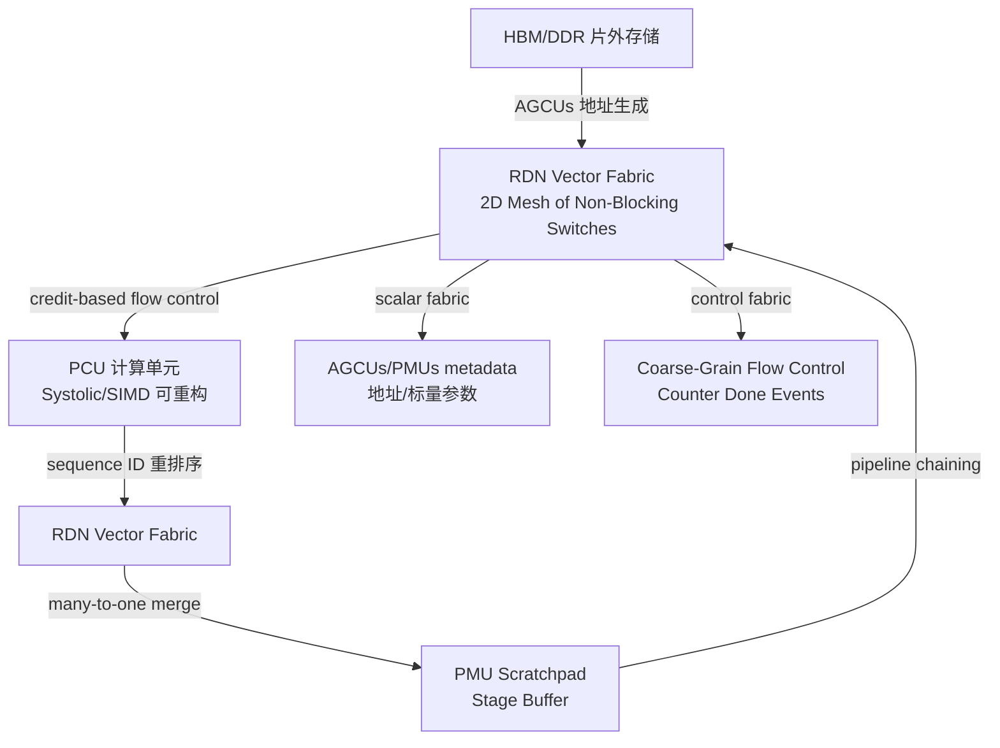
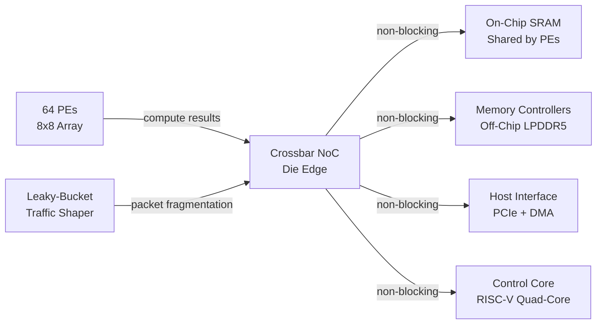
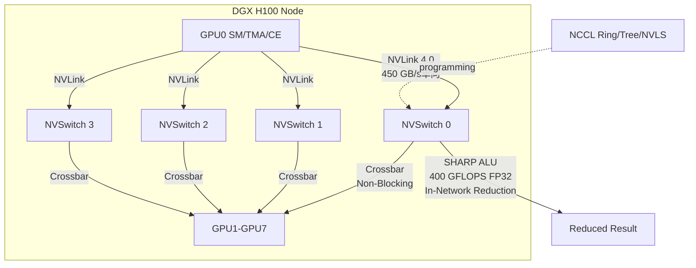
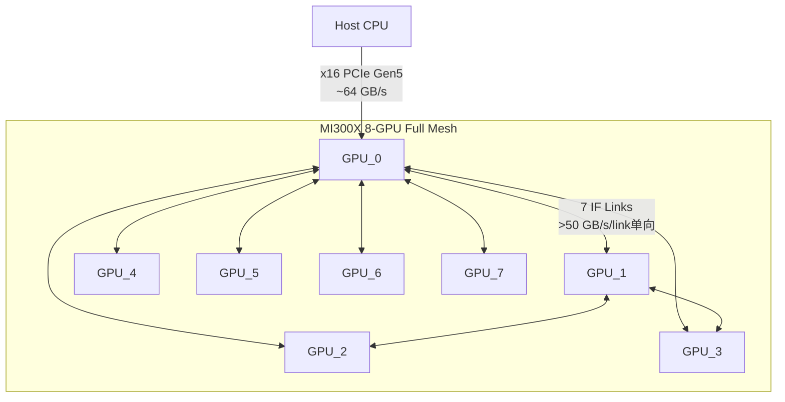
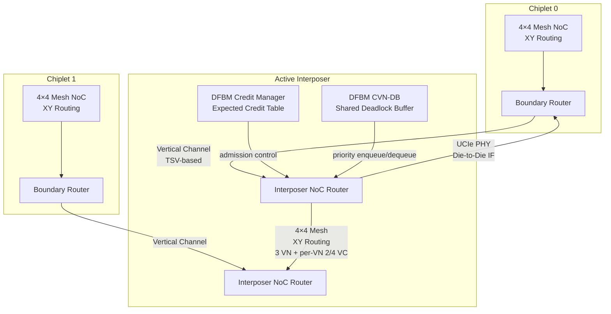
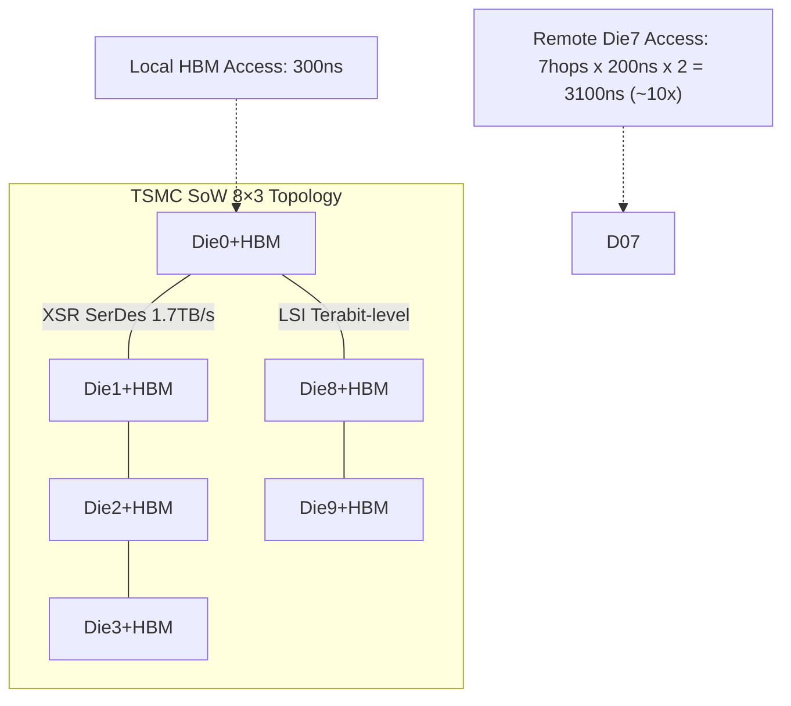
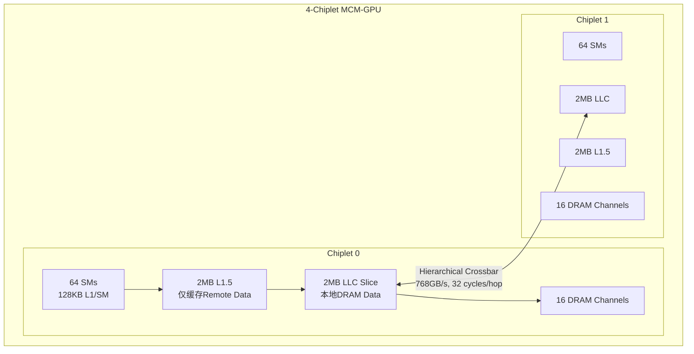

# Q5.3 — 片上网络与片间互联架构方法：支撑 MoE/DiT/多模态/Video 多算子微算子并发的高带宽低延迟通信

## 笔记证据概览

| 路径 | 分数 | 关键信息 |
|------|------|----------|
| knowledge_notes/硬件知识笔记/Reconfigurable Dataflow Network (RDN).md | 10192.4 | 2D mesh of non-blocking switches，三 fabric 分离，credit-based flow control，multicast |
| knowledge_notes/硬件知识笔记/NVLink _ NVSwitch (GPU Interconnect).md | 6941.0 | NVLink 450-900 GB/s，NVSwitch 3.2 TB/s all-to-all，SHARP in-network reduction |
| knowledge_notes/硬件知识笔记/NVLink (GPU-to-GPU Interconnect).md | 5462.5 | MoE all-to-all token exchange via NVLink，600 GB/s bidirectional |
| knowledge_notes/芯片知识笔记/Open Chiplet Ecosystem and Inter-Chiplet Deadlock.md | 3299.6 | UCIe die-to-die，active interposer，DFBM deadlock avoidance |
| paper_secs/.../61-Deadlock-Free Bridge.../A.-Chiplet-Ecosystem.md | 5540.0 | UCIe standardization，CoWoS，passive vs active interposer，MTR/DeFT/RC comparison |
| knowledge_notes/硬件知识笔记/2D Mesh NoC in 3D Near-Memory Processing.md | 39.5 | XY routing，Manhattan distance，all-to-all dispatch/combine over NoC |
| knowledge_notes/芯片知识笔记/AMD Infinity Fabric (GPU Interconnect).md | 3650.9 | Full mesh 8-GPU topology，7 links/GPU，no external switch |
| paper_secs/.../48-Meta_s Second Generation AI Chip.../ | 1156.2 | 8×8 PE array，crossbar NoC，non-blocking，leaky-bucket traffic shaping |
| knowledge_notes/硬件知识笔记/Reconfigurable Dataflow Unit (RDU).md | 8431.4 | SN40L RDU tile 架构，PCU/PMU/AGCUs 通过 RDN 互联，三级存储 |
| knowledge_notes/芯片知识笔记/Active Interposer.md | 66.0 | 4×4 mesh + XY routing + 3 VN，virtual cut-through flow control，UCIe PHY |
| knowledge_notes/芯片知识笔记/Multi-Chiplet GPU (MCM-GPU) Architecture.md | 143.5 | Concentrated hierarchical crossbar，768 GB/s，32 cycles/hop |
| knowledge_notes/芯片知识笔记/System-on-Wafer (SoW) Technology.md | 797.1 | 8×3 mesh，LSI + XSR SerDes，1.7 TB/s D2D，200 ns/hop |
| knowledge_notes/硬件知识笔记/gem5_Garnet Multi-Chiplet NoC Simulation Framework.md | 34.4 | Cycle-accurate NoC model，credit-based flow control，RC/VA/SA/ST/LT pipeline |
| knowledge_notes/芯片知识笔记/Channel Dependency Graph (CDG) for Multi-Chiplet NoC.md | 202.5 | CDG 死锁充要条件，跨 chiplet 循环依赖，escape VC，turn restriction |
| knowledge_notes/硬件知识笔记/3D Near-Memory Processing (3D NMP) for MoE LLM Inference.md | 278.4 | 3D NMP 2D mesh NoC，distributed memory，expert dispatch/combine |
| paper_secs/.../61-Deadlock-Free Bridge.../VII.-EVALUATION.md | 2745.3 | 4×4 mesh chiplet + interposer，XY routing，synthetic traffic evaluation |
| paper_secs/.../27-CoCoTree.../IX.-DISCUSSION.md | 529.7 | Hierarchical binary tree，in-network computation，collective communication |
| paper_secs/.../22-FEATHER.../A.-FEATHERs-Neural-Engine--NEST.md | 1869.5 | Fat-tree/crossbar/Benes distribution NoC vs pt-to-pt，systolic array 对比 |
| paper_secs/.../62-SCAR.../SCAR-Scheduling-Multi-Model... | 12414.9 | Network-on-package (NoP)，multi-chiplet scheduling，heterogeneous chiplets |
| paper_secs/.../MixNet.../MixNet A Runtime Reconfigurable... | 1583.0 | Runtime reconfigurable optical-electrical fabric，fat-tree comparison |

---

## 检索上下文映射

### S1: MoE/DiT/多模态/Video 负载 → 通信模式特征
- `knowledge_notes/硬件知识笔记/NVLink (GPU-to-GPU Interconnect).md` (score: 5462.5): MoE All-to-All token scatter + gather，每个 GPU 的 tokens 按 gating 决策发送到持有对应 expert 的 GPU
- `knowledge_notes/硬件知识笔记/2D Mesh NoC in 3D Near-Memory Processing.md` (score: 39.5): Inter-Expert Communication (EP 模式下 all-to-all token dispatch/combine)；Intra-Expert Communication (TP 模式下 all-reduce)
- `knowledge_notes/硬件知识笔记/3D Near-Memory Processing (3D NMP) for MoE LLM Inference.md` (score: 278.4): Token dispatch → NoC 路由到 expert 节点 → FFN 计算 → all-to-all combine

### S2: 多算子/微算子并发 → 互联通信挑战
- `knowledge_notes/硬件知识笔记/Reconfigurable Dataflow Network (RDN).md` (score: 10192.4): 多 kernel 并发时 RDN 支持 one-to-many multicast 和 many-to-one 重排序
- `paper_secs/.../48-Meta_s Second Generation AI Chip...` (score: 1156.2): Non-blocking NoC architecture 最小化多 initiator 间的干扰，leaky-bucket 流量整形防止 burst 拥塞

### S3: 片上网络拓扑 → NoC/Mesh/Crossbar/Ring/Tree
- `knowledge_notes/硬件知识笔记/Reconfigurable Dataflow Network (RDN).md` (score: 10192.4): 2D mesh of non-blocking switches，三 fabric 分离
- `paper_secs/.../48-Meta_s Second Generation AI Chip...` (score: 1156.2): Crossbar-based NoC，8×8 PE array，3.3× bandwidth
- `knowledge_notes/芯片知识笔记/CoCoTree...` (score: 529.7): Hierarchical binary-tree interconnect + in-network computation
- `paper_secs/.../22-FEATHER...` (score: 1869.5): Fat-tree/crossbar/Benes 分布 NoC vs point-to-point 连接

### S4: 片间互联 → Chiplet/UCIe/Interposer/Die-to-Die
- `knowledge_notes/芯片知识笔记/Open Chiplet Ecosystem and Inter-Chiplet Deadlock.md` (score: 3299.6): UCIe die-to-die 接口标准化，active interposer，DFBM 死锁避免
- `knowledge_notes/芯片知识笔记/AMD Infinity Fabric (GPU Interconnect).md` (score: 3650.9): Full mesh 8-GPU，7 links/GPU，无外部 switch
- `knowledge_notes/芯片知识笔记/Multi-Chiplet GPU (MCM-GPU) Architecture.md` (score: 143.5): Concentrated hierarchical crossbar，768 GB/s
- `knowledge_notes/芯片知识笔记/System-on-Wafer (SoW) Technology.md` (score: 797.1): 8×3 mesh，LSI + XSR SerDes，1.7 TB/s D2D

### S5: 高带宽低延迟 → 流控/路由/集合通信优化
- `knowledge_notes/硬件知识笔记/NVLink _ NVSwitch (GPU Interconnect).md` (score: 6941.0): NVSwitch SHARP in-network reduction，400 GFLOPS FP32
- `knowledge_notes/硬件知识笔记/gem5_Garnet Multi-Chiplet NoC Simulation Framework.md` (score: 34.4): credit-based flow control，RC/VA/SA/ST/LT pipeline
- `knowledge_notes/芯片知识笔记/Channel Dependency Graph (CDG) for Multi-Chiplet NoC.md` (score: 202.5): wormhole routing，virtual channel，deadlock-free 条件

### S6: 关键方法和拓扑选择 → 综合对比
- `paper_secs/.../61-Deadlock-Free Bridge.../A.-Chiplet-Ecosystem.md` (score: 5540.0): MTR/DeFT/RC/UPP/Steered Bubble/DFBM 全方法对比表
- `paper_secs/.../MixNet...` (score: 1583.0): Runtime reconfigurable fabric vs fat-tree，cost efficiency 1.2×-2.3×

---

## 一、方法细节：数据流设计与互联架构

### 方法1: 2D Mesh NoC — 分布式计算单元间的规则网格互联

**笔记证据**: `knowledge_notes/硬件知识笔记/Reconfigurable Dataflow Network (RDN).md` (score: 10192.4)、`knowledge_notes/硬件知识笔记/2D Mesh NoC in 3D Near-Memory Processing.md` (score: 39.5)

**数据流设计**：



**注解**：
- RDN 是 SambaNova SN40L RDU 的片上互联核心，采用 2D mesh of non-blocking switches 拓扑，连接 1040 个 PCU + 1040 个 PMU + AGCUs
- **三 fabric 分离设计**是关键创新 — Vector fabric（packet-switched，tensor 数据主通道）、Scalar fabric（packet-switched，metadata）、Control fabric（circuit-switched，单比特线束），避免了数据/控制/标量流量相互干扰
- Credit-based per-hop flow control 防止生产者溢出消费者；end-to-end flow control 通过 software tokens + hardware credits 双重保障
- Sequence ID metadata field 支持 many-to-one 流量的乱序到达重排序 — PMU 使用 sequence ID 计算写地址将乱序 packet 归位
- 路由支持两种模式：动态 2D dimension order routing（运行时自适应）和软件配置 static flow routing（编译器 Place-and-Route 预计算）
- Multicast 通过 flow ID based fan-out 实现，支持一对多通信模式

**控制模块详解表**：

| 控制模块 | 功能描述 | 并发支持 |
|----------|----------|----------|
| RDN Switch (Non-Blocking) | 2D mesh 交叉点交换节点，连接东西南北四邻居 | 多 PCU 间并行 packet 传输，非阻塞架构消除 head-of-line blocking |
| Credit Manager | 逐跳 credit 计数，发送方仅在接收方有 credit 时发包 | 防止多源 burst 导致的 buffer overflow，支持多 kernel 并发流 |
| Flow ID Decoder | 解析 packet header 中的 flow ID，查表确定路由路径 | Static flow routing 支持确定性延迟，dynamic routing 适应拥塞 |
| Sequence ID Reorder Buffer (PMU) | 多源 many-to-one 场景按 sequence ID 恢复逻辑顺序 | 支持多个 producer PCU 同时向同一 consumer PMU 发送，无需全局 barrier |
| Packet Throttling Controller | 可编程限速，软件控制 packet 注入速率 | 减少 bursty traffic 导致的瞬时拥塞，平滑多算子并发流量 |
| Performance Counter | Switch 中计数 stall cycles，识别 RDN 拥塞热点 | 为编译器反馈优化提供硬件观测数据 |

### 方法2: Crossbar NoC — 商业加速器中的非阻塞全互联

**笔记证据**: `paper_secs/.../48-Meta_s Second Generation AI Chip.../Metas-Second-Generation-AI-Chip-Model-Chip-Co-Design-and-Productionization-Experiences.md` (score: 1156.2)

**数据流设计**：



**注解**：
- Meta MTIA 2i 采用 crossbar-based NoC 连接 64 个 PE（8×8 阵列），带宽相比第一代提升 3.3×，die 面积仅增加 1.13×
- **Non-blocking 架构**是多算子并发的核心保障 — 任意 initiator-target pair 之间的通信不会被其他 pair 阻塞，最小化多 PE 并发访问 SRAM/Memory 时的干扰
- **Leaky-bucket traffic shaping** + packet fragmentation 是关键的拥塞控制机制 — 平滑突发流量，防止单个 aggressive PE 的 burst 占据全部 NoC 带宽
- Flow control 在 source 端执行（而非 destination 端），从源头控制注入速率
- **适用场景**：中小规模 PE 阵列（≤64-128 PE），crossbar 的 O(N²) 面积开销在 N 较小时可接受；适用于推荐推理等计算密集+通信规律性较强的负载
- **笔记未明确说明** crossbar 的具体 radix 和每 port 带宽数值

### 方法3: NVLink + NVSwitch — GPU 间全互联交换网络

**笔记证据**: `knowledge_notes/硬件知识笔记/NVLink _ NVSwitch (GPU Interconnect).md` (score: 6941.0)、`knowledge_notes/硬件知识笔记/NVLink (GPU-to-GPU Interconnect).md` (score: 5462.5)

**数据流设计**：



**注解**：
- NVLink 5th-gen (B200): 900 GB/s 单向带宽 / link；NVLink 4th-gen (H100): 450 GB/s 单向
- NVSwitch (TSMC 4N, 64 port/颗, 3.2 TB/s 双向总带宽/颗) 实现 **all-to-all non-blocking switching** — 任何两 GPU 间单跳可达，消除 multi-hop 延迟
- **SHARP in-network reduction** (400 GFLOPS FP32) 在 switch 内部执行 reduce 操作（multimem.ld_reduce/multimem.red），数据不需要往返 GPU，大幅降低 all-reduce 通信量
- MoE 场景的关键使用模式：Expert parallelism 的 all-to-all token exchange 直接通过 NVLink + NVSwitch 完成，每个 GPU 同时与所有其他 GPU 双向通信
- **通信层次**：PCIe (64 GB/s, CPU↔GPU) < NVLink (450-900 GB/s, GPU↔GPU) < NVSwitch (3.2 TB/s aggregated, all-to-all switching) < NVSwitch SHARP (in-network reduction)
- 从 A100→B200：Tensor Core TFLOPS 提升 7.2×，HBM BW 提升 5.1×，但 NVLink BW 仅提升 3× — **通信成为瓶颈的硬件根源**（笔记显示）

### 方法4: AMD Infinity Fabric — 无外部交换芯片的全 Mesh 直连

**笔记证据**: `knowledge_notes/芯片知识笔记/AMD Infinity Fabric (GPU Interconnect).md` (score: 3650.9)

**数据流设计**：



**注解**：
- 与 NVLink/NVSwitch 的本质区别：Infinity Fabric **不需要外部 switch 芯片** — 每 GPU 配备 7 条 IF Link，直接连接其他 GPU 形成 full mesh 拓扑
- Full mesh 的数学性质：任意 GPU pair 单跳可达，延迟 <1μs；8 GPU 需要每 GPU 7 links（= N-1），总 link 数 = N(N-1)/2 = 28 条双向链路
- **编程透明性**：Iris 框架中开发者调用 `iris.load/store` 等 device-side API，GPU 硬件通过 IF 自动路由到目标 GPU HBM，kernel 代码无需显式管理 IF 链路
- **缺点**：不提供 in-network reduction（NVSwitch SHARP 的对应功能），reduction 需在 GPU 端完成；full mesh 的 O(N²) link 数限制了扩展到更大 N（>8）的经济性
- MI300X 每 link 单向 >50 GB/s（远低于 NVLink 4.0 的 450 GB/s），但通过更多 link 数（7 vs H100 的多 NVLink port）弥补

### 方法5: Active Interposer + DFBM — 开放芯粒生态中的死锁自由片间互联

**笔记证据**: `knowledge_notes/芯片知识笔记/Open Chiplet Ecosystem and Inter-Chiplet Deadlock.md` (score: 3299.6)、`knowledge_notes/芯片知识笔记/Active Interposer.md` (score: 66.0)、`paper_secs/.../61-Deadlock-Free Bridge.../A.-Chiplet-Ecosystem.md` (score: 5540.0)

**数据流设计**：



**注解**：
- **核心问题**：即使每个 chiplet 内部 NoC 是 deadlock-free 的，跨 chiplet-interposer-chiplet 的循环通道依赖（cyclic channel dependency）可导致死锁
- **DFBM 方案**：将 deadlock 处理逻辑外置到 interposer 侧的 bridge module，通过 credit-based admission control 保证 chiplet→interposer 方向有足够吸收能力，从根源消解 CDG 环形成条件
- Active interposer 使用 4×4 mesh + XY routing + 3 VN + per-VN 2/4 VC + virtual cut-through flow control
- **标准化意义**：chiplet 供应商只需提供少量协议参数（coherence state machine 依赖、最大 outstanding request 数、VC 数量），无需暴露或修改内部 NoC 细节 → 真正 "plug-and-play chiplet"
- **UCIe 标准**：定义 die-to-die physical layer 和 link layer（2025 年演进到 3.0，支持 64 GT/s），但不保证 deadlock-free — 需要 DFBM 这类架构级解决方案

**跨 Chiplet 死锁解决方案对比表**：

| 方案 | 死锁处理 | 拓扑无关 | 低集成开销 | 高可移植性 | Chiplet 标准化 | 机制 |
|------|----------|----------|------------|------------|----------------|------|
| **MTR** | 避免（turn restriction） | ✗ | ✓ | ✗ | ✓ | 在边界路由器禁止特定转向 |
| **DeFT** | 避免（VC isolation） | ✓ | ✗ | ✓ | ✓ | 上下行流量分配独立 VC |
| **RC** | 避免（injection control） | ✗ | ✗ | ✗ | ✗ | Chiplet 内专用 permission network |
| **UPP** | 恢复（允许死锁再恢复） | ✓ | ✗ | ✓ | ✗ | Escape channel + 死锁检测 |
| **Steered Bubble** | 恢复（允许死锁再恢复） | ✓ | ✓ | ✓ | ✗ | Directional bubble routing |
| **DFBM (本工作)** | 避免（credit-aware admission） | ✓ | ✓ | ✓ | ✓ | Credit management + shared deadlock buffer |

**笔记证据**: `paper_secs/.../61-Deadlock-Free Bridge.../A.-Chiplet-Ecosystem.md` (score: 5540.0, Table I)

### 方法6: SoW 晶圆级 2D Mesh — 极致规模的 Die-to-Die 互联

**笔记证据**: `knowledge_notes/芯片知识笔记/System-on-Wafer (SoW) Technology (晶圆级系统集成技术).md` (score: 797.1)

**数据流设计**：



**注解**：
- TSMC SoW 将 24 compute dies + 96 HBM dies 集成在单个晶圆上（>200,000 mm²），远超单 die photomask 限制（800-1,000 mm²）
- **二維互聯分層**：垂直方向（同列）用 LSI (Local Silicon Interconnect) 提供 terabit-level 带宽；水平方向（同行）用 XSR SerDes（超短距 SerDes，几毫米级）提供 1.7 TB/s D2D 带宽，延迟 200 ns/hop
- **NUMA 效应显著**：local HBM access 300 ns vs 远端 Die7 access 3100 ns（7 hops × 200 ns × 往返），差距 ~10×，最远可达 ~15×
- 对 MoE serving 的意义：可将完整 MoE 模型（200B-1000B 参数）容纳在单个晶圆上，消除跨机架/跨节点网络瓶颈，将瓶颈从 inter-node network 转移到 intra-wafer D2D communication
- 与 Dojo 5×5 mesh 对比：SoW 的矩形布局（8×3）使最大 Manhattan 距离更大（10 hops vs 8 hops），面对更严峻的 NUMA 挑战

### 方法7: MCM-GPU 层次化 Crossbar — 多芯粒 GPU 的片间互联

**笔记证据**: `knowledge_notes/芯片知识笔记/Multi-Chiplet GPU (MCM-GPU) Architecture _ 多芯粒GPU架构.md` (score: 143.5)

**数据流设计**：



**注解**：
- **Concentrated hierarchical crossbar** — 每个 chiplet 与其他所有 chiplet 直连，任意 chiplet pair 单跳可达，无需经过中间 chiplet 转发
- 关键性能参数：768 GB/s inter-chiplet bandwidth，32 cycles/hop latency
- **NUMA 缓解策略**：(1) 额外 L1.5 cache 层专门缓存 remote data；(2) First-touch page allocation 将 page 映射到首次访问的 chiplet；(3) Distributed CTA scheduling 将连续 CTA 组分配到同一 chiplet
- **同步开销放大**：额外 cache level 使 acquire/release 需要 invalidate/flush 更深层次；跨 chiplet atomic 操作受限于 inter-chiplet 有限带宽
- **商用对应**：AMD MI250X/MI300X（multi-die）、NVIDIA Blackwell B200（两 reticle-limited die 通过 NV-HBI 10 TB/s 连接）

---

## 二、拓扑选择方法论

### 拓扑对比总表

| 拓扑 | 典型规模 | Bisection BW | 延迟 (hops) | 面积开销 | 死锁风险 | 代表系统 | 适用场景 |
|------|----------|-------------|-------------|----------|----------|----------|----------|
| **2D Mesh** | 16-256 nodes | O(√N) | O(√N) Manhattan | 低 (4 links/node) | 低 (XY routing 天然无环) | SambaNova RDU, 3D NMP, HD-MoE | 分布式计算，近存计算，规则数据流 |
| **Crossbar** | 8-128 ports | O(N) (全互联) | 1 hop | O(N²) | 无 | Meta MTIA 2i, NVIDIA NVSwitch | 中小规模全互联，非阻塞交换 |
| **Fat-Tree** | 1000+ nodes | O(N) | O(log N) | 中 (层次化 switch) | 低 (树形无环) | InfiniBand 集群，DGX SuperPOD | 大规模数据中心网络 |
| **Ring** | 4-16 nodes | O(1) | O(N) | 极低 (2 links/node) | 低 (单向环无环) | MoE 训练 all-reduce ring | 带宽需求低，节点数少的场景 |
| **Full Mesh** | 4-8 nodes | O(N²) | 1 hop | O(N²) links | 无 | AMD MI300X Infinity Fabric | 小规模全互联，极低延迟 |
| **Torus** | 16-256 nodes | O(√N) | O(√N) | 低 (4 links/node + wrap-around) | 中 (需 dateline VC) | HPC 互连 (Tofu, Cray) | HPC，MoE all-to-all 优化 |
| **Binary Tree** | 256-1024 PEs | O(1) | O(log N) | 低 | 无 | CoCoTree (PIM collective) | 集合通信 (reduce/broadcast) |
| **SoW 2D Mesh** | 24 compute dies | O(√N) | O(√N) (200ns/hop) | 晶圆级 | 低 | TSMC SoW, Tesla Dojo | 晶圆级集成，MoE serving |

**笔记证据**: 综合自 `knowledge_notes/硬件知识笔记/2D Mesh NoC.md`、`knowledge_notes/硬件知识笔记/NVLink_NVSwitch.md`、`knowledge_notes/芯片知识笔记/SoW.md`、`paper_secs/.../22-FEATHER...`

### 拓扑选择决策树

```
负载通信模式分析
├── 规则数据流 + 局部通信主导 → 2D Mesh (SambaNova RDU, 3D NMP)
├── 全互联 all-to-all 密集 → Full Mesh (AMD MI300X ≤8 GPUs)
│   └── >8 GPUs → NVSwitch Crossbar (NVIDIA DGX)
├── 集合通信 (AllReduce/Broadcast) → Binary Tree (CoCoTree)
│   └── 大规模 → Fat-Tree (InfiniBand 集群)
├── 中小规模 (≤128 PEs) + 非阻塞需求 → Crossbar (Meta MTIA 2i)
├── 极大规模 (晶圆级, >20 dies) → SoW 2D Mesh (TSMC SoW)
└── Chiplet 异构集成 → Active Interposer Mesh + DFBM
```

---

## 三、流控与路由机制详解

### 流控机制对比

| 机制 | 粒度 | 延迟 | 缓冲区需求 | 适用场景 | 笔记证据 |
|------|------|------|------------|----------|----------|
| **Credit-Based** | Per-hop / per-VC | 低 (credit 预分配) | 中 (credit counter) | 高带宽 NoC，RDN，gem5 Garnet | RDN (score: 10192.4), gem5_Garnet (score: 34.4) |
| **Wormhole** | Per-flit | 极低 (cut-through) | 低 (少量 flit buffer) | HPC NoC，低延迟传输 | DFBM paper VII (score: 2745.3) |
| **Virtual Cut-Through** | Per-packet | 中 (整包缓冲) | 高 (packet buffer) | Active Interposer | Active Interposer (score: 66.0) |
| **Leaky-Bucket** | Per-source | 低 (rate limiting) | 低 (token bucket) | 流量整形，拥塞控制 | Meta MTIA 2i (score: 1156.2) |
| **End-to-End** | Per-flow | 高 (往返确认) | 低 | 可靠传输，RDN software tokens | RDN (score: 10192.4) |

### 路由算法对比

| 算法 | 死锁自由 | 自适应 | 实现复杂度 | 路径多样性 | 代表系统 |
|------|----------|--------|------------|------------|----------|
| **XY Dimension Order** | ✓ (无环 by 构造) | ✗ (确定性) | 极低 | 低 (唯一路径) | 2D Mesh NoC, Active Interposer |
| **Turn Model (West-First/North-Last)** | ✓ (禁止特定转向) | 部分 | 低 | 中 | MTR 方案 |
| **Virtual Channel Dateline** | ✓ (escape VC) | 部分 | 中 | 中 | Torus 网络 |
| **Dynamic 2D Dimension Order** | ✓ | ✓ (拥塞感知) | 中 | 高 | SambaNova RDN |
| **Static Flow Routing** | ✓ (编译器预计算) | ✗ (预配置) | 低 | 低 (确定性) | SambaNova RDN |

---

## 四、MoE/DiT/多模态/Video 负载的互联需求映射

### MoE 的 All-to-All 通信特征

**笔记证据**: `knowledge_notes/硬件知识笔记/NVLink (GPU-to-GPU Interconnect).md` (score: 5462.5)

MoE 的 expert parallelism 产生稀疏但密集的 all-to-all 通信模式：

```
Token Dispatch (Scatter):
  GPU_i 的每个 token → gating 决策 → 路由到持有 expert_j 的 GPU_j
  通信量 = B × S × h (batch × seq_len × hidden_dim)

Token Combine (Gather):
  GPU_j 计算完成后 → expert 输出返回原 GPU_i
  通信量 = B × S × h × K (K = top-k experts)
```

关键互联需求：
- **高对分带宽**：all-to-all 的通信量与 expert 数成正比，需要 NVSwitch 级别的 non-blocking switching
- **In-network reduction**：NVSwitch SHARP 在 switch 内执行 reduce，避免数据往返
- **低延迟单跳**：token dispatch 在 MoE layer 的关键路径上，每跳延迟直接影响端到端推理延迟

### DiT 的 Spatial Parallelism 数据交换

**笔记证据**: 笔记未明确说明 DiT 的空间并行通信模式的硬件互联细节

可推断的需求：
- DiT diffusion 模型的 denoising step 间需要跨空间分片的数据交换（类似 halo exchange）
- 相邻 tile boundary 数据交换 → 适合 2D mesh/torus 的 nearest-neighbor 通信模式
- 多 denoising step 流水线执行 → 需要 streaming interconnect 支持 step 间数据 forwarding

### 多模态 Encoder-Decoder 跨模态通信

**笔记证据**: `paper_secs/.../EPD-Serve...` (score: 3422.5，检索结果)

多模态推理（如 visual encoder + language decoder）产生异构通信模式：
- Encoder→Decoder：图像/视频特征从 encoder 传输到 decoder 的 cross-attention 模块
- 通信量大但不频繁（每个 request 一次），带宽需求 > 延迟敏感度
- Disaggregated serving（encoder/decoder 分离部署）加剧了片间/节点间通信压力

### Video Pipeline Streaming

**笔记证据**: `paper_secs/.../StreamTensor...`, score: 1554.9（检索结果）

Video 模型的 streaming pipeline 对互联的需求：
- 帧间 temporal feature 传递 → 需要低延迟 streaming interconnect
- 多帧并行处理 → 多算子/微算子并发对 NoC 的多源多目标并发传输能力提出要求
- 可变分辨率 → 通信量波动大，需要 elastic flow control

---

## 五、实验环境 (辅助说明)

**笔记证据**: `knowledge_notes/硬件知识笔记/gem5_Garnet Multi-Chiplet NoC Simulation Framework.md` (score: 34.4)

### NoC 模拟评估环境

| 工具 | 建模精度 | 评估指标 | 使用论文 |
|------|----------|----------|----------|
| **gem5 + Garnet** | Cycle-accurate (RC/VA/SA/ST/LT pipeline) | Latency, throughput, buffer occupancy | DFBM paper |
| **BookSim2** | Cycle-accurate NoC | Latency, saturation throughput | 学术 NoC 研究 |
| **ASTRA-sim** | Cycle-approximate distributed | Collective communication latency | HD-MoE |
| **自建 Python 离散事件模拟器** | 可配置精度 | Per-hop latency, link utilization | HD-MoE (3D NMP) |

DFBM 论文的评估配置（笔记记录）：
- 4 homogeneous chiplets × shared active interposer
- Chiplet 和 Interposer 均为 4×4 mesh，XY routing，3 VN，per-VN 2/4 VC
- Virtual cut-through flow control
- Synthetic traffic: Uniform-Random / Transpose / Bit-Rotation
- Full-system: x86 Linux + PARSEC benchmark suite

---

## 六、方法对比总表

| 方法 | 核心机制 | 拓扑 | 带宽 | 延迟 | 并发支持 | 硬件平台 | 笔记证据 |
|------|----------|------|------|------|----------|----------|----------|
| **RDN (SambaNova)** | 三 fabric 分离 + credit-based flow control | 2D Mesh of non-blocking switches | 未公开 per-link | 未明确 | Multicast + many-to-one reorder + pipeline chaining | SN40L RDU (TSMC 5nm) | RDN (score: 10192.4) |
| **Meta MTIA NoC** | Crossbar + leaky-bucket shaping | Crossbar (die edge) | 3.3× vs MTIA 1 | 未明确 | Non-blocking, multi-initiator | MTIA 2i (TSMC) | MTIA paper (score: 1156.2) |
| **NVLink + NVSwitch** | Non-blocking crossbar switch + SHARP | Full mesh via switch | 450-900 GB/s/link, 3.2 TB/s aggregated | <1μs (单跳) | All-to-all non-blocking + in-network reduction | H100/B200 DGX | NVLink note (score: 6941.0) |
| **AMD Infinity Fabric** | Full mesh 直连 | Full mesh (8 GPU) | >50 GB/s/link | <1μs (单跳) | Peer-to-peer, transparent routing | MI300X (CDNA3) | IF note (score: 3650.9) |
| **Active Interposer + DFBM** | Credit-aware admission + shared deadlock buffer | 4×4 Mesh | 未明确 per-link | 未明确（cycle-accurate 模拟） | 多 chiplet 并发 + deadlock-free | 学术方案 (gem5) | DFBM note (score: 3299.6) |
| **SoW 2D Mesh** | LSI (垂直) + XSR SerDes (水平) | 8×3 2D Mesh | 1.7 TB/s D2D | 200 ns/hop | 24 dies 并行 D2D | TSMC SoW (晶圆级) | SoW note (score: 797.1) |
| **MCM-GPU Crossbar** | Concentrated hierarchical crossbar | Hierarchical crossbar | 768 GB/s inter-chiplet | 32 cycles/hop | CTA 级并行跨 chiplet 调度 | 学术方案 (LRM-GPU) | MCM-GPU note (score: 143.5) |
| **CoCoTree** | Hierarchical binary tree + in-network compute | Binary Tree | 未明确 | O(log N) | 多 root 并行 collective | DIMM-PIM (UPMEM) | CoCoTree paper (score: 529.7) |
| **MixNet** | Runtime reconfigurable optical-electrical fabric | Reconfigurable topology | 100/400 Gbps links | 未明确 | 动态拓扑重配置适配 MoE 通信 | 学术方案 (OMNeT++) | MixNet paper (score: 1583.0) |
| **2D Mesh NoC (3D NMP)** | XY routing + priority queue scheduling | 4×4/4×8/8×8 Mesh | 25-75 GB/s/link | Manhattan distance hops | All-to-all dispatch/combine | HD-MoE 模拟器 | 2D Mesh note (score: 278.4) |

---

## 七、是什么？ (辅助说明)

片上网络（NoC）和片间互联是硬件架构中连接计算单元的通信骨干。在 MoE/DiT/多模态/Video 负载下，多算子/微算子并发对互联提出三个核心需求：

1. **高带宽**：MoE 的 all-to-all token exchange 需要 TB/s 级聚合带宽（NVSwitch: 3.2 TB/s, SoW: 1.7 TB/s/link）
2. **低延迟**：单跳延迟直接影响推理关键路径（NVLink/IF: <1μs, SoW: 200 ns/hop）
3. **并发隔离**：多算子并发需要非阻塞架构（RDN non-blocking switches, crossbar, NVSwitch）或有效的流控机制（credit-based, leaky-bucket）

拓扑选择的核心 trade-off：
- **Crossbar**：最低延迟（单跳），面积 O(N²) → 适合 N≤128
- **2D Mesh**：面积 O(N)，延迟 O(√N) → 适合 N=16-256 的分布式计算
- **Fat-Tree**：可扩展性强，成本较高 → 适合 1000+ nodes 数据中心
- **Full Mesh**：最低延迟，不经济 → 适合 N≤8 小规模全互联
- **Ring**：最低成本，最高延迟 → 适合带宽需求低的控制/参数同步

---

## 八、不确定性

1. **DiT 空间并行通信的硬件互联细节**：笔记未明确说明 DiT 模型在空间并行模式下具体的数据交换 pattern 和互联优化方法。上述 DiT 相关分析为基于通用并行计算原理的推断。
2. **Video pipeline streaming 的硬件互联量化数据**：笔记未提供 video 负载下的具体互联带宽需求和延迟约束数值。
3. **多模态 cross-modal communication 的硬件互联特征**：笔记中的 EPD-Serve 论文主要关注 serving 系统层面的 disaggregation 调度，未深入到硬件互联的数据流设计细节。
4. **各商业硬件平台的 per-link 带宽和功耗数值**：Meta MTIA 2i、SambaNova SN40L 的具体 NoC per-link 带宽和功耗数据笔记未明确记载（可能属于商业机密）。
5. **Ring 拓扑在 GPU 互联中的具体延迟数值**：笔记检索到 ring 在 MoE all-reduce 中的使用，但未提供 ring topology 的具体延迟模型和带宽利用率数据。
6. **Tree 拓扑（除 CoCoTree 外）在 AI 加速器片上互联中的应用**：笔记对 fat-tree 的记录主要在数据中心网络层面（InfiniBand 集群），而非片上互联。

[ANSWER_AGENT_DONE] Q5.3
