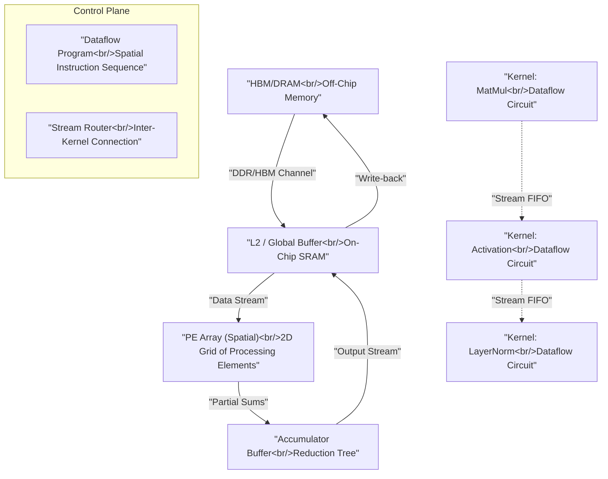
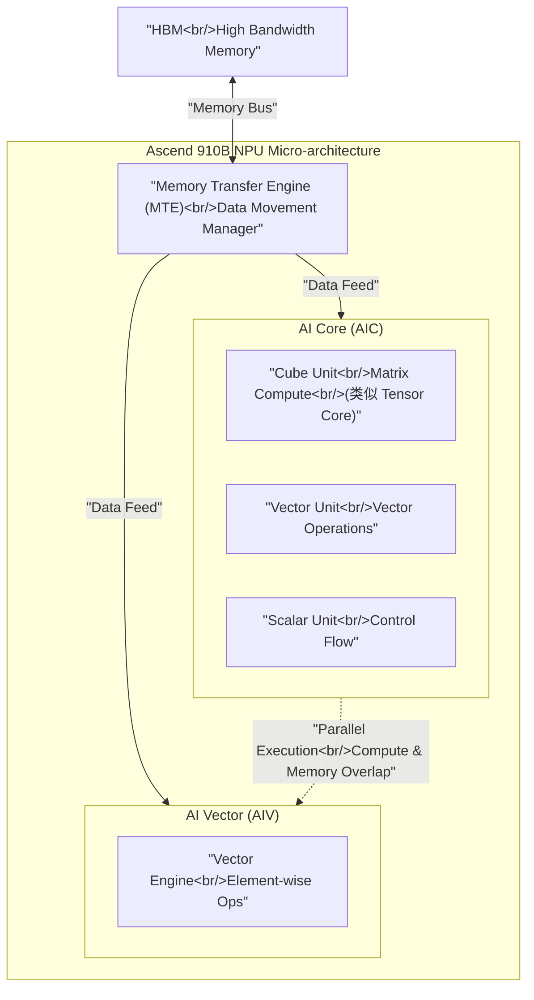
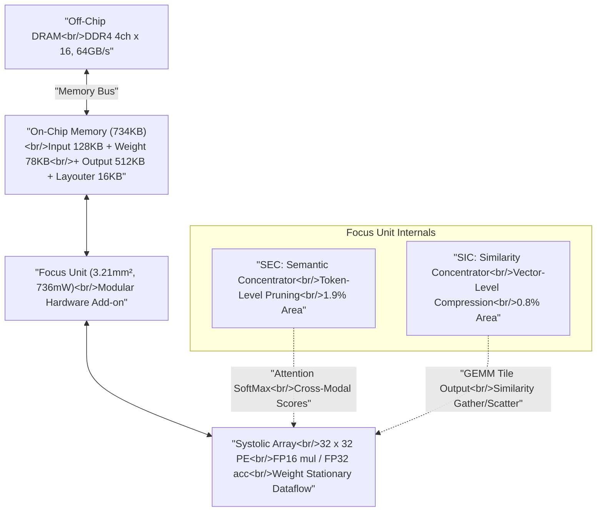
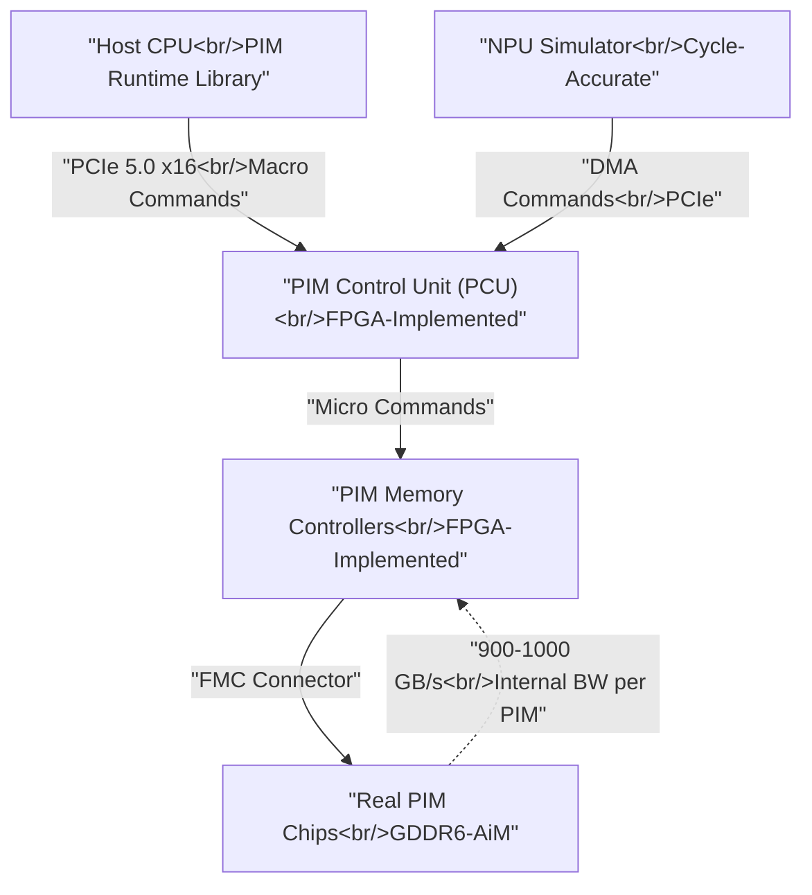

# Q5.4 — 多算子/微算子并发的硬件架构方法在实际平台上的实现与设计流程

## 笔记证据概览

| 路径 | 分数 | 关键信息 |
|------|------|----------|
| paper_secs/.../11-StreamTensor.../1.1-Dataflow-Architecture.md | 3044.6 | 数据流架构 vs 冯诺依曼架构，AMD Versal/Sambanova/IBM AIU 商业平台，HLS 设计流程 |
| paper_secs/.../Kitsune.../Kitsune-Enabling-Dataflow-Execution-on-GPUs.md | 1662.6 | GPU 数据流执行，inter-CTA ring queue，Grid Scheduler 修改，A100 平台 |
| paper_secs/.../Task-Based Tensor Computations on Modern GPUs/...md | 6779.2 | GPU warp-specialized 架构，Tensor Core，warp scheduler |
| paper_secs/.../6-XY-Serve.../2.2-Coarse-grained-Tile-based-Architecture.md | 681.1 | 华为 Ascend NPU DaVinci 架构，AIC/AIV，Tile-based vs SIMT |
| paper_secs/.../15-Data_Motion.../VI.-EXPERIMENTAL-METHODOLOGY.md | 496.6 | Verilog RTL，Xilinx Vivado，Synopsys DC，FPGA+ASIC 双轨实现 |
| paper_secs/.../21-Tandem Processor.../7-Evaluation-Methodology.md | 172.4 | Verilog 实现，Synopsys DC + IC Compiler，GF 65nm + FreePDK 15nm |
| paper_secs/.../30-IANUS.../7.3-IANUS-System-Prototyping.md | 2713.6 | Xilinx VCU118 FPGA 原型，NPU simulator + real PIM chips |
| knowledge_notes/.../Systolic-array Accelerator (for VLM Inference).md | 1163.8 | 32×32 PE，weight stationary dataflow，SystemVerilog RTL，TSMC 28nm |
| knowledge_notes/.../Focus Unit.md | 173.2 | Modular 硬件加速单元，SEC+SIC，3.21mm²，736mW |
| knowledge_notes/.../Semantic Concentrator (SEC).md | 161.1 | Token pruning 硬件模块，parallel max units，streaming bubble sorter |
| knowledge_notes/.../CuTe-DSL (CUTLASS CuTe DSL).md | 860.2 | GPU kernel 开发 DSL，warp-specialized pipeline，TMA/WGMMA |
| paper_secs/.../75-LAD.../LAD-...md | 1669.9 | LLM 专用加速器，算法-硬件协同设计 |
| paper_secs/.../62-SCAR.../SCAR-...md | 2318.0 | 异构 Multi-Chiplet 加速器调度 |
| paper_secs/.../1-TAIDL.../A.8-Methodology.md | 1846.2 | AMD Xilinx AI Engine (Versal) 参考 |

---

## 一、方法细节：硬件架构方法在实际平台上的对应实现

### 方法1: 数据流架构（Dataflow Architecture）—— StreamTensor / AMD Versal / Sambanova

**笔记证据**: `paper_secs/secs_2025/11-StreamTensor- Make Tensors Stream in Dataflow Accelerators for LLMs/1.1-Dataflow-Architecture.md` (score: 3044.6)

**方法细节**（L5 粒度：数据流设计 + 控制模块）:

数据流架构是冯诺依曼架构（如 NVIDIA H100、Google TPUv4）的替代方案，通过空间计算（spatial computation）而非时序复用实现算子间并发。下面的 Mermaid 流程图展示了数据流加速器的完整数据路径：



**注解**:
- 数据流加速器将算子映射为 **dataflow circuit**（空间硬件电路），通过 FIFO 流式传递中间数据，避免 off-chip DRAM 往返
- 商业平台：AMD Versal（AI Engine 阵列）、Sambanova SN40L（可重构数据流）、IBM AIU
- 笔记显示 StreamTensor 编译框架将 Linalg IR 编译为 dataflow kernel，通过 **Linalg-to-dataflow conversion**、**dataflow kernel fusion** 和 **dataflow optimization** pass 完成硬件映射
- 关键并发机制：多个 kernel 以空间流水线（spatial pipeline）方式并发执行，而非 GPU 的时序复用——在任意时刻 Tensor Core 和 SIMT 资源可以**同时**被不同算子使用
- 与 GPU 的 BSP（Bulk Synchronous Parallel）模型不同，数据流架构以 **synchronous dataflow** 模型运行，CTA 间通过 on-chip queue 显式通信来触发和节流执行

---

### 方法2: GPU 数据流执行（Kitsune）—— NVIDIA A100/H100 平台

**笔记证据**: `paper_secs/secs_multimodal_kernel/Kitsune Enabling Dataflow Execution on GPUs/Kitsune-Enabling-Dataflow-Execution-on-GPUs.md` (score: 1662.6)

**方法细节**（L5 粒度：控制模块 + 运行时调度）:

Kitsune 通过两个关键原语在 NVIDIA GPU 上实现数据流执行，使多算子可以在 GPU 的 SM 间空间并发：

**原语1：Inter-CTA Ring Queue（软件实现）**

```
Queue 结构（L2-resident ring buffer）:
┌─────────────────────────────────────────┐
│  Entry 0 (metadata + payload)            │  ← wr_acquire / rd_acquire
│  Entry 1 (metadata + payload)            │     通过 GPU atomics 同步
│  ...                                     │
│  Entry N-1 (double-buffering)            │
└─────────────────────────────────────────┘

Producer CTA (SM_i):                Consumer CTA (SM_j):
  wr_acquire() → 写入 payload        rd_acquire() → 自旋等待 metadata
  release()   → atomicAdd 更新 seq   release()   → atomicAdd 更新 seq
```

**原语2：Modified Grid Scheduler（硬件修改）**

```
当前 GPU Grid Scheduler:
  - Round-robin arbiter → 贪婪找第一个有资源的 SM
  - 不支持异构 kernel 的 co-residency 调度

Kitsune 修改:
  ┌──────────────────┐    ┌──────────────────┐
  │ SIMT Arbiter     │    │ TENSOR Arbiter   │
  │ (for Elementwise)│    │ (for GEMM CTAs)  │
  └────────┬─────────┘    └────────┬─────────┘
           │                       │
           └───────────┬───────────┘
                       ▼
              ┌─────────────────┐
              │ SM Occupancy    │
              │ Check & Pairing │
              └────────┬────────┘
                       ▼
              ┌─────────────────┐
              │ CTA Dispatch    │
              └─────────────────┘
```

**注解**:
- Kitsune 的 ring queue 驻留在 L2 cache 中（通过 CUDA API pinning），利用 GPU global atomics 实现 producer-consumer 同步
- A100 实测：54 个 queue、128-256KB payload 时 aggregate bandwidth 达 **2 TB/s**（37 GB/s/queue）
- 双 arbiter 设计使 Grid Scheduler 能将不同类型的 CTA（SIMT vs TENSOR）配对到同一 SM 上，实现 **Tensor Core 和 SIMT Core 同时被不同算子使用**
- 对比 Vertical Fusion（时序复用）：Kitsune 的空间数据流消除了 idle resource，5 个 DL 应用上获得 1.3×-2.4× 加速，off-chip traffic 减少 41%-98%
- GPU 硬件仅需"modest adjustment"：Grid Scheduler 增加一个 arbiter 和一个 type-aware dispatch 逻辑

---

### 方法3: 华为 Ascend NPU DaVinci 架构 —— Tile-based 并发执行

**笔记证据**: `paper_secs/secs_2026/6-XY-Serve End-to-End Versatile Production Serving for Dynamic LLM Workloads/2.2-Coarse-grained-Tile-based-Architecture.md` (score: 681.1)

**方法细节**（L5 粒度：计算模块 + 控制模块详解）:

华为 Ascend NPU 基于 DaVinci 架构，采用 **Coarse-grained Tile-based Architecture**，是商业 NPU 中支持多算子并发的典型实现。



**控制模块详解表**:

| 模块 | 功能描述 | 并发支持说明 |
|------|----------|-------------|
| **AIC (AI Core)** | 矩阵计算核心，类似 NVIDIA Tensor Core，执行 GEMM/Conv 等密集型算子 | 与 AIV 的 memory access unit 可并行操作，实现 compute 与 data movement 的 overlap |
| **AIV (AI Vector)** | 向量操作单元，处理 element-wise 操作（ReLU/LayerNorm/Softmax） | 与 AIC 独立调度，可同时执行不同算子 |
| **MTE (Memory Transfer Engine)** | 管理 HBM ↔ 片上 buffer 的数据搬运 | 支持异步 DMA，与 AIC/AIV 计算并行；笔记指出"computational units and memory access units within AIC and AIV can operate in parallel to overlap different operations" |
| **Cube Unit** | 脉动阵列风格的矩阵乘法引擎，固定 tile 宽度 | 对不规则 tile（动态 shape GEMM）效率下降，MFU 从 53% 降至 30-47% |

**Tile-based vs SIMT 并发对比**:

| 特性 | SIMT (GPU CUDA Core) | Tile-based (Ascend NPU) |
|------|---------------------|------------------------|
| 控制粒度 | 单线程级（warp） | 固定宽度 tile 级 |
| 动态输入处理 | Branch Predication / Warp Compaction | Padding/Unpadding + Mask（开销大） |
| 并发方式 | 多 warp 时分复用 SM | Tile 级数据并行 + AIC/AIV/MTE 三单元流水 |
| 计算密度 | 中等（灵活但效率受限） | 更高（专用数据路径，无动态分支开销） |
| 编程复杂度 | 低（CUDA 程序员友好） | 高（需手动处理不规则 pattern） |

**注解**:
- 笔记明确指出：GPU 也正在向 Tile-based 方向演进——NVIDIA 引入 TMA（Tensor Memory Accelerator）和 tile-based 编程模型，证明此硬件抽象在 GPU 上同样适用
- Ascend NPU 的多算子并发优势：AIC/AIV/MTE 三单元可同时工作，实现计算-计算和计算-访存的 **双重 overlap**
- 挑战：动态 shape（MoE routing / speculative decoding / prefix reuse）使 tile 分解产生大量不规则单元，MFU/MBU 显著下降

---

### 方法4: Systolic Array + Modular Hardware Add-on —— Focus 架构

**笔记证据**: `knowledge_notes/硬件知识笔记/Systolic-array Accelerator (for VLM Inference).md` (score: 1163.8), `knowledge_notes/硬件知识笔记/Focus Unit.md` (score: 173.2), `knowledge_notes/硬件知识笔记/Semantic Concentrator (SEC).md` (score: 161.1)

**方法细节**（L5 粒度：数据流 + 计算/控制模块设计）:

Focus 架构展示了一种 **modular add-on** 模式：不修改 core compute pipeline，而是在 systolic array 的 memory interface 侧插入专用硬件模块来支持 token-level 和 vector-level 的并发压缩。



**SEC 控制模块详解表**:

| 子模块 | 功能 | 硬件实现 | 并发特性 |
|--------|------|----------|----------|
| **Importance Analyzer** | 并行 max units 处理 attention SoftMax 输出的 text-to-image (T×M) cross-modal attention scores | a 个并行 max unit（每 cycle 处理 a 个 attention score） | 支持 Parallel (spatial) 和 Orthogonal (temporal) 两种 dataflow stream |
| **a-way Streaming Bubble Sorter** | a-way bubble sorter 做增量 top-k selection | 级联比较器链 | **完全与 image attention GEMM 重叠**——GEMM 耗时 M·(M+T)·h·n/(a·b) cycles >> sorter 耗时 M·a·k cycles |
| **Offset Encoder** | sliding window 记录保留 token 的 (Frame, Height, Width) 空间坐标 | 小整数编码器 | 流式输出到 SIC，不阻塞后续 pipeline |

**注解**:
- Focus Unit 是 modular 设计的关键案例：仅增加 **2.7% 面积和 0.9% 功耗**，换取 4.47× speedup vs dense SA、7.90× vs GPU (A100)
- 实现方式：所有核心逻辑（vanilla SA、Focus Unit、baseline accelerators）均用 **SystemVerilog RTL** 实现，TSMC 28nm 工艺，Synopsys Design Compiler 综合
- On-chip SRAM 由 **Memory Compiler** 生成（TSMC N28HPC+）
- Cycle-accurate 性能评估使用 **SCALEsim-v2** simulation framework
- 关键并发设计原则：SEC 的 top-k sorter 不占据 critical path，而是与 GEMM 计算**完全时间重叠**——这是硬件流水线并发的经典模式
- 开源实现：https://github.com/dubcyfor3/Focus

---

### 方法5: NPU-PIM 统一内存架构 —— IANUS

**笔记证据**: `paper_secs/secs_2025/30-IANUS- Integrated Accelerator based on NPU-PIM Unified Memory System/7.3-IANUS-System-Prototyping.md` (score: 2713.6)

**方法细节**（L5 粒度：系统原型 + FPGA 验证）:

IANUS 将 NPU 和 PIM（Processing-in-Memory）统一在一个内存系统中，通过 **PIM Access Scheduling** 在 NPU 和 PIM 间映射负载，调度 PIM 和普通内存命令的并发执行。



**注解**:
- FPGA 原型平台：**Xilinx VCU118** 板卡，通过 FMC connector 连接真实 GDDR6-AiM PIM 芯片
- NPU 因太大无法放入单 FPGA，使用 **功能+周期精确的 NPU simulator** 替代
- 多设备扩展：2/4/8 IANUS 设备通过 PCIe 5.0 x16 互联，利用 intra-layer parallelism + attention head parallelism
- 有效内存带宽达 2.4 TB/s（单设备），是 GDDR6 外部带宽的 9-10×（PIM 内部带宽优势）
- vs A100 GPU：GPT-2 上 6.2× speedup，cost-efficiency (perf/TDP) 提升 2.1-3.9×

---

### 方法6: GPU Kernel 开发 DSL —— CuTe (CUTLASS) 用于 MoE 并发

**笔记证据**: `knowledge_notes/编译知识笔记/CuTe-DSL (CUTLASS CuTe DSL).md` (score: 860.2)

**方法细节**（L5 粒度：硬件-软件接口 + 指令映射）:

CuTe-DSL 是 NVIDIA CUTLASS 的 C++ template-based DSL，直接生成 PTX 和 SASS，给开发者对 GPU 异步硬件操作的完全控制——是实现 MoE 多算子并发的关键 kernel 开发工具。

```
CuTe 编译链:
  CuTe C++ Template
       │ nvcc -arch=sm_90a -std=c++20
       ▼
  PTX (Parallel Thread Execution)
       │ ptxas
       ▼
  SASS (Native GPU ISA)
       │
       ▼
  GPU Hardware (SM90/SM100)
  
核心硬件映射:
  TiledMMA  → WGMMA (SM90) / UMMA (SM100) — Tensor Core 异步指令
  TiledCopy → TMA load / cp.async           — 异步数据搬运
  Pipeline  → warp-specialized               — Producer/Consumer warp 分工
              producer: TMA load → smem
              consumer_0: WGMMA + epilogue
              consumer_1: TMA store → gmem
```

**注解**:
- CuTe 不同于 Triton（Python → MLIR → PTX），它能表达 Triton 无法表达的底层硬件特性：**warp-specialized 异步调度、Ping-Pong pipeline、cluster-level synchronization（mbarrier cluster scope）**
- SonicMoE 完全基于 CuTe 编写 8 个 MoE kernel，利用 warp-specialized pipeline、TMA descriptor、Ping-Pong scheduling 和 persistent tile scheduler
- 这是 GPU 上实现多微算子并发的**实际软件工具链**——通过精确控制 TMA load（producer warp）和 WGMMA compute（consumer warp）的异步 overlap timing

---

## 二、实验环境

### 2.1 FPGA 原型验证平台

**笔记证据**: `paper_secs/secs_2025/15-Data_Motion_Acceleration_Chaining_Cross-Domain_Multi_Accelerators/VI.-EXPERIMENTAL-METHODOLOGY.md` (score: 496.6)

| 组件 | 配置 |
|------|------|
| **FPGA 平台** | Xilinx UltraScale+ VU9P（AWS F1 / VCU118） |
| **综合工具** | Xilinx Vivado 2022.2 |
| **工作频率** | 250 MHz (FPGA), 1 GHz (ASIC equivalent) |
| **ASIC 综合** | Synopsys Design Compiler R-2020.09-SP4 + FreePDK 15nm |
| **主机** | Intel Xeon Platinum 8260L @ 2.4 GHz, 64 GB |
| **互联** | PCIe x16 |
| **功耗测量** | Intel RAPL (CPU) + post-synthesis power (FPGA) |
| **Benchmark** | 5 个跨域应用（Video Surveillance, Sound Detection, Brain Stimulation, Personal Info Redaction, DB Hash Join），1-15 并发 |

### 2.2 ASIC 实现与评估环境

**笔记证据**: `paper_secs/secs_2025/21-Tandem Processor- Grappling with Emerging Operators in Neural Networks/span-idpage-9-0span7-Evaluation-Methodology.md` (score: 172.4)

| 组件 | 配置 |
|------|------|
| **RTL 语言** | Verilog |
| **综合工具** | Synopsys Design Compiler R-2020.09-SP4 |
| **工艺节点** | Global Foundries 65nm + FreePDK 15nm |
| **布局布线** | Synopsys IC Compiler L-2016.03-SP1 |
| **目标频率** | 1 GHz (FreePDK 15nm) |
| **功耗建模** | FreePDK 15nm logic cells + CACTI-P (on-chip memory) |
| **仿真器** | Cycle-accurate simulator（自研，与 RTL 误差 ≤5%） |
| **对比平台** | NVIDIA Jetson Xavier NX, RTX 2080 Ti, A100 (iso-TOPs) |
| **Benchmark** | VGG-16, ResNet-50, MobileNetv2, EfficientNet, YOLOv3, BERT, GPT-2 |

### 2.3 Focus 架构实验配置

**笔记证据**: `knowledge_notes/硬件知识笔记/Focus Unit.md` (score: 173.2)

| 参数 | 值 |
|------|-----|
| **工艺** | TSMC 28nm (N28HPC+) |
| **目标时钟** | 1.32ns (≈757 MHz)，500MHz P&R 有 34% timing margin |
| **PE 阵列** | 32×32，FP16 mul / FP32 acc |
| **片上 SRAM** | 734KB（Memory Compiler 生成） |
| **片外内存** | DDR4 4Gb×16, 2133R, 4 channels, 64GB/s |
| **综合角落** | SS corner (0.81V, 125°C) |
| **仿真框架** | SCALEsim-v2 (cycle-accurate) |

---

## 三、实现（辅助说明）

### 3.1 硬件设计流程（RTL → FPGA → ASIC）

笔记证据综合自 DRX、Tandem Processor、Focus 三篇论文：

```
硬件设计流程（笔记显示的实际工业/学术流程）:

  架构设计                     RTL 实现                    FPGA 原型
  ┌──────────┐    ┌─────────────────────────┐    ┌──────────────────┐
  │ Algorithm │ →  │ SystemVerilog / Verilog  │ →  │ Xilinx Vivado    │
  │ + Arch    │    │ (RTL)                   │    │ Synthesis + P&R  │
  └──────────┘    └─────────────────────────┘    └────────┬─────────┘
                                                          │
                     ASIC 实现                             ▼
  ┌──────────────────────────────────┐    ┌──────────────────────────┐
  │ Synopsys Design Compiler         │    │ FPGA Validation           │
  │ (Logic Synthesis)                │    │ - Xilinx VCU118/VU9P      │
  │     ↓                            │    │ - 250 MHz operation       │
  │ Synopsys IC Compiler             │    │ - Real PIM chip connect   │
  │ (Place &amp; Route)                   │    │   via FMC                 │
  │     ↓                            │    └──────────────────────────┘
  │ Tape-out (流片)                   │
  │ - TSMC 28nm / GF 65nm            │
  │ - FreePDK 15nm (学术)            │
  └──────────────────────────────────┘
```

### 3.2 HLS 设计方法

**笔记证据**: `paper_secs/secs_2025/11-StreamTensor.../1.1-Dataflow-Architecture.md` (score: 3044.6), `paper_secs/secs_2025/15-Data_Motion.../VI.-EXPERIMENTAL-METHODOLOGY.md` (score: 496.6)

- **HLS 使用场景**: Xilinx Vitis libraries 为 FFT、SVM、AES-GCM、Gzip、正则表达式、Hash Join 等提供 HLS 实现
- **StreamTensor 编译流程**: Linalg IR → dataflow conversion → dataflow kernel fusion → HLS synthesis → FPGA bitstream
- **RTL vs HLS 选择**: 深度学习加速器（object detection、PPO）用 RTL (Verilog) 实现以获得最佳性能；非关键路径用 HLS 加速开发
- 笔记未发现 Chisel、Bluespec、SystemC 的具体使用证据

### 3.3 GPU/NPU 平台软件栈

**笔记证据**: `knowledge_notes/编译知识笔记/CuTe-DSL (CUTLASS CuTe DSL).md` (score: 860.2)

- **NVIDIA GPU 栈**: CuTe DSL → NVCC → PTX → SASS → SM90/SM100 hardware
- **Ascend NPU 栈**: torch-npu (PyTorch backend) → CANN (Compute Architecture for Neural Networks) → Ascend 910B
- **AMD AI Engine**: MLIR-AIE dialect → AIE Compiler → AI Engine Simulator → Versal device

---

## 四、是什么？（辅助说明）

### 4.1 多算子/微算子并发的硬件实现层次

笔记显示，硬件对多算子/微算子并发的支持分布在三个层次：

| 层次 | 机制 | 典型实现 | 笔记证据 |
|------|------|----------|----------|
| **计算单元层** | 空间数据流（Spatial Dataflow） | StreamTensor, AMD Versal AI Engine, Sambanova SN40L | StreamTensor §1.1 |
| **控制调度层** | Modified Grid Scheduler + inter-CTA queue | Kitsune (NVIDIA GPU A100) | Kitsune §4 |
| **内存系统层** | PIM offloading + 统一内存调度 | IANUS (NPU+PIM), Focus Unit (memory interface add-on) | IANUS §7.3, Focus Unit |

### 4.2 关键硬件原语总结

| 硬件原语 | 功能 | 硬件修改程度 |
|----------|------|-------------|
| **Inter-CTA Ring Queue** (Kitsune) | SM 间 producer-consumer 数据传递 | 仅软件（利用现有 atomics + L2 pinning） |
| **Dual-Arbiter Grid Scheduler** (Kitsune) | 异构 CTA 类型的 SM co-residency | 硬件微调（增加一个 arbiter） |
| **Streaming Concentration** (Focus) | 在 memory interface 侧拦截并压缩数据流 | 专用硬件模块（3.21mm², 2.7% area overhead） |
| **MTE Parallel Execution** (Ascend NPU) | 计算与数据搬运的 overlap | 架构原生支持 |
| **PIM Access Scheduling** (IANUS) | NPU 与 PIM 命令的交错调度 | FPGA 原型 + NPU simulator |

---

## 五、方法对比表

| 方法 | 核心机制 | 实现框架/平台 | 硬件平台 | 关键指标 | 设计流程 | 笔记证据 |
|------|----------|-------------|----------|----------|----------|----------|
| **Dataflow Architecture** (StreamTensor) | Spatial pipeline, Linalg-to-dataflow compilation | StreamTensor Compiler (HLS backend) | AMD Versal, Sambanova SN40L, IBM AIU | LLM decode 阶段 memory-efficient | Linalg IR → HLS synthesis → FPGA | StreamTensor §1.1 (3044.6) |
| **GPU Dataflow** (Kitsune) | Inter-CTA ring queue + modified Grid Scheduler | PyTorch Dynamo → CUDA | NVIDIA A100 (108 SM) | 1.3-2.4× speedup, 41-98% DRAM reduction | CUDA spatial pipeline API | Kitsune (1662.6) |
| **Tile-based NPU** (Ascend DaVinci) | AIC/AIV/MTE 三单元并行 | torch-npu (PyTorch backend) | Huawei Ascend 910B | MFU 30-53% (varying by workload) | CANN compiler stack | XY-Serve §2.2 (681.1) |
| **Modular SA Add-on** (Focus) | SEC (token pruning) + SIC (vector compression) | SystemVerilog RTL, SCALEsim-v2 | Custom 32×32 SA, TSMC 28nm | 4.47× vs SA, 7.90× vs A100, +2.7% area | RTL → Synopsys DC → P&R | Focus Unit (173.2) |
| **NPU-PIM Unified** (IANUS) | PIM Access Scheduling, hybrid memory system | FPGA Prototype (Xilinx VCU118) | Custom NPU + GDDR6-AiM PIM | 6.2× vs A100 GPU, 2.4 TB/s effective BW | FPGA proto + cycle-accurate NPU sim | IANUS §7.3 (2713.6) |
| **LLM 专用加速器** (LAD) | Locality-aware KV cache skipping | Verilog RTL, 自研 simulator | Custom accelerator | KV cache access 大幅减少 | Algorithm-hardware co-design | LAD (1669.9) |
| **GPU Kernel DSL** (CuTe) | Warp-specialized async pipeline, TMA/WGMMA | CUTLASS 3.x (C++ templates) | NVIDIA H100 (SM90), B200 (SM100) | 精确控制 MoE kernel IO/compute overlap | CuTe C++ → NVCC → PTX → SASS | CuTe-DSL (860.2) |
| **Multi-Accelerator Chaining** (DRX) | Bump-in-the-Wire data restructuring accelerator | Verilog RTL | Xilinx VU9P FPGA, ASIC 1GHz | 多加速器间数据运动加速 | RTL → Vivado → Synopsys DC | DRX §VI (496.6) |
| **Tandem Processor** | GEMM Unit + 可编程非 GEMM 协处理器 | Verilog RTL | Systolic Array 32×32 + 32-lane Tandem | 覆盖 100% 非 GEMM 算子，消除 CPU fallback | RTL → DC → IC Compiler | Tandem §7 (172.4) |

---

## 六、不确定性

1. **Chisel/Bluespec/SystemC 设计流程**：笔记中未发现使用这些语言的硬件设计案例。所有硬件实现均使用 SystemVerilog 或 Verilog RTL。这可能是 vault 覆盖偏差（vault 主要收录 MICRO/ISCA/HPCA 等会议论文，学术加速器多用 Verilog）。
2. **寒武纪 MLU 微架构**：笔记中未找到寒武纪 MLU (370/590) 的具体微架构描述。仅 XY-Serve 论文涉及华为 Ascend NPU 的 DaVinci 架构细节。
3. **RISC-V Vector Extension / Rocket Chip / Chipyard**：笔记中未发现相关开源硬件平台的使用证据。
4. **Power Gating / Clock Gating / DVFS**：笔记中未发现针对 AI 加速器的具体低功耗技术描述。
5. **Graphcore IPU / Cerebras WSE**：仅在 ELK 论文中被提及为商业 inter-core connected AI chip 的例子（与 H100 GPU 并列），无微架构细节。
6. **Maxeler 数据流引擎**：笔记中未发现相关证据。
7. **EDA 工具链细节**：笔记仅提及 Synopsys Design Compiler、IC Compiler、Xilinx Vivado 的工具名称和版本，未涉及具体综合策略（如 retiming、clock gating insertion、power optimization 等）。

---

[ANSWER_AGENT_DONE] Q5.4
