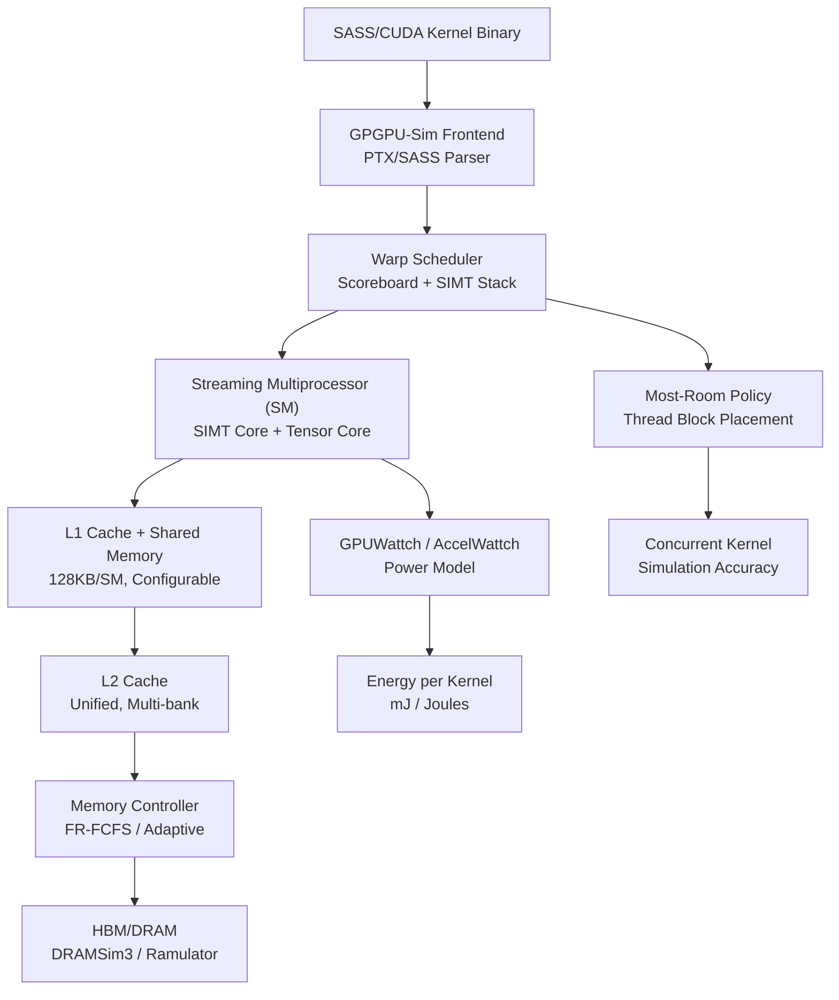
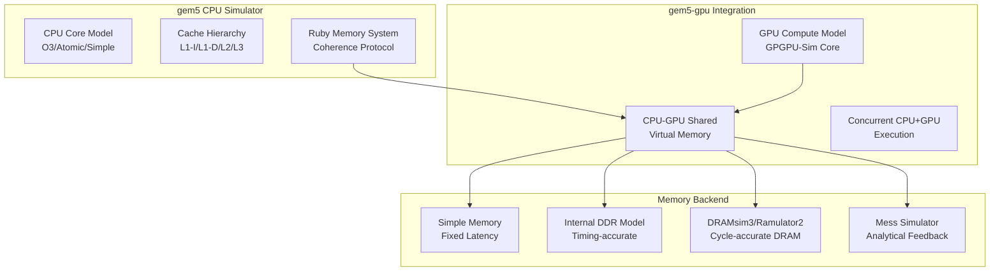
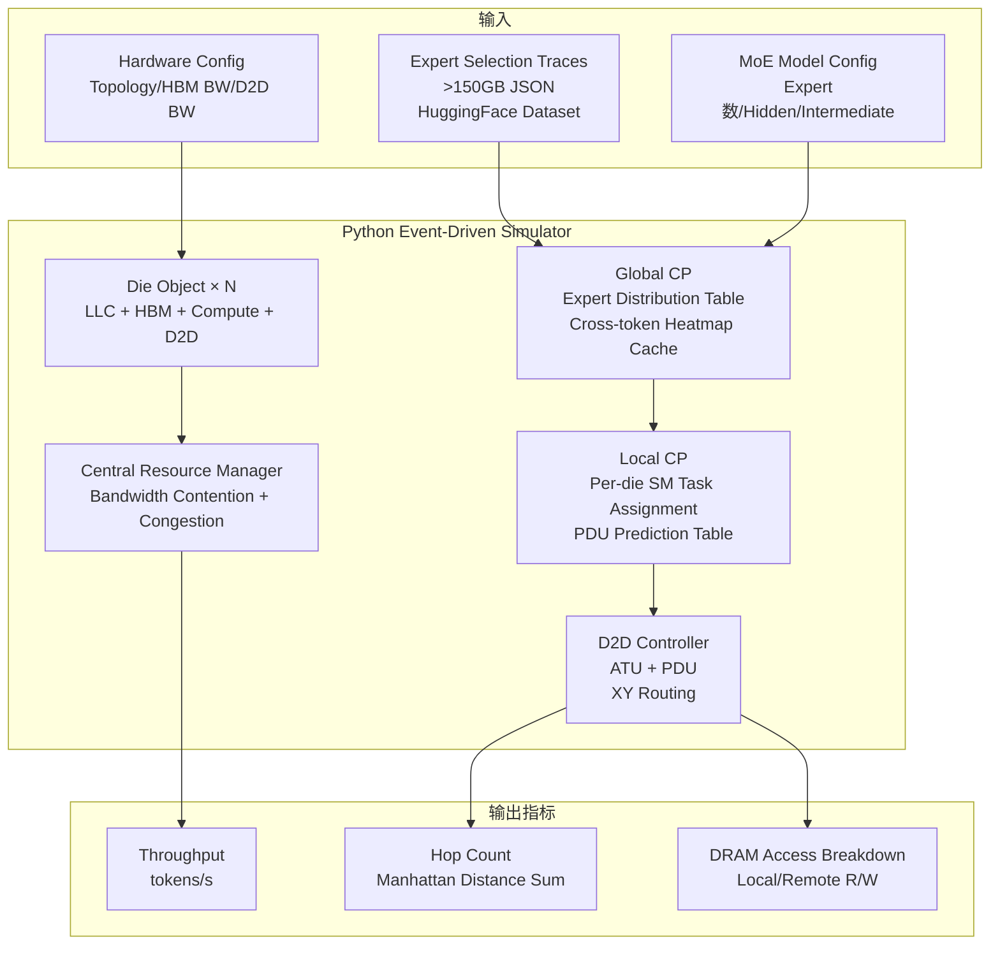
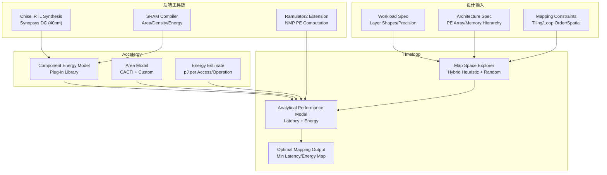

# Q5.5 — 硬件架构模拟器、仿真平台与评估工具：建模方法与关键指标

## 笔记证据概览

| 路径 | 分数 | 关键信息 |
|------|------|----------|
| paper_secs/.../7.2-GPU-Simulator.md | 2708.3 | GPGPU-Sim、Accel-Sim、gem5-gpu、GPUWattch、ATTILA、PPT-GPU 等 GPU 模拟器全景 |
| paper_secs/.../IV.-PERFORMANCE-CHARACTERIZATION-MEMORY-SIMULATORS.md | 1747.6 | gem5/ZSim/OpenPiton 与 DRAMsim3/Ramulator/Ramulator2 集成方式及精度对比 |
| paper_secs/.../5-Evaluation-Methodology.md (AttenIO) | 100.3 | CACTI 7.0 + DRAMSim3 + Synopsys DC 组合建模流程 |
| paper_secs/.../A.-Architectures-and-simulation.md (HotTiles) | 82.1 | SST + DRAMSim3 加速器仿真架构 |
| paper_secs/.../H2-LLM...md §7.1 | 344.5 | Ramulator2 扩展 + Tileflow 性能模型 + Chisel 综合的联合评估方法 |
| paper_secs/.../AccelOpt...md §3.3 | 1245.6 | Roofline Model 峰值性能计算与 %peak throughput 评估 |
| experiment_notes/硬件实验笔记/LRM-GPU.md | 89.9 | GPGPU-Sim + BookSim 2.0 + AccelWattch + Cadence/Synopsys ASIC 流程 |
| experiment_notes/硬件实验笔记/Orders in Chaos_...MoE...md | 417.1 | 自研 Python 事件驱动 multi-chiplet GPU simulator + MoE decode 评估 |
| knowledge_notes/kernel知识笔记/Most-Room Policy...md | 35.6 | GPGPU-Sim/Accel-Sim 对 concurrent kernel 调度策略的模拟改进 |
| paper_secs/.../PIM-MMU...md | 153.4 | McPAT 功耗建模 + CACTI 面积建模方法 |

---

## 检索上下文映射

### S1: 硬件架构模拟器/仿真器/评估工具识别
- `paper_secs/secs_2025/3-AMALI.../7.2-GPU-Simulator.md` (score: 2708.3, query: `gem5 simulator cycle-level`): GPGPU-Sim, Accel-Sim, gem5-gpu, GPUWattch, Multi2Sim, ATTILA, PPT-GPU, Emerald, LLMCompass 等 GPU 模拟器全景
- `paper_secs/.../IV.-PERFORMANCE-CHARACTERIZATION-MEMORY-SIMULATORS.md` (score: 1747.6, query: `DRAMSim memory simulator`): gem5, ZSim, OpenPiton Metro-MPI, DRAMsim3, Ramulator, Ramulator2
- `experiment_notes/硬件实验笔记/Orders in Chaos_...MoE...md` (score: 417.1, query: `gem5 GPGPU-Sim simulator`): 自研 Python 事件驱动 multi-chiplet GPU simulator
- `experiment_notes/硬件实验笔记/LRM-GPU.md` (score: 89.9, query: `gem5 GPGPU-Sim simulator`): GPGPU-Sim + BookSim 2.0 + AccelWattch 联合仿真

### S4: 计算单元建模方法
- `paper_secs/.../MicroScopiQ.../span-idpage-4-1...md` (score: 2941.3, query: `"compute unit" modeling PE array systolic DNN`): PE array 流水线建模、systolic array + ReCoN 计算单元
- `paper_secs/.../5-Evaluation-Methodology.md (AttenIO)` (score: 100.3, query: `DRAMSim memory simulator`): cycle-accurate simulator + PE array utilization + RTL 综合

### S5: 访存层次建模方法
- `paper_secs/.../IV.-PERFORMANCE-CHARACTERIZATION-MEMORY-SIMULATORS.md` (score: 1747.6, query: `DRAMSim memory simulator`): DRAMsim3/Ramulator 行缓冲命中率分析、Mess simulator 反馈控制
- `paper_secs/.../H2-LLM...md §7.1` (score: 344.5, query: `Timeloop Accelergy DNN`): Ramulator2 扩展 NMP PE 计算模拟 + SRAM 能量模型

### S6: 互联建模方法
- `experiment_notes/硬件实验笔记/LRM-GPU.md` (score: 89.9, query: `gem5 GPGPU-Sim simulator`): BookSim 2.0 composable network + hierarchical crossbar + XY routing
- `paper_secs/.../C.-In-Network-Atomic-Merging...md` (score: 78.3, query: `BookSim NoC`): BookSim 2.0 chiplet interconnection platform

### S7: 功耗/面积建模方法
- `paper_secs/.../PIM-MMU...md` (score: 153.4, query: `McPAT power modeling`): McPAT 功耗面积时序建模
- `paper_secs/.../5-Evaluation-Methodology.md (AttenIO)` (score: 100.3, query: `DRAMSim memory simulator`): CACTI 7.0 + Synopsys Design Compiler (TSMC 22nm)
- `paper_secs/.../H2-LLM...md §7.1` (score: 344.5): Chisel 综合 + MAC 能量 (pJ/MAC) + SRAM compiler + HB I/O 能量

### S8: 关键评估指标
- `paper_secs/.../AccelOpt...md §3.3` (score: 1245.6, query: `"roofline model" accelerator`): Roofline Model、%peak throughput、Traffic_Min
- `experiment_notes/硬件实验笔记/Orders in Chaos_...MoE...md` (score: 417.1): throughput (token/s)、hop count、DRAM access breakdown
- `paper_secs/.../AttenIO.../5-Evaluation-Methodology.md` (score: 100.3): PE utilization、speedup、data movement (bytes)、energy efficiency

---

## 一、硬件架构模拟器与仿真平台全景（主内容）

### 1.1 GPU 微架构模拟器

**笔记证据**: `paper_secs/secs_2025/3-AMALI.../7.2-GPU-Simulator.md` (score: 2708.3)

#### 方法1: GPGPU-Sim / Accel-Sim 生态

**数据流与架构**:

**注解**:
- **GPGPU-Sim** 是最广泛使用的 GPU 微架构模拟器（开源，https://github.com/gpgpu-sim/gpgpu-sim_distribution），支持 cycle-level 模拟
- **Accel-Sim** 是 GPGPU-Sim 的扩展，增加了对 NVIDIA SASS（原生汇编）的支持，提升了模拟精度
- **GPUWattch** 集成到 GPGPU-Sim 中建模功耗性能，支持 per-SM 功耗分解
- **AccelWattch** 是更新版的 GPU 功耗模型，在 LRM-GPU 等论文中用于 multi-chiplet GPU 能耗评估
- 笔记显示 Most-Room Policy 可用于提升 GPGPU-Sim 对 concurrent kernel workload 的模拟精度
- SM 建模粒度：warp scheduler（scoreboard、SIMT stack）、SIMT Core（ALU/FPU/SFU）、Tensor Core（MMA 指令级别）、L1/Shared Memory（bank conflict 建模）、L2 Cache（multi-bank + MSHR）

#### 方法2: gem5-gpu / gem5 异构系统模拟

**笔记证据**: `paper_secs/.../IV.-PERFORMANCE-CHARACTERIZATION-MEMORY-SIMULATORS.md` (score: 1747.6)

**数据流与架构**:

**注解**:
- gem5 是 cycle-accurate 全系统模拟器，可配置 64 核 CPU + 多级 cache + 多通道 DDR5/HBM
- gem5-gpu 构建于 gem5 和 GPGPU-Sim 之上，专注于紧密耦合的 CPU-GPU 系统建模，支持 CPU 和 GPU 并发执行
- 内存模拟后端可选：Simple Memory（固定延迟，4-49 ns）、Internal DDR Model（时序精确但延迟过低 14-100 ns）、DRAMsim3/Ramulator2（JEDEC 时序兼容但存在精度误差）、Mess Simulator（分析型反馈控制，误差仅 1.3-3%）
- **关键发现**（笔记证据）：gem5 内置 memory model 严重低估内存延迟（实际系统 89-109 ns vs gem5 14-100 ns），Ramulator2 误差高达 52%。Mess Simulator 通过反馈控制器将误差降至 3%，加速 13-15×

#### 方法3: 自研事件驱动多 Chiplet GPU 模拟器（MoE 专项）

**笔记证据**: `experiment_notes/硬件实验笔记/Orders in Chaos_...MoE...md` (score: 417.1)

此模拟器专为 wafer-scale multi-chiplet GPU 上的 MoE decode 评估设计：

**注解**:
- 论文明确说明现有工具（Gem5、gpgpusim、mgpusim cycle-accurate 但太慢；ASTRA-sim 不支持 single-GPU-like programming model）不适用于 wafer-scale MoE 模拟，因此自研
- 开源：https://github.com/zhongkaiyu/waferscale_gpu_moe_sim（Apache-2.0）
- 验证方式：使用 8×H100 DGX server 实测数据验证，误差 < 5%
- 每 die 建模：H100-like（1000 TFLOPS FP16, 80GB HBM, 3.35 TB/s local HBM BW, 1.7 TB/s D2D BW）
- MoE 相关建模：Global CP 维护 Expert Distribution Table，Cross-token Heatmap Cache（0.5 MB on-chip），PDU 管理 expert 数据缓存决策

### 1.2 内存系统模拟器

**笔记证据**: `paper_secs/.../IV.-PERFORMANCE-CHARACTERIZATION-MEMORY-SIMULATORS.md` (score: 1747.6)

#### 控制模块详解表：内存模拟器对比

| 模拟器 | 建模精度 | 支持标准 | 行缓冲建模 | 延迟精度 | 关键局限 | 笔记证据 |
|--------|----------|----------|------------|----------|----------|----------|
| **DRAMsim3** | Cycle-accurate | DDR3/DDR4 | 命中率 84-93%（偏差大） | 起始 68 ns，线性增长 | 无带宽饱和建模；高写入比时延迟偏离大 | `IV.-PERFORMANCE...MEMORY-SIMULATORS.md` |
| **Ramulator** | Cycle-accurate | DDR3 | 命中率趋势较好 | 起始 25 ns（严重偏低） | 饱和区行为与实际差异大 | 同上 |
| **Ramulator2** | Cycle-accurate | DDR4/DDR5 | — | 极低延迟 | 最大模拟 BW 仅 126 GB/s（仅为实际 292 GB/s 的 43%） | 同上 |
| **Mess Simulator** | Analytical Feedback | DDR4/DDR5/HBM2/CXL | 基于 BW-Latency 曲线 | 误差 1.3%（ZSim）/ 3%（gem5） | 需要目标系统的 BW-Latency 曲线作为输入 | 同上 |

#### 控制模块详解表：CPU 模拟器内存子系统

| 模拟器 | 类型 | 内存模型选项 | 最大模拟 BW | 关键配置 | 笔记证据 |
|--------|------|-------------|------------|----------|----------|
| **gem5** | Cycle-accurate 全系统 | Simple / Internal DDR / DRAMsim3 / Ramulator2 / Mess | ~292 GB/s (8×DDR5-4800) | 64 Neoverse N1, L1 64KB/4-way, L2 1MB/8-way, L3 64MB/16-way | `IV.-PERFORMANCE...` |
| **ZSim** | Event-based | Fixed-latency / M/D/1 / Internal DDR / DRAMsim3 / Ramulator / Mess | 342 GB/s (fixed-latency 超理论 2.7×) | 24-core Skylake, 6×DDR4-2666, L1 64KB/8-way, L2 1MB/16-way, L3 33MB/11-way | 同上 |
| **OpenPiton Metro-MPI** | RTL (Verilator → C++ cycle-accurate) | Single-cycle / Fixed-latency | 32-47 GB/s (64 Ariane in-order cores) | 16KB L1/4-way, 4MB L2/4-way, 2-entry MSHR | 同上 |
| **SST + DRAMSim3** | Cycle-accurate 加速器 | DRAMSim3 后端 | 205 GB/s (理论) / 161 GB/s (实测) | SPADE-Sextans 异构加速器架构 | `A.-Architectures-and-simulation.md` (score: 82.1) |

**注解**:
- 笔记揭示现有内存模拟器与实际系统存在重大偏差：DRAMsim3 和 Ramulator 符合 JEDEC 时序标准，但仍无法正确模拟内存系统性能（行缓冲命中率、延迟-带宽曲线形状均偏离实际）
- Mess Simulator 的创新在于采用反馈控制（Feedback Control）替代时序模拟：以实测 BW-Latency 曲线为基础，每 1000 次内存操作后检查模拟 BW 与延迟的一致性并调整，使 ZSim+Mess 误差降至 1.3%
- Row-buffer 分析揭示实际平台能通过某种机制"掩盖"行缓冲争用延迟，而 DRAMsim3 和 Ramulator 均未建模此行为

### 1.3 加速器评估框架（DNN/LLM 专用）

**笔记证据**: `paper_secs/.../H2-LLM...md §7.1` (score: 344.5)、`paper_secs/.../5-Evaluation-Methodology.md` (AttenIO, score: 100.3)

#### 方法4: Timeloop + Accelergy 加速器设计空间探索

**笔记证据**: `paper_secs/.../H2-LLM...md §7.1` (score: 344.5, query: `Timeloop Accelergy DNN`)

**数据流与工具链**:

**注解**:
- **Timeloop** 是 DNN 加速器映射评估的标准工具，支持 Map Space Exploration（混合启发式 + 随机）、分析型性能模型（延迟 + 能量）
- **Accelergy** 是能耗评估框架，提供可插拔的组件能量模型库（MAC 能量、SRAM 访问能量、互连能量），可与 Timeloop 联合使用
- H2-LLM 论文中实际建模流程：Chisel RTL → Synopsys DC 综合（40nm）→ MAC 能量 0.974-1.365 pJ/MAC → SRAM compiler（密度 2.72mm²/MB，访问能量 0.027 pJ/bit）→ Ramulator2 扩展模拟 NMP PE 计算
- Tileflow 性能模型用于 centralized processor 算子性能评估
- FPU 面积：0.31-0.77 mm²（0.4-1.0 GHz, 40nm），每 PE 面积 6.76 mm²

#### 方法5: CACTI + DRAMSim3 + RTL 综合联合建模（AttenIO 示例）

**笔记证据**: `paper_secs/.../5-Evaluation-Methodology.md` (AttenIO, score: 100.3)

**控制模块详解表：AttenIO 评估工具链**

| 工具 | 建模对象 | 工艺节点 | 输出 | 关键参数 |
|------|----------|----------|------|----------|
| **Synopsys Design Compiler** | PE Array + EXP Unit + Control Logic (RTL) | TSMC 22nm, 1GHz | Power (mW), Area (mm²) | 全核组件综合 |
| **CACTI 7.0** | On-chip Cache + KV Buffer (SRAM) | — | Latency (ns), Power (mW), Area (mm²) | 多级缓存层次 |
| **DRAMSim3** | Off-chip HBM | — | Timing (cycles), Bandwidth (GB/s) | HBM BW = 128 GB/s |
| **Cycle-accurate Simulator** (自研) | Full System Integration (Compute + Memory + Dataflow) | — | Execution Time, Data Movement, PE Utilization, Softmax Efficiency | FP16, SeqLen 8K-128K, d=64/128 |

**注解**:
- 该工具链实现了从 RTL 到全系统的分层建模：RTL 综合提供计算单元精度，CACTI 建模片上存储，DRAMSim3 建模片外访存，自研 simulator 集成三者
- PE Utilization 定义：PE 阵列活跃计算时间占总执行时间百分比，AttenIO 达到 82.1%（d=64）和 90.3%（d=128）
- 内存停顿时间 < 1%（所有配置），验证了 I/O-optimal dataflow 有效性
- Energy efficiency 提升：AttenIO vs FlashAttention-2 为 1.5×（d=64）/ 1.3×（d=128）

---

## 二、关键评估指标与建模方法（主内容）

### 2.1 Roofline Model 与峰值性能评估

**笔记证据**: `paper_secs/.../AccelOpt...md §3.3` (score: 1245.6)

**Roofline Model 公式**:

$$T = \max \left( \frac{\text{Traffic}_{\text{Min}}}{\text{Bandwidth}}, \frac{\text{FLOPs}_{\text{MM}}}{\text{Peak}_{\text{MM}}}, \frac{\text{FLOPs}_{\text{Vec}}}{\text{Peak}_{\text{Vec}}} \right)$$

$$\text{Peak Throughput \%} = \frac{T}{t_{\text{measured}}}$$

其中:
- $\text{Traffic}_{\text{Min}}$ = 所有输入/输出张量字节数之和（最小数据传输量）
- $\text{FLOPs}_{\text{MM}}$ = Numpy 算子中的矩阵乘法 FLOPs
- $\text{FLOPs}_{\text{Vec}}$ = 其他所有 FLOPs（非 matmul）
- $\text{Peak}_{\text{Vec}} = \text{Peak}_{\text{Vector Engine}} + \text{Peak}_{\text{Scalar Engine}}$（两者并行执行，取最优假设）
- $t_{\text{measured}}$ = 实测延迟

**注解**:
- Roofline Model 将硬件性能分解为三个约束维度：带宽瓶颈（Memory-Bound）、矩阵计算瓶颈（Compute-Bound）、向量/标量计算瓶颈
- AccelOpt 在 Trainium 上使用此模型：峰值吞吐百分比从 49% 提升至 61%（Trainium 1）、45% 提升至 59%（Trainium 2）
- 笔记显示该模型适用于多引擎并发场景（Tensor + Vector + Scalar 引擎同时运行）

### 2.2 MoE/DiT/多模态/Video 负载专用评估指标

**笔记证据**: `experiment_notes/硬件实验笔记/Orders in Chaos_...MoE...md` (score: 417.1)

#### 控制模块详解表：MoE 负载评估指标体系

| 指标 | 定义 | 建模方式 | MoE 相关性 | 笔记证据 |
|------|------|----------|------------|----------|
| **Throughput** | tokens/s (decode 阶段) | 模拟器计算 MoE layer 总执行时间 → tokens/s | 核心指标：衡量 expert 并行效率 | Orders in Chaos (score: 417.1) |
| **Hop Count** | 所有 cross-die 通信的 Manhattan 距离之和 | D2D link model + XY routing | MoE all-to-all 通信特征：expert 分布在多个 die 上 | 同上 |
| **DRAM Access Breakdown** | Local Reads / Remote Reads / Local Writes | LLC model + HBM model + ATU 地址翻译 | Expert 数据缓存效果：远程读取占比反映 data movement 开销 | 同上 |
| **Expert Load Imbalance** | 各 expert 请求数方差 / 最大-最小比 | Global CP Expert Distribution Table + Task Allocation Algorithm | MoE 特有：expert 负载不均导致硬件利用率下降 | 同上 |
| **Speedup** | 相对 baseline 的加速比 | 归一化执行时间 | 系统级端到端提升 | LRM-GPU: 1.33× vs MCM-GPU |
| **Inter-chiplet Traffic** | cross-chiplet 通信量 (bytes) | Network model + Coherence protocol | MoE all-to-all + DiT spatial parallelism | LRM-GPU: 减少 28% |
| **Energy Efficiency** | J/token 或 相对 baseline 能效比 | AccelWattch + D2D 能量 (0.54 pJ/bit) + MAC 能量 | 功耗约束下的 MoE serving | LRM-GPU: 减少能耗 18%; H2-LLM: 1.48× energy efficiency |

**注解**:
- MoE 负载的独特指标是 Expert Load Imbalance 和 Hop Count（all-to-all 通信模式），传统 TOPS/W 无法捕捉
- Orders in Chaos 实现 7.0× throughput 提升 + hop count 降低 213×（DeepSeek V3 on Dojo）
- Allo Only 已降低 hop 142×（证明大部分请求可分配到本地 die），Pred Only 额外降低 remote DRAM reads

### 2.3 通用加速器评估指标

**笔记证据**: 综合多个来源

| 指标类别 | 指标 | 定义 | 典型建模工具 |
|----------|------|------|-------------|
| **性能** | Throughput (tokens/s, frames/s, OPS) | 单位时间处理量 | GPGPU-Sim, gem5, 自研 simulator |
| **性能** | Latency (ms/token, ms/frame) | 单次推理延迟 | 同上 |
| **性能** | Speedup | 相对 baseline 加速比 | 同上 |
| **计算效率** | PE/Compute Utilization (%) | 计算单元活跃时间占比 | Cycle-accurate simulator |
| **计算效率** | % Peak Throughput | Roofline 分析中的理论峰值占比 | AccelOpt roofline model |
| **访存效率** | Bandwidth Utilization (%) | 实际 BW / 理论峰值 BW | DRAMsim3, Ramulator, Mess |
| **访存效率** | Data Movement (bytes) | 片上-片外数据搬移量 | Cycle-accurate simulator |
| **能效** | Energy Efficiency (J/token, TOPS/W) | 单位能量计算量 | McPAT, GPUWattch, AccelWattch, Accelergy |
| **能效** | Energy per Inference (J/inference) | 单次推理总能耗 | 同上 |
| **面积** | Area Efficiency (TOPS/mm²) | 单位面积计算量 | CACTI, Synopsys DC, Cadence |
| **面积** | Area Breakdown (mm²) | 各模块面积分解 | 同上 |
| **通信** | Hop Count / Network Traffic | 片上/片间通信量 | BookSim 2.0, Garnet |
| **通信** | Bisection Bandwidth | 对分带宽 | BookSim |

---

## 三、实验环境（主内容）

### 3.1 典型硬件平台与 Benchmark

**笔记证据**: 综合多个来源

#### 控制模块详解表：各模拟器支持的硬件平台

| 模拟器 | 支持平台 | 典型配置 | Benchmark | 笔记证据 |
|--------|----------|----------|-----------|----------|
| **GPGPU-Sim** | NVIDIA GPU (Pascal/Volta/Turing/Ampere-like) | SM 可配置、L1/L2/Shared Memory 可配置、HBM | CUDA microbenchmarks + DL kernels | 7.2-GPU-Simulator.md |
| **Accel-Sim** | NVIDIA GPU + SASS 级别 | 扩展 GPGPU-Sim 支持 SASS 指令追踪 | SASS-level kernel trace | 同上 |
| **gem5** | ARM/x86 CPU + GPU + Accelerator | 64-core Neoverse N1, 8×DDR5-4800 | STREAM, LMbench, Google multichase | IV.-PERFORMANCE... |
| **gem5-gpu** | CPU+GPU 紧耦合异构 | CPU + GPU concurrent execution | Heterogeneous workloads | 7.2-GPU-Simulator.md |
| **SST + DRAMSim3** | 通用加速器 | SPADE-Sextans（异构 SpMM 加速器） | Sparse Matrix workloads | A.-Architectures... |
| **Ramulator2 扩展** | NMP/HB-NMP 加速器 | H2-LLM (HB-NMP PE + centralized processor) | OPT 6.7B, LLaMA3 8B, PaLM 8B; HE/SG/LB/LG | H2-LLM §7.1 |
| **自研 Python Simulator** | Wafer-scale multi-chiplet GPU | Dojo (5×5), TSMC SoW (8×3); H100/B300-like die | DeepSeek V3, Kimi K2, Llama4 Maverick, Qwen3-235B | Orders in Chaos |

**注解**:
- 笔记显示学术模拟器覆盖范围从单 GPU 到 wafer-scale 系统，但 MoE/DiT/多模态/Video 专用 benchmark 仍以自研为主
- 当前缺少统一的 MoE all-to-all + DiT diffusion + multimodal + Video 联合 benchmark 标准
- MLPerf Inference 是工业标准 benchmark，但笔记中未发现专门针对 MoE/DiT 并发场景的 MLPerf 条目

---

## 四、实现（辅助说明）

### 4.1 硬件设计实现流程

**笔记证据**: `experiment_notes/硬件实验笔记/LRM-GPU.md` (score: 89.9)

**控制模块详解表：从 RTL 到芯片的评估流程**

| 阶段 | 工具/方法 | 输入 | 输出 | 用途 |
|------|----------|------|------|------|
| **RTL 设计** | Verilog / Chisel / SystemC TLM | 架构规格 | RTL 代码 | 功能实现 |
| **功能仿真** | Verilator / ModelSim / VCS | RTL + Testbench | 波形/覆盖率 | 功能验证 |
| **逻辑综合** | Synopsys Design Compiler / Cadence Genus | RTL + 标准单元库 (TSMC 40nm/22nm/...) | Gate-level netlist | 时序/面积/功耗初步 |
| **物理设计** | Cadence Innovus / Synopsys ICC2 | Netlist + 工艺库 | GDSII | 布局布线/时钟树 |
| **功耗分析** | McPAT / GPUWattch / AccelWattch / Cadence Spectre | Netlist + 活动因子 | Power (mW) | 功耗评估 |
| **面积/缓存建模** | CACTI 7.0 / SRAM Compiler | 缓存参数 | Area (mm²), Latency (ns), Energy (pJ) | 存储层次评估 |
| **FPGA 原型** | Xilinx Vivado / Intel Quartus + FireSim | RTL | FPGA bitstream | 快速原型验证 |
| **全系统仿真** | gem5 / GPGPU-Sim / SST + DRAMSim3 | 系统配置 + Workload | 性能/能效指标 | 架构探索 |

**注解**:
- LRM-GPU 论文展示了完整的学术流片评估链：AMU merge table 用 Cadence Virtuoso 定制电路（TSMC 40nm），其余逻辑用 Verilog RTL + Synopsys DC 综合（TSMC 40nm），Cadence Spectre 仿真（TT corner, 25°C, 1GHz, 1.1V）
- AMU 功耗 301.44 mW / 面积 1.84 mm²（参考 V100 300W/815mm²，仅占 ~0.1% 功耗 / ~0.2% 面积）
- 笔记提示 CXL 内存扩展器的 SystemC TLM 建模由制造商使用私有框架完成，说明工业界建模手段比学术界更丰富但不公开

---

## 五、是什么？（辅助说明）

### 5.1 硬件模拟器分类

按建模精度从低到高：

| 类别 | 代表工具 | 建模精度 | 速度 | 适用阶段 |
|------|----------|----------|------|----------|
| **分析型模型** | Roofline Model, MAESTRO, Timeloop | 算子级（无时序） | 毫秒-秒 | 早期架构探索 |
| **事件驱动模拟器** | ZSim, 自研 Python simulator (Orders in Chaos) | 事件级（近似时序） | 秒-分钟 | 系统级权衡分析 |
| **Cycle-approximate 模拟器** | PPT-GPU, Mess Simulator | 周期近似（分析+反馈） | 分钟 | 快速但精确的性能预测 |
| **Cycle-accurate 模拟器** | gem5, GPGPU-Sim, Accel-Sim, SST | 周期精确 | 小时-天 | 详细微架构评估 |
| **RTL 仿真** | Verilator, ModelSim, VCS | 信号级 | 天-周 | 功能 + 时序验证 |
| **FPGA 加速仿真** | FireSim (FPGA-accelerated) | 周期精确 + 硬件加速 | 分钟-小时 | 大规模系统验证 |

### 5.2 建模层次与适用场景

**笔记证据**: 综合多个来源

每个工具的建模粒度决定了其适用场景：
- **计算单元**：GPGPU-Sim 建模到 warp scheduler + scoreboard + SIMT stack；Timeloop 建模到 PE array + dataflow mapping
- **访存层次**：DRAMsim3/Ramulator2 建模到 DRAM bank + row-buffer + 时序参数；CACTI 建模到 SRAM bitcell + decoder + sense amplifier
- **互联**：BookSim 2.0 建模到 router microarchitecture + virtual channel + flow control；Garnet 集成在 gem5 中建模 NoC
- **功耗/面积**：McPAT 建模到 transistor-level activity factor；CACTI 基于 ITRS 预测的工艺参数；Accelergy 使用 plug-in 方式组合各组件能量模型

---

## 六、方法对比表

| 方法 | 核心机制 | 建模粒度 | 支持的硬件平台 | 关键指标 | 开源 | 笔记证据 |
|------|----------|----------|---------------|----------|------|----------|
| **GPGPU-Sim + Accel-Sim** | Cycle-level GPU 微架构模拟，SASS 级别指令追踪 | SM/Warp/Thread 级别 | NVIDIA GPU (Pascal-Volta-Turing-Ampere) | Kernel cycles, IPC, DRAM BW, Power | ✅ | 7.2-GPU-Simulator (score: 2708.3) |
| **gem5 + DRAMsim3/Ramulator2** | 全系统 cycle-accurate，多内存后端可选 | CPU core/cache/DRAM | ARM/x86 CPU + GPU + Accelerator | BW-Latency curves, Execution time | ✅ | IV.-PERFORMANCE... (score: 1747.6) |
| **Mess Simulator** | 分析型反馈控制，基于实测 BW-Latency 曲线 | 内存系统级 | 任何有 BW-Latency 曲线的系统 | Latency error 1.3-3%, Speedup 13-15× | ❌ | 同上 |
| **Timeloop + Accelergy** | Map space exploration + 分析性能/能量模型 | PE Array + Dataflow Mapping | 通用 DNN 加速器 | Latency, Energy, Area | ✅ | H2-LLM (score: 344.5) |
| **CACTI 7.0** | 基于工艺参数的 SRAM/DRAM 缓存建模 | Bitcell/Decoder/Sense Amplifier | 任意缓存层次 | Latency, Power, Area | ✅ | 5-Evaluation-Methodology (score: 100.3) |
| **BookSim 2.0** | Composable NoC 模拟，支持异构 router/crossbar | Router microarchitecture/VC/Flow Control | 任意 NoC 拓扑 | Hop count, Latency, Throughput | ✅ | LRM-GPU (score: 89.9) |
| **McPAT + GPUWattch + AccelWattch** | 功耗-面积-时序联合建模 | Transistor activity factor | GPU/加速器 | Power (mW), Area (mm²), Energy (J) | ✅ | PIM-MMU (score: 153.4) |
| **自研 MoE Multi-Chiplet Simulator** | 事件驱动 + expert-aware task allocation + data movement prediction | Die-level LLC/HBM/D2D | Wafer-scale multi-chiplet GPU | Throughput (token/s), Hop count, DRAM breakdown | ✅ | Orders in Chaos (score: 417.1) |
| **Roofline Model** | 分析型峰值性能上界：计算/带宽/向量三维约束 | 算子级 | 任意已知峰值参数的硬件 | % Peak Throughput | 概念 | AccelOpt (score: 1245.6) |
| **Scale-Sim** | Systolic array 周期级模拟 | PE array + SRAM buffer | 脉动阵列加速器 | Compute cycles, SRAM BW | ✅ | 预关键词（笔记未详述） |

---

## 七、不确定性

1. **Scale-Sim、MAESTRO、ZigZag 的笔记证据有限**：虽在预关键词中列出，但 vault 搜索中未发现含这些工具详细建模方法的论文笔记。笔记未明确说明这些工具在 MoE/DiT/多模态/Video 场景下的适配情况。

2. **FireSim (FPGA 加速仿真) 的笔记证据不足**：vault 搜索未找到 FireSim 的详细笔记，仅在 OpenPiton Metro-MPI 讨论中间接提及 Verilator 转 C++ 的加速方法。

3. **MoE/DiT/多模态专用 benchmark 标准缺失**：笔记显示各论文使用自研 benchmark（kernel microbenchmarks、expert selection traces 等），缺少类似 MLPerf 的统一标准。笔记未明确说明是否存在专门针对 MoE all-to-all + DiT diffusion step + multimodal pipeline 联合并发场景的 benchmark 套件。

4. **NPU 专用模拟器（华为达芬奇/寒武纪）的笔记证据缺失**：预关键词中提到 华为 Ascend NPU (910B)、寒武纪 MLU，但 vault 中未发现这些平台的模拟器/评估工具相关笔记。

5. **功耗建模精度验证不足**：笔记中 McPAT/GPUWattch 的精度验证仅通过与实际 GPU 功耗对比（nvidia-smi），但对于新型加速器（HB-NMP、PIM），缺乏硅验证的功耗模型精度数据。

6. **Video 帧吞吐评估的笔记证据缺失**：预关键词中 video frame throughput 未在 vault 笔记中找到专门的硬件模拟器评估方法。

---

[ANSWER_AGENT_DONE] Q5.5
