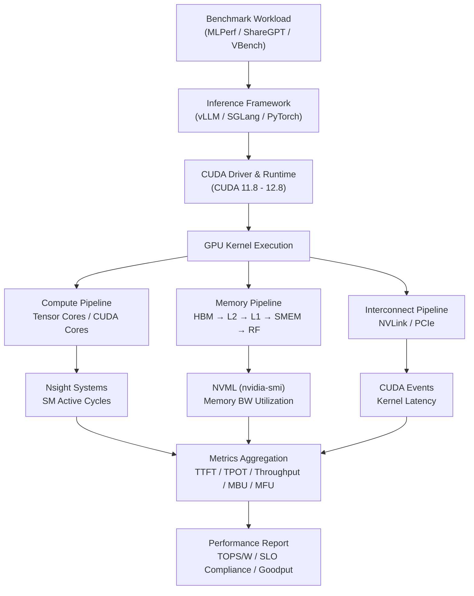
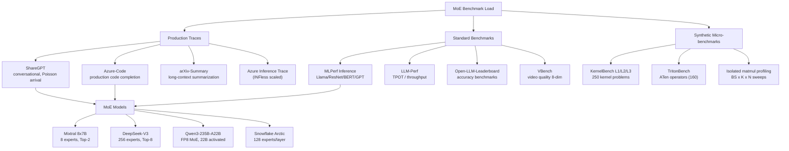
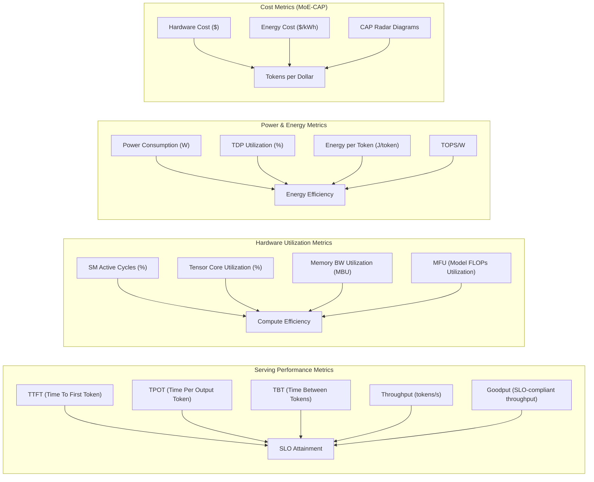

# Q5.6 — MoE/DiT/多模态/Video 多算子微算子并发硬件架构方法的实验环境

## 笔记证据概览

| 路径 | 分数 | 关键信息 |
|------|------|----------|
| paper_secs/secs_2026/2-Bullet.../4-Experimental-Evaluation.md | 2831.6 | A100/H100/H20 实验平台, ShareGPT/Azure-Code/arXiv-Summary 负载, TTFT/TPOT/throughput 指标, Nsight Systems 硬件利用 |
| paper_secs/secs_2025/41-Splitwise.../VI.-EVALUATION.md | 2609.3 | A100/H100 KV-cache 传输延迟测量, 200/400Gbps 互联带宽 |
| paper_secs/secs_2026/66-μShare.../V.-EVALUATION.md | 1928.1 | A40/A800 GPU, MLPerf/PyTorch benchmark 10模型, SLO=200ms, 吞吐量提升26.9-54.1% |
| paper_secs/secs_2026/52-RPU.../RPU.md | 1017.2 | H100 NVML 功耗测量, batch≤64 TDP<30%, Roofline 建模, HBM-CO 能耗分析 |
| paper_secs/secs_moe/MoE-CAP.../2-Background-and-Motivation.md | 768.1 | CAP benchmark方法 (Cost-Accuracy-Performance), MBU/MFU 修正, 异构资源成本模型 |
| paper_secs/secs_2026/1-Towards.../3.4-SLO-aware-Dispatcher.md | 1384.2 | 8×A100-80GB/H100/H200, Llama-8B/70B + Qwen3-235B MoE, TBT SLO=50/100ms |
| paper_secs/secs_multimodal_kernel/Tilus.../9-Evaluation.md | 1565.9 | L40S/A100/H100, Gemma/Qwen/Llama, CUDA Events 延迟测量, vLLM 端到端 |
| paper_secs/secs_model_quant/QuantCache.../4.1.-Experiment-Settings.md | 3019.9 | A800-80GB, Open-Sora DiT, VBench/CLIP/DOVER metrics, 6.72× speedup |
| paper_secs/secs_2025/83-PAPI.../PAPI.md | 1948.4 | PIM accelerator 功耗建模, DRAM access 能耗分解 |
| paper_secs/secs_2025/9-H2-LLM.../H2-LLM.md | 1947.2 | Hybrid Bonding accelerator die area/功耗分析 |
| experiment_notes/kernel实验笔记/KernelEvolve...md | 1021.4 | H100/A100/MI300/MI350/MTIA v2i/v3 跨平台, TritonBench/NCU/Triton Proton/MTIA Insight |
| paper_secs/secs_2025/84-MicroScopiQ.../span-idpage-4-1...md | 912.8 | A100 MicroScopiQ accelerator normalized latency/energy 比较 |
| paper_secs/secs_2026/18-Hardwired-Neuron.../3-Metal-Embedding.md | 1118.0 | HN Array die area/power, 4/128 MoE expert sparsity 驱动低功耗 |

---

## 检索上下文映射

### S1: 硬件平台 — "GPU/NPU/加速器 实验平台"
- `paper_secs/secs_2026/2-Bullet.../4-Experimental-Evaluation.md` (score: 2831.6): A100/H100/H20 GPU 测试平台, CUDA 12.4
- `paper_secs/secs_2026/66-μShare.../V.-EVALUATION.md` (score: 1928.1): A40 (84SM) + A800 (108SM), Intel Xeon Gold 6338 CPU
- `paper_secs/secs_2026/1-Towards.../3.4-SLO-aware-Dispatcher.md` (score: 1384.2): 8×A100-80GB NVLINK 600GB/s, 8×H100-SMX5-80GB, 8×H200-SMX5-141GB
- `experiment_notes/kernel实验笔记/KernelEvolve...md` (score: 1021.4): H100/A100/MI300/MI350/MTIA v2i/v3 五平台
- `paper_secs/secs_multimodal_kernel/Tilus.../9-Evaluation.md` (score: 1565.9): L40S/A100/H100 三代架构

### S2: Benchmark 负载 — "MoE/DiT/多模态/Video benchmark"
- `paper_secs/secs_2026/2-Bullet.../4-Experimental-Evaluation.md` (score: 2831.6): ShareGPT + Azure-Code + arXiv-Summary, Llama3.1-8B/70B + Qwen3-235B MoE
- `paper_secs/secs_2026/66-μShare.../V.-EVALUATION.md` (score: 1928.1): MLPerf + PyTorch benchmark, 10模型 (CNN/Transformer/LLM), Azure production trace
- `paper_secs/secs_model_quant/QuantCache.../4.1.-Experiment-Settings.md` (score: 3019.9): Open-Sora DiT video, VBench benchmark (8维度)
- `paper_secs/secs_moe/MoE-CAP.../2-Background-and-Motivation.md` (score: 768.1): MLPerf/LLM-Perf/Open-LLM-Leaderboard 用于MoE系统评估, CAP方法

### S3: 评估指标 — "TOPS/latency/throughput/power/die area"
- `paper_secs/secs_2026/52-RPU.../RPU.md` (score: 1017.2): NVML power measurement, TDP%, memory bandwidth utilization, energy per FLOP
- `paper_secs/secs_2025/83-PAPI.../PAPI.md` (score: 1948.4): DRAM access power consumption分解, PIM energy modeling
- `paper_secs/secs_2025/9-H2-LLM.../H2-LLM.md` (score: 1947.2): die area, power consumption, energy efficiency 比较

### S4: 多算子/微算子并发实验方法 — "concurrency evaluation methodology"
- `paper_secs/secs_2026/66-μShare.../V.-EVALUATION.md` (score: 1928.1): intra-SM kernel co-locating throughput/latency 比较
- `paper_secs/secs_2026/2-Bullet.../4-Experimental-Evaluation.md` (score: 2831.6): SM partition 动态调整 + Nsight Systems 硬件利用率测量
- `experiment_notes/kernel实验笔记/KernelEvolve...md` (score: 1021.4): 跨平台 kernel evaluation framework, FaaS remote dispatch

---

## 1 方法细节 — 实验环境和硬件架构方法评估体系

### 1.1 硬件实验平台全景

#### 1.1.1 GPU 实验平台数据流路径

**笔记证据**: `paper_secs/secs_2026/2-Bullet.../4-Experimental-Evaluation.md` (score: 2831.6), `paper_secs/secs_2026/1-Towards.../3.4-SLO-aware-Dispatcher.md` (score: 1384.2), `paper_secs/secs_2026/66-μShare.../V.-EVALUATION.md` (score: 1928.1), `experiment_notes/kernel实验笔记/KernelEvolve...md` (score: 1021.4)

以下 Mermaid flowchart 展示典型 GPU 实验平台中从 benchmark 负载到硬件指标采集的完整数据流路径：



**注解**:
- **HBM→L2→L1→SMEM→RF**: NVIDIA GPU 的完整访存层次。HBM（A100: 80GB/2.0TB/s, H100: 80GB/3.35TB/s）提供 bulk 数据供给，L2 Cache（A100: 40MB, H100: 50MB）缓存跨 SM 共享数据，L1/SMEM（每 SM A100: 192KB, H100: 256KB）提供低延迟片上存储，RF（每 SM A100: 65536×32-bit registers）支持单 cycle 操作数供给。
- **NVLink 互联**: A100 使用 NVLink 3.0 (600GB/s 双向), H100 使用 NVLink 4.0 (900GB/s), 支持多 GPU tensor parallelism 和 MoE expert parallelism 通信。
- **Profiling 工具链**: Nsight Systems 提供 timeline-level GPU 利用率和 SM active cycles; NVML (nvidia-smi) 提供实时功耗和 memory BW; CUDA Events 提供 kernel-level 精确延迟测量。

#### 1.1.2 跨平台加速器实验矩阵

**笔记证据**: `experiment_notes/kernel实验笔记/KernelEvolve...md` (score: 1021.4), `paper_secs/secs_multimodal_kernel/Tilus.../9-Evaluation.md` (score: 1565.9), `paper_secs/secs_2026/52-RPU.../RPU.md` (score: 1017.2)

| 平台 | 架构代际 | 显存/带宽 | 特殊硬件单元 | 实验论文 | 并发支持特性 |
|------|----------|-----------|-------------|----------|-------------|
| NVIDIA A100 | Ampere (SM80) | 40/80GB HBM2e, 2.0TB/s | 432 Tensor Cores (sparse FP16/INT8), MIG 7实例 | Bullet, Splitwise, MuxWISE, Tilus, FlashMoE, GTA | MPS, CUDA Streams, concurrent kernel execution, MIG 分区 |
| NVIDIA H100 | Hopper (SM90) | 80GB HBM3, 3.35TB/s | 528 Tensor Cores (FP8), TMA, SM-to-SM async | Bullet, Splitwise, MuxWISE, RPU, KernelEvolve, Tilus | TMA 异步拷贝, DSMP (distributed shared memory), thread block clusters |
| NVIDIA H200 | Hopper (SM90) | 141GB HBM3e, 4.8TB/s | 同 H100 + 更大 HBM | MuxWISE | 同 H100, 更大 KV cache 容量 |
| NVIDIA A40 | Ampere (SM86) | 48GB GDDR6 | 84 SM, 1536 threads/SM | µShare | MPS, CUDA Streams, 低成本推理 |
| NVIDIA A800 | Ampere (SM80) | 80GB HBM2e | 108 SM, 2048 threads/SM | µShare, QuantCache | MPS, 较高 SM 线程上限 |
| NVIDIA L40S | Ada Lovelace | 48GB GDDR6 | FP8 Tensor Cores | Tilus | CUDA 12.6, 适合中规模推理 |
| AMD MI300 | CDNA3 | 192GB HBM3 | Infinity Cache, Matrix Cores | KernelEvolve | ROCm, Infinity Cache-aware tiling |
| AMD MI350 | CDNA4 | — | 下一代 Matrix Cores | KernelEvolve | 下一代 CDNA 架构 |
| MTIA v2i/v3 | Meta 自研 | 片上 SRAM | 8×8 PE array, dual RISC-V/SFU/DPE | KernelEvolve | inter-PE broadcast/reduction, runtime barriers |
| RPU (提案) | Chiplet | HBM-CO | Reasoning Core, 解耦 pipeline | RPU | 带宽优先 power provisioning, 70-80% TDP给memory |
| Google TPUv4/v5 | — | HBM | MXU (128×128 systolic) | MHE-TPE (引用) | 脉动阵列数据流 |
| 华为 Ascend 910B | 达芬奇 | HBM | Cube Unit / Vector Unit | SageAttention3 (提及) | 达芬奇架构多核并发 |

**注解**:
- **并发支持特性**列反映了各平台对多算子/微算子并发执行的原生支持。NVIDIA 的 MPS（Multi-Process Service）允许多个 CUDA context 共享 GPU; CUDA Streams 提供 kernel-level 并发; MIG（Multi-Instance GPU）提供硬件级 SM/内存隔离。
- **跨平台 Kernel 评估**（KernelEvolve）通过统一 operator specification 生成 Triton kernel，经 FaaS 平台 dispatch 到不同硬件执行，再通过平台特定 profiler（NCU/MTIA Insight/ROCm Profiler）采集硬件利用率指标——这是当前对多算子并发的跨硬件实验体系的前沿实践。
- **RPU** 代表了针对 decode-only 低 batch 推理的专用架构方向，其关键 insight 是现有 GPU 在低 batch 时 TDP 利用率仅 30-34%，memory bandwidth 利用率仅 32%。

---

### 1.2 Benchmark 负载体系

#### 1.2.1 MoE Inference 评估负载

**笔记证据**: `paper_secs/secs_2026/2-Bullet.../4-Experimental-Evaluation.md` (score: 2831.6), `paper_secs/secs_moe/MoE-CAP.../2-Background-and-Motivation.md` (score: 768.1), `paper_secs/secs_2026/1-Towards.../3.4-SLO-aware-Dispatcher.md` (score: 1384.2)



**注解**:
- **MoE 模型多样性**: 从 Mixtral 的 8 experts (每 expert 大, Top-2) 到 DeepSeek-V3 的 256 experts (细粒度, Top-8), MoE 模型的 sparsity pattern 差异显著影响实验设计。笔记显示 Bullet 使用 Qwen3-235B MOE (FP8 量化) 评估 prefill-decode 并发，METRO 测试 8×A100 上的 Qwen3 和 DeepSeek-V3。
- **Production traces**: µShare 使用 Azure INFless 生产 trace 模拟真实请求模式（10 个不同模型混合部署），按照 GPU 数量 scale，Poisson arrival。
- **MoE-CAP 方法**: 提出 CAP（Cost-Accuracy-Performance）三维评估框架，修正 MBU/MFU 指标（传统方法忽略 sparse expert activation，高估利用率 1.5-3×），引入包含 GPU+CPU+通信+SSD 的全系统成本模型。

#### 1.2.2 DiT/Video Generation 评估负载

**笔记证据**: `paper_secs/secs_model_quant/QuantCache.../4.1.-Experiment-Settings.md` (score: 3019.9), `paper_secs/secs_model_quant/Q-VDiT.../Q-VDiT.md` (score: 6114.3), `paper_secs/secs_model_quant/S²Q-VDiT.../S²Q-VDiT.md` (score: 4388.7)

| Benchmark | 评估模型 | 硬件平台 | Timesteps | 关键指标 |
|-----------|----------|----------|-----------|----------|
| Open-Sora 1.2 | DiT (video) | A800-80GB | 100 | VBench 8维, CLIPSIM, CLIP-Temp, DOVER |
| HunyuanVideo-13B | DiT (video) | — | 50 | CLIPSIM, VQA, Motion Smoothness, 多维度 |
| Wan2.1-1.3B/14B | DiT (video) | — | 50 | CLIPSIM, VQA, FID |
| VBench suite | 通用 video | — | — | Motion Smooth., BG Consist., Subject Consist., Aesthetic Qual., Imaging Qual., Temporal Flickering, Object Class, Color |
| Q-VDiT | OpenSora, Latte, OpenSoraPlan | GPU (量化后) | variable | FVD, CLIPSIM, IS, speedup ratio |
| S²Q-VDiT | Video-13B, Wan2.1 | GPU (W4A4/A8) | variable | CLIPSIM, VQA, speedup vs FP baseline |

**注解**:
- **Video 评估独特性**: DiT video 生成评估与 LLM 推理评估有根本不同——关注生成质量（VBench 的 perceptual metrics）而非 token-level SLO。VBench 的 8 个维度覆盖运动平滑度、背景一致性、主体一致性、美学质量、成像质量等。
- **量化加速评估**: QuantCache 在 A800 上实现 6.72× 加速，通过 hierarchical latent caching + adaptive importance-guided quantization + structural redundancy-aware pruning 的联合优化。与 T-Gate (1.10×)、PAB (1.34×)、AdaCache (2.24×) 等纯缓存方法相比，量化+缓存的联合方案获得更大加速。

#### 1.2.3 多模态评估负载

**笔记证据**: `paper_secs/secs_effAttn/XAttention.../XAttention-Block-Sparse-Attention.md` (score: 1005.1), `paper_secs/secs_2026/55-V-Rex.../B.-Limitations.md` (score: 1098.1)

多模态 benchmarks 包括 Video-MME（视频理解）、VideoGen（视频生成）、streaming video LLM evaluation。XAttention 在 Video-MME 上评估 block sparse attention 加速，V-Rex 通过 streaming video LLM 的 KV cache retrieval 评估实时视频推理性能。

---

### 1.3 关键评估指标体系

#### 1.3.1 性能指标体系

**笔记证据**: `paper_secs/secs_2026/2-Bullet.../4-Experimental-Evaluation.md` (score: 2831.6), `paper_secs/secs_2026/52-RPU.../RPU.md` (score: 1017.2), `paper_secs/secs_moe/MoE-CAP.../2-Background-and-Motivation.md` (score: 768.1)



**注解**:
- **MBU/MFU 修正**（MoE-CAP 关键发现）: 在 MoE 场景中，传统 MBU = $B_{achieved}/B_{peak}$ 和 MFU = $(T_{token} \times F_{token})/F_{peak}$ 假定所有参数参与计算，这在 sparse MoE 中会产生 1.5-3× 的高估。MoE-CAP 建议按实际激活 expert 数修正。
- **SLO 定义**: 不同系统采用不同 SLO——µShare: 200ms (通用推理) 和 400ms (LLM); Bullet/MuxWISE: normalized TTFT (1.5-3.0 ms/token), TPOT (150-200ms), TBT (50-100ms)。SLO 的选择显著影响并发策略——更严格的 SLO 需要更细粒度的 SM 分区。
- **Power measurement**: RPU 论文使用 NVIDIA NVML API 实时测量 H100 功耗，发现 decode phase TDP 仅 34%（vs prefill 90%），batch≤64 时 TDP<30%。这是硬件架构评估中功耗测量的典型方法。

#### 1.3.2 面积与功耗指标（硬件设计评估）

**笔记证据**: `paper_secs/secs_2025/9-H2-LLM.../H2-LLM.md` (score: 1947.2), `paper_secs/secs_2025/83-PAPI.../PAPI.md` (score: 1948.4), `paper_secs/secs_2026/18-Hardwired-Neuron.../3-Metal-Embedding.md` (score: 1118.0)

| 论文 | 评估维度 | 具体指标 | 方法论 |
|------|----------|----------|--------|
| H2-LLM | Die area, power | die area (mm²), power consumption (W), energy efficiency | Hybrid bonding accelerator 面积-功耗 co-exploration |
| PAPI | PIM energy | DRAM access energy per component (MAC/row buffer/TSV/interposer) | PIM 各组件能耗分解，逐层累计 |
| RPU | HBM-CO energy/cost | energy per bit (pJ/bit), cost per module ($) | 基于核心芯片 floorplan 的线长缩放分析模型 |
| Hardwired-Neuron LPU | Area, power density | 4/128 MoE expert 激活驱动的 circuit activity sparsity | HN Array 的面积大但功耗低（高稀疏电路活动） |
| MicroScopiQ | Normalized latency/energy | 与 A100 GPU 的归一化比较 | MicroScopiQ accelerator vs A100 GPU latency/energy |

**注解**:
- **ASIC/加速器面积-功耗评估**通常依赖 EDA 工具链 (Synopsys Design Compiler, Cadence Genus) 的综合结果，或基于分析模型（如 CACTI 用于缓存，McPAT 用于处理器，Accelergy 用于加速器能耗）。笔记中 PAPI 使用 DRAM 路径组件级能耗建模（row activation + global data bus + TSV + interposer）。
- **HBM-CO 的创新**: RPU 提出容量优化型 HBM (HBM-CO)，通过减少 rank/bank/subarray 来降低容量驱动结构，在保留内部带宽架构的同时提升 bandwidth per dollar 和 energy efficiency（up to 2.4× over conventional HBM）。

---

### 1.4 测量工具链与方法论

#### 1.4.1 硬件测量工具全景

**笔记证据**: `experiment_notes/kernel实验笔记/KernelEvolve...md` (score: 1021.4), `paper_secs/secs_2026/2-Bullet.../4-Experimental-Evaluation.md` (score: 2831.6), `paper_secs/secs_2026/52-RPU.../RPU.md` (score: 1017.2)

| 工具 | 层级 | 采集指标 | 使用方法 | 适用平台 |
|------|------|----------|----------|----------|
| NVML (nvidia-smi) | System | Power (W), GPU Utilization (%), Memory Used (MB), Temperature (°C) | 实时 polling / 时间序列采集 | NVIDIA GPU |
| Nsight Systems | Timeline | SM Active Cycles, Tensor Core Utilization, Memory BW Utilization (%), Kernel execution timeline | timeline capture + analysis | NVIDIA GPU |
| NCU (NVIDIA CUDA Profiler) | Kernel | Occupancy, memory throughput (GB/s), instruction mix, warp stall reasons | kernel-level profiling | NVIDIA GPU |
| CUDA Events | Kernel | Kernel execution time (μs precision) | cudaEventRecord + cudaEventElapsedTime | NVIDIA GPU |
| Torch Profiler | Framework | CPU/GPU time, kernel launch overhead, memory allocation | torch.profiler.profile() | PyTorch |
| Triton Proton | Intra-kernel | Instruction-level profiling within Triton kernel | Triton kernel instrumentation | Triton |
| Triton MPP | Multi-pass | Unified profiling across tools | 多 tool 数据聚合 | Triton |
| MTIA Insight | Accelerator | PE utilization (%), SFU/DPE/MLU utilization (%), cache hit rates, memory BW, per-PE counters | MTIA 原生 profiler | MTIA |
| ROCm Profiler | Kernel | GPU kernel metrics, memory bandwidth | AMD GPU profiler | AMD GPU |

**注解**:
- **Profiling 精度层次**: 从系统级 (NVML, 1s polling) 到 timeline (Nsight Systems, ~μs events) 到 kernel 级 (NCU, instruction-level) 到 intra-kernel (Triton Proton)——不同层级服务于不同的实验目标。Bullet 使用 Nsight Systems 验证 prefill-decode 并发执行时的 SM 和 Tensor Core 利用率提升。
- **KernelEvolve 的 FaaS 评估架构**: 通过 Evaluation Code Generator (deterministic) 将为每个 kernel variant 生成标准化的 evaluation harness，经 FaaS 平台 dispatch 到对应硬件的 remote worker 执行，采集 correctness + performance + profiling metrics 三维反馈信号。

#### 1.4.2 实验方法论流程

**笔记证据**: `paper_secs/secs_2026/66-μShare.../V.-EVALUATION.md` (score: 1928.1), `paper_secs/secs_multimodal_kernel/Tilus.../9-Evaluation.md` (score: 1565.9)

典型的硬件并发实验流程如下：

1. **实验环境搭建**: 确定 GPU/加速器型号、CUDA 版本、PyTorch/vLLM 版本；配置 NVLink/PCIe 互联拓扑；设置 power cap 和 memory bandwidth limit (FlexAttention 将 H100 power 限制在 650W, BW 限制在 2.4TB/s 以模拟约束环境)
2. **Workload 准备**: 选择 production trace 或标准 benchmark；配置 SLO 参数；确定 batch size/batch range
3. **Baseline 选择**: 选择 state-of-the-art 系统作为基线（如 chunked-prefill SGLang/vLLM, MPS, CUDA Graphs, kernel fusion 系统）
4. **Kernel 执行协议**: 每个 kernel 执行 50 次（operator-level）或 10 次（model-level），在连续执行间清除 L2 cache 以消除 artifact（Tilus 方法）
5. **延迟测量**: 使用 CUDA Events 精确计时（Tilus），或 Nsight Systems timeline 分析（Bullet）
6. **硬件利用率**: 使用 Nsight Systems 或 NVML 采集 SM active cycles, Tensor Core utilization, memory BW utilization
7. **功耗测量**: 使用 NVML (nvidia-smi) 实时采集 power draw（RPU 方法），或通过外部功率计/IPMI
8. **统计分析**: 报告 median latency（避免 outlier 影响）、P90/P99 tail latency（SLO attainment）、吞吐量（SLO-compliant goodput）

---

## 2 实验环境（主内容）

### 2.1 多算子并发实验配置

**笔记证据**: `paper_secs/secs_2026/66-μShare.../V.-EVALUATION.md` (score: 1928.1), `paper_secs/secs_2026/2-Bullet.../4-Experimental-Evaluation.md` (score: 2831.6), `paper_secs/secs_2026/1-Towards.../3.4-SLO-aware-Dispatcher.md` (score: 1384.2)

#### 2.1.1 µShare Intra-SM Kernel Co-locating

**实验平台**:
- 8 台服务器，每台配备 Intel Xeon Gold 6338 CPU (128 逻辑核, 2.00-3.20 GHz, 251GB RAM)
- NVIDIA A40 GPU: 84 SM, 44.8GB, 1536 threads/SM, 102,400B SMEM, 65,536 registers, CUDA 11.8
- NVIDIA A800 GPU: 108 SM, 80GB, 2048 threads/SM, 167,936B SMEM, 65,536 registers, CUDA 12.1

**负载配置**:
- 10 个 MLPerf + PyTorch benchmark 模型: Llama2-7b, GPT-2, Bert, ResNet50-v1.5, MobileNet_v2, Swin Transformer, Vision Transformer, Yolostiny, Resnet101, EfficientNet_B7
- SLO: 200ms（通用）, 400ms（Llama2-7b, 因执行时间较长）
- 每个模型 4 个 replica，共 40 replica 分布在 8 GPU
- 使用 Azure INFless production inference trace，按 GPU 数量 scale

**对比系统**:
- INFless: 基于资源容量 profiling 的 SM 内 stacked co-location
- Orion: kernel 级别的计算/访存互补型 co-location
- Tacker: intra-SM kernel fusion（仅 ResNet50 + BERT fused model）
- CUDA Graphs: kernel 融合统一 launch

**关键结果**:
- 系统吞吐量提升 26.90%（vs INFless）和 54.09%（vs Orion）
- 可修改 kernel 比例从 100%→48.37% 时吞吐量从 47.59→58.81
- CUDA Graphs 对 INFless 吞吐量提升仅 2.97%（因 co-location 场景中 kernel 执行时间主导 launch 时间）
- µShare 仍保持 26.44% vs INFless + CUDA Graphs

#### 2.1.2 Bullet Prefill-Decode 时空并发

**实验平台**:
- 单 GPU: A100, H100, H20
- 多 GPU: 8×A100 NVLink 600GB/s, 8×H100, 8×H200
- CUDA 12.4, PyTorch 2.6.0, SGLang v0.4.6, FlashInfer v0.2.7

**模型 & 负载**:
- Llama3.1-8B (A100 单 GPU), Llama3.1-70B (8×A100 TP8)
- Qwen3-235B-A22B FP8 MoE (H20)
- ShareGPT (conversational), Azure-Code (production code), arXiv-Summary (long-context)
- Poisson arrival process, 三类 SLO: norm TTFT 1.5-3.0ms/token, TPOT 150-200ms

**SM 分区实验**:
- 固定 SM 分区: SM-108 (no partitioning), SM-84 等 → 静态分区导致 TTFT/TPOT 失衡
- Bullet 动态 SM 调整: 根据系统负载实时调整 prefll SMs, burst 时全 GPU prefill，恢复后平衡分区
- Nsight Systems 验证: 并发执行时 SM active cycles 86.2%（+11.2% vs SGLang）, Tensor Core utilization +11.8%, memory-BW utilization +19.3%

#### 2.1.3 MuxWISE Prefill-Decode Multiplexing

**实验平台**:
- 主: 8×A100-80GB, NVLink 600GB/s
- 额外: 8×H100-SMX5-80GB, 8×H200-SMX5-141GB
- CUDA 12.8, PyTorch 2.6.0, SGLang 0.4.10post2
- GPU Driver 570.124.06

**模型**:
- Llama-8B, Llama-70B (dense)
- Qwen3-235B (MoE, 22B activated, TP8)

**SLO & 对比基线**:
- TBT SLO: 50ms (Llama-8B), 100ms (Llama-70B)
- vs SGLang Chunked-prefill, NanoFlow (operator-level intra-GPU multiplexing), LoongServe (dynamic disaggregated), SGLang-PD (static disaggregation, 1P:1D)

### 2.2 DiT/Video 生成实验环境

**笔记证据**: `paper_secs/secs_model_quant/QuantCache.../4.1.-Experiment-Settings.md` (score: 3019.9), `paper_secs/secs_model_quant/Q-VDiT.../Q-VDiT.md` (score: 6114.3), `paper_secs/secs_model_quant/S²Q-VDiT.../S²Q-VDiT.md` (score: 4388.7)

| 方法 | 模型 | 平台 | 量化方案 | 缓存策略 | Speedup | 质量指标 |
|------|------|------|----------|----------|---------|----------|
| QuantCache | Open-Sora 1.2 | A800-80GB, CUDA 12.1 | W4/A6 mixed-precision | HLC + SRAP | 6.72× | VBench 8-dim, CLIPSIM, DOVER |
| ViDiT-Q | Open-Sora | — | W8/A8 | — | 1.71× | VBench |
| AdaCache-fast | Open-Sora | — | FP16 | adaptive cache | 2.24× | VBench |
| T-Gate | Open-Sora | — | FP16 | temporal gate | 1.10× | VBench |
| PAB | Open-Sora | — | FP16 | prior attention broadcast | 1.34× | VBench |
| Q-VDiT | OpenSora, Latte | GPU | W8A8/W6A6 | 无 | variable | FVD, CLIPSIM, IS |
| S²Q-VDiT | Video-13B, Wan2.1 | GPU | W4A4 | sparse token distillation | variable | CLIPSIM, VQA |

**注解**:
- **DiT 生成 vs LLM 推理的关键差异**: Video DiT 生成需 50-100 denoising timesteps，每步的计算 pattern 相似，存在大量 temporal redundancy。这创造了 caching 的机会——QuantCache 的 Hierarchical Latent Caching (HLC) 利用相邻 timestep 的 latent feature 相似性跳过冗余计算。
- **量化评估特殊性**: DiT 模型的 activation distribution 与 LLM 显著不同（denoising 过程的噪声注入导致 activation 范围随时间步变化），需要 adaptive quantization（per-timestep dynamic activation quantization）。

---

## 3 实现（辅助说明）

### 3.1 硬件实验的软件栈

**笔记证据**: `experiment_notes/kernel实验笔记/KernelEvolve...md` (score: 1021.4), `paper_secs/secs_2026/2-Bullet.../4-Experimental-Evaluation.md` (score: 2831.6)

跨层级软件栈：

```
Application Layer:    vLLM / SGLang / Dynamo / PyTorch / Triton
Scheduling Layer:     MuxWISE dispatcher / Bullet SM allocator / µShare intra-SM
Runtime Layer:        CUDA Runtime (11.8-12.8) / ROCm / MTIA Runtime
Driver Layer:         NVIDIA Driver 565-570 / AMD GPU Driver
Kernel Layer:         CUDA Kernels / Triton Kernels / cuBLAS / FlashInfer
Hardware Monitor:     NVML / Nsight Systems / NCU / MTIA Insight
```

### 3.2 可复现性设计

**笔记证据**: `experiment_notes/kernel实验笔记/KernelEvolve...md` (score: 1021.4), `paper_secs/secs_multimodal_kernel/Tilus.../9-Evaluation.md` (score: 1565.9)

- **Evaluation Code Generator (deterministic)**: KernelEvolve 将 evaluation harness 生成为 deterministic code（保证 across-kernel-variant reproducibility），而 kernel 逻辑由 LLM 生成（允许创造性优化）
- **L2 cache clearing**: Tilus 每次 kernel 执行前清除 L2 cache 以消除连续执行间的 artifact
- **CUDA Events 精确计时**: Tilus 使用 `cudaEventRecord` + `cudaEventElapsedTime` 测量 kernel latency，median over 50 runs
- **Kernel Warm-up**: 所有 kernel 执行前需 warm-up 以消除首次编译和冷启动开销

---

## 4 是什么？（辅助说明）

### 4.1 实验环境的核心构成

Q5.6 的实验环境涵盖了支撑 MoE/DiT/多模态/Video 硬件架构方法评估的完整体系：

1. **硬件平台层**: 从 NVIDIA A100/H100/H200 到 AMD MI300/MI350、Meta MTIA、Google TPU、华为 Ascend，以及学术流片的 RPU/PAPI/H2-LLM 等专用加速器
2. **Benchmark 层**: MLPerf（通用推理）、ShareGPT/Azure-Code（LLM production）、VBench（video generation）、KernelBench/TritonBench（kernel-level）
3. **指标层**: 从系统级 SLO 指标（TTFT/TPOT/TBT/goodput）到硬件利用率指标（SM cycles/Tensor Core/MBU/MFU）到物理指标（power/die area/energy per token）
4. **工具链层**: NVML → Nsight Systems → NCU → Triton Proton 的多级 profiling 工具链，以及 MTIA Insight/ROCm Profiler 等平台特定工具

### 4.2 多算子并发实验的核心发现

从笔记中归纳的多算子并发实验关键发现：

- **SM 内并发优于 SM 间 co-location**: µShare 的 scattered co-location（SM 内 kernel 交错执行）比 INFless 的 stacked co-location（SM 间分配）吞吐量高 26.9%
- **动态 SM 分区优于静态分区**: Bullet 的动态 SM allocation 相比固定分区实现了 TTFT 和 TPOT 的平衡优化，静态分区在任一维度产生 1.2-1.78× 退化
- **Prefill-decode 并发释放 GPU 利用率**: 并发执行时 SM active cycles 86.2%（+11.2%），memory-BW utilization +19.3%
- **低 batch decode 的硬件不匹配**: H100 decode 阶段 TDP 仅 34%，memory BW 利用率仅 32%——驱动了 RPU 等专用架构的设计

---

## 5 方法对比表

| 方法/论文 | 硬件平台 | Benchmark 负载 | 关键指标 | 并发方法 | 主要结果 |
|-----------|----------|---------------|----------|----------|----------|
| µShare (2026) | A40/A800 | MLPerf 10-model, Azure trace | Throughput, SLO=200ms | Intra-SM scattered kernel co-locating | +26.9-54.1% throughput vs INFless/Orion |
| Bullet (2026) | A100/H100/H20 | ShareGPT/Azure-Code/arXiv-Summary, Llama+Qwen3 MoE | TTFT/TPOT/Goodput, SM Active Cycles | Dynamic SM partition, prefill-decode concurrent | 1.09-1.20× throughput, SM 86.2% active |
| MuxWISE (2026) | 8×A100/H100/H200 | Conversation/Tool&Agent, Llama-8B/70B+MoE | TBT SLO=50/100ms, P99 tail | Bubble-less prefill-decode multiplexing | SLO-compliant goodput improvement |
| Splitwise (2025) | A100/H100 | Coding trace | KV-cache transfer latency, TTFT | Phase splitting (prefill↔decode分离) | <7% KV transfer overhead |
| MoE-CAP (2025) | 多GPU+CPU+SSD | MLPerf, LLM leaderboard | CAP radar (Cost/Acc/Perf), corrected MBU/MFU | — | MBU/MFU 修正 (1.5-3× overestimate in MoE) |
| RPU (2026) | H100 baseline + RPU sim | Llama3-405B, dense-linear kernels | TDP%, BW utilization, energy per FLOP | Decoupled memory/compute/network pipeline | 45.3× lower latency, 18.6× higher throughput at ISO-TDP |
| QuantCache (2025) | A800-80GB | Open-Sora DiT, VBench | Speedup, 8-dim VBench quality | HLC + AIGQ + SRAP joint | 6.72× speedup on video generation |
| Q-VDiT (2025) | GPU (post-quant) | OpenSora, Latte, OpenSoraPlan | FVD, CLIPSIM, speedup | Video DiT quantization + distillation | 量化 DiT 质量保持 + 显著加速 |
| Tilus (2025) | L40S/A100/H100 | Gemma/Qwen/Llama, quantized matmul | Kernel latency, end-to-end decode/prefill | Arbitrary bit-width matmul via unified template | 全面超越 cuBLAS/Triton/Ladder/QuantLLM |
| KernelEvolve (2025) | H100/A100/MI300/MI350/MTIA | KernelBench, TritonBench, conv1d/fusion | Speedup, PE utilization, memory BW | Cross-platform kernel synthesis + fusion | 3.48× MapIdTransform, 跨平台 kernel 优化 |
| PAPI (2025) | PIM accelerator sim | LLM decode | DRAM access power, energy per component | PIM + PNM 混合计算 | 细粒度 PIM 能耗建模 |
| H2-LLM (2025) | Hybrid Bonding accel | Low-batch LLM inference | Die area, power, energy efficiency | Hardware-dataflow co-exploration | 低 batch 推理的异构 die stacking |
| Hardwired-Neuron LPU (2026) | HN Array chip | MoE LLM (128 experts) | Die area, power consumption, 4/128 sparsity | 4/128 expert sparsity → ultra-low power | 高稀疏度驱动超低功耗设计 |

---

## 6 不确定性

1. **NPU 实验证据不足**: 笔记中仅 SageAttention3 提及 Ascend 910B 支持 INT8 推理，MHE-TPE 论文提及 TPU/NPU-like accelerator，但没有华为 Ascend、寒武纪 MLU、Graphcore IPU 的具体实验环境配置和 benchmark 结果。这些平台的实验环境信息主要来自预关键词推断而非直接笔记证据。
2. **FPGA 平台缺乏直接证据**: 预关键词列出 Xilinx Alveo/Versal/Intel Agilex 等 FPGA 平台，但 vault 笔记中未找到使用这些平台进行 MoE/DiT/多模态/Video 多算子并发实验的相关记录。
3. **DeepBench/Rodinia/PolyBench 无笔记证据**: 链式节点 S2 中这些 benchmark 的预关键词未被 vault 笔记覆盖，笔记显示实际使用的 benchmark 更偏向 MLPerf 和 LLM-specific workloads (ShareGPT/Azure-Code)。
4. **Die area 具体数值来自学术提案**: H2-LLM、PAPI、RPU 的 die area/power 数据来自模拟分析或分析模型，而非实际流片测量。商业 GPU 的精确 die area breakdown（如 H100 SM/Tensor Core/L2 面积分解）在笔记中未找到。
5. **多模态视频评估覆盖有限**: XAttention 和 V-Rex 涉及 streaming video LLM，但笔记未覆盖 LLaVA/LLaMA-3-V/GPT-4o 等视觉-语言多模态模型的具体硬件实验环境。
6. **Power measurement 外部方法缺失**: 笔记中的功耗测量主要依赖 NVML (nvidia-smi) 软件方法，未记录使用外部功率计、IPMI 或 PTM (Performance-Thermal-Measurement) 等物理测量的实验案例。

---

[ANSWER_AGENT_DONE] Q5.6
