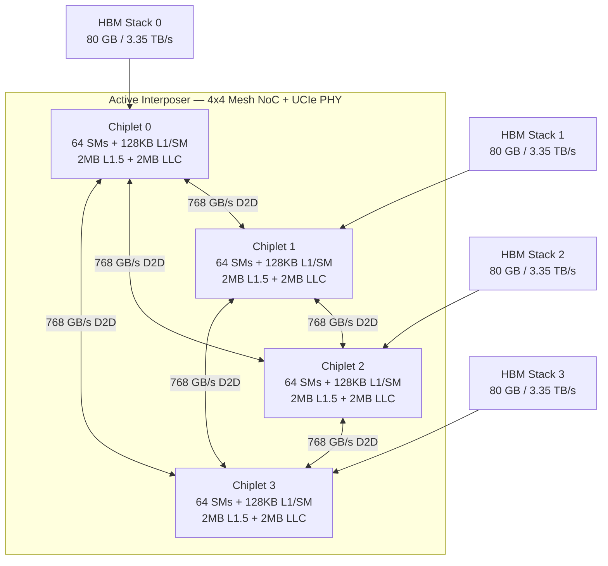
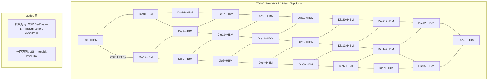
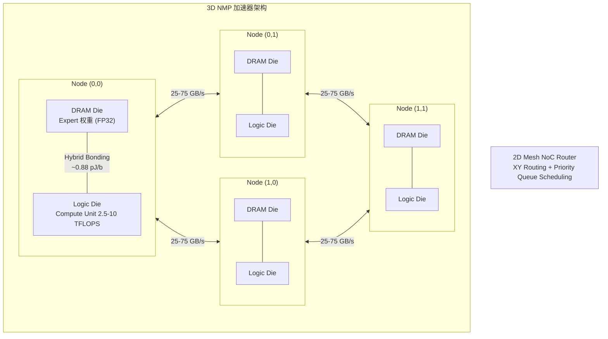
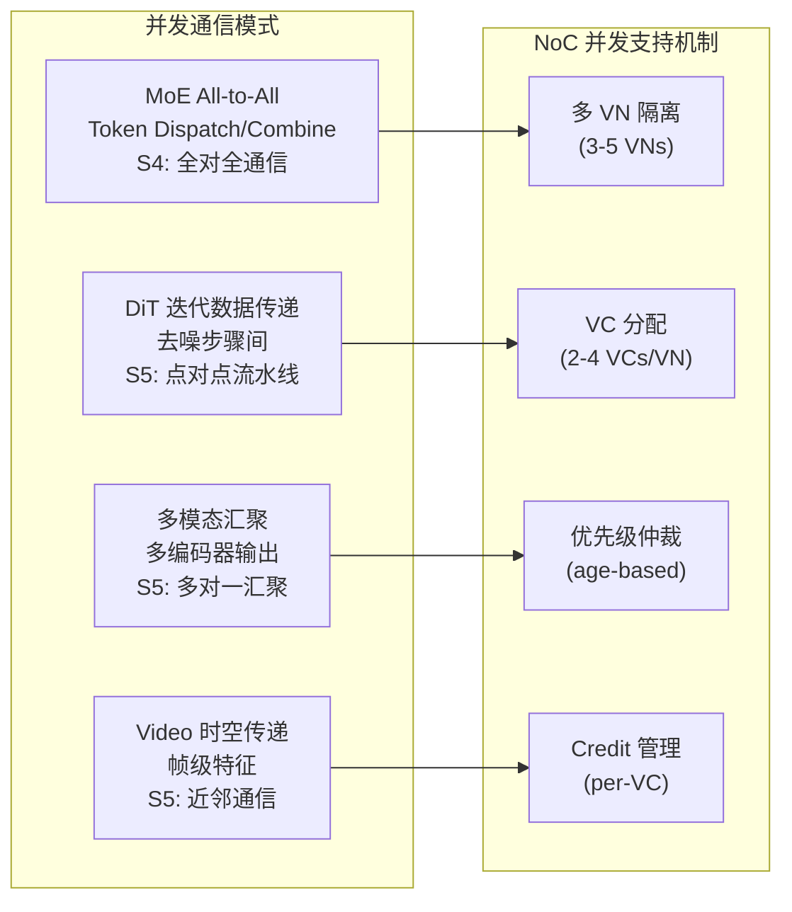
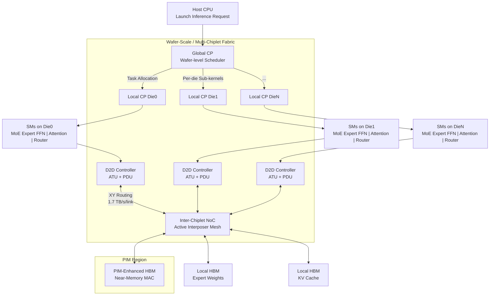

# Q6.1 — 芯片级设计方法如何从硬件体系结构层面支持多算子/微算子并发推理

## 笔记证据概览

| 路径 | 分数 | 关键信息 |
|------|------|----------|
| knowledge_notes/芯片知识笔记/Open Chiplet Ecosystem and Inter-Chiplet Deadlock _ 开放芯粒生态与跨芯粒死锁.md | 3296 | Chiplet 生态系统、UCIe 标准、跨芯粒死锁问题、DFBM |
| knowledge_notes/芯片知识笔记/Multi-Chiplet GPU (MCM-GPU) Architecture _ 多芯粒GPU架构.md | 143 | MCM-GPU 架构、NUMA 效应、cache hierarchy、CTA scheduling |
| knowledge_notes/芯片知识笔记/Wafer-Scale Engine (WSE _ 晶圆级引擎).md | text | WSE-2 晶圆级引擎、2D mesh、数据流架构、分布式 SRAM |
| knowledge_notes/芯片知识笔记/System-on-Wafer (SoW) Technology (晶圆级系统集成技术).md | 795 | TSMC SoW、LSI/XSR SerDes、8×3 2D mesh 拓扑、D2D 延迟模型 |
| knowledge_notes/硬件知识笔记/Wafer-Scale Multi-Chiplet GPU for MoE Serving (晶圆级多芯粒GPU的MoE推理).md | text | Tesla Dojo 5×5、TSMC SoW 8×3、MoE 推理执行流程、两级 CP |
| knowledge_notes/硬件知识笔记/3D Near-Memory Processing (3D NMP) for MoE LLM Inference.md | 9244 | Hybrid Bonding、2D mesh NoC、分布式内存+计算、HD-MoE |
| knowledge_notes/硬件知识笔记/Processing-in-Memory (PIM) for LLM MoE Inference（面向LLM MoE推理的存内计算）.md | 397 | PIM 架构、Duplex、Ridge Point、低 batch 优势 |
| knowledge_notes/芯片知识笔记/DRAM-Based Processing-in-Memory (PIM).md | 333 | GDDR6-AiM、bank-level parallelism、MAC_ABK、Ramulator |
| knowledge_notes/硬件知识笔记/2D Mesh NoC in 3D Near-Memory Processing.md | 7855 | XY routing、Manhattan distance、all-to-all dispatch/combine、link balance |
| knowledge_notes/硬件知识笔记/Two-Level Command Processor (两级命令处理器).md | text | Global CP + Local CP、Expert Distribution Table、Cross-token Heatmap |
| knowledge_notes/kernel知识笔记/Multi-Die Task Allocation for MoE (多Die MoE任务分配).md | text | Candidate Mechanism、Block-Granularity Distribution、Cost Model |
| knowledge_notes/硬件知识笔记/Hardware-Managed HBM with ATU and PDU (硬件管理的HBM缓存).md | text | ATU 地址翻译、PDU 预测表、predictor-driven selective duplication |
| knowledge_notes/芯片知识笔记/Active Interposer _ 主动中介层.md | 65 | Active vs passive interposer、interposer NoC、VC/VN 管理 |
| knowledge_notes/系统知识笔记/Single-GPU-like Programming Model for Multi-Die GPU (多Die GPU的统一编程模型).md | text | 统一编程模型 vs Multi-GPU-like、硬件透明优化 |
| paper_secs/secs_2026/61-Deadlock-Free Bridge Module.../A.-Chiplet-Ecosystem.md | 4625 | Chiplet 标准化阶段、coherence 协议、跨芯粒死锁解决 |
| experiment_notes/硬件实验笔记/A Survey on Inference Optimization Techniques for Mixture of Experts Models.md | 1006 | MoNDE、Duplex、Space-mate 硬件方案综述 |
| experiment_notes/硬件实验笔记/Rethinking LLM Inference Bottlenecks.../ | 884 | PIM 在 MLA+MoE 场景的有效性评估、batch size 效应 |

---

## 一、方法细节：芯片级设计范式的硬件数据流与并发机制

### 1.1 Chiplet（芯粒）设计范式

#### 1.1.1 硬件架构与数据流

**笔记证据**：`knowledge_notes/芯片知识笔记/Multi-Chiplet GPU (MCM-GPU) Architecture _ 多芯粒GPU架构.md` (score: 143)；`knowledge_notes/芯片知识笔记/Open Chiplet Ecosystem and Inter-Chiplet Deadlock _ 开放芯粒生态与跨芯粒死锁.md` (score: 3296)

Chiplet 范式将传统 monolithic SoC 拆解为多个可复用芯粒，通过先进封装（如 TSMC CoWoS、Intel EMIB）集成在 shared interposer 上。每个 chiplet 包含 SM 阵列、私有 L1 cache、chiplet 内共享 L1.5/L2 cache、LLC slice 和本地 DRAM partition。所有 chiplet 的 DRAM partition 共同提供统一的全局地址空间（single logical GPU abstraction）。

**芯片拓扑 Mermaid 流程图（4-Chiplet GPU 系统）**：



**注解**：
- Chiplet 间通过 concentrated hierarchical crossbar 或 mesh NoC 互联，典型 D2D 带宽 768 GB/s，32 cycles/hop
- NUMA 效应：跨 chiplet 访存延迟可达本地 chiplet 的 10-15×（本地 HBM 300ns vs 远程 300ns + N×200ns/hop + 返回路径）
- 同步放大：额外 cache level（L1.5/L2）使 acquire/release 需要 invalidate/flush 更深层次
- 工艺优势：单 die 面积受 photomask 限制（800-1000 mm²），chiplet 突破此限制

#### 1.1.2 关键设计决策：Inter-Chiplet Deadlock 解决

**笔记证据**：`paper_secs/secs_2026/61-Deadlock-Free Bridge Module.../A.-Chiplet-Ecosystem.md` (score: 4625)

即使单个 chiplet 内部 NoC 已 deadlock-free，当多个 chiplet 通过 active interposer 互连后，chiplet NoC 与 interposer NoC 之间可能形成跨 chiplet 的 cyclic channel dependency。现有方案存在严重权衡：

| 方案 | 机制 | 优势 | 劣势 |
|------|------|------|------|
| MTR (Modular Turn Restriction) | 边界路由器转向限制 | 模块化 | 负载不均、非拓扑无关 |
| DeFT | 专用 VC 隔离上下行流量 | 拓扑无关 | 每 VN 需 ≥2 VC，集成开销高 |
| RC | 片内 permission network 控制注入 | 高资源利用率 | 供应商锁定 |
| UPP/Steered Bubble | 允许死锁发生再恢复 | 高资源利用率 | 需死锁检测逻辑 |
| **DFBM**（本文） | Bridge module 外置在 interposer 侧 | 零侵入、拓扑无关、标准化 | interposer 侧面积增加 |

DFBM 的设计决策核心：将 deadlock 处理从 chiplet 内部外移到 interposer 侧 bridge module，chiplet 供应商只需提供协议参数（coherence state machine 依赖、最大 outstanding request 数、VC 数量），无需暴露内部 NoC 实现。这对多算子并发至关重要——不同供应商的 chiplet 可在不暴露内部细节的情况下安全组合。

#### 1.1.3 并发支持机制：Active Interposer 上的多算子并发

**笔记证据**：`knowledge_notes/芯片知识笔记/Active Interposer _ 主动中介层.md` (score: 65)

Active interposer 嵌入有源逻辑电路（NoC 路由器、VC buffer、credit 管理），构成 chiplet 间共享通信基础设施。每个 chiplet 通过 boundary router + vertical channel (TSV-based) 接入 interposer NoC。典型配置：4×4 mesh topology + XY routing + 3 VN + per-VN 2/4 VC + virtual cut-through flow control。

多算子并发机制在 interposer 层的工作方式：
- **并发通道隔离**：不同 coherence 消息类（Request/Forward/Response）分配到不同 VN（最少 3 个 VN），在 interposer NoC 上并发传输不互相阻塞
- **Credit-based flow control**：每 VC 独立 credit 管理，避免一个 chiplet 的慢速消费阻塞其他 chiplet 的通信
- **DFBM 的 shared deadlock buffer**：当多个 chiplet 同时发起跨 chiplet 通信时，bridge module 协调 credit 分配和缓冲管理

---

### 1.2 Wafer-Scale（晶圆级）集成范式

#### 1.2.1 硬件架构与数据流

**笔记证据**：`knowledge_notes/芯片知识笔记/Wafer-Scale Engine (WSE _ 晶圆级引擎).md` (text)；`knowledge_notes/芯片知识笔记/System-on-Wafer (SoW) Technology (晶圆级系统集成技术).md` (score: 795)；`knowledge_notes/硬件知识笔记/Wafer-Scale Multi-Chiplet GPU for MoE Serving (晶圆级多芯粒GPU的MoE推理).md` (text)

Wafer-scale 有两种代表架构：

**架构 A：Cerebras WSE-2（单体晶圆级引擎）**
- TSMC 7nm，46,225 mm²，2.6 万亿晶体管，850,000 AI 核心
- 40 GB on-chip SRAM，20 PB/s 内存带宽
- 84 die 通过专有互联拼接为统一 2D mesh
- 每 PE 48 KB scratchpad SRAM，分布式内存模型（无共享内存、无硬件 cache coherence）
- Weight streaming：参数从片外 MemoryX 流到片内，激活在片上流转

**架构 B：Tesla Dojo / TSMC SoW（多芯粒晶圆级封装）**



**注解**：
- Dojo 配置：5×5 2D mesh，25 die，每 die 1000 TFLOPS FP16，80GB HBM，3.35 TB/s HBM BW
- SoW 配置：8×3 2D mesh，24 compute dies + 96 HBM dies，总面积 >200,000 mm²
- D2D 延迟模型（以 Die0 访问 Die7 expert 数据为例）：7 hops × 200ns + 300ns remote HBM + 7 hops × 200ns return = 3100ns total，约 10× 于本地 HBM (300ns)
- 与 GPU 物理对比：WSE-2 面积 57× H100，片上内存 800×，带宽 10,000×
- 当前状态：Tesla Dojo 已部署，TSMC SoW 仍在 roadmap 阶段

#### 1.2.2 关键设计决策：Two-Level Command Processor

**笔记证据**：`knowledge_notes/硬件知识笔记/Two-Level Command Processor (两级命令处理器).md` (text)

Wafer-scale GPU 上的多算子并发需要重新设计 Command Processor。传统 GPU 的单层 CP 将所有 SM 视为均等资源（忽略物理位置和 data placement），在 wafer-scale 场景下导致大量不必要的 D2D traffic 和严重负载不均。

**两级 CP 的硬件组织**：

```
Hardware Organization:
├── Global CP (wafer 级，1 个)
│   ├── A76-class ARM core (~1.1 mm², ~1 W at 5nm)
│   ├── Expert Distribution Table (4.5 KB SRAM)
│   │   └── 每 entry: expert_id | die_id | n-bit distribution bitmask
│   ├── Cross-token Heatmap Cache (0.5 MB on-chip SRAM)
│   │   └── 缓存一层 heatmap (512 × 512 experts, 512-bit width)
│   └── DRAM: full heatmap 50 MB
│
├── Local CP × 25 (每 die 1 个)
│   ├── A72-class ARM core (~0.3 mm² each, ~280 mW each at 5nm)
│   └── 功能: SM task dispatch + D2D controller config
│
└── D2D Controller (每 die 1 个，含 ATU + PDU)
    ├── ATU (4.25 KB SRAM, 68-bit entries)
    └── PDU (128 B register file, 16-bit entries)
```

**Kernel Launch 并发工作流**：

```
Step 1: Host CPU → Global CP: "Launch MoE kernel for layer l"
Step 2: Global CP:
   a. 读取 expert_reqs_dict (每 expert 的请求数)
   b. 运行 Task Allocation Algorithm → allo_plan
   c. 运行 Predictor → cp_en bits per die
   d. 打包: sub-kernel descriptor + prediction info
Step 3: Global CP → Local CPs (via D2D): 并发发送 sub-kernels 到所有 die
Step 4: 每个 Local CP (并发执行):
   a. 分配 sub-kernel 任务到本 die 的 SMs
   b. 配置 D2D controller 的 PDU prediction table
   c. 等待 SM completion
Step 5: Local CPs → Global CP: 并发报告 expert duplication statistics
Step 6: Global CP: 更新 Expert Distribution Table
```

**注解**：
- 总面积/功耗 overhead <0.04%（6.13 mm² / 8.59 W per 25-die wafer）
- Expert Distribution Table 使用 n-bit bitmask 而非 single die ID，支持 expert 被复制到多个 die
- 若未来编程模型演化为 multi-GPU-like，算法可在 host CPU 软件层实现——但 host CPU overhead 在 Dojo-Enhanced 上可达 42-51.6%

#### 1.2.3 并发调度机制：Multi-Die Task Allocation

**笔记证据**：`knowledge_notes/kernel知识笔记/Multi-Die Task Allocation for MoE (多Die MoE任务分配).md` (text)

这是运行在 Global CP 上的启发式算法，将 MoE kernel 计算按 expert 拆分为 per-die 子任务，支持多 die 并发执行。核心机制：

**Candidate Mechanism**：扩展候选 die 到邻居 die（Manhattan distance ≤ 1），而非仅限于 expert 所在 die。在 workload balance 和 D2D traffic 之间 trade-off——传统 EP 将所有请求分配到本地 die 以避免 D2D，但导致热门 expert 所在 die 严重过载。

**Block-Granularity Distribution**：以 block size=50 为单位分配请求，在分配精度和算法开销间折中。

**Cost Model** 三维评估：
- $C_{\text{DRAM}}$：读取 expert 权重的 HBM access time（local=300ns, remote=300ns + hops×200ns）
- $C_{\text{compute}}$：基于 die 的 FP16 TFLOPS 估算 GEMM 执行时间
- $C_{\text{D2D}}$：跨 D2D links 的通信时间（通过 central resource manager 建模 bandwidth contention）

**效果**：Allo Only 降 hop count 142×（vs Base），实现 6.3× throughput。运行频率：每 MoE layer kernel launch 时执行一次（非 per-token）。

#### 1.2.4 并发数据搬移机制：Hardware-Managed HBM

**笔记证据**：`knowledge_notes/硬件知识笔记/Hardware-Managed HBM with ATU and PDU (硬件管理的HBM缓存).md` (text)

通过在 D2D controller 中集成 ATU（Address Translation Unit）和 PDU（Prediction Unit），实现对远程 HBM 中热门 expert 权重的硬件自动本地缓存。软件/CUDA 程序完全无感知。

**并发数据流路径**：

```
Case 1: Remote Read → 数据未被本地缓存
SM → D2D Controller → check PDU.is_local[e]=0 → 正常 D2D read (multi-hop XY routing)
→ remote die HBM → return data → 若 PDU.cp_en[e]=1: 写入本地 HBM + ATU 建立映射

Case 2: Local Read → 数据已被本地缓存
SM → D2D Controller → PDU.is_local[e]=1 → ATU 地址翻译 A_remote→A_local
→ 重定向到本地 LLC (100ns hit) 或本地 HBM (300ns) —— 完全避免 D2D 延迟
```

**注解**：
- ATU: 4.25 KB SRAM, 68-bit entries, 支持 512 remote-to-local mappings
- PDU: 128 B register file, 16-bit entries, 每 die 最多 track 64 experts
- 总面积/die: ~0.0068 mm²; 功率: ~390 mW
- 这不是传统 cache（不基于 LRU），而是 predictor-driven selective duplication
- 可推广到 CXL-based systems、SSD offloading、PIM systems

---

### 1.3 PIM（Processing-in-Memory）/ 存内计算范式

#### 1.3.1 硬件架构与数据流

**笔记证据**：`knowledge_notes/硬件知识笔记/3D Near-Memory Processing (3D NMP) for MoE LLM Inference.md` (score: 9244)；`knowledge_notes/芯片知识笔记/DRAM-Based Processing-in-Memory (PIM).md` (score: 333)；`knowledge_notes/硬件知识笔记/Processing-in-Memory (PIM) for LLM MoE Inference（面向LLM MoE推理的存内计算）.md` (score: 397)

PIM 范式分为两大子类：

**子类 A：DRAM-Based PIM（计算嵌入 DRAM 内部）**

以 SK hynix GDDR6-AiM (ISSCC 2022) 为代表：16 个 DRAM bank，每 bank 配备专用 MAC 和 AF（Activation Function）单元。PIM 操作通过 ISR（Instruction Set Register）指令从外部 host controller 发送到 AiM DRAM controller。

```
GDDR6-AiM 芯片内部并发结构:
┌──────────────────────────────────────────────┐
│           AiM DRAM Controller                 │
│  ISR | Command Decoder | Address Translator   │
├────┬────┬────┬────┬────┬────┬────┬────┬────┤
│ B0 │ B1 │ B2 │ B3 │ B4 │ B5 │ B6 │ B7 │ ...│ 16 Banks
│+MAC│+MAC│+MAC│+MAC│+MAC│+MAC│+MAC│+MAC│    │
│+AF │+AF │+AF │+AF │+AF │+AF │+AF │+AF │    │
├────┴────┴────┴────┴────┴────┴────┴────┴────┤
│           Global Buffer (GB)                 │
└──────────────────────────────────────────────┘
```

MAC_ABK（All-Bank MAC）：16 bank 同时执行 256-bit MAC 操作——每个 bank 从自身存储阵列读取 operand，送入 bank-local MAC 单元执行乘加，结果写回 bank 或 Global Buffer。

**子类 B：3D Near-Memory Processing（3D NMP）**

通过 Hybrid Bonding 将 DRAM die 垂直堆叠在逻辑 die 之上（Cu-Cu 直接键合，110,000/mm² at 3µm pitch）。每个计算节点拥有独立 local memory bank（无共享内存），通过 2D mesh NoC 互联。



**注解**：
- 3D NMP 与 GPU 关键区别：无 shared L2 cache、无 global memory、分布式 bank-local memory、有限 NoC 带宽（非 NVLink/NVSwitch）
- Hybrid Bonding 能效：~0.88 pJ/b，远优于传统 PCB 互连
- Logic die 可使用先进 CMOS 工艺独立于 DRAM 工艺节点
- PIM 的 Ridge Point（RP_acc = 8 Op/B）远低于 GPU（RP_acc = 281），适合 memory-bound 操作

#### 1.3.2 并发执行机制：MoE Token Dispatch/Combine

**笔记证据**：`knowledge_notes/硬件知识笔记/3D Near-Memory Processing (3D NMP) for MoE LLM Inference.md` (score: 9244)

3D NMP 上的 MoE 多算子并发执行流程：

```
Phase 1: Token Dispatch (all-to-all)
  每个 token 的 hidden state 通过 NoC 路由到持有其 activated expert 的节点
  并发性：所有 token 的 dispatch 可同时进行（受 NoC link bandwidth 限制）

Phase 2: Expert FFN Compute (per-node 并发)
  节点从 local DRAM 读取 expert 权重 → compute unit 执行 GEMM
  并发性：所有节点的 expert 计算完全并行（无跨节点依赖）
  Intra-node 并发：gate_proj、up_proj、down_proj 可流水线执行

Phase 3: Result Combine (all-to-all)
  各节点计算结果通过 NoC all-to-all combine 聚合
  并发性：与 dispatch 对称，所有 combine 消息并发传输
```

HD-MoE 的关键优化——Link Balance：使用 Bayesian Optimization 搜索逻辑集群到物理节点的映射，最小化 NoC 链路级拥塞，在保持并发性的同时避免热点链路。

#### 1.3.3 设计决策：PIM 在 MLA+MoE 场景的适用性边界

**笔记证据**：`knowledge_notes/硬件知识笔记/Processing-in-Memory (PIM) for LLM MoE Inference（面向LLM MoE推理的存内计算）.md` (score: 397)；`experiment_notes/硬件实验笔记/Rethinking LLM Inference Bottlenecks.../` (score: 884)

关键发现（笔记显示）：
- **低 batch size (B < 32)**：PIM 优势明显——MoE expert FC 层 ArI 低，PIM 的 4× GPU HBM 带宽优势使执行时间更短
- **高 batch size (B > 64)**：GPU 优势——大 batch 使 FC 层 ArI 超过 PIM 的 RP_acc=8，GPU 以 RP_acc=281 提供更高计算吞吐
- MLA + MoE 架构下，大 batch 推理已成为主流（MLA 释放了 KV cache 约束），PIM 仅适用于低 batch/低序列长度的推理场景

---

### 1.4 NoC（Network-on-Chip）/ 片上网络范式

#### 1.4.1 硬件架构与拓扑设计

**笔记证据**：`knowledge_notes/硬件知识笔记/2D Mesh NoC in 3D Near-Memory Processing.md` (score: 7855)；`knowledge_notes/芯片知识笔记/Channel Dependency Graph (CDG) for Multi-Chiplet NoC _ 多芯粒NoC的通道依赖图.md` (score: 201)

NoC 是 chiplet 间和 3D NMP 节点间通信的基础设施。核心设计要素：

**拓扑选择**：

| 拓扑 | 直径（N×N） | 对分带宽 | 典型应用 |
|------|------------|----------|----------|
| 2D Mesh | 2(N-1) | N links | Dojo 5×5、SoW 8×3、3D NMP 4×4-8×8 |
| Torus | N | 2N links | 高端 HPC 芯片 |
| Concentrated Crossbar | 1 (logical) | N² links | LRM-GPU 4-chiplet |
| Tree/Fat-Tree | 2log(N) | 可变 | 异构 SoC |

**路由策略**：
- XY Routing：先沿 X 轴后沿 Y 轴，Manhattan 最短路径，deadlock-free（在单 NoC 内）
- 适用场景：规则 mesh 拓扑，确定性延迟
- 变体：YX Routing、Odd-Even Turn Model、West-First Turn Model

**流控机制**：
- Virtual Cut-Through：整包转发，需足够 buffer
- Wormhole：分 flit 转发，buffer 需求小但易 head-of-line blocking
- Credit-based：每 VC 独立 credit，精确流控

#### 1.4.2 多算子并发通信模式与 NoC 支持



**注解**：
- MoE all-to-all 是最具挑战的通信模式——在 Dojo 5×5 上，每 token 需和 top-k expert 所在 die 通信，产生多跳 D2D traffic
- 多 VN 隔离使不同通信类型（coherence request/forward/response）并发传输不互相阻塞
- CDG（Channel Dependency Graph）理论：NoC 死锁的充要条件是 CDG 有环。多 chiplet NoC 的死锁环可跨越 chiplet 内部 NoC 和 interposer NoC 的边界

---

### 1.5 综合并发机制：跨越四种范式的运行时调度全景

**笔记证据**：综合以上所有笔记

以下是从芯片级视角，四种设计范式如何在硬件层面协同支持 MoE/DiT/多模态/Video 多算子并发推理的完整数据流：



**运行时并发层次总览**：

| 层次 | 并发机制 | 支撑范式 | 关键硬件模块 |
|------|----------|----------|-------------|
| Die 间并发 | Multi-Die Task Allocation（Candidate + Block-Granularity） | Chiplet, Wafer-Scale | Global CP, Local CP |
| Die 内并发 | SM 阵列并行执行 sub-kernel（traditional GPU concurrency） | Chiplet | SMs, Warp Scheduler |
| 数据搬移并发 | ATU + PDU hardware-managed caching（predictor-driven） | Chiplet, Wafer-Scale | D2D Controller |
| 通信并发 | Multi-VN + Multi-VC + XY Routing + Credit Flow Control | NoC, Chiplet | Interposer NoC Router |
| 存算并发 | Bank-level parallelism, MAC_ABK, near-memory compute | PIM, 3D NMP | PIM MAC units, Hybrid Bonding |

**注解**：
- 四种范式的并发是垂直叠加的——NoC 提供通信基础设施，Chiplet/Wafer-Scale 提供计算粒度，PIM 减少数据搬运，两级 CP 协调全局调度
- 笔记显示的关键瓶颈：在 wafer-scale GPU 上，热门 expert 所在 die 可能处理 16× 于平均的请求量（负载倾斜），Candidate Mechanism 和 hardware-managed caching 正是为解决此问题设计
- 总硬件开销 <0.04% die 面积即可实现上述全部并发优化

---

## 二、实验环境

### 2.1 各范式的模拟与评估平台

**笔记证据**：`experiment_notes/硬件实验笔记/A Survey on Inference Optimization Techniques for Mixture of Experts Models.md` (score: 1006)

| 范式 | 模拟器/平台 | 建模粒度 | 验证方式 |
|------|-----------|----------|----------|
| Wafer-Scale GPU (Orders in Chaos) | 自研 Python event-driven simulator（开源） | Die 级（LLC, HBM, D2D links, compute units, central resource manager） | 两种 chiplet 拓扑（Dojo 5×5, SoW 8×3）+ 四种 MoE 模型 |
| 3D NMP (HD-MoE) | 自研 Python 离散事件模拟器 | Node 级（compute unit, DRAM bank, NoC link） | ASTRA-sim 交叉验证（ring all-reduce 误差 <1%） |
| DRAM-PIM (PIMphony) | Ramulator 2.0 + AiM simulator | Cycle-accurate DRAM command timing | SK hynix AiMX specification |
| PIM (Duplex) | 论文自研微架构模拟器 | HBM-based PIM bank 级 | 未公开开源 |
| Chiplet NoC (DFBM) | Gem5 + Garnet | Cycle-accurate NoC（router, VC, link） | 4-chiplet + interposer 系统 |
| Cerebras WSE-2 (BTA) | CS-2 真实硬件 | 850K PE 晶圆级 | Qwen3-30B-A3B 训练实测 |

### 2.2 关键评估指标

**笔记证据**：`knowledge_notes/硬件知识笔记/Two-Level Command Processor (两级命令处理器).md` (text)；`knowledge_notes/kernel知识笔记/Multi-Die Task Allocation for MoE (多Die MoE任务分配).md` (text)

| 指标 | 测试场景 | 代表性数据 |
|------|----------|-----------|
| Hop count 降低 | Wafer-scale MoE 推理 | 142× (Allo Only vs Base), >213× (Allo+Pred) |
| Throughput 提升 | Wafer-scale MoE 推理 | 6.3× (Allo Only), 7.5× (SoW Allo+Pred) |
| 硬件开销 | Two-Level CP + ATU + PDU | <0.04% die 面积（6.13 mm² / 25-die wafer） |
| 功耗开销 | Two-Level CP + ATU + PDU | <8.59 W per 25-die wafer (5nm) |
| NoC 链路带宽 | 3D NMP | 25-75 GB/s per link |
| D2D 带宽 | Wafer-scale GPU | 1.7 TB/s per adjacent die pair |
| D2D 延迟 | Wafer-scale GPU | 200 ns/hop |

---

## 三、实现（辅助说明）

### 3.1 编程模型抽象

**笔记证据**：`knowledge_notes/系统知识笔记/Single-GPU-like Programming Model for Multi-Die GPU (多Die GPU的统一编程模型).md` (text)

笔记显示，两种编程模型存在根本性分歧：

- **Single-GPU-like**（论文 Orders in Chaos 采用，与 Blackwell/Rubin 一致）：将整个 multi-chiplet/wafer-scale GPU 暴露为统一单 GPU，CUDA 程序无需修改。硬件（Global/Local CP + ATU/PDU）在底层自动处理 data placement 和 task allocation。
- **Multi-GPU-like**（WSC-LLM, MoEntwine）：将 wafer 暴露为多 GPU 系统，通过 NCCL/NVSHMEM 显式管理跨 die 通信。提供更精细控制但偏离行业趋势。

核心 trade-off：编程简单性 vs 性能。Single-GPU-like 下 local vs remote data access 延迟差距可达 15×，完全依赖硬件优化弥补。

### 3.2 商业产品实现进展

**笔记证据**：`knowledge_notes/芯片知识笔记/Multi-Chiplet GPU (MCM-GPU) Architecture _ 多芯粒GPU架构.md` (score: 143)

- AMD MI300X：8 compute chiplets
- NVIDIA Blackwell B200：2 reticle-limited die 通过 NV-HBI (10 TB/s) 连接
- NVIDIA Rubin：规划 4 chiplets
- Cerebras WSE-2：850,000 PE，CS-2 系统，Llama 4 推理达 2,522 tokens/s
- Samsung HBM-PIM：在 HBM cube 中嵌入 PE，配合 AMD MI100 GPU
- SK hynix GDDR6-AiM/AiMX：PCIe 加速卡形态（32GB），支持 vLLM

---

## 四、是什么？（辅助说明）

### 4.1 四种芯片设计范式的定义

| 范式 | 核心思想 | 代表性系统 | 笔记来源 |
|------|----------|-----------|----------|
| **Chiplet** | 将 monolithic SoC 拆解为可复用芯粒，通过标准接口（UCIe）和 interposer 集成 | AMD MI300X, NVIDIA Blackwell | `知识笔记/芯片知识笔记/Multi-Chiplet GPU` |
| **Wafer-Scale** | 在整片晶圆上集成计算核心，消除 off-chip 通信瓶颈 | Cerebras WSE-2, Tesla Dojo, TSMC SoW | `知识笔记/芯片知识笔记/Wafer-Scale Engine` |
| **PIM** | 将计算逻辑放置在 DRAM/HBM 内部或附近，减少数据搬运 | Samsung HBM-PIM, SK hynix GDDR6-AiM, UPMEM | `知识笔记/芯片知识笔记/DRAM-Based PIM` |
| **NoC** | 片上网络替代传统总线/Crossbar，提供可扩展的包交换通信 | 2D Mesh (Dojo, SoW), Torus (HPC) | `知识笔记/硬件知识笔记/2D Mesh NoC in 3D NMP` |

### 4.2 各范式对多算子/微算子并发的支持机制总览

- **Chiplet**：die 间并发通过 inter-chiplet NoC + D2D controller 实现，die 内并发继承传统 GPU SM 阵列
- **Wafer-Scale**：两级 CP 将 MoE kernel 拆为 per-die sub-kernel 并发执行，ATU/PDU 消除重复 D2D 数据搬移
- **PIM**：bank-level parallelism 实现存内并发 MAC，3D NMP 通过 2D mesh NoC 实现分布式节点间并发
- **NoC**：multi-VN/VC 隔离实现不同通信类的并发传输，XY routing 提供确定性延迟，link balance 优化避免拥塞

---

## 五、方法对比表

| 方法 | 核心机制 | 并发支持粒度 | 硬件平台 | 关键指标 | 适用负载 | 笔记证据 |
|------|----------|-------------|----------|----------|----------|----------|
| Multi-Chiplet GPU (MCM) | Interposer NoC + D2D Controller + NUMA-aware CTA scheduling | Die 级并发（4-25 die），SM 级并发（百-千 SM） | AMD MI300X, NVIDIA Blackwell | D2D BW 768 GB/s-10 TB/s, 32 cycles/hop | 通用 AI 负载 | `知识笔记/芯片知识笔记/Multi-Chiplet GPU` |
| Cerebras WSE-2 | 2D mesh + distributed SRAM + weight streaming + dataflow execution | PE 级并发（850K PE），无共享内存 | Cerebras CS-2 | 46,225 mm², 20 PB/s on-chip BW, 2,522 tok/s (Llama 4) | MoE 训练/推理（BTA 优化 attention 内存） | `知识笔记/芯片知识笔记/Wafer-Scale Engine` |
| Tesla Dojo + TSMC SoW | Two-Level CP + Multi-Die Task Allocation + ATU/PDU hardware caching | Wafer 级并发（24-25 die），per-die sub-kernel 并行 | Tesla Dojo 5×5, TSMC SoW 8×3 | 6.3-7.5× throughput, 142× hop reduction, <0.04% area overhead | Large-scale MoE (200B-1000B) | `知识笔记/硬件知识笔记/Wafer-Scale Multi-Chiplet GPU` |
| 3D NMP (HD-MoE) | Hybrid Bonding + 2D mesh NoC + distributed memory + Link Balance | Node 级并发（16-64 nodes），每 node 独立 memory bank | 3D NMP 加速器 | 25-75 GB/s NoC link, ~0.88 pJ/b, 2.5-10 TFLOPS/node | MoE LLM 推理（低-中 batch） | `知识笔记/硬件知识笔记/3D Near-Memory Processing` |
| DRAM-Based PIM (GDDR6-AiM) | Bank-level MAC parallelism + ISR instruction set + all-bank concurrent MAC | Bank 级并发（16 banks simultaneous MAC） | SK hynix GDDR6-AiM, Samsung HBM-PIM | 1 TFLOPS/chip, 16-32 TB/s internal BW | Memory-bound MoE FFN（低 batch） | `知识笔记/芯片知识笔记/DRAM-Based PIM` |
| Open Chiplet Ecosystem + DFBM | Bridge module 外置 deadlock 处理 + multi-VN/VC 隔离 + credit flow control | 跨 chiplet 通信并发（3 VN, 2-4 VC/VN, 4-chiplet system） | UCIe-compliant interposer | Deadlock-free, zero-intrusive integration, topology agnostic | 异构 chiplet 集成 | `paper_secs/.../A.-Chiplet-Ecosystem` |
| 2D Mesh NoC | XY routing + Manhattan shortest path + priority queue link scheduling | Link 级并发（每 link 独立调度） | 3D NMP, Dojo, SoW | Per-link 25-75 GB/s (3D NMP), 1.7 TB/s (D2D) | 所有模型负载的片内数据搬移 | `知识笔记/硬件知识笔记/2D Mesh NoC in 3D NMP` |

---

## 不确定性

1. **Wafer-scale 商用成熟度**：笔记显示 TSMC SoW 仍在 roadmap 阶段（2025 ECTC 展示 SoW-X），尚未商用。Tesla Dojo 是已部署的 wafer-scale 系统代表，但其内部架构细节公开有限。Cerebras WSE-2 是当前唯一大规模商用的晶圆级 AI 芯片。

2. **PIM 在大 batch 推理的适用性**：笔记明确指出大 batch（B > 64）下 GPU 优于 PIM（因 Ridge Point 差异），这与当前 MLA + MoE 架构的主流趋势一致。但笔记未说明未来 PIM 计算能力提升是否能改变此边界。

3. **RERAM/新型非易失存储器集成**：笔记中 RERAM crossbar 相关信息主要出现在参考文献中（MIMDRAM 论文），但缺乏针对 MoE/DiT/多模态/Video 场景下 RERAM 集成的具体设计方法和实验数据。该链条节点证据不足。

4. **多模态和 Video 负载的芯片级设计**：笔记主要集中在 MoE LLM 推理场景。DiT（扩散模型）和多模态/Video 的芯片级设计方法缺乏直接的笔记证据，相关结论主要基于 NoC 和 chiplet 通用机制的推断。

5. **NPU 芯片级设计**：笔记中 NPU 相关内容不足（仅在 Meta 芯片论文中提及）。NPU 的芯片级多算子并发设计方法未在 vault 中找到充分证据。

6. **NoC 拓扑定量对比**：笔记提供了 2D mesh 的详细数据（Dojo 5×5, SoW 8×3），但对 Torus、Butterfly、Tree 等其他拓扑在 AI 推理负载下的定量对比缺乏笔记证据。

[ANSWER_AGENT_DONE] Q6.1
