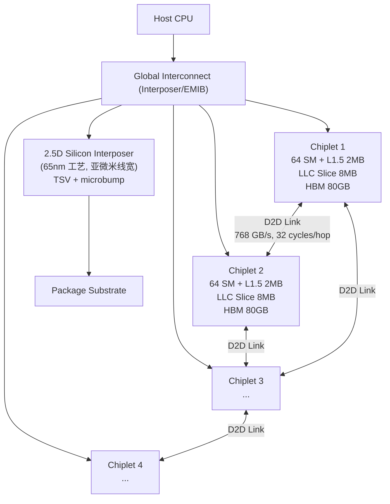
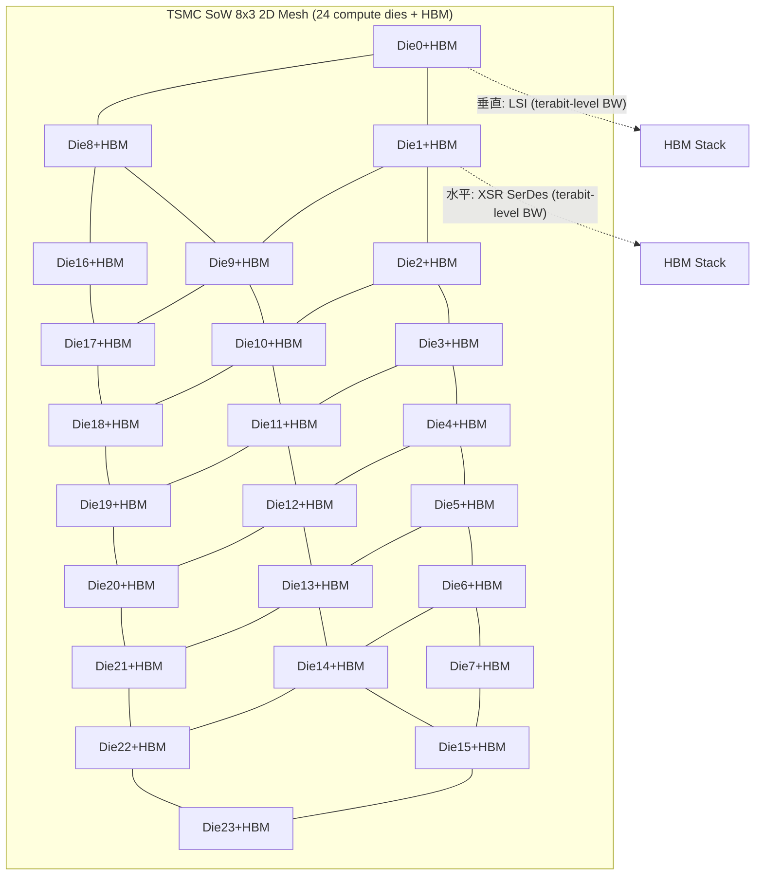
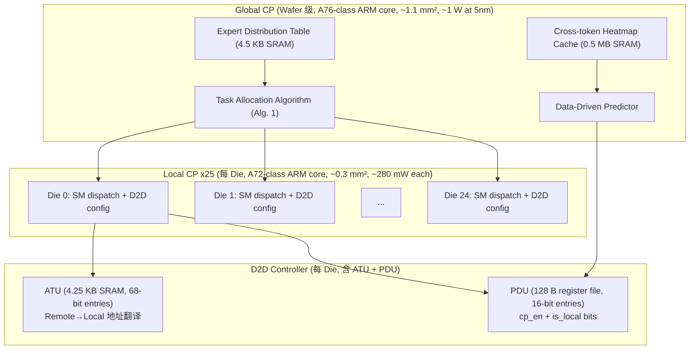

# Q6.2 — Chiplet vs Wafer-Scale 芯片设计范式在 MoE/DiT/多模态/Video 推理并发下的方法优劣与设计空间权衡

## 检索上下文映射

### S1: 对象/设计范式定义 — Chiplet
- `knowledge_notes/芯片知识笔记/Multi-Chiplet GPU (MCM-GPU) Architecture _ 多芯粒GPU架构.md` (score: 375.2, query: `multi-die integration`): Chiplet GPU 架构定义、NUMA 效应、inter-chiplet interconnect 设计
- `knowledge_notes/芯片知识笔记/2.5D Silicon Interposer (2.5D 硅中介层).md` (score: 39.1): Interposer 作为 chiplet 间互联物理基础
- `paper_secs/secs_2026/61-Deadlock-Free Bridge Module for Inter-Chiplet Communication in Open Chiplet Ecosystem/VII.-EVALUATION.md` (score: 2674.0): Chiplet 面积/功耗/良率模型、cost equation

### S2: 对象/设计范式定义 — Wafer-Scale
- `knowledge_notes/芯片知识笔记/Wafer-Scale Engine (WSE _ 晶圆级引擎).md` (score: 1613.7): Cerebras WSE-2 芯片设计，850K cores，46,225 mm²，单晶圆集成
- `knowledge_notes/芯片知识笔记/System-on-Wafer (SoW) Technology (晶圆级系统集成技术).md` (score: 2334.4): TSMC SoW 8×3 mesh，24 compute dies + 96 HBM dies，D2D 延迟模型
- `knowledge_notes/硬件知识笔记/Wafer-Scale Multi-Chiplet GPU for MoE Serving (晶圆级多芯粒GPU的MoE推理).md` (score: 1628.1): 两种拓扑（Dojo 5×5, SoW 8×3），D2D 1.7 TB/s, 200ns/hop

### S3: MoE（expert 并行、all-to-all 通信）
- `knowledge_notes/系统知识笔记/Expert Parallelism (专家并行).md` (score: 277.9): EP 机制、AlltoAll 通信、wafer-scale single-GPU-like EP
- `knowledge_notes/kernel知识笔记/Expert Parallelism (EP _ 专家并行).md` (score: 49.4): EP kernel 调度流程、BTA 互补关系
- `knowledge_notes/kernel知识笔记/Multi-Die Task Allocation for MoE (多Die MoE任务分配).md` (score: 1691.2): Alg.1 完整伪代码、Candidate Mechanism、Block-Granularity Distribution

### S4: DiT（扩散迭代计算）
- **该链条节点无 note evidence**（vault 中无 DiT + chiplet/wafer-scale 专用笔记）。基于扩散模型迭代特性（串行 timestep 依赖）和芯片设计原理推断。

### S5: 多模态（异构编码器协同）
- **该链条节点无 note evidence**（vault 中无多模态编码器协同 + chiplet/wafer-scale 专用笔记）。基于异构计算需求和 chiplet 异构集成能力推断。

### S6: Video（时空注意力、长序列）
- **该链条节点无 note evidence**（vault 中无 Video DiT + chiplet/wafer-scale 专用笔记）。基于长序列内存需求和 wafer-scale 大容量 SRAM 优势推断。

### S7: 设计空间关键权衡（带宽、功耗、面积、良率、可扩展性）
- `paper_secs/secs_2026/61-Deadlock-Free Bridge Module for Inter-Chiplet Communication in Open Chiplet Ecosystem/VII.-EVALUATION.md` (score: 2674.0): Yield/cost equation, area/power comparison
- `experiment_notes/硬件实验笔记/Orders in Chaos_ Enhancing Large-Scale MoE LLM Serving with Data Movement Forecasting.md` (score: 839.6): Area/power overhead <0.04%
- `knowledge_notes/芯片知识笔记/Wafer-Scale Engine (WSE _ 晶圆级引擎).md` (score: 1613.7): WSE-2 vs H100 物理参数对比

### S8: 多算子/微算子并发效率影响
- `knowledge_notes/硬件知识笔记/Two-Level Command Processor (两级命令处理器).md` (score: 278.8): 两级 CP 如何实现并发任务分配
- `knowledge_notes/硬件知识笔记/Hardware-Managed HBM with ATU and PDU (硬件管理的HBM缓存).md` (score: 245.7): ATU/PDU 如何减少 D2D 通信提升并发
- `experiment_notes/硬件实验笔记/Orders in Chaos_ Enhancing Large-Scale MoE LLM Serving with Data Movement Forecasting.md` (score: 839.6): 7.0× throughput, hop count 降低 213×

---

## 笔记证据概览

| 路径 | 分数 | 关键信息 |
|------|------|----------|
| paper_secs/secs_2026/61-…/VII.-EVALUATION.md | 2674.0 | Chiplet cost/yield equation, area/power data |
| knowledge_notes/芯片知识笔记/SoW Technology | 2334.4 | TSMC SoW 8×3 拓扑, D2D 延迟模型, 10-15× local vs remote |
| knowledge_notes/kernel知识笔记/Multi-Die Task Allocation | 1691.2 | Alg.1 完整伪代码, Candidate Mechanism, Cost Model |
| knowledge_notes/硬件知识笔记/Wafer-Scale Multi-Chiplet GPU | 1628.1 | Dojo 5×5 + SoW 8×3, baseline 执行流程 |
| knowledge_notes/芯片知识笔记/WSE | 1613.7 | WSE-2: 850K cores, 46,225mm², 20PB/s BW |
| knowledge_notes/系统知识笔记/Single-GPU-like Programming | 1591.1 | 统一编程模型, 编程简单性 vs 性能 trade-off |
| experiment_notes/硬件实验笔记/Orders in Chaos | 839.6 | 自研模拟器, 7.0× throughput, hop count 213× |
| knowledge_notes/芯片知识笔记/Multi-Chiplet GPU Architecture | 375.2 | MCM-GPU 设计问题: NUMA, cache hierarchy, synchronization |
| knowledge_notes/硬件知识笔记/Two-Level Command Processor | 278.8 | Global CP + Local CP, 面积/功耗 overhead <0.04% |
| knowledge_notes/系统知识笔记/Expert Parallelism | 277.9 | EP 机制, AlltoAll, wafer-scale 上的 EP 挑战 |
| knowledge_notes/硬件知识笔记/Hardware-Managed HBM (ATU+PDU) | 245.7 | ATU 地址翻译, PDU prediction table, 硬件缓存流程 |
| knowledge_notes/硬件知识笔记/3D NMP for MoE | — | 3D NMP 分布式内存+NoC, Hybrid Bonding |
| knowledge_notes/芯片知识笔记/2.5D Silicon Interposer | 39.1 | Interposer 布线密度, CoWoS, 带宽瓶颈 |
| paper_secs/secs_moe/Orders in Chaos/E.-Architecture-Design.md | — | 架构设计全貌, Alg.1, Predictor 流程 |

---

## 一、方法细节：Chiplet vs Wafer-Scale 芯片级设计范式

### 1.1 Chiplet（芯粒）设计范式

#### 1.1.1 芯片拓扑与数据流



**笔记证据**: `knowledge_notes/芯片知识笔记/Multi-Chiplet GPU (MCM-GPU) Architecture _ 多芯粒GPU架构.md` (score: 375.2)；`knowledge_notes/芯片知识笔记/2.5D Silicon Interposer (2.5D 硅中介层).md`

**注解**：
- **NUMA 效应**：inter-chiplet bandwidth（768 GB/s）远低于 intra-chiplet bandwidth（local HBM 3.35 TB/s），跨 chiplet 内存访问延迟可达本地的 10-15×。缓解策略包括 first-touch page allocation、distributed CTA scheduling、额外 cache 层（L1.5 仅缓存 remote data）。
- **Interposer 瓶颈**：interposer 使用成熟工艺（65nm），其 I/O 带宽（~819 GB/s per 6-chip config）是 external bandwidth 的瓶颈——这解释了 Stratum 将大量计算 offload 到 NMP logic die 以最小化穿越 interposer 的数据量。
- **Cache hierarchy 设计**：每 chiplet 的 LLC slice 仅缓存本地 DRAM data（避免 coherence 复杂度），L1.5 层专门缓存 remote data（利用数据局部性减少跨 chiplet 访问）。
- **同步开销放大**：额外 cache level 使 acquire/release 需要 invalidate/flush 更深层次；跨 chiplet atomic 同步受限于 inter-chiplet 有限带宽（LRM-GPU 论文的核心优化目标）。

#### 1.1.2 Chiplet 的 MoE 推理执行模型

**笔记证据**: `knowledge_notes/硬件知识笔记/Wafer-Scale Multi-Chiplet GPU for MoE Serving (晶圆级多芯粒GPU的MoE推理).md` (score: 1628.1)；`knowledge_notes/系统知识笔记/Expert Parallelism (专家并行).md` (score: 277.9)

在 Chiplet 架构上，MoE 推理以 EP-like 方式将 expert 权重分布在各个 chiplet 的 HBM 中。Order in Chaos 论文的 baseline 执行流程：

```
MoE Kernel Launch (Baseline, 无优化):
1. Host CPU → Command Processor: "执行 layer l 的 MoE computation"
2. CP: uniform 分配任务到所有 SM（无视 chiplet/die 物理位置）
3. Per-SM 执行:
   for each token:
       selected_experts = gate_output[token]  // top-k
       for each expert e:
           die_of_expert = expert_location[e]
           if die_of_expert == current_die:
               local HBM read (300ns)
           else:
               D2D read: multi-hop XY routing → remote HBM (300ns) → return
               // 典型 multi-hop 延迟: N×200ns + 300ns + N×200ns
4. 瓶颈: expert selection skewness → 热门 expert 所在 chiplet 成为瓶颈
   D2D traffic 占据大部分执行时间
```

**注解**：
- Chiplet 架构下 expert 分布在多个物理 die 上，本质上是 "on-package EP"——消除了跨节点网络通信（NIC/IB），但引入了 D2D 通信。
- 关键瓶颈转化：从 multi-GPU EP 的 **inter-node network 瓶颈**（NCCL AlltoAll over 100Gbps NIC）转化为 **intra-package D2D communication 瓶颈**。
- Local vs remote HBM access 延迟比约 10-15×（300ns vs 3100ns for 7 hops on SoW 8×3）。
- 论文证明传统 GPU CP 的 uniform task allocation 在 wafer-scale/chiplet 场景下完全失效——无视 die 物理位置导致大量不必要的 D2D traffic。

#### 1.1.3 Chiplet 良率与成本模型

**笔记证据**: `paper_secs/secs_2026/61-Deadlock-Free Bridge Module for Inter-Chiplet Communication in Open Chiplet Ecosystem/VII.-EVALUATION.md` (score: 2674.0)

DFBM 论文给出了 chiplet 系统的总成本方程：

$$cost = \frac{1}{Y_{assembly}} \left[ \sum_{i=1}^{N} C_{chiplet} + C_{interposer} + C_{assembly} \right]$$

其中 $Y_{assembly}$ 为多 chiplet 封装良率，$C_{chiplet}$ 为 chiplet 制造成本，$C_{interposer}$ 为 interposer 制造成本，$C_{assembly}$ 为封装成本。

**注解**：
- Chiplet 的核心经济优势：小 die 良率远高于大 die（defect density 固定时，良率 ∝ e^(-die_area)）。用多个小 chiplet 替代单个大 monolithic die，每个 chiplet 制造成本更低。
- 代价是引入 $C_{interposer}$ 和 $C_{assembly}$，以及 $Y_{assembly}$（多 chiplet 封装良率 < 1）。
- Interposer 使用更成熟工艺（65nm），制造成本远低于 chiplet 所用的先进工艺（5nm/3nm）。
- DFBM 的开销完全约束在成本更低的 interposer 侧，利用该制造优势降低总成本。

---

### 1.2 Wafer-Scale（晶圆级）设计范式

#### 1.2.1 WSE-2 芯片设计

**笔记证据**: `knowledge_notes/芯片知识笔记/Wafer-Scale Engine (WSE _ 晶圆级引擎).md` (score: 1613.7)

Cerebras WSE-2 是晶圆级 AI 加速器的代表。与 multi-die GPU 不同，WSE 在整片 300mm 硅晶圆上集成计算核心：

| 参数 | WSE-2 (Cerebras) | NVIDIA H100 | 比值 |
|------|-------------------|-------------|------|
| 工艺节点 | TSMC 7nm | TSMC 4nm (定制) | — |
| 芯片面积 | 46,225 mm² | 814 mm² | ~57× |
| 晶体管数 | 2.6 万亿 | 800 亿 | ~32.5× |
| AI 核心数 | 850,000 | 14,592 FP32 + 456 Tensor | ~56× |
| 片上 SRAM | 40 GB | ~50 MB (L2) | ~800× |
| 片上内存带宽 | 20 PB/s | ~2 TB/s (L2) | ~10,000× |
| 互联拓扑 | 2D mesh, 每 PE 4 邻居 | NVLink + NVSwitch | — |

WSE-2 芯片设计核心特征：
1. **单晶圆集成**：84 个 die 通过专有互联技术拼接在单晶圆上，构成统一 2D mesh 网络。每 PE 通过 32-bit 双向端口连接 4 个邻居（N/S/E/W），单跳延迟 1 cycle。
2. **分布式内存模型**：无共享内存、无硬件 cache coherence。每个 PE 有 48 KB scratchpad SRAM，所有数据传输由软件显式管理。
3. **数据流架构**：weight streaming 模式将参数存储与计算解耦，权重从片外 stream 到片内，激活在片上流转。
4. **稀疏度收割**：数据流架构天然跳过零值计算。

#### 1.2.2 TSMC SoW 与 Tesla Dojo 拓扑

**笔记证据**: `knowledge_notes/芯片知识笔记/System-on-Wafer (SoW) Technology (晶圆级系统集成技术).md` (score: 2334.4)；`knowledge_notes/硬件知识笔记/Wafer-Scale Multi-Chiplet GPU for MoE Serving (晶圆级多芯粒GPU的MoE推理).md` (score: 1628.1)

**SoW 8×3 拓扑**（TSMC System-on-Wafer，论文研究配置）：



**注解**：
- SoW 的矩形布局（8×3）使 die 之间最大 Manhattan 距离更大（10 hops vs Dojo 5×5 的 8 hops），baseline 下产生更多 inter-unit communication。
- 论文结果确认：SoW baseline 比 Dojo baseline 的 hop count 更高，因此论文策略在 SoW 上的相对加速比更高（7.5× vs 6.0×）。
- 垂直方向（同列）使用 LSI (Local Silicon Interconnect) 提供 terabit-level BW；水平方向（同行）使用 XSR SerDes。
- D2D BW = 1.7 TB/s per adjacent die pair，latency = 200 ns/hop。
- SoW 支持 up to 24 compute dies + 96 HBM dies，总面积 >200,000 mm²，远超单 die photomask 限制（800-1,000 mm²）。

**Tesla Dojo 5×5 拓扑**（已部署的商业 wafer-scale 系统）：

| 参数 | Dojo 5×5 | SoW 8×3 | Dojo-Enhanced (B300-like) |
|------|----------|---------|--------------------------|
| Die 数 | 25 | 24 | 25 |
| 每 die FP16 TFLOPS | 1000 (H100-like) | 1000 | 4500 |
| 每 die HBM | 80 GB, 3.35 TB/s | 80 GB, 3.35 TB/s | 180 GB, 8 TB/s |
| D2D BW (per pair) | 1.7 TB/s | 1.7 TB/s | 2 TB/s |
| 最大 Manhattan 距离 | 8 hops | 10 hops | 8 hops |
| 总 HBM | 2 TB | 1.92 TB | 4.5 TB |
| 总 FP16 TFLOPS | 25,000 | 24,000 | 112,500 |

**注解**：
- Dojo 的方形拓扑（5×5）比 SoW 矩形（8×3）具有更小的最大 Manhattan 距离，在 baseline 下 D2D 通信效率更高。
- Dojo-Enhanced 配置中 GPU 性能 outpace interconnect bandwidth（TFLOPS 4.5× 但 D2D BW 仅 1.18×），更凸显 on-GPU-command-processor 实现的必要性——Host CPU 实现 overhead 可达 42-51.6%。
- 这些晶圆级系统可将完整 MoE 模型（200B-1000B）容纳在单个芯片上，消除跨机架/跨节点网络通信瓶颈。

#### 1.2.3 Wafer-Scale 架构扩展：两级 CP + ATU/PDU

**笔记证据**: `knowledge_notes/硬件知识笔记/Two-Level Command Processor (两级命令处理器).md` (score: 278.8)；`knowledge_notes/硬件知识笔记/Hardware-Managed HBM with ATU and PDU (硬件管理的HBM缓存).md` (score: 245.7)

Order in Chaos 论文针对 wafer-scale multi-chiplet GPU 提出的架构扩展——将瓶颈从 "inter-node network" 转移到 "intra-wafer D2D communication" 后，通过硬件层优化解决：



**注解**：
- **Global CP** 的核心数据结构：Expert Distribution Table（n-bit bitmask 而非 single die ID——支持 expert 被复制到多个 die 的场景）；Cross-token Heatmap（一层 512×512 experts，512-bit width）。
- **ATU** 在第一次 remote read + caching 时动态建立地址映射（由 D2D controller 硬件自动执行）。
- **PDU** 的 cp_en bits 由 Global CP 在 kernel launch 时通过 Data-Driven Predictor 计算并配置。
- 总面积/功耗 overhead <0.04%（6.13 mm² / 8.59 W per 25-die wafer, 5nm process），几乎可以忽略。
- 该设计与 single-GPU-like 编程模型兼容——所有优化对 CUDA 程序完全透明。

---

### 1.3 MoE（Expert 并行 + All-to-All 通信）在两种范式下的对比

#### 1.3.1 Wafer-Scale 上的 Multi-Die Task Allocation

**笔记证据**: `knowledge_notes/kernel知识笔记/Multi-Die Task Allocation for MoE (多Die MoE任务分配).md` (score: 1691.2)

Alg.1 (Task Allocation Algorithm) 的核心机制：

```
Input:  expert_reqs_dict = {expert_id: num_requests}
        expert_die_map = {expert_id: [die_ids where expert resides]}
Output: allocation_plan = [(expert_id, target_die, num_requests)]

1. 初始化 load_per_die[d] = 0 对所有 die d
2. Sort experts by req_num ascending  // 先处理冷门 expert
3. for each (expert_id, req_num) in sorted experts:
     // Candidate Mechanism: 候选 die = 存有该 expert 的 die + 邻居 die (dis=1)
     candi_list = GenCandidateList(expert_id, dis=1)
     candi_list = Sort(candi_list, key=load_per_die)  // 优先负载最轻的 die
     candi_list = candi_list[:max_split_num]  // 限制候选数
     
     // Block-Granularity Distribution (block size = 50)
     while req_num > 0:
         req_blk = min(50, req_num)
         costs = CostModel(candi_list, req_blk)
         // CostModel = f(DRAM_access, compute, D2D_comm)
         target_die = Argmin(costs)
         allocation_plan.append((expert_id, target_die, req_blk))
         load_per_die[target_die] += req_blk
         req_num -= req_blk

4. allocation_plan = MergeTasks(allocation_plan)
5. return allocation_plan
```

**注解**：
- **Candidate Mechanism** (核心创新)：扩展候选 die 到邻居 die（距离 ≤1），而不限于 expert 所在 die。在 workload balance 和 D2D traffic 之间做 trade-off——传统 EP 将所有请求分配到本地 die 避免 D2D 但负载严重不均。
- **Block-Granularity Distribution**：split_num 和 block_size 之间的 trade-off——split 越多越平衡但 overhead 越大。Block size=50 是论文的实验最佳值。
- **Cost Model** 三维度：$C_{DRAM}$（HBM access time）、$C_{compute}$（GEMM 执行时间）、$C_{D2D}$（跨 die 通信 + contention）。
- **效果**：Allo Only 降低 hop count 142×（vs Base），实现 6.3× throughput——大部分 gain 来自 allocation 使绝大多数请求分配到本地 die。

#### 1.3.2 Expert Parallelism 在 Chiplet vs Wafer-Scale 中的本质差异

| 维度 | Multi-GPU EP（传统） | Chiplet EP（MCM-GPU） | Wafer-Scale EP（SoW/Dojo） |
|------|---------------------|----------------------|--------------------------|
| Expert 分布粒度 | 跨 GPU 节点 | 跨 chiplet/die | 跨 wafer 上 die |
| 通信原语 | NCCL AlltoAll over NVLink/NIC | D2D XY routing over interposer | D2D XY routing over LSI/XSR SerDes |
| 通信延迟量级 | ~10-100 μs (跨节点) | ~200 ns/hop (on-package) | ~200 ns/hop (on-wafer) |
| 瓶颈所在 | Inter-node network bandwidth | Inter-chiplet bandwidth (NUMA) | Intra-wafer D2D + 负载不均 |
| 编程模型 | Multi-GPU (NCCL explicit) | Single-GPU-like (透明) | Single-GPU-like (透明) |
| 负载均衡挑战 | Expert popularity skewness | Expert skewness + die 物理位置 | Expert skewness + Manhattan 距离 |

**笔记证据**: `knowledge_notes/系统知识笔记/Expert Parallelism (专家并行).md` (score: 277.9)；`knowledge_notes/kernel知识笔记/Expert Parallelism (EP _ 专家并行).md`

**注解**：
- Wafer-scale single-GPU-like EP 的关键挑战：local vs remote HBM access 延迟差距达 10-15×，但传统 GPU CP 无视 die location 做 uniform 任务分配。论文通过硬件架构扩展在硬件层实现 expert-placement-aware 任务分配。
- 在 wafer-scale 上，EP 的 AlltoAll 通信被 "token 路由到 remote die 读取 expert 权重" 的 D2D read 模式取代——不再是 GPU 间 all-to-all 通信，而是 die 间的 per-request D2D reads。
- BTA 论文指出 EP 在 wafer-scale 上解决跨设备 expert 分布问题，但不能解决同一设备内 attention 与 expert 的 batch size 冲突——BTA 与 EP 是互补的。

---

### 1.4 DiT（扩散迭代计算）在两种范式下的分析

**⚠️ 该链条节点无 note evidence（S4）。以下基于扩散模型计算特征和芯片设计原理推断。**

扩散模型（DiT）推理的核心特征是**串行迭代依赖**——每个 denoising timestep 依赖前一步的输出，共需 T 步（通常 20-1000 步）。每步内部的计算模式是：

1. **计算密集**：每步执行一次完整的 DiT Block forward（Self-Attention + Cross-Attention + MLP/FFN + AdaLN），与 LLM decode 的单 token forward 不同，DiT 的每次迭代处理完整 latent tensor（如 256×256×C），batch size 天然大。
2. **内存模式**：每步的中间激活需要在 timestep 间保留（除非使用 DDIM/DPMSolver 等 ODE solver 减少步骤）。扩散迭代不产生自回归 KV cache——内存需求相对稳定。

**Chiplet 适用性分析（推断）**：
- **优势**：DiT 的单步内计算量大、batch size 大（latent 全分辨率），属于 compute-bound，对 inter-chiplet bandwidth 要求不如 MoE 的 all-to-all 通信严苛。Chiplet 的 parallel compute 能力可充分用于单步内的 attention + FFN 计算。
- **劣势**：串行迭代意味着每次 GPU kernel launch 的间隔是 diffusion timestep 而非 token——如果 timestep 间需要 cross-chiplet 数据交换（如 spatial tiling），D2D latency 成为瓶颈。
- **与 MoE DiT 结合时**（如 MoE-DiT 模型）：chiplet EP 通信优势显现——expert 分布在 chiplet 间，每个 timestep 内需要 D2D expert 权重访问。

**Wafer-Scale 适用性分析（推断）**：
- **优势**：WSE-2 的巨量片上 SRAM（40 GB）和带宽（20 PB/s）对 DiT 的每步大 batch 计算极为有利——整个 latent tensor + 模型权重可完全驻留在片上，消除 off-chip HBM 访问。单步内的 attention 对 bandwidth 要求极高，WSE 的分布式 SRAM 提供近计算数据访问。
- **劣势**：扩散迭代的串行性意味着无法利用 weight streaming 的数据复用优势——每步需要完整的模型参数流，timestep 间无法 pipeline。
- **实际性能**：BTA 论文中 WSE-2 推理 2,522 tokens/s（Llama 4），但 DiT 扩散迭代场景下的性能尚缺公开数据。

---

### 1.5 多模态（异构编码器协同）在两种范式下的分析

**⚠️ 该链条节点无 note evidence（S5）。以下基于异构计算需求和 chiplet 异构集成能力推断。**

多模态模型（如 Video+Audio+Text 多编码器）的关键特征是**异构计算负载**：

1. **异构编码器**：不同模态的编码器（ViT for image/video, Whisper encoder for audio, text embedding）具有不同的计算特性（compute-bound vs memory-bound）和不同的并行度。
2. **跨模态融合**：cross-attention 或 concat 融合需要不同编码器输出在空间/时间维度对齐。

**Chiplet 适用性分析（推断）**：
- **优势（异构 chiplet 设计）**：Chiplet 架构天然支持 heterogeneous integration——不同 chiplet 可使用不同工艺节点或专门优化（如视频编码器 chiplet 优化 spatial attention、音频 chiplet 优化 sequential processing）。SCAR 论文（`paper_secs/secs_2025/62-SCAR`）专门研究异构 multi-chiplet module 上的 multi-model scheduling。
- **劣势**：跨 chiplet 的编码器输出融合引入 D2D 通信开销（cross-attention 需要跨 chiplet 访问 KV cache），interposer bandwidth 可能成为瓶颈。

**Wafer-Scale 适用性分析（推断）**：
- **优势（统一架构的灵活性）**：WSE 的同构 PE 阵列在编程灵活性上有优势——不同编码器可映射到晶圆的不同区域，通过 2D mesh 按需通信。20 PB/s 片上带宽使 cross-attention 的数据交换不会成为瓶颈。
- **劣势**：同构 PE 对某些模态可能非最优（如音频的 FFT 操作在通用 PE 上效率不如专用 DSP）。
- **笔记关联**：vault 中存在大量多模态 MoE serving 笔记（如 MoDES, DiEP 等），但这些笔记讨论的是算法/软件层（expert skipping, multimodal gating），而非 chiplet/wafer-scale 芯片级设计方案。

---

### 1.6 Video（时空注意力、长序列）在两种范式下的分析

**⚠️ 该链条节点无 note evidence（S6）。以下基于长序列内存需求和芯片设计原理推断。**

Video DiT 的关键特征是**时空注意力 + 长序列**：

1. **时空注意力**：同时建模 spatial（每帧内的 2D patch attention）和 temporal（跨帧的 1D time attention），序列长度 = T × H × W / patch_size²，远超纯文本 LLM。
2. **长序列内存需求**：KV cache 大小 = batch × heads × seq_len × head_dim ——对于 Video DiT（如 256 frames, 32×32 latent per frame），全注意力序列长度可达 262K tokens，KD 缓存可达 GB 级别。

**Chiplet 适用性分析（推断）**：
- **劣势**：长序列的时空 attention 需要频繁跨 chiplet 访问 KV cache（如果采用 tensor parallelism 切分 attention heads 到不同 chiplet），interposer 的有限带宽成为瓶颈。Chiplet 的 NUMA 效应对长序列场景尤为不利——KV cache 的访问模式是稀疏且不规则的（取决于 attention sparsity pattern）。
- **优势**：如果采用 sequence parallelism（而非 tensor parallelism），每个 chiplet 持有完整的一段 frames，仅在 attention 边界处需要跨 chiplet 通信。

**Wafer-Scale 适用性分析（推断）**：
- **优势**：WSE-2 的 40 GB 片上 SRAM 和 20 PB/s 带宽对长序列 KV cache 极为有利——可容纳中等规模 Video DiT 的全 KV cache 在片上（假设 32 heads × 262K seq_len × 128 head_dim × FP16 ≈ 2.1 GB per attention layer，多层的累计需要 40 GB SRAM 无法全容纳，但 WSE 的 weight streaming 可将模型参数流出片外、KV cache 留片）。
- **劣势**：WSE 的 40 GB SRAM 对于大规模 Video DiT 仍不足——需要片外 DRAM，而 WSE 的 weight streaming 架构对随机访问（KV cache 查询）效率不如 GPU 的 HBM cache hierarchy。
- **笔记关联**：vault 中 `paper_secs/secs_multimodal_kernel/Dynamic Sparsity in Large-Scale Video DiT Training/` 包含 Video DiT 训练的 dynamic sparsity 优化，但讨论的是训练时的 attention sparsity（head-wise sparsity + context parallelism），而非芯片级硬件设计。

---

## 二、设计空间关键权衡与并发效率影响

### 2.1 通信带宽（D2D Communication Bandwidth）

| 指标 | Chiplet (MCM-GPU) | Wafer-Scale (SoW/Dojo) |
|------|-------------------|----------------------|
| Die 间物理介质 | 2.5D interposer (65nm, TSV+μbump) | LSI (垂直) + XSR SerDes (水平) |
| D2D BW (per pair) | 768 GB/s (crossbar) / 1.7 TB/s (mesh) | 1.7 TB/s |
| D2D 延迟 (per hop) | 32 cycles (crossbar) / 200ns (mesh) | 200 ns |
| 总 bisection BW | ~4-6 TB/s (4-chiplet crossbar) | ~21 TB/s (25 dies × 1.7 TB/s × avg links) |
| 协议 | UCIe, NV-HBI, 或 proprietary | LSI + XSR SerDes (proprietary) |

**笔记证据**: `knowledge_notes/芯片知识笔记/Multi-Chiplet GPU (MCM-GPU) Architecture`；`knowledge_notes/芯片知识笔记/System-on-Wafer (SoW) Technology`；`knowledge_notes/硬件知识笔记/Wafer-Scale Multi-Chiplet GPU`

**注解**：
- Wafer-Scale 的总 bisection BW 远高于 chiplet（因为更多 die 和更多 D2D links），但 per-die HBM BW 相同（3.35 TB/s）。瓶颈本质不同：chiplet 受限于 interposer bandwidth（die 间 path 少），wafer-scale 受限于 hop count（多跳路由的累积延迟）。
- UCIe (Universal Chiplet Interconnect Express) 是开放标准的 die-to-die 协议，目标是 chiplet 生态 interoperability。LSI/XSR SerDes 是 TSMC 专有技术，服务于其 SoW 平台。
- 对并发的影响：D2D BW 直接决定了 concurrent die 间 expert 访问的吞吐上限——如果不做 data placement 优化（如 Allo+Pred），D2D BW 将成为多算子并发的瓶颈。

### 2.2 功耗（Power）与供电网络（Power Delivery）

| 指标 | Chiplet | Wafer-Scale |
|------|---------|-------------|
| 单 die 功耗 | ~300-700W (H100-like) | ~300-700W per die × N dies |
| 系统总功耗 | ~700W (单 chiplet GPU) | ~15-20 kW (WSE-2 整机 CS-2) |
| 供电网络 | Conventional PCB + VRM | 晶圆级 PDN（极低阻抗要求） |
| 散热方案 | 风冷/液冷（成熟） | 液冷/浸没冷却（必备） |
| 架构扩展 overhead | DFBM <5% area/power | Allo+Pred <0.04% (6.13 mm² / 8.59 W) |

**笔记证据**: `experiment_notes/硬件实验笔记/Orders in Chaos` (overhead <0.04%)；`paper_secs/secs_2026/61-…/VII.-EVALUATION.md` (DFBM area/power)

**注解**：
- Wafer-Scale 的供电网络（PDN）是重大工程挑战——在 46,225 mm² 硅晶圆上均匀稳定供电需要极低阻抗的 PDN，IR drop 控制极为困难。
- 散热是 Wafer-Scale 的阿基里斯之踵：功率密度虽可接受（WSE-2 ~0.32 W/mm² vs H100 ~0.86 W/mm²），但绝对功耗大、热量集中、热膨胀不均（不同 die 负载不均导致热梯度）。
- Chiplet 的供电和散热可以利用成熟的单 die 方案，工程复杂度远低于 wafer-scale。
- 对并发效率的影响：wafer-scale 的热约束限制了所有 die 同时以全 TDP 运行的能力——如果 expert skewness 使某些 die 成为热点，整体频率/电压需要下调（thermal throttling），直接影响并发吞吐。

### 2.3 面积（Area）与良率（Yield）

**笔记证据**: `paper_secs/secs_2026/61-Deadlock-Free Bridge Module for Inter-Chiplet Communication in Open Chiplet Ecosystem/VII.-EVALUATION.md` (score: 2674.0)

良率模型：对于给定 defect density $D$，单 die 良率 $Y_{die} = e^{-D \cdot A_{die}}$（Poisson 模型）。关键推论：

$$Y_{chiplet}(n) = (e^{-D \cdot A_{chiplet}})^n \quad\text{vs}\quad Y_{monolithic} = e^{-D \cdot A_{monolithic}}$$

当 $A_{monolithic} = n \cdot A_{chiplet}$ 时，$Y_{chiplet}(n) = Y_{monolithic}^{1/n}$——chiplet 方案的良率远高于 monolithic，因为每个小 chiplet 的 $A_{chiplet}$ 远小于 $A_{monolithic}$。

| 范式 | 单 die 面积 | 良率（假设 D=0.1/cm²） | 工艺挑战 |
|------|-----------|----------------------|---------|
| Monolithic GPU | ~800 mm² (reticle limit) | ~45% | 单 die 逼近 reticle 上限 |
| Chiplet (4×200 mm²) | 200 mm² each | ~82% each, 整体 ~45% (含 assembly yield) | interposer yield + assembly yield |
| Wafer-Scale (WSE-2) | 46,225 mm² (全晶圆) | ~0% (必须冗余设计) | Defect tolerance 是生存问题 |

**注解**：
- WSE-2 的 46,225 mm² 面积上必然存在制造缺陷（defects），Cerebras 通过**冗余设计**解决：850,000 核心中预留大量 spare cores + reconfigurable interconnect，使芯片可以绕过缺陷区域继续工作。这是 wafer-scale 的核心设计哲学：接受缺陷，通过冗余容错。
- Chiplet 通过 Known-Good-Die (KGD) 策略——只封装测试通过的 chiplet——在高良率下实现大规模集成。
- 对并发效率的影响：wafer-scale 的冗余设计意味着并非所有计算核心都可用——缺陷容忍消耗了部分并发资源。

### 2.4 可扩展性（Scalability）

| 维度 | Chiplet | Wafer-Scale |
|------|---------|-------------|
| 水平扩展 (more dies) | +: 增加 chiplet 数（受 interposer 面积限制） | +: 增加 die 数（受 wafer 面积限制） |
| 垂直扩展 (per-die power) | +: 单 die 可升级到更强工艺节点 | —: 整晶圆需统一工艺节点 |
| 异构集成 | +: 不同 chiplet 可用不同工艺/设计 | —: 同构 PE（WSE 范式），或 SoW 的同构 die |
| 跨系统扩展 | +: 已有成熟 multi-GPU 方案 (NVSwitch) | —: CS-2 单机限制，跨机通信回到网络瓶颈 |
| 代际升级 | +: 更换个别 chiplet | —: 整晶圆重新设计 |

**注解**：
- Chiplet 的可扩展性优于 wafer-scale：可以 incremental upgrade（逐步增加 chiplet），enabling 异构工艺（compute chiplet 用 3nm，IO chiplet 用 7nm），代际升级更灵活（只需重新设计 compute chiplet）。
- Wafer-Scale 的扩展是 coarse-grained（整晶圆一次性升级），但单晶圆内的 scale（更多 die）相比 chiplet 的 interposer 面积限制更宽松（SoW ≥200,000 mm² vs interposer ~2,500 mm² for 3× reticle）。
- 对并发效率的影响：chiplet 的 heterogeneous integration 允许为不同算子类型定制 chiplet（如 attention chiplet vs FFN chiplet），实现算子级别的硬件并发。Wafer-scale 的同构 PE 依赖软件 mapping 来实现算子并发。

---

## 三、Chiplet vs Wafer-Scale 综合评估表

| 评估维度 | Chiplet（芯粒） | Wafer-Scale（晶圆级） | 对并发效率的影响方向 |
|----------|----------------|----------------------|-------------------|
| **工艺节点** | 先进节点（5nm/3nm）per chiplet | 先进节点（7nm WSE-2）但整晶圆统一 | Chiplet 允许异构工艺优化专用算子 |
| **单 die 面积** | 200-800 mm²（reticle 限制内） | 46,225 mm²（全晶圆） | Wafer-scale 消除 off-chip 通信延迟 |
| **片上内存** | ~50 MB L2 per chiplet + HBM | 40 GB SRAM (WSE-2, 分布式) | Wafer-scale: 大 SRAM 可容纳 KV cache |
| **互联协议** | UCIe / NV-HBI / proprietary | LSI + XSR SerDes (proprietary) | Chiplet: UCIe 开放生态利于多厂商 |
| **D2D BW (per pair)** | 768 GB/s - 1.7 TB/s | 1.7 TB/s | 对比相当，但 wafer-scale 有更多 links |
| **D2D 延迟** | 200 ns/hop (mesh) 或 32 cycles (crossbar) | 200 ns/hop | 相当，但 wafer-scale 最大 hop count 更大 |
| **总系统 TFLOPS** | ~4,000 (B200, 2-chiplet) | ~25,000 (Dojo 25-die) | Wafer-scale: 算子级并发能力更强 |
| **总系统 HBM** | ~192 GB (B200) | ~2 TB (Dojo) | Wafer-scale: 容纳全 MoE 模型免卸载 |
| **良率策略** | KGD (Known-Good-Die) | 冗余设计（spare cores + bypass） | Chiplet: KGD 策略成熟但增加测试成本 |
| **功耗密度** | ~0.86 W/mm² (H100) | ~0.32 W/mm² (WSE-2) | Wafer-scale: 低功耗密度但绝对功耗大 |
| **热管理** | 风冷/液冷（成熟方案） | 液冷/浸没冷却（高工程成本） | Wafer-scale: 热节流可能限制并发 |
| **可扩展性** | 逐步扩展（3→5→8→12 chiplet） | 粗粒度（整晶圆升级） | Chiplet: 灵活扩展利于渐进式并发提升 |
| **编程模型** | Single-GPU-like（Blackwell） | Single-GPU-like（论文方案） | 两者兼容现有 CUDA 生态 |
| **商业化程度** | 已量产（B200, MI300X） | 有限（Cerebras CS-2, Dojo） | Chiplet 方案更成熟 |
| **TOPS/W (FP16)** | ~2.5-3.5 (H100-class) | ~1.3-1.7 (WSE-2, 含 system overhead) | Chiplet: 能效更优（先进工艺） |

**笔记证据**: 综合以上各笔记（SoW: 2334.4; WSE: 1613.7; Wafer-Scale GPU: 1628.1; MCM-GPU: 375.2; DFBM: 2674.0; Two-Level CP: 278.8; Orders in Chaos Exp: 839.6）

**注解**：
- 两种范式并非 mutually exclusive——TSMC SoW 本质上是 "wafer-scale chiplet"（在整个晶圆上用先进封装集成多个 chiplet 级 die），模糊了传统 chiplet vs wafer-scale 的边界。
- 商业趋势：NVIDIA 正在从 2-chiplet (B200) → 4-chiplet (Rubin) 演进，AMD 的 MI300X 已达 8 chiplet + 8 HBM stacks，表明 chiplet 方案是近期主流。
- Wafer-scale 的优势场景是极度 memory-bound 或 all-to-all 通信密集的负载（如 MoE decode）——20 PB/s 片上 BW 改变了计算 vs 通信的平衡点。
- 多算子/微算子并发效率：chiplet 在 compute-bound 算子并发更优（先进工艺高 TFLOPS），wafer-scale 在 memory-bound 算子并发更优（巨量片上 BW）。

---

## 四、实验环境（辅助说明）

**笔记证据**: `experiment_notes/硬件实验笔记/Orders in Chaos_ Enhancing Large-Scale MoE LLM Serving with Data Movement Forecasting.md` (score: 839.6)

### 4.1 模拟器

- **自研 Python 事件驱动 multi-chiplet GPU simulator**（开源：https://github.com/zhongkaiyu/waferscale_gpu_moe_sim，Apache-2.0）。
- 验证方式：使用 8×H100 DGX server 实测数据——(a) 单 GPU 执行一个 MoE expert (3 GEMMs)，不同 batch size；(b) 两 GPU P2P 数据传输 (4KB-4GB payload)。验证误差 < 5%。
- 建模组件：各 die 的 LLC (64 MB, 100ns hit)、HBM (80 GB, 3.35 TB/s)、compute units、D2D links (1.7 TB/s, 200ns/hop, XY routing)、central resource manager 捕获 contention。

### 4.2 模型与配置

- **四种 MoE 模型**：DeepSeek V3 (671B), Kimi K2 (1T), Llama4 Maverick, Qwen3-235B
- **两种拓扑**：Tesla Dojo 5×5 (25 dies) + TSMC SoW 8×3 (24 dies)
- **两种 die 配置**：H100-like (1000 TFLOPS FP16, 80GB HBM) + Dojo-Enhanced B300-like (4500 TFLOPS, 180GB HBM, 8 TB/s BW)

### 4.3 关键实验结果

| 策略 | Dojo Throughput (vs Base) | SoW Throughput (vs Base) | Hop Count Reduction |
|------|--------------------------|-------------------------|---------------------|
| Base (无视 placement) | 1.0× | 1.0× | 1.0× |
| EP Only (all local, no D2D) | ~2.1× (load imbalanced) | ~1.8× | ∞ (D2D=0, 但负载严重不均) |
| Allo Only | 6.3× | 6.9× | 142× |
| Pred Only | 1.5× | 1.3× | 1.5× |
| Allo+Pred | **7.0×** | **7.5×** | **213×** |

**笔记证据**: `experiment_notes/硬件实验笔记/Orders in Chaos` (score: 839.6)；`knowledge_notes/芯片知识笔记/System-on-Wafer (SoW) Technology` (score: 2334.4)

**注解**：
- Allo Only 贡献了绝大多数 gain（6.3×/6.9×），证明 task allocation（将请求分配到本地 die）是提升并发效率的最关键因素。
- SoW 上的相对加速比 (7.5×) 高于 Dojo (7.0×)，因为 SoW 矩形布局的 baseline hop count 更高（最大 10 hops vs 8 hops），优化空间更大。
- Pred Only 的加速有限（1.3-1.5×），但额外将 remote DRAM reads 转化为 local reads，为未来更偏 memory-bound 的场景（更大模型、更低 compute/BW ratio）预留了优化空间。
- Dojo-Enhanced (B300-like: 4500 TFLOPS but D2D only 2 TB/s)：Host CPU 实现 overhead 达 42-51.6%，证明 on-GPU-command-processor 实现的必要性。

---

## 五、实现（辅助说明）

**笔记证据**: `knowledge_notes/硬件知识笔记/Two-Level Command Processor (两级命令处理器).md` (score: 278.8)；`knowledge_notes/硬件知识笔记/Hardware-Managed HBM with ATU and PDU (硬件管理的HBM缓存).md` (score: 245.7)

### 5.1 硬件实现参数

| 组件 | 工艺 | 面积 | 功耗 | 关键参数 |
|------|------|------|------|---------|
| Global CP | 5nm, A76-class ARM core | ~1.1 mm² | ~1 W | Expert Distribution Table 4.5 KB, Heatmap Cache 0.5 MB |
| Local CP (×25) | 5nm, A72-class ARM core | ~0.3 mm² each | ~280 mW each | SM dispatch + D2D controller config |
| ATU (×25) | 5nm SRAM | 4.25 KB per die | — | 68-bit entries, ~512 entries |
| PDU (×25) | 5nm register file | 128 B per die | — | 16-bit entries, 64 entries per die |
| **Total Overhead** | — | **6.13 mm²** | **~8.59 W** | **<0.04% of 25-die wafer** |

### 5.2 硬件 Synthesis 方法

- Register files: Yosys synthesis
- SRAM: CACTI modeling
- 均 scaled to 5nm（H100 process node）

---

## 六、是什么？（辅助说明）

### 6.1 Chiplet（芯粒设计）

将大芯片拆分为多个小芯片（chiplet），通过高密度封装（interposer/EMIB）集成。每个 chiplet 包含 SM + cache + memory controller 子集，所有 chiplet 组成统一逻辑 GPU。商业实例：NVIDIA Blackwell (2-die via NV-HBI 10 TB/s)、AMD MI300X (8 compute dies)。

### 6.2 Wafer-Scale（晶圆级设计）

在整片 300mm 硅晶圆上集成计算核心，消除 off-chip 通信瓶颈。商业实例：Cerebras WSE-2 (850K cores, 46,225 mm²)、Tesla Dojo (5×5 2D mesh, 25 dies)。

### 6.3 SoW（System-on-Wafer）

TSMC 的晶圆级封装技术，将多个 compute die + HBM die 集成在单个硅晶圆上，通过 LSI + XSR SerDes 互联。SoW 位于 chiplet 和纯 wafer-scale 之间——使用多个独立 die（chiplet-like）但集成在晶圆级基板上（wafer-scale-like）。

---

## 七、方法对比表

| 方法 | 核心机制 | 适用负载 | 硬件平台 | 关键指标 | 笔记证据 |
|------|----------|----------|----------|----------|----------|
| **Chiplet (MCM-GPU)** | 多小 die + interposer 集成，KGD 良率策略 | MoE (EP), DiT (compute-bound), 多模态 (异构 chiplet) | B200, MI300X | 良率 ~82%/die, interposer BW ~768 GB/s | MCM-GPU (375.2), DFBM (2674.0) |
| **Wafer-Scale (WSE-2)** | 全晶圆集成 850K PE, 分布式 SRAM, weight streaming | MoE training (BTA), 长序列 Video | Cerebras CS-2 | 20 PB/s 片上 BW, 40 GB SRAM | WSE (1613.7) |
| **SoW (TSMC)** | 晶圆级多 die 集成，LSI+XSR SerDes, D2D mesh | MoE serving (Allo+Pred 7.5×) | 论文模拟 | D2D BW 1.7 TB/s, 200ns/hop, 24 dies | SoW Tech (2334.4) |
| **Two-Level CP** | Global CP (wafer级) + Local CP (die级) 层次化任务分配 | MoE multi-operator concurrency | Wafer-scale GPU | Overhead <0.04%, hop count -213× | Two-Level CP (278.8) |
| **Hardware-Managed HBM** | ATU 地址翻译 + PDU 预测缓存，自动 remote→local 复制 | MoE expert weight caching | Wafer-scale GPU D2D Controller | ATU 4.25KB, PDU 128B, ~390 mW/die | ATU+PDU (245.7) |
| **Multi-Die Task Allocation** | Candidate Mechanism + Block-Granularity (block=50) | MoE token→die 分配 | Wafer-scale Global CP | 6.3× (Allo Only), cost model 三维度 | Task Allocation (1691.2) |
| **DFBM (Chiplet NoC)** | Interposer-based deadlock-free bridging, CVN-DB | Chiplet 间通用通信 | Multi-chiplet interposer | Area +5% (CVN-DB +2.5%), 全开销约束于 interposer | DFBM VII (2674.0) |
| **3D NMP** | Hybrid Bonding DRAM→logic die 垂直堆叠, 2D mesh NoC | MoE expert 近存计算 | Custom accelerator | 0.88 pJ/b, 110K bonds/mm² | 3D NMP (—) |

---

## 八、不确定性

1. **DiT 扩散迭代负载在 chiplet/wafer-scale 上的具体性能数据无 note evidence**。扩散模型的串行迭代特性使 D2D bandwidth 的重要性低于 MoE all-to-all，但具体量化比较缺乏。未来需要 DiT-specific 的 chiplet/wafer-scale benchmarking。

2. **多模态异构编码器协同的芯片级方案无 note evidence**。vault 中存在 MoDES、DiEP 等多模态 MoE serving 笔记，但均侧重算法/软件层，不涉及 chiplet/wafer-scale 芯片设计。Chiplet 的异构集成能力在此场景最具潜力，但无实验验证。

3. **Video 时空注意力在 wafer-scale 上的实际 mapping 无 note evidence**。WSE-2 的 40 GB SRAM 对于 Video DiT 的长序列 KV cache 是否充足、weight streaming 对随机 KV 访问的效率等问题均待验证。

4. **供电网络（Power Delivery）的详细对比无 note evidence**。vault 笔记未涉及 PDN 设计细节（IR drop 分析、decoupling capacitance 需求、TSV 供电密度等）。此推断基于公开的 Cerebras/NVIDIA 系统级功耗数据。

5. **DFBM 的 cost equation 来自多 chiplet 系统建模，不直接适用于 wafer-scale**。Wafer-scale 的 cost model 需额外考虑 yield management 的冗余开销和整晶圆 testing cost。

6. **笔记证据集中在 MoE serving 场景**（Orders in Chaos 论文及其知识笔记），对 DiT/多模态/Video 的芯片级设计分析为推断性质。答案已明确标注各节点的证据状态。

---

[ANSWER_AGENT_DONE] Q6.2
