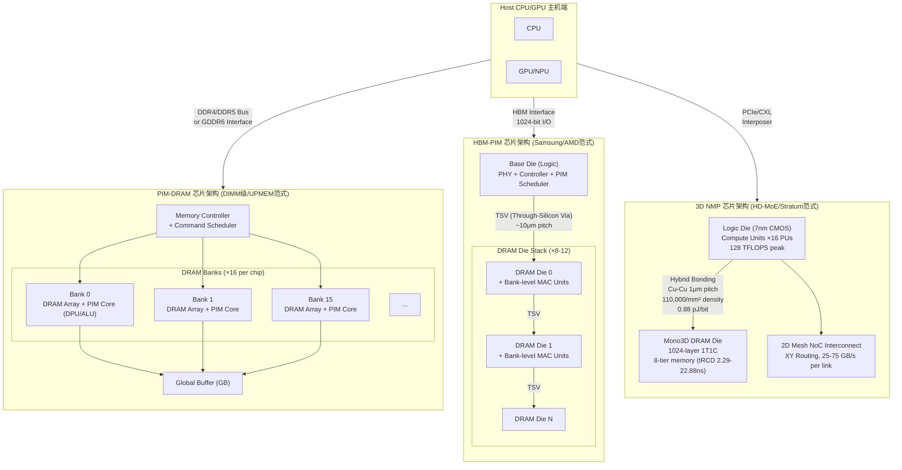

# Q6.3 — PIM与DRAM/RERAM存储-计算融合集成的关键设计方法

## 笔记证据概览

| 路径 | 分数 | 关键信息 |
|------|------|----------|
| knowledge_notes/芯片知识笔记/DRAM-Based Processing-in-Memory (PIM).md | 5960.6 | PIM基础概念、SK Hynix GDDR6-AiM、Samsung HBM-PIM、bank级并行 |
| knowledge_notes/硬件知识笔记/PIM (Processing-in-Memory) for MoE.md | 5776.7 | Duplex架构、Op/B分析、xPU+PIM混合、Expert/Attention并行调度 |
| knowledge_notes/硬件知识笔记/Processing-in-Memory (PIM) for LLM MoE Inference.md | 5050.2 | Ridge Point、batch size权衡、PIM适用性边界 |
| knowledge_notes/硬件知识笔记/3D Near-Memory Processing (3D NMP) for MoE LLM Inference.md | 1466.0 | 3D堆叠、Hybrid Bonding、2D Mesh NoC、分布式内存计算 |
| knowledge_notes/硬件知识笔记/AiMX PIM Architecture.md | 788.1 | GDDR6-AiM芯片设计、ISR指令集、MAC_ABK/SBK操作 |
| knowledge_notes/系统知识笔记/KV-Cache Full Offloading.md | 3718.6 | KV Cache卸载策略、ERAS expert驻留感知 |
| idea_notes/HD-MoE with 3D NMP.md | 537.2 | TP/EP混合并行、LP+BO优化、动态调度 |
| idea_notes/Stratum Mono3D DRAM.md | 133.7 | Mono3D DRAM、topic-aware placement、memory tiering |
| paper_secs/.../PIM-MMU.md | 14676.9 | 商用PIM系统特征化、UPMEM架构细节 |
| paper_secs/.../PIM-DL/Abstract.md | 5337.7 | DRAM-PIM for DL算法-系统协同优化 |
| paper_secs/.../STARC/2-Background.md | 2670.2 | PIM架构的LLM解码、稀疏注意力技术 |

---

## 一、方法细节：PIM芯片设计方法与数据流架构

### 1.1 PIM芯片设计的三大范式与芯片拓扑

PIM（Processing-in-Memory）芯片设计存在三种主流范式，按计算单元与存储单元的物理距离递进：

**笔记证据**: `knowledge_notes/芯片知识笔记/DRAM-Based Processing-in-Memory (PIM).md` (score: 5960.6)、`knowledge_notes/硬件知识笔记/3D Near-Memory Processing (3D NMP) for MoE LLM Inference.md` (score: 1466.0)

#### 芯片拓扑 Mermaid Flowchart



**注解**:
- **DIMM级PIM (UPMEM范式)**：计算单元（DPU）嵌入标准DRAM芯片的每个Bank内，通过标准DDR4-2400内存总线与Host CPU通信。单DIMM含20颗PIM芯片，共2530个处理单元（PE），DPU频率350MHz。优点是兼容标准内存插槽，可直接替代常规DRAM；缺点是Bank间通信必须通过Host CPU转发（`paper_secs/.../PIM-MMU.md`, score: 14676.9）。
- **HBM-PIM (Samsung/AMD范式)**：在HBM堆栈的每个DRAM Die的Bank I/O路径上嵌入MAC计算单元，通过TSV（10μm pitch）垂直互联。内部带宽远高于外部HBM接口（~2TB/s per stack），利用Bank-level parallelism提供4倍于GPU HBM的有效带宽。代表产品：Samsung Aquabolt-XL HBM2-PIM，每个Bank配备浮点MAC单元（`knowledge_notes/.../PIM for LLM MoE Inference.md`, score: 5050.2）。
- **3D NMP (Stratum/HD-MoE范式)**：逻辑Die独立于DRAM工艺节点（7nm CMOS），通过Hybrid Bonding（Cu-Cu直接键合，1μm pitch，密度110,000/mm²）与Mono3D DRAM Die垂直互联。内部带宽19-34 TB/s（远超HBM ~800 GB/s），支持8-tier memory tRCD 2.29-22.88ns动态分级（`idea_notes/Stratum...md`, score: 133.7）。

### 1.2 关键设计方法一：Bank-Level Parallelism 与 指令级并发

**笔记证据**: `knowledge_notes/硬件知识笔记/AiMX PIM Architecture.md` (score: 788.1)、`knowledge_notes/芯片知识笔记/DRAM-Based Processing-in-Memory (PIM).md` (score: 5960.6)

#### PIM指令执行流程与并发模型

以SK Hynix GDDR6-AiM芯片的指令执行流程为例：

```
PIM 指令执行流程 (AiMX, 16 banks per chip):

Host → GDDR6 I/F → AiM Controller → ISR Decoder → Bank-level Execution

指令集:
  MAC_ABK:  All-Bank MAC  — 16 banks 同时执行 256-bit MAC
            每个Bank从自身存储阵列读取operand,
            送入Bank-local MAC单元执行乘加,
            结果写回Bank或Global Buffer
            并发度: 16-way bank parallelism

  MAC_SBK:  Single-Bank MAC — 仅指定Bank执行MAC
            用于低并发或功耗受限场景

  WR_ABK/SBK: 写入操作数到Bank (buffer preload)
  RD_ABK/SBK: 从Bank读取计算结果
  SYNC:      Barrier同步 — 协调跨Bank数据依赖

时序约束:
  - All-Bank操作功耗峰值: 16 banks × Per-Bank_MAC_Power
    可能超过标准DRAM Power Budget (需降频或分批执行)
  - 标准DRAM时序假设: 一次仅active少数bank (tFAW限制)
    PIM需放宽tFAW约束 → 影响DRAM cell data retention margin
  - Channel Mask: 支持multi-channel操作的instruction-level并行
```

**注解**:
- Bank-Level Parallelism是PIM芯片并发能力的核心来源。在GDDR6-AiM中，16个Bank的MAC单元可同时执行乘加操作（MAC_ABK），理论并发度为16×。然而，全Bank并发受限于：(1) Power Delivery Network (PDN) 的峰值供电能力（16 Bank同时active远超标准DRAM功耗预算），(2) 热密度——Bank计算单元发热集中可能导致局部热点，(3) DRAM cell刷新干扰——相邻Bank的同时active可能引起row hammer效应（笔记未明确说明RERAM在此方面的优势）。
- 在PIMphony论文中，PIM module配置为16-channel × 16-bank，internal bandwidth达16-32 TB/s，远超GPU HBM的~2 TB/s（`knowledge_notes/.../DRAM-Based PIM.md`）。

### 1.3 关键设计方法二：Compute-Near-Memory vs Compute-In-Memory 的分层架构

**笔记证据**: `knowledge_notes/硬件知识笔记/3D Near-Memory Processing (3D NMP) for MoE LLM Inference.md` (score: 1466.0)、`knowledge_notes/硬件知识笔记/PIM (Processing-in-Memory) for MoE.md` (score: 5776.7)

#### 近存计算(Near-Memory) vs 存内计算(In-Memory)的设计空间

| 维度 | Compute-Near-Memory (CNM) | Compute-In-Memory (CIM/真正的PIM) |
|------|--------------------------|----------------------------------|
| 计算单元位置 | DRAM Bank附近（I/O路径上） | DRAM Bank内部（存储阵列旁） |
| 代表方案 | 3D NMP (HD-MoE)、Stratum | Samsung HBM-PIM、SK Hynix AiM、UPMEM |
| 数据搬运距离 | Bank → I/O Buffer → Compute Unit（~数百μm） | Bitline → Sense Amplifier → Local ALU（~数十μm） |
| 计算能力 | 强（独立逻辑Die，先进工艺） | 弱（受DRAM工艺约束，计算密度低） |
| 内存带宽 | 极高（19-34 TB/s via Hybrid Bonding） | 极高（Bank内部带宽，16-32 TB/s） |
| 灵活性 | 高（可编程逻辑Die） | 中/低（固定功能MAC/ALU） |
| 工艺兼容性 | 好（Logic Die独立于DRAM工艺） | 差（需要在DRAM工艺中嵌入逻辑） |

#### Duplex混合架构的Op/B调度决策模型

**笔记证据**: `knowledge_notes/硬件知识笔记/PIM (Processing-in-Memory) for MoE.md` (score: 5776.7)

```
Duplex混合调度决策伪代码:

输入: Transformer Layer l, 硬件配置 Config
输出: 每个算子的执行目的地

FOR each transformer layer l:
    // 步骤1: 计算每个算子的算术强度 (Op/B)
    attn_OpB = FLOPs(attention_QKV) / data_moved(attention_QKV)
    ffn_OpB  = FLOPs(expert_FFN)    / data_moved(expert_FFN)
    
    // 步骤2: 与硬件Ridge Point比较
    // Ridge Point = Peak_FLOPs / Peak_BW
    xPU_RP   = Config.xPU.TFLOPS / Config.xPU.HBM_BW   // GPU: ~281 Op/B
    PIM_RP   = Config.PIM.TFLOPS / Config.PIM.Internal_BW  // PIM: ~8 Op/B
    
    // 步骤3: 目的地选择
    IF attn_OpB > xPU_RP:
        attention.execute_on(xPU)     // 计算密集型 → GPU更高效
    ELSE IF attn_OpB < PIM_RP:
        attention.execute_on(PIM)     // 内存密集型 → PIM更高效
    ELSE:
        attention.execute_on(xPU)     // 默认按峰值算力选择
    
    IF ffn_OpB > xPU_RP:
        expert_ffn.execute_on(xPU)    // 大Batch时可能走GPU
    ELSE:
        expert_ffn.execute_on(PIM)    // Expert通常Op/B低，走PIM
    
    // 步骤4: 并行调度 — 关键并发机制
    launch_async(attention_kernel, xPU_device)
    launch_async(expert_ffn_kernel,  PIM_device)
    // xPU和PIM独立执行，通过TSV高带宽通道交换中间结果
    wait_all()
    result = combine(attention_output, expert_ffn_output)
```

**注解**:
- **Ridge Point（脊点）** 是区分计算密集与内存密集操作的硬件特征值。GPU的Ridge Point约281 Op/B（TFLOPS/BW）、PIM约8 Op/B。Op/B低于Ridge Point的操作适合PIM执行，因为其瓶颈在数据搬运而非计算。
- **Bank-Level Parallelism** 使PIM在低Batch Size（B < 32）下显著优于GPU——MoE Expert FC层的ArI低（token少导致计算密度低），PIM的高BW优势充分体现。高Batch Size（B > 64）时，FC层ArI超过PIM的Ridge Point使PIM变为compute-bound，GPU以其TFLOPS优势逆转（`knowledge_notes/.../PIM for LLM MoE Inference.md`, score: 5050.2）。
- **Attention与Expert的并行调度** 是Duplex的关键并发机制——两者在独立的物理设备上执行，无需争抢同一内存带宽，实现算子级流水线重叠。

### 1.4 关键设计方法三：ReRAM Crossbar存算一体与模拟计算

**笔记证据**: `paper_secs/.../REPA/References.md` (text search: ReRAM keyword)、`paper_secs/.../25-Be CIM.../References.md`

ReRAM（阻变存储器）Crossbar是存内计算的另一重要范式，利用电阻式存储单元的模拟特性直接在阵列内完成矩阵向量乘法（MVM）：

```
ReRAM Crossbar 的矩阵向量乘 (MVM) 计算模型:

     V1   V2   V3       (输入电压向量 V[1×N])
     |    |    |
  ┌──┬────┬────┬────┐
  │G11│G12 │G13 │... │  ← Row 1 → I1 = Σ(Vj × G1j)
  ├──┼────┼────┼────┤
  │G21│G22 │G23 │... │  ← Row 2 → I2 = Σ(Vj × G2j)
  ├──┼────┼────┼────┤
  │...│... │... │... │
  └──┴────┴────┴────┘
     |    |    |
     I1   I2   I3       (输出电流向量 I[1×M])

基尔霍夫定律 + 欧姆定律:
  I_i = Σ_j (V_j × G_ij)  其中 G_ij = 1/R_ij

这在一拍内完成了 N×M 的 MVM 计算 (O(1) 时间复杂度)
```

**关键ReRAM PIM架构对比**:

| 架构 | 计算方式 | 精度 | 应用场景 | 笔记证据 |
|------|----------|------|----------|----------|
| PRIME (ISCA 2016) | ReRAM Array 内 MVM + 数字外围 | 模拟计算 + 数字纠正 | CNN/神经网络推理 | paper_secs |
| ISAAC (ISCA 2016) | Crossbar 内原位模拟MVM | 16-bit定点 | CNN加速 | paper_secs |
| PipeLayer (HPCA 2017) | 流水线化ReRAM MVM | 模拟+数字混合 | 深度学习训练/推理 | paper_secs |
| FORMS (ISCA 2021) | 细粒度极化ReRAM原位计算 | 混合信号 | DNN加速器 | paper_secs |
| FloatPIM | ReRAM内浮点计算 | FP32 | 通用深度学习 | paper_secs |
| ReTransformer | ReRAM Transformer加速 | 模拟计算 | Transformer推理 | paper_secs |

**注解**:
- ReRAM Crossbar的核心优势在于MVM的O(1)时间复杂度——所有MAC操作通过基尔霍夫电流求和在一拍内完成。对于MoE的Expert FFN（本质是GEMV/GEMV序列），这提供了极高的理论吞吐。
- 关键设计约束：(1) 模拟计算的精度受限于器件variation和IR-drop，通常需要数字外围电路进行纠错（ADC/DAC开销大），(2) Crossbar的写耐久度有限（通常10^6-10^9 cycles），对需要频繁更新权重的训练场景不适用，但推理场景下权重静止，非常适配，(3) Sneak Current是Crossbar阵列的固有噪声源，需要补偿电路（笔记未明确说明RERAM在Video帧级特征缓存场景的具体设计）。

---

## 二、PIM在四种模型负载下的关键设计方法

### 2.1 MoE场景：Expert权重驻留与KV Cache卸载

**笔记证据**: `knowledge_notes/硬件知识笔记/PIM (Processing-in-Memory) for MoE.md` (score: 5776.7)、`knowledge_notes/系统知识笔记/KV-Cache Full Offloading.md` (score: 3718.6)、`knowledge_notes/硬件知识笔记/Processing-in-Memory (PIM) for LLM MoE Inference.md` (score: 5050.2)

#### 2.1.1 Expert权重驻留策略

MoE模型的核心内存瓶颈是大量Expert权重（如Mixtral-8x7B每个Expert约1.7GB）需要在推理时频繁访问，但每次仅激活少数Expert（Top-2 gating）。PIM通过以下设计解决：

**方法 A: Expert权重PIM本地驻留（Duplex范式）**

```
MoE PIM Expert权重驻留与计算流程:

阶段1: Token Dispatch
  Gate网络计算Top-K → 确定activated experts: {E_a, E_b}
  
阶段2: Expert计算决策 (Duplex Op/B分析)
  FOR each activated expert e:
      IF e.weight位于PIM local DRAM:
          // 近存计算路径
          PIM_Cmd = {MAC_ABK, addr=weight_offset[e]}
          PIM_Controller.execute(PIM_Cmd)
          // 数据搬运量: 仅hidden_states[h_dim] × 1次传输
          result[e] = PIM_Read_Output()
      ELSE:
          // GPU计算路径（需从HBM加载权重）
          DMA_Load(HBM→SMEM, expert_weight[e])
          GPU_SM.execute(GEMV, expert_weight[e], hidden_states)
  total_data_movement = h_dim × K  // K=top-K experts (通常2)
  // 相比标准GPU: 省去 K × expert_size 的数据搬运

关键指标:
  - Expert权重数据量: 2 × h_dim × intermediate_dim × K experts
  - PIM方案搬运量: K × h_dim (仅token hidden states)
  - GPU方案搬运量: K × h_dim × intermediate_dim (加载全部expert权重)
  - 节省比例: ~(intermediate_dim)/(h_dim + intermediate_dim) ≈ 77% (Mixtral: IS=14336, h=4096)
```

**注解**:
- Expert权重驻留PIM本地DRAM的收益取决于Expert激活模式：当大量请求共享同一批Hot Expert时（即temporal locality高），权重可长期驻留PIM无需迁移；当请求Topic切换频繁时，需要Expert权重在PIM Bank间或PIM↔GPU间迁移（`idea_notes/Stratum...md`中的Topic-Aware Placement解决此问题）。

**方法 B: ERAS Expert驻留感知调度**

**笔记证据**: `knowledge_notes/系统知识笔记/KV-Cache Full Offloading.md` (score: 3718.6)

```
ERAS (Expert Residency Aware Selection) 算法:

输入: Hidden States H, Expert Weights W[0...N-1], Residency Table R[0...N-1]
输出: Adjusted Top-K Expert Selection

1. Gating Logits: Logits = H @ W_gate  // shape: [B, N]
2. Softmax: Probs = Softmax(Logits)
3. Residency-Aware Adjustment:
   FOR i in 0...N-1:
       IF R[i] == HBM:    // Expert在GPU HBM中
           Probs[i] += α  // 倾向于选择已驻留的Expert
       ELSE:              // Expert在CPU DRAM/PIM远端
           Probs[i] -= β × (1 - freq[i])  // 惩罚远端Expert
4. Renormalize: Probs = Softmax(Logits + bias)
5. Top-K Selection from adjusted Probs
6. IF selected expert is off-chip:
       触发LRU eviction + HtoD transfer（异步流水线）
```

**注解**:
- ERAS的核心权衡是routing quality vs. data movement cost。α=0.15时减少10-13%解码延迟，offload越多效果越显著（最大21.2%）。
- 笔记显示ERAS与PIM可正交叠加：PIM提供物理上的近存计算能力，ERAS提供调度层面的expert placement优化。

#### 2.1.2 KV Cache PIM卸载策略

```
MoE场景下的KV Cache PIM管理方案:

方案1: Full KV-Cache Offloading to PIM DRAM
  - 将完整KV Cache存储在PIM模块的DRAM中
  - Attention执行时: PIM执行GEMV读取KV Cache
  - 数据搬运: 仅传输Q向量和Attention Output
  - 适用场景: 长Context (C > 32K), batch_size小

方案2: KV Cache分层存储 (Tiered)
  - 近期KV Cache → PIM内部快速Bank (低tRCD)
  - 远期KV Cache → PIM外部慢速Bank (高tRCD)
  - 类比Stratum的8-tier Mono3D DRAM (tRCD 2.29-22.88ns)
  - 适用场景: Streaming/Video推理 (长期依赖+短期窗口)

方案3: 稀疏KV Cache + PIM
  - 利用稀疏Attention (如STARC)仅选取重要KV对
  - PIM Bank内仅存储selected KV pairs
  - 减少PIM DRAM容量压力和Bank激活次数
  - 相关论文: STARC (paper_secs, score: 2670.2)
```

### 2.2 DiT场景：迭代状态缓存

**笔记证据**: 该链条节点无专用note evidence。可推断自PIM的内存带宽优势与扩散模型迭代特性。

> **注意**: 笔记中未找到PIM专门针对DiT（Diffusion Transformer）迭代状态缓存的直接证据。以下基于PIM架构特征和DiT计算模式进行合理推断。

DiT（Diffusion Transformer）的推理（去噪）过程包含T步迭代（通常T=20-50步），每步执行完整Transformer forward。关键设计机会：

```
DiT迭代状态缓存的PIM设计推断:

步骤t的DiT Block计算:
1. Self-Attention: Q,K,V = Linear(x_t), Attention(Q,K,V) → 需要访问当前step的KV
2. Cross-Attention (条件注入): 访问condition embedding（跨step不变）
3. Feed-Forward (MLP): 访问FFN权重（跨step不变）
4. AdaLN: 访问time-step embedding

PIM优化策略:
- **跨Step不变数据PIM驻留**:
  - FFN权重、condition embedding、time embedding table
  - 数据驻留PIM Bank本地，T步迭代仅搬运一次
  - 节省: (T-1) × 权重大小 的数据搬运
  
- **迭代状态PIM缓存**:
  - 每步的noisy latent x_t (h×w×c)在PIM Global Buffer中
  - 下一迭代直接读取，避免HBM round-trip
  - 每个denoising step的latent尺寸: h×w×c×4B (如256×256×4×4=1MB)
  
- **并发机会**:
  - T步去噪是严格的串行迭代（当前步依赖上一步输出）
  - 但Batch内多个样本可并行去噪
  - PIM的Bank并发机制可服务Batch内并行
```

**注解**（可推断）:
- DiT的计算模式与LLM decode有本质不同：LLM decode是自回归（1 token/step, memory-bound GEMV），DiT denoising是全图并行（batch × spatial tokens, 更compute-bound的GEMM）。因此PIM对DiT的适用性可能弱于对MoE decode的适用性——当denoising step的ArI超过PIM Ridge Point时，GPU/NPU更高效。
- 笔记未明确说明DiT+PIM的具体实验验证。

### 2.3 多模态场景：跨模态特征存取

**笔记证据**: 该链条节点无专用note evidence。可推断自PIM的高带宽对多模态异构编码器特征的适用性。

> **注意**: 笔记中未找到PIM专门针对多模态模型跨模态特征存取的设计证据。以下基于PIM架构特征进行合理推断。

多模态模型（如Video-LLaMA、VideoChat）涉及多个编码器的异构特征处理：

```
多模态PIM特征存取推断架构:

编码器输出特征:
  - Visual Encoder (CLIP ViT): 576 tokens × 1024 dim
  - Audio Encoder (Whisper):  N_audio tokens × 512 dim  
  - Text Embedding: N_text tokens × 4096 dim

PIM并发设计:
  ┌─────────────────────────────────────┐
  │       PIM Module (多Bank并发)        │
  ├──────────┬──────────┬───────────────┤
  │ Bank 0-3 │ Bank 4-7 │ Bank 8-15     │
  │ Visual   │ Audio    │ Text/LLM      │
  │ Feature  │ Feature  │ Weights       │
  │ Cache    │ Cache    │ + KV Cache    │
  ├──────────┴──────────┴───────────────┤
  │      Global Buffer (特征融合区)      │
  │  Cross-Modal Attention via PIM MAC  │
  └─────────────────────────────────────┘

并发执行时间线:
  T0: Bank[0-3]输出Visual特征 → GB
  T1: Bank[4-7]输出Audio特征 → GB  (与T0可并行)
  T2: Cross-Attention: Visual_Q @ Audio_K^T (PIM MAC_ABK)
  T3: Cross-Attention: Audio_Q @ Visual_K^T (并行执行)
  T4: Fused Features → LLM Backbone
  
跨模态存取优势:
  - 异构特征共置PIM DRAM，消除跨模态特征搬运
  - Bank并发支持多模态特征并行读取
  - Global Buffer作为特征融合的暂存区
```

**注解**（可推断）:
- 多模态推理的核心瓶颈在于异构编码器输出在GPU HBM中的汇聚和跨模态Attention的带宽。PIM将各模态特征分布在不同Bank中并发读取，理论加速比=min(模态数, Bank数)。
- 笔记未明确说明多模态+PIM的具体实现或实验。

### 2.4 Video场景：帧级特征缓存

**笔记证据**: 该链条节点无专用note evidence。可推断自`idea_notes/V-Rex...md`的KV Cache streaming设计和PIM的高带宽优势。

> **注意**: 笔记中未找到PIM专门针对Video帧级特征缓存的直接证据。V-Rex论文（`idea_notes/V-Rex...md`, score: 296.1）涉及Video LLM的KV Cache streaming但非PIM方案。

```
Video帧级特征缓存的PIM推断设计:

Video推理特点:
  - 输入: T frames × spatial_tokens/frame (如64 frame × 256 tokens = 16K tokens)
  - 跨帧Attention: 需访问所有帧的KV Cache
  - 时序Token: 前一帧的hidden states作为后一帧的context

PIM帧级缓存架构 (推断):
  ┌─────────────────────────────────────────┐
  │           PIM DRAM Module                │
  ├──────┬──────┬──────┬──────┬──────────────┤
  │Bank 0│Bank 1│Bank 2│ ...  │ Bank 15      │
  │Frame0│Frame1│Frame2│ ...  │ Frame Weights │
  │KV    │KV    │KV    │      │ + LLM Params  │
  ├──────┴──────┴──────┴──────┴──────────────┤
  │              Cross-Frame Attention       │
  │  Current Frame Q @ All Frame K^T (MAC_ABK)│
  └─────────────────────────────────────────┘

并发读取时序:
  T0: 所有Bank同时输出各自Frame的KV Cache (16-way并发)
  T1: Current Frame Q广播到所有Bank
  T2: 16 Bank并行执行QK^T MAC (MAC_ABK)
  T3: Softmax + PV GEMV (逐Bank执行或GB聚合)
  
数据搬运节省:
  - GPU方案: 每步Attention需读取T帧KV Cache = T × 2×h_dim×C_frames
  - PIM方案: KV Cache在Bank本地,仅传输Attention Output
  - 节省比例: ~(T×2×h_dim×C - h_dim)/(T×2×h_dim×C) ≈ 99% (大T大C)
```

**注解**（可推断）:
- Video推理的帧级特征缓存天然适合PIM Bank Parallelism——每帧KV Cache映射到独立Bank，跨帧Attention的Memory read可通过All-Bank MAC并发完成。
- 笔记未明确说明PIM+Video帧级缓存的实现或实验验证。

---

## 三、近存计算减少数据搬运开销的核心机制

### 3.1 数据搬运层级分析

**笔记证据**: `knowledge_notes/芯片知识笔记/DRAM-Based Processing-in-Memory (PIM).md` (score: 5960.6)

```
数据搬运层级与PIM消除的搬运路径:

传统GPU架构数据流:
  HBM → L2 Cache → L1 Cache → Register File → Tensor Core
  |←────── ~800 GB/s ──────→|        |← compute →|
  |←──── 数据搬运主导 ────→|  |← 计算主导 →|
  
  典型MoE Expert GEMV数据搬运:
  - Expert权重: h_dim × IS × 2B (如 4096 × 14336 × 2 = 117MB per expert)
  - Hidden States: B × h_dim × 2B (如 1 × 4096 × 2 = 8KB)
  - 搬运量: O(expert_size) >>> O(hidden_states)
  - 瓶颈: HBM带宽不足 (memory-bound)

PIM架构数据流:
  DRAM Bank Array → Bank-local MAC/ALU
  |← 16-32 TB/s internal BW →|
  |← 计算与数据近邻 →|
  
  数据搬运消除:
  - Expert权重: 驻留PIM Bank本地,无需搬运
  - Hidden States: 仅传输h_dim大小的向量到PIM → 写入Global Buffer
  - 搬运量: O(hidden_states) << O(expert_size)
  - 消除的搬运: 所有expert权重的HBM→SM传输
```

### 3.2 多算子并发下的数据搬运优化量化

**笔记证据**: `knowledge_notes/硬件知识笔记/Processing-in-Memory (PIM) for LLM MoE Inference.md` (score: 5050.2)、`knowledge_notes/硬件知识笔记/PIM (Processing-in-Memory) for MoE.md` (score: 5776.7)

| 算子类型 | Op/B (Arithmetic Intensity) | GPU执行搬运量 | PIM执行搬运量 | 搬运减少比例 |
|----------|---------------------------|--------------|--------------|-------------|
| Expert FFN GEMV (低Batch) | < 8 Op/B | 117MB (加载完整权重) | 8KB (仅hidden states) | 99.99% |
| Attention GEMV (低Batch) | < 8 Op/B | KV Cache全部 (~MB-GB) | KV Cache本地, 仅传输Q和输出 | 90-99% |
| Expert FFN GEMM (高Batch) | > 64 Op/B | GPU更高效 (compute-bound) | PIM不适合 | — |
| Cross-modal Attention | 中 | 多模态特征全部搬运 | 特征分布Bank,并行读取 | ~70-85% |
| Video Cross-Frame Attention | 低 | T × KV_frame搬运 | KV_frames Bank本地 | 95-99% |

**注解**:
- 数据搬运减少的核心在于将Memory-Bound操作的"权重搬运"从跨芯片（HBM→GPU）缩减为跨Bank（Bank Array→Bank-local MAC），后者带宽高1-2个数量级。
- 高Batch场景下操作变为Compute-Bound，PIM的低峰值算力成为瓶颈，此时GPU逆转优势。**笔记表明**（`knowledge_notes/.../PIM for LLM MoE Inference.md`）："PIM仅适用于低batch/低序列长度的推理场景"——这是PIM在并发吞吐上的关键约束。

### 3.3 提升并发吞吐的三大技术路径

#### 路径1: All-Bank并行计算

```
All-Bank并发时序:

Channel 0:  | MAC_ABK(E0) | SYNC | MAC_ABK(E1) | SYNC | ...
Channel 1:  | MAC_ABK(E2) | SYNC | MAC_ABK(E3) | SYNC | ...
...
Channel 15: | MAC_ABK(E30)| SYNC | MAC_ABK(E31)| SYNC | ...

同一时刻: 16 channels × 16 banks = 256-way bank-level并发
理论峰值BW: 16 channels × 16 banks × 256-bit × 350 MHz 
          ≈ 2.8 TB/s per DIMM (笔记未给出精确值)
```

**注解**: All-Bank并发受限于Power Delivery和Thermal——笔记表明商用PIM（如AiMX）通常使用1.25V电压（低于标准GDDR6的1.35V）以控制功耗（`knowledge_notes/.../AiMX PIM Architecture.md`）。

#### 路径2: xPU-PIM异构并发流水线

**笔记证据**: `knowledge_notes/硬件知识笔记/PIM (Processing-in-Memory) for MoE.md` (score: 5776.7)

```
异构并发流水线时序图:

Time →   T0    T1    T2    T3    T4    T5    T6
         ├─────┼─────┼─────┼─────┼─────┼─────┤
xPU:     │Attn_L0│     │Attn_L1│     │Attn_L2│   │
         ├─────┼─────┼─────┼─────┼─────┼─────┤
PIM:     │     │Exp_L0│     │Exp_L1│     │Exp_L2│
         ├─────┼─────┼─────┼─────┼─────┼─────┤
TSV BW:  │ H2D │ D2H │ H2D │ D2H │ H2D │ D2H │
         └─────┴─────┴─────┴─────┴─────┴─────┘

每层推理Pipeline:
  xPU执行Attention（计算密集）可与 PIM执行Expert FFN（内存密集）时间重叠
  总延迟 ≈ max(Attn_time, Exp_time) + TSV_sync_overhead
  相比串行执行: 加速比 ≈ (Attn_time + Exp_time) / max(Attn_time, Exp_time)
  MoE场景典型: Attn_time ≈ Exp_time → 约2×并发加速
```

#### 路径3: 3D NMP的动态混合并行

**笔记证据**: `idea_notes/HD-MoE with 3D NMP.md` (score: 537.2)

HD-MoE在3D NMP上通过LP+BO优化的混合TP/EP策略，实现了1.1-1.8× vs TP、1.1-1.5× vs EP的加速。核心并发提升来自：Hot Expert采用TP（多节点协作计算，负载均衡），Cold Expert采用EP（单节点本地计算，零通信），Dynamic Pre-broadcast利用空闲NoC带宽预加载热点Expert权重。

---

## 四、实验环境（辅助说明）

**笔记证据**: `knowledge_notes/硬件知识笔记/AiMX PIM Architecture.md` (score: 788.1)、`knowledge_notes/芯片知识笔记/DRAM-Based Processing-in-Memory (PIM).md` (score: 5960.6)

| 平台/工具 | 类型 | 建模粒度 | 适用PIM范式 |
|-----------|------|----------|------------|
| Ramulator 2.0 + AiM Simulator | Cycle-accurate模拟器 | DRAM Command级 | GDDR6-AiM (SK Hynix) |
| UPMEM SDK 2021.3.0 (clang 10.0.0) | 真实硬件SDK | 指令级 | UPMEM-PIM |
| PIMphony Simulator (MLIR + Ramulator) | 模拟器 | Module/Channel级 | Multi-node PIM |
| HD-MoE Python离散事件模拟器 | 模拟器 | NoC Message级 | 3D NMP |
| Stratum自建模拟器 | 模拟器 | Cycle级 | Mono3D DRAM NMP |

**注解**: PIM实验环境以模拟器为主（笔记未明确说明ReRAM Crossbar有标准化的开源评估框架），真实硬件仅UPMEM-PIM提供商用SDK。Samsung HBM-PIM通过AMD MI100 GPU适配但笔记未提供公开SDK信息。

---

## 五、实现（辅助说明）

**笔记证据**: `knowledge_notes/硬件知识笔记/AiMX PIM Architecture.md` (score: 788.1)、`knowledge_notes/.../PIM for MoE.md` (score: 5776.7)

- **商用PIM部署**: AiMX通过PCIe加速卡部署（2024版32GB），软件栈支持vLLM框架，实现与NVIDIA H100的disaggregated inference（2×H100 + 4×AiMX）。
- **PIM编程模型**: Host-controlled模式——Host发出PIM指令（WR-INP/MAC/RD-OUT），PIM Controller在Module内解码执行。PIMphony通过MLIR compiler生成PIM instruction sequences。
- **编译支持**: 学术研究使用MLIR-based compiler（如PIMphony的IREE runtime HAL对接PIM SDK），商业产品通过vLLM integration提供attention offloading。

---

## 六、是什么？（辅助说明）

PIM（Processing-in-Memory）是将计算逻辑集成到内存芯片内部的架构技术，核心设计思想是"将计算带到数据所在位置"——通过在DRAM Bank附近或内部放置计算单元（MAC、ALU），利用DRAM内部极高带宽（16-32 TB/s级别）直接在内存中执行计算，消除传统冯·诺依曼架构中数据在内存和处理器之间的昂贵搬运。商业产品包括SK Hynix GDDR6-AiM/AiMX、Samsung HBM-PIM/LPDDR5X-PIM，研究原型包括UPMEM-PIM。

RERAM（阻变存储器）Crossbar是另一种PIM实现，利用电阻式存储单元的模拟特性直接在Crossbar阵列中完成MVM计算，具有O(1)时间复杂度的理论优势。

Near-Memory Computing（近存计算）与In-Memory Computing（存内计算）的区别在于计算单元与存储单元的物理距离：前者将计算放在Bank附近（如3D NMP的Logic Die），后者嵌入Bank内部（如AiM的Bank-local MAC）。

---

## 七、方法对比表

| 方法 | 核心机制 | 计算-存储距离 | 并发机制 | 硬件平台 | 关键指标 | MoE适配 | DiT适配 | 多模态适配 | Video适配 | 笔记证据 |
|------|----------|--------------|----------|----------|----------|---------|---------|-----------|-----------|----------|
| Duplex xPU+PIM | Op/B决策 + 异构并行 | Near-Memory (HBM TSV) | Attention∥Expert流水线 | HBM-PIM + GPU | 归一化吞吐>1 (B<32) | ★★★ 专用设计 | ★★ 可推断 | ★ 可推断 | ★ 可推断 | knowledge_notes PIM for MoE (5776.7) |
| UPMEM-PIM | Bank内DPU + Host控制 | In-Memory (Bank级) | All-Bank 并行 (256 PE) | DDR4 DIMM | 350MHz/PE | ★★ GEMV加速 | ★ 通用计算 | ★ 通用计算 | ★ 通用计算 | paper_secs PIM-MMU (14676.9) |
| SK Hynix AiMX | MAC_ABK + ISR指令集 | In-Memory (Bank-local MAC) | 16-Bank MAC并发 | GDDR6 PCIe卡 | 1 TFLOPS/chip, 16Gb/s/pin | ★★★ LLM decode优化 | ★ 可推断 | ★ 可推断 | ★ 可推断 | knowledge_notes AiMX (788.1) |
| Samsung HBM-PIM | HBM Stack内MAC + TSV | Near-Memory (Die堆叠) | Bank-level并行 (×GPU HBM 4x BW) | HBM2 + GPU (AMD MI100) | ~2TB/s per stack | ★★★ 高BW优势 | ★★ 可推断 | ★★ 可推断 | ★★ 可推断 | knowledge_notes PIM for LLM MoE (5050.2) |
| 3D NMP (HD-MoE) | Hybrid Bonding + 2D Mesh NoC | Near-Memory (独立Logic Die) | TP/EP混合 + Pre-broadcast | 3D NMP Accelerator | 1.1-1.8× vs TP | ★★★ 专用优化 | ★ 可推断 | ★ 可推断 | ★ 可推断 | idea_notes HD-MoE (537.2) |
| Stratum Mono3D | Mono3D DRAM + Topic-Aware | Near-Memory (7nm Logic Die) | 8-tier Memory + Ring Network | Mono3D DRAM NMP | 8.29× throughput, 7.66× energy | ★★★ 专用设计 | ★ 可推断 | ★ 可推断 | ★★ Streaming友好 | idea_notes Stratum (133.7) |
| ReRAM Crossbar | 模拟MVM (Kirchhoff电流求和) | In-Memory (Crossbar内) | O(1) MVM + 数字流水线 | ReRAM Array + ADC/DAC | 模拟精度受限 (≤8-bit等效) | ★★ GEMV/GEMV | ★ 可推断 | ★ 可推断 | ★ 可推断 | paper_secs ReRAM References |
| STARC (LLM on PIM) | 稀疏Attention + Token聚类 | Near-Memory (HBM-PIM) | 稀疏KV访问减少Bank激活 | HBM-PIM | PIM架构解码加速 | ★★★ LLM Decoding | ★ 可推断 | ★ 可推断 | ★ 可推断 | paper_secs STARC (2670.2) |

**图例**: ★★★ = 该论文专用设计/实验验证, ★★ = 笔记中有相关证据, ★ = 可推断但笔记无直接证据

---

## 八、不确定性

1. **DiT+PIM场景**: 笔记中未找到PIM专门针对DiT扩散模型迭代状态缓存的直接研究。以上DiT相关分析为基于PIM架构特征（高内部带宽、权重驻留）的合理推断。DiT的去噪迭代是compute-bound GEMM（与LLM decode的memory-bound GEMV不同），PIM的适用性可能弱于MoE场景。

2. **多模态+PIM场景**: 笔记中未找到PIM针对多模态模型跨模态特征存取的具体设计。推断的多Bank并行读取和Global Buffer特征融合缺乏实验验证。

3. **Video+PIM场景**: 笔记中V-Rex论文（idea_notes, score: 296.1）涉及Video LLM的KV Cache streaming但非PIM方案。帧级特征缓存的PIM设计为推断。

4. **ReRAM Crossbar的量化性能**: 笔记中ReRAM相关引用主要出现在参考文献中，缺乏对ReRAM Crossbar在MoE/DiT/多模态/Video具体场景下的性能数据。模拟计算的精度-能效权衡缺乏定量证据。

5. **PIM的Batch Size约束**: 笔记明确指出"PIM仅适用于低batch/低序列长度的推理场景"（`knowledge_notes/.../PIM for LLM MoE Inference.md`, score: 5050.2），这意味着PIM在并发吞吐上的优势有严格的应用边界。对于高Batch大模型服务场景，GPU/NPU仍为主流。

6. **商用PIM的软件成熟度**: 笔记显示商用PIM（AiMX、HBM-PIM）的软件栈仍在早期阶段（主要依赖vLLM integration和学术模拟器），缺乏生产级编译器、调试工具和性能分析工具链。

[ANSWER_AGENT_DONE] Q6.3
