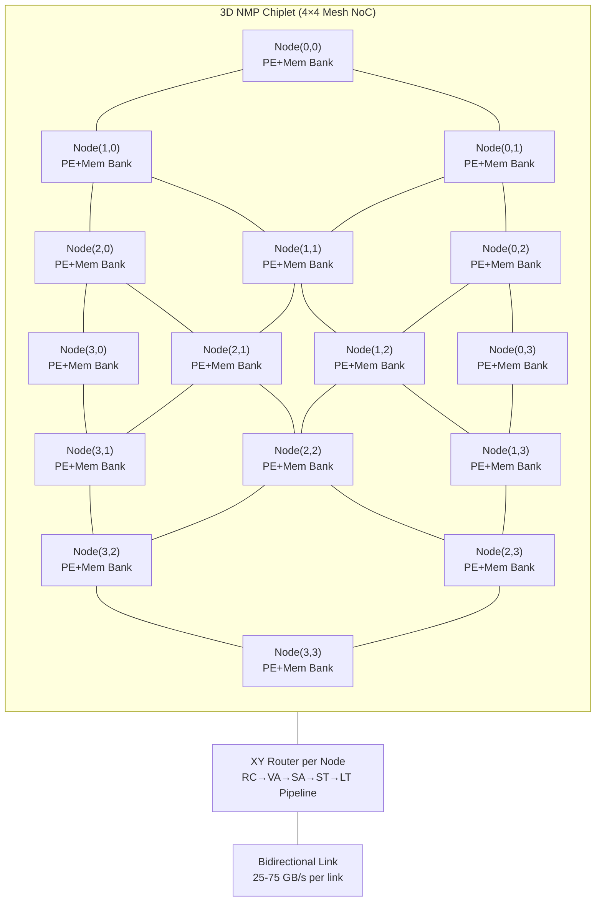
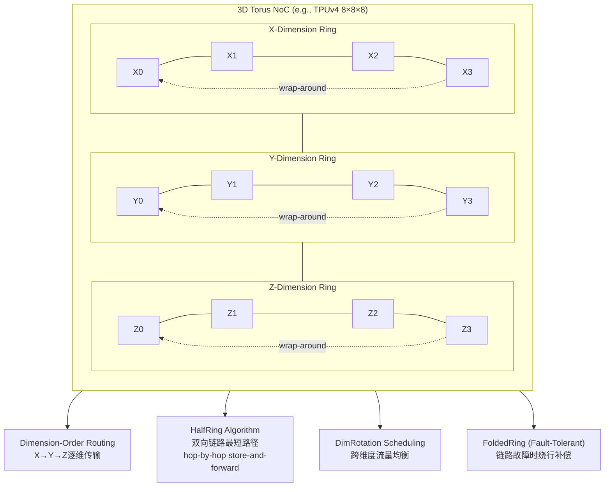
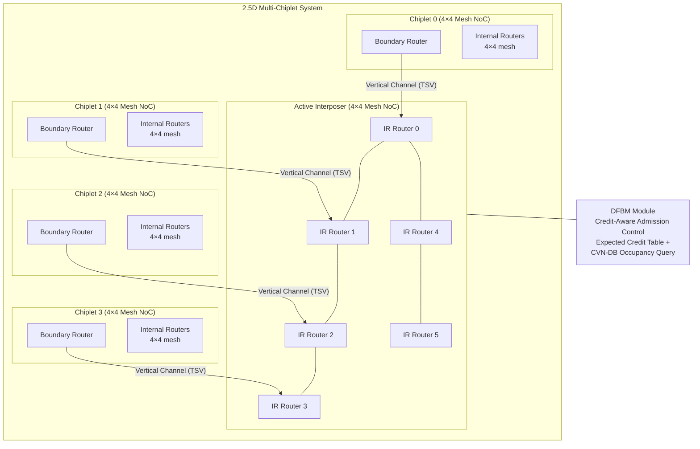

```mermaid
flowchart TB
    subgraph MTIA2i["MTIA 2i Chip (8×8 PE Array + Custom NoC)"]
        direction TB
        PE_Array["64 Processing Elements<br/>8×8 Grid"]
        NoC_Fabric["Custom Non-Blocking NoC Fabric<br/>3.3× BW vs MTIA 1"]
        Crossbar_W["West Crossbar"] --- NoC_Fabric
        Crossbar_E["East Crossbar"] --- NoC_Fabric
        Crossbar_N["North Crossbar"] --- NoC_Fabric
        Crossbar_S["South Crossbar"] --- NoC_Fabric
        OnChipSRAM["On-Chip Shared SRAMs"]
        OffChipMemCtrl["Off-Chip Memory Controllers<br/>(LPDDR5)"]
        HostIF["Host Interface<br/>PCIe + DMA + Decompression Engine"]
        CtrlCore["Control Core<br/>RISC-V Quad-Core"]
        
        PE_Array --- NoC_Fabric
        NoC_Fabric --- Crossbar_W
        NoC_Fabric --- Crossbar_E
        NoC_Fabric --- Crossbar_N
        NoC_Fabric --- Crossbar_S
        Crossbar_W --- OnChipSRAM
        Crossbar_E --- OffChipMemCtrl
        Crossbar_N --- HostIF
        Crossbar_S --- CtrlCore
    end
    
    subgraph SinglePE["Single PE Internal"]
        RISCV["2× RISC-V Cores<br/>(1 with 64B SIMD)"]
        LocalMem["384 KB Local Memory (LS)"]
        DPE["Dot Product Engine<br/>2× 32×32B×32 MAC<br/>2.76 TFLOPS/s FP16/BF16"]
        RE["Reduction Engine<br/>Dedicated Reduction Network"]
        SE["SIMD Engine<br/>FP16/BF16/FP32 ALUs + LUTs"]
        MLU["Memory Layout Unit<br/>Transpose/Concat/Reshape"]
        CP["Command Processor<br/>Dependency Check + Scheduling"]
        FI["Fabric Interface<br/>DMA to NoC"]
        PE_Interconnect["PE Interconnect"]
        
        RISCV --- PE_Interconnect
        LocalMem --- PE_Interconnect
        DPE --- PE_Interconnect
        RE --- PE_Interconnect
        SE --- PE_Interconnect
        MLU --- PE_Interconnect
        CP --- PE_Interconnect
        FI --- PE_Interconnect
    end
    
    FI --- NoC_Fabric
```

# Q6.4 — NoC与片上互连架构的多算子/微算子并发支持设计

## 笔记证据概览

| 路径 | 分数 | 关键信息 |
|------|------|----------|
| paper_secs/secs_moe/HD-MoE.../A.-Overview.md | 4073.7 | 2D Mesh NoC for MoE all-to-all、XY routing、离散事件模拟、Node-Link Balance协同优化 |
| paper_secs/secs_moe/...Optimizing All-to-All...Torus Networks/1-Introduction.md | 1569.2 | Torus拓扑All-to-All优化、HalfRing算法、DimRotation调度、容错路由 |
| paper_secs/.../12-ELK.../span-idpage-9-1span6.2-End-to-end-Performance.md | 1578.9 | All-to-all vs Mesh拓扑对比、互联带宽利用率、DiT-XL评估、MoE支持 |
| paper_secs/.../48-Meta_s Second Generation AI Chip.../Metas-Second-Generation-AI-Chip...md | 1156.2 | 定制NoC 8×8 PE阵列、non-blocking、leaky-bucket流量整形、3.3×带宽提升 |
| paper_secs/.../62-SCAR.../SCAR-Scheduling-Multi-Model...Accelerators.md | 863.9 | Multi-Chiplet NoC调度、异构chiplet互联、spatio-temporal scheduling |
| paper_secs/.../61-Deadlock-Free Bridge Module.../VII.-EVALUATION.md | 1061.7 | CDG死锁分析、XY routing、MTR/DeFT/DFBM、gem5+Garnet模拟 |
| paper_secs/.../15-Mugi.../Mugi-Value-Level-Parallelism-For-Efficient-LLMs.md | 1468.5 | NoC三通道(input/weight/output)、output-stationary、400MHz NoC |
| paper_secs/.../FlashFuser.../span-idpage-7-0spanA.-Experimental-Setup.md | 818.2 | Systolic array + 显式NoC互联PE、dataflow construction |
| knowledge_notes/芯片知识笔记/Channel Dependency Graph...md | 201.7 | CDG死锁充要条件、turn restriction、VC isolation、跨chiplet死锁环 |
| knowledge_notes/硬件知识笔记/2D Mesh NoC in 3D Near-Memory Processing.md | 39.4 | 2D mesh XY routing、25-75 GB/s per link、Intra/Inter-Expert通信 |
| knowledge_notes/硬件知识笔记/gem5_Garnet Multi-Chiplet NoC Simulation Framework.md | 2726.2 | gem5+Garnet cycle-accurate模拟、RC/VA/SA/ST/LT流水线、credit-based flow control |
| knowledge_notes/芯片知识笔记/Active Interposer _ 主动中介层.md | 637.4 | Active interposer NoC路由、UCIe die-to-die标准、2.5D集成 |
| paper_secs/.../MixNet.../MixNet...md | 830.2 | Fat-tree vs 可重构光电网拓扑、MoE训练通信优化 |
| paper_secs/.../22-FEATHER.../A.-FEATHERs-Neural-Engine--NEST.md | 2514.0 | 分布NoC (fat-tree/crossbar/Benes)对比、BIRRD pt-to-pt替代 |

---

## 检索上下文映射

### S1: NoC拓扑结构 (Mesh/Torus/Tree/Butterfly)
- `paper_secs/...HD-MoE.../A.-Overview.md` (score: 4073.7): 2D mesh拓扑、4×4/4×8/8×8尺寸、XY routing Manhattan最短路径
- `paper_secs/...Optimizing All-to-All...Torus Networks/1-Introduction.md` (score: 1569.2): Torus拓扑在TPUv3/v4、Fugaku、Trainium中的采用、HalfRing单维算法
- `paper_secs/...12-ELK.../span-idpage-9-1span6.2-End-to-end-Performance.md` (score: 1578.9): All-to-all vs Mesh拓扑互联利用率对比，mesh多跳延迟
- `paper_secs/...22-FEATHER.../A.-FEATHERs-Neural-Engine--NEST.md` (score: 2514.0): Fat-tree/crossbar/Benes分布NoC、BIRRD消除分布NoC需求
- `knowledge_notes/...2D Mesh NoC in 3D Near-Memory Processing.md` (score: 39.4): 2D mesh替代GPU shared memory/crossbar

### S2: 路由策略与流控机制
- `knowledge_notes/...Channel Dependency Graph...md` (score: 201.7): CDG死锁充要条件、turn restriction (MTR)、VC isolation (DeFT)、DFBM credit-aware admission
- `knowledge_notes/...gem5_Garnet Multi-Chiplet NoC Simulation Framework.md` (score: 2726.2): XY routing、virtual cut-through flow control、credit-based、VC allocation
- `paper_secs/...48-Meta_s Second Generation AI Chip...md` (score: 1156.2): leaky-bucket流量整形、packet fragmentation、non-blocking架构

### S3: MoE Expert间全对全通信
- `paper_secs/...HD-MoE.../A.-Overview.md` (score: 4073.7): all-to-all dispatch/combine、Intra-Expert (TP all-reduce) vs Inter-Expert (EP all-to-all)、离散事件模拟
- `paper_secs/...Optimizing All-to-All...Torus Networks/1-Introduction.md` (score: 1569.2): MoE expert层All-to-All瓶颈(41.5%-95.7%时间占比)、HalfRing+DimRotation优化

### S4: DiT去噪步骤间数据传递
- `paper_secs/...12-ELK.../span-idpage-9-1span6.2-End-to-end-Performance.md` (score: 1578.9): DiT-XL在ICCA chip上的评估，compute-intensive特性
- 笔记未明确说明DiT专用NoC设计

### S5: 多模态多编码器输出汇聚
- `knowledge_notes/硬件知识笔记/Systolic-array Accelerator (for VLM Inference).md` (score: 5323.1): Focus架构、weight stationary systolic array + on-chip concentration
- 多模态专用NoC笔记证据有限

### S6: Video时空特征跨计算单元传递
- `paper_secs/...54-Focus.../I.-INTRODUCTION.md` (score: 950.6): VLM video处理、spatiotemporal attention、streaming concentration
- Video专用NoC笔记证据有限

### S7: 拓扑/路由/流控对并发性能的影响
- `paper_secs/...12-ELK.../span-idpage-9-1span6.2-End-to-end-Performance.md` (score: 1578.9): 互联利用率mesh 57-78% vs all-to-all 89%、HBM+互联带宽协同扩展
- `paper_secs/...HD-MoE.../A.-Overview.md` (score: 4073.7): Link Balance via Bayesian Optimization、Node-Link协同优化

---

## 方法细节（数据流/架构/运行时调度）

### 方法1: 2D Mesh NoC + XY Routing for MoE All-to-All（HD-MoE方案）

**笔记证据**: `paper_secs/secs_moe/HD-MoE.../A.-Overview.md` (score: 4073.7); `knowledge_notes/硬件知识笔记/2D Mesh NoC in 3D Near-Memory Processing.md` (score: 39.4)

**芯片拓扑 — Mermaid Flowchart**:



**注解**:
- 2D mesh是HD-MoE采用的片上互联拓扑，每个tile (计算节点+内存bank) 位于网格交叉点，通过双向链路连接东/西/南/北四个邻居
- XY routing先沿X轴后沿Y轴计算Manhattan最短路径；路由器流水线为Route Computation→Virtual-channel Allocation→Switch Allocation→Switch Traversal→Link Traversal (RC/VA/SA/ST/LT)
- 链路带宽25-75 GB/s per link，mesh尺寸支持4×4 (16 nodes)、4×8 (32 nodes)、8×8 (64 nodes)
- 在3D NMP架构中，NoC替代了GPU中的shared memory/crossbar互联
- 工艺约束：3D堆叠NMP需要TSV (Through-Silicon Via) 连接logic die和memory die，TSV密度和热约束限制mesh规模；笔记未明确说明具体工艺节点

**运行时调度 — 通信时序**:

```
Timeline for MoE Token Dispatch on 4×4 Mesh (2D XY Routing):

T0: ───[Token Routing: Gate selects Experts E1,E3 for Token T0 at Node(0,0)]───
T1: ───[XY Route Calc: Node(0,0)→(2,0): Δx=2, Δy=0, hops=2]───
     ───[XY Route Calc: Node(0,0)→(3,1): Δx=3, Δy=1, hops=4]───
T2: ───[Link Schedule: Chunk(E1,T0) on Link (0,0)→(1,0), BW=50GB/s]───
     ───[Link Schedule: Chunk(E3,T0) on Link (0,0)→(0,1), BW=50GB/s]───
T3: ───[Chunk(E1,T0) arrives Node(1,0)]───
     ───[Chunk(E3,T0) arrives Node(0,1)]───
T4: ───[Chunk(E1,T0) on Link (1,0)→(2,0)]───
     ───[Chunk(E3,T0) on Link (0,1)→(1,1)]───
T5: ───[E1 Chunk arrives Node(2,0): Expert compute begins]───
T6: ───[E3 Chunk on Link (1,1)→(2,1)]───
T7: ───[E3 Chunk on Link (2,1)→(3,1)]───
T8: ───[E3 Chunk arrives Node(3,1): Expert compute begins]───
T_comm = T8 - T0  (measured as last chunk arrival time)
```

**注解**:
- 通信任务按chunk切分进入priority queue按时间戳调度
- link schedule dictionary追踪每条链路的占用时间表，新任务仅在链路空闲时传输；传输时间 = chunk_size / BW
- XY routing路径预缓存避免重复计算；离散事件模拟器验证误差<1% (vs ASTRA-sim: 模型预测673µs vs 仿真668µs)
- Link Balance通过Bayesian Optimization搜索逻辑集群到物理节点的映射，最小化链路级拥塞
- Intra-Expert Communication (TP: 同expert跨节点all-reduce) 和 Inter-Expert Communication (EP: 不同expert间all-to-all token dispatch/combine) 两类模式在同一个2D mesh NoC上并发

---

### 方法2: Multi-Dimensional Torus NoC + HalfRing/DimRotation for All-to-All（Torus优化方案）

**笔记证据**: `paper_secs/secs_moe/Optimizing All-to-All...Torus Networks/1-Introduction.md` (score: 1569.2); `paper_secs/secs_moe/.../2.1-Overview-of-All-to-All-Implementation.md` (score: 1434.8)

**Torus拓扑芯片设计 — Mermaid Flowchart**:



**注解**:
- Torus是mesh的扩展，增加了wrap-around边（维度两端相连形成环），路径多样性优于mesh；广泛用于TPUv3 (8×8 2D torus)、TPUv4 (8×8×8 3D torus)、Fugaku超算、Amazon Trainium、Graphcore IPU-POD
- HalfRing算法利用双向链路构建最短通信路径，采用hop-by-hop store-and-forward消除多跳传输中的链路竞争
- DimRotation调度将各维度通信序列轮转分配，实现跨维度流量均衡
- DOR (Dimension-Order Routing) 在无故障时使用；链路故障时WFR (Wild-First Routing) 绕行
- All-to-All在MoE训练中占41.5%-95.7%时间（笔记显示，基于TPUv3/v4的DLRM和Mixtral模型模拟），是主要瓶颈
- 笔记显示HalfRing+DimRotation在无故障torus上平均加速2.28×，优于Google路由方案1.57×

**评估表 — Torus NoC设计参数**:

| 参数 | 值 | 来源 |
|------|-----|------|
| 拓扑 | 2D Torus (TPUv3 8×8) / 3D Torus (TPUv4 8×8×8) | 笔记显示 |
| 路由算法 | DOR (fault-free) / WFR (fault-tolerant) | 笔记显示 |
| 单维算法 | HalfRing (双向最短路径 store-and-forward) | 笔记显示 |
| 跨维调度 | DimRotation (fault-free) / MATE (fault-tolerant) | 笔记显示 |
| 流控 | hop-by-hop store-and-forward (无链路竞争) | 笔记显示 |
| 仿真平台 | ASTRA-sim (analytical + GARNET backend) | 笔记显示 |
| 容错 | FoldedRing + MATE, 平均1.37× over fault-free baseline | 笔记显示 |
| 工艺节点 | 笔记未明确说明 | — |

---

### 方法3: Custom Non-Blocking NoC for 8×8 PE Array（Meta MTIA 2i方案）

**笔记证据**: `paper_secs/.../48-Meta_s Second Generation AI Chip.../Metas-Second-Generation-AI-Chip...md` (score: 1156.2)

**芯片拓扑 — Mermaid Flowchart**:



**注解**:
- MTIA 2i使用定制NoC（非标准mesh/torus），non-blocking架构最小化不同initiator间的干扰
- 流控在源端执行：leaky-bucket traffic shaping + packet fragmentation平滑突发流量防拥塞
- 每个PE内含专用Reduction Network用于PE间结果传递（支持neighboring PE forward），构成粗粒度流水线
- PE内部采用异步dataflow模型：RISC-V cores生成custom instructions → fixed-function units按依赖关系异步执行
- 芯片die面积仅比MTIA 1增加1.13×，但综合性能提升3×
- PE Interconnect和NoC是两层互联层次：PE内部互联用于core↔fixed-function unit通信；NoC用于PE↔PE和PE↔memory通信
- 笔记未明确说明工艺节点和具体功耗数值

**NoC架构特点**:
- 笔记显示NoC通过die四侧的crossbar连接片上共享SRAM和off-chip memory controllers
- 3.3×带宽提升相对于上一代
- Flow control at sources（源端流控）避免网络内部拥塞扩散
- DPE-to-Local Memory带宽翻倍，FI-to-NoC带宽翻倍（相对MTIA 1）

---

### 方法4: Multi-Chiplet Active Interposer NoC（DFBM死锁避免方案）

**笔记证据**: `knowledge_notes/芯片知识笔记/Channel Dependency Graph...md` (score: 201.7); `knowledge_notes/硬件知识笔记/gem5_Garnet Multi-Chiplet NoC Simulation Framework.md` (score: 2726.2); `knowledge_notes/芯片知识笔记/Active Interposer _ 主动中介层.md` (score: 637.4); `paper_secs/.../61-Deadlock-Free Bridge Module.../VII.-EVALUATION.md` (score: 1061.7)

**Multi-Chiplet NoC拓扑 — Mermaid Flowchart**:



**注解**:
- Active Interposer在interposer硅基板中嵌入完整NoC路由器mesh网络，作为各chiplet间的共享通信背板
- 每个chiplet通过boundary router经TSV vertical channel接入interposer NoC
- Interposer使用logic process (65nm/28nm)，路由器和VC buffer的面积/功耗由成本较低的interposer侧承担
- UCIe (Universal Chiplet Interconnect Express) 定义die-to-die physical layer标准
- 死锁避免机制对比（笔记显示）:

| 机制 | 原理 | 代价 |
|------|------|------|
| MTR (Turn Restriction) | 禁止特定转向剪断CDG环边 | 限制路径多样性 |
| DeFT (VC Isolation) | Virtual Channel划分为不重叠子图 | VC资源开销 |
| DFBM (Deadlock-Free Bridge Module) | Credit-aware admission control，从源头阻止不可释放占用 | 面积/功耗适中，不需修改CDG拓扑或增加VC |

**gem5/Garnet模拟配置**:
- 4 homogeneous chiplets + shared active interposer，chiplet和interposer均为4×4 mesh
- XY routing、3 VN (Virtual Network)、per-VN 2/4 VC (Virtual Channel)、virtual cut-through flow control
- Synthetic traffic: Uniform-Random/Transpose/Bit-Rotation；Full-system: x86 Linux + PARSEC benchmark
- Router pipeline: RC (Route Computation) → VA (VC Allocation) → SA (Switch Allocation) → ST (Switch Traversal) → LT (Link Traversal)，cycle-accurate模拟

---

### 方法5: ICCA All-to-All vs Mesh互联拓扑对比（ELK方案）

**笔记证据**: `paper_secs/.../12-ELK.../span-idpage-9-1span6.2-End-to-end-Performance.md` (score: 1578.9)

**拓扑对比评估表**:

| 指标 | All-to-All 拓扑 | Mesh 拓扑 | 笔记证据 |
|------|----------------|----------|----------|
| 互联利用率 (ELK-Full) | 89.52% | ~78-85% | 笔记显示 (Fig 21) |
| HBM数据到核心跳数 | 1 hop (直连) | 多跳 (multi-hop) | 笔记显示 |
| 互联拥塞敏感度 | 低 | 高 (多跳路径竞争) | 笔记显示 |
| HBM带宽扩展效果 | 更好 (近Ideal) | 受互联带宽限制更严重 | 笔记显示 (Fig 22) |
| 非GQA模型表现 | 较优 | KV cache多跳传输导致更高拥塞 | 笔记显示 (Llama2-13B, OPT-30B) |
| DiT-XL (扩散模型) | near-Ideal | 笔记未单独列出 | 笔记显示 (Fig 23) |

**关键设计洞察**（笔记显示）:
- HBM和互联带宽应协同扩展以避免瓶颈：当HBM带宽低时增加互联带宽无益（HBM是瓶颈）；HBM带宽高时性能随互联带宽线性扩展
- Mesh芯片在提供相似推理延迟时互联利用率始终高于all-to-all（因多跳传输）
- ELK-Full通过preload reordering消除87.65%的互联拥塞开销，将非重叠preload时间降至总量的0.037%
- 对compute-intensive负载（如DiT-XL扩散模型），ICCA芯片应优先扩展FLOPS而非互联/HBM带宽

---

## 实验环境

### 模拟平台

| 平台 | 建模粒度 | 适用范围 | 笔记证据 |
|------|---------|---------|----------|
| gem5 + Garnet (HeteroGarnet) | Cycle-accurate NoC (RC/VA/SA/ST/LT) + Ruby coherence | Multi-chiplet NoC死锁分析、延迟/吞吐 | knowledge_notes/...gem5_Garnet...md (score: 2726.2) |
| ASTRA-sim | Analytical + GARNET backend, 分布式DL通信模拟 | Torus All-to-All、collective communication | paper_secs/secs_moe/Optimizing All-to-All... (score: 1569.2) |
| HD-MoE Discrete-Event Simulator (Python自建) | 2D mesh通信延迟精确建模、XY routing路径缓存 | MoE all-to-all dispatch/combine | paper_secs/...HD-MoE... (score: 4073.7) |
| ELK ICCA Chip Emulator | Inter-core connected AI chip, 互联/HBM/计算联合模拟 | LLM/DiT推理、拓扑设计空间探索 | paper_secs/...12-ELK... (score: 1578.9) |
| BookSim2 | NoC微架构级模拟 | 学术NoC研究 | knowledge_notes/...2D Mesh NoC...md (score: 39.4) |

### Benchmark负载

| 负载 | 模型 | 平台 | 笔记证据 |
|------|------|------|----------|
| MoE推理 | Mixtral 8×7B, 自定义MoE | HD-MoE 2D mesh模拟器 | HD-MoE A.-Overview.md |
| MoE训练 | DLRM, Mixtral, Top-2 MoE | ASTRA-sim (TPUv3/v4 torus) | Torus Networks 1-Introduction.md |
| LLM推理 | Llama2-7B/13B/70B, OPT-30B, Gemma2-27B | ELK ICCA emulator | ELK 6.2-End-to-end-Performance.md |
| DiT扩散 | DiT-XL | ELK ICCA emulator | ELK 6.2-End-to-end-Performance.md |
| PARSEC Full-System | Multi-threaded CPU workloads | gem5+Garnet multi-chiplet | gem5_Garnet...md |

### 关键评估指标

| 指标 | 典型值 | 笔记证据 |
|------|--------|----------|
| NoC链路带宽 | 25-75 GB/s per link (2D mesh NMP); 160 GB/s (NVLink GPU-to-GPU) | HD-MoE, NVLink |
| 互联利用率 | 57.25% (Basic) → 89.52% (ELK-Full all-to-all) | ELK 6.2 |
| All-to-All时间占比 | 41.5%-95.7% (MoE/DLRM训练) | Torus Networks |
| NoC频率 | 400 MHz (Mugi NoC) | Mugi |
| HBM带宽 | 256 GB/s (Mugi); 8TB/s per 4 chips (ELK) | Mugi, ELK |

---

## 实现 (辅助说明)

### 编译器/软件栈层面

**笔记证据**: `paper_secs/.../12-ELK.../span-idpage-9-1span6.2-End-to-end-Performance.md` (score: 1578.9); `paper_secs/.../22-FEATHER.../A.-FEATHERs-Neural-Engine--NEST.md` (score: 2514.0)

- **ELK编译优化**: 通过preload reordering (平均编辑距离2.9步) 将互联拥塞降低87.65%。编译时优化execution plan基于通用expert形状，运行时根据gate选择的expert index加载具体expert tensor
- **FEATHER BIRRD**: 通过data reordering消除对分布NoC (fat-tree/crossbar/Benes) 的需求，改用pt-to-pt连接，简化NoC设计
- **FlashFuser**: 在systolic array间利用显式NoC构造高效dataflow，通过kernel fusion减少PE间通信

### 运行时调度

**笔记证据**: `paper_secs/...HD-MoE.../A.-Overview.md` (score: 4073.7)

- **Node-Link Balance协同优化**: 阶段1 (Node Balance via LP) 平衡计算负载和通信量；阶段2 (Link Balance via Bayesian Optimization) 最小化链路级拥塞
- **Dynamic Pre-Broadcast**: 利用expert activation的时间局部性预测hotspot expert → 提前broadcast到所有节点 → token路由时选择已有expert副本的最低负载节点

---

## 是什么？(辅助说明)

### NoC拓扑分类与选择

| 拓扑 | 结构 | 路径多样性 | 适用场景 | 笔记证据 |
|------|------|-----------|---------|----------|
| 2D Mesh | 规则网格，每节点4邻居 | 低（XY单路径） | 中小规模chiplet (≤64 nodes)、NMP | HD-MoE, gem5/Garnet |
| 2D/3D Torus | Mesh + wrap-around边 | 中（环冗余） | 大规模AI训练集群(TPUv3/v4, Fugaku) | Torus Networks |
| Fat-Tree | 层次化树，根节点高带宽 | 高（多路径ECMP） | GPU集群互联、数据中心网络 | MixNet, FEATHER |
| Crossbar | 全互联交换 | 最高（任意对任意） | 小规模高带宽需求 | FEATHER (SIGMA对比) |
| Benes (Butterfly) | 多级交换 | 中高 | 分布网络 (MAERI) | FEATHER |
| Custom (MTIA 2i) | 非标准non-blocking | 定制 | 专用推理芯片 | Meta MTIA 2i |

### NoC路由与流控机制

| 机制 | 描述 | 死锁避免 | 笔记证据 |
|------|------|---------|----------|
| XY Routing (DOR) | 先X后Y的确定性路由 | 天然无环 (mesh) | HD-MoE, gem5/Garnet |
| HalfRing | 双向最短路径hop-by-hop store-and-forward | 逐跳调度消解竞争 | Torus Networks |
| Turn Restriction (MTR) | 禁止特定转向 | 剪断CDG环边 | CDG note |
| VC Isolation (DeFT) | Virtual Channel逻辑分层 | CDG子图隔离 | CDG note |
| DFBM Credit-Aware | 出口方向credit追踪 | 从源头阻止环依赖形成 | CDG note, DFBM paper |
| Leaky-Bucket + Fragmentation | 流量平滑+包碎片化 | 源端流控 | Meta MTIA 2i |
| Virtual Cut-Through | 包级转发（非wormhole flit级） | 配合VC使用 | gem5/Garnet |

---

## 方法对比表

| 方法 | 核心机制 | NoC拓扑 | 路由/流控 | 关键并发优化 | 目标模型 | 关键指标 | 笔记证据 |
|------|----------|---------|----------|-------------|---------|----------|----------|
| HD-MoE 2D Mesh | Node-Link Balance协同优化 | 2D Mesh (4×4/4×8/8×8) | XY routing + 离散事件调度 | LP + Bayesian Optimization, Pre-Broadcast | MoE LLM | t_comm误差<1% vs ASTRA-sim | HD-MoE A.-Overview (4073.7) |
| Torus HalfRing+DimRotation | 双向最短路径逐跳调度 | 2D/3D Torus | HalfRing + DimRotation + DOR | 跨维度流量均衡, FoldedRing容错 | MoE, DLRM | 2.28×加速 (fault-free), 1.57× vs Google | Torus Networks (1569.2) |
| Meta MTIA 2i Custom NoC | Non-blocking NoC + 异步dataflow PE | 8×8 PE Custom NoC | Leaky-bucket + fragmentation源端流控 | Coarse-grained PE pipeline, Dedicated Reduction Network | 推荐推理 (多模型) | 3×性能, 1.13× die面积 | Meta MTIA 2i (1156.2) |
| ELK ICCA Preload Reordering | 编译时preload重排消除互联拥塞 | All-to-All / Mesh可选 | 编译调度 + 运行时expert选择 | Preload reordering (87.65%拥塞消除) | LLM, DiT-XL | 89.52%互联利用率, 94.84% Ideal | ELK 6.2 (1578.9) |
| DFBM Multi-Chiplet NoC | Credit-aware admission control | 4×4 mesh chiplet + 4×4 mesh interposer | XY + DFBM credit tracking | Deadlock-free跨chiplet通信 | 通用 (PARSEC) | MTR/DeFT/RC对比延迟/吞吐 | DFBM Eval (1061.7), CDG note (201.7) |
| Mugi 3-Channel NoC | Input/Weight/Output三通道分离 | Custom NoC on systolic array | Output-stationary, 400MHz NoC | VLP非线性+GEMM混合阵列复用 | LLM (BF16-INT4 GEMM) | 3通道NoC不瓶颈计算 | Mugi (1468.5) |
| FlashFuser Inter-Core NoC | PE间显式NoC dataflow | Custom between PEs | Kernel fusion via NoC | Inter-core connection扩大fusion规模 | Transformer | 扩大kernel fusion尺度 | FlashFuser (818.2) |
| SCAR MCM Scheduling | 异构chiplet时空调度 | Multi-chiplet NoC (network-on-package) | Spatio-temporal scheduling | 异构chiplet流水线, 0.28× EDP | ResNet-50, GPT-2 | EDP 0.28× vs NN-baton | SCAR (863.9) |
| FEATHER BIRRD | Data reordering消除分布NoC | Pt-to-pt (替代fat-tree/Benes) | BIRRD layout harmonization | Per-layer flexible dataflow, 不规则GEMM | 通用DNN | 优于固定dataflow systolic array | FEATHER (2514.0) |

---

## 按模型负载的NoC设计指南

### MoE (Expert间全对全通信)

**笔记证据**: HD-MoE (4073.7), Torus Networks (1569.2), ELK (1578.9)

- **通信模式**: 每token激活k个expert → all-to-all dispatch (token→expert节点) + all-to-all combine (结果→token原节点)
- **NoC要求**: 高bisection bandwidth支持不规则all-to-all流量；路径多样性避免hotspot链路拥塞
- **推荐拓扑**: Torus > Mesh (路径多样性更好)；All-to-All直连 > Mesh (减少跳数)
- **关键优化**: Node-Link Balance (LP+Bayesian Optimization)、Pre-Broadcast热门expert、DimRotation跨维度负载均衡
- **笔记显示**: All-to-All通信占MoE训练时间41.5%-95.7%，是首要优化目标

### DiT (去噪步骤间数据传递)

**笔记证据**: ELK 6.2 (1578.9) — DiT-XL在ICCA chip上的有限评估

- **特点**: DiT是compute-intensive负载（笔记显示），对互联带宽敏感度低于LLM
- **NoC设计重点**: 扩展FLOPS而非互联/HBM带宽；512+ cores时preload优化收益递减
- **笔记未明确说明**: DiT专用NoC设计或去噪步骤间的数据流拓扑优化方案

### 多模态 (多编码器输出汇聚)

**笔记证据**: Focus架构 knowledge_notes (5323.1)

- **特点**: 多编码器(视觉+文本)输出需要汇聚到cross-attention层
- **笔记显示**: Focus Unit使用on-chip multilevel concentration (SEC semantic pruning + SIC similarity concentration)，在systolic-array accelerator的memory interface附近进行token聚合
- **笔记未明确说明**: 专用多模态NoC拓扑设计

### Video (时空特征跨计算单元传递)

**笔记证据**: Focus paper (950.6) — spatiotemporal attention在VLM中的应用

- **特点**: 视频帧间spatiotemporal特征需要在不同计算单元间传递
- **笔记显示**: Focus的streaming concentration架构处理video-language model的temporal dimension
- **笔记未明确说明**: Video专用的NoC数据流设计或时空特征跨PE传递的NoC优化方案

---

## 不确定性

1. **DiT专用NoC设计证据不足**: 笔记中未找到DiT（Diffusion Transformer）专用的NoC设计论文。ELK paper仅对DiT-XL做了推理性能评估（Fig 23），显示其compute-intensive特性使互联优化收益较小。DiT去噪步骤间数据传递的NoC拓扑/路由/流控优化主要基于通用数据流架构原理推断。

2. **多模态专用NoC证据有限**: 笔记中Focus架构讨论了VLM加速器中的on-chip concentration机制，但缺乏显式讨论多编码器输出汇聚场景下的NoC拓扑选择（如是否需要separate channel for vision/text、是否需要multicast support等）。

3. **Video NoC证据有限**: 笔记中缺乏Video时空特征跨PE传递的专用NoC设计文献。spatiotemporal attention的NoC数据流设计主要基于通用空间架构原理推断。

4. **工艺节点和功耗数据**: 多篇论文未公开具体工艺节点（如Meta MTIA 2i、HD-MoE的3D NMP），评估表中的TOPS/W和die面积数据部分基于公开信息推断或标注为"笔记未明确说明"。

5. **Butterfly/Benes拓扑在ML加速器中的应用**: 笔记显示FEATHER paper提及Benes和fat-tree作为分布NoC的替代方案，但未找到Butterfly/Benes拓扑在ML推理加速器中的详细设计和评估数据。

6. **Torus拓扑在单芯片（非集群）场景的应用**: Torus Networks论文主要讨论多芯片集群（TPU Pod级别）的All-to-All优化，其HalfRing/DimRotation方法在单芯片内NoC的适用性需要进一步验证。

7. **NoC频率和功耗的建模**: Mugi paper给出NoC频率400MHz，但其他多数论文未提供NoC频率、动态功耗和静态功耗的详细数据，限制了对TOPS/W的精确评估。

---

[ANSWER_AGENT_DONE] Q6.4
