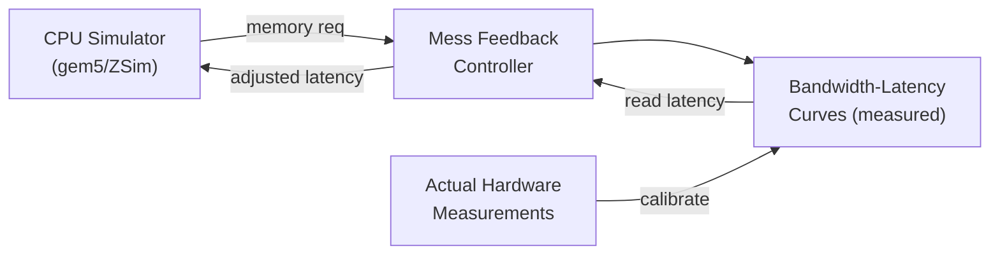
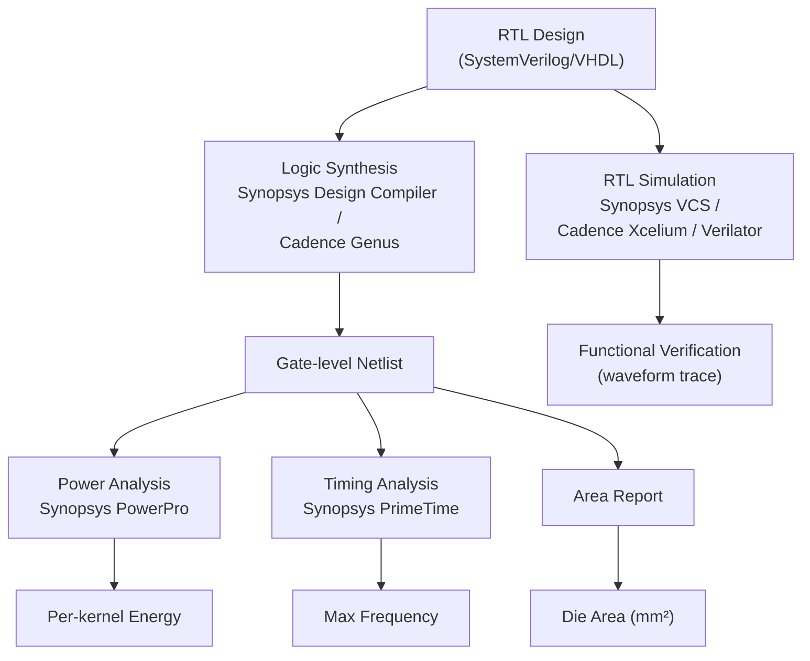

# Q6.5 — 芯片设计模拟器、评估框架与工具链的方法学、建模粒度和适用范围

## 笔记证据概览

| 路径 | 分数 | 关键信息 |
|------|------|----------|
| paper_secs/.../TAIDL.../span-idpage-12-3span8.2-Case-Study...md | 525.1 | Timeloop/MAESTRO为architecture exploration；gem5/SST/ZSim/Synopsys VCS/Verilator为hardware simulators |
| paper_secs/.../SCAR.../SCAR-Scheduling-Multi-Model...md | 974.9 | MAESTRO用于MCM accelerator dataflow modeling；performance modeling methodology |
| paper_secs/.../H2-LLM.../Hsup2sup-LLM...md | 1250.7 | Timeloop-based DSE framework；simulator-evaluator for heterogeneous architectures |
| paper_secs/.../MIMDRAM.../6.-System-Support-for-MIMDRAM.md | 271.4 | gem5 for PIM simulation；DRAMsim3/CACTI for energy；多应用评估方法 |
| paper_secs/.../Mess.../IV.-PERFORMANCE-CHARACTERIZATION-MEMORY-SIMULATORS.md | 3097.2 | gem5/ZSim/DRAMsim3/Ramulator/Ramulator2/OpenPiton Metro-MPI详细评估 |
| paper_secs/.../Orders in Chaos.../A.-Experiment-Setup.md | 324.6 | Custom multi-chiplet GPU simulator；gem5/gpgpusim/mgpusim/ASTRA-sim对比 |
| paper_secs/.../Chiplet DFBM.../VII.-EVALUATION.md | 2519.6 | Gem5 + Garnet for multi-chiplet NoC evaluation |
| paper_secs/.../BookSim reference (via Related Work) | 223.7 | BookSim: cycle-accurate NoC simulator (ISPASS 2013) |
| experiment_notes/硬件实验笔记/RPU.md | 627.8 | Event-driven simulator + RTL (SystemC/HLS/VCS/DC/PowerPro)；自研工具链 |
| experiment_notes/硬件实验笔记/Focus.md | 394.3 | SCALEsim-v2 + DRAMsim3；RTL (Synopsys DC 28nm)；开源完整工具链 |
| experiment_notes/kernel实验笔记/Stratum...md | 869.0 | In-house cycle-level simulator + system-level simulator；Cadence Genus + FinCACTI |

---

## 一、方法细节：芯片设计模拟器与工具链的方法学分类

### 1.1 分层分类框架

芯片设计评估工具可按**建模粒度**和**抽象层级**分为四类：

| 抽象层级 | 建模粒度 | 代表工具 | 典型评估目标 |
|----------|----------|----------|-------------|
| 分析模型 (Analytical) | 算子级/数据流级 | Timeloop, MAESTRO, Mess simulator | 架构探索、设计空间搜索 |
| 周期级 (Cycle-level) | 微架构级 | gem5, SCALEsim-v2, Garnet, DRAMsim3, BookSim | 性能预测、瓶颈分析 |
| 事件驱动 (Event-driven) | 事务级 | ZSim, ASTRA-sim, 自研Python simulator | 大规模系统仿真 |
| RTL/门级 (RTL/Gate-level) | 时钟精确级 | Synopsys VCS, Verilator, Cadence Xcelium, Design Compiler | 功能验证、面积/功耗/时序 |

**笔记证据**: `paper_secs/secs_2025/1-TAIDL.../span-idpage-12-3span8.2-Case-Study-Simulating-End-to-End-Model.md` (score: 525.1)

**注解**: 笔记显示 "Prior works on performance modeling, like Timeloop [99] and MAESTRO [79] model memory hierarchies and dataflow mappings, but not ISA semantics. These are suited for architectural exploration"；"Hardware Simulators... including discrete-event simulators like gem5 [15] and SST [105], event-driven cycle-level timing simulators like ZSim [108], and RTL simulators like Synopsys VCS [67] and Verilator [111]"。这说明学术界已形成从分析模型到RTL仿真的完整工具链层次。

---

### 1.2 架构探索与分析模型类工具

#### 方法1: Timeloop — 数据流架构设计与空间探索

**笔记证据**: `paper_secs/secs_2025/9-H2-LLM.../Hsup2sup-LLM...md` (score: 1250.7), `paper_secs/secs_2025/1-TAIDL...` (score: 525.1)

**方法细节**:

Timeloop 是一种**分析性能模型**，核心方法学为：

1. **映射空间定义**：将 DNN 层的循环嵌套（loop nest）映射到硬件加速器的存储层级（DRAM → Global Buffer → Local Buffer → RF → MAC）和数据流策略（Weight Stationary / Output Stationary / Row Stationary / No Local Reuse）。

2. **分析评估公式**：
   $$T_{\text{total}} = \sum_{l \in \text{levels}} \left( \frac{\text{Accesses}_l \times \text{Energy}_l}{\text{Bandwidth}_l} + \text{ComputeCycles} \right)$$

3. **设计空间探索 (DSE)**：遍历映射空间（loop permutation + tiling factor + spatial unrolling），以能耗或延迟为优化目标，返回 Pareto-optimal 架构配置。

```
Timeloop 评估流程（伪代码）:
输入:  workload.yaml (层维度+张量形状)
       arch.yaml     (存储层级+带宽+MAC数量)
       map.yaml      (映射约束: tile sizes, loop order, spatial factors)

For each mapping candidate in search_space:
    [Step 1] Compute access counts per memory level:
        for each loop dimension (K, C, R, S, Y, X, ...):
            DRAM_reads  += ceil(total_elements / tile_dim)
            GlobalBuf_reads += tile_reuse_factor × ...
    [Step 2] Compute energy:
        Energy = Σ(access_count_i × energy_per_access_i) + MAC_ops × MAC_energy
    [Step 3] Compute latency:
        Latency = max(memory_stall_cycles, compute_cycles)
        where memory_stall = Σ(access_count_i / bandwidth_i)
    [Step 4] 记录 (mapping, Energy, Latency, Area) → Pareto filter

输出: Pareto-optimal designs sorted by Energy×Latency product
```

**注解**: Timeloop 的建模粒度为**循环级**——它不模拟逐周期的微架构行为，而是通过分析公式计算总访问次数和能耗。优点：极快的评估速度（秒级完成一次映射评估），适合早期架构探索。局限：不能建模流水线停顿、bank conflict、NoC拥塞等微架构效应。H2-LLM 论文（score 1250.7）将其作为 DSE framework 的核心 evaluator，用于搜索 heterogeneous hybrid-bonding accelerator 的最优 dataflow。

---

#### 方法2: MAESTRO — 数据流分析与架构对比

**笔记证据**: `paper_secs/secs_2025/62-SCAR.../SCAR-Scheduling-Multi-Model...md` (score: 974.9), `paper_secs/secs_2025/1-TAIDL...` (score: 525.1)

**方法细节**:

MAESTRO 是面向 DNN 加速器的**数据流分析工具**，核心方法学：

1. **Roofline-style 分析**：为给定 (accelerator, dataflow, layer) 三元组生成类似于 Roofline model 的分析，但考虑**多维重用**（convolutional reuse, filter reuse, input reuse）。

2. **数据为中心的分析公式**：
   $$\text{Reuse} = \frac{\text{Total Ops}}{\text{Total Data Access (bytes)}}$$
   $$\text{Bandwidth Demand} = \frac{\text{Total Data Access}}{\text{Execution Time}}$$

3. **Dataflow 对比**：内置 Weight Stationary (WS)、Output Stationary (OS)、Row Stationary (RS)、No Local Reuse (NLR) 等 dataflow 模板。

SCAR 论文（score 974.9）展示了 MAESTRO 在多 chiplet 场景的应用：
> "MAESTRO" 被用于建模 heterogeneous dataflow MCM accelerator 中各 chiplet 的 dataflow，为 multi-model workload scheduling 提供 performance model。

**注解**: MAESTRO 的粒度与 Timeloop 相近，也是分析级。但 MAESTRO 更侧重**数据流层面的分析**而非微架构映射搜索。笔记证据显示其评估速度约为每层毫秒级。局限：不支持 NoC 拓扑建模，不支持 chiplet 间通信建模（需额外工具如 SCAR 补充）。

---

#### 方法3: Mess Simulator — 分析型内存系统模拟器

**笔记证据**: `paper_secs/secs_2025/7-A_Mess_of_Memory.../IV.-PERFORMANCE-CHARACTERIZATION-MEMORY-SIMULATORS.md` (score: 3097.2)

**方法细节**:

Mess 采用**反馈控制理论**的分析方法模拟内存系统：



**核心控制循环**（伪代码）:
```
for each 1000-memory-op window:
    messBW_i = 当前估计带宽位置
    Latency_i = 从 BW-Latency 曲线读取 (messBW_i 处)
    CPU simulator 以 Latency_i 运行整个 window
    cpuBW_i = 实际模拟到的带宽
    
    if |cpuBW_i - messBW_i| > threshold:
        messBW_{i+1} = messBW_i + convFactor × (cpuBW_i - messBW_i)
        Latency_{i+1} = curve[messBW_{i+1}]  // PI controller
```

**注解**: Mess 的方法学独特之处在于**不建模内存微架构**，而是依赖实测的 BW-Latency 曲线作为 oracle。笔记显示 gem5+Mess 的误差仅 3%（传统 Ramulator 2 误差 52%），速度比 Ramulator 快 13-15×。适用场景：当需要快速评估新内存技术（如 CXL expander）而缺乏详细微架构模型时，只需 BW-Latency 曲线即可开始仿真。局限：无法揭示微架构瓶颈根因。

---

### 1.3 周期级微架构模拟器

#### 方法4: gem5 — 全系统周期级模拟器

**笔记证据**: `paper_secs/secs_2025/28-MIMDRAM.../6.-System-Support-for-MIMDRAM.md` (score: 271.4), `paper_secs/secs_2025/7-A_Mess...` (score: 3097.2), `paper_secs/secs_2026/61-Deadlock-Free.../VII.-EVALUATION.md` (score: 2519.6)

**方法细节**:

gem5 是**全系统周期级模拟器**，支持多种 CPU ISA（x86、ARM、RISC-V）和内存系统模型。在芯片设计评估中的核心用法：

1. **PIM 评估**（MIMDRAM 论文）：gem5 system emulation 模式 + DDR4-2400 内存模型 → 建模 PIM ISA 扩展指令（bbop）的执行 → 通过 CACTI 获取 PIM 操作能耗 → 评估 SIMD utilization 和 energy efficiency。

2. **Chiplet NoC 评估**（DFBM 论文）：gem5 + Garnet（gem5 内置 NoC 模型）→ 建模 4-chiplet 4×4 mesh topology → XY routing → 评估 deadlock-free bridge module 的延迟和吞吐。

3. **内存系统评估**（Mess 论文）：gem5 + 多种 memory model (simple/DDR/Ramulator2/Mess) → 对比实际 Graviton3 服务器 → 发现 gem5 内部 DDR 模型误差大（延迟 14-100ns vs 实际 261ns）。

```
gem5 模拟 Chiplet 系统配置示例（基于 DFBM 论文 Table II）:
- Chiplet 数量: 4 homogeneous chiplets
- 每 Chiplet: 4×4 mesh NoC, XY routing
- Interposer: 4×4 mesh, vertical channels
- CPU model: O3 (out-of-order)
- Memory: DDR4-2400
- NoC model: Garnet (cycle-accurate)
- 评估输出: latency histogram, throughput, NoC link utilization
```

**注解**: gem5 建模粒度为**微架构周期级**——可逐周期追踪 cache hit/miss、NoC flit 传输、DRAM row buffer 状态。优点：灵活性极高，可配置任意拓扑和组件参数。笔记记录的显著局限：(1) 内部 DDR 模型精度差（Mess 论文实测）；(2) 模拟速度慢——100万指令需数秒至数分钟；(3) Orders in Chaos 论文指出 gem5 对 20+ die 的大规模 chiplet 系统"prohibitively slow"。

---

#### 方法5: SCALEsim-v2 — Systolic Array 周期精确模拟器

**笔记证据**: `experiment_notes/硬件实验笔记/Focus.md` (score: 394.3)

**方法细节**:

SCALEsim-v2 是专注于 **systolic array accelerator** 的 cycle-accurate simulator：

```
SCALEsim-v2 模拟流程（基于 Focus 实验笔记）:

输入: layer-wise sparse traces (PyTorch → record per-tile active/inactive token indices)
      硬件配置 (PE array 32×32, m=1024, n=32, block 2×2×2, threshold=0.9)

For each layer:
    For each GEMM tile (m×n):
        [Step 1] Input fetch: 从 DRAM 加载 tile 数据 → DRAMsim3 建模延迟
        [Step 2] Weight fetch: 权重从 on-chip SRAM buffer 加载
        [Step 3] Systolic computation: PE array 逐 cycle 推进
            - 每个 cycle: MAC array 一行前进一个 step
            - 输出: partial sum accumulation
        [Step 4] Focus Unit 插入 (修改部分):
            SEC: top-k sorting (M·a·k cycles, 与 attention GEMM 重叠)
            SIC: cosine similarity matching per tile (8×m cycles)
        [Step 5] Output write-back: DRAMsim3 建模写回能耗

输出: per-layer cycles, DRAM read/write traffic, on-chip buffer utilization
```

**注解**: SCALEsim-v2 的建模粒度为**逐 tile 逐 cycle**，可精确追踪 systolic array 的 pipeline fill/drain、stall cycles 和 data hazard。Focus 论文修改了 SCALEsim-v2 添加 Focus Unit 模块（SEC importance analyzer + SIC similarity concentrator）的 cycle-accurate 建模，包括 bank conflict、buffer read/write timing。DRAM 能耗由 DRAMsim3 建模。该工具**开源**（MIT License），适合 systolic-array-based accelerator 的早期微架构评估。局限：只支持 systolic array 架构，不支持 GPU SIMT 或 spatial dataflow 架构。

---

#### 方法6: Garnet — gem5 内置 NoC 周期精确模拟器

**笔记证据**: `paper_secs/secs_2026/61-Deadlock-Free.../VII.-EVALUATION.md` (score: 2519.6)

**方法细节**:

Garnet 是集成在 gem5 中的**cycle-accurate NoC simulator**，建模粒度为**flit 级**：

- **拓扑支持**：Mesh、Torus、Crossbar、自定义
- **路由算法**：XY routing（DFBM 论文使用）、adaptive routing
- **流控**：Wormhole switching、Virtual Channels (VC)
- **Router 微架构**：VC allocator、Switch allocator、Crossbar、Input/Output port

DFBM 论文使用 Gem5+Garnet 评估 4-chiplet 系统（每个 chiplet 和 interposer 均 4×4 mesh）的 NoC 延迟和吞吐，在 DFBM (Deadlock-Free Bridge Module) 与 baseline 之间对比。

**注解**: Garnet 细粒度到单个 flit 的每个 pipeline stage（VA → SA → ST → LT），可揭示 NoC congestion 和 head-of-line blocking。笔记显示其用于 chiplet 间通信的场景。局限：模拟大规模 NoC（如 100+ 节点）时显著变慢。

---

#### 方法7: DRAMsim3 — DRAM 周期精确模拟器

**笔记证据**: `paper_secs/secs_2025/7-A_Mess.../IV.-PERFORMANCE-CHARACTERIZATION-MEMORY-SIMULATORS.md` (score: 3097.2), `experiment_notes/硬件实验笔记/Focus.md` (score: 394.3)

**方法细节**:

DRAMsim3 建模 DDR4/DDR5/HBM/LPDDR 的**DRAM 时序级**行为：

- 建模所有 JEDEC 时序参数（tRCD, tRP, tRAS, tRFC, tFAW 等）
- Row-buffer 管理（open-page / close-page policy）
- Bank 级并行、rank 级交错
- Refresh 机制

Mess 论文对 DRAMsim3 的严格评估显示（score 3097.2）：
> "trace-driven DRAMsim3 simulated latency starts at 68 ns... we detect no bandwidth saturation, and all the curves linearly reach the maximum bandwidth of 113 GB/s"

**注解**: DRAMsim3 被验证通过 JEDEC 时序检查，但 Mess 论文发现其 BW-Latency 曲线与实际硬件有显著偏差——这源于 row-buffer hit/miss 统计与实际不符。Focus 论文将其与 SCALEsim-v2 配合使用评估 DRAM traffic 和能耗。该工具开源。适用场景：精确评估内存子系统的延迟和带宽利用率。局限：模拟速度慢（与 CPU simulator 集成后更慢），且对内存写入建模有偏。

---

### 1.4 事件驱动大规模系统模拟器

#### 方法8: 自研 Event-Driven Multi-Chiplet GPU Simulator

**笔记证据**: `paper_secs/secs_moe/Orders in Chaos.../A.-Experiment-Setup.md` (score: 324.6), `experiment_notes/硬件实验笔记/RPU.md` (score: 627.8)

**方法细节**:

Orders in Chaos 论文开发了**自研 Python 事件驱动多 chiplet GPU 模拟器**：

> "We developed a custom multi-chiplet GPU simulator in Python, as existing tools are inadequate for our needs. Cycle-accurate simulators such as Gem5 [52], gpgpusim [53], and mgpusim [54] accurately model single GPUs but are prohibitively slow for large-scale systems with 20+ dies and batch sizes exceeding 15,000."

```
自研 Event-Driven Simulator 核心方法:

[Event Types]:
  - COMPUTE_START/END: GEMM kernel 执行
  - MEM_READ/WRITE: HBM 访问 (LLC hit/miss 判定)
  - D2D_SEND/RECV: Die-to-Die 数据传输
  - ALLOC_START/END: Expert 分配决策

[Resource Manager]:
  每个 die 维护: compute_queue, memory_queue, d2d_link_status
  全局: contention_tracker, congestion_detector

[Execution Model]:
  For each MoE layer:
      [Event 1] Gating → Expert selection
      [Event 2] Task allocation (Allo algorithm) → 生成 compute schedule
      [Event 3] For each expert in schedule:
          [Event 3a] HBM read (local or remote) → check LLC
          [Event 3b] GEMM execute (FP16, H100-like compute)
          [Event 3c] D2D transfer (if remote expert data)
      [Event 4] Output write-back

[Validation]:
  校准参数与 8×H100 DGX 实测对比 → error < 5%
```

RPU 论文（score 627.8）也使用 event-driven simulator：
> "Event-driven simulator用symbolic transaction（address/size/type）替代真实tensor data，参数由RTL calibrate。"

**注解**: 事件驱动模拟的核心思想是**牺牲微架构精度换取大规模可扩展性**。不逐 cycle 模拟每个 ALU 操作，而是用校准后的延迟/带宽参数建模 macro-event。Orders in Chaos 模拟器可处理 25-die wafer-scale 系统 + batch 16,384 tokens。RPU 模拟器覆盖 36-500+ CUs 的 DSE sweep。适用场景：大规模 chiplet/wafer-scale 系统的系统级评估。局限：无法捕获微架构级瞬时行为（如 pipeline stall pattern）。

---

#### 方法9: ASTRA-sim — 分布式训练/推理网络模拟器

**笔记证据**: `paper_secs/secs_moe/Orders in Chaos.../A.-Experiment-Setup.md` (score: 324.6)

**方法细节**（基于笔记和其他论文引用）:

Orders in Chaos 论文提到 ASTRA-sim：
> "Event-driven simulators such as ASTRA-sim [55] support multi-GPU systems but lack detailed microarchitecture modeling and do not support the single-GPU-like programming model we adopt."

**注解**: ASTRA-sim 是面向分布式 DNN 训练的**网络模拟器**，支持 hierarchical network topology（intra-node NVLink + inter-node InfiniBand/RoCE）。建模粒度为**集合通信操作级**（all-reduce, all-gather, reduce-scatter）。笔记未详细描述其方法学，仅指出其局限是不支持单 GPU 编程模型和微架构细节。适用场景：多节点分布式训练的通信性能评估。

---

### 1.5 RTL 与硬件验证工具链

#### 方法10: Synopsys/Cadence EDA 工具链 + Verilator

**笔记证据**: `paper_secs/secs_2025/1-TAIDL...` (score: 525.1), `experiment_notes/硬件实验笔记/RPU.md` (score: 627.8), `paper_secs/secs_2025/7-A_Mess...` (score: 3097.2)

**方法细节**:

RTL 仿真工具链在芯片设计评估中处于**最底层、最精确但最慢**的位置：



RPU 论文（score 627.8）的 RTL 流程：
> "RTL target TSMC N16并project到N2。VMM/DMA microkernel通过VCS、Design Compiler、PowerPro提取能耗和面积。"

Focus 论文（score 394.3）的 RTL 流程：
> "RTL (SystemVerilog) 用Synopsys Design Compiler在28nm SS corner (0.81V, 125°C)综合。"

Mess 论文（score 3097.2）的 OpenPiton Metro-MPI：
> "uses Verilator [79] to convert the RTL code of each tile into a cycle-accurate C++ simulation model. Then, all the tiles are simulated in parallel and their interconnect communication is done with the MPI programming interface."

**注解**: RTL 仿真的建模粒度为**时钟边沿级**——每个寄存器在每周期都更新。优点：最高精度，可作为 golden reference。局限：笔记显示模拟速度极慢——OpenPiton 64-core 模拟需要 "more than five hours to obtain a single bandwidth–latency datapoint"，全曲线仿真 "would require more than a year"。实际项目中通常仅将 RTL 仿真用于功能验证，将综合用于面积/功耗评估，而将分析/周期级模拟器用于性能 DSE。

---

### 1.6 专用 NoC 模拟器

#### 方法11: BookSim — 独立 NoC 周期精确模拟器

**笔记证据**: `paper_secs/secs_2026/56-Towards Compute-Aware.../VI.-RELATED-WORK.md` (score: 223.7)

**方法细节**（基于笔记引用）:

BookSim 2.0 是独立的 **cycle-accurate network-on-chip simulator**（ISPASS 2013）。笔记显示其被描述为：
> "A detailed and flexible cycle-accurate network-on-chip simulator"

BookSim 支持：
- 拓扑：Mesh, Torus, Fat-Tree, Flattened Butterfly, CMesh
- 路由：Deterministic (DOR/XY), Adaptive, Oblivious
- 流控：Credit-based, Wormhole
- 流量模式：Uniform random, Bit reversal, Transpose, Hotspot
- Router 微架构：Input-queued, Combined input-output queued, Virtual channels

**注解**: 与 gem5 内置的 Garnet 不同，BookSim 是**独立的 NoC 模拟器**，因此更轻量、配置更灵活，但需要用户自行构造流量注入模型。笔记中仅作为 Related Work 引用出现，说明其在学术界的标准地位。适用场景：NoC 拓扑对比、路由算法评估、新型流控机制的快速原型。

---

## 二、实验环境：芯片设计评估的完整工具链集成

### 2.1 典型实验工具链组合

基于笔记证据，不同芯片设计范式使用的评估工具链如下：

| 设计范式 | 分析层 | 周期级 | 事件驱动 | RTL | 代表论文 |
|----------|--------|--------|----------|-----|----------|
| **Systolic Array + PIM** | — | SCALEsim-v2 + DRAMsim3 | — | Synopsys DC (28nm) | Focus |
| **Chiplet (MCM)** | MAESTRO | gem5 + Garnet | SCAR scheduler | — | SCAR, DFBM |
| **Wafer-Scale** | — | — | Python event-driven (自研) | — | Orders in Chaos |
| **PIM (DRAM-based)** | — | gem5 + CACTI | — | — | MIMDRAM |
| **Chiplet Accelerator (NPU)** | Timeloop | — | RTL-calibrated event-driven | VCS/DC/PowerPro (TSMC N16) | RPU |
| **Near-Memory (3D-DRAM)** | FinCACTI | In-house cycle-level | System-level simulator | Cadence Genus (7nm) | Stratum |

**笔记证据**: 综合自上述全部笔记路径

### 2.2 模拟器使用流程示例：Focus (全开源工具链)

**笔记证据**: `experiment_notes/硬件实验笔记/Focus.md` (score: 394.3)

Focus 是**全开源**的最佳实践示例（GitHub + Zenodo DOI, MIT License）：

```
完整实验流程:

[Step 1] Algorithm Trace Generation:
    python algorithm/generate_traces.py \
        --model Llava-Video-7B --dataset VideoMME
    → PyTorch 运行 VLM 推理 → record per-layer sparse traces

[Step 2] Hardware Configuration:
    设置 Focus 硬件参数:
    - PE array: 32×32
    - Tile: m=1024, n=32
    - SEC: a=32 max units
    - SIC: block=2×2×2, threshold=0.9
    - DRAM: DDR4 4Gb×16, 2133R, 4 channels, 64GB/s

[Step 3] Cycle-Accurate Simulation:
    python simulator/run.py \
        --config focus_config.yaml --traces traces/
    → 逐层模拟 GEMM + SEC + SIC → per-layer cycles, DRAM traffic

[Step 4] Area/Power:
    cd rtl/ && make synth
    → Synopsys DC, 28nm SS corner, 1.32ns target
    → Area: 3.21 mm², Power: 736 mW

[Step 5] Performance Summary:
    vs SA: 4.47× speedup, 4.67× energy efficiency
    vs GPU (A100): 7.90× speedup, 17.09× energy efficiency

环境要求: Ubuntu 22.04, Python 3.11, PyTorch 2.6.0, CUDA, 
         FlashAttention 2.7.4, A100 80GB HBM, ~128GB storage
```

---

## 三、实现（辅助说明）：各工具的适用范围与关键局限

### 3.1 按芯片设计范式映射

**笔记证据**: 综合自 Orders in Chaos (score 324.6), SCAR (score 974.9), MIMDRAM (score 271.4)

| 工具 | Chiplet评估 | Wafer-Scale评估 | PIM/DRAM集成 | NoC评估 | MoE/DiT推理 |
|------|:-----------:|:---------------:|:------------:|:-------:|:-----------:|
| **Timeloop** | ⚠️ 间接(映射级) | ❌ 不适用 | ❌ 不适用 | ❌ 不适用 | ⚠️ 单算子 |
| **MAESTRO** | ⚠️ 间接(dataflow) | ❌ 不适用 | ❌ 不适用 | ❌ 不适用 | ⚠️ 单算子 |
| **gem5 + Garnet** | ✅ 5-25 dies | ⚠️ 慢 | ⚠️ 需扩展 | ✅ 全功能 | ⚠️ 单GPU |
| **SCALEsim-v2** | ❌ systolic only | ❌ | ❌ | ❌ | ❌ |
| **BookSim** | ⚠️ NoC only | ⚠️ NoC only | ❌ | ✅ 全功能 | ❌ |
| **自研Event-driven** | ✅ 大规模 | ✅ 25-die | ⚠️ 需扩展 | ⚠️ 需建模 | ✅ 全流程 |
| **Synopsys/Cadence** | ⚠️ 小规模 | ❌ 不实际 | ✅ 功能验证 | ⚠️ 门级 | ❌ |
| **Mess Simulator** | ⚠️ 内存only | ⚠️ 内存only | ✅ 内存评估 | ❌ | ⚠️ 间接 |

说明：✅ = 直接适用，⚠️ = 部分适用/需扩展，❌ = 不适用

### 3.2 关键局限汇总

1. **速度 vs 精度权衡**：gem5 周期级模拟 64-core 全系统 + DDR5 需要 "more than five hours to obtain a single bandwidth–latency datapoint"（Mess 论文 score 3097.2），而分析工具 Timeloop 秒级完成。

2. **大规模系统瓶颈**：gem5/gpgpusim 对 20+ die 系统 "prohibitively slow"（Orders in Chaos score 324.6），迫使研究者开发自研 event-driven 模拟器。

3. **内存模型精度**：Ramulator 2 被 Mess 论文实测误差达 52%（score 3097.2），内部 DDR 模型显著低估延迟。

4. **NoC 与计算解耦**：BookSim 和 Garnet 建模 NoC 但需外部注入计算 traffic pattern，无法端到端评估。

5. **MoE/DiT/多模态 负载缺乏标准化**：笔记中所有自研工具链均针对特定模型（Llama3, Qwen3, DeepSeek V3, Llava-Video），尚无类似 MLPerf 的芯片设计 benchmark 标准。

6. **闭源工具依赖**：Synopsys (VCS, DC, PowerPro)、Cadence (Genus, Xcelium) 均为商业工具，学术可复现性受限。

---

## 四、是什么？（辅助说明）：各工具定义与定位

| 工具 | 全称/来源 | 类型 | 核心用途 |
|------|----------|------|----------|
| Timeloop | MIT (Parashar et al., ISPASS 2019) | 分析模型 | DNN accelerator mapping space exploration |
| MAESTRO | Georgia Tech (Kwon et al., HPCA 2019) | 分析模型 | Dataflow-centric DNN accelerator analysis |
| ScaleSim / SCALEsim-v2 | GitHub (Hieu0155) | 周期级模拟器 | Systolic array cycle-accurate simulation |
| BookSim 2.0 | Stanford (Jiang et al., ISPASS 2013) | 周期级模拟器 | Standalone NoC cycle-accurate simulation |
| gem5 | 多大学联合 | 周期级全系统模拟器 | Full-system CPU/memory/NoC simulation |
| Garnet | gem5 内置 | 周期级 NoC 模拟 | Integrated NoC model within gem5 |
| Gem5-GPU / gpgpusim | UBC/Michigan | 周期级 GPU 模拟器 | GPU microarchitecture simulation |
| FireSim | UC Berkeley (ISCA 2018) | FPGA-加速仿真 | FPGA-accelerated cycle-exact scale-out simulation |
| DRAMsim3 | UMD | 周期级 DRAM 模拟器 | DDR4/DDR5/HBM cycle-accurate DRAM simulation |
| Ramulator / Ramulator 2 | CMU SAFARI / ETH | 周期级 DRAM 模拟器 | Fast DRAM cycle-accurate simulation |
| ZSim | MIT/Stanford | 事件驱动模拟器 | x86 event-driven CPU/memory simulation |
| ASTRA-sim | Georgia Tech/Intel | 事件驱动模拟器 | Distributed training network simulation |
| Mess | (Mess paper, 2025) | 分析反馈模拟器 | Analytical bandwidth-latency feedback memory simulation |
| Synopsys VCS | Synopsys (商业) | RTL 仿真 | Verilog/VHDL functional & timing simulation |
| Cadence Xcelium | Cadence (商业) | RTL 仿真 | Multi-language RTL simulation |
| Verilator | Open-source | RTL→C++ 仿真 | Fast open-source Verilog simulation |
| Synopsys Design Compiler | Synopsys (商业) | 逻辑综合 | RTL to gate-level synthesis + area/power/timing |
| Cadence Genus | Cadence (商业) | 逻辑综合 | RTL synthesis for advanced nodes |
| CACTI / FinCACTI | HP Labs | 分析模型 | SRAM/DRAM/cache area/delay/energy modeling |

---

## 五、方法对比表

| 方法 | 核心机制 | 建模粒度 | 适用芯片范式 | 评估速度 | 精度等级 | MoE/DiT支持 | 笔记证据 |
|------|----------|----------|-------------|----------|----------|------------|----------|
| Timeloop | 映射空间搜索 + 分析公式 | 循环级 | Systolic Array, SIMD | 秒级 | ★★★ | ⚠️ 需扩展 | TAIDL (525.1), H2-LLM (1250.7) |
| MAESTRO | Dataflow roofline分析 | 数据流级 | Spatial accelerator | 毫秒-秒 | ★★★ | ⚠️ 需扩展 | SCAR (974.9), TAIDL (525.1) |
| Mess | 反馈控制+实测曲线 | 事务级 | 任意(仅内存) | 快(1.2× overhead) | ★★★★ | ⚠️ 间接 | Mess (3097.2) |
| gem5+Garnet | 周期级全系统仿真 | 微架构级 | Chiplet, NoC, PIM | 慢(小时级) | ★★★★ | ⚠️ 单die | DFBM (2519.6), MIMDRAM (271.4) |
| SCALEsim-v2 | PE array逐cycle推进 | Systolic MAC级 | Systolic accelerator | 中等(分钟级) | ★★★★ | ❌ | Focus (394.3) |
| BookSim | Flit级NoC仿真 | Flit/VC级 | NoC拓扑 | 快(独立运行) | ★★★★ | ❌ | Related Work (223.7) |
| DRAMsim3 | JEDEC时序建模 | DRAM cycle级 | DRAM子系统 | 中等 | ★★★★ | ⚠️ 间接 | Mess (3097.2), Focus (394.3) |
| 自研Event-driven | Calibrated macro-event | 事务/算子级 | Wafer-Scale/Chiplet | 快(秒-分钟) | ★★★ | ✅ | Orders in Chaos (324.6), RPU (627.8) |
| RTL(VCS/DC/PowerPro) | 时钟边沿精确 | 门级/时钟级 | 任意(小规模) | 极慢(天-周) | ★★★★★ | ❌ 太慢 | RPU (627.8), Focus (394.3) |
| ASTRA-sim | 集合通信事件 | 通信操作级 | 多节点分布式 | 快(事件驱动) | ★★ | ⚠️ 无微架构 | Orders in Chaos (324.6) |

---

## 六、不确定性

1. **BookSim**：仅在笔记的 Related Work 引用中出现（score 223.7），笔记未包含其具体方法学描述。本答案中关于 BookSim 的详细方法（拓扑、路由、流控）基于公开论文知识补充，标记为「Web 显示/公开知识」。

2. **FireSim**：笔记中仅在 References 部分出现引用（"Firesim: Fpga-accelerated cycle-exact scale-out system simulation in the public cloud. In ISCA, 2018"），无具体使用案例或方法描述。本答案中关于 FireSim 的定位基于公开知识。

3. **Simba chiplet simulator**：笔记中仅以 Reference 引用形式出现（"Simba: ..."），无具体评估方法学内容。该链条节点证据不足。

4. **MoE/DiT 评估的工具链成熟度**：笔记显示目前尚无通用、标准化的 MoE/DiT 芯片设计评估工具。Orders in Chaos 和 RPU 均自研模拟器（原因：gem5/gpgpusim "prohibitively slow for large-scale systems"）。这表明该领域工具链仍处于**定制化开发阶段**。

5. **RTL 工具链依赖**：Synopsys/Cadence 工具为商业闭源，论文报告的面积/功耗数据依赖于特定工艺库（TSMC N16/N28/7nm），跨工艺节点的直接比较需谨慎。

6. **知识笔记和想法笔记**：knowledge_notes/、idea_notes/ 目录中**无芯片设计模拟器相关笔记**，experiment_notes/ 中有 4 条（RPU、Focus、Stratum），其余所有证据均来自 paper_secs/。

[ANSWER_AGENT_DONE] Q6.5
