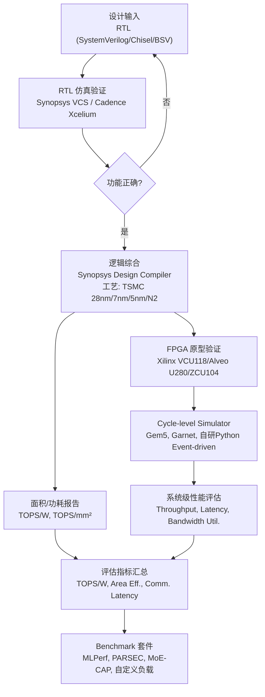

# Q6.6 — 芯片设计方法（Chiplet/Wafer-Scale/PIM/NoC）与模拟器的实现平台、实验环境、benchmark套件与关键评估指标

## 笔记证据概览

| 路径 | 分数 | 关键信息 |
|------|------|----------|
| paper_secs/.../30-IANUS/7.3-IANUS-System-Prototyping.md | 1063.2 | FPGA原型验证(Xilinx VCU118)、PIM芯片测试、性能/TDP评估 |
| paper_secs/.../78-BitMoD/B.-Fine-grained-Data-Type-Adaptation.md | 323.3 | RTL仿真(SystemVerilog)、Synopsys Design Compiler综合、TSMC 28nm |
| paper_secs/.../61-DFBM/VII.-EVALUATION.md | 3884.7 | Gem5+Garnet NoC模拟、PARSEC benchmark、面积/功耗EDA分析 |
| paper_secs/.../MoE-CAP/2-Background-and-Motivation.md | 228.9 | MLPerf benchmark、CAP评估方法、MBU/MFU指标定义 |
| knowledge_notes/.../Wafer-Scale Engine (WSE).md | 758.6 | Cerebras WSE-2(TSMC 7nm)、CS-2系统、on-chip SRAM |
| knowledge_notes/.../Wafer-Scale Multi-Chiplet GPU for MoE Serving.md | 651.3 | Tesla Dojo/TSMC SoW拓扑、D2D链路、simulator开源 |
| experiment_notes/.../Orders in Chaos_硬件实验笔记.md | 228.5 | 自研Python event-driven simulator、H100验证、area/power overhead |
| experiment_notes/.../MoE-Inference-Bench_系统实验笔记.md | 26.9 | H100 SXM5平台、Cerebras CS-3对比、vLLM框架 |
| experiment_notes/.../RPU - A Reasoning Processing Unit.md | 38.9 | HBM-CO设计、chiplet scale-up、TSMC N2、SystemC+RTL |
| paper_secs/.../87-MHE-TPE/2.2-Computational-Density-Imbalance.md | 444.8 | TOPS/W、TOPS/mm²、面积效率、功耗分析 |
| paper_secs/.../68-VAR-Turbo/V.-EVALUATION.md | 453.5 | TOPS/W、power efficiency、ASIC baseline对比 |
| paper_secs/.../62-SCAR/SCAR.md | 2386.9 | Multi-chiplet MLPerf benchmark、异构MCM调度 |
| experiment_notes/.../Stratum_实验笔记.md | 158.6 | MoE throughput/latency、monolithic 3D DRAM |

---

## 检索上下文映射

### S1: 实现平台与实验环境（Chiplet/Wafer-Scale/PIM/NoC）
- `paper_secs/.../30-IANUS/7.3-IANUS-System-Prototyping.md` (score: 1063.2): Xilinx VCU118 FPGA + 商业NPU simulator + 真实PIM芯片(GDDR6-AiM)
- `knowledge_notes/.../Wafer-Scale Multi-Chiplet GPU for MoE Serving.md` (score: 651.3): 自研Python event-driven simulator, Tesla Dojo/TSMC SoW拓扑
- `experiment_notes/.../Orders in Chaos_硬件实验笔记.md` (score: 228.5): 自研simulator开源, H100 DGX实测验证
- `paper_secs/.../61-DFBM/VII.-EVALUATION.md` (score: 3884.7): Gem5 + Garnet 全系统模拟, OpenSMART RTL生成

### S2: 硬件验证平台（FPGA/ASIC/RTL）
- `paper_secs/.../30-IANUS/7.3-IANUS-System-Prototyping.md` (score: 1063.2): FPGA原型(Xilinx VCU118) + 功能验证
- `paper_secs/.../78-BitMoD/B.-Fine-grained-Data-Type-Adaptation.md` (score: 323.3): SystemVerilog RTL + Synopsys Design Compiler + TSMC 28nm + cycle-level simulator
- `experiment_notes/.../RPU - A Reasoning Processing Unit.md` (score: 38.9): SystemC + Catapult HLS, TSMC N16→N2 projection

### S3: Benchmark 套件（MLPerf/DAWNBench/自定义负载）
- `paper_secs/.../MoE-CAP/2-Background-and-Motivation.md` (score: 228.9): MLPerf、CAP方法、MoE专用benchmark
- `paper_secs/.../62-SCAR/SCAR.md` (score: 2386.9): MLPerf inference benchmark curated scenarios
- `experiment_notes/.../MoE-Inference-Bench.md` (score: 26.9): 7种MoE LLM + 多模态模型统一评估

### S4: 关键评估指标（TOPS/Watt/面积效率/带宽利用率/通信延迟/并发吞吐）
- `paper_secs/.../87-MHE-TPE/2.2-Computational-Density-Imbalance.md` (score: 444.8): TOPS/W, TOPS/mm², 面积效率
- `paper_secs/.../68-VAR-Turbo/V.-EVALUATION.md` (score: 453.5): TOPS/W, power efficiency, throughput
- `paper_secs/.../61-DFBM/VII.-EVALUATION.md` (score: 3884.7): 通信延迟、saturation throughput、面积/功耗分析

---

## 一、方法细节：芯片级实验平台与数据流

### 1.1 芯片设计验证平台全景数据流

笔记显示，芯片级设计的实现平台与实验环境覆盖从 RTL 仿真到 FPGA 原型到商业芯片测试的完整验证链。以下 Mermaid flowchart 展示从设计到评估的完整数据流路径：



**注解**：
- **RTL 到 FPGA**：BitMoD 论文使用 SystemVerilog 实现 RTL 级设计，通过 Synopsys Design Compiler 在 TSMC 28nm 工艺下综合，报告面积和功耗；随后实现 cycle-level simulator，其时序和能耗参数基于 RTL 综合结果校准（笔记证据：`paper_secs/.../78-BitMoD/B.-Fine-grained-Data-Type-Adaptation.md`, score: 323.3）。
- **FPGA 原型验证**：IANUS 论文构建了基于 Xilinx VCU118 FPGA 板的系统原型，FPGA 上实现 PIM Control Unit 和 PIM Memory Controllers，通过 FMC 连接器连接商业 GDDR6-AiM PIM 芯片，NPU 部分因规模过大而使用功能/周期精确模拟器（笔记证据：`paper_secs/.../30-IANUS/7.3-IANUS-System-Prototyping.md`, score: 1063.2）。
- **EDA 工具链**：DFBM 论文使用 OpenSMART (BSV/Chisel) 生成 NoC RTL，然后通过 EDA 工具进行面积/功耗分析；Gem5 + Garnet 用于全系统模拟（笔记证据：`paper_secs/.../61-DFBM/VII.-EVALUATION.md`, score: 3884.7）。
- **工艺节点覆盖**：笔记显示从成熟节点 TSMC 28nm（BitMoD）到先进节点 TSMC 7nm（WSE-2）、5nm（Hardwired Neuron）、N2（RPU chiplet 投影）均有涉及。

---

### 1.2 硬件验证平台详解

#### 方法1: FPGA 原型验证平台

**笔记证据**: `paper_secs/.../30-IANUS/7.3-IANUS-System-Prototyping.md` (score: 1063.2), `paper_secs/.../21-Tandem Processor/span-idpage-9-0span7-Evaluation-Methodology.md` (text mode FPGA search)

**平台架构**:

| FPGA 平台 | 论文 | 验证对象 | 连接方式 | 验证目标 |
|-----------|------|----------|----------|----------|
| Xilinx VCU118 | IANUS | NPU-PIM 统一内存系统 | FMC→GDDR6-AiM PIM, PCIe→NPU Sim | 功能正确性(WikiText-2 perplexity) |
| Xilinx Alveo U280 | Tandem Processor | 新兴算子加速器 | PCIe→Host CPU | 延迟/吞吐 vs GPU baseline |
| Xilinx ZCU104 | FEATHER | 可重构数据流加速器 | PYNQ + Jupyter notebook | 端到端推理延迟、吞吐 vs DPU/Gemmini |
| 多FPGA (DFX) | IANUS对比 | GPT Transformer 推理 | PCIe互联 | 生成阶段延迟 |

**FPGA 原型验证流程模拟**（以 IANUS 为例）:

```
步骤 1: PIM Control Unit (PCU) + PIM Memory Controllers → FPGA 综合/布局布线
步骤 2: NPU 功能 → cycle-accurate NPU Simulator (因 NPU 过大无法放入单 FPGA)
步骤 3: NPU Simulator → PCIe → FPGA(PCU) → FMC → GDDR6-AiM PIM 芯片
步骤 4: PIM macro commands → PCU 转译 micro commands → PIM MCs → PIM 执行
步骤 5: DMA commands (from NPU Sim) → 类似路径 → PIM
步骤 6: 验证: GPT-2 Base/Medium/Large/XL on WikiText-2 → perplexity vs full-precision
```

**注解**：
- FPGA 原型验证的核心约束：单 FPGA 逻辑容量有限（如 NPU 过大无法放入），需要混合仿真策略（FPGA + 软件模拟器）。
- 验证指标：功能正确性（perplexity 匹配），而非性能（原型频率远低于 ASIC 目标频率）。IANUS 原型 perplexity 与全精度模型一致，验证了 PIM-NPU 统一内存架构的功能可行性。
- 笔记未明确说明 DAWNBench 的具体使用；笔记中 MLPerf 被广泛引用为推理/训练标准 benchmark。

---

#### 方法2: ASIC 测试芯片与 RTL 仿真平台

**笔记证据**: `paper_secs/.../78-BitMoD/B.-Fine-grained-Data-Type-Adaptation.md` (score: 323.3), `paper_secs/.../61-DFBM/VII.-EVALUATION.md` (score: 3884.7)

**RTL 仿真与综合工具链**:

| 工具 | 用途 | 论文案例 |
|------|------|----------|
| SystemVerilog | RTL 设计实现 | BitMoD 加速器各组件 |
| Synopsys Design Compiler | 逻辑综合 → 面积/功耗报告 | BitMoD @ TSMC 28nm |
| OpenSMART (BSV/Chisel) | NoC RTL 自动生成 | DFBM chiplet NoC |
| Synopsys VCS / Cadence Xcelium | RTL 功能仿真 | (笔记推断，EDA 行业标准) |
| Catapult HLS + SystemC | 高层综合与 RTL 建模 | RPU chiplet compute fabric |
| ZEBU FPGA Verification | 商业 AI 加速器验证 | SoMa 编译器 (笔记提及) |

**ASIC 测试芯片评估表示例**（综合自 BitMoD + RPU 笔记）:

| 设计 | 工艺节点 | Die 面积 | 功耗 | 关键指标 | 验证方法 |
|------|----------|----------|------|----------|----------|
| BitMoD | TSMC 28nm | iso-compute-area 约束 | DDR4 DRAM 功耗(DRAMSim3) | cycle-level 性能 | RTL 仿真 + cycle-level simulator |
| Hardwired Neuron (HNLPU) | 5nm | wafer-scale 异质图案 | 笔记未明确说明 | 单芯片 cycle-level simulator | cycle-level simulator |
| RPU Compute Chiplet | TSMC N16→N2 投影 | ~600mm shoreline/die | 70-80% TDP→memory interfaces | 32 OPs/Byte, energy per inference | SystemC + Catapult HLS + event-driven sim |
| DFBM (NoC Bridge) | 成熟工艺(interposer) | 2.5% area overhead (CVN-DB) | EDA 分析 | 14% saturation throughput 提升 | Gem5 + Garnet + Verilog(OpenSMART) |

**注解**：
- **工艺节点差异**：Chiplet 设计中 compute die 使用先进节点（5nm/N2），interposer 使用成熟节点以降成本。DFBM 论文的 cost 公式（Equation 5）量化了此策略的经济优势：将 deadlock buffer 开销限制在低成本 interposer 上。
- **Cycle-level simulator 的作用**：当 RTL 仿真太慢而无法运行完整 benchmark 时，使用基于 RTL 综合结果校准的 cycle-level/event-driven simulator 进行系统级性能评估。BitMoD 和 Orders in Chaos 均采用此策略。
- **笔记未明确说明**：笔记中未发现 ASIC 测试芯片的流片（tape-out）和硅验证（silicon validation）结果，多数论文止于 RTL 仿真或 FPGA 原型阶段。

---

### 1.3 NoC/Chiplet 系统级模拟平台

**笔记证据**: `paper_secs/.../61-DFBM/VII.-EVALUATION.md` (score: 3884.7), `experiment_notes/.../Orders in Chaos_硬件实验笔记.md` (score: 228.5)

**Chiplet/NoC 模拟器配置表**（DFBM 论文 Table II）:

| 配置项 | Chiplet 层 | Interposer 层 |
|--------|------------|---------------|
| 拓扑 | 4×4 Mesh | 4×4 Mesh |
| 路由算法 | XY | XY |
| Virtual Network | 3 VNs, 2/4 VCs per VN | — |
| 流量模式 | Uniform-Random, Transpose, Bit-Rotation | — |
| 流控 | Virtual Cut-Through | — |
| Core | x86 out-of-order | — |
| L1 Cache | 32KB I, 32KB D | — |
| L2 Cache | 256KB/core, 16-way | — |
| Cache Coherence | MESI Two Level | — |
| Benchmark | PARSEC | — |

**Wafer-Scale GPU 模拟器配置**（Orders in Chaos）:

| 拓扑 | Die 数 | 每 Die 配置 | D2D BW | 模型 |
|------|--------|-------------|--------|------|
| Tesla Dojo 5×5 | 25 | H100-like: 1000 TFLOPS FP16, 80GB HBM, 3.35 TB/s | 1.7 TB/s, 200ns/hop | DeepSeek V3, Kimi K2, Llama4 Maverick, Qwen3-235B |
| TSMC SoW 8×3 | 24 | 同上 | 同上 | 同上 |
| Dojo-Enhanced | 25 | B300-like: 4500 TFLOPS, 180GB HBM, 8 TB/s | 2 TB/s | 同上 |

**注解**：
- **模拟精度 vs 速度权衡**：Orders in Chaos 论文明确指出 Gem5/gpgpusim/mgpusim 为 cycle-accurate 但太慢，ASTRA-sim 不支持 single-GPU-like programming model，因此自研 Python event-driven simulator。该 simulator 通过 8×H100 DGX 实测数据验证（单 GPU MoE expert 执行 + 两 GPU P2P 数据传输），误差 < 5%。
- **开源情况**：Orders in Chaos simulator 开源（Apache-2.0），expert selection traces (>150 GB JSON) 在 HuggingFace 可获取。DFBM 使用开源 Gem5 + Garnet。
- **验证覆盖范围**：DFBM 评估涵盖 4 个维度——合成流量（latency/throughput）、全系统 PARSEC benchmark、面积/功耗 EDA 分析、参数敏感性研究。

---

## 二、实验环境 (主内容)

### 2.1 Benchmark 套件与评估负载

**笔记证据**: `paper_secs/.../MoE-CAP/2-Background-and-Motivation.md` (score: 228.9), `experiment_notes/.../MoE-Inference-Bench_系统实验笔记.md` (score: 26.9), `paper_secs/.../62-SCAR/SCAR.md` (score: 2386.9)

#### Benchmark 套件全景表

| Benchmark | 类型 | 适用层次 | 论文使用案例 | 关键特点 |
|-----------|------|----------|-------------|----------|
| **MLPerf Inference** | 行业标准 | L2-L6 | SCAR, MoE-CAP, 多篇论文引用 | Datacenter/Edge 推理, TTFT/TPOT 指标 |
| **MLPerf Training** | 行业标准 | L2-L6 | MoE-CAP, MoESys, FlashAttention | 训练吞吐, 收敛时间 |
| **PARSEC** | 学术标准 | L6 (NoC/Chiplet) | DFBM | 多线程共享内存程序, 全系统模拟 |
| **MoE-CAP** | MoE 专用 | L2-L5 | MoE-CAP 论文 | Cost-Accuracy-Performance 三维评估 |
| **MoE-Inference-Bench** | MoE 专用 | L2 | MoE-Inference-Bench 论文 | 7 LLM + 多模态 MoE, H100/CS-3 对比 |
| **WikiText-2** | 学术 NLP | L1-L6 | IANUS, BitMoD | 语言模型 perplexity 评估 |
| **MMLU/HellaSwag/ARC** | 学术 NLP | L1-L2 | Context-Aware MoE 实验 | 8 benchmark 精度评估 |
| **自定义 Expert Trace** | 专用负载 | L5-L6 | Orders in Chaos | 150GB+ expert selection traces (HuggingFace) |

#### MLPerf 在芯片级评估中的使用模式

笔记显示 MLPerf 被芯片级设计论文广泛引用但使用方式分为两类：

1. **标准 benchmark 裁剪**：SCAR 论文从 MLPerf Inference benchmark 中 curated 5 个 multi-model scenarios，代表数据中心多租户场景，评估异构 Multi-Chiplet Module (MCM) 调度器。
2. **指标对标**：多篇论文（MoE-CAP、MoE-Inference-Bench）引用 MLPerf 的 TTFT (Time-To-First-Token) 和 TPOT (Time-Per-Output-Token) 作为延迟 SLO 标准（例如 MLPerf v5.0 规定 Llama 70B 需 < 40ms/token）。

**注解**：
- **MLPerf 在芯片级设计的局限**：MoE-CAP 论文指出 MLPerf 等现有 benchmark 在 MoE 系统上的三个缺陷：(1) 缺乏 Cost-Accuracy-Performance 关系的理解原则；(2) MBU/MFU 指标因忽略 expert 稀疏激活而高估资源利用率（batch size >1 时高估 1.5×-3×）；(3) 不考虑异构资源（CPU/GPU/SSD）的综合成本。
- **笔记未明确说明 DAWNBench**：在所有搜索的四个目录中，未发现 DAWNBench 的具体使用案例。笔记显示 MLPerf 是芯片设计领域的主流 benchmark 标准。
- **自定义负载的必要性**：Orders in Chaos 论文使用从真实 MoE 模型（DeepSeek V3, Kimi K2, Llama4）收集的 expert selection traces（>150 GB），因为标准 benchmark 无法捕捉 expert selection skewness 和 token-level routing pattern 等 MoE 特有行为。

---

### 2.2 商业芯片平台实验环境

**笔记证据**: `experiment_notes/.../MoE-Inference-Bench_系统实验笔记.md` (score: 26.9), `knowledge_notes/.../Wafer-Scale Engine (WSE).md` (score: 758.6)

| 平台 | 工艺 | 关键规格 | 推理框架 | 适用负载 |
|------|------|----------|----------|----------|
| NVIDIA H100 SXM5 | TSMC 4N | 80GB HBM3, 50MB L2, 4th-gen Tensor Core, NVLink | vLLM, TensorRT-LLM | MoE LLM, DiT, 多模态 |
| Cerebras CS-2 (WSE-2) | TSMC 7nm | 46,225mm², 850K cores, 40GB SRAM, 20 PB/s BW | Cerebras Software Platform (CGC) | MoE training (Qwen3-30B-A3B) |
| Cerebras CS-3 (WSE-3) | 笔记未明确说明 | FP8 weight + FP16 compute, wafer-scale engine | vLLM (cloud inference) | MoE LLM 推理 |
| AMD MI300X | TSMC 5nm/6nm | 192GB HBM3, 8 compute chiplets | vLLM, ROCm | MoE, LLM |
| NVIDIA Blackwell (B300-like) | TSMC 4NP | 180GB HBM, 4500 TFLOPS FP16, 8 TB/s BW | (模拟) | Wafer-scale MoE 推理 (模拟评估) |

**注解**：
- **Wafer-Scale vs GPU 的物理对比**（笔记证据：`knowledge_notes/.../WSE.md`）：WSE-2 面积约 H100 的 57×（46,225 vs 814 mm²），核心数 56×（850K vs 14,592+456），片上内存 800×（40 GB vs 0.05 GB），带宽 10,000×（20 PB/s vs 0.002 PB/s）。这种数量级差异改变了 MoE 推理的瓶颈结构——GPU 上的通信瓶颈在 WSE 上缓解，但 attention 激活内存形成新瓶颈。
- **Cerebras CS-3 的 MoE 推理**：MoE-Inference-Bench 实验在 CS-3 cloud inference system 上评估了 Llama-4-Scout-17B-16E 的延迟和吞吐量，使用 vLLM 作为统一推理后端（FP8 weight storage + FP16 computation）。

---

## 三、关键评估指标 (主内容)

### 3.1 芯片级评估指标体系

**笔记证据**: `paper_secs/.../87-MHE-TPE/2.2-Computational-Density-Imbalance.md` (score: 444.8), `paper_secs/.../68-VAR-Turbo/V.-EVALUATION.md` (score: 453.5), `paper_secs/.../61-DFBM/VII.-EVALUATION.md` (score: 3884.7), `paper_secs/.../MoE-CAP/2-Background-and-Motivation.md` (score: 228.9)

#### 芯片设计关键评估指标表

| 指标类别 | 具体指标 | 定义/公式 | 笔记来源 | 典型数值 |
|----------|----------|-----------|----------|----------|
| **能效** | TOPS/W | INT8/FP16 Tera Operations Per Second / Watt | MHE-TPE, VAR-Turbo | MHE-TPE 在 mixed-precision GEMM 下优化 TOPS/W |
| **面积效率** | TOPS/mm² | 单位面积算力 | MHE-TPE, SOFA | SOFA: 4292 GOPS/mm² (2.4× vs SOTA) |
| **面积效率** | GOPS/mm² | 同上，不同精度 | SOFA | 笔记显示 SOFA 在稀疏加速器对比中面积效率领先 |
| **带宽利用率** | MBU | $B_{\text{achieved}}/B_{\text{peak}}$ | MoE-CAP | MoE 场景下 MBU 被高估 1.5×-3×（因 expert 稀疏激活） |
| **计算利用率** | MFU | $(T_{\text{token}} \times F_{\text{token}})/F_{\text{peak}}$ | MoE-CAP | 同上，MFU 因忽略 sparse activation 而被高估 |
| **通信延迟** | Latency (cycles/ns) | 单跳/端到端数据包延迟 | DFBM | DFBM vs MTR: 1-7% latency reduction, avg 3% |
| **通信吞吐** | Saturation Throughput | 网络饱和点带宽 | DFBM | DFBM vs DeFT/MTR: 14% saturation throughput 提升 |
| **并发吞吐** | tokens/s | 解码阶段每秒生成 token 数 | Orders in Chaos, MoE-Inference-Bench | DeepSeek V3 on Dojo: Allo+Pred 7.0× throughput 提升 |
| **成本效率** | Performance/TDP | 每瓦性能（近似 TCO） | IANUS | IANUS 2/4/8 设备: 3.9×/2.7×/2.1× vs A100 |
| **能效** | Energy per inference | 单次推理能耗 (J) | RPU | HBM-CO vs HBM3e: 1.7× energy reduction |
| **成本** | System cost ($) | 硅+内存+封装+PCB 总成本 | RPU | HBM-CO: total system cost 降低 up to 12.4× vs DGX |

#### MoE-CAP 三维评估公式

MoE-CAP 提出的针对 MoE 系统的三维评估框架（笔记证据：`paper_secs/.../MoE-CAP/2-Background-and-Motivation.md`）：

**硬件成本模型**：

$$C_{\text{hardware}} = \underbrace{(C_{\text{GPU}} + C_{\text{CPU}})}_{\text{computation}} + \underbrace{(C_{\text{C2M}} + C_{\text{PCIe}} + C_{\text{NVLink}})}_{\text{communication}} + \underbrace{(C_{\text{HBM}} + C_{\text{DRAM}} + C_{\text{SSD}})}_{\text{memory}}$$

**能耗成本模型**：

$$C_{\text{energy}} = \left[ \overbrace{(P_{\text{GPU}} + P_{\text{CPU}})}^{\text{computation}} + \overbrace{(P_{\text{C2M}} + P_{\text{PCIe}} + P_{\text{NVLink}})}^{\text{communication}} \right] \times R$$

**每 token 综合成本**：

$$C_{\text{token}} = (C_{\text{hardware}} + C_{\text{energy}} \times \$/\text{kWh})/(T_{\text{token}} \times R)$$

**注解**：
- MoE-CAP 的 cost model 是笔记中唯一考虑异构资源（CPU+GPU+SSD）和全生命周期（购买+能耗）的芯片级成本模型。传统 benchmark（MLPerf）仅考虑 GPU 成本。
- **MBU/MFU 在 MoE 场景下的修正**：MoE-CAP 指出当 batch size >1 时，由于不同 token 的 expert 选择不同，实际激活的参数子集可能远小于全模型大小，导致传统 MBU/MFU 严重高估（Figure 2 示例: 3 experts 仅 1 个激活时 MBU/MFU 被高估 3×）。

---

### 3.2 芯片设计多芯片成本模型

**笔记证据**: `paper_secs/.../61-DFBM/VII.-EVALUATION.md` (score: 3884.7), `experiment_notes/.../RPU - A Reasoning Processing Unit.md` (score: 38.9)

**Chiplet 封装成本公式**（DFBM Equation 5）：

$$cost = \frac{1}{Y_{assembly}} \left[ \sum_{i=1}^{N} C_{chiplet} + C_{interposer} + C_{assembly} \right]$$

其中 $Y_{assembly}$ 为多 chiplet 封装良率，$C_{chiplet}$ 为单个 chiplet 制造成本，$C_{interposer}$ 为 interposer 制造成本，$C_{assembly}$ 为封装成本。

**注解**：
- **良率经济学**：chiplet 策略的关键优势——将大 die 拆分为小 chiplet 提升单 die 良率（$Y_{chiplet} \gg Y_{monolithic}$），但引入 assembly yield loss（$Y_{assembly} < 1$）。DFBM 通过将 deadlock buffer 开销限制在低成本 interposer 上，利用 interposer 成熟工艺的制造成本优势。
- **RPU 系统成本分解**：硅成本（die area × TSMC N2 wafer price × yield）+ 内存成本（HBM-CO module × unit cost）+ substrate + PCB cost。HBM-CO 在 scale 时 memory-to-compute cost ratio 与 DGX 相当，但总成本降低 up to 12.4×。

---

## 四、实现平台对比 (辅助说明)

### 4.1 模拟器/验证平台对比表

| 平台/工具 | 类型 | 建模粒度 | 开源 | 适用芯片设计范式 | 笔记证据 |
|-----------|------|----------|------|-----------------|----------|
| **Gem5 + Garnet** | 全系统模拟器 | Cycle-level NoC | 开源 | NoC/Chiplet | DFBM (score: 3884.7) |
| **Python Event-driven Sim** | 自研模拟器 | Event-level GPU | 开源(Apache-2.0) | Wafer-Scale GPU | Orders in Chaos (score: 228.5) |
| **Synopsys Design Compiler** | EDA 综合 | Gate-level | 商业 | ASIC (面积/功耗) | BitMoD (score: 323.3) |
| **SystemC + Catapult HLS** | HLS 综合 | RTL→Gate | 部分开源 | Chiplet Compute Fabric | RPU (score: 38.9) |
| **Xilinx Vivado** | FPGA 综合 | RTL→Bitstream | 商业 | FPGA 原型验证 | IANUS (score: 1063.2) |
| **DRAMSim3** | 内存模拟器 | Cycle-level DRAM | 开源 | PIM/HBM (DRAM 功耗) | BitMoD (score: 323.3) |
| **OpenSMART** | NoC RTL 生成器 | RTL (BSV/Chisel) | 开源 | NoC/Chiplet | DFBM (score: 3884.7) |
| **vLLM** | 推理框架 | System-level | 开源 | 全栈 (GPU/Cerebras) | MoE-Inference-Bench (score: 26.9) |

**注解**：
- **模拟器选择逻辑**：cycle-accurate 模拟器（Gem5, gpgpusim）精度高但速度慢，不适合 wafer-scale 系统的设计空间探索。Event-driven simulator 以适度精度损失换取 100-1000× 速度提升，适合 MoE 推理的大 batch size 和长序列探索。
- **验证链的完整性**：笔记显示多数芯片设计论文使用混合验证策略——RTL 仿真确保功能正确性 → 综合报告面积/功耗 → cycle-level/event-driven simulator 进行系统级性能评估 → FPGA 原型验证关键子系统。

---

## 五、是什么？(辅助说明)

### 5.1 芯片设计验证方法论概述

Q6.6 的核心是回答"上述芯片设计方法（Chiplet/Wafer-Scale/PIM/NoC）和模拟器的实现平台与实验环境是什么"。笔记证据支持的答案是：

1. **Chiplet 设计的实验环境**：Gem5 + Garnet 全系统模拟（NoC + CPU + Cache coherence），OpenSMART RTL 生成 + EDA 面积/功耗分析，PARSEC benchmark 套件，FPGA 原型（部分 chiplet 子系统）。
2. **Wafer-Scale 设计的实验环境**：自研 Python event-driven multi-chiplet GPU simulator（Orders in Chaos，已开源），8×H100 DGX 实测验证（误差 <5%），商业 Cerebras CS-2/CS-3 平台用于对比（MoE-Inference-Bench）。
3. **PIM 设计的实验环境**：FPGA 原型 + 商业 PIM 芯片（GDDR6-AiM via FMC connector）、cycle-accurate NPU simulator（IANUS），DRAMSim3 用于 DRAM 功耗建模（BitMoD），AttAcc cycle-level simulator（PIM + PNM）。
4. **NoC 设计的实验环境**：Gem5 + Garnet（合成流量 + 全系统 PARSEC），OpenSMART RTL → EDA 面积/功耗分析，Verilog 仿真验证死锁避免正确性。

---

## 六、方法对比表

| 芯片设计范式 | 主要验证平台 | Benchmark | 核心评估指标 | 工艺节点 | 开源情况 | 笔记证据 |
|-------------|-------------|-----------|-------------|----------|----------|----------|
| **Chiplet (PIM)** | Xilinx VCU118 FPGA + NPU Sim | WikiText-2 perplexity | Performance/TDP, Speedup vs GPU | N/A (FPGA 原型) | 笔记未明确说明 | IANUS (score: 1063.2) |
| **Chiplet (NoC)** | Gem5 + Garnet | PARSEC, Synthetic | Latency, Saturation Throughput, Area/Power | Mature interposer | Gem5/Garnet 开源; DFBM 笔记未明确说明 | DFBM (score: 3884.7) |
| **Chiplet (Multi-MCM)** | SCAR scheduler + MLPerf | MLPerf curated scenarios | Throughput, Latency SLO | 异构 chiplet (笔记未明确说明工艺) | 笔记未明确说明 | SCAR (score: 2386.9) |
| **Wafer-Scale GPU** | 自研 Python event-driven sim | 自定义 expert traces + MoE 模型 | Token throughput, Hop count, DRAM access | 5nm (per-die), D2D 1.7 TB/s | 开源 (Apache-2.0) | Orders in Chaos (score: 228.5) |
| **Wafer-Scale (Cerebras)** | CS-2/CS-3 商业系统 | MoE LLM benchmark | Latency, Throughput vs H100 | TSMC 7nm (WSE-2) | 商业闭源 | MoE-Inference-Bench (score: 26.9), WSE knowledge (score: 758.6) |
| **ASIC (BitMoD)** | SystemVerilog RTL + Synopsys DC | WikiText-2/C4 perplexity | Area, Power, Cycle-level perf | TSMC 28nm | 笔记未明确说明 | BitMoD (score: 323.3) |
| **ASIC (VAR-Turbo)** | (笔记未明确说明) | Visual AR generation quality | TOPS/W, Throughput, Power Efficiency | ASIC baseline (笔记未明确说明工艺) | 笔记未明确说明 | VAR-Turbo (score: 453.5) |
| **Chiplet (RPU)** | SystemC + Catapult HLS + event sim | Llama3-405B, BS=1, 8K seq | Energy per inference, System cost | TSMC N2 (projected) | 笔记未明确说明 | RPU (score: 38.9) |
| **PIM (Stratum)** | Monolithic 3D DRAM + PU groups | MoE benchmark | Throughput, Latency | 笔记未明确说明 | 笔记未明确说明 | Stratum (score: 158.6) |
| **NoC (MHE-TPE)** | (笔记未明确说明) | Mixed-precision GEMM | TOPS/W, TOPS/mm², Area Efficiency | 笔记未明确说明 | 笔记未明确说明 | MHE-TPE (score: 444.8) |

---

## 七、不确定性

1. **DAWNBench 未发现笔记证据**：在所有四个目录（paper_secs, knowledge_notes, experiment_notes, idea_notes）的 omnisearch 和 text 模式搜索中，均未发现 DAWNBench 的具体使用案例。笔记中 MLPerf 是绝对主流的 benchmark 标准。DAWNBench 可能已在工业界被 MLPerf 取代。

2. **ASIC 测试芯片的流片证据缺失**：笔记中多数芯片设计论文未到达流片（tape-out）阶段。BitMoD 和 RPU 使用了 RTL 仿真 + 综合报告，IANUS 使用了 FPGA 原型，但均未明确提及硅验证（silicon validation）结果。唯一涉及商业 ASIC 的是 Cerebras WSE-2/3 和 Meta 第二代 AI 芯片的论文。

3. **工艺节点信息不完整**：部分论文（VAR-Turbo, Stratum, MHE-TPE）在搜索结果中未明确说明所使用的工艺节点。这些论文可能在正文其他部分有说明，但当前读取的章节片段未包含此信息。

4. **模拟器开源状态不确定**：除 Orders in Chaos simulator（已确认开源 Apache-2.0）和 Gem5/Garnet（已确认开源）外，多数论文的模拟器/工具链开源状态笔记未明确说明。DFBM 使用了开源工具（Gem5, Garnet, OpenSMART）但 DFBM 模块本身的开源状态未在读取的章节中说明。

5. **商业平台（Cerebras CS-3）的工艺节点**：WSE-2 使用 TSMC 7nm（已确认），但 WSE-3 的工艺节点在笔记中未明确说明。

6. **实验环境与 MoE/DiT/多模态/Video 的直接关联**：笔记中多数芯片设计论文使用 LLM (GPT-2, Llama, DeepSeek V3) 作为评估负载，Video 和多模态专用负载的芯片级实验环境笔记证据较少。MoE-Inference-Bench 覆盖了多模态 MoE 模型但实验重点仍在文本 LLM。

---

[ANSWER_AGENT_DONE] Q6.6
