# 垂向全栈梳理：MoE/DiT/多模态/Video × 单GPU/NPU/加速器 × 多算子微算子并发 × 硬件体系结构

## 汇总

本报告对 **MoE、DiT、多模态、Video** 四类模型负载在 **单 GPU (NVIDIA H100/A100)、NPU (Ascend 910B)、加速器 (SN40L/Cerebras WSE)** 等后端平台上的全栈执行路径进行跨层垂向梳理。笔记覆盖的核心方法类别包括：MoE expert 调度与并发（PROBE 双轨、AEP 异步 EP、JANUS 解耦）、编译融合（FlashFuser DSM、MPK mega-kernel、CANN GE/IRFusion）、Kernel 流水线（TMA+Warp Specialization、Fused MoE、FlashMoE megakernel）、硬件数据流（GPU SIMT+Tensor Core 异构、Ascend DaVinci 三单元并行、SN40L streaming dataflow）和芯片级拓扑（MCM-GPU chiplet、SoW 晶圆级、3D NMP Hybrid Bonding）。关键空白包括：DiT/Video 模型的芯片级设计证据严重不足、NPU 编译链和 kernel 级 benchmark 缺失、多模态异构编码器的 chiplet 协同方案无笔记覆盖。

---

## 垂向组合 C-1: MoE (Mixtral 8x7B / DeepSeek-V2) + vLLM/SGLang + Triton/PyTorch Inductor + Fused MoE Kernel + H100 GPU + MCM-GPU Chiplet

### 组合定义

- **模型负载**: Mixtral-8x7B (8 experts, top-k=2, d_model=4096) / DeepSeek-V2 (MLA + MoE, 256 experts, top-k=8)
- **Serving 框架**: vLLM (PagedAttention + Fused MoE) / SGLang (RadixAttention) + EP Barrier 或 AEP 异步调度
- **编译框架**: Triton (Python DSL → TTIR → TTGIR → PTX) + PyTorch Inductor (Dynamo → FX Graph → CUDA Graph)
- **Kernel 方法**: Fused MoE kernel (Gate+Up+SiLU+Down+Atomic scatter-add 融合) + CUTLASS v3 Grouped GEMM (TMA+WGMMA) + FlashAttention-3
- **后端平台**: NVIDIA H100 SXM (132 SMs, 989 TFLOPS FP16, HBM3 80GB 3.35 TB/s, NVLink 900 GB/s) + MCM-GPU (Blackwell B200 NV-HBI 10 TB/s)

### 全栈执行路径



```mermaid
flowchart TD
    A["L1: MoE Forward Pass&#58; Router(TopK)→Dispatch→Expert FFN×E→Combine"] -->|"gate logits→topk_indices"| B["L2: vLLM Scheduler&#58; PagedAttention KV管理 + Fused MoE dispatch + Continuous Batching"]
    B -->|"FX Graph / Triton IR 导出"| C["L3: PyTorch Inductor&#58; Dynamo捕获→Fusion Group Formation→Triton codegen / CUDA Graph capture"]
    C -->|"Triton IR→TTGIR→PTX→SASS"| D["L4: Fused MoE Kernel&#58; GEMM(gate+up)+SiLU+GEMM(down)+atomic scatter-add 单Triton kernel"]
    D -->|"指令流 + TMA async load + WGMMA"| E["L5: H100 SM&#58; TMA async DMA + CUDA Core dequant + Tensor Core WGMMA 三级pipeline overlap"]
    E -->|"NVLink 900GB/s + NVSwitch all-to-all"| F["L6: MCM-GPU Chiplet&#58; CoWoS interposer + D2D 768GB/s crossbar + NUMA-aware CTA scheduling"]
```

**注解**：箭头表示数据与控制流的层间传递。Router gating 输出决定 L2 expert dispatch 策略；L2 Fused MoE 将多 expert 的 6-8 次 kernel launch 融合为 1-2 次 Triton kernel；L3 CUDA Graph 进一步将 kernel launch 序列静态化；L4 Triton 自动处理 block-level SPMD 和 shared memory allocation；L5 TMA+mbarrier 实现 producer-consumer warp 异步流水线；L6 MCM chiplet 间通过 NVLink/NVSwitch 完成 MoE all-to-all token exchange。

### 逐层：方法、实现、实验环境

#### L1: 算法 Pipeline

- **方法**: MoE Standard Forward Pass — 逐 token Top-K Sparse Routing + Expert FFN。流程：`RMSNorm → Self-Attention (FlashAttention) → Router (Softmax + TopK) → Token Dispatch (permute, memory-bound, 占 step time 34.1%) → Expert FFN × E (并行, compute-bound, 每 expert 3×GEMM: gate_proj+up_proj+down_proj, ~176M FLOPs/token) → Token Combine + 加权聚合`。Expert FFN 间完美并行但受 token 分配不均影响（cold expert GPU SM 利用率 <10%）。
  ```python
  # MoE Forward Pass (Mixtral-8x7B, d_model=4096, N=8, K=2)
  for layer in 1..L:  # L=32
      x_norm = RMSNorm(x)
      # Self-Attention
      Q, K, V = x_norm @ W_Q, x_norm @ W_K, x_norm @ W_V
      A = FlashAttention(Q, K, V)
      x = x + A
      # Router
      logits = x_norm @ W_r  # [T, 8]
      topk_w, topk_idx = TopK(Softmax(logits), K=2)
      # Expert FFN (E=8, 可全并行)
      for e in 0..7:
          tokens_e = {x_norm[t] | e in topk_idx[t]}
          gate = SiLU(tokens_e @ W_gate[e])  # [T_e, 14336]
          up = tokens_e @ W_up[e]
          out_e = (gate * up) @ W_down[e]    # [T_e, 4096]
      # Combine
      y[t] = sum(topk_w[t,k] * out_e[idx_map[t,e]] for k in 0..1)
      x = x + y
  ```

- **实现**: PyTorch, CUTLASS GroupedGEMM, vLLM Fused MoE
- **实验环境**: H100/A100; Mixtral-8x7B (46.7B), DeepSeek-V2 (236B); EPS-MoE 论文 benchmark (A2A 占 34.1% step time, SM efficiency 仅 3.7%)
- **来源**: L1_horizon_summary.md, `knowledge_notes/算法知识笔记/Mixture of Experts (MoE).md` (score: 2847.6), `paper_secs/secs_moe/EPS-MoE` (score: 12326.9)

#### L2: Serving 调度

- **方法**: vLLM EP Barrier 调度（Baseline）— 四阶段循环：Attention→Router Gating→Dispatch All-to-All (barrier)→Expert FFN→Combine All-to-All (barrier)，GPU stall 可达 70%，A2A 占 59.2% 延迟。或 **AEP/AMoE 异步专家并行**：μ-queue per (block, expert) + Defragging Scheduler 贪心选层 + ZeroMQ+NCCL P2P 异步传输，完全消除 all-to-all barrier，cold tokens 积累到 >128 batch size 后批量执行，SM 利用率 <10%→接近峰值。或 **JANUS AEBS 解耦调度**：Attention GPU (n_a) + MoE GPUs (n_e) 独立子集群，AEBS GPU kernel 内同步无关 expert 调度 (<90μs)，NVSHMEM one-sided put 替代 NCCL。
  ```
  # AEP/AMoE 异步调度时间线（4 GPU EP, DeepSeek-V2-Lite）
  GPU_0: Attn→Router→[µ-queue: Q[layer][expert] 积累tokens]
  GPU_1-3: [Receptor Thread 接收tokens→µ-queue]
           [Defragging Scheduler: 选最高LScore的(block,expert)→批量执行]
           [Dispatcher: ZeroMQ+NCCL P2P异步转发output]
  # 关键: 无全局barrier, GPU独立决策执行层, cold tokens积累后批量处理
  ```
- **实现**: vLLM (Python Scheduler + C++/CUDA backend); AEP (AMoE Python+C++/pybind11, 兼容vLLM API); JANUS (SGLang + NVSHMEM)
- **实验环境**: H100/A100; DeepSeek-V2-Lite 1A4E (A2A 占 59.2%); AEP 2.7× 吞吐提升; JANUS vs SGLang per-GPU throughput 最高 4.7×
- **来源**: L2_horizon_summary.md, `knowledge_notes/All-to-All Communication` (score: 2258.7), `knowledge_notes/AEP` (score: 1116.3), `experiment_notes/JANUS` (score: 1266.9)

#### L3: 编译框架

- **方法**: PyTorch 2.0 编译链 — TorchDynamo (Python bytecode 劫持→FX Graph SSA capture) → TorchInductor (Fusion Group Formation: LN→QKV 垂直融合, gate+up 水平融合为 [W_gate|W_up] 单 GEMM, silu+mul+down 垂直融合) → Tiling Heuristic (candidate_tiles={32,64,128,256}³→valid_tiles=filter(SMEM≤228KB & regs_per_thread×threads≤65536)→best_tile=argmax(occupancy×compute_intensity)) → Triton codegen → CUDA Graph capture (所有 kernel launch+event sync→单次 replay ~3μs vs ~32μs 传统) → PTX→SASS。
  ```
  # PyTorch Inductor MoE 编译过程
  Dynamo: Python bytecode → FX Graph (SSA, 无依赖node标记可并发)
  Inductor Fusion Groups:
    FG1: [ln1, qkv] → fused_layernorm_qkv (垂直融合, reg复用)
    FG2: [attention] → FlexAttention/FlashInfer (Triton代码块注入)
    FG3: [gate, up] → fused_gateup_gemm (水平融合)
    FG4: [silu, mul, down] → fused_act_down (垂直融合, reg/SMEM保留tile)
  CUDA Graph: capture→instantiate→replay (单次~3μs)
  ```
- **实现**: PyTorch 2.0 (`torch.compile(mode="max-autotune")`); Triton (MIT); CUDA Graph API
- **实验环境**: H100; MoE (Mixtral-8x7B); compile 120s cold/12s warm
- **来源**: L3_horizon_summary.md, `knowledge_notes/编译知识笔记/GPT-Fast`, `knowledge_notes/编译知识笔记/CUTLASS` (score: 4621.2)

#### L4: Kernel 调度

- **方法**: **Fused MoE Kernel (vLLM Triton)** — Expert FFN 的 GEMM(gate+up)+SiLU+GEMM(down)+atomic scatter-add 融合为单 Triton kernel。BLOCK_M=64 (H100 SMEM 228KB 约束), Indirect token gather 通过 `sorted_token_ids` 按 expert_id 排序→同 expert tokens 连续→L2 cache 命中最大化, Atomic scatter-add 处理 top-k≥2 的多 expert 输出累积。
  ```python
  @triton.jit
  def fused_moe_kernel(A, B, C, sorted_token_ids, expert_ids, topk_weights):
      pid = tl.program_id(0)
      expert_id = tl.load(expert_ids + pid)
      token_indices = sorted_token_ids[pid*BLOCK_M:(pid+1)*BLOCK_M]
      a_block = tl.load(A + token_indices[:,None]*H + range(H))  # [64, 4096]
      # FC1 gate+up 融合 (单GEMM)
      w1 = tl.load(B + expert_id*stride_E)  # [4096, 2×14336]
      gate = silu(tl.dot(a_block, w1_gate))  # [64, 14336]
      up = tl.dot(a_block, w1_up)
      hidden = gate * up  # element-wise gating
      # FC2 down
      w2 = tl.load(B + expert_id*stride_E + 2*14336*4096)
      expert_out = tl.dot(hidden, w2) * routing_w[:,None]  # [64, 4096]
      tl.atomic_add(C + token_indices[:,None]*H, expert_out)
  ```
  或 **FlashMoE Persistent Kernel** — 单 persistent kernel 融合 Gate+Dispatch+Expert FFN+Combine，Actor 模型三种角色 (Processor/Scheduler/Subscriber)，1 次 launch 替代 Megatron 432-550 次 launch，93.17% SM util (vs 14% baseline)。

- **实现**: Triton (Python DSL → PTX), vLLM; FlashMoE (CUDA/C++, CUTLASS, NVSHMEM); CUTLASS v3 Grouped GEMM (CuTe DSL, TMA+WGMMA+Warp Specialization)
- **实验环境**: H100 (132 SMs, 228KB SMEM/SM), A100 (108 SMs, 164KB SMEM/SM); Mixtral-8x7B, MoE-SpeQ; Fused MoE: 15-20% throughput↑ (FP16), 25-30%↑ (FP8); FlashMoE: 6× latency, 5.7× throughput; SonicMoE dH kernel ~420 TFLOPS (42% peak)
- **来源**: L4_horizon_summary.md, `knowledge_notes/kernel知识笔记/Fused MoE` (score: 41.5), `knowledge_notes/kernel知识笔记/Megakernel` (score: 455.7), `experiment_notes/kernel实验笔记/SonicMoE` (score: 1285.5)

#### L5: 硬件架构

- **方法**: **H100 SIMT+Tensor Core 异构 Pipeline** — SM 内 4 sub-cores，每 sub-core: Warp Scheduler + CUDA Core×16 (FP32 60 TFLOPS) + Tensor Core×1 (FP16 989 TFLOPS, 吞吐比≈16.5×) + TMA engine。三级异步数据供给流水线全重叠：Level 1 (Inter-tile): TMA 双缓冲搬运 HBM→SMEM (单线程发起, 硬件独立完成, 无寄存器中转); Level 2 (Intra-tile): CUDA Core dequant 寄存器双缓冲; Level 3 (Compute): Tensor Core WGMMA 异步。**Warp Specialization**: DMA warp (1 warp=32 threads, 仅 thread 0 调用 TMA, setmaxnreg=32) + Compute warpgroup (4 warps=128 threads, WGMMA, setmaxnreg=232)，通过 mbarrier 异步同步 (arrive ~10-20 cycles, wait 1 cycle)。Pipeline depth PIPE=3 确保 TMA 延迟完全隐藏。**Memory Hierarchy**: HBM (3.35 TB/s, 400-800 cycles)→L2 (50MB, 12 TB/s, ~200 cycles)→SMEM (228KB/SM, ~19 TB/s, 20-30 cycles)→RF (256KB/SM, ~40 TB/s, 0 cycles)。**DSM (L1.5)**: SM-to-SM Crossbar NoC, cluster 内 3.6MB 池, 4-8 TB/s, FlashFuser 利用 DSM 将 fused GEMM chain 中间数据路径从 SMEM→HBM→SMEM 改为 SMEM→DSM→SMEM，减少 58% global memory access。
  ```
  H100 LiquidGEMM ImFP pipeline (W4A8 GEMM):
  T0-T2: TMA load tile_k (异步DMA)         | TMA load tile_{k+1}    | ...
  T1-T3: CUDA Dequant tile_{k-1} (SIMT)    | CUDA Dequant tile_k    | ...
  T2-T4: TC WGMMA tile_{k-2} (Tensor Core)  | TC WGMMA tile_{k-1}    | ...
  → 三个硬件单元并发, 3-stage pipeline
  → CUDA Core vs Tensor Core 16.5× 差距→dequant 需 LiquidQuant α=0.875 才不会成为瓶颈
  ```
- **实现**: CUTLASS 3.x + CuTe DSL; TMA PTX `cp.async.bulk`; mbarrier `<cuda/barrier>`; TileLang T.Pipelined; ThunderKittens LCSF template
- **实验环境**: H100 (Hopper SM90), A100 (Ampere SM80); LiquidGEMM W4A8 kernel; FlashAttention-3 H100 840 TFLOPs/s (85% peak FP16), FP8 1.3 PFLOPs/s; WGMMA 85% Tensor Core utilization
- **来源**: L5_horizon_summary.md, `knowledge_notes/硬件知识笔记/CUDA Cores vs Tensor Cores` (score: 6090.6), `knowledge_notes/硬件知识笔记/TMA` (score: 8862), `knowledge_notes/硬件知识笔记/Warp Specialization` (score: 3300.9), `knowledge_notes/硬件知识笔记/DSM` (score: 3746)

#### L6: 芯片设计

- **方法**: **MCM-GPU (Multi-Chiplet Module)** — 将 monolithic SoC 拆为多 chiplet 通过 2.5D interposer (CoWoS/EMIB) 集成。每 chiplet: 64 SM + L1.5 2MB + LLC slice + HBM 80GB。Chiplet 间 D2D 768 GB/s (concentrated hierarchical crossbar) 或 1.7 TB/s (mesh), 32 cycles/hop。NUMA 效应: local HBM 300ns vs remote 300ns+N×200ns/hop+返回 (~10-15× 差距)。缓解: L1.5 cache 专门缓存 remote data + first-touch page allocation + distributed CTA scheduling。**商业产品**: NVIDIA Blackwell B200 (2 reticle-limited die via NV-HBI 10 TB/s), AMD MI300X (8 compute chiplets), NVIDIA Rubin (规划 4 chiplets)。**NVLink+NVSwitch**: NVLink 5th-gen 900 GB/s 单向/link; NVSwitch (TSMC 4N, 64 port, 3.2 TB/s 双向总带宽): all-to-all non-blocking switching 单跳 <1μs; SHARP in-network reduction (400 GFLOPS FP32) 在 switch 内执行 reduce。**Wafer-Scale 扩展**: Tesla Dojo 5×5 2D mesh (25 dies, 25K TFLOPS) + Two-Level CP (Global CP A76 + 25×Local CP A72) + Multi-Die Task Allocation (Candidate Mechanism + Block-Granularity block=50 + 三维 Cost Model) + ATU/PDU hardware-managed HBM caching → Allo+Pred 7.0-7.5× throughput, hop count -213×, 总面积/功耗 <0.04%。
- **实现**: NVIDIA B200 (NV-HBI), AMD MI300X (Infinity Fabric Full Mesh), 自研 Python event-driven simulator (开源 Apache-2.0, 8×H100 DGX 实测验证误差<5%)
- **实验环境**: B200, MI300X, H100 DGX; MoE (DeepSeek V3, Kimi K2, Llama4, Qwen3-235B); MLPerf, MoE-CAP
- **来源**: L6_horizon_summary.md, `knowledge_notes/芯片知识笔记/MCM-GPU` (score: 143), `knowledge_notes/硬件知识笔记/NVLink_NVSwitch` (score: 6941.0), `knowledge_notes/硬件知识笔记/Wafer-Scale Multi-Chiplet GPU` (score: 1628.1)

### 端到端数据流

一个 MoE token 从输入到输出的完整路径：

1. **[L1]** `hidden_states[t]` [4096] → RMSNorm → QKV projection → FlashAttention → residual add
2. **[L2]** vLLM Scheduler: Router gating → `topk_indices = [expert_3, expert_7]` → PagedAttention block table 查找 KV cache block → Fused MoE dispatch
3. **[L3]** PyTorch Inductor: FX Graph → Fusion Group [gate,up]→fused_gateup_gemm + [silu,mul,down]→fused_act_down → Triton codegen → CUDA Graph capture (单次 replay ~3μs)
4. **[L4]** Fused MoE Triton kernel: `sorted_token_ids` 按 expert_id 排序→coalesced memory access→Triton block-level SPMD (program_id per expert×token_block)→GEMM(gate+up) via MMA tile 16×16×16→SiLU element-wise→GEMM(down)→atomic scatter-add (H100 L2 atomic unit ~100M atomics/s)
5. **[L5]** H100 SM: TMA async load expert weight tile (单线程, HBM→SMEM 直传)→CUDA Core dequant (IMAD+XOR, α=0.875 指令/element)→Tensor Core WGMMA (warpgroup 128 threads 异步 MMA, 85% utilization)→mbarrier producer-consumer sync (~10-20 cycles)→SMEM double buffering (PIPE=3)
6. **[L6]** B200 MCM: expert_3 权重在 chiplet_1 HBM 本地→L1.5 cache hit (100ns); expert_7 权重在 chiplet_3 HBM 远程→D2D crossbar (768 GB/s, 32 cycles/hop)→NUMA remote access (~3100ns total, ~10× 本地)→NVSwitch SHARP in-network reduce 聚合多 chiplet 输出

### 方法和实验环境对照表

| 层次 | 方法 | 实现 | 硬件平台 | Benchmark | 关键指标 | Vault 来源 |
|------|------|------|----------|-----------|----------|-----------|
| L1 | MoE Forward Pass (Top-K Sparse Routing) | PyTorch, CUTLASS GroupedGEMM | H100/A100 | Mixtral-8x7B, DeepSeek-V2 | A2A 占 34.1% step time; SM efficiency 3.7% (small batch) | `MoE notes` (2847.6), `EPS-MoE` (12326.9) |
| L2 | vLLM Fused MoE + PagedAttention / AEP 异步 EP | vLLM, AMoE, SGLang, JANUS | H100, A100 | DeepSeek-V2-Lite, Mixtral-8x7B | GPU stall 70%→接近零 (AEP); per-GPU throughput 4.7× (JANUS) | `AEP` (1116.3), `JANUS` (1266.9), `Fused MoE` (400.9) |
| L3 | PyTorch Inductor (Dynamo→FX→Triton→CUDA Graph) + Triton Autotuner | PyTorch 2.0, Triton, CUDA Graph | H100, A100 | MoE FFN chains; GPT-Fast | compile 120s cold/12s warm; CUDA Graph replay ~3μs | `GPT-Fast`, `CUTLASS` (4621.2), `CUDA Graph` (5770.5) |
| L4 | Fused MoE Kernel (Triton) / FlashMoE Megakernel / CUTLASS v3 Grouped GEMM | Triton, vLLM; FlashMoE CUDA; CUTLASS CuTe | H100, A100 | Mixtral-8x7B, MoE-SpeQ, SonicMoE | Fused MoE 15-20%↑; FlashMoE 6× latency; SonicMoE 420 TFLOPS (42% peak) | `Fused MoE` (41.5), `Megakernel` (455.7), `SonicMoE` (1285.5) |
| L5 | H100 SIMT+Tensor Core 异构+TMA+mbarrier+Warp Specialization+DSM | CUTLASS 3.x CuTe, ThunderKittens, TileLang | H100 (SM90), A100 (SM80) | LiquidGEMM, FA-3, FlashFuser | FA-3 840 TFLOPs/s (85% peak); FlashFuser HBM -58% | `TMA` (8862), `Warp Specialization` (3300.9), `DSM` (3746) |
| L6 | MCM-GPU (Blackwell B200) + NVSwitch + SoW Wafer-Scale | NVIDIA B200, AMD MI300X, 自研 sim | B200, MI300X, Dojo 5×5, SoW 8×3 | DeepSeek V3, Kimi K2, Llama4, Qwen3-235B | D2D 768GB/s-10TB/s; NUMA 10-15×; wafer-scale 6.3-7.5× throughput | `MCM-GPU` (143), `NVLink_NVSwitch` (6941.0), `Wafer-Scale` (1628.1) |

### 组合不确定性

1. **L2→L3 接口**: vLLM Fused MoE 的 Triton JIT kernel 生成与 PyTorch Inductor 的融合策略是否完全兼容未在笔记中验证。两者都使用 Triton backend 但融合边界可能不一致。
2. **L4→L5 并发粒度**: Fused MoE kernel 的 BLOCK_M=64 是 H100 SMEM 228KB 的硬约束，但 B200 (更大 SMEM) 和 A100 (更小 SMEM 164KB) 需要不同的 tile 配置。笔记未提供跨 GPU 代际的 tile size 自适应策略。
3. **L5→L6 NUMA 效应量化**: MCM-GPU 的 remote/local 延迟比 10-15× 是基于 gem5+Garnet 模拟，商业 B200 的实际 NUMA 比（NV-HBI 10 TB/s）可能显著低于学术模拟值，但缺乏公开 benchmark 验证。
4. **MoE 单请求特殊性**: 大部分 L2 调度实验以 multi-request continuous batching 为默认场景。单请求下 EP Barrier 的 GPU stall 比例可能更高（无其他请求填充 bubble），AEP/JANUS 在 batch=1 时的优势需进一步验证。

---

## 垂向组合 C-2: MoE (DeepSeek-V2) + EPD-Serve/MixServe + CANN GE/IRFusion + TBE/TIK Kernel + Ascend 910B NPU + (Chiplet 设计推断)

### 组合定义

- **模型负载**: DeepSeek-V2-Lite (MoE, 多 expert)、Qwen3-MoE、PanGu-Σ MoE
- **Serving 框架**: EPD-Serve (Encode-Prefill-Decode 三阶段解耦) + MixServe (Fused AR-A2A) + vLLM-Ascend (CANN 适配)
- **编译框架**: CANN GE (Graph Engine) + IRFusion (Conv→BN→ReLU, LayerNorm→Linear, Gated FFN 水平融合) + Ascend C (SPMD) + MikPoly (两阶段 micro-kernel 聚合编译)
- **Kernel 方法**: CANN TBE (Tensor Boost Engine, Python DSL 自动 tiling) / TIK (Tensor Iterator Kernel, C++ API 显式 buffer 管理) + MTE CoC (Communication over Computation)
- **后端平台**: Ascend 910B (64GB HBM, ~1.2 TB/s, 32 AI Cores, Da Vinci 架构) / Ascend 910B3 (64GB HBM, 1.6 TB/s, 20 AI Cores, 313 TFLOPS FP16)

### 全栈执行路径



```mermaid
flowchart TD
    A["L1: MoE Forward Pass&#58; Router(TopK)→Dispatch→Expert FFN→Combine"] -->|"gate logits→expert selection"| B["L2: EPD-Serve&#58; Encode(ViT)→Prefill(LLM)→Decode 三阶段解耦 + MixServe Fused AR-A2A"]
    B -->|"CANN GE IR 导出"| C["L3: CANN GE/IRFusion&#58; 图编译+规则驱动算子融合 + MikPoly micro-kernel聚合"]
    C -->|"TBE/TIK → NPU指令"| D["L4: Da Vinci Kernel&#58; Cube Unit(MatMul)+Vector Unit(element-wise)+MTE(DMA) 三单元并行"]
    D -->|"MTE 异步DMA + Cube/Vector 并行指令"| E["L5: Ascend DaVinci&#58; AIC(Cube+Vector+Scalar)+AIV+MTE 硬件天然微算子并发"]
    E -->|"HCCS 60 GB/s 片间 + HCCL 集合通信"| F["L6: NPU Chiplet (推断)&#58; 多die集成 + HCCS互联 + 统一内存"]
```

**注解**：Ascend NPU 的全栈路径在 L6 层笔记证据不足，芯片级设计主要基于 GPU chiplet 经验推断。L4 CANN 软件栈的 kernel 级 MFU 数据笔记缺失。HCCS 片间 60 GB/s vs NVLink 900 GB/s 是跨节点通信的核心瓶颈。

### 逐层：方法、实现、实验环境

#### L1: 算法 Pipeline

同 C-1 L1 的 MoE Forward Pass。Ascend 910B 上的 MoE 推理计算流程与 GPU 一致，差异在硬件执行层。

- **来源**: L1_horizon_summary.md

#### L2: Serving 调度

- **方法**: **EPD-Serve 三阶段解耦** — Encode (ViT, compute-heavy+大 activation) → Prefill (LLM, compute-heavy+产 KV Cache) → Decode (memory-bound token-by-token)。7 种 E/P/D 部署拓扑，物理共置关键机制：AI Core MatMul + AI Vector AllReduce 算子互补空间复用（Cube Unit 256 MACs/cycle + Vector Unit 256-bit SIMD 异构并发）。分层分组 KV 传输：Prefill 计算 L+1 层时 L 层 KVCache 异步传输至 Decode → 通信聚合优化 (1024 seq 下 overlap ratio +58%)。**MixServe Fused AR-A2A**: 基于 vLLM Ascend 910B 适配，HCCL 异步通信+TP-EP-DP 自动推导混合策略，TTFT 2.67× vs vLLM TP+PP。
  ```
  EPD-Serve 部署拓扑 (E-P)-D (物理共置Encode+Prefill, 独立Decode):
  Node 0 (E-P): ViT Encoder(ViT 0.7B) → LLM Prefill(7B) → KVCache异步传输
  Node 1 (D):   LLM Decode(7B) → 自回归生成
  AI Core: MatMul (Cube Unit) ∥ AI Vector: AllReduce (Vector Unit) # 硬件天然并发
  ```
- **实现**: vLLM v0.11.0 + Mooncake Store + PyTorch/Ascend; MixServe (vLLM + Tutel)
- **实验环境**: Atlas 800I A2 (Ascend 910B, 64GB); openPangu-7B-VL, Qwen3-VL-8B; VisualWebInstruct/ShareGPT-4o; (E-P)-D 吞吐 +57-69%, E-P-D SLO attainment 94.34%
- **来源**: L2_horizon_summary.md, `EPD Disaggregation` (score: 19537.8), `MixServe` (score: 2220.9)

#### L3: 编译框架

- **方法**: **CANN GE/IRFusion** — 图编译 + 规则驱动算子融合。IRFusion 融合模式：Conv→BN→ReLU (Cube 输出 tile→Vector 直连→HBM)、LayerNorm→Linear (LN 输出直连 GEMM L1 buffer)、Gated FFN 水平融合 (gate_proj+up_proj→[W_gate|W_up] 单 GEMM)。硬件融合约束：Cube Unit 16×16 systolic array 对齐要求、Vector Unit 32-lane SIMD 对齐、L1 buffer 1MB/AI Core 容量上限。**MikPoly**: 两阶段 micro-kernel 聚合编译 — 离线生成 Top-40 micro-kernel + 在线 <1ms 聚合, NPU 1.70× vs CANN。**Ascend Graph**: Task Descriptor Chain→硬件 TS 直接解析 (vs GPU GigaThread Engine 软件层干预)。
- **实现**: CANN SDK v5.1, MindSpore v1.7, TBE, Ascend C; torch_npu (PyTorch backend)
- **实验环境**: Ascend 910B/910C (32 AI Cores, 256 TFLOPS FP16); DeepBench (166 shapes) + 真实应用 (1267 shapes)
- **来源**: L3_horizon_summary.md, `knowledge_notes/编译知识笔记/CANN`, `MikPoly` (score: 471.5)

#### L4: Kernel 调度

- **方法**: **CANN/TBE/TIK 异构调度** — Da Vinci 架构 Cube Unit (16×16×16 MAC 脉动阵列→MatMul 专用) + Vector Unit (256-bit SIMD→element-wise/activation/AllReduce) + Scalar Unit (控制流/地址计算) + MTE (Memory Transfer Engine, HBM↔UB 异步 DMA)。三单元有独立指令队列→支持同步取指并行执行（Cube 做 MatMul 时 Vector 同时做 AllReduce/LayerNorm）。CANN 软件栈: GE (Graph Engine) IR lowering + operator fusion → TBE (Python DSL, auto tiling) → TIK (C++ API, 显式 buffer 管理) → NPU 指令。Unified Buffer 256KB (类似 GPU SMEM)。**MTE CoC**: MTE 在 AI Core 计算当前 micro-batch 时同时发起下一 micro-batch 远程 DMA → 计算与通信流水线重叠。
  ```
  Ascend 910B Kernel 执行时间线:
  T0-T2: MTE async DMA: HBM→UB (下一batch weight tile)   | MTE DMA: HBM→UB
  T1-T3: Cube Unit: MatMul (当前batch GEMM)               | Cube: MatMul
  T2-T4: Vector Unit: SiLU activation (上一batch)         | Vector: AllReduce
  T3-T5: Scalar Unit: 地址计算 + 控制流                    | Scalar: loop control
  → 三单元并发, MTE与计算重叠, 硬件天然微算子并发
  ```
- **实现**: CANN GE + TBE Python DSL + TIK C++ API; Ascend C (SPMD); PyTorch Ascend Adapter
- **实验环境**: Ascend 910B (64GB HBM, ~1.2 TB/s BW), Ascend 910B3 (64GB HBM, 1.6 TB/s, 20 AI Cores, 313 TFLOPS FP16); 笔记未提供 kernel 级 MFU 数据
- **来源**: L4_horizon_summary.md, `knowledge_notes/硬件知识笔记/Ascend NPU Architecture` (score: 3903.6), `knowledge_notes/编译知识笔记/CANN` (score: 33.3)

#### L5: 硬件架构

- **方法**: **Ascend DaVinci Tile-based Architecture** — AIC (AI Core: Cube+Vector+Scalar) + AIV (AI Vector: Element-wise) + MTE (Memory Transfer Engine: 异步 DMA) 三单元独立调度并行。Tile-based 控制粒度 vs GPU SIMT warp 级 — Tile-based 计算密度更高（专用数据路径，无动态分支开销），但动态 shape 场景 MFU 从 53% 降至 30-47%。HBM 64GB ~1.2 TB/s vs H100 HBM 80GB 3.35 TB/s → 带宽差距 ~2.8×。HCCS 片间 60 GB/s vs NVLink 900 GB/s → 跨节点通信是 Ascend 集群主要瓶颈。
  ```
  Ascend 910B NPU Micro-architecture:
  ┌─────────────────────────────────────────────┐
  │ HBM (64GB, ~1.2 TB/s)                        │
  │   ↕ MTE (Memory Transfer Engine, 异步DMA)    │
  │ ┌─────────────────┐ ┌──────────────────────┐ │
  │ │ AIC (AI Core)    │ │ AIV (AI Vector)      │ │
  │ │ ┌─────────────┐  │ │ Vector Engine         │ │
  │ │ │ Cube Unit    │  │ │ (Element-wise Ops)   │ │
  │ │ │ (Matrix Ops) │  │ │                      │ │
  │ │ ├─────────────┤  │ │                      │ │
  │ │ │ Vector Unit  │  │ │                      │ │
  │ │ ├─────────────┤  │ │                      │ │
  │ │ │ Scalar Unit  │  │ │                      │ │
  │ │ └─────────────┘  │ │                      │ │
  │ └─────────────────┘ └──────────────────────┘ │
  │ Unified Buffer (256KB, 类似 GPU SMEM)         │
  └─────────────────────────────────────────────┘
  ```
- **实现**: torch_npu → CANN compiler stack; HCCL (HCCS 60 GB/s); Ascend 910B
- **实验环境**: Ascend 910B; LLM 推理; MFU 30-53% (动态 shape 场景下降)
- **来源**: L5_horizon_summary.md, `paper_secs/XY-Serve` (score: 681.1)

#### L6: 芯片设计（推断）

- **方法**: NPU 芯片级设计笔记证据不足。基于 ElasticMoE CloudMatrix384 (384×Ascend 910C 超节点) 和一般 chiplet 原理推断：多 NPU die 通过 HCCS (类似 NVLink) 互联；zero-copy (rtIpc 跨进程共享权重)、p2p-copy (HCCL isend/irecv)、vpage-remap (虚拟内存动态重映射 expert 权重) 实现弹性伸缩；Scale-up latency 2.43s (DP3→DP4, DeepSeek V2 Lite) ≈ 0.11× Cold Restart。跨节点 HCCS 60 GB/s 是核心瓶颈。
- **实现**: ascend-vLLM + CANN; ElasticMoE (CloudMatrix384: 384×910C + 192×Kunpeng 920)
- **实验环境**: CloudMatrix384 超节点; DeepSeekV2 Lite, Qwen3-30B-A3B
- **来源**: L6_horizon_summary.md, `ElasticMoE` (score: 817.0)

### 端到端数据流

1. **[L1]** MoE token → Router (TopK) → expert dispatch
2. **[L2]** EPD-Serve: Prefill 节点执行 LLM Prefill → 分层 KVCache 异步传输至 Decode 节点 (overlap ratio +58%)
3. **[L3]** CANN GE: Gated FFN 水平融合 (gate_proj+up_proj→单 GEMM) → MikPoly micro-kernel 在线聚合 (<1ms)
4. **[L4]** Da Vinci Kernel: Cube Unit 执行 MatMul (16×16×16 脉动阵列) ∥ Vector Unit 执行 SiLU activation ∥ MTE async DMA 预取下一 batch weight → 三单元硬件并发
5. **[L5]** Ascend 910B: Unified Buffer 256KB→AIC/AIV/MTE 三单元并行→HCCS 60 GB/s 片间通信 (跨节点瓶颈)
6. **[L6]** (推断) CloudMatrix384: 384 NPU 超节点弹性伸缩→vpage-remap 动态重映射 expert→zero-copy 跨进程共享

### 方法和实验环境对照表

| 层次 | 方法 | 实现 | 硬件平台 | Benchmark | 关键指标 | Vault 来源 |
|------|------|------|----------|-----------|----------|-----------|
| L1 | MoE Forward Pass | PyTorch | Ascend 910B | PanGu-Σ, DeepSeek-V2 | — | `MoE notes` (2847.6) |
| L2 | EPD-Serve E/P/D 三阶段解耦 + MixServe Fused AR-A2A | vLLM v0.11.0 + Mooncake Store | Atlas 800I A2 (910B, 64GB) | VisualWebInstruct | (E-P)-D 吞吐 +57-69%; TTFT 2.67× | `EPD Disaggregation` (19537.8), `MixServe` (2220.9) |
| L3 | CANN GE/IRFusion + MikPoly micro-kernel 聚合 | CANN SDK v5.1, MindSpore, TBE, Ascend C | Ascend 910B/910C | DeepBench (166 shapes) | NPU 1.70× vs CANN | `MikPoly` (471.5), `CANN` (33.3) |
| L4 | CANN TBE/TIK 三单元异构调度 + MTE CoC | TBE Python DSL, TIK C++, Ascend C | Ascend 910B, 910B3 (313 TFLOPS FP16) | EPD-Serve operator-level | MFU 30-53% (动态shape) | `Ascend NPU Architecture` (3903.6) |
| L5 | Ascend DaVinci Tile-based: AIC+AIV+MTE 并行 | torch_npu → CANN | Ascend 910B | LLM 推理 | HCCS 60 GB/s vs NVLink 900 GB/s | `XY-Serve` (681.1) |
| L6 | (推断) NPU Multi-Die + CloudMatrix384 弹性伸缩 | ascend-vLLM + ElasticMoE | CloudMatrix384 (384×910C) | DeepSeekV2 Lite, Qwen3 | Scale-up 2.43s ≈ 0.11× Cold Restart | `ElasticMoE` (817.0) |

### 组合不确定性

1. **L4 kernel 级 MFU 缺失**: vault 笔记未提供 Ascend 910B 上 MoE expert GEMM 的 kernel 级 MFU 或 TFLOPs benchmark。所有性能数据为系统级（TTFT/throughput）。
2. **L6 层为推断**: NPU 芯片级多算子并发设计方法（NoC 拓扑、chiplet D2D 带宽、NUMA 管理）在 vault 中无笔记证据。以上 L6 分析基于 ElasticMoE 弹性伸缩和 GPU MCM 经验推断。
3. **CANN FP8 支持状态**: 笔记指出 Ascend Cube Unit 原生支持 INT8，但 FP8 (类似 H100 Transformer Engine) 的支持状态和性能未明确。
4. **HCCS vs NVLink 定量差距**: HCCS 60 GB/s vs NVLink 900 GB/s (15× 差距) 使 Ascend 集群的跨节点 all-to-all 成为 MoE EP 的硬瓶颈。MixServe Fused AR-A2A 专为解决此问题，但其在超大集群 (256+ NPU) 的 scaling efficiency 笔记未覆盖。

---

## 垂向组合 C-3: DiT/Video (SDXL/FLUX/HunyuanVideo) + TetriServe/CFG + PyTorch Inductor/CUDA Graph + SLA/ChituDiffusion Kernel + H100 GPU

### 组合定义

- **模型负载**: DiT-XL/2 (L=28, N=256 patches, T=50 denoising steps) / HunyuanVideo (MMDiT, F=14, 35840 tokens) / FLUX.1-dev
- **Serving 框架**: CFG Batch 双流 (conditional+unconditional batch=2 合并) + TetriServe (deadline-aware round-based)
- **编译框架**: PyTorch Inductor (Dynamo→FX Graph→CUDA Graph) + Difflow dEngine (data-property-aware 多版本编译)
- **Kernel 方法**: SLA Fused Sparse-Linear Attention (CRITICAL→Tensor Core O(N²), MARGINAL→CUDA Core O(1), NEGLIGIBLE→skip) + ChituDiffusion dEngine (ragged operation regularization) + FlashAttention-2
- **后端平台**: NVIDIA H100/A100

### 全栈执行路径



```mermaid
flowchart TD
    A["L1: DiT Denoising Loop&#58; T步迭代去噪, 步内 MHA+adaLN+MLP FFN + DDIM Step"] -->|"每step latent→下一step"| B["L2: CFG Batch 双流&#58; Conditional∥Unconditional batch=2→单forward pass + TetriServe round-based SP选择"]
    B -->|"FX Graph / 固定shape→CUDA Graph静态化"| C["L3: PyTorch Inductor&#58; Dynamo捕获→fused_layernorm_qkv + flex_attention + fused_act_down → CUDA Graph replay"]
    C -->|"Triton IR / CUDA C++ → PTX/SASS"| D["L4: SLA Attention Kernel&#58; Per-Q-block 三模式条件执行 + ChituDiffusion dEngine多版本动态选择"]
    D -->|"Tensor Core MMA + CUDA Core 向量指令交错"| E["L5: H100&#58; TMA+WGMMA pipeline + Tensor-Vector ILP + static tile (diffusion固定shape)"]
    E -->|"单GPU, 无跨节点通信"| F["L6: 单die GPU (推断)&#58; DiT denoising loop芯片级优化笔记缺失"]
```

**注解**：DiT 与 MoE 的全栈路径根本不同——DiT 不存在 MoE 的 all-to-all 通信瓶颈，瓶颈在 denoising step 间的串行依赖。DiT 的固定 shape（diffusion step 中 latent resolution 不变）使 CUDA Graph 静态化非常高效。

### 逐层：方法、实现、实验环境

#### L1: 算法 Pipeline

- **方法**: **DiT Denoising Loop** — T 步迭代去噪 (T=50~1000)，每步含 adaLN Modulation (scale/shift/gate from timestep embedding) + MHA (multi-head 并行) + MLP FFN + DDIM Step。步间严格串行（马尔可夫链性质），步内 Multi-Head 可并行（batch-GEMM）。**Video DiT (MMDiT)**: 3D Patchify + 共享 Self-Attn (text+video 统一交互) + 独立 FFN (text/video 双流) → 分解时空 Attention (Spatial per-frame 并行 → Temporal cross-frame barrier)。
  ```python
  # DiT Denoising Loop (DiT-XL/2, L=28, N=256 patches, T=50)
  z = noise  # [256, 1152] patches
  for t in T..1:  # ★ 严格串行
      t_emb = TimestepEmbedding(t); c_emb = ConditionEmbedding(c)
      cond = t_emb + c_emb
      for l in 1..L:  # L=28
          scale, shift, gate = AdaLN_MLP(cond)  # 时间条件注入
          # MHA (multi-head 可并行)
          attn = Softmax(Q@K^T/sqrt(d_head)) @ V
          h = h + gate_1 * attn
          # MLP FFN
          mlp = GELU(h_norm @ W_1) @ W_2
          h = h + gate_2 * mlp
      z = DDIM_Step(z, Unpatchify(h), t)
  image = VAE_Decoder(z)
  ```
- **实现**: PyTorch, Difflow compiler
- **实验环境**: H100; DiT-XL/2; T=50 steps × ~10ms/step → ~500ms 总延迟; 小 batch (N=256) Tensor Core 利用率 <20%
- **来源**: L1_horizon_summary.md, `Difflow` (score: 2240.7), `MMDiT notes` (score: 262.0)

#### L2: Serving 调度

- **方法**: **CFG Batch 双流调度** — Conditional + Unconditional latent 合并为 batch=2 单次 forward pass → GEMM M 维度翻倍 → Tensor Core 利用率 ~50%→~80%+ → HBM weight loading 减半（仅加载一次）。**TetriServe Deadline-Aware Round-Based**: 连续时间切分为固定时长 round，每 round 动态选择请求和 SP 并行度。
  ```
  CFG Batch 双流调度:
  原方案 (串行): Forward(cond, z) → Forward(uncond, z) → merge → 2× latency
  CFG Batch: Forward(torch.cat([cond, uncond], dim=0), z.repeat(2,1)) → 1× latency
  # GEMM M维度翻倍→Tensor Core利用率↑; HBM weight loading减半
  ```
- **实现**: PyTorch batch inference; TetriServe (SGLang 扩展)
- **实验环境**: H100; FLUX.1-dev, SD3; TetriServe vs xDiT baseline up to 32% SLO attainment 提升
- **来源**: L2_horizon_summary.md, `MMDiT` (score: 262.0), `TetriServe` (score: 2956.1)

#### L3: 编译框架

- **方法**: **PyTorch Inductor for DiT** — Dynamo bytecode 劫持→FX Graph (SSA)→Fusion Groups: fused_layernorm_qkv (LN→QKV 垂直融合) + flex_attention + fused_act_down (SiLU+GEMM 垂直融合)。**CUDA Graph** — DiT 固定 denoising step shape→Graph 可预录制→单次 replay ~3μs (vs ~32μs 传统 4 kernel launch)。**Difflow dEngine** — Denoising loop 展开到收敛 (≤5 步)→符号属性传播 (redundant? T/F)→dGraph 分解 (按数据属性分组)→multi-version dEngine 编译 (运行时根据实际属性选择)。
- **实现**: PyTorch 2.0 (`torch.compile`), CUDA Graph; Difflow (Python/C++/Triton/FlashAttention)
- **实验环境**: H100/A100; DiT single denoising step; CUDA Graph replay ~3μs; Difflow 1.58× avg throughput
- **来源**: L3_horizon_summary.md, `Difflow` (score: 1488), `CUDA Graph` (score: 5770.5)

#### L4: Kernel 调度

- **方法**: **SLA Fused Sparse-Linear Attention** — 将稀疏 FlashAttention、线性 attention、negligible block skip 三种模式融合到单 kernel。Phase 1: Precompute for linear attention (所有 block 共享 h_j/z_j)。Phase 2: Per-Q-block loop 条件执行 — CRITICAL block→Tensor Core MMA (O(N²)), MARGINAL block→CUDA Core 线性 attention (O(1) via pre-aggregation), NEGLIGIBLE→skip。DiT 特殊性: diffusion step 固定 latent resolution→tile size 可静态配置。**ChituDiffusion dEngine**: data-property-aware 编译 — fingerprint hash 检测输入 redundancy→枚举匹配 dEngine (tile 配置 + kernel variant)→运行时动态选择→ragged operation regularization 将不规则算子转为等价 regular operator + round-robin tile→thread block mapping。
- **实现**: CUDA C++ (SLA); Python/C++/Triton/FlashAttention (ChituDiffusion)
- **实验环境**: NVIDIA GPU; SLA kernel-only 13.7× vs FlashAttention-2; ChituDiffusion 1.58× avg throughput, 2.2× for correlative requests (H100)
- **来源**: L4_horizon_summary.md, `Fused Sparse-Linear Attention`, `Difflow §4` (score: 1680.2)

#### L5: 硬件架构

- **方法**: 同 C-1 L5 的 H100 SIMT+Tensor Core 架构。DiT 特殊性: denoising step 固定 shape→static tile size→无需动态 tiling overhead; 全量 latent tokens (N=256~4096 patches) + large GEMM→Tensor Core 充分填充 (vs MoE decode 的小 batch GEMV); CFG batch=2→GEMM M 维度翻倍→occupancy 提升。
- **实现**: 同 C-1 L5
- **实验环境**: H100/A100; SLA attention kernel; FlashAttention-2
- **来源**: L5_horizon_summary.md

#### L6: 芯片设计（推断）

- **方法**: DiT 芯片级设计笔记证据严重不足。基于 DiT compute-bound 特性推断: denoising step 内 Attention+FFN 均为大 GEMM → 应优先扩展 FLOPS 而非互联/HBM（ELK paper Fig 23: DiT-XL compute-intensive, 互联优化收益较小）。Wafer-scale 的 40GB SRAM 对大规模 Video DiT 长序列 KV cache 是否充足 (262K tokens × 32 heads × 128 dim × FP16 ≈ 2.1GB per layer) 待验证。Chiplet 方案中 DiT 无 all-to-all 通信 → 跨 chiplet 通信压力远小于 MoE。
- **实现**: (推断)
- **实验环境**: (无笔记证据)
- **来源**: L6_horizon_summary.md (标注 "该链条节点无 note evidence")

### 端到端数据流

1. **[L1]** noise z_T [256 patches, 1152 dim] → DiT-XL/2 block: adaLN modulation → MHA (Multi-Head 并行) → MLP FFN → DDIM Step → z_{T-1}
2. **[L2]** CFG Batch: torch.cat([z_cond, z_uncond], dim=0) [512, 1152] → 单 forward pass → 拆分 conditional/unconditional → CFG merge: z_uncond + w×(z_cond-z_uncond)
3. **[L3]** CUDA Graph: capture 整 denoising step (fused_layernorm_qkv+flex_attention+fused_act_down) → 单次 replay ~3μs
4. **[L4]** SLA Attention: Q_block → CRITICAL→Tensor Core MMA (QK^T+softmax+PV) ∥ MARGINAL→CUDA Core 线性 attention (H_i+=h_j, Z_i+=z_j) ∥ NEGLIGIBLE→skip
5. **[L5]** H100: TMA load Q/K/V→SMEM → CUDA Core REDUX max → MUFU.EX2 exp (与 MMA 并行 via ILP interleaving) → WGMMA PV → SMEM→HBM (仅输出)
6. **[L6]** (推断) 单 die GPU: DiT 无跨节点通信→芯片级并发优化空间主要在 step 内 GEMM 链融合和 multi-step speculative execution

### 方法和实验环境对照表

| 层次 | 方法 | 实现 | 硬件平台 | Benchmark | 关键指标 | Vault 来源 |
|------|------|------|----------|-----------|----------|-----------|
| L1 | DiT Denoising Loop (T-step 迭代) | PyTorch, Difflow | H100 | DiT-XL/2 (N=256), SDXL | ~500ms total (50 steps×~10ms) | `Difflow` (2240.7), `MMDiT` (262.0) |
| L2 | CFG Batch 双流 + TetriServe round-based | PyTorch, SGLang | H100 | FLUX.1-dev, SD3 | GEMM M 维度翻倍; SLO +32% | `TetriServe` (2956.1) |
| L3 | PyTorch Inductor + CUDA Graph + Difflow dEngine | PyTorch 2.0, CUDA Graph, Difflow | H100/A100 | DiT denoising step | CUDA Graph replay ~3μs; 1.58× throughput | `Difflow §4` (1488), `CUDA Graph` (5770.5) |
| L4 | SLA Fused Sparse-Linear Attention + ChituDiffusion | CUDA C++, Triton | NVIDIA GPU | DiT attention | 13.7× vs FA-2; 2.2× correlative | `SLA`, `Difflow §4` (1680.2) |
| L5 | H100 TMA+WGMMA+ILP interleaving | CUTLASS, PTX | H100, A100 | FA-2, SLA | 840 TFLOPs/s (85% peak) | `TMA` (8862), `ILP Tensor-Vector` (2455.4) |
| L6 | (推断) 单die GPU 优化 | — | — | — | 笔记证据缺失 | L6 标注 "无 note evidence" |

### 组合不确定性

1. **L6 全层推断**: DiT/Video 的芯片级设计 (chiplet mapping, wafer-scale feasibility, PIM 适用性) 在 vault 笔记中完全缺失。
2. **DiT Step 间推测执行**: 笔记未说明是否存在类似 LLM speculative decoding 的 DiT step 推测机制——能否用轻量去噪步预测后续步结果。
3. **Video DiT 的 KV cache 膨胀**: Video (F=14, 35840 tokens) → KV cache 膨胀严重。WSE-2 40GB SRAM 是否充足待定量验证。Video 专用 benchmark (Video-MME) 上的芯片级实验数据缺失。
4. **DiT compute-bound vs LLM memory-bound**: DiT (compute-bound, 大 GEMM) 与 MoE decode (memory-bound, 小 batch GEMV) 的硬件优化方向不同。笔记中 ELK paper 的 DiT-XL 评估是唯一涉及此 distinction 的芯片级证据。

---

## 垂向组合 C-4: MoE (Samba-CoE) + SN40L Dataflow Compiler + Streaming Dataflow + SN40L RDU + RDN 2D Mesh

### 组合定义

- **模型负载**: Samba-CoE (150 experts, >1T params)
- **Serving 框架**: SambaNova 编译器 PnR (Place-and-Route) — 硬件原生 streaming dataflow，无传统 serving scheduler
- **编译框架**: SN40L Dataflow Compiler — 空间融合 (Spatial Fusion): 整个 decoder layer 编译为单 kernel launch → 所有算子空间映射到不同 PCU/PMU 组 → 中间结果通过 RDN 2D mesh 流式传递，不回写 HBM
- **Kernel 方法**: 硬件原生 streaming — Gated FFN 全融合为单 spatial pipeline（中间结果永不物化到 off-chip）；无 kernel launch overhead；编译器 PnR 自动映射
- **后端平台**: SN40L RDU (TSMC 5nm, 1040 PCUs + 1040 PMUs, 520MB SRAM + 64GB HBM + 1.5TB DDR, 638 BF16 TFLOPS)

### 全栈执行路径



```mermaid
flowchart TD
    A["L1: MoE Forward Pass&#58; Router(TopK)→Dispatch→Expert FFN→Combine"] -->|"计算图→编译器PnR"| B["L2: (无传统Scheduler)&#58; 编译器PnR自动映射算子树到PCU/PMU阵列"]
    B -->|"Linalg IR→dataflow circuit"| C["L3: SN40L Dataflow Compiler&#58; Spatial Fusion + 三级存储(DDR→HBM→SRAM) + AGCUs硬件调度"]
    C -->|"空间映射→RDN streaming"| D["L4: (硬件原生)&#58; Gated FFN全融合单spatial pipeline + PCU(SA/SIMD可配置) + PMU(scratchpad)"]
    D -->|"RDN 2D Mesh packet routing"| E["L5: RDN三fabric分离&#58; Vector(packet-switched)+Scalar(packet-switched)+Control(circuit-switched)"]
    E -->|"片内RDN, 无跨芯片通信(单RDU)"| F["L6: 单RDU芯片 (推断)&#58; 520MB SRAM片上, 无chiplet互联笔记证据"]
```

**注解**：SN40L 的全栈路径与传统 GPU 有根本不同——大量 L2/L3/L4 功能由编译器 PnR 静态完成，无运行时 kernel launch、无 warp scheduler、无 cache miss。数据以 streaming 方式在 PCU 间流动，中间结果永不写回 HBM。

### 逐层：方法、实现、实验环境

#### L1: 算法 Pipeline

同 C-1 L1 MoE Forward Pass。SN40L 上 MoE 的计算流程与 GPU 一致，差异在执行范式（空间 streaming vs 时序复用）。

- **来源**: L1_horizon_summary.md

#### L2-L4: 编译器 + Kernel + 硬件（数据流架构中三层紧密耦合）

- **方法**: **SN40L Dataflow Compiler (空间融合)** — 整个 decoder layer 编译为单 kernel launch，所有算子空间映射到不同 PCU/PMU 组。三种 kernel 执行模式：Unfused (每 op 独立 kernel)、Fused+Software Orchestrated、Fused+Hardware Orchestrated (AGCUs 硬件调度，消除 host→device 往返)。**Gated FFN 全融合为单 spatial pipeline**: gate_proj、up_proj、SiLU、down_proj 在不同 PCU 组上以流水线方式执行——gate_proj 输出 tile 通过 RDN→SiLU PCU→通过 RDN→down_proj PCU→最终输出。中间结果通过 RDN 2D mesh 流式传递，**永不物化到 off-chip HBM**。**三级存储**: DDR (1.5TB, ~200 GB/s) → HBM (64GB, ~1.8 TB/s) → 片上 SRAM (520MB, PCU 本地 scratchpad)。编译器静态垃圾回收：通过符号生命周期分析分配设备虚拟地址。
  ```
  SN40L MoE Gated FFN Spatial Pipeline:
  PCU Group 0 (gate_proj):  W_gate tile → MatMul → output_tile → RDN→
  PCU Group 1 (up_proj):    W_up tile   → MatMul → output_tile → RDN→
  PCU Group 2 (SiLU+mul):   接收 gate/up tiles → SiLU(gate)*up → RDN→
  PCU Group 3 (down_proj):  W_down tile → MatMul → final output
  # 所有PCU Groups同时活跃, tile流式传递, 零HBM round-trip
  # vs GPU Fused MoE: output需写回HBM供下一kernel读取 (即使融合后仍有SMEM限制)
  ```
- **实现**: SambaNova 自研编译器; PnR 映射算子树到 PCU/PMU 阵列; AGCUs (Address Generation and Control Units) 硬件调度
- **实验环境**: SN40L RDU (TSMC 5nm, 638 BF16 TFLOPS, 1040 PCU + 1040 PMU); Samba-CoE (150 experts >1T params), Llama 3.1
- **来源**: L3_horizon_summary.md, L4_horizon_summary.md, L5_horizon_summary.md, `SambaNova SN40L` (score: 358.1, 954.4, 9028.5)

#### L5: 硬件架构

- **方法**: **SN40L RDU** — 1040 PCUs (可配置为 Systolic Array 或 SIMD) + 1040 PMUs (composable scratchpad memory) + AGCUs (硬件调度器)。**RDN (Reconfigurable Dataflow Network)** — 三 fabric 物理分离: Vector fabric (packet-switched, tensor 数据主通道, 支持 many-to-one 重排序)、Scalar fabric (packet-switched, metadata)、Control fabric (circuit-switched, 单比特线束, coarse-grain flow control)。Credit-based per-hop flow control + End-to-end software tokens+hardware credits 双层流控。Sequence ID 重排序支持 many-to-one 乱序到达。**与 GPU 的关键区别**: 无 kernel launch overhead (编译器 PnR 预计算); 无 cache miss (SRAM 显式管理); 无 warp scheduler (确定性数据流); 中间结果永不物化到 HBM (streaming 直传)。
- **实现**: SN40L RDU (TSMC 5nm, 2 dies, <650mm²)
- **实验环境**: SambaNova SN40L; Samba-CoE MoE, Llama 3.1
- **来源**: L5_horizon_summary.md, `RDN` (score: 10192.4)

#### L6: 芯片设计（推断）

- **方法**: SN40L 芯片级多算子并发设计笔记证据不足。基于 SN40L 的 2-die 配置推断: die 间通过 RDN 扩展互联，编译器 PnR 静态分配跨 die 算子树。SN40L 的 streaming 架构天然适合 MoE expert 并发——不同 experts 映射到不同 PCU 区域，通过 RDN 并行执行。但 SN40L 仅为双 die (<650mm²)，与 WSE-2 (46,225mm²) 的 wafer-scale 和 MCM-GPU (B200 2-die NV-HBI) 的规模有数量级差距。
- **实现**: (推断)
- **实验环境**: (无笔记证据)
- **来源**: L6_horizon_summary.md (标注 "无 note evidence")

### 端到端数据流

1. **[L1]** MoE token → Router (TopK) → expert dispatch
2. **[L2-L4 编译器+硬件融合]** SambaNova Compiler PnR: 将 MoE decoder layer 编译为 spatial pipeline → Gated FFN 映射到 PCU Group 0-3 → 中间 tile 通过 RDN streaming 直传 → 零 HBM round-trip → AGCUs 硬件调度消除 host↔device 往返
3. **[L5]** RDN: Vector fabric 承载 expert weight tile → Scalar fabric 承载 PCU 配置 → Control fabric 承载 pipeline stage 同步 → credit-based flow control 防拥塞 → sequence ID 乱序重排序
4. **[L6]** (推断) 双 die RDU: 编译器 PnR 静态分配跨 die 算子树 → RDN 扩展互联 die 间

### 方法和实验环境对照表

| 层次 | 方法 | 实现 | 硬件平台 | Benchmark | 关键指标 | Vault 来源 |
|------|------|------|----------|-----------|----------|-----------|
| L1 | MoE Forward Pass | PyTorch→SambaFlow | SN40L | Samba-CoE (150 experts >1T) | — | `MoE notes` (2847.6) |
| L2-L4 | Spatial Fusion: Gated FFN 全融合单 spatial pipeline + AGCUs 硬件调度 | SambaFlow compiler PnR | SN40L (1040 PCU+1040 PMU) | Samba-CoE, Llama 3.1 | 中间结果永不物化 HBM; 零 kernel launch overhead | `SN40L` (358.1, 954.4) |
| L5 | RDN 三 fabric 分离 + credit-based flow control + Sequence ID 重排序 | SN40L RDU (TSMC 5nm) | SN40L | 多 kernel 并发数据流 | 非阻塞架构; per-hop credit+end-to-end 双层流控 | `RDN` (10192.4) |
| L6 | (推断) 双 die RDU 扩展 | — | — | — | 笔记证据缺失 | L6 标注 "无 note evidence" |

### 组合不确定性

1. **L6 全层推断**: SN40L 的芯片级多 die 互联、NUMA 管理、供电网络设计在 vault 笔记中无覆盖。
2. **动态 routing vs 静态编译器**: SN40L 依赖编译器 PnR 静态映射。MoE dynamic routing (每 token 选择不同 experts) 与静态空间映射的兼容性笔记未深度分析——可能需要编译器生成所有可能的 expert routing path 配置并在运行时由 AGCUs 动态选择。
3. **跨 RDU 扩展**: 笔记仅覆盖单 RDU (双 die) 的 SN40L。多 RDU 扩展（类似 GPU 多卡）的互联方案和编程模型未覆盖。
4. **与 GPU 的定量对比**: 笔记未提供 SN40L 在相同 MoE 模型 (如 Mixtral-8x7B) 上与 H100 的定量 benchmark 对比。

---

## 综合报告

### 4.1 汇总

本报告覆盖 **MoE (Mixtral/DeepSeek/Samba-CoE)、DiT (DiT-XL/FLUX)、多模态 (LLaVA/Qwen-VL) 和 Video (HunyuanVideo)** 四类模型负载，在 **NVIDIA H100/A100 GPU、华为 Ascend 910B NPU、SambaNova SN40L RDU、Cerebras WSE 晶圆级** 等后端平台上从算法 Pipeline 到芯片设计的 6 层全栈执行路径。笔记覆盖的核心方法类别包括：(1) MoE expert 调度与并发——从 PROBE 双轨预测到 AEP 异步 EP 再到 JANUS 解耦 AEBS，共同目标是将 EP Barrier 的 70% GPU stall 降至接近零；(2) 编译融合——从 FlashFuser DSM (减少 58% HBM access) 到 MPK mega-kernel (单 kernel 替代全模型) 再到 SN40L streaming fusion (中间结果永不物化)；(3) Kernel 流水线——从 H100 TMA+Warp Specialization (3-stage pipeline, 85% Tensor Core utilization) 到 Ascend DaVinci 三单元并行；(4) 硬件并发——H100 SIMT+Tensor Core 异构、Ascend AIC+AIV+MTE、SN40L PCU streaming；(5) 芯片拓扑——MCM-GPU chiplet (B200 NV-HBI 10 TB/s)、SoW wafer-scale (Dojo 5×5, 7.5× throughput)、3D NMP Hybrid Bonding。**关键空白**包括：DiT/Video 的芯片级设计证据严重不足（L6 全层推断）、NPU 编译链和 kernel 级 MFU benchmark 缺失、多模态异构编码器的 chiplet 协同方案无覆盖、ReRAM Crossbar 在 MoE/DiT 场景的定量数据缺失。

### 4.2 全栈关系图（Mermaid）

```mermaid
flowchart TD
    subgraph "L1 算法Pipeline"
        A1["MoE Forward Pass&#58; Router(TopK)→Dispatch→Expert FFN→Combine"]
        A2["DiT Denoising Loop&#58; T-step迭代&#58; adaLN+MHA+MLP+DDIM"]
        A3["MLLM Pipeline&#58; ViT→Projector→LLM三阶段→Decode"]
        A4["Video DiT&#58; 3D Patchify→Spatial Attn→Temporal Attn"]
    end
    subgraph "L2 Serving调度"
        B1["vLLM PagedAttention + Fused MoE / AEP异步EP"]
        B2["EPD-Serve E/P/D三阶段解耦 + MixServe Fused AR-A2A"]
        B3["CFG Batch双流 + TetriServe round-based"]
        B4["EEVEE Modal Cache + VisiPruner三阶段"]
    end
    subgraph "L3 编译框架"
        C1["PyTorch Inductor&#58; Dynamo→FX→Triton→CUDA Graph"]
        C2["CANN GE/IRFusion + MikPoly micro-kernel聚合"]
        C3["SN40L Dataflow Compiler&#58; Spatial Fusion+PnR"]
        C4["FlashFuser DSM Fusion + MPK Mega-Kernel"]
    end
    subgraph "L4 Kernel调度"
        D1["Fused MoE Triton kernel / FlashMoE Megakernel"]
        D2["CANN TBE/TIK&#58; Cube∥Vector∥MTE 三单元并行"]
        D3["SLA Sparse-Linear Attention / ChituDiffusion dEngine"]
        D4["CUTLASS v3 Grouped GEMM&#58; TMA+WGMMA+WS"]
    end
    subgraph "L5 硬件架构"
        E1["H100&#58; SIMT+Tensor Core异构 + TMA+mbarrier + DSM"]
        E2["Ascend 910B&#58; AIC+AIV+MTE + HCCS 60GB/s"]
        E3["SN40L&#58; RDN三fabric分离 + PCU streaming dataflow"]
        E4["WSE-3&#58; 900K PE 2D Mesh + Weight Streaming"]
    end
    subgraph "L6 芯片设计"
        F1["MCM-GPU&#58; B200 NV-HBI 10TB/s + NVSwitch"]
        F2["Wafer-Scale&#58; Dojo 5x5 + Two-Level CP + ATU/PDU"]
        F3["3D NMP&#58; Hybrid Bonding + 2D Mesh NoC"]
        F4["(推断) NPU Multi-Die + CloudMatrix384"]
    end
    A1 -->|"gate→expert"| B1
    A1 -->|"gate→expert"| B2
    A2 -->|"step→step串行"| B3
    A3 -->|"模态编码→融合"| B4
    B1 -->|"FX Graph→Inductor"| C1
    B2 -->|"CANN GE IR"| C2
    B1 -->|"Triton IR"| D1
    B2 -->|"TBE/TIK"| D2
    B3 -->|"CUDA Graph"| D3
    C1 -->|"TorchInductor→Triton"| D1
    C2 -->|"GE→TBE"| D2
    C3 -->|"PnR映射"| E3
    C4 -->|"DSM+cost model"| E1
    D1 -->|"TMA+WGMMA指令"| E1
    D2 -->|"Cube+Vector+MTE指令"| E2
    D4 -->|"TMA+WGMMA+WS"| E1
    E1 -->|"NVLink+CoWoS"| F1
    E2 -->|"HCCS 60GB/s"| F4
    E3 -->|"RDN streaming"| F4
    E4 -->|"片上2D Mesh"| F2
```



**注解**：箭头含义——实线表示笔记证据充分的方法链（如 MoE on H100: L1→L2→L3→L4→L5→L6 全链路均有具体笔记证据）。虚线表示推断链（如 NPU chiplet L6、DiT L6）。方法间兼容性：vLLM Fused MoE (L2) 通过 Triton backend (L3) 与 Fused MoE kernel (L4) 兼容；EPD-Serve (L2) 通过 CANN GE IR (L3) 与 TBE/TIK kernel (L4) 兼容；PyTorch Inductor + CUDA Graph (L3) 与 SLA/ChituDiffusion kernel (L4) 兼容。数据格式转换：L1 的 PyTorch tensor → L2 scheduler 的 PagedAttention block table → L3 FX Graph/Triton IR → L4 PTX/SASS → L5 硬件指令流 (TMA descriptor + WGMMA + mbarrier)。

### 4.3 关键方法总结表

| 层次 | 方法数 | 笔记覆盖度 | 核心方法 | 主要空白 |
|------|--------|-----------|----------|----------|
| L1 | 40+ | **高** (MoE) / **中** (DiT/多模态) / **中** (Video) | MoE Forward Pass, DiT Denoising Loop, MLLM Pipeline, PTQ(DMQ/Q-VDiT), Capacity-Aware Token Drop, PROBE, DeepSeek DualPipe, Pre-gated MoE | DiT 硬件利用率精确 MFU; Video Factorized vs Full 3D Attn 对比; Apple ANE; Token Merging (ToMe) |
| L2 | 50+ | **高** (MoE GPU) / **中** (NPU) / **低** (加速器/DiT) | AEP/AMoE, JANUS AEBS, vLLM PagedAttention, SGLang RadixAttention, EPD-Serve, METRO, MPK tGraph, ACS OoO, MuxWise SLO-Aware | NPU Dispatcher 具体机制; TPU Device-Side Scheduling; DiT/Video Serving 实验证据; Command Processor 修改可行性 |
| L3 | 35+ | **高** (GPU编译) / **中** (NPU) / **低** (加速器) | FlashFuser DSM Fusion, MPK Mega-Kernel, XLA/GSPMD, TVM, Triton, PyTorch Inductor, CANN GE/IRFusion, CUDA Graph, ACS OoO, Warp Specialization+TMA, HyTiS | NPU 编译框架细节 (CANN IR lowering); TPU/加速器内部编译器架构; DiT/Video 编译特殊性; Joint multi-kernel auto-tuning |
| L4 | 40+ | **高** (GPU kernel) / **中** (NPU) / **低** (AMD/TPU) | Fused MoE Kernel, FlashAttention, MPK Event-Driven Runtime, FlashMoE Megakernel, CUTLASS v3 Grouped GEMM, ThunderKittens, Hopper TMA+WS, SonicMoE, CANN TBE/TIK, TileLang T.Pipelined | TPU v5 精确参数; Ascend Cube Unit 精确规格+MFU; AMD MI300X CDNA3 tile 约束; Groq/Cerebras 微架构; Dynamic Parallelism 实验数据 |
| L5 | 50+ | **高** (GPU硬件) / **中** (NPU/加速器) / **中** (互联) | H100 SIMT+Tensor Core, Warp Specialization, TMA+mbarrier, FlashFuser DSM, Ascend DaVinci, SN40L RDN, NVLink+NVSwitch, Active Interposer+DFBM, SoW, GPGPU-Sim, Timeloop+Accelergy | Apple ANE/Apple Silicon; Warp Scheduler 精确算法; Register Spilling 定量影响; 多模态 mega-kernel 效率验证 |
| L6 | 45+ | **高** (GPU chiplet/wafer-scale) / **中** (PIM/NoC) / **低** (NPU/DiT) | MCM-GPU, DFBM, Two-Level CP+ATU/PDU, Wafer-Scale (Dojo/SoW), DRAM-PIM Bank-Level Parallelism, 3D NMP Hybrid Bonding, 2D Mesh NoC XY Routing, Torus HalfRing/DimRotation, MTIA 2i Custom NoC, Timeloop/MAESTRO/gem5+Garnet, Event-Driven Simulator | DiT 芯片级设计; 多模态异构编码器 chiplet; NPU 芯片级; ReRAM Crossbar 定量; 商用 PIM 软件栈; PDN/热管理定量 |

### 4.4 推荐学习路径

#### P1: MoE 推理全栈优化 —— 从 Router 到 Wafer-Scale Chiplet

- **目标**: 理解 MoE 推理从算法到芯片的全栈瓶颈和优化方法，掌握 expert dispatch 通信瓶颈的逐层缓解策略
- **涉及层次**: L1, L2, L4, L5, L6
- **推荐笔记**:
  - `knowledge_notes/算法知识笔记/Mixture of Experts (MoE).md` (score: 2847.6) — MoE 算法基础
  - `knowledge_notes/All-to-All Communication in MoE Expert Parallelism.md` (score: 2258.7) — A2A 通信瓶颈定量分析
  - `knowledge_notes/AEP (Asynchronous Expert Parallelism).md` (score: 1116.3) — 异步 EP 突破 barrier
  - `knowledge_notes/kernel知识笔记/Fused MoE.md` (score: 41.5) — Kernel 融合减少 launch overhead
  - `knowledge_notes/硬件知识笔记/Wafer-Scale Multi-Chiplet GPU for MoE Serving.md` (score: 1628.1) — 晶圆级 MoE 芯片方案
- **Web 补充**: arXiv 搜索 "MoE inference serving systems", "expert parallelism all-to-all optimization", "wafer-scale GPU"

#### P2: GPU Kernel 极致优化 —— TMA + Warp Specialization + DSM 的 Hopper 世代

- **目标**: 深入 H100 GPU 的硬件微架构特性 (TMA, WGMMA, mbarrier, DSM) 及其在 Kernel 中的实战应用
- **涉及层次**: L4, L5
- **推荐笔记**:
  - `knowledge_notes/硬件知识笔记/Tensor Memory Accelerator (TMA).md` (score: 8862) — H100 异步 DMA 核心
  - `knowledge_notes/硬件知识笔记/Warp Specialization.md` (score: 3300.9) — Producer-Consumer 角色分工
  - `knowledge_notes/硬件知识笔记/DSM (Distributed Shared Memory).md` (score: 3746) — SM 间共享内存
  - `knowledge_notes/kernel知识笔记/Software Pipelining for GPU Attention Kernels.md` (score: 3306.4) — 三级异步流水线
  - `experiment_notes/kernel实验笔记/FlashAttention-3.md` (score: 688.1) — FA-3 实战
  - `experiment_notes/kernel实验笔记/SonicMoE.md` (score: 1285.5) — CuTe-DSL 编写的 MoE kernel
- **Web 补充**: NVIDIA H100 白皮书; CUTLASS 官方文档; @tri_dao 的 FlashAttention 博客

#### P3: 跨平台硬件并发范式对比 —— SIMT vs Systolic Array vs Dataflow vs PIM

- **目标**: 理解不同硬件并发范式的根本差异和适用场景，为硬件-算法协同设计建立基础
- **涉及层次**: L5, L6
- **推荐笔记**:
  - `knowledge_notes/硬件知识笔记/CUDA Cores vs Tensor Cores.md` (score: 6090.6) — GPU 异构计算单元
  - `knowledge_notes/硬件知识笔记/Systolic-array Accelerator.md` (score: 7028.3) — 脉动阵列数据流
  - `knowledge_notes/硬件知识笔记/RDN (Reconfigurable Dataflow Network).md` (score: 10192.4) — 数据流 NoC
  - `knowledge_notes/硬件知识笔记/Ascend NPU Architecture.md` (score: 3903.6) — 华为达芬奇架构
  - `knowledge_notes/芯片知识笔记/DRAM-Based PIM.md` (score: 5960.6) — 存内计算
  - `knowledge_notes/硬件知识笔记/3D Near-Memory Processing for MoE.md` (score: 9244) — 3D 近存计算
- **Web 补充**: Google TPU 白皮书; Cerebras WSE 架构论文; Hot Chips 会议演讲

#### P4: 编译栈深度优化 —— 从 MLIR 到 PTX/SASS 的 IR 全链条

- **目标**: 掌握从高级 IR (MLIR/HLO) 到 GPU 指令 (PTX/SASS) 的完整 lowering 链以及各层的并发表达机制
- **涉及层次**: L3, L4
- **推荐笔记**:
  - `knowledge_notes/编译知识笔记/Triton IR.md` (score: 1762) — Block-level 编程
  - `knowledge_notes/编译知识笔记/MLIR and IREE.md` (score: 578/2553) — 多 dialect progressive lowering
  - `knowledge_notes/编译知识笔记/CUTLASS.md` (score: 4621.2) — CuTe DSL
  - `knowledge_notes/编译知识笔记/CANN.md` (score: 33.3) — Ascend 编译栈
  - `knowledge_notes/系统知识笔记/CUDA Graph.md` (score: 4701.2) — Kernel DAG 静态化
  - `paper_secs/secs_multimodal_kernel/FlashFuser` (score: 16491) — DSM 融合编译器
- **Web 补充**: LLVM MLIR 官方文档; Triton 官方教程; OpenAI Triton 论文

#### P5: Chiplet 与 Wafer-Scale 芯片设计 —— 从 NoC 死锁到 Multi-Die Task Allocation

- **目标**: 理解多 chiplet/晶圆级芯片设计的核心技术挑战（NoC 死锁、NUMA、供电、良率）和解决方案
- **涉及层次**: L6
- **推荐笔记**:
  - `knowledge_notes/芯片知识笔记/MCM-GPU Architecture.md` (score: 375.2) — 多芯粒 GPU
  - `knowledge_notes/芯片知识笔记/Open Chiplet Ecosystem and Inter-Chiplet Deadlock.md` (score: 3299.6) — Chiplet 死锁
  - `knowledge_notes/芯片知识笔记/SoW Technology.md` (score: 2334.4) — 晶圆级集成
  - `knowledge_notes/硬件知识笔记/Two-Level Command Processor.md` (score: 278.8) — 两级 CP
  - `knowledge_notes/kernel知识笔记/Multi-Die Task Allocation for MoE.md` (score: 1691.2) — 多 die 任务分配
  - `knowledge_notes/硬件知识笔记/Hardware-Managed HBM with ATU and PDU.md` (score: 245.7) — 硬件缓存管理
- **Web 补充**: UCIe 标准; TSMC CoWoS/SoW 白皮书; NVIDIA Blackwell 架构

### 4.5 完整证据索引

| 层次 | 问题 ID | 方法 | Vault Path | Score |
|------|---------|------|------------|-------|
| L1 | Q1.1 | MoE Forward Pass | `knowledge_notes/算法知识笔记/Mixture of Experts (MoE).md` | 2847.6 |
| L1 | Q1.1 | MoE Forward Pass (EPS-MoE) | `paper_secs/secs_moe/EPS-MoE` | 12326.9 |
| L1 | Q1.1 | DiT Denoising Loop | `paper_secs/secs_2026/29-Difflow` | 2240.7 |
| L1 | Q1.1 | MLLM Concatenation Pipeline | `paper_secs/secs_multimodal_kernel/VisiPruner` | 6481.1 |
| L1 | Q1.1 | Video DiT (MMDiT) | `knowledge_notes/算法知识笔记/MMDiT` | 262.0 |
| L1 | Q1.2 | Capacity-Aware Token Drop | `paper_secs/secs_moe/Capacity-Aware Inference` | 9475.4 |
| L1 | Q1.2 | DMQ (扩散专用 PTQ) | `paper_secs/secs_model_quant/DMQ` | 3729.4 |
| L1 | Q1.2 | Q-VDiT (视频 DiT 量化) | `paper_secs/secs_model_quant/Q-VDiT` | 5777.5 |
| L1 | Q1.2 | S²Q-VDiT | `paper_secs/secs_model_quant/S²Q-VDiT` | 4754.4 |
| L1 | Q1.4/Q1.5 | PROBE Phase-Locked Co-Scheduling | `paper_secs/secs_moe/PROBE` | 5623.0/12085.9 |
| L1 | Q1.4 | Pre-gated MoE | `paper_secs/secs_moe/Pre-gated MoE` | 4126.5 |
| L1 | Q1.4 | DeepSeek-V3 DualPipe | `paper_secs/secs_moe/DeepSeek-V3` | 1971.0 |
| L1 | Q1.3 | vLLM PagedAttention | `experiment_notes/系统实验笔记/Shift Parallelism` | 2658.0 |
| L1 | Q1.3 | TensorRT-LLM | `knowledge_notes/编译知识笔记/FasterTransformer` | 171.9 |
| L1 | Q1.3 | Triton/CUTLASS/TileLang | `knowledge_notes/编译知识笔记/TileLang` | 672.8/2410.9 |
| L1 | Q1.3 | Ascend CANN + MikPoly | `paper_secs/secs_model_quant/MikPoly` | 471.5 |
| L1 | Q1.3 | WSE-3 Weight Streaming | `knowledge_notes/硬件知识笔记/WSE notes` | 758.9 |
| L1 | Q1.6 | Comet Tile-Level Fused MoE | `idea_notes/Comet` | 1008.6 |
| L1 | Q1.6 | Nimble AoT Multi-Stream | `knowledge_notes/kernel知识笔记/Nimble` | 967.6 |
| L1 | Q1.6 | MPK (Mirage) In-Kernel Runtime | `paper_secs/secs_multimodal_kernel/Mirage` | 243.4 |
| L1 | Q1.6 | FlashFuser DSM Fusion | `paper_secs/secs_multimodal_kernel/FlashFuser` | 656.5/3228.3 |
| L1 | Q1.6 | Welder Tile-Graph | `idea_notes/Welder` | 939.5 |
| L1 | Q1.6 | Kitsune Tile-Level Dataflow | `knowledge_notes/kernel知识笔记/Synchronous Dataflow` | 2058.2 |
| L1 | Q1.6 | SN40L Streaming Dataflow | `knowledge_notes/硬件知识笔记/SambaNova SN40L` | 358.1 |
| L1 | Q1.6 | SCAR Chiplet Scheduling | `paper_secs/secs_multimodal_kernel/SCAR` | 2159.0 |
| L2 | Q2.1 | EP Barrier (Baseline) | `knowledge_notes/kernel知识笔记/All-to-All Communication` | 2258.7 |
| L2 | Q2.1 | AEP/AMoE 异步 EP | `knowledge_notes/系统知识笔记/AEP` | 1116.3 |
| L2 | Q2.1 | JANUS AEBS | `experiment_notes/系统实验笔记/JANUS` | 1266.9 |
| L2 | Q2.1 | METRO Expert-Level LB | `paper_secs/secs_moe/METRO` | 13897.1 |
| L2 | Q2.2/Q2.5 | vLLM Scheduler | `knowledge_notes/系统知识笔记/vLLM` | 472.9 |
| L2 | Q2.2/Q2.5 | SGLang RadixAttention | `knowledge_notes/系统知识笔记/SGLang` | 291.2 |
| L2 | Q2.2/Q2.5 | TensorRT-LLM Runtime | `knowledge_notes/编译知识笔记/FasterTransformer` | 188.2 |
| L2 | Q2.2/Q2.5 | Mooncake Store | `knowledge_notes/系统知识笔记/Mooncake Store` | 1686.3 |
| L2 | Q2.3 | vLLM Fused MoE | `knowledge_notes/kernel知识笔记/Fused MoE` | 400.9 |
| L2 | Q2.3 | FlashMoE Megakernel | `knowledge_notes/kernel知识笔记/Megakernel` | 455.7 |
| L2 | Q2.3 | MPK tGraph | `idea_notes/Mirage Persistent Kernel` | 59.2 |
| L2 | Q2.3 | EPD-Serve E/P/D 解耦 | `paper_secs/secs_2026/EPD-Serve` | 19537.8 |
| L2 | Q2.3/Q2.4 | Infera Runtime | `knowledge_notes/编译知识笔记/Tile-Based Compilation` | 1309.2 |
| L2 | Q2.4 | MuxWise SLO-Aware | `paper_secs/secs_2026/SLO-aware-Dispatcher` | 5286.6 |
| L2 | Q2.4 | ACS OoO | `paper_secs/secs_multimodal_kernel/ACS` | 2441.0 |
| L2 | Q2.4 | QoServe Hybrid | `experiment_notes/系统实验笔记/QoServe` | 3756.4 |
| L2 | Q2.6 | D2MoE On-Device | `paper_secs/secs_moe/D2MoE` | 160.49 |
| L2 | Q2.6 | SpecMoEOff | `paper_secs/secs_moe/SpecMoEOff` | 4143.76 |
| L2 | Q2.6 | HNLPU Custom ASIC | `knowledge_notes/硬件知识笔记/HNLPU` | 36.59 |
| L3 | Q3.1 | XLA HLO all-to-all + GSPMD | `knowledge_notes/编译知识笔记/GSPMD` | 41.8 |
| L3 | Q3.1 | MLIR scf.forall + async.execute | `knowledge_notes/编译知识笔记/MLIR and IREE` | 578/2553 |
| L3 | Q3.1 | Cypress Event IR | `knowledge_notes/编译知识笔记/Event-Based IR` | 3521 |
| L3 | Q3.1/Q3.4 | Triton IR (TTIR→TTGIR→PTX) | `knowledge_notes/编译知识笔记/Triton IR` | 1762 |
| L3 | Q3.2 | FlashFuser DSM Fusion | `paper_secs/secs_multimodal_kernel/FlashFuser` | 16491 |
| L3 | Q3.2 | MPK Mega-Kernel | `paper_secs/secs_multimodal_kernel/MPK` | 8593 |
| L3 | Q3.2 | Group GEMM MoE 水平融合 | `knowledge_notes/kernel知识笔记/Group GEMM` | 37.6 |
| L3 | Q3.3 | MegaScale-MoE Holistic+Scheduling | `knowledge_notes/编译知识笔记/SAR` | 1601.5 |
| L3 | Q3.3 | HyTiS Auto-tuning | `knowledge_notes/编译知识笔记/HyTiS` | 690.5 |
| L3 | Q3.3 | Infera Zero-Tuning | `knowledge_notes/编译知识笔记/Tile-Based Zero-Tuning` | 297.9 |
| L3 | Q3.4 | TVM (Relay→TensorIR→Relax) | `knowledge_notes/编译知识笔记/RAF Compiler` | — |
| L3 | Q3.4 | PyTorch 2.0 (Dynamo+Inductor) | `knowledge_notes/编译知识笔记/GPT-Fast` | — |
| L3 | Q3.4 | CUTLASS 3.x CuTe DSL | `knowledge_notes/编译知识笔记/CUTLASS` | 4621.2 |
| L3 | Q3.4/Q3.6 | CANN GE/IRFusion + Ascend C | `knowledge_notes/编译知识笔记/CANN` | 33.3 |
| L3 | Q3.5 | SN40L Dataflow Compiler | `experiment_notes/硬件实验笔记/SN40L` | 954.4 |
| L3 | Q3.6 | CUDA Graph | `knowledge_notes/系统知识笔记/CUDA Graph` | 5770.5 |
| L3 | Q3.6 | Warp Specialization + TMA | `knowledge_notes/硬件知识笔记/TMA` | 12311.5 |
| L3 | Q3.6 | ACS OoO | `knowledge_notes/编译知识笔记/OoO Kernel Scheduling` | 2407.6 |
| L3 | Q3.6 | TileLang T.Pipelined | `knowledge_notes/kernel知识笔记/Software Pipeline (T.Pipelined)` | 359.6 |
| L4 | Q4.1/Q4.4 | WELDER Hardware-Aligned Tile Search | `knowledge_notes/kernel知识笔记/Hardware-Aligned Tile Search` | 3808 |
| L4 | Q4.1/Q4.4 | ThunderKittens LCSF | `paper_secs/secs_multimodal_kernel/ThunderKittens` | 2901 |
| L4 | Q4.1/Q4.5 | MPK Event-Driven In-Kernel Runtime | `paper_secs/secs_multimodal_kernel/MPK` | 11632.1 |
| L4 | Q4.1/Q4.4 | FlashMoE Persistent Kernel | `paper_secs/secs_multimodal_kernel/FlashMoE` | 2752.3 |
| L4 | Q4.1/Q4.3 | Fused MoE Kernel | `knowledge_notes/kernel知识笔记/Fused MoE` | 41.5 |
| L4 | Q4.1/Q4.4 | FlashAttention IO-Aware Tiling | `knowledge_notes/kernel知识笔记/Tiling in GPU Attention` | 6335.8 |
| L4 | Q4.2 | Warp Scheduler (NVIDIA GPU) | `knowledge_notes/kernel知识笔记/Warp Scheduler` | 3339.9 |
| L4 | Q4.2 | Software Pipelining cp.async | `knowledge_notes/kernel知识笔记/Software Pipelining` | 3306.4 |
| L4 | Q4.2 | Hopper TMA + WS Pipeline | `knowledge_notes/硬件知识笔记/TMA` | 5104.2 |
| L4 | Q4.2 | ImFP / LiquidGEMM | `knowledge_notes/kernel知识笔记/ImFP` | 1737.9 |
| L4 | Q4.2 | Multi-stage Register Pipeline (Drawloom) | `knowledge_notes/kernel知识笔记/Multi-stage Register Pipeline` | 3576.4 |
| L4 | Q4.2 | ILP Tensor-Vector Parallelism | `knowledge_notes/kernel知识笔记/Tensor-Vector Parallelism` | 2455.4 |
| L4 | Q4.4 | CUTLASS v3 Tile Configuration | `knowledge_notes/编译知识笔记/CUTLASS` | 4621.2 |
| L4 | Q4.5/Q4.6 | CUDA Graph / CUDA Stream | `knowledge_notes/系统知识笔记/CUDA Graph` | 4701.2 |
| L4 | Q4.5/Q4.6 | CANN/TBE/TIK Ascend | `knowledge_notes/硬件知识笔记/Ascend NPU Architecture` | 3903.6 |
| L4 | Q4.5/Q4.6 | SonicMoE 8-kernel suite | `experiment_notes/kernel实验笔记/SonicMoE` | 1285.5 |
| L4 | Q4.5 | KernelEvolve Agentic Framework | `experiment_notes/kernel实验笔记/KernelEvolve` | — |
| L5 | Q5.1 | Weight Stationary Systolic Array | `knowledge_notes/硬件知识笔记/Systolic-array Accelerator` | 7028.3 |
| L5 | Q5.1 | GyRot 3D Tensor PE Array | `knowledge_notes/硬件知识笔记/3D Tensor PE Array` | 5182.3 |
| L5 | Q5.1 | FEATHER NEST+BIRRD 可重构 Dataflow | `paper_secs/secs_2025/FEATHER` | 1736.5 |
| L5 | Q5.1/Q5.2 | SIMT+Tensor Core 异构 | `knowledge_notes/硬件知识笔记/CUDA Cores vs Tensor Cores` | 6090.6 |
| L5 | Q5.1/Q5.2 | Warp Specialization | `knowledge_notes/硬件知识笔记/Warp Specialization` | 3300.9 |
| L5 | Q5.2 | GPU Memory Hierarchy 四级数据流 | `knowledge_notes/硬件知识笔记/GPU Memory Hierarchy` | 10900 |
| L5 | Q5.2 | TMA + mbarrier 异步搬运 | `knowledge_notes/硬件知识笔记/Hopper TMA` | 8862 |
| L5 | Q5.2 | FlashFuser DSM Fusion | `knowledge_notes/硬件知识笔记/DSM` | 3746 |
| L5 | Q5.3 | SambaNova RDN 2D Mesh NoC | `knowledge_notes/硬件知识笔记/RDN` | 10192.4 |
| L5 | Q5.3 | NVLink+NVSwitch 全互联 | `knowledge_notes/硬件知识笔记/NVLink_NVSwitch` | 6941.0 |
| L5 | Q5.3 | Active Interposer + DFBM | `knowledge_notes/芯片知识笔记/Open Chiplet Ecosystem` | 3299.6 |
| L5 | Q5.3 | SoW 晶圆级 2D Mesh | `knowledge_notes/芯片知识笔记/SoW` | 797.1 |
| L5 | Q5.4 | Ascend DaVinci Tile-based | `paper_secs/secs_2026/XY-Serve` | 681.1 |
| L5 | Q5.4 | StreamTensor Dataflow | `paper_secs/secs_2025/StreamTensor` | 3044.6 |
| L5 | Q5.4 | Focus Modular SA Add-on | `knowledge_notes/硬件知识笔记/Focus Unit` | 173.2 |
| L5 | Q5.4 | IANUS NPU-PIM 统一架构 | `paper_secs/secs_2025/IANUS` | 2713.6 |
| L5 | Q5.4 | Kitsune GPU Dataflow | `paper_secs/secs_multimodal_kernel/Kitsune` | 1662.6 |
| L5 | Q5.5 | GPGPU-Sim / Accel-Sim | `paper_secs/secs_2025/AMALI` | 2708.3 |
| L5 | Q5.5 | gem5 + DRAMsim3/Ramulator2 | `paper_secs/secs_2025/Mess` | 1747.6 |
| L5 | Q5.5 | Timeloop + Accelergy | `paper_secs/secs_2025/H2-LLM` | 344.5 |
| L5 | Q5.6 | µShare Intra-SM Co-locating | `paper_secs/secs_2026/µShare` | 1928.1 |
| L5 | Q5.6 | Bullet Prefill-Decode 动态SM分区 | `paper_secs/secs_2026/Bullet` | 2831.6 |
| L6 | Q6.1/Q6.2 | MCM-GPU (Multi-Chiplet Module) | `knowledge_notes/芯片知识笔记/MCM-GPU Architecture` | 375.2 |
| L6 | Q6.1/Q6.2 | DFBM (Deadlock-Free Bridge Module) | `paper_secs/secs_2026/DFBM` | 3884.7 |
| L6 | Q6.1/Q6.2 | Cerebras WSE-2 (晶圆级引擎) | `knowledge_notes/芯片知识笔记/WSE` | 1613.7 |
| L6 | Q6.1/Q6.2 | Tesla Dojo / TSMC SoW | `knowledge_notes/芯片知识笔记/SoW` | 2334.4 |
| L6 | Q6.1/Q6.2 | Two-Level Command Processor | `knowledge_notes/硬件知识笔记/Two-Level CP` | 278.8 |
| L6 | Q6.1/Q6.2 | Multi-Die Task Allocation | `knowledge_notes/kernel知识笔记/Multi-Die Task Allocation` | 1691.2 |
| L6 | Q6.1/Q6.2 | ATU+PDU Hardware-Managed HBM | `knowledge_notes/硬件知识笔记/Hardware-Managed HBM` | 245.7 |
| L6 | Q6.1/Q6.3 | DRAM-Based PIM (GDDR6-AiM/UPMEM) | `knowledge_notes/芯片知识笔记/DRAM-Based PIM` | 5960.6 |
| L6 | Q6.1/Q6.3 | 3D Near-Memory Processing (HD-MoE) | `knowledge_notes/硬件知识笔记/3D NMP for MoE` | 9244 |
| L6 | Q6.3 | Duplex xPU+PIM 混合架构 | `knowledge_notes/硬件知识笔记/PIM for MoE` | 5776.7 |
| L6 | Q6.1/Q6.4 | 2D Mesh NoC + XY Routing | `paper_secs/secs_moe/HD-MoE` | 4073.7 |
| L6 | Q6.4 | Multi-Dimensional Torus + HalfRing/DimRotation | `paper_secs/secs_moe/Optimizing All-to-All Torus` | 1569.2 |
| L6 | Q6.4 | Meta MTIA 2i Custom Non-Blocking NoC | `paper_secs/secs_2026/Meta MTIA 2i` | 1156.2 |
| L6 | Q6.4 | DFBM Inter-Chiplet NoC | `paper_secs/secs_2026/DFBM` | 2674.0 |
| L6 | Q6.5 | Timeloop + Accelergy | `paper_secs/secs_2025/H2-LLM` | 1250.7 |
| L6 | Q6.5 | gem5 + Garnet | `paper_secs/secs_2026/DFBM` | 2519.6 |
| L6 | Q6.5 | Mess Simulator | `paper_secs/secs_2025/Mess` | 3097.2 |
| L6 | Q6.5 | 自研 Event-Driven Simulator | `paper_secs/secs_moe/Orders in Chaos` | 324.6 |
| L6 | Q6.6 | Xilinx VCU118 FPGA 原型 (IANUS) | `paper_secs/secs_2025/IANUS` | 1063.2 |

---

[VERTICAL_SUMMARY_DONE]
