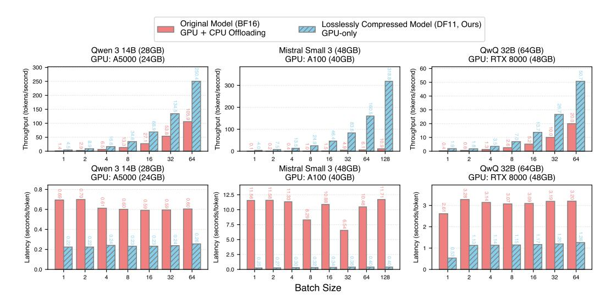
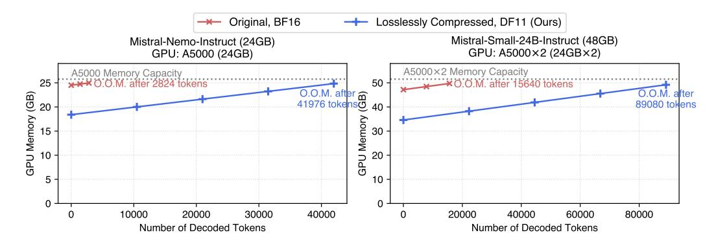
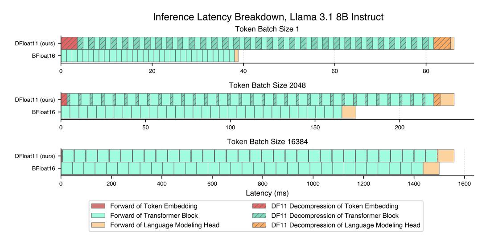
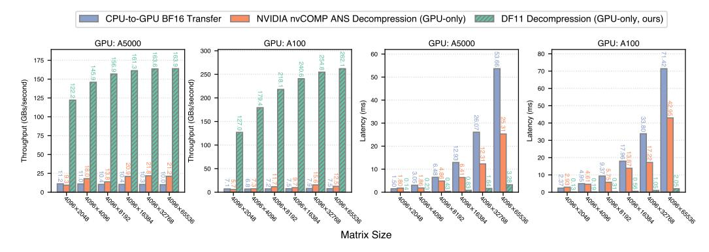

# 3 Experiments

We empirically evaluate the effectiveness of DF11 compression and its GPU inference efficiency. A range of recent LLMs and DMs are compressed from their original BFloat16 format into DF11, and we report the resulting compression ratios. We then compare the inference performance of DF11-compressed models against their uncompressed counterparts across different GPUs, followed by an ablation study to analyze the impact of compression.

Software and Hardware We implement the DF11 decompression kernel in CUDA and C++, and integrate it into the HuggingFace Transformers [\[48\]](#page-12-9) inference framework. We evaluate the inference efficiency of our DF11 models against the original BF16 counterparts. We use the HuggingFace Accelerate framework to support CPU offloading and multi-GPU inference. To assess the performance of the DF11 kernel across different hardware configurations, we run experiments on multiple machines with varying GPU and CPU setups. The hardware specifications for all experimental machines are provided in Table [4](#page-16-2) in the Appendix.

### 3.1 Results

DF11 compresses models to 70% size. Table [1](#page-6-0) presents the compression factors of DF11 for a wide selection of recent LLMs and DMs. Specifically, we apply compression to all weight matrices and token embeddings in LLMs and all weight matrices in the transformer blocks of DMs. The models we compress include Llama 3.1/3.3 [\[20\]](#page-11-0), Qwen 3 [\[54\]](#page-13-2), Mistral Nemo/Small [\[44,](#page-12-10) [45\]](#page-12-8), Phi 4 [\[1\]](#page-10-6), DeepSeek R1 Distilled [\[21\]](#page-11-1), Stable Diffusion 3.5 [\[2\]](#page-10-3), FLUX.1 [\[32\]](#page-11-6). DF11 achieves approximately 70% compression across all models, corresponding to an effective bit width of around 11 bits.

Accuracy and perplexity evaluations confirm DF11 compression is lossless. We verify the lossless property of DF11 compression through a series of accuracy and perplexity evaluations on standard benchmarks. Evaluations are conducted using lm\_evaluation\_harness [\[18\]](#page-11-8), reporting accuracy on MMLU [\[24\]](#page-11-9) and TruthfulQA [\[38\]](#page-12-11), and word-level perplexity on WikiText [\[41\]](#page-12-12) and C4 [\[42\]](#page-12-13). The results are shown in Table [2.](#page-6-1) As demonstrated, the compressed model achieves identical accuracy and perplexity to the original BF16 counterpart. We also present the text-to-image

Table 3: Comparison of peak GPU memory usage and text-to-image generation time for diffusion transformers in BF16 and DF11, using a single A5000 GPU.

|                                       | Peak GPU Memory (GB) |                | Generation Time (s)                |                                 |
|---------------------------------------|----------------------|----------------|------------------------------------|---------------------------------|
| Model                                 | BF16                 | DF11 (Ours)    | BF16                               | DF11 (Ours)                     |
| Stable Diffusion 3.5 Large FLUX.1 dev | 16.44 23.15       | 11.78 16.72 | $66.36 \pm 0.13 \\ 74.41 \pm 0.15$ | $69.08 \pm 0.11 78.53 \pm 0.18$ |

> **[图片提取文字 (无描述)]:**
> Original Model (BF16) GPU + CPU Offloading Losslessly Compressed Model (DF11, Ours) GPU-only Qwen 3 14B (28GB) Mistral Small 3 (48GB) QwQ 32B (64GB) GPU: A5000 (24GB) GPU: A100 (40GB) GPU: RTX 8000 (48GB) Throughput (tokens/second) Throughput (tokens/second) Throughput (tokens/second) 250 300 200 30 100 50 64 64 128 32 64 32 32 Qwen 3 14B (28GB) Mistral Small 3 (48GB) QwQ 32B (64GB) GPU: A5000 (24GB) GPU: RTX 8000 (48GB) GPU: A100 (40GB) 3.20 Latency (seconds/token) Latency (seconds/token) -atency (seconds/token) 0.80 7.5 5.0 2.5 0.0 8 16 32 64 2 16 32 64 128 2 8 16 32 64 Batch Size

Figure 4: Comparison of throughput (**top row**) and latency (**bottom row**) for token decoding using the original BF16 models and their DF11-compressed counterparts. Portions of the BF16 models are offloaded to the CPU due to GPU memory constraints.

generation results of BF16 and DF11 Stable Diffusion 3.5 Large model in Appendix J. Given the same random seed and text prompt, the image generated are pixel-wise identical with the original model.

**DF11 outperforms CPU offloading in inference efficiency.** We compare the inference performance of DF11 and BF16 models across various hardware platforms. Due to memory constraints, BF16 models exceed the capacity of a single GPU and require partial CPU offloading, while DF11 models fit entirely within GPU memory. For fair comparison, we retain most computation on the GPU for BF16 models and offload only necessary components. Latency and throughput are measured after a 100-token warm-up run, followed by decoding 100 tokens from an empty prompt across varying batch sizes. Each configuration is run five times, and we report the average results. As shown in Figure 4, DF11 consistently outperforms BF16 with CPU offloading, achieving 2.31–46.24× lower latency or higher throughput. Multi-GPU comparisons are shown in Figure 10 in the Appendix.

**DF11 reduces memory usage for diffusion transformers with minimal latency impact.** We assess the impact of DF11 compression on diffusion transformer models by measuring peak GPU memory usage and text-to-image generation latency for an  $1024 \times 1024$  image across five runs. Neither the BF16 nor DF11 models employ CPU offloading. As shown in Table 3, DF11 reduces memory consumption by 28.3% for Stable Diffusion 3.5 and 27.8% for FLUX.1. The relative increase in latency is small: 4.1% for Stable Diffusion and 5.5% for FLUX.1.

**DF11** memory savings enable longer generation lengths. DF11 compression not only can reduce the number of GPUs needed for inference but can also support longer generation under the same VRAM budget. During decoding, the KV cache grows linearly with the number of tokens and quickly becomes a memory bottleneck. Figure 5 shows GPU memory usage for DF11 and BF16 models with batch size 1 as token count increases. DF11 allows 5.70 to 14.86× more tokens to be decoded before reaching memory limits.

> **[图片提取文字 (无描述)]:**
> Original, BF16 Losslessly Compressed, DF11 (Ours) Mistral-Small-24B-Instruct (48GB) Mistral-Nemo-Instruct (24GB) GPU: A5000×2 (24GB×2) GPU: A5000 (24GB) A5000×2 Memory Capacity A5000 Memory Capacity
> 
> XXX O.O.M. after 2824 tokens 50 -O.M. after 15640 tokens O.O.M. after @ 40 41976 tokens 40 GPU Memory (GB) 89080 tokens Memory 40000 10000 20000 30000 20000 40000 60000 80000 Number of Decoded Tokens Number of Decoded Tokens

Figure 5: Comparison of GPU memory consumption between BF16 models and DF11 counterparts. The DF11 models support 5.70–14.86× longer context lengths by allowing more GPU memory to be used for storing the KV cache. "O.O.M." means out of memory.

> **[图片提取文字 (无描述)]:**
> Inference Latency Breakdown, Llama 3.1 8B Instruct Token Batch Size 1 DFloat11 (ours) BFloat16 40 20 60 80 Token Batch Size 2048 DFloat11 (ours) BFloat16 50 150 100 200 Token Batch Size 16384 DFloat11 (ours) -BFloat16 800 1200 200 400 600 1000 1400 1600 Latency (ms) Forward of Token Embedding DF11 Decompression of Token Embedding Forward of Transformer Block DF11 Decompression of Transformer Block Forward of Language Modeling Head DF11 Decompression of Language Modeling Head

Figure 6: Comparison of latency breakdown for DF11 and BF16 Llama 3.1 8B Instruct during GPU inference for different token batch sizes, using one A100-40GB GPU.

#### 3.2 Ablation Study

Latency breakdown shows decompression overhead is amortized at larger batch sizes. We analyze the latency of *Llama 3.1 8B Instruct* in BF16 and DF11 formats across varying token batch sizes on an A100-40GB GPU. For each setting, we measure the average latency of each component over 10 runs, as shown in Figure [6.](#page-8-1) DF11 introduces additional latency from decompressing the token embedding, transformer blocks, and language modeling head. This overhead is constant and independent of batch size, so increasing the token batch size effectively amortizes the cost.

DF11 decompression is significantly faster than CPU-to-GPU transfer and nvCOMP ANS. We compare DF11 decompression latency and throughput with two baselines: CPU-to-GPU weight transfer and ANS decompression [\[12\]](#page-10-4) from NVIDIA's nvCOMP [\[6\]](#page-10-7), using sliced weight matrices from the Llama 3.1 8B Instruct language modeling head. As shown in Figure [7,](#page-9-0) DF11 achieves up to 34.95× higher throughput than CPU transfer and up to 20.97× faster decompression than nvCOMP. DF11 also offers a better compression ratio (68%) compared to nvCOMP (79%). Moreover, DF11 decompression throughput improves with larger matrix sizes due to better GPU utilization.

> **[图片提取文字 (无描述)]:**
> CPU-to-GPU BF16 Transfer NVIDIA nvCOMP ANS Decompression (GPU-only) DF11 Decompression (GPU-only, ours) GPU: A100 GPU: A100 GPU: A5000 GPU: A5000 Throughput (GBs/second) Throughput (GBs/second) 125 (ms) Latency 50 25 Matrix Size

Figure 7: Throughput (**left two**) and latency (**right two**) comparisons between transferring BF16 matrices from CPU to GPU and decompressing the same matrices on GPU using the NVIDIA nvCOMP ANS library and our proposed DF11 kernel, across matrix sizes and GPU types.

#### 4 Related Works

**Data Formats for Model Weights** Full-precision model weights are typically stored in formats such as BF16, FP16, or FP32. Several works have proposed 4-bit compressed formats, including FP4, INT4, NF4 (NormalFloat) [9], AF4 (AbnormalFloat) [58], and SF4 (Student Float) [11], which represent each parameter with 4 bits. Unlike these lossy formats, the proposed DF11 format compresses weights losslessly.

Lossless Model Compression While lossy compression methods such as pruning [14] and quantization [37, 15] are well-studied, lossless compression remains less explored. Four prior works have addressed this area. *Deep Compression* [22] applied Huffman coding [28] to quantized CNNs, achieving 22% additional compression. *ZipNN* [25] extended this approach to language models with improved compression over classical methods. However, both techniques target storage efficiency and do not support inference-time gains. *NeuZip* [23] is the only prior work supporting GPU inference. It uses Asymmetric Numeral Systems (ANS) with layer-wise decompression and relies on NVIDIA's nvCOMP for GPU-based operations. nvCOMP is no longer open source, and its binary-only distribution limits adoption. Moreover, as shown in Figure 7, nvCOMP ANS incurs higher latency and lower throughput compared to our DFloat11 kernel. *Huff-LLM* [59] is designed for FPGA-like hardware and is not applicable to GPUs. Additional discussion of related formats is presented in Appendix B.

### 5 Conclusion

We introduce *Dynamic-Length Float* (DFloat11), a lossless compression framework designed for efficient GPU inference of BFloat16 models, including both large language models (LLMs) and diffusion models (DMs). DFloat11 exploits the information redundancy inherent in foundation model weights through entropy-coded, dynamic-length encoding, achieving compression rates close to the information-theoretic limit. To enable efficient deployment, we develop hardware-aware algorithms that support high-speed inference directly on compressed weights. Extensive experiments demonstrate that DFloat11 significantly reduces GPU memory requirements for LLMs and DMs, allowing for longer generation lengths, while maintaining bit-exact accuracy and incurring only negligible decompression overhead.

#### Acknowledgements

This work was supported by National Science Foundation SHF-2211815 and Ken Kennedy Institute Cluster Grants. Additionally, Henry and Xia are supported by ITE-2429680, IIS-2310260, and US Department of Transportation (USDOT) Tier-1 University Transportation Center (UTC) Transportation Cybersecurity Center for Advanced Research and Education (CYBER-CARE) grant #69A3552348332. Mohsen and Vipin are supported by OAC-2320952, OAC-2112606, and OAC-2117439. The views and conclusions in this paper are those of the authors and do not represent the views of any funding or supporting agencies.

