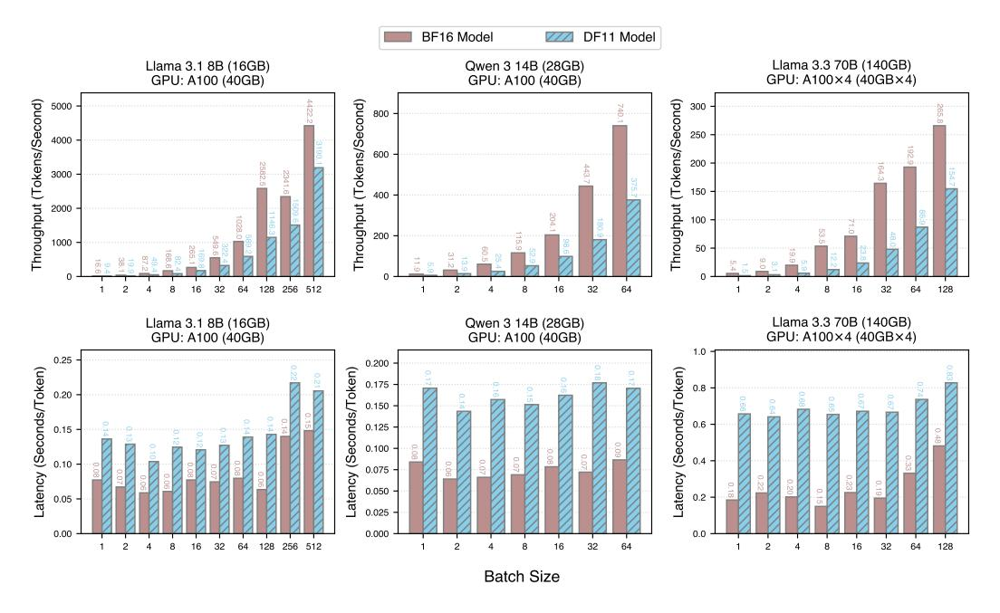
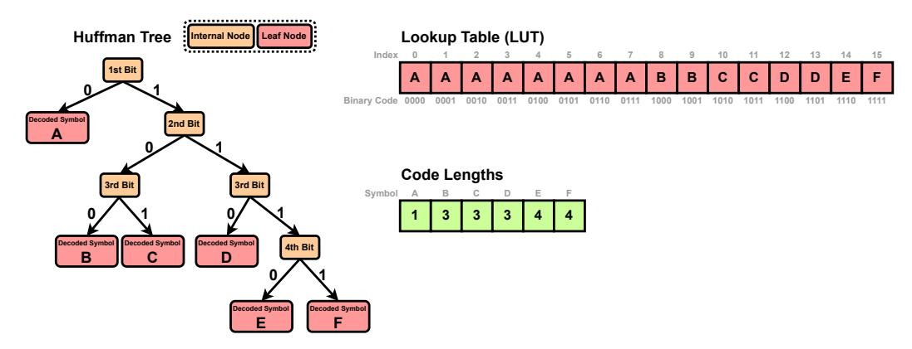

# D Pseudo-code of the GPU kernel for DFloat11 Decompression

Algorithm 1 presents the pseudo-code of the two-phase GPU kernel for decompressing DFloat11 to BFloat16.

Table 4: System specifications of servers used for experiments.

<span id="page-16-2"></span>

| GPU                               | GPU Memory | CPU                   | CPU Memory |
|-----------------------------------|------------|-----------------------|------------|
| Server 1   NVIDIA RTX A5000       | 24564MiB   | AMD EPYC 7513 32-Core | 504GB      |
| Server 2   NVIDIA A100            | 40960MiB   | AMD EPYC 7742 64-Core | 1.48TB     |
| Server 3   NVIDIA Quadro RTX 8000 | 49152MiB   | AMD EPYC 7742 64-Core | 1.48TB     |

### <span id="page-17-0"></span>Algorithm 1 GPU kernel for decompressing DFloat11 to BFloat16

```
1: procedure DF11ToBF16
    require:

    EncodedExponent, PackedSignMantissa: byte arrays

       - LUT<sub>1</sub>,...,LUT<sub>k</sub>, CodeLengths: 8-bit unsigned integer arrays of size 256
       - Gaps: 5-bit unsigned integer array (one entry per thread in each block)
       - BlockOutputPos: 32-bit unsigned integer array (one entry per block)
       - Outputs: BFloat16 array, for storing results
       -B, T, n, k: the number of thread blocks, number of threads, number of bytes processed by each thread,
          number of compact LUTs, respectively
        Divide EncodedExponent into chunks:
 2:
            \mathsf{EncodedExponent}_1, \ldots, \mathsf{EncodedExponent}_B \text{ of size } nT \text{ bytes each}
        for all b \leftarrow 1, \dots, B (in parallel across blocks) do
 4.
            Load EncodedExponent, into SRAM
 5:
            Divide EncodedExponent, into chunks:
            \mathsf{EncodedExponent}_{b,1}, \ldots, \mathsf{EncodedExponent}_{b,T} \text{ of size } n \text{ bytes each Load LUT}_1, \ldots, \mathsf{LUT}_k, \mathsf{CodeLengths into SRAM}
 6:
 7:
            Initialize integer arrays NumElements[1...T], ThreadOutputPos[1...T] with all 0s
 8:
            Initialize BFloat16 write buffer WriteBuffer in SRAM
            for all t \leftarrow 1, \dots, T (in parallel across threads) do
9:
    ⊳ Phase 1: Each thread determines its initial output position
10:
                 BitOffset \leftarrow \mathsf{Gaps}[bT + t]
11.
                 while BitOffset < 8n do
12:
                     Read the next 4 bytes of EncodedExponent, starting from the BitOffset-th bit, into
    \mathrm{Byte}_{1...4}
13:
                     i \leftarrow 1
14:
                     Exponent \leftarrow LUT_1[Byte_i]
15:
                     while Exponent \geq 240 \text{ do}
                        \triangleright Exponent \ge 240 means that it is a pointer to the next LUT
16:
                         i \leftarrow i+1
                         Exponent \leftarrow LUT_{(257-Exponent)}[Byte_i]
17:
18:
                     end while
                     BitOffset \leftarrow BitOffset + CodeLengths[Exponent]
19.
20:
                     NumElements[t] \leftarrow NumElements[t] + 1
21:
                 end while
22:
                 Thread Synchronization Barrier
                ▷ Compute prefix-sum using Blelloch's Algorithm:
                 \mathsf{ThreadOutputPos}[t] \leftarrow \mathsf{BlockOutputPos}[b] + \sum_{i=1}^{t-1} \mathsf{NumElements}[i]
    ⊳ Phase 2: Writing decoded BFloat16s to the appropriate positions
24:
                 BitOffset \leftarrow \mathsf{Gaps}[bT + t]
25:
                 while BitOffset < 8n do
26:
                     Read the next 4 bytes of EncodedExponent_{b,t}, starting from the BitOffset-th bit, into
    \mathsf{Byte}_{1...4}
27:
28:
                     Exponent \leftarrow LUT_1[Byte_i]
                     while Exponent \geq 240 \text{ do}
29:
                         \triangleright Exponent \ge 240 means that it is a pointer to the next LUT
30.
                         i \leftarrow i + 1
31:
                         Exponent \leftarrow LUT_{(257-Exponent)}[Byte_i]
32:
                     end while
33:
                     Byte \leftarrow PackedSignMantissa [ThreadOutputPos[t]]
34:
                     Sign \leftarrow Byte bitwise\_and 0b10000000
35:
                     Mantissa \leftarrow Byte bitwise\_and 0b01111111
                     WriteBuffer[ThreadOutputPos[t] - BlockOutputPos[b]] \leftarrow
36:
                        (Sign bitwise_left_shift 8) bitwise_or
                         (Exponent bitwise_left_shift 7) bitwise_or Mantissa
37.
                     BitOffset \leftarrow BitOffset + CodeLengths[Exponent]
                     ThreadOutputPos[t] \leftarrow ThreadOutputPos[t] + 1
38:
39:
                 end while
40.
            end for
             ▶ Perform coalesced writes to HBM:
41:
             Outputs[BlockOutputPos[b]...(BlockOutputPos[b+1]-1)] \leftarrow
                 WriteBuffer[0...(BlockOutputPos[b+1] - BlockOutputPos[b] - 1)]
42:
        end for
43: end procedure
```

### E Hardware for Experiments

Table 4 presents the hardware configuration of servers used for experiments.

### <span id="page-18-2"></span>F DFloat11 Compression Time

Table 5: Compression time per transformer block for different models.

| Model                   | Compression Time per Transformer Block (s) |
|-------------------------|--------------------------------------------|
| Llama 3.1 8B Instruct   | 191                                        |
| Llama 3.3 70B Instruct  | 547                                        |
| Llama 3.1 405B Instruct | 2133                                       |

Table 5 reports the time required to compress a single transformer block for models of different sizes. Compression is a one-time preprocessing step for each model and is performed using a single CPU thread. Since transformer blocks are independent in terms of weight storage, their compression can be parallelized across multiple CPU threads, making the overall process highly scalable and efficient.

<span id="page-18-0"></span>> **[图片提取文字 (无描述)]:**
> DF11 Model BF16 Model Llama 3.3 70B (140GB) Llama 3.1 8B (16GB) Qwen 3 14B (28GB) GPU: A100 (40GB) GPU: A100×4 (40GB×4) GPU: A100 (40GB) Throughput (Tokens/Second) Throughput (Tokens/Second) Throughput (Tokens/Second) 5000 300 800 250 4000 600 200 3000 150 400 2000 100 200 50 16 32 64 128 256 512 16 32 64 16 32 64 128 Llama 3.3 70B (140GB) Llama 3.1 8B (16GB) Qwen 3 14B (28GB) GPU: A100×4 (40GB×4) GPU: A100 (40GB) GPU: A100 (40GB) 1.0 0.25 0.200 Latency (Seconds/Token) Latency (Seconds/Token) Latency (Seconds/Token) 0.175 0.8 0.150 0.6 0.125 0.100 0.4 0.075 0.050 0.2 0.025 0.00 0.000 0.0 128 256 512 32 64 8 16 32 64 2 16 2 16 32 64 128 Batch Size


Figure 10: Comparison of average latency and throughput for token decoding between the original (BF16) models and their losslessly compressed (DF11) counterparts. The BF16 and DF11 models are run on the same GPU configurations, with Flash Attention [7] turned on for both methods.

### G GPU Inference Efficiency Comparison: BF16 vs. DF11

We present the GPU inference efficiency of BF16 and DF11 models in Figure 10, for various models and batch sizes on A100 GPUs.

### <span id="page-18-1"></span>**H** Impact of Lossy Quantization

An accuracy comparison of the original and INT8-quantized Llama model is presented in table 6.

<span id="page-19-1"></span>Table 6: INT8 quantization error on different tasks. "Math" denotes MATH Hard with 2 shots. "GPQA CoT" is with 2 shots. "∆" denotes the error gap via INT8 quantization.

| Model                 | Data Type | Math  | GPQA CoT |
|-----------------------|-----------|-------|----------|
|                       | BF16      | 23.92 | 15.18    |
| Llama-3.1-8B-Instruct | INT8      | 19.92 | 14.06    |
|                       | ∆         | 4.0   | 1.12     |

<span id="page-19-2"></span>> **[图片提取文字 (无描述)]:**
> A-----**Huffman Tree** Lookup Table (LUT) Internal Node | Leaf Node Index 14 1st Bit в Binary Code 0000 1001 Decoded Symbol 2nd Bit Code Lengths 3rd Bit 3rd Bit Symbol Decoded Symbol Decoded Symbol **Decoded Symbol** 4th Bit В Decoded Symbol **Decoded Symbol**


Figure 11: Decoding Huffman codes can be performed either by traversing the Huffman tree or by using two lookup tables: one that maps each L-bit binary code to its corresponding symbol, and another that stores the code length for each symbol.

