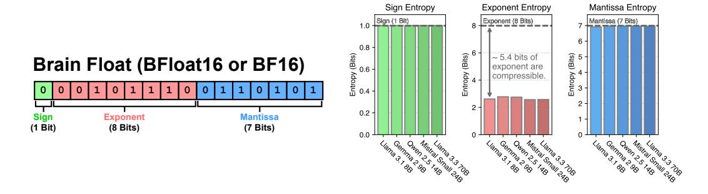
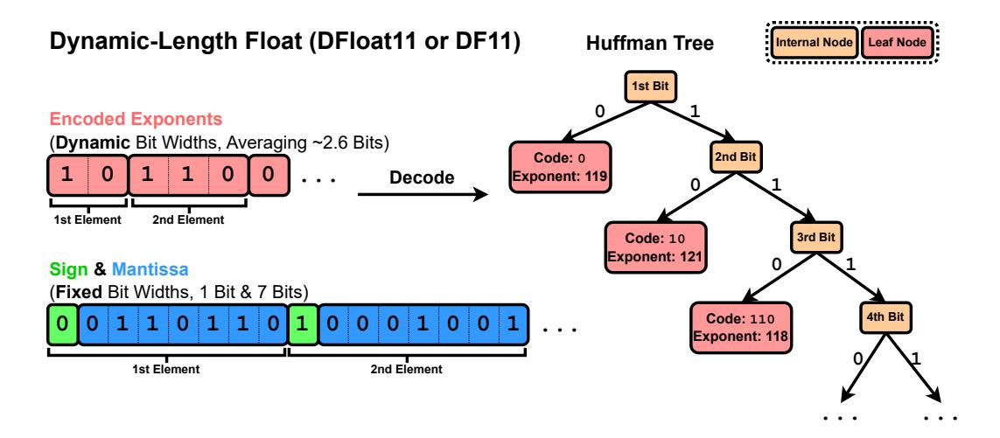
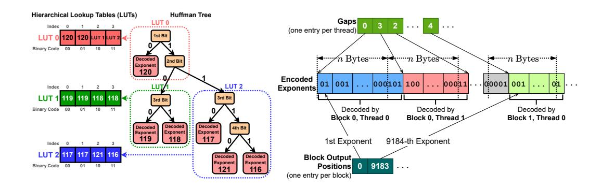

# 70% Size, 100% Accuracy: Lossless LLM Compression for Efficient GPU Inference via Dynamic-Length Float (DFloat11)

 $\begin{array}{c} \textbf{Tianyi Zhang}^1, \textbf{Mohsen Hariri}^2, \textbf{Shaochen (Henry) Zhong}^1, \textbf{Vipin Chaudhary}^2, \textbf{Yang Sui}^1, \textbf{Xia Hu}^1, \textbf{and Anshumali Shrivastava}^{1,3} \end{array}$ 

1Department of Computer Science, Rice University 2Department of Computer and Data Sciences, Case Western Reserve University 3Ken Kennedy Institute

{tz21, henry.zhong, yang.sui, xia.hu, anshumali}@rice.edu, {mohsen.hariri, 

> Code: https://github.com/LeanModels/DFloat11 Models: https://huggingface.co/DFloat11

#### Abstract

Large-scale AI models, such as Large Language Models (LLMs) and Diffusion Models (DMs), have grown rapidly in size, creating significant challenges for efficient deployment on resource-constrained hardware. In this paper, we introduce Dynamic-Length Float (DFloat11), a lossless compression framework that reduces LLM and DM size by 30% while preserving outputs that are bit-for-bit identical to the original model. DFloat11 is motivated by the low entropy in the BFloat16 weight representation of LLMs, which reveals significant inefficiency in the existing storage format. By applying entropy coding, DFloat11 assigns dynamic-length encodings to weights based on frequency, achieving near information-optimal compression without any loss of precision. To facilitate efficient inference with dynamic-length encodings, we develop a custom GPU kernel for fast online decompression. Our design incorporates the following: (i) compact, hierarchical lookup tables (LUTs) that fit within GPU SRAM for efficient decoding, (ii) a two-phase GPU kernel for coordinating thread read/write positions using lightweight auxiliary variables, and (iii) transformer-block-level decompression to minimize latency. Experiments on Llama 3.3, Qwen 3, Mistral 3, FLUX.1, and others validate our hypothesis that DFloat11 achieves around 30% model size reduction while preserving bit-for-bit identical outputs. Compared to a potential alternative of offloading parts of an uncompressed model to the CPU to meet memory constraints, DFloat11 achieves 2.3–46.2× higher throughput in token generation. With a fixed GPU memory budget, DFloat11 enables 5.7–14.9× longer generation lengths than uncompressed models. Notably, our method enables lossless inference of *Llama 3.1* 405B, an 810GB model, on a single node equipped with  $8\times80$ GB GPUs.

### 1 Introduction

Foundation models, such as Large Language Models (LLMs) and Diffusion Models (DMs), have demonstrated remarkable capabilities across a wide range of Natural Language Processing (NLP) [56] and Computer Vision (CV) tasks [57]. However, their huge model sizes create substantial obstacles

for efficient deployment, especially in memory-constrained environments. For example, a competitive recent LLM, *Llama 3.1 405B* [\[20\]](#page-11-0), has 405 billion parameters in 16-bit Brain Float (BFloat16) format and requires about 810 GB of memory for full inference, exceeding the capacity of a typical high-end GPU server (e.g., DGX A100/H100 with 8×80GB GPUs). As a result, deploying this model requires multiple nodes, making it expensive and inaccessible. In this work, we present a solution that compresses any BFloat16 model to approximately 70% of its original size while preserving 100% of its accuracy on any task.

Model compression via quantization has limitations. Quantization is a type of *lossy* compression method that lowers the precision of model weights by converting them into lower bit-width representations [\[15,](#page-10-0) [37,](#page-12-0) [36,](#page-12-1) [43\]](#page-12-2). Although it can significantly reduce memory usage and often improve inference speed, quantization is not a one-size-fits-all solution and presents several key limitations: ➊ *Accuracy degradation*. By design, quantization introduces approximation errors. The degree of accuracy loss depends on multiple factors, including the base model, quantization method, evaluation benchmark, and target bit-width [\[35\]](#page-12-3). These interactions make it difficult to predict or quantify the impact comprehensively. Even mild quantization can noticeably degrade performance. For example, applying 8-bit SmoothQuant [\[51\]](#page-12-4) to *DeepSeek-R1-Distill-Qwen-1.5B* [\[21\]](#page-11-1) results in a 9.09% drop in average accuracy across reasoning tasks [\[39\]](#page-12-5). ➋ *Behavioral shifts.* Even when overall accuracy metrics appear roughly unchanged, quantized models may behave differently from their full-precision counterparts. For instance, Dutta et al. [\[13\]](#page-10-1) observe a phenomenon called *flips*, where quantized models produce answers that change from correct to incorrect and vice versa. This indicates that quantization can significantly alter model behavior, even when standard accuracy metrics show minimal change. For example, the W8A16 GPTQ-quantized Qwen2-1.5B[\[15,](#page-10-0) [54\]](#page-13-2) exhibits only a 0.3% drop in GSM8K (8-shot) accuracy [\[5\]](#page-10-2), yet 6.37% of its answers flip in correctness [\[13\]](#page-10-1). ➌ *Compliance and reliability concerns.* In domains like finance or healthcare, quantized models may not satisfy regulatory or reliability standards, as their outputs may differ from those of the original models [\[31\]](#page-11-2). We refer readers to Appendix [A](#page-14-0) for a more detailed discussion on quantization.

Existing lossless model compression does not support efficient GPU inference. Unlike lossy compression, *lossless compression* reduces model size while preserving the full precision of the original weights. This ensures the model's output distribution remains identical to that of the uncompressed counterpart. However, most existing lossless methods focus on storage efficiency, such as compressing model checkpoints [\[22,](#page-11-3) [25\]](#page-11-4), or target specialized hardware like FPGAs [\[59\]](#page-13-3), rather than accelerating inference on general-purpose GPUs. While useful for tasks like checkpoint rollback during large-scale training [\[47\]](#page-12-6) or reducing download time from model hubs [\[25\]](#page-11-4), these methods offer little to no benefit for GPU-based inference.

Our proposal, Dynamic-Length Float (DFloat11), is a lossless compression framework optimized for efficient GPU inference. We identify a key inefficiency in the commonly used BFloat16 format: its 8-bit exponent field carries only about 2.6 bits of actual information. This redundancy is consistent across a wide range of LLMs, as shown in Section [2.2.](#page-3-0) To exploit it, we apply Huffman coding [\[28\]](#page-11-5) to the exponent bits of BFloat16 weights, while leaving the sign and mantissa bits uncompressed. The resulting exponents have dynamic-length encodings: frequent values are assigned shorter codes, while rarer ones use longer codes. However, standard Huffman decoding relies on sequential bit-by-bit tree traversal, which is inefficient on GPUs due to limited parallelism. Assigning one GPU thread per decompression task leads to severe hardware underutilization and high latency. To overcome this, we design a hardware-aware algorithm that enables efficient online decompression of dynamic-length floats on GPUs. Our solution includes three key components: 1. compact, hierarchical lookup tables (LUTs) that fit in GPU SRAM to support fast, table-based Huffman decoding, 2. a two-phase GPU kernel that uses lightweight auxiliary variables to coordinate thread-level read and write operations, and 3. batched decompression at the transformer-block level to maximize throughput. We summarize our contributions as follows:

- 1. We propose Dynamic-Length Float (DFloat11), a losslessly compressed floating-point format that reduces BFloat16 weights to approximately 11 bits. This yields around 30% model size reduction with bit-for-bit identical outputs.
- 2. We develop optimized, hardware-aware algorithms for efficient GPU inference with DFloat11 compressed models by leveraging GPU memory and compute hierarchies.

> **[图片提取文字 (无描述)]:**
> Sign Entropy Exponent Entropy Mantissa Entropy Exponent (8 Bits) Sign (1 Bit) Mantissa (7 Bits) (Bits) (Bits) ~ 5.4 bits of Entropy (Bits) **Brain Float (BFloat16 or BF16)** exponent are Entropy ( compressible. 0.2 Exponent Sign Mantissa (1 Bit) (8 Bits) (7 Bits)

Figure 1: (**Left**) The allocation of bits for the components of BFloat16. (**Right 3**) The Shannon entropy of the components (sign, exponent, mantissa) of BFloat16 weights in various LLMs.

3. We evaluate DFloat11 across popular LLMs and diffusion transformers, including Llama 3, Qwen 3, Mistral 3, DeepSeek R1 Distilled, FLUX.1, and Stable Diffusion 3.5 [20, 46, 45, 21, 32, 2]. Our method consistently achieves 30% compression without altering original outputs at all. Notably, it enables running *Llama-3.1-405B on a single node* (8×80GB A100 GPUs), reducing hardware requirements by half without accuracy loss.

#### 2 Method

In this section, we introduce our proposed floating-point format, Dynamic-Length Float (DFloat11), along with its custom decompression kernel designed for efficient GPU inference.

#### 2.1 Preliminary

**Brain Float (BFloat16)** Recent state-of-the-art LLMs predominantly employ the 16-bit Brain Float format (BFloat16 or BF16) for storing weights, due to its balance of numerical precision with memory efficiency. BF16 allocates its 16 bits as follows: 1 *sign* bit, 8 *exponent* bits, and 7 *mantissa* bits. The numerical value represented by a BF16 number is computed as:

$$(-1)^{\text{sign}} \times 2^{\text{exponent}-127} \times (1.\text{mantissa}),$$
 (1)

where mantissa is interpreted as a binary fractional value.

Entropy Coding Entropy coding is a core technique in lossless data compression that leverages statistical redundancy to reduce data size. Several widely used methods fall under this category, including Huffman coding [28], arithmetic coding [33], and Asymmetric Numeral Systems (ANS) [12]. Among these, Huffman coding is one of the most widely adopted, which uses variable-length encoding to minimize the size of encoded data. It assigns shorter binary codes to more frequent symbols and longer codes to less frequent ones. The codes are decoded using a prefix-free binary tree, known as a Huffman tree. Due to the prefix-free property of Huffman codes, no code is a prefix of any other, which ensures unique decodability of the encoded bitstream without the need for delimiters. The tree is constructed based on symbol frequencies and is provably optimal for any given frequency distribution. However, decoding Huffman codes in a massively parallel manner is challenging due to its inherently sequential nature.

**GPU Computation and Memory Paradigm** GPUs are designed to perform computations in a massively parallel manner. A modern GPU consists of thousands of threads, which are organized into blocks and executed on streaming multiprocessors (SMs). Each block has access to a small, fast, on-chip memory called shared memory (often referred to as SRAM), which provides much lower latency and higher bandwidth than the off-chip global memory, commonly known as high-bandwidth memory (HBM). The capacity of shared memory is limited, typically having up to 100 KB per block. In this work, we leverage the fast access characteristics of SRAM to enable efficient on-the-fly decompression of compressed weights during inference.

> **[图片提取文字 (无描述)]:**
> Dynamic-Length Float (DFloat11 or DF11) **Huffman Tree** Internal Node Leaf Node 1st Bit **Encoded Exponents** (Dynamic Bit Widths, Averaging ~2.6 Bits) 2nd Bit Code: 0 Exponent: 119 Decode 1st Element 2nd Element 3rd Bit Code: 10 Exponent: 121 Sign & Mantissa (Fixed Bit Widths, 1 Bit & 7 Bits) 4th Bit Code: 110 Exponent: 118 2nd Element 1st Element

Figure 2: Our proposed format *Dynamic-Length Float* for compressing BFloat16 weights of LLMs losslessly down to 11 bits. The exponents are compressed via Huffman coding, while the sign and mantissa bits remain uncompressed.

#### 2.2 Motivation: BFloat16 Representation is Information Inefficient

To motivate the lossless compression of LLM weights, we analyze the compressibility of the BFloat16 weights of recent LLMs. Specifically, we use Shannon entropy to quantify the information content of BFloat16 components (sign, exponent, and mantissa) for all linear projection matrices of an LLM. The Shannon entropy  $H(\cdot)$  is defined as:

$$H(X) = -\sum_{x \in \mathcal{X}} p(x) \log_2 p(x)$$
 (2)

where X is a discrete random variable with support  $\mathcal{X}$ , and  $p:\mathcal{X}\to[0,1]$  denotes its probability mass function. We present the computed entropy values in Figure 1. As shown, the entropy of the sign and mantissa bits is close to their respective bit widths, indicating limited potential for compression. In contrast, the exponent exhibits significantly lower entropy, approximately 2.6 bits versus its allocated 8 bits, suggesting substantial opportunities for lossless compression.

To understand this discrepancy, we visualize the frequency distribution of all BFloat16 components in Figure 8 and the ranked frequency of exponent values in Figure 9, both in the Appendix. The sign and mantissa values are relatively uniform across their ranges, but the exponent distribution is highly imbalanced: only about 40 of the 256 possible 8-bit values are used, with the rest never appearing. Ranked frequencies also decay rapidly. These observations reveal the low entropy of the exponent and its potential for compression.

#### 2.3 Dynamic-Length Float: Lossless LLM Compression for Efficient GPU Inference

To address the substantial information inefficiency in the BFloat16 representation of LLM weights, we propose a lossless compression framework that encodes floating-point parameters using entropy coding. Specifically, we build a Huffman tree based on the distribution of exponents in model weights. We then compress the exponents using Huffman coding, while preserving the original signs and mantissas. Exponents are encoded and tightly bit-packed into a byte array, EncodedExponent, while the sign and mantissa are left uncompressed and stored in a separate byte array PackedSignMantissa. Figure 2 illustrates Dynamic-Length Float (DFloat11 or DF11), our proposed format for compactly representing BFloat16 model parameters.

The Core Challenge: Efficient GPU Inference with Compressed Weights While DFloat11 enables lossless compression of LLM weights, efficient GPU inference remains a key challenge. Entropy-coded weights use variable-length encoding and cannot be directly used in matrix multiplications. As a result, each weight matrix must be decompressed on-the-fly to its original BFloat16 format

> **[图片提取文字 (无描述)]:**
> Hierarchical Lookup Tables (LUTs) **Huffman Tree** Gaps LUT 0 Index (one entry per thread) 1st Bit Binary Code 00 **'**→……n Bytes……→ n Bytes n Bytes h Decoded 2nd Bit Exponent 120 Encoded 001 ... 00011 ... 00001 001 ... 000101 100 LUT/1 LUT 2 Index Exponents LUT 1 119 119 118 118 <4 3rd Bit Decoded by Decoded by Binary Code 00 Decoded by Block 0, Thread 0 Block 0, Thread 1 Block 1, Thread 0 Decoded Decoded Decoded 4th Bit Exponent Exponent Exponent 1st Exponent 9184-th Exponent Index 117 121 116 <-----Decoded Decoded **Block Output**, Exponent Exponent Positions 0 9183 Binary Code 00 01 10 11 . . . (one entry per block)

Figure 3: (**Left**) The Huffman tree is decomposed into a set of non-overlapping subtrees, each corresponding to a compact lookup table (LUT). These hierarchical LUTs reside in GPU SRAM to enable efficient Huffman decoding via array lookups. (**Right**) Each thread decodes n bytes of encoded exponents. The array *Gaps* stores the bit offset of the first element assigned to each thread, while the array *Block Output Positions* stores the index of the first element for each thread block.

before matrix multiplication, then discarded immediately after use to conserve memory. However, traditional Huffman decoding is inherently sequential, requiring bit-by-bit tree traversal for each element, which is ill-suited for GPUs' parallel architecture. Naively assigning a single thread for decompression leads to poor utilization and high latency. Addressing this bottleneck is essential for practical compressed inference.

In the following paragraphs, we present our solution in detail: a set of hardware-aware algorithmic designs tailored for low-latency decoding of entropy-coded weights in a massively parallel manner. Our approach consists of three key components: ① leveraging compact lookup tables that fit within GPU SRAM for efficient, lookup-based decoding, ② introducing a two-phase kernel design to coordinate read/write operations for all threads using lightweight auxiliary variables, and ③ performing decompression at the transformer block level to minimize latency.

### 2.3.1 Efficient Decoding with Hierarchical Lookup Tables

The traditional approach to decoding Huffman codes involves reading the encoded bitstream bit by bit and traversing the Huffman tree accordingly. However, this method is inefficient on GPUs due to frequent branching and limited parallelism. To enable efficient decoding on GPUs, we adopt a lookup-table-based approach [53].

Assume the maximum Huffman code length is L, and we construct a lookup table LUT of size  $2^L$ . At each index i, LUT stores the decoded exponent whose Huffman code matches the prefix of the binary representation of i. To decode the next exponent, we read the next L bits from the encoded bitstream, interpret them as an index into LUT, and retrieve the corresponding value. To determine how many bits to advance in the stream, we use a secondary lookup table CodeLengths, which maps each exponent to the length of its Huffman code. A detailed example of this decoding process is provided in Section I of the Appendix.

In practice, the value of L can be large. For LLMs, L typically ranges from 24 to 32, resulting in a LUT with up to  $2^{32}$  entries, which cannot fit within GPU SRAM for fast lookups. To address this, we decompose the monolithic LUT into a hierarchy of compact lookup tables [53]. We first partition the Huffman tree into non-overlapping subtrees of height 8. Each subtree corresponds to a compact LUT that decodes 8 bits, requiring only  $2^8 = 256$  entries.

Figure 3 shows an example of how a Huffman tree of height 4 can be decomposed into a hierarchy of compact LUTs, each with 4 entries. Because the LUTs are organized hierarchically, some entries must serve as references to other LUTs lower in the hierarchy. We take advantage of the sparsity in 8-bit exponent usage: although 256 values are available, typically only around 40 are used in LLMs (see Figure 9 in the Appendix). We repurpose unused values (specifically, the range 240 to 255) as pointers to other LUTs. These values correspond to extremely large magnitudes ( $\pm 2^{113}$  to  $\pm 2^{128}$ ) that do not occur in LLM weights, making them safe for use as internal markers.

We use k to denote the number of compact LUTs. In our experiments, we observe that k ranges from 4 to 8 for the Huffman trees built from BFloat16 exponent values. Combined with CodeLengths, these LUTs occupy at most (8 + 1) × 256 bytes of memory, which easily fits within SRAM and allows for fast repeated lookups.

### 2.3.2 Two-Phase Kernel and Lightweight Auxiliary Variables

To leverage the parallel processing capabilities of GPUs, we assign each thread to a contiguous, non-overlapping block of encoded exponents consisting of n bytes (n = 8 in our experiments). Each thread decodes elements whose Huffman codes begin within its assigned block. Since Huffman codes are variable-length, a thread may need to skip some bits at the start before decoding the first element. Similarly, the last element may span beyond the assigned byte range.

This approach introduces two key challenges: 1. The starting bit position for each thread is unclear due to the variable-length nature of Huffman codes. 2. Except for the first thread, the index of decoded elements is unknown, making it difficult to determine their correct output locations.

To address the first issue, we use a gap array [\[53\]](#page-13-4) to specify the starting bit offset for each thread. The array Gaps has one entry per thread, where each entry indicates the offset of the first valid Huffman code relative to the thread's assigned starting byte. With a maximum code length of 32 bits, each offset lies in [0, 31] and is stored using only 5 bits.

For the second issue, maintaining an output position for each thread is straightforward but memoryintensive. Each position requires a 32-bit integer, and with tens of thousands of threads per weight matrix, this leads to significant overhead, undermining DFloat11's compression benefits. To reduce this overhead, we store the output position only for the first element of each thread block rather than for every thread. Since each block typically contains hundreds to thousands of threads, this optimization reduces the overhead from one 32-bit integer per thread to one per block, making the memory cost negligible. Figure [3](#page-4-0) illustrates how the *gap* and *block-level output position* arrays encode the metadata associated with the encoded exponents.

To support this design, we implement a *two-phase* kernel. In the first phase, each thread decodes its assigned block and counts the number of elements, without writing to the HBM. Afterward, threads within a block synchronize to compute per-thread output positions via a prefix sum over the element counts. We use the Blelloch algorithm [\[4\]](#page-10-5) for this step. In the second phase, each thread re-decodes the same block, this time writing decoded values to a write buffer in SRAM at the calculated positions. To avoid redundant global memory access, the encoded exponents are loaded into SRAM before the first pass. Once all decoded exponents are written to SRAM, a single batch of coalesced writes is issued to HBM. Pseudocode for the two-phase kernel is provided in Algorithm [1](#page-17-0) of the Appendix.

### 2.3.3 Transformer-Block-Level Decompression

We now have a complete recipe for decompressing entropy-coded exponents in a massively parallel manner. During inference, the LLM weights stored in DFloat11 format, along with auxiliary variables (the thread-level gap array and block-level output position array), reside entirely in GPU memory. When a weight matrix is needed for matrix multiplication, it is decompressed on-the-fly into the original BFloat16 format. Once the matrix multiplication is complete, the BFloat16 matrix is immediately discarded to conserve GPU memory.

In practice, decompressing a single weight matrix often underutilizes GPU resources due to its relatively small size. As the matrix size increases, decompression throughput improves. Figure [7](#page-9-0) illustrates this trend, showing how DFloat11 decompression scales with matrix size. To capitalize on this, we propose batching the decompression of multiple matrices together to improve throughput and hide latency. Specifically, we decompress all DFloat11 weight matrices within a transformer block as a single batch. This batched decompression occurs right before the forward pass of the transformer block. We also compress the token embedding and language modeling head of LLMs. Since these matrices are large enough to saturate GPU resources, batching their decompression is unnecessary.

Table 1: DF11 statistics for various models. Model sizes are shown before and after compression.

| Model                        | Original → DF11 Compressed | Compression Ratio | Avg. Bit Width |  |  |
|------------------------------|----------------------------|-------------------|----------------|--|--|
| Large Language Models        |                            |                   |                |  |  |
| Llama 3.1 8B Instruct        | 16.06 GB → 10.90 GB        | 67.84%            | 10.85          |  |  |
| Llama 3.3 70B Instruct       | 141.11 GB → 95.40 GB       | 67.61%            | 10.82          |  |  |
| Llama 3.1 405B Instruct      | 811.71 GB → 551.22 GB      | 67.91%            | 10.87          |  |  |
| Qwen 3 14B                   | 29.54 GB → 20.14 GB        | 68.17%            | 10.91          |  |  |
| QwQ 32B                      | 65.53 GB → 44.65 GB        | 68.14%            | 10.90          |  |  |
| Mistral Nemo Instruct        | 24.50 GB → 16.59 GB        | 67.74%            | 10.84          |  |  |
| Mistral Small 3              | 47.14 GB → 31.86 GB        | 67.58%            | 10.81          |  |  |
| Phi 4 Reasoning Plus         | 29.32 GB → 19.83 GB        | 67.64%            | 10.82          |  |  |
| DeepSeek R1 Distill Llama 8B | 16.06 GB → 10.89 GB        | 67.81%            | 10.85          |  |  |
| Diffusion Transformers       |                            |                   |                |  |  |
| FLUX.1 dev                   | 23.80 GB → 16.33 GB        | 68.61%            | 10.98          |  |  |
| FLUX.1 schnell               | 23.78 GB → 16.31 GB        | 68.58%            | 10.97          |  |  |
| Stable Diffusion 3.5 Large   | 16.29 GB → 11.33 GB        | 69.52%            | 11.12          |  |  |

Table 2: Comparison of accuracy and perplexity for the BF16 and DF11 models on different benchmarks. DF11 compression results in absolutely no loss in accuracy or perplexity.

|                       |                     | Accuracy                         |                                  | Perplexity     |                  |
|-----------------------|---------------------|----------------------------------|----------------------------------|----------------|------------------|
| Model                 | Data Type           | MMLU                             | TruthfulQA                       | WikiText       | C4               |
| Llama 3.1 8B Instruct | BF16 DF11 (Ours) | 68.010 ± 0.375 68.010 ± 0.375 | 36.965 ± 1.690 36.965 ± 1.690 | 8.649 8.649 | 21.677 21.677 |

