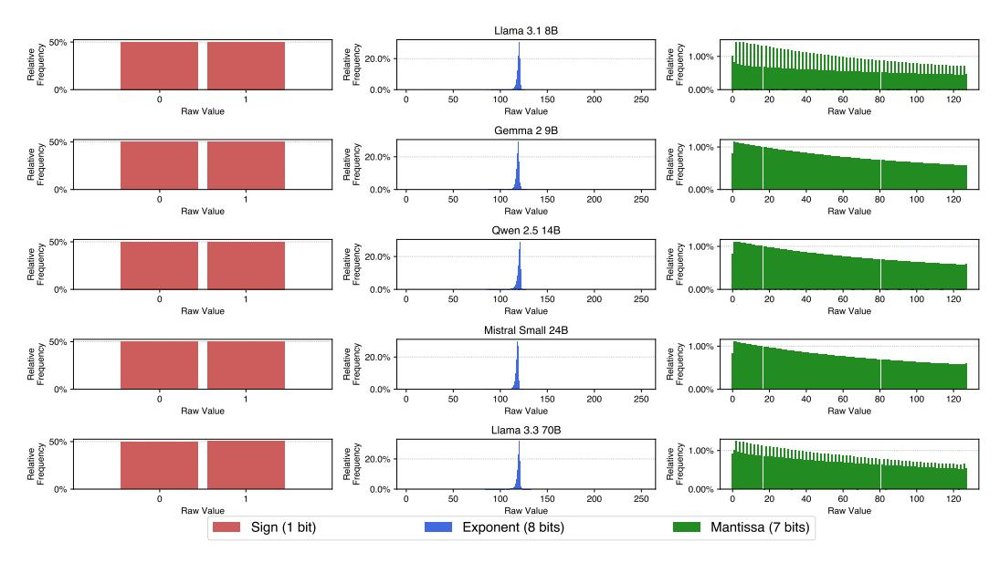
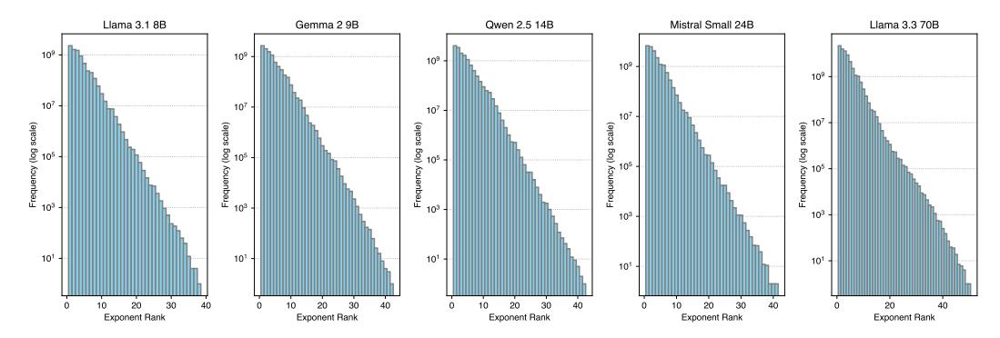

# B Extended Related Works

Data Formats for Model Weights LLM weights are typically stored in compact floating-point formats such as FP16 or BFloat16 (officially stylized as *bfloat16*[3](#page-0-0) ). FP16 allocates 1 sign bit, 5 exponent bits, and 10 mantissa bits, whereas BFloat16 uses 1 sign bit, 8 exponent bits, and 7 mantissa bits. Compared to FP16, BFloat16 offers a wider dynamic range at the cost of precision, which improves numerical stability and mitigates overflow issues during training [\[17,](#page-10-11) [30\]](#page-11-13).

Compressed data formats typically aim for lower bit-widths. For example, FP8—which comes in both E4M3 (4 exponent bits, 3 mantissa bits, plus 1 sign bit) and E5M2 configurations—has seen reasonable adoption in LLM training and development. Integer formats like INT8 have also been well explored, as in LLM.int8() [\[8\]](#page-10-12) and its following works. Formats with a stronger emphasis on efficiency, such

1 [https://x.com/lmarena\\_ai/status/1835760196758728898](https://x.com/lmarena_ai/status/1835760196758728898)

<https://huggingface.co/RedHatAI/DeepSeek-R1-Distill-Llama-70B-quantized.w8a8>

3 [https://cloud.google.com/blog/products/ai-machine-learning/](https://cloud.google.com/blog/products/ai-machine-learning/bfloat16-the-secret-to-high-performance-on-cloud-tpus)

[bfloat16-the-secret-to-high-performance-on-cloud-tpus](https://cloud.google.com/blog/products/ai-machine-learning/bfloat16-the-secret-to-high-performance-on-cloud-tpus)

as FP4, INT4, NF4 [9], and AF4 [58], use only 4 bits. In this work, we primarily focus on formats with  $\geq 8$  bits, as benchmark literature [55, 19, 39] often suggests that 8-bit quantization results in negligible performance drop—though we show in Section A that this claim is likely skewed due to evaluation selectiveness and benchmark limitations.

**Lossless Model Compression** While lossy model compression techniques such as pruning and quantization [14, 37, 15] have received widespread attention, lossless model compression remains a relatively underexplored area. Upon careful investigation, we identified roughly four prior works that have made meaningful efforts in this space. Deep Compression [22] is a foundational work, applying Huffman coding [28] to quantized CNN models and achieving an additional ∼22% compression gain for model checkpoints. ZipNN [25] extended this idea to language models, comparing its results to classic lossless compression tools such as zlib [10] and zstd4 and demonstrated superior compression gains. However, this line of work—including their industry counterparts, such as ezm75—is limited in that its efficiency gains only apply to storage (reducing the size of model checkpoints) but offer no benefits during inference. While such storage savings are meaningful in large-scale training settings—where frequent snapshotting and checkpoint rollbacks are needed [47]—they have limited impact for everyday LLM end-users. Model downloading is typically a one-time cost, so even if a model checkpoint is compressed by 50%, it only cuts the download time at most by half, presumably over the model's entire lifecycle of deployment. Furthermore, checkpoints are usually stored on disk, where terabytes of capacity are easily available, making up a much looser constraint compared to GPU HBM (High Bandwidth Memory); one of the main resource constraints during inference.

We argue that a lossless compression technique would be substantially more impactful if it could deliver efficiency gains during inference—particularly on GPU-based systems, which is the default setup for LLM serving. In this context, *NeuZip* [23] is the only prior work we identify that supports GPU inference. NeuZip applies entropy encoding with layer-wise decompression to maintain a reduced memory footprint throughout serving. However, it is built on NVIDIA's nvCOMP: "a high-speed data compression and decompression library optimized for NVIDIA GPUs". Unfortunately, nvCOMP is no longer open-source (only binary executables are available), which hinders future research. Moreover, we empirically find that nvCOMP's inference throughput and latency are significantly worse than our proposed DFloat11 kernel, resulting in a pipeline that trades memory efficiency for substantial inference overhead (see Figure 7).

Another work referencing NeuZip is *Huff-LLM* [59], which also aims to reduce memory costs while maintaining efficient inference. However, its contributions are specific to FPGA-like architectures and do not apply to GPUs. To the best of our knowledge, the DFloat data format we presented (and its respective kernel support in DFloat11) shall serve as the only GPU-inference-friendly data format with lossless compression benefits.

Efficient LLM Inference LLMs are computationally intensive and resource-demanding, making the efficiency of LLM inference a key research focus [52]. FlashAttention [7] accelerates exact attention computation on GPUs through kernel fusion, while NoMAD Attention [64] speeds up attention on CPUs using in-register lookups. Model compression is another effective strategy to reduce resource requirements for serving LLMs and diffusion models. Quantization methods such as GPTQ [15], AWQ [37], SmoothQuant [51], LeanQuant [61], CQ [63], KVQuant [26], and KIVI [40] lower memory usage and enhance efficiency by compressing model weights, activations, or KV cache. Compression is also applied in fine-tuning: methods like LoRA [27], QLoRA [9], and SketchTune [62] compress model weight deltas, whereas GaLore [65] and SARA [60] compress optimizer states during training. One additional line of work relevant to efficient LLM inference would be *lossless efficient decoding*, where paradigms such as *speculative decoding* [49, 34, 50] and *n-gram candidate decoding* [16, 3] offer lossless generation quality with improved latency. DFloat11 mainly differs from these works in that it provides substantial savings in memory footprint while maintaining lossless generation quality, whereas most—if not all—lossless efficient decoding methods require memory consumption equal to or greater than that of the original model.

4https://github.com/facebook/zstd

5https://github.com/liuliu/s4nnc/pull/11

4067-Good-Compressors-for-16-bit-floats

6https://developer.nvidia.com/nvcomp

> **[图片提取文字 (无描述)]:**
> Llama 3.1 8B Relative Frequency Relative Frequency Relative Frequency 0.00% 0 0 50 100 150 200 250 0 20 40 60 80 100 120 Raw Value Raw Value Raw Value Gemma 2 9B Relative Frequency %09 Relative Frequency Relative Frequency 1.00% 20.0% 0.0% 0.00% 50 100 150 200 250 80 100 120 0 0 0 20 40 60 Raw Value Raw Value Raw Value Qwen 2.5 14B Relative Frequency %09 Relative Frequency Relative Frequency 0.0% 0.00% 50 100 150 200 250 20 40 60 80 100 120 0 Raw Value Raw Value Raw Value Mistral Small 24B Relative Frequency %09 Relative Frequency Relative Frequency 1.00% 0.00% 50 100 150 200 250 20 80 100 120 0 0 0 40 60 Raw Value Raw Value Raw Value Llama 3.3 70B Relative Frequency %09 Relative Frequency Frequency . %0.05 0% 0.0% 0.00% 150 200 250 0 0 50 100 0 20 40 60 80 100 120 Raw Value Raw Value Raw Value Sign (1 bit) Exponent (8 bits) Mantissa (7 bits)

Figure 8: Relative frequency distribution of sign, exponent, and mantissa values in the BFloat16 weights of all linear projection layers across various LLMs.

### C Frequency Distribution of BFloat16 Values

Figure 8 presents the frequency distribution for distinct values of sign, exponent, and mantissa bits in the BFloat16 weights of LLMs. Figure 9 shows the sorted frequency of exponent values of LLM weights.

> **[图片提取文字 (无描述)]:**
> Llama 3.1 8B Qwen 2.5 14B Llama 3.3 70B Gemma 2 9B Mistral Small 24B 109 109 109 109 107 107 107 107 Frequency (log scale) scale) scale) scale) scale) Frequency (log s g 105 6 105 (log Frequency (8 Frequency ( 103 103 101 101 101 101 30 30 30 40 30 40 20 20 40 40 20 Exponent Rank Exponent Rank Exponent Rank Exponent Rank Exponent Rank

Figure 9: Distribution of BFloat16 exponent values across various models. The frequency of exponent values (shown in log scale) decays rapidly with exponent rank.

