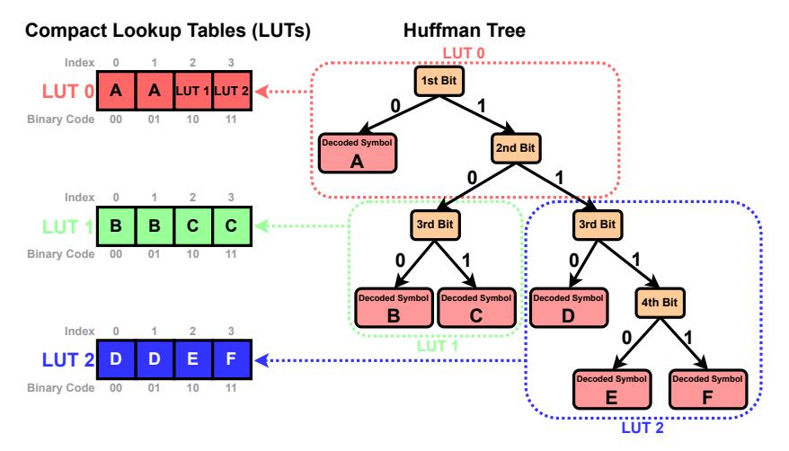

# I Efficient Decoding of Huffman Codes Using Compact Lookup Tables

#### I.1 The Dual Lookup Table Approach

Huffman decoding can be performed by traversing the Huffman tree: starting from the root, each bit of the encoded bitstream determines the branch to follow, and the symbol is fully decoded upon reaching a leaf node. While this bit-by-bit traversal is conceptually simple, it is inefficient in practice. Each branching decision depends on the previous one, leading to frequent memory accesses and conditional jumps. This pattern is especially problematic on GPUs, where it causes branch divergence and limits instruction-level parallelism. A widely adopted alternative is *lookup-table-based decoding* [\[53\]](#page-13-4), which flattens the Huffman tree into two compact lookup tables. This enables decoding of each symbol using just two array lookups and a bit shift, significantly improving throughput.

We employ two lookup tables, LUT and CodeLengths, to achieve efficient, branch-free Huffman decoding. Let L denote the length of the longest codeword in the Huffman codebook. We construct the primary lookup table LUT as an array of size 2 L, where each entry maps an L-bit binary sequence to the first symbol it encodes.

Figure [11](#page-19-2) shows an example with L = 4 and a set of symbols A, B, C, D, E, F. For clarity, we use letters to represent symbols, though in practice these correspond to exponent values in BFloat16 weights. The lookup table LUT contains 2 4 = 16 entries, indexed by all possible 4-bit binary sequences. Each entry in LUT stores the symbol whose Huffman code matches the prefix of that index. If a symbol's Huffman code is shorter than L bits, it will fill multiple consecutive entries. For example, if symbol A is encoded as the single bit 0, then all binary sequences from 0000 to 0111 begin with 0, so entries 0 through 7 in LUT are assigned to A. In contrast, symbols with Huffman codes of length L occupy exactly one entry each. For instance, E = 1110 and F = 1111 map to entries 14 and 15, respectively. This construction yields a dense prefix table that allows decoding a symbol with a single array lookup using an L-bit segment from the encoded bitstream.

To advance the encoded bitstream for decoding the next symbol, we also store the code lengths of all symbols. The second lookup table, CodeLengths, maps each symbol to its Huffman code length. In

> **[图片提取文字 (无描述)]:**
> Compact Lookup Tables (LUTs) **Huffman Tree** LUT 0 Index 1st Bit Binary Code 01 10 **Decoded Symbol** 2nd Bit Index 3rd Bit 3rd Bit В Binary Code 01 10 Decoded Symbol Decoded Symbol **Decoded Symbol** 4th Bit В Index Е F LUT 2 D **Decoded Symbol Decoded Symbol** Binary Code 01 10 11 LUT 2

Figure 12: A Huffman tree can be decomposed into a hierarchy of subtrees, each represented by a compact lookup table (LUT). Each LUT may reference another lower-level LUT in the hierarchy. This hierarchical decoding approach is functionally equivalent to using a single monolithic LUT, but significantly more memory efficient.

the example, the lengths are: A:1, B:3, C:3, D:3, E:4, F:4. Together, these two tables allow fast, deterministic decoding by repeating the following steps:

- 1. Use the next L bits from the encoded bitstream to index LUT and retrieve the decoded symbol.
- 2. Look up the code length of the decoded symbol from CodeLengths to determine how many bits to consume.
- 3. Advance the encoded bitstream and repeat.

This approach eliminates conditional branches and pointer chasing during decoding, making it highly suitable for parallel computation on GPUs.

### I.2 Decomposing LUT into Hierarchical, Compact Lookup Tables

The primary lookup table LUT contains  $2^L$  entries, where L is the maximum code length in the Huffman codebook. While this enables constant-time decoding, the table size grows exponentially with L. In practice, L ranges from 24 to 32 for Huffman trees built with BFloat16 exponents. This results in table sizes of  $2^{24}$  to  $2^{32}$  entries, which far exceeds the capacity of GPU SRAM. To address this, we decompose LUT into multiple smaller lookup tables that fit within on-chip memory, while still enabling fast decoding.

**Hierarchical Table Structure** Instead of storing a single flat table of size  $2^L$ , we decompose LUT into a hierarchy of compact lookup tables. Each table corresponds to a subtree of the Huffman tree and is responsible for decoding b bits. Each table processes the next b bits and either (i) directly returns a decoded symbol, or (ii) delegates to a table next in the hierarchy for decoding the next b bits. This hierarchical organization mirrors the structure of the original Huffman tree and significantly reduces total memory usage.

Figure 12 illustrates an example where the Huffman tree is partitioned into three subtrees, each mapped to a separate lookup table responsible for 2 bits. The decoding process using these three LUTs proceeds as follows:

- LUT0: Uses the first and second bits of the encoded bitstream to determine how to proceed, leading to 3 possible cases:
  - 00, 01  $\rightarrow$  decode the next symbol as A.
  - 10  $\rightarrow$  delegate to LUT1 .

- 11 → delegate to LUT2.
- LUT1: Uses the third and fourth bits of the encoded bitstream to continue decoding:
  - 00, 01 → decode the next symbol as B
  - 10, 11 → decode the next symbol as C
- LUT2: Uses the third and fourth bits of the encoded bitstream to continue decoding:
  - 00, 01 → decode the next symbol as D
  - 10 → decode the next symbol as E
  - 11 → decode the next symbol as F

For decoding Huffman-coded BFloat16 exponents, we decompose the LUT into multiple compact lookup tables, each responsible for decoding 8 bits (i.e. b = 8). This allows us to read the next byte from the encoded bitstream and perform an array lookup from a 256-entry array in each step. In practice, the decomposition of LUT leads to 4 to 8 compact LUTs, each with 256 entries, which comfortably fits within fast SRAM.

