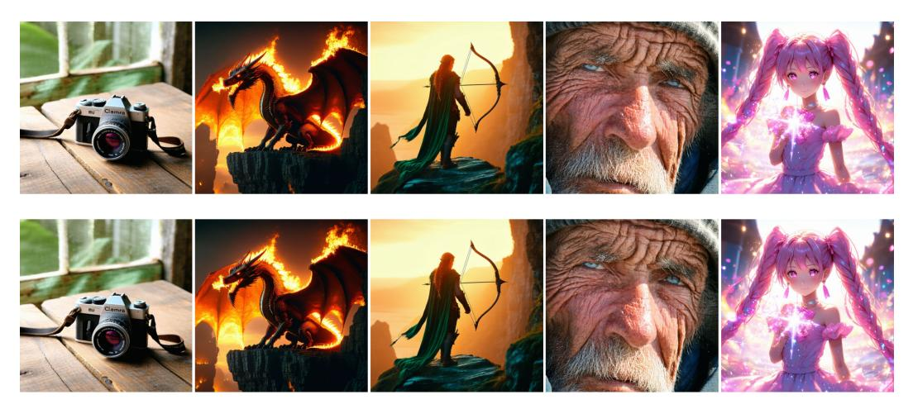

# J Text-to-image Results of BF16 and DF11 Diffusion Models

Figure 13: Images generated by Stable Diffusion 3.5 Large in the original BFloat16 precision (top 5) are pixel-wise identical to those produced by the DFloat11-compressed model (bottom 5), using the same prompt and random seed.

Figure [13](#page-21-1) presents the comparison of images generated using Stable Diffusion 3.5 Large in BFloat16 and DFloat11 weight format. The images are pixel-wise identical, when using the same prompt and random seed.

