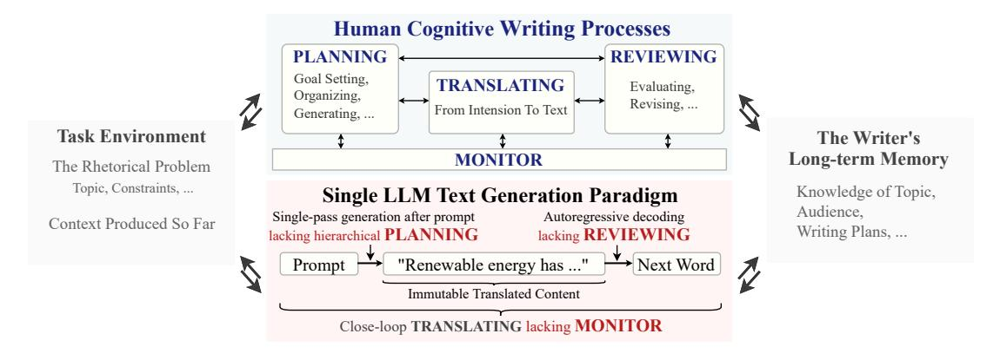
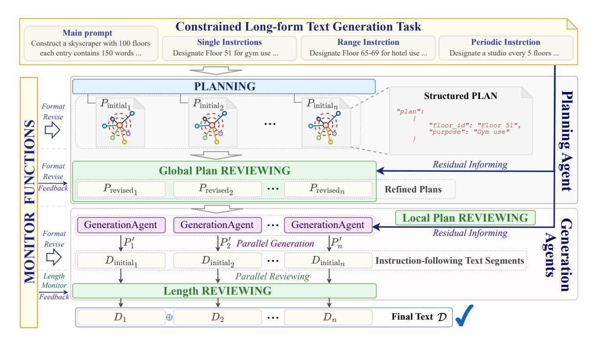
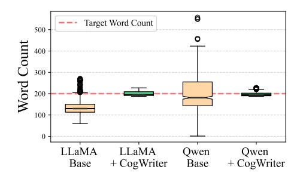
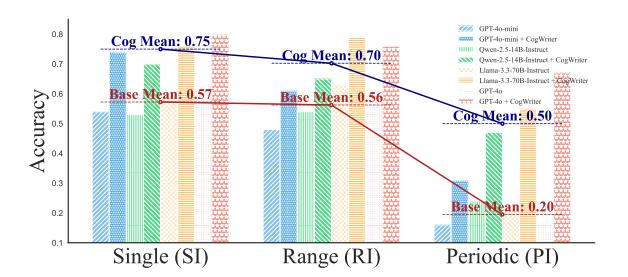
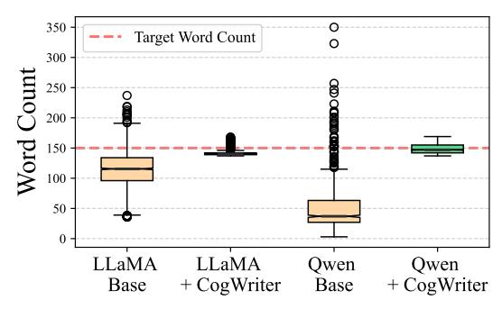
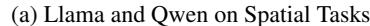
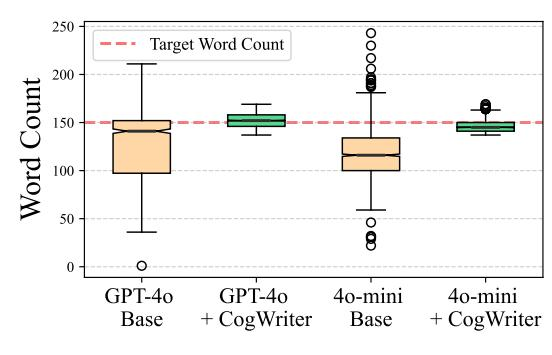
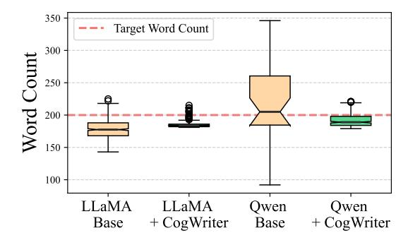
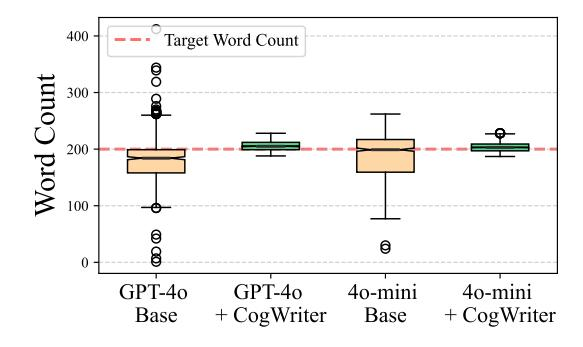
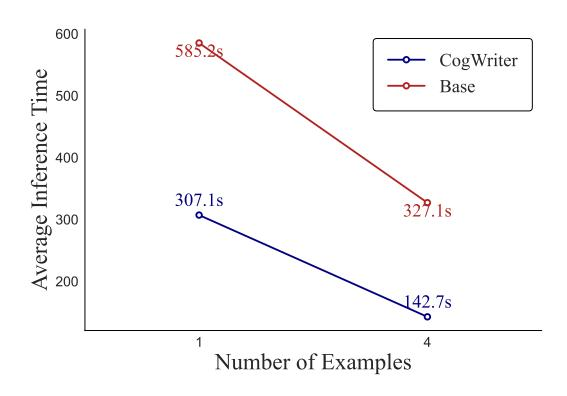

# A Cognitive Writing Perspective for Constrained Long-Form Text Generation

Kaiyang Wan<sup>1</sup> , Honglin Mu<sup>1</sup> , Rui Hao<sup>2</sup> , Haoran Luo<sup>3</sup> , Tianle Gu<sup>1</sup> , Xiuying Chen<sup>1</sup>\*,

<sup>1</sup>MBZUAI, <sup>2</sup>University of Chinese Academy of Sciences, <sup>3</sup>Nanyang Technological University {Kaiyang.Wan, Xiuying.Chen}@mbzuai.ac.ae

## Abstract

Like humans, Large Language Models (LLMs) struggle to generate high-quality long-form text that adheres to strict requirements in a single pass. This challenge is unsurprising, as successful human writing, according to the Cognitive Writing Theory, is a complex cognitive process involving iterative *planning*, *translating*, *reviewing*, and *monitoring*. Motivated by these cognitive principles, we aim to equip LLMs with human-like cognitive writing capabilities through CogWriter, a novel training-free framework that transforms LLM constrained longform text generation into a systematic cognitive writing paradigm. Our framework consists of two key modules: (1) a Planning Agent that performs *hierarchical planning* to decompose the task, and (2) multiple Generation Agents that execute these plans in parallel. The system maintains quality via continuous *monitoring* and *reviewing* mechanisms, which evaluate outputs against specified requirements and trigger necessary revisions. CogWriter demonstrates exceptional performance on LongGenBench, a benchmark for complex constrained longform text generation. Even when using Qwen-2.5-14B as its backbone, CogWriter surpasses GPT-4o by 22% in complex instruction completion accuracy while reliably generating texts exceeding 10,000 words. We hope this cognitive science-inspired approach provides a paradigm for LLM writing advancements: [CogWriter.](https://github.com/KaiyangWan/CogWriter)

### 1 Introduction

LLMs like ChatGPT [\(Achiam et al.,](#page-8-0) [2023\)](#page-8-0) have begun to mirror human-like capabilities across diverse natural language processing tasks [\(Xi et al.,](#page-10-0) [2023;](#page-10-0) [Luo et al.,](#page-9-0) [2024\)](#page-9-0). From crafting concise summaries [\(Chen et al.,](#page-8-1) [2025b,](#page-8-1) [2024a\)](#page-8-2) to composing structured reports [\(Schmidgall et al.,](#page-10-1) [2025;](#page-10-1) [Wang et al.,](#page-10-2) [2024d\)](#page-10-2), these models can generate coherent text in a single pass [\(Rasheed et al.,](#page-10-3) [2025;](#page-10-3)

[Minaee et al.,](#page-9-1) [2024\)](#page-9-1) with a fluency that often rivals human writers. Recent advances have led to models with expanded context windows of up to 128K tokens [\(Pawar et al.,](#page-9-2) [2024\)](#page-9-2), theoretically enabling the generation of extensive documents [\(Bai](#page-8-3) [et al.,](#page-8-3) [2024\)](#page-8-3). However, these models face significant challenges when tasked with generating constrained long-form text under complex constraints, such as following detailed instructions over 10,000 words [\(Wu et al.,](#page-10-4) [2024a\)](#page-10-4). This limitation poses a crucial barrier for applications requiring extended [\(Shi et al.,](#page-10-5) [2024\)](#page-10-5), well-structured content, including creative design proposals, technical documentation, and comprehensive research reports.

To understand the disparity between LLMs and human writers, we refer to Cognitive Writing Theory [\(Flower,](#page-8-4) [1981\)](#page-8-4), which emphasizes how humans succeed in writing through a recursive activity that dynamically integrates multiple cognitive processes. As shown in the top part of Figure [1,](#page-1-0) these processes include *planning*, where writers establish high-level goals and develop structural outlines; *translating*, where writers transform abstract ideas into coherent text; and *reviewing*, where writers continuously evaluate and refine their generated content. Crucially, writers control these components through continuous *monitoring*, allowing them to assess and adjust text to better align with evolving objectives throughout the writing process.

Current LLMs excel at generating fluent text, effectively performing the *translating* function of converting internal token vectors into textual content. However, they fundamentally conflict with key cognitive principles in three ways, as shown in the bottom part of Figure [1:](#page-1-0) *1)* They treat longform text generation merely as an end-to-end task, overlooking the crucial hierarchical *planning* process that should guide content generation; *2)* Their autoregressive architecture renders generated tokens as immutable context, preventing the *reviewing* and restructuring capabilities essential to hu-

<sup>\*</sup>Corresponding author.

<span id="page-1-0"></span>> **[图片提取文字 (无描述)]:**
> **Human Cognitive Writing Processes** PLANNING REVIEWING Goal Setting, TRANSLATING Evaluating, Organizing, Revising, ... From Intension To Text Generating, ... Task Environment The Writer's Long-term Memory MONITOR The Rhetorical Problem Topic, Constraints, ... Knowledge of Topic, Single LLM Text Generation Paradigm Audience, Single-pass generation after prompt Autoregressive decoding Context Produced So Far Writing Plans, ... lacking hierarchical PLANNING lacking REVIEWING "Renewable energy has ..." Prompt Immutable Translated Content Close-loop TRANSLATING lacking MONITOR


Figure 1: Comparison of human cognitive writing processes and single LLM text generation paradigm.

man writing; and 3) Unlike human writers who actively *monitor* their progress against both local and global objectives, LLMs lack explicit evaluation mechanisms, leading to potential divergence from intended goals in extended generations.

To address the limitations of single-pass generation, we introduce CogWriter, a novel training-free framework that aligns LLM-based text generation with cognitive writing paradigm. At its core, Cog-Writer employs a Planning Agent that decomposes complex requirements into manageable subtasks, providing explicit guidance for content generation. Based on sub-plans and the initial goal, multiple Generation Agents work in parallel to produce text segments, enabling both efficient generation and quality control that ensures consistent alignment with requirements. Crucially, both the planning and generation processes support iterative reviewing through feedback from external monitoring functions and LLM-based evaluation, thus enabling dvnamic plan adjustment and content revision.

We evaluate CogWriter on LongGenBench-16K (Wu et al., 2024a), a benchmark designed to test a language model's ability to generate instruction-aligned content about 16K tokens. Empirical results demonstrate that our paradigm is effective for both closed-source and open-source LLMs of various sizes. Specifically, even when using Qwen-2.5-14B as its backbone, CogWriter achieves a 22% higher instruction completion accuracy rate compared to GPT-40, while reliably generating texts exceeding 10,000 words. These results demonstrate the effectiveness of cognitive scienceinspired approaches in advancing LLM writing capabilities, particularly for complex constrained long-form text generation. We hope CogWriter's systematic cognitive writing paradigm will inspire future research in LLM writing advancement.

Our contributions can be summarized as follows:

- We provide a cognitive science perspective on the shortcomings of single-pass LLM generation, highlighting how it diverges from established successful human writing processes.
- We propose CogWriter, a cognitive writing framework that equips LLMs with human writing strategies using multiple LLM-based agents with external monitoring functions.
- We demonstrate that CogWriter remarkably enhances LLMs' ability to produce long-form, instruction-compliant texts without requiring additional training or reinforcement learning.

### <span id="page-1-1"></span>2 A Cognitive Writing Perspective

The challenge of constrained long-form text generation extends far beyond simply producing more words. Just as a novelist crafts an intricate narrative or an architect designs a towering structure, long text generation requires the coordination of multiple cognitive processes working together. Through the lens of cognitive writing theory, three fundamental processes emerge: hierarchical planning, continuous monitoring, and dynamic reviewing (Flower, 1981), as illustrated in Figure 1.

Hierarchical Planning Long-form writing requires a delicate cognitive balance between maintaining local coherence and global structure. Human writers cope with this constraint, as working memory cannot simultaneously retain every detail of a complex narrative (Kellogg, 2013). Skilled writers manage this limitation through hierarchical decomposition, systematically structuring the writing process into multiple levels (e.g., chapters, sections, and paragraphs). This approach enables

them to alternate between top-down thematic planning and bottom-up content development, ensuring alignment with high-level objectives while refining details [\(Hayes and Flower,](#page-9-4) [2016\)](#page-9-4).

LLMs encounter a similar limitation: they generate text in a linear, autoregressive manner without an independent planning module to iteratively refine outlines or adapt strategies in real time [\(Xie](#page-11-0) [et al.,](#page-11-0) [2023\)](#page-11-0). Consequently, their direct prompt-totext generation process often struggles with complex, multi-threaded narratives. Without structured guidance, LLMs are prone to losing coherence over long spans, as their finite computational capacity quickly becomes overwhelmed [\(Hu et al.,](#page-9-5) [2024\)](#page-9-5).

Continuous Monitoring Effective planning in writing requires continuous oversight. Human writers naturally monitor their work, acting like their own editors. They pay attention to both small details—such as word choice and sentence flow—and the larger structure, ensuring the text maintains a clear theme and purpose [\(Kellogg,](#page-9-3) [2013\)](#page-9-3).

In contrast, current mainstream LLMs generate text in a linear, close-loop manner, without the ability to review or refine their output. They lack a built-in system to check their progress against the intended goals, making it difficult to spot and correct issues during generation. Without external monitoring, LLMs struggle to detect when the content drifts off-topic, when the style becomes inconsistent, or when repetition occurs—problems that are especially common in extended long-form writing [\(Wang et al.,](#page-10-6) [2024c;](#page-10-6) [Ping et al.,](#page-9-6) [2025\)](#page-9-6).

Dynamic Reviewing While monitoring continuously tracks the writing process by detecting small errors, inconsistencies, or deviations, reviewing takes this feedback and applies it to make necessary adjustments, such as reorganizing content or improving logical flow. Human writers naturally engage in this iterative reviewing process, refining their work by revisiting earlier content and making adjustments [\(Bereiter and Scardamalia,](#page-8-5) [2013\)](#page-8-5).

However, LLMs lack this ability due to their leftto-right, single-pass generation [\(Yao et al.,](#page-11-1) [2023;](#page-11-1) [Wu et al.,](#page-10-7) [2024b\)](#page-10-7). Without the ability to revisit or reorganize previous content, LLMs struggle with global revisions, such as restructuring sections or ensuring consistency across distant parts of the text [\(Bae and Kim,](#page-8-6) [2024;](#page-8-6) [Cheng et al.,](#page-8-7) [2024a](#page-8-7)[,b\)](#page-8-8). This absence of dynamic reviewing often results in long-form outputs with accumulated errors, inconsistencies, or redundant content.

## <span id="page-2-0"></span>3 Problem Formulation

Based on the analysis in Section [2,](#page-1-1) successfully generating long-form text requires addressing key deficiencies in current LLMs. We propose a new paradigm that equips LLMs with essential abilities to handle long, complex, and instruction-driven text generation. To achieve this, we formally define the constrained long-form text generation task, specifying the types of instructions and requirements the model must meet.

Following [Wu et al.](#page-10-4) [\(2024a\)](#page-10-4), we formally define constrained long-form generation as the task of generating a sequence of interrelated text segments D = {D1, D2, . . . , Dn}, where each D<sup>i</sup> represents a coherent unit of text that must satisfy certain constraints. Each segment D<sup>i</sup> must achieve a target L words and adhere to a set of instructions T . The instructions T guide the generation process and are classified into three types: 1. *Single Instruction (SI)*: This instruction specifies content that must appear at exact, predefined positions. It is denoted as T<sup>S</sup> = {Ts1, Ts2, . . .}, where each Tsi indicates specific content that must be placed in a precise position within the generated descriptions. 2. *Range Instruction (RI)*: This instruction specifies the content that must be included in each description within a designated range. It is represented as T<sup>R</sup> = {T<sup>i</sup> , Ti+1, . . . , Ti+j}, ensuring that the specified content is sequentially assigned within the range [i, i + j]. 3. *Periodic Instruction (PI)*: This instruction mandates the periodic repetition of specific content at regular intervals. It is defined as T<sup>P</sup> = {Tn, T2n, . . . , Tm·n}, where n is the interval length and m specifies the number of repetitions. These instructions are unified into a comprehensive Check Set: T = {TS, TR, T<sup>P</sup> }.

The versatility of this framework extends to various practical applications. For example, in architectural planning for a 100-floor building, Single Instructions determine specific facilities like a medical center on the 20th floor, Range Instructions define functional zones like corporate offices spanning floors 5-12, and Periodic Instructions maintain consistent amenities such as security checkpoints on every fifth floor. Each floor description must meet a target length of 200 words.

### 4 Methodology

Drawing upon our analysis of cognitive writing processes and the identified limitations of single-pass generation approaches, in this section, we propose

<span id="page-3-0"></span>> **[图片提取文字 (无描述)]:**
> **Constrained Long-form Text Generation Task** Main prompt Periodic Instrction **Single Instrctions Range Instrction** Construct a skyscraper with 100 floors each entry contains 150 words ... Designate Floor 51 for gym use ... Designate Floor 65-69 for hotel use ... Designate a studio every 5 floors ... PLANNING Structured PLAN  $P_{\text{initial}}$  $P_{\rm initial_2}$  $P_{\text{initial}_n}$ Format "plan": Revise "floor id": "Floor 51", "purpose": "Gym use" Residual Informing Format 9 Revise Feedback  $P_{\text{revised}_1}$  $P_{\rm revised}_2$  $P_{\text{revised}n}$ Refined Plans Local Plan REVIEWING GenerationAgent GenerationAgent **GenerationAgent** Residual Informing Format eneration  $|P_2^\prime|$  Parallel Generation Revise gents  $D_{\rm initial_1}$  $D_{\text{initial}_n}$  $D_{\rm initial_2}$ Instruction-following Text Segments Parallel Reviewing Length Monitor Length REVIEWING Feedback Final Text D  $D_1$  $D_2$  $D_n$ 0 ...


Figure 2: **Overview of the CogWriter Framework.** The framework consists of two key modules: the Planning Agent and the Generation Agents. The Planning Agent generates and refines an initial plan, guiding the structure and flow of the document. The Generation Agents collaborate to generate, revise, and finalize document segments, ensuring consistency in content and narrative coherence across the entire document.

CogWriter, a training-free framework that equips LLM with cognitive writing capabilities and enables LLMs to tackle complex constrained long-form generation with human-like strategic thinking.

#### 4.1 Framework Overview

As shown in Figure 2, CogWriter is designed to bridge the gap between current LLMs and humanlike writing processes by integrating planning, monitoring, and reviewing mechanisms into the generation workflow. At its core, CogWriter employs a specialized Planning Agent that hierarchically decomposes the task and create structured plans, breaking down complex writing tasks into manageable components while maintaining their intricate relationships. Generation Agents execute these plans while monitoring mechanisms continuously evaluate the output to detect deviations in content, structure, or requirements. When issues are identified by monitor or LLM, a review process is triggered to revise and refine the output, ensuring overall coherence and adherence to instructions.

#### 4.2 Planning Agent

The Planning Agent serves as the strategic brain of the system. Similar to how an experienced writer begins with a detailed outline, this agent analyzes task requirements and generates a structured initial plan  $\mathcal{P}_{\text{initial}}$  under strict format constraints:

$$\mathcal{P}_{\text{initial}} \leftarrow \text{GenerateInitialPlan}(p_{\text{plan}}),$$

where  $p_{plan}$  is the task-specific prompt incorporating instruction descriptions  $\mathcal{T}$ . The target plan is hierarchical, comprising unit plans:  $\mathcal{P}_{\text{initial}} = \{P_{\text{initial}_1}, ..., P_{\text{initial}_n}\}$ .

After generating the initial plan, the *monitoring* mechanism supervises the process and relays signals to the *reviewing* mechanism for evaluation and validation. The reviewing mechanism evaluates the plan through two key checks: First, it verifies if the generated content satisfies the task-specific constraints  $\mathcal{T}$ . Second, it checks the plan's structure for any syntax errors and applies necessary corrections. If any issues are detected, a revision process is triggered to refine the plan:

$$\mathcal{P}_{\text{revised}} \leftarrow \text{PlanRevise}(p_{\text{revise}}, \mathcal{P}_{\text{initial}}), \quad (1)$$

$$\mathcal{P} \leftarrow \text{FormatRevise}(\mathcal{P}_{\text{revised}}),$$
 (2)

where  $p_{\text{revised}}$  includes the revision prompt for the task instructions  $\mathcal{T}$ . This iterative refinement ensures that the final plan is not only of high quality but also optimally structured to guide robust and effective content generation.

### Algorithm 1 CogWriter Algorithm

```
Require: Prompts p_* including task instruction \mathcal{T}
Ensure: Final text \mathcal{D} = \{D_1, \dots, D_n\}
  1: function PLANNINGAGENT(p_*)
             \mathcal{P}_{\text{initial}} \leftarrow \text{GenerateInitialPlan}(p_{\text{plan}})
  2:
             \mathcal{P}_{\text{revised}} \leftarrow \text{PlanRevise}(p_{\text{revise}}, \mathcal{P}_{\text{initial}})
  3:
             \mathcal{P} \leftarrow \text{FormatRevise}(\mathcal{P}_{\text{revised}})
  4:
             return \mathcal{P}
  5:
  6: end function
  7: function GENERATIONAGENTS(p_*, \mathcal{P})
             Initialize empty document collection \mathcal{D}
             for each P_i in \mathcal{P} do
  9:
                    P'_i \leftarrow \text{PlanAdjust}(p_{\text{adjust}_i}, P_i)
 10:
                   D_{\text{initial}_i} \leftarrow \text{Generate}(p_{\text{write}}, P_i')
11:
                    D_i \leftarrow \text{LengthRevise}(p_{\text{length}}, D_{\text{initial}_i})
12:
13.
             end for
             \mathcal{D} \leftarrow \mathcal{D} \cup D_i
14:
             return \mathcal{D}
16: end function
```

#### 4.3 Generation Agents

Once the global plan  $\mathcal{P} = \{P_1, ..., P_n\}$  is finalized by the Planning Agent, multiple Generation Agents take over, each responsible for generating content for a specific description task  $D_i$ . The process begins with validating and refining the local plan  $P_i$ , through *monitoring* and *reviewing* similar to the Planning Agent to ensure it aligns with the instruction requirements  $\mathcal{T}$ . Concretely, if discrepancies are detected, adjustments are applied to update the plan, as shown in the following equation:

$$P_i' \leftarrow \text{PlanAdjust}(p_{\text{adjust}}, P_i),$$
 (3)

where  $p_{\mathrm{adjust}_i}$  encompasses the specialized prompt designed for reviewing each local plan  $P_i$  against the residual informing from  $\mathcal{T}$ .

Upon validation of  $P'_i$ , the agent generates content by executing the plan:

$$D_{\text{initial}_i} \leftarrow \text{Generate}(p_{\text{write}}, P_i'),$$
 (4)

where  $p_{\rm write}$  is the prompt to generate content following the guidance of the plan  $\mathcal{P}'_i$ . Based on our preliminary study, this process generally produces content that meets most instruction criteria. However, length constraints may still require further refinement due to the limitations of most current LLMs in controlling output length precisely. To address this, a revision function adjusts the content to meet the specified length L:

$$D_i \leftarrow \text{LengthRevise}(p_{\text{length}}, D_{\text{initial}_i}), \quad (5)$$

where  $p_{\text{length}}$  is the prompt used to adjust the content length to L by expanding or compressing the generated text while preserving key details, semantic integrity, and overall coherence.

By following this process, each segment  $D_i$  seamlessly integrates with the overall narrative structure, ensuring both local coherence and global thematic consistency.

### 5 Experiments

### 5.1 Experimental Setup

**Dataset** We evaluated CogWriter using Long-GenBench-16K (Wu et al., 2024a), a benchmark specifically designed for assessing a model's complex constrained long-form text generation capabilities. The dataset features four scenarios, each requiring approximately 16,000 tokens: (1) Diary Writing and (2) Menu Design assess temporal consistency by requiring coherent content organization across weeks of a year, while (3) Skyscraper Design and (4) Urban Planning evaluate spatial reasoning through detailed facility arrangements across floors or city blocks. The benchmark includes 400 test instances, with 100 instances per scenario. Each scenario involves three instruction types (defined in Section 3): single instructions, range instructions, and periodic instructions. For temporal tasks, Diary Writing and Menu Design require at least 200 words per weekly entry, totaling 10,400 words (52 weeks  $\times$  200 words). For spatial tasks, Skyscraper Design and Urban Planning mandate 15,000 words (100 units  $\times$  150 words).

Evaluation Metrics We evaluate model performance using three key metrics from LongGen-Bench. *Main Task Completion Rate* (Comp. Rate) assesses whether all designated subtasks are completed in sequence (e.g., generating entries for every week in a diary without omissions). *Instruction Following Accuracy* measures adherence to single (Acc. Once), range (Acc. Range), and periodic (Acc. Periodic) instructions, with their average reported as Avg. Acc. We utilize the official evaluation scripts to ensure consistency with reported benchmarks. Additionally, we track *Word Count*, ensuring a minimum average threshold of 12,700 words to meet the combined task requirements.

**Experimental Setup** We evaluate our approach across three categories of models and methods. First, we establish baseline performance using several single-pass generation models from the official

<span id="page-5-0"></span>

| Model                      | Comp. Rate          | Acc. Once           | Acc. Range          | Acc. Periodic       | Avg. Acc.           | Words (Req. ≥12700)  |
|----------------------------|---------------------|---------------------|---------------------|---------------------|---------------------|----------------------|
| LongWriter-Llama3.1-8B     | 0.46                | 0.36                | 0.56                | 0.17                | 0.36                | 11036                |
| Llama-3.1-8B-Instruct      | 0.94                | 0.36                | 0.49                | 0.17                | 0.34                | 8804                 |
| Llama-3.1-70B-Instruct     | 0.79                | 0.50                | 0.51                | 0.18                | 0.39                | 8055                 |
| Mixtral-8x7B-Instruct-v0.1 | 0.83                | 0.42                | 0.45                | 0.24                | 0.37                | 8113                 |
| Qwen-2-72B-Instruct        | 0.94                | 0.42                | 0.44                | 0.14                | 0.33                | 8013                 |
| GPT-4o-mini                | 0.97                | 0.54                | 0.48                | 0.16                | 0.39                | 8940                 |
| + SELF-REFINE              | 0.84                | 0.57                | 0.32                | 0.20                | 0.36                | 8154                 |
| + CoT                      | 0.93                | 0.59                | 0.48                | 0.18                | 0.42                | 10137                |
| + CogWriter (Ours)         | <b>1.00</b> (†0.03) | <b>0.74</b> (†0.20) | <b>0.61</b> (†0.13) | <b>0.31</b> (†0.15) | <b>0.55</b> (†0.16) | <b>12484</b> (†3544) |
| Qwen-2.5-14B-Instruct      | 0.29                | 0.53                | 0.54                | 0.24                | 0.44                | 1817                 |
| + SELF-REFINE              | 0.17                | 0.45                | 0.63                | 0.21                | 0.43                | 1122                 |
| + CoT                      | 0.30                | 0.46                | 0.20                | 0.16                | 0.27                | 1619                 |
| + CogWriter (Ours)         | <b>0.79</b> (↑0.51) | <b>0.70</b> (†0.17) | <b>0.65</b> (†0.11) | <b>0.47</b> (†0.23) | <b>0.61</b> (†0.17) | <b>10091</b> (†8274) |
| Llama-3.3-70B-Instruct     | 0.99                | 0.59                | 0.63                | 0.21                | 0.48                | 9431                 |
| + SELF-REFINE              | 0.93                | 0.59                | 0.64                | 0.28                | 0.50                | 8491                 |
| + CoT                      | 1.00                | 0.62                | 0.62                | 0.21                | 0.48                | 9302                 |
| + CogWriter (Ours)         | <b>1.00</b> (↑0.01) | <b>0.76</b> (†0.17) | <b>0.79</b> (†0.16) | <b>0.55</b> (†0.34) | <b>0.70</b> (†0.22) | <b>12051</b> (†2620) |
| GPT-40                     | 0.63                | 0.63                | 0.60                | 0.17                | 0.47                | 9055                 |
| + SELF-REFINE              | 0.66                | 0.67                | 0.62                | 0.33                | 0.54                | 4641                 |
| + CoT                      | 0.40                | 0.58                | 0.63                | 0.32                | 0.51                | 4482                 |
| + CogWriter (Ours)         | <b>0.91</b> (†0.29) | <b>0.80</b> (†0.17) | <b>0.76</b> (†0.16) | <b>0.67</b> (†0.50) | <b>0.74</b> (†0.27) | <b>11618</b> (†2563) |

Table 1: Model Performance Comparison and the Improvement Brought by CogWriter (values in parentheses indicate the improvement relative to the base model).

LongGenBench repository, including LongWriter-Llama3.1-8B (Bai et al., 2024), Llama-3.1-8B-Instruct, Mixtral-8x7B-Instruct-v0.1 (Jiang et al., 2023), Llama-3.1-70B (Grattafiori and et al, 2024), Qwen-2-72B-Instruct (Qwen et al., 2025), as well as GPT-40 and GPT-40-mini. Second, we compare against two prominent enhancement methods: SELF-REFINE (Madaan et al., 2023) and Chain-of-Thought (CoT) prompting (Wei et al., 2022). These methods are applied to four representative foundation models to ensure comprehensive evaluation across different model capabilities and architectures. Finally, to demonstrate the effectiveness of our CogWriter paradigm, we apply it to the same four foundation models: GPT-4omini-2024-07-18, GPT-4o-2024-08-06, Qwen-2.5-14B (Team, 2024), and Llama-3.3-70B (Touvron et al., 2024). This selection encompasses closedsource and open-source models with varying parameter scales, enabling us to evaluate CogWriter's generalizability. For fair comparison, we implement SELF-REFINE and CoT baselines on these same models alongside our proposed framework.

**Implementation Details** We deployed our experiments across local computational resources and cloud-based APIs. For open-source models (Qwen-2.5-14B and Llama-3.3-70B), we leveraged vLLM (Kwon et al., 2023) for its efficient inference

acceleration while maintaining the default temperature and sampling parameters as specified in the official Hugging Face implementations. These experiments were conducted on 4 NVIDIA A100-SXM4-80GB GPUs running CUDA 12.8. For closed-source models (GPT-40 and GPT-40-mini), we utilized their respective official API.

#### 5.2 Main Results

Table 1 highlights the main performance outcomes of our experiments. Firstly, our results reveal that Long Writer-Llama 3.1-8B, despite being specifically designed and trained from Llama-3.1-8B-Instruct for long-form generation, struggles considerably, achieving only a 0.46 completion rate. Similarly, even advanced models with substantial parameter counts, such as Llama-3.1-70B-Instruct and Qwen-2-72B-Instruct, fail to reach the target length of 12,700 tokens in their generated outputs. Secondly, alternative enhancement methods also exhibit limited effectiveness. Chain-of-Thought prompting results in a modest improvement in instruction-following accuracy (from 0.39 to 0.42 using GPT-4o-mini), while SELF-REFINE achieves reasonable completion rates. However, both approaches fall short in meeting length requirements and maintaining instruction adherence.

In contrast, CogWriter demonstrates remarkable improvements across all evaluation metrics.

<span id="page-6-1"></span>

| Model                   | Comp. Rate | Acc. Once | Acc. Range | Acc. Periodic | Avg. Acc. | Words (Req. $\geq$ 12700) |
|-------------------------|------------|-----------|------------|---------------|-----------|---------------------------|
| GPT-4o-mini + CogWriter | 1.00       | 0.74      | 0.61       | 0.31          | 0.55      | 12484                     |
| - w/o PlanRevise        | 0.99       | 0.73      | 0.45       | 0.33          | 0.50      | 12472                     |
| - w/o PlanAdjust        | 1.00       | 0.63      | 0.46       | 0.27          | 0.45      | 12341                     |
| - w/o LengthReview      | 1.00       | 0.73      | 0.61       | 0.30          | 0.54      | 11549                     |

Table 2: Ablation study on the effectiveness of CogWriter's key components using GPT-4o-mini as the base model.

When using Qwen-2.5-14B-Instruct as its backbone, it boosts the completion rate by 0.51 and improves average accuracy by 0.17. For Llama-3.3-70B-Instruct and GPT-40, CogWriter achieves near-perfect completion rates while consistently enhancing instruction-following accuracy, excelling at handling complex periodic instructions.

<span id="page-6-0"></span>

| Method           | Plan         | Decomp.      | Monit.       | Rev.         |
|------------------|--------------|--------------|--------------|--------------|
| Human Writer     | ✓            | ✓            | ✓            | ✓            |
| CoT              | $\checkmark$ | ×            | ×            | ×            |
| SELF-REFINE      | ×            | ×            | ×            | $\checkmark$ |
| Single-pass LLMs | ×            | ×            | ×            | ×            |
| CogWriter        | $\checkmark$ | $\checkmark$ | $\checkmark$ | $\checkmark$ |

Table 3: Comparison of different writing approaches. *Plan*: planning the writing structure; *Decomp*.: decomposing complex tasks into manageable components; *Monit*.: monitoring progress during generation; *Rev*.: reviewing and refining generated content.

Advantages of Cognitive Structure We provide a comparison of the cognitive capabilities of the baselines, our proposed paradigm, and human writers in Table 3, to analyze the strong performance of our approach. It can be seen that human writers naturally employ all four cognitive processes—planning, decomposition, monitoring, and reviewing—while existing computational methods implement only subsets of these capabilities. CoT primarily focuses on planning, and SELF-REFINE incorporates only reviewing. In contrast, Cog-Writer mirrors the complete human writing process by integrating all four capabilities, which may help explain its superior effectiveness in complex long-form generation tasks.

Correlation with Model Internal Ability We next discuss the relationship between performance improvements and the model's capabilities. When applying our framework to Llama-3.1-8B-Instruct, we observed a clear limitation: the model struggled to generate coherent and structured plans essential for CogWriter's method. In contrast, for stronger LLMs such as GPT-40, CogWriter achieved sig-

nificant improvements, including a 0.29 increase in completion rate and a 0.50 increase in periodic instruction accuracy. This suggests that models with more advanced internal cognitive abilities are better at utilizing CogWriter's coordination of cognitive processes, while weaker models, lacking robust instruction-following skills, fail to fully replicate this process. This limitation shows that CogWriter's effectiveness depends on the model's internal abilities, with advancing LLMs enabling more human-like reasoning and problem-solving.

#### 6 Discussion

**Ablation Study** We conduct an ablation study to evaluate the impact of different components in our proposed CogWriter framework, as shown in Table 2. Removing the PlanRevise module resulted in a noticeable performance drop across key metrics, with the average accuracy decreasing from 0.55 to 0.50. This demonstrates that refining the initial plan through iterative revisions is crucial for maintaining effective task decomposition and alignment with task-specific constraints. Disabling the PlanAdjust mechanism further impacted performance, reducing the average accuracy to 0.45, particularly affecting Acc. Once and Acc. Range. Finally, removing the LengthReview module led to a drop in content generation quality due to unmet length constraints, highlighting its role in finetuning the output to meet requirements. Overall, the results emphasize the importance of each component, with PlanRevise and PlanAdjust playing key roles in ensuring task decomposition, plan refinement, and overall accuracy of generation.

**Length Control Performance** As specified in Section 3, each description  $D_i$  must achieve a target word count of L. To evaluate compliance with this requirement, we conducted an analysis of word count distributions across different models. Taking the Diary Writing task as an example, Figure 3 illustrates the performance of LLama-3.3-70B-Instruct and Qwen-2.5-14B-Instruct. The box plot reveals that these base models struggle to meet

<span id="page-7-0"></span>> **[图片提取文字 (无描述)]:**
> Target Word Count 500 400 300 200 100 0 LLaMA LLaMA Qwen + CogWriter Qwen Base + CogWriter Base


Figure 3: Comparison of Length Control Ability.

the word count requirement, with high variance and frequent deviations from the target length. In contrast, CogWriter achieves superior length control, as shown by its tighter, more stable distribution of word counts. The explicit monitoring mechanism within CogWriter effectively reduces variance and ensures consistent compliance with the length requirement. We provide further analysis results of other models and tasks in Appendix A.1.

### **Challenges in Handling Complex Instructions**

As shown in Figure 4, our experiments reveal that for all baselines and our model, the average performance follows a consistent ranking: Single Instructions (SI) outperform Range Instructions (RI), while Periodic Instructions (PI) show the lowest success rate. This indicates that, despite task decomposition simplifying the overall process, LLMs still face difficulties in understanding and executing complex instructions. One major issue is instruction overload—as the number of instructions increases, the model's accuracy drops due to the difficulty in managing multiple constraints simultaneously. Additionally, instruction complexity plays a significant role: Single Instructions are easier as they target fixed positions, Range Instructions involve more positional flexibility, and Periodic Instructions require tracking repetitions across intervals, making them the most challenging to execute correctly. To improve performance in real-world application, it is advisable to limit the number of instructions and manually simplify complex or overlapping instructions where possible.

### 7 Related Work

Long-form Text Generation Recent advances in long-form generation have focused on improving models through architectural enhancements and specialized training techniques (Salemi et al., 2025a; Que et al., 2024; Liu et al., 2023; Li et al., 2023). Approaches like Re3 (Yang et al., 2022)

<span id="page-7-1"></span>> **[图片提取文字 (无描述)]:**
> GPT-4e-mini 0.8 Cog Mean: 0.75 GPT-4o-mini + CogWriter Qwen-2.5-14B-Instruct Cog Mean: 0.70 0.7 Owen-2.5-14B-Instruct + CogWriter Llama-3.3-70B-Instruct Llama-3.3-70B-Instruct + CooWriter GPT-4a racy Base Mean: 0.57 Base Mean: 0.56 TTT GPT-40 + CogWriter Cog Mean: 0.50 0.5 0.4 0.3 Base Mean: 0.20 0.2 0.1 Single (SI) Periodic (PI) Range (RI)


Figure 4: Comparison of Instruction Type Performance.

use recursive reprompting for extended story generation, while DOC (Yang et al., 2023) and hierarchical outlining (Wang et al., 2024c) improve narrative coherence through structured task decomposition. Personalized long-form generation has also gained attention (Salemi et al., 2025a; Wang et al., 2024a), with methods like LongLaMP (Kumar et al., 2024) and reasoning-enhanced techniques (Salemi et al., 2025b) adapting models to meet user-specific needs. Similarly, long-form question answering focuses on producing detailed responses to complex queries (Dasigi et al., 2021; Stelmakh et al., 2022; Lee et al., 2023; Tan et al., 2024). While these methods have improved generation capabilities (Wu et al., 2024a; Que et al., 2024), our work addresses a critical gap by examining long-form generation through the lens of cognitive writing theory.

Multi-agent Writing Multi-agent writing has made notable progress in recent years (Guo et al., 2024; Liu et al., 2024; Song et al., 2024), showing how agents can collaborate on diverse writing tasks (Wang et al., 2024b; Hong et al., 2024). Research has explored heterogeneous agent integration (Chen et al., 2025a) and educational applications (Shahzad et al., 2024). In academic writing, frameworks like SciAgents (Ghafarollahi and Buehler, 2024) demonstrate collaboration among specialized agents for complex writing tasks (Wang et al., 2024d; D'Arcy et al., 2024; Su et al., 2024), while the Agents' Room approach (Huot et al., 2024) highlights the value of task decomposition in narrative writing. Beyond academic contexts, multi-agent methods have been applied to creative and informational writing, such as Wikipedia-style articles (Shao et al., 2024) and poetry (Zhang and Eger, 2024; Chen et al., 2024b). While these methods focus on collaboration, our work applies cognitive writing principles with agents for planning, monitoring, and revisions, enabling flexible adaptation without task-specific training.

## 8 Conclusion and Future Work

In this paper, we analyzed the challenges of constrained long-form text generation from a cognitive writing perspective. Building on these insights and empirical observations, we proposed CogWriter, a novel writing framework that transforms LLM constrained long-form text generation into a systematic cognitive paradigm. CogWriter bridges the gap between human writing cognition and LLM capabilities, leading to substantial and consistent improvements in both instruction completion and generation length across different LLMs, as demonstrated through extensive experiments on LongGen-Bench. Looking forward, we plan to optimize agent communication cost and develop specialized models that better align with the unique requirements of each cognitive stage in the writing process.

## Limitations

While demonstrating superior performance, Cog-Writer exhibits two primary limitations. First, while our approach achieves higher quality output, it necessitates more computational resources. As detailed in Appendix [A.2,](#page-11-6) this additional cost stems from multiple rounds of planning, generation, and reviewing. Second, our current implementation utilizes a single LLM across all cognitive writing stages (planning, generation, and reviewing). This uniform approach may not fully leverage the model's capabilities, as each stage only activates specific aspects of the model's knowledge and abilities. Future research directions include exploring specialized models for different cognitive stages and investigating Mixture-of-Experts architectures to enhance both domain expertise and parameter efficiency in the cognitive writing process.

### Ethical Considerations

Like other LLMs, our CogWriter framework may inherit biases from training data. It may generate inaccurate content despite its enhanced control mechanisms, emphasizing the need for human oversight in practical applications. While the multi-step cognitive process increases computational costs, the structured planning approach improves efficiency and could be further optimized for sustainability. As with any advanced text generation system, Cog-Writer could potentially be misused for generating deceptive content, highlighting the importance of responsible deployment and appropriate safeguards in real-world applications.

## References

- <span id="page-8-0"></span>Josh Achiam, Steven Adler, Sandhini Agarwal, Lama Ahmad, Ilge Akkaya, Florencia Leoni Aleman, Diogo Almeida, Janko Altenschmidt, Sam Altman, Shyamal Anadkat, et al. 2023. Gpt-4 technical report. *arXiv preprint arXiv:2303.08774*.
- <span id="page-8-6"></span>Minwook Bae and Hyounghun Kim. 2024. Collective critics for creative story generation. In *Proc. of EMNLP*, pages 18784–18819.
- <span id="page-8-3"></span>Yushi Bai, Jiajie Zhang, Xin Lv, Linzhi Zheng, Siqi Zhu, Lei Hou, Yuxiao Dong, Jie Tang, and Juanzi Li. 2024. [Longwriter: Unleashing 10,000+ word generation](https://arxiv.org/abs/2408.07055) [from long context llms.](https://arxiv.org/abs/2408.07055) *Preprint*, arXiv:2408.07055.
- <span id="page-8-5"></span>Carl Bereiter and Marlene Scardamalia. 2013. *The psychology of written composition*. Routledge.
- <span id="page-8-10"></span>Weize Chen, Ziming You, Ran Li, yitong guan, Chen Qian, Chenyang Zhao, Cheng Yang, Ruobing Xie, Zhiyuan Liu, and Maosong Sun. 2025a. Internet of agents: Weaving a web of heterogeneous agents for collaborative intelligence. In *Proc. of ICLR*.
- <span id="page-8-2"></span>Xiuying Chen, Mingzhe Li, Shen Gao, Xin Cheng, Qingqing Zhu, Rui Yan, Xin Gao, and Xiangliang Zhang. 2024a. Flexible and adaptable summarization via expertise separation. In *Proc. of SIGIR*, pages 2018–2027.
- <span id="page-8-1"></span>Xiuying Chen, Tairan Wang, Juexiao Zhou, Zirui Song, Xin Gao, and Xiangliang Zhang. 2025b. Evaluating and mitigating bias in ai-based medical text generation. *Nature Computational Science*, pages 1–9.
- <span id="page-8-12"></span>Yanran Chen, Hannes Gröner, Sina Zarrieß, and Steffen Eger. 2024b. Evaluating diversity in automatic poetry generation. In *Proc. of EMNLP*, pages 19671–19692.
- <span id="page-8-7"></span>Jiale Cheng, Xiao Liu, Cunxiang Wang, Xiaotao Gu, Yida Lu, Dan Zhang, Yuxiao Dong, Jie Tang, Hongning Wang, and Minlie Huang. 2024a. [Spar: Self-play](https://arxiv.org/abs/2412.11605) [with tree-search refinement to improve instruction](https://arxiv.org/abs/2412.11605)[following in large language models.](https://arxiv.org/abs/2412.11605) *Preprint*, arXiv:2412.11605.
- <span id="page-8-8"></span>Xin Cheng, Di Luo, Xiuying Chen, Lemao Liu, Dongyan Zhao, and Rui Yan. 2024b. Lift yourself up: Retrieval-augmented text generation with selfmemory. *Advances in Neural Information Processing Systems*, 36.
- <span id="page-8-11"></span>Mike D'Arcy, Tom Hope, Larry Birnbaum, and Doug Downey. 2024. Marg: Multi-agent review generation for scientific papers. *ArXiv*.
- <span id="page-8-9"></span>Pradeep Dasigi, Kyle Lo, Iz Beltagy, Arman Cohan, Noah A. Smith, and Matt Gardner. 2021. A dataset of information-seeking questions and answers anchored in research papers. In *Proc. of NAACL*, pages 4599– 4610.
- <span id="page-8-4"></span>L Flower. 1981. A cognitive process theory of writing. *Composition and communication*.

- <span id="page-9-20"></span>Alireza Ghafarollahi and Markus J. Buehler. 2024. Sciagents: Automating scientific discovery through bioinspired multi-agent intelligent graph reasoning. *Advanced materials*, page e2413523.
- <span id="page-9-8"></span>Aaron Grattafiori and et al. 2024. [The llama 3 herd of](https://arxiv.org/abs/2407.21783) [models.](https://arxiv.org/abs/2407.21783) *Preprint*, arXiv:2407.21783.
- <span id="page-9-17"></span>Taicheng Guo, Xiuying Chen, Yaqi Wang, Ruidi Chang, Shichao Pei, Nitesh V Chawla, Olaf Wiest, and Xiangliang Zhang. 2024. Large language model based multi-agents: A survey of progress and challenges. *Proc. of IJCAI*.
- <span id="page-9-4"></span>John R Hayes and Linda S Flower. 2016. Identifying the organization of writing processes. In *Cognitive processes in writing*, pages 3–30. Routledge.
- <span id="page-9-19"></span>Sirui Hong, Mingchen Zhuge, Jonathan Chen, Xiawu Zheng, Yuheng Cheng, Jinlin Wang, Ceyao Zhang, Zili Wang, Steven Ka Shing Yau, Zijuan Lin, Liyang Zhou, Chenyu Ran, Lingfeng Xiao, Chenglin Wu, and Jürgen Schmidhuber. 2024. MetaGPT: Meta programming for a multi-agent collaborative framework. In *Proc. of ICLR*.
- <span id="page-9-5"></span>Mengkang Hu, Tianxing Chen, Qiguang Chen, Yao Mu, Wenqi Shao, and Ping Luo. 2024. [Hiagent: Hier](https://arxiv.org/abs/2408.09559)[archical working memory management for solving](https://arxiv.org/abs/2408.09559) [long-horizon agent tasks with large language model.](https://arxiv.org/abs/2408.09559) *Preprint*, arXiv:2408.09559.
- <span id="page-9-21"></span>Fantine Huot, Reinald Kim Amplayo, Jennimaria Palomaki, Alice Shoshana Jakobovits, Elizabeth Clark, and Mirella Lapata. 2024. [Agents' room: Nar](https://arxiv.org/abs/2410.02603)[rative generation through multi-step collaboration.](https://arxiv.org/abs/2410.02603) *Preprint*, arXiv:2410.02603.
- <span id="page-9-7"></span>Albert Q. Jiang, Alexandre Sablayrolles, Arthur Mensch, Chris Bamford, Devendra Singh Chaplot, Diego de las Casas, Florian Bressand, Gianna Lengyel, Guillaume Lample, Lucile Saulnier, Lélio Renard Lavaud, Marie-Anne Lachaux, Pierre Stock, Teven Le Scao, Thibaut Lavril, Thomas Wang, Timothée Lacroix, and William El Sayed. 2023. [Mistral 7b.](https://arxiv.org/abs/2310.06825) *Preprint*, arXiv:2310.06825.
- <span id="page-9-3"></span>Ronald T Kellogg. 2013. A model of working memory in writing. In *The science of writing*, pages 57–71. Routledge.
- <span id="page-9-15"></span>Ishita Kumar, Snigdha Viswanathan, Sushrita Yerra, Alireza Salemi, Ryan A. Rossi, Franck Dernoncourt, Hanieh Deilamsalehy, Xiang Chen, Ruiyi Zhang, Shubham Agarwal, Nedim Lipka, Chien Van Nguyen, Thien Huu Nguyen, and Hamed Zamani. 2024. [Longlamp: A benchmark for personalized long-form](https://arxiv.org/abs/2407.11016) [text generation.](https://arxiv.org/abs/2407.11016) *Preprint*, arXiv:2407.11016.
- <span id="page-9-11"></span>Woosuk Kwon, Zhuohan Li, Siyuan Zhuang, Ying Sheng, Lianmin Zheng, Cody Hao Yu, Joseph Gonzalez, Hao Zhang, and Ion Stoica. 2023. Efficient memory management for large language model serving with pagedattention. In *Proceedings of the 29th Symposium on Operating Systems Principles*, pages 611–626.

- <span id="page-9-16"></span>Yoonjoo Lee, Kyungjae Lee, Sunghyun Park, Dasol Hwang, Jaehyeon Kim, Hong-In Lee, and Moontae Lee. 2023. QASA: Advanced question answering on scientific articles. In *Proc. of ICML*, pages 19036– 19052.
- <span id="page-9-14"></span>Cheng Li, Mingyang Zhang, Qiaozhu Mei, Yaqing Wang, Spurthi Amba Hombaiah, Yi Liang, and Michael Bendersky. 2023. Teach llms to personalize - an approach inspired by writing education. *ArXiv*.
- <span id="page-9-13"></span>Siyang Liu, Naihao Deng, Sahand Sabour, Yilin Jia, Minlie Huang, and Rada Mihalcea. 2023. Taskadaptive tokenization: Enhancing long-form text generation efficacy in mental health and beyond. In *Proc. of EMNLP*, pages 15264–15281.
- <span id="page-9-18"></span>Yuhan Liu, Xiuying Chen, Xiaoqing Zhang, Xing Gao, Ji Zhang, and Rui Yan. 2024. From skepticism to acceptance: Simulating the attitude dynamics toward fake news. *Proc. of IJCAI*.
- <span id="page-9-0"></span>Haoran Luo, Yuhao Yang, Tianyu Yao, Yikai Guo, Zichen Tang, Wentai Zhang, Shiyao Peng, Kaiyang Wan, Meina Song, Wei Lin, et al. 2024. Text2nkg: Fine-grained n-ary relation extraction for n-ary relational knowledge graph construction. *Proc. of NeurIPS*, pages 27417–27439.
- <span id="page-9-10"></span>Aman Madaan, Niket Tandon, Prakhar Gupta, Skyler Hallinan, Luyu Gao, Sarah Wiegreffe, Uri Alon, Nouha Dziri, Shrimai Prabhumoye, Yiming Yang, Shashank Gupta, Bodhisattwa Prasad Majumder, Katherine Hermann, Sean Welleck, Amir Yazdanbakhsh, and Peter Clark. 2023. Self-refine: Iterative refinement with self-feedback. In *Proc. of NeurIPS*, pages 46534–46594.
- <span id="page-9-1"></span>Shervin Minaee, Tomas Mikolov, Narjes Nikzad, Meysam Chenaghlu, Richard Socher, Xavier Amatriain, and Jianfeng Gao. 2024. [Large language](https://arxiv.org/abs/2402.06196) [models: A survey.](https://arxiv.org/abs/2402.06196) *Preprint*, arXiv:2402.06196.
- <span id="page-9-2"></span>Saurav Pawar, S. M Towhidul Islam Tonmoy, S M Mehedi Zaman, Vinija Jain, Aman Chadha, and Amitava Das. 2024. [The what, why, and](https://arxiv.org/abs/2401.07872) [how of context length extension techniques in large](https://arxiv.org/abs/2401.07872) [language models – a detailed survey.](https://arxiv.org/abs/2401.07872) *Preprint*, arXiv:2401.07872.
- <span id="page-9-6"></span>Bowen Ping, Jiali Zeng, Fandong Meng, Shuo Wang, Jie Zhou, and Shanghang Zhang. 2025. [Longdpo: Un](https://arxiv.org/abs/2502.02095)[lock better long-form generation abilities for llms via](https://arxiv.org/abs/2502.02095) [critique-augmented stepwise information.](https://arxiv.org/abs/2502.02095) *Preprint*, arXiv:2502.02095.
- <span id="page-9-12"></span>Haoran Que, Feiyu Duan, Liqun He, Yutao Mou, Wangchunshu Zhou, Jiaheng Liu, Wenge Rong, Zekun Moore Wang, Jian Yang, Ge Zhang, Junran Peng, Zhaoxiang Zhang, Songyang Zhang, and Kai Chen. 2024. [Hellobench: Evaluating long text gener](https://arxiv.org/abs/2409.16191)[ation capabilities of large language models.](https://arxiv.org/abs/2409.16191) *Preprint*, arXiv:2409.16191.
- <span id="page-9-9"></span>Qwen, :, An Yang, Baosong Yang, Beichen Zhang, Binyuan Hui, Bo Zheng, Bowen Yu, Chengyuan Li,

- Dayiheng Liu, Fei Huang, Haoran Wei, Huan Lin, Jian Yang, Jianhong Tu, Jianwei Zhang, Jianxin Yang, Jiaxi Yang, Jingren Zhou, Junyang Lin, Kai Dang, Keming Lu, Keqin Bao, Kexin Yang, Le Yu, Mei Li, Mingfeng Xue, Pei Zhang, Qin Zhu, Rui Men, Runji Lin, Tianhao Li, Tianyi Tang, Tingyu Xia, Xingzhang Ren, Xuancheng Ren, Yang Fan, Yang Su, Yichang Zhang, Yu Wan, Yuqiong Liu, Zeyu Cui, Zhenru Zhang, and Zihan Qiu. 2025. [Qwen2.5 technical](https://arxiv.org/abs/2412.15115) [report.](https://arxiv.org/abs/2412.15115) *Preprint*, arXiv:2412.15115.
- <span id="page-10-3"></span>Zeeshan Rasheed, Muhammad Waseem, Kai Kristian Kemell, Aakash Ahmad, Malik Abdul Sami, Jussi Rasku, Kari Systä, and Pekka Abrahamsson. 2025. [Large language models for code gen](https://arxiv.org/abs/2501.16998)[eration: The practitioners perspective.](https://arxiv.org/abs/2501.16998) *Preprint*, arXiv:2501.16998.
- <span id="page-10-11"></span>Alireza Salemi, Julian Killingback, and Hamed Zamani. 2025a. [Expert: Effective and explainable evaluation](https://arxiv.org/abs/2501.14956) [of personalized long-form text generation.](https://arxiv.org/abs/2501.14956) *Preprint*, arXiv:2501.14956.
- <span id="page-10-13"></span>Alireza Salemi, Cheng Li, Mingyang Zhang, Qiaozhu Mei, Weize Kong, Tao Chen, Zhuowan Li, Michael Bendersky, and Hamed Zamani. 2025b. [Reasoning](https://arxiv.org/abs/2501.04167)[enhanced self-training for long-form personalized](https://arxiv.org/abs/2501.04167) [text generation.](https://arxiv.org/abs/2501.04167) *Preprint*, arXiv:2501.04167.
- <span id="page-10-1"></span>Samuel Schmidgall, Yusheng Su, Ze Wang, Ximeng Sun, Jialian Wu, Xiaodong Yu, Jiang Liu, Zicheng Liu, and Emad Barsoum. 2025. [Agent laboratory:](https://arxiv.org/abs/2501.04227) [Using llm agents as research assistants.](https://arxiv.org/abs/2501.04227) *Preprint*, arXiv:2501.04227.
- <span id="page-10-18"></span>Rimsha Shahzad, Muhammad Aslam, Shaha T. Al-Otaibi, Muhammad Saqib Javed, Amjad Rehman Khan, Saeed Ali Bahaj, and Tanzila Saba. 2024. Multi-agent system for students cognitive assessment in e-learning environment. *IEEE Access*, pages 15458–15467.
- <span id="page-10-20"></span>Yijia Shao, Yucheng Jiang, Theodore Kanell, Peter Xu, Omar Khattab, and Monica Lam. 2024. Assisting in writing Wikipedia-like articles from scratch with large language models. In *Proc. of NAACL*, pages 6252–6278.
- <span id="page-10-5"></span>Wei Shi, Shuang Li, Kerun Yu, Jinglei Chen, Zujie Liang, Xinhui Wu, Yuxi Qian, Feng Wei, Bo Zheng, Jiaqing Liang, Jiangjie Chen, and Yanghua Xiao. 2024. [Segment+: Long text process](https://arxiv.org/abs/2410.06519)[ing with short-context language models.](https://arxiv.org/abs/2410.06519) *Preprint*, arXiv:2410.06519.
- <span id="page-10-16"></span>Zirui Song, Guangxian Ouyang, Meng Fang, Hongbin Na, Zijing Shi, Zhenhao Chen, Yujie Fu, Zeyu Zhang, Shiyu Jiang, Miao Fang, et al. 2024. Hazards in daily life? enabling robots to proactively detect and resolve anomalies. *arXiv preprint arXiv:2411.00781*.
- <span id="page-10-14"></span>Ivan Stelmakh, Yi Luan, Bhuwan Dhingra, and Ming-Wei Chang. 2022. ASQA: Factoid questions meet long-form answers. In *Proc. of EMNLP*, pages 8273– 8288.

- <span id="page-10-19"></span>Haoyang Su, Renqi Chen, Shixiang Tang, Xinzhe Zheng, Jingzhe Li, Zhenfei Yin, Wanli Ouyang, and Nanqing Dong. 2024. [Two heads are better than one:](https://arxiv.org/abs/2410.09403) [A multi-agent system has the potential to improve sci](https://arxiv.org/abs/2410.09403)[entific idea generation.](https://arxiv.org/abs/2410.09403) *Preprint*, arXiv:2410.09403.
- <span id="page-10-15"></span>Haochen Tan, Zhijiang Guo, Zhan Shi, Lu Xu, Zhili Liu, Yunlong Feng, Xiaoguang Li, Yasheng Wang, Lifeng Shang, Qun Liu, and Linqi Song. 2024. ProxyQA: An alternative framework for evaluating long-form text generation with large language models. In *Proc. of ACL*, pages 6806–6827.
- <span id="page-10-9"></span>Qwen Team. 2024. [Qwen2.5: A party of foundation](https://qwenlm.github.io/blog/qwen2.5/) [models.](https://qwenlm.github.io/blog/qwen2.5/)
- <span id="page-10-10"></span>Hugo Touvron, Albert Jiang, et al. 2024. [Llama 3: Open](https://huggingface.co/meta-llama/Llama-3.3-70B-Instruct) [and efficient foundation models.](https://huggingface.co/meta-llama/Llama-3.3-70B-Instruct)
- <span id="page-10-12"></span>Danqing Wang, Kevin Yang, Hanlin Zhu, Xiaomeng Yang, Andrew Cohen, Lei Li, and Yuandong Tian. 2024a. Learning personalized alignment for evaluating open-ended text generation. In *Proc. of EMNLP*, pages 13274–13292.
- <span id="page-10-17"></span>Lei Wang, Chen Ma, Xueyang Feng, Zeyu Zhang, Hao Yang, Jingsen Zhang, Zhiyuan Chen, Jiakai Tang, Xu Chen, Yankai Lin, Wayne Xin Zhao, Zhewei Wei, and Jirong Wen. 2024b. A survey on large language model based autonomous agents. *Front. Comput. Sci.*
- <span id="page-10-6"></span>Qianyue Wang, Jinwu Hu, Zhengping Li, Yufeng Wang, daiyuan li, Yu Hu, and Mingkui Tan. 2024c. [Gen](https://arxiv.org/abs/2412.13575)[erating long-form story using dynamic hierarchi](https://arxiv.org/abs/2412.13575)[cal outlining with memory-enhancement.](https://arxiv.org/abs/2412.13575) *Preprint*, arXiv:2412.13575.
- <span id="page-10-2"></span>Yidong Wang, Qi Guo, Wenjin Yao, Hongbo Zhang, Xin Zhang, Zhen Wu, Meishan Zhang, Xinyu Dai, Min Zhang, Qingsong Wen, Wei Ye, Shikun Zhang, and Yue Zhang. 2024d. Autosurvey: Large language models can automatically write surveys. In *Proc. of NeurIPS*.
- <span id="page-10-8"></span>Jason Wei, Xuezhi Wang, Dale Schuurmans, Maarten Bosma, brian ichter, Fei Xia, Ed Chi, Quoc V Le, and Denny Zhou. 2022. Chain-of-thought prompting elicits reasoning in large language models. In *Proc. of NeurIPS*, pages 24824–24837.
- <span id="page-10-4"></span>Yuhao Wu, Ming Shan Hee, Zhiqing Hu, and Roy Ka-Wei Lee. 2024a. Longgenbench: Benchmarking long-form generation in long context llms. *ICLR*.
- <span id="page-10-7"></span>Zhenyu Wu, Qingkai Zeng, Zhihan Zhang, Zhaoxuan Tan, Chao Shen, and Meng Jiang. 2024b. Large language models can self-correct with key condition verification. In *Proc. of EMNLP*, pages 12846–12867.
- <span id="page-10-0"></span>Zhiheng Xi, Wenxiang Chen, Xin Guo, Wei He, Yiwen Ding, Boyang Hong, Ming Zhang, Junzhe Wang, Senjie Jin, Enyu Zhou, Rui Zheng, Xiaoran Fan, Xiao Wang, Limao Xiong, Yuhao Zhou, Weiran Wang, Changhao Jiang, Yicheng Zou, Xiangyang Liu, Zhangyue Yin, Shihan Dou, Rongxiang Weng, Wensen Cheng, Qi Zhang, Wenjuan Qin, Yongyan

Zheng, Xipeng Qiu, Xuanjing Huang, and Tao Gui. 2023. [The rise and potential of large language model](https://arxiv.org/abs/2309.07864) [based agents: A survey.](https://arxiv.org/abs/2309.07864) *arXiv preprint*.

<span id="page-11-0"></span>Zhuohan Xie, Trevor Cohn, and Jey Han Lau. 2023. The next chapter: A study of large language models in storytelling. In *Proceedings of the 16th International Natural Language Generation Conference*, pages 323–351.

<span id="page-11-4"></span>Kevin Yang, Dan Klein, Nanyun Peng, and Yuandong Tian. 2023. DOC: Improving long story coherence with detailed outline control. In *Proc. of ACL*, pages 3378–3465.

<span id="page-11-3"></span>Kevin Yang, Yuandong Tian, Nanyun Peng, and Dan Klein. 2022. Re3: Generating longer stories with recursive reprompting and revision. In *Proc. of EMNLP*, pages 4393–4479.

<span id="page-11-1"></span>Shunyu Yao, Dian Yu, Jeffrey Zhao, Izhak Shafran, Thomas L. Griffiths, Yuan Cao, and Karthik Narasimhan. 2023. Tree of thoughts: deliberate problem solving with large language models. In *Proc. of ICONIP*.

<span id="page-11-5"></span>Ran Zhang and Steffen Eger. 2024. [Llm-based multi](https://arxiv.org/abs/2409.03659)[agent poetry generation in non-cooperative environ](https://arxiv.org/abs/2409.03659)[ments.](https://arxiv.org/abs/2409.03659) *Preprint*, arXiv:2409.03659.

### A Appendix

### <span id="page-11-2"></span>A.1 Further Length Control Performance

To comprehensively demonstrate CogWriter's length control capabilities across different scenarios, we present the generated length distribution of LLama-3.3-70B-Instruct, Qwen-2.5-14B-Instruct, GPT-4o, and GPT-4o-mini in Figures [5a-5d.](#page-12-0) We evaluate two distinct task types: spatial tasks (150 words) and temporal tasks (200 words). Spatial tasks, such as Skyscraper Design and Urban Planning, require detailed facility arrangements across floors or city blocks, with a target length of 150 words per unit. In contrast, temporal tasks, including Diary Writing and Menu Design, emphasize temporal consistency across weeks of a year and require 200 words per weekly entry. Figures [5a](#page-12-0) and [5c](#page-12-0) illustrate model performance on spatial tasks, while Figures [5b](#page-12-0) and [5d](#page-12-0) present results for temporal tasks, highlighting the models' ability to adhere to different length constraints across varying task structures.

## <span id="page-11-6"></span>A.2 Inference Time and Token Consumption Analysis

To evaluate and analyze the computational efficiency of CogWriter, we conducted comprehensive

experiments examining inference time and token consumption amount.

Inference Time For ensure reliable evaluation, we used LLaMA-3.3-70B as our test model, as Qwen exhibited incomplete text generation issues and GPT's API calls were subject to network latency variations. All experiments were performed on 4 NVIDIA A100 GPUs, with each condition tested three times to ensure reliable results. The experiments were structured as follows: 1) Single text condition: One randomly sampled writing task and 2) 4-example condition: One randomly sampled example from each of the four tasks. We leveraged vLLM for inference acceleration while maintaining default temperature and sampling parameters from official Hugging Face implementations. To ensure a fair comparison, we only considered outputs achieving 100% completion rate. Figure [6](#page-12-1) illustrates the inference time comparison between CogWriter and the baseline model across different batch sizes.

Through the implementation of multi-generation agents for parallel processing, our approach demonstrates a significant reduction in generation time, achieving approximately 50% faster processing compared to the baseline model.

Token Consumption Our analysis reveals that CogWriter consumes approximately 2.8 times more output tokens and 10 times more total tokens compared to baseline methods. The observed increase in token utilization can be attributed to two primary factors:

- 1. While CogWriter ensures comprehensive output generation, baseline models frequently produce responses that are incomplete in quality and length. Notably, baseline models such as GPT-4o often acknowledge their limitations with responses like "*I'm sorry, but creating an entire year's worth of weekly diary entries with detailed narratives is beyond my capabilities in a single response*," resulting in artificially lower token consumption metrics.
- 2. CogWriter employs an iterative approach involving multiple rounds of plan evaluation against the original prompt, analogous to the human writing process where additional cognitive effort correlates with enhanced document quality and comprehensiveness, thereby increasing token usage.

Despite these considerations, it is noteworthy

<span id="page-12-0"></span>> **[图片提取文字 (无描述)]:**
> 350 Target Word Count 300 250 200 150 100 50 LLaMA LLaMA wen Qwen + CogWriter Base + CogWriter Base


> **[图片提取文字 (无描述)]:**
> (a) Llama and Qwen on Spatial Tasks


> **[图片提取文字 (无描述)]:**
> 250 -Target Word Count 200 150 100 50 0 GPT-40 GPT-40 4o-mini 4o-mini Base + CogWriter Base + CogWriter


(c) GPT-40 and GPT-40-mini on Spatial Tasks

> **[图片提取文字 (无描述)]:**
> 350 Target Word Count 300 250 200 150 100 Qwen + CogWriter LLaMA LLaMA )wen + CogWriter Base Base


(b) Llama and Qwen on Temporal Tasks

> **[图片提取文字 (无描述)]:**
> 400 Target Word Count 300 200 100 0 4o-mini GPT-40 GPT-40 4o-mini Base + CogWriter Base + CogWriter


(d) GPT-4o and GPT-4o-mini on Temporal Tasks

Figure 5: Length Control Performance Across Different Models and Task Types. (a) and (c) show performance on spatial tasks requiring 150 words per unit, while (b) and (d) present results for temporal tasks with 200-word requirements.

<span id="page-12-1"></span>> **[图片提取文字 (无描述)]:**
> 600 585.2s CogWriter Average Inference Time Base 500 400 307.1s 327.1s 300 200 42.7s Number of Examples


Figure 6: Inference Time Comparison.

that while GPT-4o's API pricing is 16.67 times higher than GPT-4o-mini<sup>1</sup>, it achieves only a marginal improvement in Average Accuracy (0.08), as demonstrated in Table 1. In contrast, CogWriter demonstrates a more substantial improvement of 0.16 in Average Accuracy over GPT-4o-mini. Furthermore, our framework can be implemented with lightweight closed-source models such as Qwen-2.5-14B-Instruct, enabling local deployment. This capability is particularly valuable for applications prioritizing output quality and data privacy, includ-

Our research primarily focuses on transcending the limitations inherent in conventional single-pass generation approaches, aiming to achieve text quality that surpasses the capabilities of individual LLMs, including advanced models like GPT-4o. Much like professional writing practices, where quality content necessitates extended development time and thinking compared to preliminary drafts, CogWriter's increased resource utilization reflects the sophistication of its cognitive processing mechanisms.

While acknowledging the additional computational overhead, we identify several promising directions for future research, including the development of memory optimization techniques and the exploration of specialized writing models with enhanced parameter efficiency for specific cognitive processes in the generation pipeline.

ing professional content creation, academic writing, and technical documentation.

<span id="page-12-2"></span>https://openai.com/api/pricing/