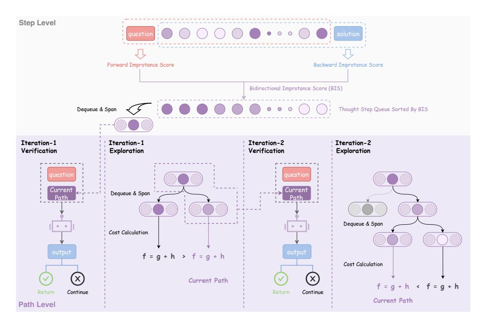

# 1 Introduction

Large Reasoning Models (LRMs), such as o1 [\(OpenAI et al., 2024\)](#page-11-0), R1 [\(DeepSeek-AI, 2025\)](#page-10-0) and QwQ [\(Qwen Team, 2025\)](#page-11-1), have demonstrated remarkable advancements in performance on a variety of complex tasks. These significant leaps are largely attributable to their capacity for sophisticated long-form reasoning, often operationalized through the generation of extended chainof-thought (CoT) sequences. However, this enhanced reasoning capability introduces a substantial trade-off in terms of computational overhead during inference [\(Xia et al., 2025;](#page-12-0) [Aggarwal & Welleck,](#page-10-1) [2025\)](#page-10-1). The generation and processing of these lengthy CoTs inherently demand greater storage and computational resources. Consequently, the escalating costs associated with these long CoTs pose a considerable barrier to the practical application and widespread adoption of LRMs, particularly in resource-constrained environments such as on-device or end-point deployments [\(Hu et al., 2024;](#page-10-2) [Allal et al., 2025\)](#page-10-3) where computational budgets and memory footprints are strictly limited.

To address these efficiency concerns, a growing body of recent research has begun to investigate long-to-short methodologies. These approaches aim to significantly condense the reasoning processes inherent in LRMs, thereby enhancing their inference efficiency [\(Lee et al., 2025b;](#page-11-2) [Han et al., 2025;](#page-10-4) [Aytes et al., 2025;](#page-10-5) [Xia et al., 2025;](#page-12-0) [Qu et al., 2025;](#page-11-3) [Hao et al., 2024\)](#page-10-6). For example, [Chen et al.](#page-10-7) [\(2025\)](#page-10-7) identify and conceptualize the overthinking phenomenon in LRMs, where models may engage in unnecessarily verbose or circuitous reasoning. They propose to mitigate this by specifically training the models to favor more concise responses. In a complementary effort, [Xiang et al.](#page-12-1) [\(2025\)](#page-12-1) introduce a prompting strategy that guides LRMs to articulate their reasoning in shorter, more atomic steps, which cumulatively leads to a reduction in the total length of the generated thought process.

Rather than addressing a singular, narrowly defined issue within LRMs, this work introduces a unified framework designed to identify and isolate the most essential thoughts from the extensive reasoning chains produced by these models. An effective intermediate thinking step should ideally possess two core properties: (1) *High-quality*: The step's logical progression and substantive content must be accurate, sound, and directly relevant to the specific context and boundaries of the question. (2) *Informativeness*: The step must make a demonstrable contribution towards the target solution by furnishing critical information. This characteristic holds even if an intermediate conclusion, while perhaps imperfect or erroneous in isolation, ultimately facilitates the derivation of the correct final answer. The main challenges are two-fold:

- 1. How to identify high-quality and informative steps at the *step-level* ?
- 2. How to effectively assemble individual reasoning steps into a concise and effective reasoning path at the *path-level* ?

We propose A\*-Thought, a novel framework for automatically discovering compact and effective reasoning paths by leveraging signals at both step and path levels. At the step level, a bidirectional importance estimation mechanism quantifies the significance of each thinking step based on its relevance to both the question and the prospective solution. At the path level, A\* search is employed to efficiently navigate the exponential search space. This search utilizes cost functions that assess two key aspects: the quality of the current path and the conditional self-information of the solution given this path. These assessments collectively inform the estimated current and future cost to reach a desirable final solution. Experimental results demonstrate that A\*-Thought successfully learns effective LRMs across diverse inference budgets, surpassing several representative baselines.

The primary contributions of this research are delineated as follows:

- We design a step-level bidirectional importance score (BIS) to evaluate the criticality of individual sentences. This scoring mechanism serves to significantly enhance effectiveness of the A\* search procedure compared to standard sampling techniques.
- We introduce a path-level A\* search algorithm tailored for compressing lengthy CoTs from LRMs. This algorithm strategically considers both current path quality and estimated future costs to optimize LRM performance under stringent output length constraints.
- The proposed algorithm demonstrates substantial empirical gains over several representative baselines. For instance, for QwQ-32B in concise output scenarios, it achieves a 3.53× improvement in accuracy.

> **[图片提取文字 (无描述)]:**
> Step Level Forward Improtance Score Backward Improtance Score Bidirectional Improtance Score (BIS) Thought Step Queue Sorted By BIS Dequeue & Span Iteration-1 Iteration-2 Iteration-1 Iteration-2 Verification Verification Exploration Exploration Current Current Dequeue & Span Path Path Dequeue & Span Cost Calculation  $f = g + h \rightarrow f = g + h$ Cost Calculation Current Path f = g + h < f = g + hContinue Return Continue Return Current Path Path Level

Figure 2: Illustration of A\*-Thought, a long-CoT compression method. A\*-Thought leverages signals at both the step and path levels. At the step-level, a bidirectional importance score assesses relevance to both the question and the solution. At the path-level, an A\* search algorithm is employed, with cost functions designed to consider both current path quality and estimated future cost.

