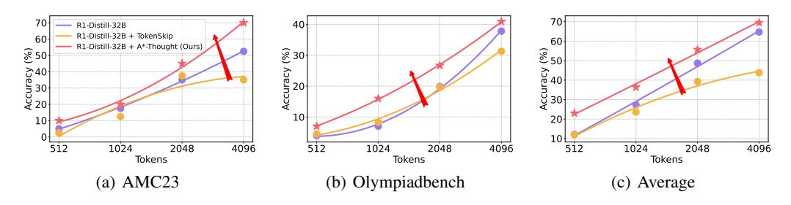

# 4 Experiments

#### 4.1 Setup

**Backbones** To evaluate the performance of A\*-thought for compressing long CoT sequences for modern LRMs, we apply several compression methods to representative reasoning models, including QwQ-32B3, DeepSeek-R1-Distill-Qwen-32B4, and s1.1-32B5.

**Training Data and Verification Model** We utilize the long CoT data released by Muennighoff et al. (2025)6 as the original CoT data and employ the corresponding distilled model, s1.1-32B, as the verification model, following the approach detailed in Section 3.2.

**Benchmarks** We employ the following mathematical reasoning tasks in our experiments, all of which demand complex reasoning capabilities from LRMs: MATH500 (Lightman et al., 2023), AMC23 (AMC, 2025), OlympiadBench (He et al., 2024), and GSM8K (Cobbe et al., 2021). Model performance is evaluated using the following metrics:

- Accuracy: The proportion of model outputs that match the ground-truth answers, measuring the model's correctness.
- *Length*: The average length (i.e., number of tokens) of the model's response; longer responses typically incur higher inference costs.
- Accuracy per Computation Unit (ACU) (Ma et al., 2025b): A metric assessing the trade-off between performance and efficiency, calculated as ACU = Accuracy/Length.

**Baselines** We compare our method against the following baselines:

- *Chain-of-Draft* (CoD) (Xu et al., 2025): A prompt-based method designed to guide LRMs in generating compact reasoning steps, each typically comprising fewer than five words.
- *Break-the-Chain* (BtC) (Ding et al., 2024): A prompt-based method employing specialized prompting strategies to encourage LRMs to utilize shortcuts, thereby enabling them to rapidly explore reasoning clues while bypassing detailed intermediate steps.
- *TokenSkip* (Xia et al., 2025): A training-based method that first employs prompt compression (Jiang et al., 2024) to shorten long CoT data, and then uses this compressed data to train an efficient reasoning model.

For comparison, we also report the performance of the QwQ-32B model directly fine-tuned on the s1K-1.1 dataset.

3https://huggingface.co/Qwen/QwQ-32B

4https://huggingface.co/deepseek-ai/DeepSeek-R1-Distill-Qwen-32B

5https://huggingface.co/simplescaling/s1.1-32B

&lt;sup>6https://huggingface.co/datasets/simplescaling/s1K-1.1

**Training Details** We trained all models, including training-based baselines and our proposed method, for 3 epochs with a peak learning rate of  $1\times 10^{-5}$  and a warm-up ratio of 0.1. Training was conducted on 8 NVIDIA A100 80G GPUs, using a per-GPU batch size of 1 and 8 gradient accumulation steps. For our proposed method, the default hyperparameters were set as  $\alpha=0.5$  (Eq. 4) and  $\beta=0.1$  (Eq. 8). The lower bound for the verification depth,  $k_{\min}$ , is set to 5, while the upper bound for the search tree depth,  $k_{\max}$ , is set to 20. The exploration size W was set to 2.

Table 1: Experimental results of different long-to-short methods across several benchmarks. The best results are shown in **bold**, and the second-best results are underlined.

| Methods                  | MAT     | H500            | AM          | IC23       | Olympi      | adBench         | GS          | M8K            | Ave         | rage    | ACU         |
|--------------------------|---------|-----------------|-------------|------------|-------------|-----------------|-------------|----------------|-------------|---------|-------------|
| 1,1011040                | Acc.(†) | Len.(\( \psi\)) | Acc.(†)     | Len.(\( )  | Acc.(†)     | Len.(\( \psi\)) | Acc.(†)     | Len.(\( \psi\) | Acc.(†)     | Len.(↓) |             |
|                          |         |                 | I           | Budget: 51 | 2 Tokens    |                 |             |                |             |         |             |
| QwQ-32B                  | 10.8    | 512.00          | 2.5         | 512.00     | 3.3         | 512.00          | 27.6        | 511.97         | 11.1        | 511.99  | 2.16        |
| QwQ-32B w/ s1K-1.1       | 9.6     | 512.00          | 7.5         | 512.00     | 3.4         | 512.00          | 28.8        | 512.00         | 12.3        | 512.00  | 2.41        |
| + CoD                    | 10.6    | 512.00          | 5.0         | 512.00     | 4.2         | 512.00          | <u>29.0</u> | 511.96         | 12.2        | 511.99  | 2.38        |
| + BtC Effective Shortcut | 10.2    | 512.00          | <u>12.5</u> | 512.00     | 4.2         | 512.00          | 26.7        | 511.95         | <u>13.4</u> | 511.99  | <u>2.62</u> |
| + BtC Skip Steps         | 9.6     | 512.00          | 5.0         | 512.00     | <u>5.6</u>  | 512.00          | 28.9        | 511.95         | 12.3        | 511.99  | 2.40        |
| + TokenSkip              | 10.8    | 511.05          | 2.5         | 512.00     | 3.9         | 512.00          | 26.4        | 508.11         | 10.9        | 510.79  | 2.13        |
| + A*-Thought             | 33.2    | 491.92          | 15.0        | 508.60     | 12.0        | 509.74          | 57.4        | 451.76         | 29.4        | 490.51  | 5.99        |
|                          |         |                 | В           | udget: 102 | 24 Tokens   |                 |             |                |             |         |             |
| QwQ-32B                  | 16.6    | 1016.85         | 15.0        | 1024.00    | 6.4         | 1023.93         | 49.1        | 951.96         | 21.8        | 1004.19 | 2.17        |
| OwO-32B w/ s1K-1.1       | 24.8    | 1023.52         | 17.5        | 1024.00    | 8.9         | 1023.94         | 60.1        | 999.80         | 27.8        | 1017.82 | 2.73        |
| + CoD                    | 24.8    | 1023.37         | 5.0         | 1024.00    | 7.3         | 1023.64         | 60.1        | 996.84         | 24.3        | 1016.96 | 2.39        |
| + BtC Effective Shortcut | 23.4    | 1022.88         | 7.5         | 1024.00    | 7.7         | 1023.92         | 61.3        | 1000.44        | 25.0        | 1017.81 | 2.45        |
| + BtC Skip Steps         | 23.4    | 1023.25         | 5.0         | 1024.00    | 7.6         | 1024.00         | 59.9        | 1000.93        | 24.0        | 1018.05 | 2.36        |
| + TokenSkip              | 22.4    | 995.96          | 12.5        | 1024.00    | 6.4         | 1019.61         | 49.7        | 934.74         | 22.8        | 993.58  | 2.29        |
| + A*-Thought             | 50.8    | 858.28          | 37.5        | 928.25     | 22.3        | 954.74          | 81.9        | 688.69         | 48.1        | 857.49  | 5.61        |
|                          |         |                 | В           | udget: 204 | 18 Tokens   |                 |             |                |             |         |             |
| QwQ-32B                  | 51.2    | 1844.96         | 25.0        | 1978.60    | 18.4        | 2021.95         | 80.4        | 1245.68        | 43.8        | 1772.80 | 2.47        |
| OwO-32B w/ s1K-1.1       | 60.0    | 1887.15         | 35.0        | 2000.95    | 23.3        | 2012.14         | 88.7        | 1474.00        | 51.8        | 1843.56 | 2.81        |
| + CoD                    | 60.2    | 1894.54         | 30.0        | 2022.35    | 25.5        | 2018.02         | 89.5        | 1490.23        | 51.3        | 1856.29 | 2.76        |
| + BtC Effective Shortcut | 60.8    | 1884.67         | 35.0        | 2004.65    | 23.7        | 2012.43         | 89.8        | 1473.25        | 52.3        | 1843.75 | 2.84        |
| + BtC Skip Steps         | 58.8    | 1884.96         | 35.0        | 2005.67    | 23.2        | 2013.05         | 89.2        | 1490.39        | 51.6        | 1848.52 | 2.79        |
| + TokenSkip              | 53.6    | 1685.34         | 35.0        | 1923.25    | 19.7        | 1943.68         | 86.7        | 1272.03        | 48.8        | 1706.08 | 2.86        |
| + A*-Thought             | 69.2    | 1271.76         | 45.0        | 1540.30    | 30.3        | 1625.89         | 91.2        | 843.69         | 58.9        | 1320.41 | 4.46        |
|                          |         |                 | В           | udget: 409 | 06 Tokens   |                 |             |                |             |         |             |
| QwQ-32B                  | 75.4    | 2798.67         | 55.0        | 3456.05    | 36.5        | 3645.22         | 85.8        | 1348.24        | 63.2        | 2812.05 | 2.25        |
| QwQ-32B w/ s1K-1.1       | 79.6    | 2693.27         | 65.0        | 3485.95    | 42.4        | 3500.66         | 95.2        | 1624.11        | 70.6        | 2826.00 | 2.50        |
| + CoD                    | 80.2    | 2719.00         | 60.0        | 3354.28    | 42.0        | 3488.67         | <u>95.0</u> | 1655.80        | 69.3        | 2804.44 | 2.47        |
| + BtC Effective Shortcut | 79.6    | 2696.72         | 57.5        | 3355.43    | <u>42.4</u> | 3493.28         | 94.8        | 1636.45        | 68.6        | 2795.47 | 2.45        |
| + BtC Skip Steps         | 80.2    | 2710.83         | 57.5        | 3399.93    | 41.8        | 3494.41         | 94.9        | 1651.37        | 68.6        | 2814.14 | 2.44        |
| + TokenSkip              | 74.4    | 2336.29         | 52.5        | 3156.68    | 37.8        | 3289.44         | 94.8        | 1412.87        | 64.9        | 2548.82 | <u>2.55</u> |
| + A*-Thought             | 78.8    | 1699.78         | 65.0        | 2385.85    | 40.1        | 2546.45         | 93.1        | 874.54         | 69.3        | 1876.66 | 3.69        |

#### 4.2 Main Results

The detailed experimental results, presented in Table 1, yield the following key insights:

**Up to 2.39**× accuracy and 2.49× ACU improvements in low-budget scenarios. Specifically, across all examined benchmarks, A\*-Thought improve the average accuracy of QwQ-32B from 12.3 to 29.4 when the inference budget is constrained to 512 tokens. Concurrently, the ACU score improves from 2.41 to 5.99. Furthermore, in experiments with inference budgets of 1024 and 2048 tokens, A\*-Thought consistently attained superior accuracy and the shortest response lengths.

Up to 33.59% length reduction without substantial accuracy drop in the 4096-token setting. For instance, for the QwQ-32B model, A\*-Thought decreased the average response length from 2826.00 to 1876.66 tokens. This significant length reduction resulted in only a slight decrease in average accuracy (from 70.6% to 69.3%). Importantly, A\*-Thought also attained the highest ACU score in this setting, outperforming both the prompt-based and the training based baselines.

**Compatible with several models, A\*-Thought demonstrates generalizability.** Figure 4 and Figure 5 display the ACU and performance curves on three distinct backbone models: QwQ-32B, R1-Distill-32B, and s1.1-32B.7 The results demonstrate A\*-Thought's effectiveness across these LRMs, where it achieves the highest efficiency and accuracy under various budget conditions.

&lt;sup>7Detailed results are provided in Appendix D.

> **[图片提取文字 (无描述)]:**
> - R1-Distill-32B - s1.1-32B + CoD + CoD + BtC Effective Shortcut + BtC Effective Shortcut QwQ-32B + BtC Skip Steps + BtC Skip Steps + CoD + TokenSkip + TokenSkip + A\*-Thought + A\*-Thought + BtC Effective Shortcut + BtC Skip Steps + TokenSkip + A\*-Thought 4096 512 512 2048 1024 4096 2048 1024 512 4096 2048 1024 Tokens Tokens Tokens (b) R1-Distill-32B (c) s1.1-32B

Figure 4: ACU on different methods, which reflects performance-to-efficiency ratio of LRMs.

> **[图片提取文字 (无描述)]:**
> R1-Distill-32B R1-Distill-32B + TokenSkip 60 60 R1-Distill-32B + A\*-Thought (Ours) § 50∙ € 30 850⋅ Accuracy 20: Accuracy 00. Accuracy 00 10 20 10 0 10 512 2048 4096 512 1024 4096 2048 4096 1024 2048 512 1024 Tokens Tokens Tokens (a) AMC23 (b) Olympiadbench (c) Average

Figure 5: Performance of R1-Distill-32B augmented using TokenSkip and A\*-Thought. "Average" denotes the average accuracy of the model in MATH500, AMC23, OlympiadBench, and GSM8K.

