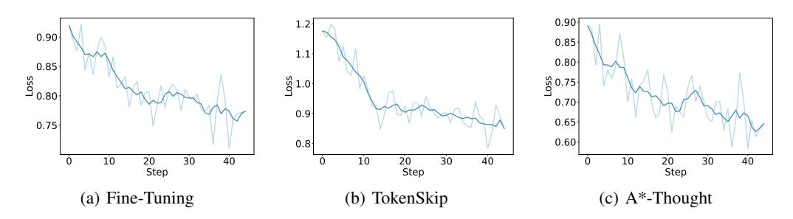

# 5 Analysis

#### 5.1 Performance on More Benchmarks

To verify the generalization capabilities of A\*-Thought, we conducted supplementary evaluations on the out-of-domain benchmarks LiveCodeBench and MMLU, as shown in Table 2. Although our model was trained exclusively on mathematical tasks, the results demonstrate that it effectively learned the A\*-Thought reasoning pattern. This led to improved performance and higher inference efficiency, even on these non-mathematical tasks.

<span id="page-7-2"></span>

| Table 2: Results of A | f-Thought on out-of | f-domain benchmarks. |
|-----------------------|---------------------|----------------------|
|                       |                     |                      |

| Methods            | LiveCo       | deBench | MN         | <b>ILU</b>    | Ave          | rage                   | ACU  |
|--------------------|--------------|---------|------------|---------------|--------------|------------------------|------|
|                    | Acc.(\u00e7) | Len.(↓) | Acc.(†)    | Len.(\dagger) | Acc.(\u00e7) | Len. $^{(\downarrow)}$ |      |
| Budget: 512 Tokens |              |         |            |               |              |                        |      |
| QwQ-32B            | 0.0          | 512.00  | 37.6       | 511.94        | 18.8         | 511.97                 | 3.67 |
| + A*-Thought       | 4.5          | 509.53  | 56.7       | 398.57        | 30.6         | 454.05                 | 6.74 |
|                    |              | Budge   | et: 1024 T | okens         |              |                        |      |
| QwQ-32B            | 0.0          | 1021.94 | 57.4       | 956.90        | 28.7         | 989.42                 | 2.90 |
| + A*-Thought       | 11.8         | 986.02  | 71.9       | 573.30        | 41.9         | 779.66                 | 5.37 |
|                    |              | Budge   | et: 2048 T | okens         |              |                        |      |
| QwQ-32B            | 3.5          | 1977.58 | 75.2       | 1323.26       | 39.4         | 1650.42                | 2.38 |
| + A*-Thought       | 24.5         | 1734.28 | 79.0       | 671.41        | 51.8         | 1202.85                | 4.30 |
|                    |              | Budge   | et: 4096 T | okens         |              |                        |      |
| QwQ-32B            | 12.0         | 3586.93 | 79.5       | 1584.05       | 45.8         | 2585.49                | 1.77 |
| + A*-Thought       | 39.0         | 3044.51 | 80.3       | 733.90        | 59.7         | 1889.21                | 3.16 |

#### 5.2 Analysis on the Effect of A\* Search

Table 3 presents an ablation study on the value of  $k_{\rm min}$  in the A\*-search process. The results show that with  $k_{\rm min}=15$  and a 4K-token budget, the A\*-Thought model consistently outperformed the strongest baseline across all benchmarks. Importantly, this performance was also achieved with higher token efficiency during inference.

<span id="page-8-0"></span>

| Table 3: Effect of the exploration step | limit $k_{\min}$ on mode | l performance. |
|-----------------------------------------|--------------------------|----------------|
|-----------------------------------------|--------------------------|----------------|

| Methods                      | MATH500 |           | AM      | AMC23      |           | OlympiadBench |         | GSM8K   |         | Average |      |
|------------------------------|---------|-----------|---------|------------|-----------|---------------|---------|---------|---------|---------|------|
| 1/10thous                    | Acc.(†) | Len.(\( ) | Acc.(†) | Len.(↓)    | Acc.(†)   | Len.(↓)       | Acc.(†) | Len.(↓) | Acc.(†) | Len.(↓) | ACU  |
|                              |         |           | J       | Budget: 40 | 96 Tokens | 1             |         |         |         |         |      |
| QwQ-32B                      | 75.4    | 2798.67   | 55.0    | 3456.05    | 36.5      | 3645.22       | 85.8    | 1348.24 | 63.2    | 2812.05 | 2.25 |
| QwQ-32B w/ s1K-1.1           | 79.6    | 2693.27   | 65.0    | 3485.95    | 42.4      | 3500.66       | 95.2    | 1624.11 | 70.6    | 2826.00 | 2.50 |
| + A*-Thought $k_{\min} = 5$  | 78.8    | 1699.78   | 65.0    | 2385.85    | 40.1      | 2546.45       | 93.1    | 874.54  | 69.3    | 1876.66 | 3.69 |
| + A*-Thought $k_{\min} = 15$ | 80.8    | 2184.34   | 67.5    | 2893.68    | 44.2      | 3063.96       | 95.5    | 1229.40 | 72.0    | 2342.85 | 3.07 |

#### 5.3 Training Loss and Training Time

Figure 6 illustrates the training loss for various training-based methods, demonstrating that A\*-Thought achieves the lowest loss. This potential advantage may be attributed to A\*-Thought's utilization of the span around individual thoughts, thereby reducing the negative impact of interrupting the complete thinking process. Furthermore, by considering the quality of the intermediate path during the A\* search process, we ensure the learnability of the compressed data.

> **[图片提取文字 (无描述)]:**
> 0.90 1.2 0.90 0.85 1.1 0.80 0.85 0.80 Poss SS 1.0 S 0.75 0.70 0.9 0.75 0.65 0.8 0.60 20 Step 20 30 40 10 30 40 20 Step 40 Step (c) A\*-Thought (a) Fine-Tuning (b) TokenSkip


<span id="page-8-1"></span>Figure 6: Training loss of the training-based methods discussed, using the QwQ-32B backbone.

Table 4 presents a comparison of compressed data sizes and their corresponding training times. Notably, A\*-Thought exhibits a significantly higher compression ratio than TokenSkip, while achieving a lower training loss. These results further corroborate the efficacy of the proposed A\*-Thought method. A more detailed ablation study on the components of A\*-Thought, along with an analysis of the effect of hyperparameters, is presented in the Appendix.

<span id="page-8-2"></span>Table 4: Amount of the training data and the corresponding time.  $\rho$  denotes the compression rate.

| Training Set | 0                            |                      | Training Time (s)    |                       |
|--------------|------------------------------|----------------------|----------------------|-----------------------|
| Truming Sec  | ming see                     | QwQ-32B              | R1-Distill-32B       | s1.1-32B              |
| s1K-1.1      | 100.00%                      | 13819.60             | 13784.32             | 13638.07              |
| + TokenSkip  | 85.41% (\14.59%)             | 12846.14 (\psi.04%)  | 12700.96 (\p1.86%)   | 12679.52 (\pm, 7.03%) |
| + A*-Thought | 31.31% (\( \dagger 68.69\% ) | 10468.20 (\pm24.25%) | 10809.50 (\\21.58\%) | 10550.03 (\\22.64\%)  |

## 5.4 Case Study

Figure 7 showcases a representative example of outputs from models trained with and without A\*-Thought, given an identical question. While both models arrive at the correct solution, A\*-Thought fosters a more streamlined and focused thinking path. Appendix G provides further comprehensive examples. These examples demonstrate that A\*-Thought can train models to adopt a more concise thinking process. We believe this approach, with additional effort and integration with advanced training techniques, holds the potential to break through the current bottlenecks in LRMs.

Mikka wants to order a pizza with two toppings. He has 8 different toppings to choose from. How many different pizzas could he order?

```
Okay, so Mikka wants to order a pizza with two different toppings, and there are 8 different toppings available. I need to figure out how many different pizzas be could order. Hum, let me think. First, when the problem says "two different toppings," that means Mikka is choosing two distinct toppings from the 8 available. The question is asking about the number of different combinations possible. Since the order of the toppings on the pizza doesn't matter—like, a pizza with peoperoui and mustrooms is the same as a pizza with mushrooms and peoperoui—this is a combination both.

C(8, 2) = \frac{8!}{2! \cdot (8 - 2)!} = \frac{8!}{2! \cdot (8 - 2)!} = \frac{8!}{2! \cdot (8 - 2)!} = \frac{8!}{2! \cdot (8 - 2)!} = \frac{8!}{2! \cdot (8 - 2)!} = \frac{8!}{2! \cdot (8 - 2)!} = \frac{8!}{2! \cdot (8 - 2)!} = \frac{8!}{2! \cdot (8 - 2)!} = \frac{8!}{2! \cdot (8 - 2)!} = \frac{8!}{2! \cdot (8 - 2)!} = \frac{8!}{2! \cdot (8 - 2)!} = \frac{8!}{2! \cdot (8 - 2)!} = \frac{8!}{2! \cdot (8 - 2)!} = \frac{8!}{2! \cdot (8 - 2)!} = \frac{8!}{2! \cdot (8 - 2)!} = \frac{8!}{2! \cdot (8 - 2)!} = \frac{8!}{2! \cdot (8 - 2)!} = \frac{8!}{2! \cdot (8 - 2)!} = \frac{8!}{2! \cdot (8 - 2)!} = \frac{8!}{2! \cdot (8 - 2)!} = \frac{8!}{2! \cdot (8 - 2)!} = \frac{8!}{2! \cdot (8 - 2)!} = \frac{8!}{2! \cdot (8 - 2)!} = \frac{8!}{2! \cdot (8 - 2)!} = \frac{8!}{2! \cdot (8 - 2)!} = \frac{8!}{2! \cdot (8 - 2)!} = \frac{8!}{2! \cdot (8 - 2)!} = \frac{8!}{2! \cdot (8 - 2)!} = \frac{8!}{2! \cdot (8 - 2)!} = \frac{8 \times 7}{2 \times 1} = 28.

Therefore, Mikka can order 28 different pizzas Mikka could order is 28.

Thus, the number of different pizzas Mikka could order is 28.
```

<span id="page-9-0"></span>Figure 7: Responses generated by QwQ-32B models trained with and without A\*-Thought. Red box represents the question, purple box represents the thinking process, blue box represents the solution.

#### **6** Related Works

Recent LRMs achieve complex reasoning capabilities, often described as "deep thinking", through significant computational effort during inference, a process sometimes referred to as test-time scaling. However, studies indicate that models utilizing long CoT processes can be susceptible to excessive computation, leading to inefficiencies often termed "overthinking". Consequently, considerable research has aimed to improve reasoning efficiency. Primary strategies include the development of refined prompting techniques (Renze & Guven, 2024; Ding et al., 2024; Han et al., 2025; Lee et al., 2025a; Aytes et al., 2025; Xu et al., 2025; Ma et al., 2025a) and methods for CoT compression (Hao et al., 2024; Cheng & Durme, 2024; Shen et al., 2025; Zhang et al., 2025; Su et al., 2025).

Specific approaches have targeted token-level or path-level optimizations. For example, Token-Skip (Xia et al., 2025) attempts to focus computation by selectively processing tokens deemed most relevant to the input query while omitting less pertinent ones. Another method, Retro-Search (Lu et al., 2025), inspired by Monte Carlo Tree Search, explores numerous potential reasoning paths within long CoT structures. Its goal is to mitigate redundancy across multiple paths (overthinking) while ensuring adequate exploration within individual paths (avoiding underthinking), issues potentially exacerbated by frequent shifts in reasoning strategy.

In contrast to methods focusing on specific causes of redundancy within long CoT, this paper proposes a heuristic approach. We employ a bidirectional importance score to guide the A\* search algorithm. The objective is to identify a computationally efficient yet effective reasoning pathway, thereby contributing to the development of more resource-efficient LRMs.

#### 7 Conclusion

We introduce A\*-Thought, an innovative CoT compression algorithm designed to enhance the reasoning efficiency of contemporary LRMs. Our approach meticulously crafts concise reasoning pathways. This is achieved by first evaluating the necessity of individual reasoning steps using a novel bidirectional importance score. Subsequently, the thinking steps are assembled into a compact and coherent reasoning chain by employing a path-level A\* search algorithm. A key aspect of our A\* search process is the design of specialized cost functions. These functions assess not only the quality of the current partial reasoning path but also estimate the potential cost to complete the thought process, thereby providing helpful guidance for selecting the most promising reasoning trajectories. Experimental results demonstrate that A\*-Thought can outperform several representative baselines.

