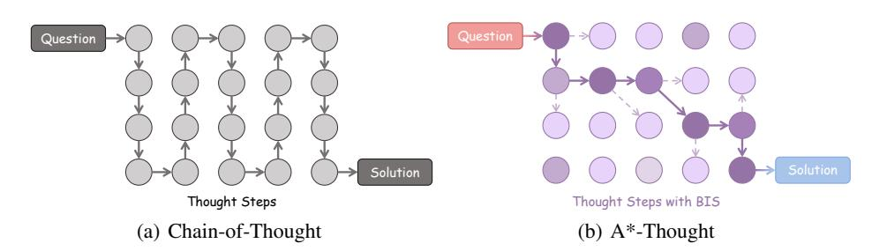

# A\*-Thought: Efficient Reasoning via Bidirectional Compression for Low-Resource Settings

Xiaoang Xu1 Shuo Wang2\* Xu Han2,4,5 Zhenghao Liu3 Huijia Wu1 Peipei Li1 Zhiyuan Liu2,4,5 Maosong Sun2,4,5 Zhaofeng He1\*

1Beijing University of Posts and Telecommunications

2Dept. of Comp. Sci. & Tech., Tsinghua University, Beijing, China

3Northeastern University 4Institute for AI, Tsinghua University, Beijing, China

5Beijing National Research Center for Information Science and Technology

#### **Abstract**

Large Reasoning Models (LRMs) achieve superior performance by extending the thought length. However, a lengthy thinking trajectory leads to reduced efficiency. Most of the existing methods are stuck in the assumption of overthinking and attempt to reason efficiently by compressing the Chain-of-Thought, but this often leads to performance degradation. To address this problem, we introduce A\*-Thought, an efficient tree search-based unified framework designed to identify and isolate the most essential thoughts from the extensive reasoning chains produced by these models. It formulates the reasoning process of LRMs as a search tree, where each node represents a reasoning span in the giant reasoning space. By combining the A\* search algorithm with a cost function specific to the reasoning path, it can efficiently compress the chain of thought and determine a reasoning path with high information density and low cost. In addition, we also propose a bidirectional importance estimation mechanism, which further refines this search process and enhances its efficiency beyond uniform sampling. Extensive experiments on several advanced math tasks show that A\*-Thought effectively balances performance and efficiency over a huge search space. Specifically, A\*-Thought can improve the performance of OwO-32B by 2.39× with low-budget and reduce the length of the output token by nearly 50% with high-budget. The proposed method is also compatible with several other LRMs, demonstrating its generalization capability. The code can be accessed at: https://github.com/AI9Stars/AStar-Thought.

> **[图片提取文字 (无描述)]:**
> Question Solution Thought Steps Thought Steps with BIS (a) Chain-of-Thought (b) A\*-Thought

Figure 1: Illustration of the comparison between the standard CoT and the proposed A\*-Thought. In A\*-Thought, each thinking step is assigned a bidirectional importance score (BIS), represented by varying color shades. Guided by the carefully-designed cost functions, A\*-Thought efficiently arrives at the solution using fewer steps, reducing the redundancy inherent in the original CoT.

\* Corresponding authors.

