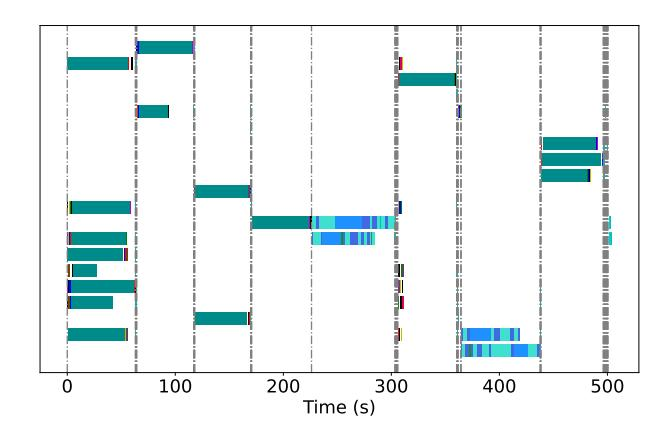

# 2 SIMULATION OF LLM AGENT INTERACTION

#### 2.1 Background

While simulation environments can be diverse with complex action spaces and interactions, the high-level procedure of a simulation generally follows a common pattern as outlined in Algorithm 1. In this pattern, agents determine future actions based on the current world states as well as their internal states, and these actions affect the world as the simulation progresses. Note the *agent.proceed* and *world.step* functions are defined by the agent developers and environment respectively, and can be implemented by manual rules or via invoking LLMs (or both) for decision making.

To illustrate the challenge of achieving efficient simulation, we use GenAgent as a concrete example within the broad family of simulations for LLM agent interaction. GenAgent proposes a comprehensive agent architecture and interaction mechanisms that have inspired many subsequent works. Their concepts and workflows are widely adopted in the community. In GenAgent, 25 agents inhabit a world called SmallVille, akin to a grid-based game. Each agent possesses its own personality, social relationships, and daily routines.

> **[图片提取文字 (无描述)]:**
> Time (s)

Figure 1. A snippet of the execution trace of a simulation. The x-axis shows the elapsed execution time, with each row representing an agent's stream of LLM invocations. Colored bars denote different agent functions, and black dashed vertical lines indicate the completion of each step.

They navigate the world, interact with objects, and converse with other agents. The *agent.proceed* function on line 6 of Algorithm [1](#page-1-0) is expanded to Algorithm 2 to detail several steps: perceiving surroundings, planning actions based on recent events, recalling relevant past events from memory, following a structured daily routine, and occasionally reflecting on their actions or experiences. Each of these steps can involve LLM calls. Each step corresponding to ten seconds in simulated time in GenAgent.

#### Algorithm 2 Proceed function in GenAgent

- 1: Input: agent, world
- 2: Output: action
- 3: perceived events ← agent.*perceive*(world)
- 4: retrieved events ← agent.*retrieve*(perceived events)
- 5: action ← agent.*plan*(world, retrieved events)

#### 2.2 Motivation and Challenges

#### Imbalanced workload reduces available parallelism.

Although line 5 in Algorithm [1](#page-1-0) suggests that parallelism can be achieved up to the number of agents, the effective parallelism is often much less primarily due to the imbalanced workload across agents. As illustrated in Figure 1, there are moments when many agents send out LLM requests uniformly. However, for the majority of the execution time, a few agents dominate each step, resulting in prolonged idle periods for many other agents who issue no LLM queries. This sparsity is an inherent feature of simulation, as different agents have their own schedules and encountered events, making even distributions unlikely. Additionally, as shown in Figure 1, even for the same type of LLM calls, completions can vary significantly depending on inputs provided

> **[图片提取文字 (无描述)]:**
> Step: N-1 Step: N Step: N+1 (a) Global synchornization В В (b) Real dependency A Α В Dependency Agent

Figure 2. The dependency between agents' tasks is introduced by temporal causality. The top illustration shows an overly strict enforcement of this dependency, while the bottom illustration depicts a case of actual dependency.

by different agents, further introducing imbalance. Our measurements indicate that for a full-day simulation of 25 agents, there are, on average, only 1.94 concurrent LLM queries throughout the simulation.

False Dependency. While the workload imbalance across agents might be inevitable, low parallelism is not. We found that the primary cause of idleness is the overly strict enforcement of time causality. Requiring all events in one time step to complete before advancing to the next step introduces unnecessary dependencies. As shown in Figure 2, this approach creates an implicit all-to-all dependency across agents in consecutive steps. However, some agents, such as agent A, may be sufficiently isolated and unable to interact with others, thus not creating dependencies on agents like B or C. Our trace analysis for a whole day simulation of GenAgent indicates that, on average, each agent is dependent on only 1.85 agents (including itself) from the prior step, far less than the default 25. The issue of false dependencies worsens as the agent count grows, as more false dependencies are enforced, diminishing the benefits of increased parallelism. Although agents' behaviors are driven by responses from LLMs, which limits a scheduler's ability to optimally manage dependencies without foresight, agent behavior is still somewhat predictable. Agents are constrained by their movement speed and limited action space, providing an opportunity to reduce most false dependencies through analysis of agents' temporal-spatial relationships.

Requests of Different Priorities. The dependency lens also reveals something unique about simulation compared to common LLM services like chatbots: there are long critical paths in the task of simulation, consisting of a chain of LLM calls that cannot be parallelized. Therefore, requests have different priorities; those on the critical path should be served before non-critical requests to minimize the overall completion time as much as possible.

