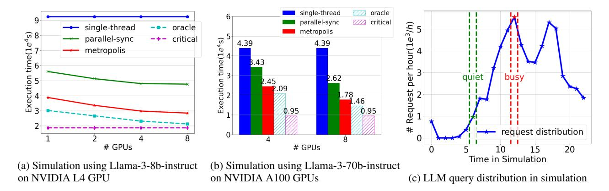
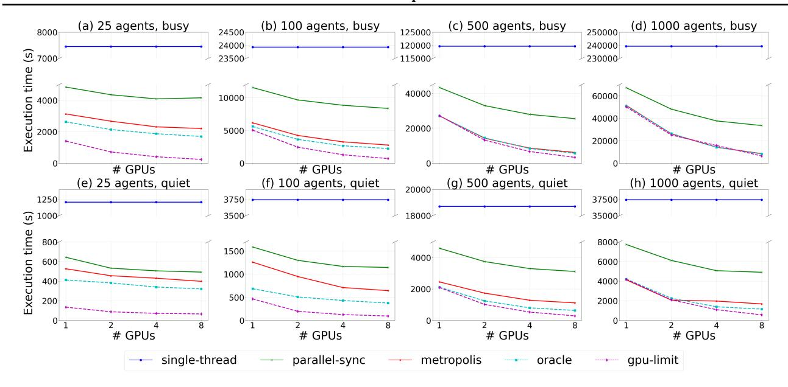
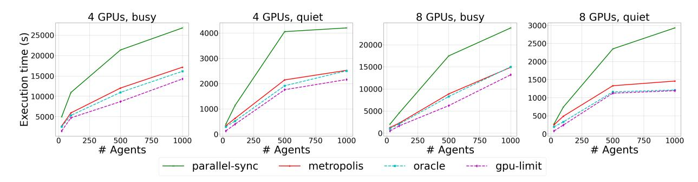
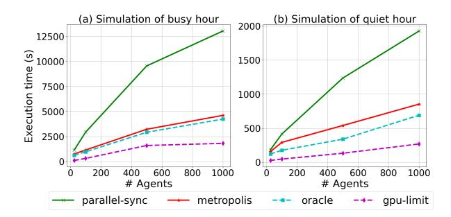

# 4 EVALUATION

In the evaluation, we aim to answer the following questions:

- Does AI Metropolis effectively enhance parallelism by tracking real dependencies, and how does this translate to shorter completion times?
- Does AI Metropolis scale as the size of the simulated world increases and the number of agents grows?
- Given that AI Metropolis does not eliminate all false dependencies as illustrated in [§3.2,](#page-3-0) how well does it perform compared to the optimal solution?

We describe the experimental setup in §4.1 and discuss the performance results of full-day simulations at a small scale in [§4.2,](#page-6-0) which uses the same simulation settings reported in the GenAgent paper. We then examine the performance comparisons as the size of the world increases and the number of agents grows to a thousand, assessing scalability in [§4.3.](#page-7-0) Finally, we conduct a performance breakdown in [§4.4](#page-8-0) to demonstrate the effectiveness of priority scheduling.

#### 4.1 Methodology

Serving Engine. We use SGLang [\(Zheng et al.,](#page-11-0) [2024\)](#page-11-0) (v0.1.17) as the LLM serving engine, as it is not only one of the state-of-the-art LLM serving engines but also lightweight and easy to instrument and modify. For consistent and stable performance benchmark results, we turned off its automatic common prefix caching feature; however, enabling the cache generally provides about a 20% throughput gain across all settings.

Model and Hardware Platform. We benchmarked AI Metropolis with various models and GPUs to assess its effectiveness across different sizes and complexities. We chose state-of-the-art open-source LLMs from the Meta Llama-3 instruct series [\(Meta,](#page-11-0) [2024\)](#page-11-0). Community benchmarks [\(Chi](#page-10-0)[ang et al.,](#page-10-0) [2024\)](#page-10-0) indicate that the smallest 8B model already surpasses the ChatGPT-3.5 model used in the original GenAgent paper, making it ideal for performance evaluation. We

> **[图片提取文字 (无描述)]:**
> single-thread 11/1/2 oracle parallel-sync critical 5 (4/5 single-thread oracle metropolis time(1*e*4s) 9 2 8  $(1e^4s)$ parallel-sync -+- critical 4.39 4.39 metropolis 3.43 ţi busy Execution quiet 2.62 2.45 Execution 2.09 Request .46 0.95 0.95 # request distribution # GPUs # GPUs 20 Time in Simulation (a) Simulation using Llama-3-8b-instruct (b) Simulation using Llama-3-70b-instruct (c) LLM query distribution in simulation on NVIDIA L4 GPU on NVIDIA A100 GPUs

Figure 4. (4a, 4b) End-to-end 25 agents full day simulation completion time with different number of GPUs. (4c) shows the distribution of LLM calls over the simulated hours, note the low activity period during 1am-4am is because all agents are sleeping.

benchmarked our system with both the 8B and 70B models. The 8B model offers a lightweight deployment option, while the 70B model provides advanced capabilities, though at a higher cost. For the Llama-3 8B experiments, we used NVIDIA L4 GPUs on GCP G2 instances, scaling from one to eight GPUs to assess data parallelism. For the Llama-3 70B experiments, we used NVIDIA A100-80GB GPUs, applying tensor parallelism across four GPUs, and expanding to eight GPUs for a hybrid data and tensor parallelism configuration. Additionally, we benchmarked AI Metropolis using the Mixtral-8 × 7B-Instruct-v0.1 [\(Mistral AI,](#page-11-0) [2023\)](#page-11-0) model, a mixture of expert models, on the same A100 platform which can leverage higher data parallelism to reveal more performance characteristics.

Traces. We collected workload traces for 40 simulation days of GenAgent by instrumenting the original implementation [\(Park,](#page-11-0) [2024\)](#page-11-0) and running it multiple times using the same settings reported in the paper. OpenAI GPT-3.5 API service [\(OpenAI,](#page-11-0) [2024b\)](#page-11-0) was used as the LLM engine as the same setting in the paper. On average, each simulation day's trace consists of 56.7k LLM call events. Each event includes the input prompt, configurations, LLM response, calling step, and caller's identity. A separate trace file tracks the agent's movements throughout the simulation. The average length of input tokens is 642.6, and the average length of output tokens is 21.9. We conducted the performance benchmark using the replay mode of AI Metropolis, faithfully replaying these traces to ensure the same movements, interaction patterns, inputs, and the same length of generation output by setting *ignore eos* in SGLang for comparable and stable performance results.

#### 4.2 Full Day Simulation in SmallVille

We benchmark AI Metropolis using the same setup described in the GenAgent paper, which involves 25 agents within a world named SmallVille, a 100x140 grid, running

for a full simulation day.

The following experiment settings are used in benchmark:

- *single-thread* employs a single thread to handle simulation states and issue LLM requests, as per the design adopted by the original implementation to simplify simulator implementation. No parallelism is exposed for LLM requests from different agents.
- *parallel-sync* is a stronger baseline where all agents operate within the same time step and issue LLM requests independently, though global synchronization limits achievable parallelism as discussed in § [2.2.](#page-2-0) We implemented this baseline as a mode of AI Metropolis.
- *oracle* represents the optimal dependency management solution for comparison. This setting constructs an optimal dependency graph by analyzing the full trace and mining all necessary dependencies based on agent interactions. For example, if two agents appear in each other's observation space, they synchronize before and after the step to ensure temporal causality. This setting is unattainable in real systems and serves to illustrate the potential improvement of dependency management. By having an optimal dependency graph, the most available parallelism will be released.
- *critical*refers to the critical path of the simulation, extracted from the optimal dependencies used in the oracle setting. It identifies the path containing the most LLM input and output tokens, setting an lower bound of completion time regardless of available resources.

First, AI Metropolis outperforms the *single-thread* and *parallel-sync* baselines by 2.38× and 1.44× on a single L4 GPU. As more GPUs are added, requiring greater parallelism, the speedup increases to 3.25× and 1.67× respectively on 8 GPUs. We also measured the achieved

> **[图片提取文字 (无描述)]:**
> (a) 25 agents, busy (b) 100 agents, busy (c) 500 agents, busy (d) 1000 agents, busy Execution time (s) # GPUs # GPUs # GPUs # GPUs (f) 100 agents, quiet (g) 500 agents, quiet (h) 1000 agents, quiet (e) 25 agents, quiet Execution time (s) 000 000 000 000 000 000 000 000 000 0 0 1 # GPUs # GPUs # GPUs # GPUs single-thread parallel-sync metropolis oracle gpu-limit

Figure 5. Benchmark of busy (12 a.m. - 1 p.m.) and quiet (6 a.m. - 7 a.m.) hours using Llama-3-8b-instruct on NVIDIA L4 GPUs, with agent counts scaled from 25 to 1000. Single-thread results for 500 and 1000 agents are projected based on workload estimations.

parallelism for each simulation by averaging the number of outstanding requests over the execution time, where AI Metropolis reached 3.46, compared to 0.95 for *single-thread* and 1.94 for *parallel-sync* on 8 GPUs. These results align with the observed speedups, as greater parallelism improves GPU utilization and overall performance.

AI Metropolis also approaches *oracle* performance, reaching 74.7% of the oracle performance on 8 GPUs and up to 82.9% on a single GPU. The gap stems from the longer critical path in AI Metropolis compared to *oracle*, as it conservatively restricts certain agents from advancing to prevent potential temporal causality violations, as elaborated in [§3.](#page-3-0) We further discuss this gap in [§6.](#page-9-0)

A similar trend is observed in benchmarks conducted on A100 GPUs with larger models. AI Metropolis achieves a 2.45× and 1.45× speedup compared to *single-thread* and *parallel-sync*, respectively, and attains 82% of the *oracle* performance on 8 GPUs. Additional speedups are anticipated with higher data parallelism, given the *oracle-tocritical* ratio of 64.7% on A100s versus 88% on L4 GPUs, as memory demands for 70B models (8.75× higher) limit processing capacity.

#### 4.3 Scaling up to a Thousand Agents

Given the limited research on accommodating hundreds of agents, we simulate a larger environment by concatenating multiple SmallVilles into a single, large ville for benchmarking. Agents in each segment replay different traces that we collected independently, but they operate within the same time and space. Since the concatenation approach introduces straightforward parallelism, rather than focusing on the critical path, which is artificially shortened due to the lack of interaction between different parts of the large ville, we introduce *no-dependency* as a more suitable lower bound for completion time when scaling agents. In this setting, all LLM calls can be issued simultaneously, maximizing hardware utilization. In Figure 5, [7](#page-8-0) and [6,](#page-8-0) the *gpu-limit* uses the shorter completion time of the *critical* and *no-dependency* settings. Moreover, for benchmark with a larger number of agents, we opted to focus on two specific intervals from an entire day's simulation, as illustrated in Figure [4c:](#page-6-0) the busy hour (12 PM - 1 PM, approximately 5,000 calls) and the quiet hour (6 AM - 7 AM, approximately 800 LLM calls). This setup shortens experiment time and highlights scaling effects across different workloads, where busy hours feature long conversations, and quiet hours are mainly routine activities with less LLM queries as agents just wake up.

The benefits of AI Metropolis increase with increasing numbers of agents. Figure 5 shows that AI Metropolis achieves closer performance to *oracle* as the number of agents increase: it achieves 90% of *oracle* on one GPU with 100 agents, reaching parity with *oracle* at 500 agents. On 8 GPUs, AI Metropolis improves from 53.1% to 97.0% of *oracle* across settings. Speedups over *single-thread* and *parallel-sync* also scale with agent count, increasing from 3.37× and 1.88× at 25 agents to 19.5× and 4.15× at 500 agents. Unlike *single-thread*, which cannot leverage parallelism, and *parallel-sync*, which suffers from costly synchronization, AI Metropolis utilizes parallelism more effectively, maximizing speedup as agent count grows.

> **[图片提取文字 (无描述)]:**
> 4 GPUs, busy 8 GPUs, busy 4 GPUs, quiet 8 GPUs, quiet ⊙ 25000 Execution # Agents # Agents # Agents # Agents parallel-sync gpu-limit metropolis oracle

Figure 6. Benchmark of busy (12a.m. - 1p.m.) and quiet (6a.m. - 7a.m.) hour using Llama-3-70b-instruct on NVIDIA A100 GPUs with scaling number of agents rom 25 to 1000.

> **[图片提取文字 (无描述)]:**
> (a) Simulation of busy hour (b) Simulation of quiet hour Execution time (s) 10000 5000 5000 2500 # Agents # Agents parallel-sync metropolis oracle gpu-limit

Figure 7. Benchmark of Mistral 8×7 on 8 A100 GPUs, with agent counts scaled from 25 to 1000.

After reaching peak speedup over *parallel-sync* at 500 agents, the speedup plateaus, slightly decreasing to 3.94× at 1000 agents. This is because, as agent count grows relative to available computational resources, even less efficient dependency management achieves adequate hardware utilization. Meanwhile, AI Metropolis reaches 97% of *oracle* performance, indicating that additional parallelism is less effective. This trend appears earlier on a single L4 GPU, where computational resources are more limited. AI Metropolis achieves a maximum speedup of 1.87× over *parallel-sync* at 100 agents, tapering to 1.60× as AI Metropolis's performance approaches *oracle*—from 90.9% at 100 agents to 100% at 500 agents.

Similar trends appear in the quiet hour benchmark, as shown in Figure [5,](#page-7-0) with some variation: the lighter and less frequent LLM calls in the quiet hour benchmark reduce the synchronization overhead for *parallel-sync*, allowing more parallelism. As a result, AI Metropolis shows a smaller speedup over *parallel-sync* with the same agents and GPUs—for instance, 1.28× in the 25-agent, 8-GPU setting, where achieved parallelism is 2.25 for *parallel-sync* and 2.80 for AI Metropolis. By comparison, the busy hour benchmark achieves parallelism values of 1.89 and 3.74 on the same setting, respectively. Nevertheless, as the number of agents increases, the speedup for AI Metropolis rises from 1.28× to 2.79× at 500 agents on 8 GPUs.

Similar trends also hold for larger models on 8 A100 GPUs. AI Metropolis peaks at a 1.97× speedup over *parallel-sync* with 500 agents in the busy hour benchmark and 2.01× in the 1000-agent quiet hour benchmark, as shown in Figure 6. To further explore model variability, we benchmarked the Mistral MoE 8 × 7b model on the same 8 A100 platform, which uses 80% of a 70b model's memory with lighter I/O and computation. With the 8 × 7b MoE model, we observe higher peak speedups of 2.97× and 2.29× over *parallelsync* at 500 agents for busy and quiet hour benchmarks, respectively, due to greater resource availability on the GPUs, which allows for better parallelism utilization.

#### 4.4 Priority Scheduling Breakdown

| # GPUs           | metropolis |       | oracle |       |
|------------------|------------|-------|--------|-------|
|                  | 4          | 8     | 4      | 8     |
| w/ priority (s)  | 8611       | 6148  | 8392   | 5683  |
| w/o priority (s) | 8942       | 7114  | 8484   | 5689  |
| Speedup (%)      | 3.84%      | 15.7% | 1.10%  | 0.11% |

Table 1. Performance breakdown of *metropolis* and *oracle* with and without priority scheduling on L4 GPUs. The first two rows are completion time in seconds.

All the experiments discussed so far have priority scheduling enabled, where every request includes a step count, and requests with smaller counts have higher execution priority. This applies to the *oracle* baseline as well. We repeated the experiment of busy hours with 500 agents on 4 and 8 L4 GPUs for AI Metropolis and the *oracle*, but with priority scheduling turned off.

As shown in Table 1, priority scheduling does not significantly impact performance of *oracle* because it already achieves sufficient parallelism, and its dependency graph is sparse as discussed in [§2.2,](#page-2-0) making priority less critical for unlocking additional parallelism. In contrast, we observed up to a 15.7% speedup for AI Metropolis with priority scheduling. This is because the conservative rules

defined in [§3.2](#page-3-0) make agents falling behind to block others more frequently. Priority scheduling reduces this blocking, allowing AI Metropolis to perform closer to the *oracle*. With priority enabled, the average achieved parallelism in the 500-agent, 8-GPU benchmark increases from 41.9 to 50.9 for AI Metropolis, compared to a minor increase from 69.4 to 69.9 for *oracle*.

