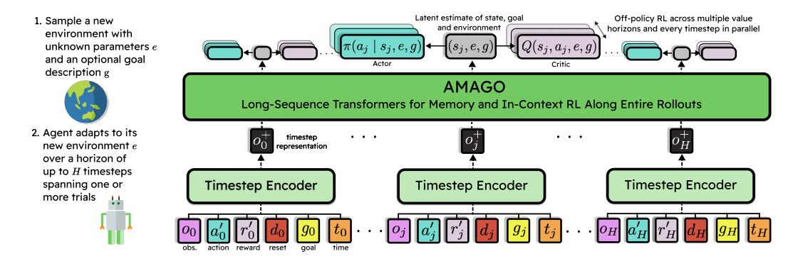

# 1 INTRODUCTION

Reinforcement Learning (RL) research has created effective methods for training *specialist* decisionmaking agents that maximize one objective in a single environment through trial-and-error [\[1,](#page-9-0) [2,](#page-9-1) [3,](#page-9-2) [4,](#page-9-3) [5\]](#page-9-4). New efforts are shifting towards developing *generalist* agents that can adapt to a variety of environments that require long-term memory and reasoning under uncertainty [\[6,](#page-9-5) [7,](#page-9-6) [8,](#page-9-7) [9\]](#page-9-8). One of the most promising approaches to generalist RL is a family of techniques that leverage sequence models to actively adapt to new situations by learning from experience at test-time. These "in-context" agents use memory to recall information from previous timesteps and update their understanding of the current environment [\[10,](#page-9-9) [11\]](#page-9-10). In-context RL's advantage is its simplicity: it reduces partial observability, generalization, and meta-learning to a single problem in which agents equipped with memory train in a collection of related environments [\[12,](#page-9-11) [13,](#page-9-12) [14\]](#page-9-13). The ability to explore, identify, and adapt to new environments arises implicitly as agents learn to maximize returns in deployments that may span multiple trials [\[13,](#page-9-12) [15,](#page-9-14) [16\]](#page-9-15).

Effective in-context agents need to be able to scale across two axes: 1) the length of their planning horizon, and 2) the length of their effective memory. The earliest versions of this framework [\[10,](#page-9-9) [11,](#page-9-10) [17\]](#page-9-16) use recurrent networks and on-policy learning updates that do not scale well across either axis. Transformers [\[18\]](#page-9-17) improve memory by removing the need to selectively write information many timesteps in advance and turning recall into a retrieval problem [\[19\]](#page-9-18). Efforts to replace recurrent policies with Transformers were successful [\[20,](#page-9-19) [21\]](#page-9-20), but long-term adaptation remained challenging, and the in-context approach was relegated to an unstable baseline for other meta-RL methods [\[12\]](#page-9-11). However, it has been shown that pure in-context RL with recurrent networks can be a competitive baseline when the original on-policy gradient updates are replaced by techniques from a long line of work in stable off-policy RL [\[22,](#page-9-21) [23\]](#page-9-22). A clear next step is to reintroduce the memory benefits of Transformers. Unfortunately, training Transformers over long sequences with off-policy RL combines two of the most implementation-dependent areas in the field, and many of the established best practices do not scale (Section [3\)](#page-2-0). The difficulty of this challenge is perhaps best highlighted by the fact that many popular applications of Transformers in off-policy (or offline) RL devise ways to avoid RL altogether and reformulate the problem as supervised learning [\[24,](#page-9-23) [25,](#page-10-0) [26,](#page-10-1) [27,](#page-10-2) [28,](#page-10-3) [29\]](#page-10-4).

> **[图片提取文字 (无描述)]:**
> Latent estimate of state, goal Off-policy RL across multiple value 1. Sample a new and environment horizons and every timestep in parallel environment with unknown parameters e  $Q(s_j, a_j, e, g)$ and an optional goal Actor Critic description g **AMAGO** Long-Sequence Transformers for Memory and In-Context RL Along Entire Rollouts 2. Agent adapts to its . . . . . . timestep new environment e representation over a horizon of up to H timesteps Timestep Encoder spanning one or **Timestep Encoder** Timestep Encoder more trials time action reward goal

Figure 1: In-context RL techniques solve memory and meta-learning problems by using sequence models to infer the identity of unknown environments from test-time experience. AMAGO addresses core technical challenges to unify the performance of end-to-end off-policy RL with long-sequence Transformers in order to push memory and adaptation to new limits.

Our work introduces AMAGO (Adaptive Memory Agent for achieving GOals) — a new learning algorithm that makes two important contributions to in-context RL. First, we redesign the off-policy actor-critic update from scratch to support long-sequence Transformers that learn from entire rollouts in parallel (Figure 1). AMAGO breaks off-policy in-context RL's biggest bottlenecks by enabling memory lengths, model sizes, and planning horizons that were previously impractical or unstable. Our agent is open-source and specifically designed to be efficient, stable, and applicable to new environments with little tuning. We empirically demonstrate its power and flexibility in existing meta-RL and memory benchmarks, including state-of-the-art results in the POPGym suite [30], where Transformers' recall dramatically improves performance. Our second contribution takes in-context RL in a new direction with fresh benchmarks. AMAGO's use of off-policy data — as well as its focus on long horizons and sparse rewards — makes it uniquely capable of extending the in-context RL framework to goal-conditioned problems [31, 32] with hard exploration. We add a new hindsight relabeling scheme for *multi-step* goals that generates effective exploration plans in multi-task domains. AMAGO can then learn to complete many possible instructions while using its memory to adapt to unfamiliar environments. We first study AMAGO in two new benchmarks in this area before applying it to instruction-following tasks in the procedurally generated worlds of Crafter [33].

## 2 RELATED WORK

RL Generalization and Meta-Learning. General RL agents should be able to make decisions across similar environments with different layouts, physics, and visuals [34, 35, 36, 37]. Many techniques are based on learning invariant policies that behave similarly despite these changes [6]. Meta-RL takes a more active approach and studies methods for rapid adaptation to new RL problems [38]. Meta-RL is a crowded field with a complex taxonomy [12]; this paper uses the informal term "in-context RL" to refer to a specific subset of *implicit context-based* methods that treat meta-learning, zero-shot generalization, and partial observability as a single problem. In practice, these methods are variants of RL2 [11, 10], where we train a sequence model with standard RL and let memory and meta-reasoning arise implicitly as a byproduct of maximizing returns [16, 21, 17, 22, 15, 23, 8]. There are many other ways to use historical context to adapt to an environment. However, in-context RL makes so few assumptions that alternatives mainly serve as ways to take advantage of problems that do not need its flexibility. Examples include domains where each environment is fully observed, can be labeled with ground-truth parameters indicating its unique characteristics, or does not require meta-adaptation within trials [39, 40, 41, 42, 43, 44].

The core AMAGO agent is conceptually similar to AdA [8] — a recent work on off-policy meta-RL with Transformers. AdA trains in-context RL agents in a closed-source domain that evaluates task diversity at scale, while our work is more focused on long-term recall and open-source RL engineering details.

&lt;sup>1Code is available here: https://ut-austin-rpl.github.io/amago/

Goal-Conditioned RL. Goal-conditioned RL (GCRL) [\[31,](#page-10-6) [32\]](#page-10-7) trains multi-task agents that generalize across tasks by making the current goal an input to the policy. GCRL often learns from sparse (binary) rewards based solely on task completion, reducing the need for reward engineering. GCRL methods commonly use hindsight experience replay (HER) [\[45,](#page-10-20) [46,](#page-10-21) [47,](#page-10-22) [48\]](#page-10-23) to ease the challenges of sparse-reward exploration. HER randomly relabels low-quality data with alternative goals that lead to higher rewards, and this technique is mainly compatible with off-policy methods where the same trajectory can be recycled many times with different goals. Goal conditioned supervised learning (GCSL) [\[49,](#page-11-0) [50,](#page-11-1) [51,](#page-11-2) [52,](#page-11-3) [53,](#page-11-4) [54\]](#page-11-5) uses HER to relabel every trajectory and directly imitates behavior conditioned on future outcomes. GCSL has proven to be an effective way to train Transformers for decision-making [\[26,](#page-10-1) [24,](#page-9-23) [27,](#page-10-2) [25,](#page-10-0) [55,](#page-11-6) [56\]](#page-11-7) but has a growing number of theoretical and practical issues [\[57,](#page-11-8) [58,](#page-11-9) [59,](#page-11-10) [60\]](#page-11-11). AMAGO avoids these limitations by providing a stable and effective way to train long-sequence Transformers with pure RL.

