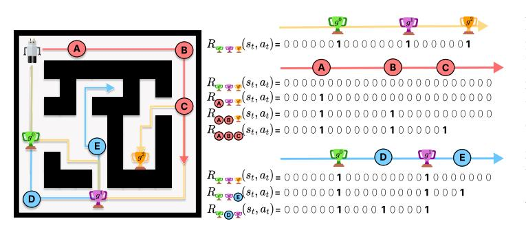
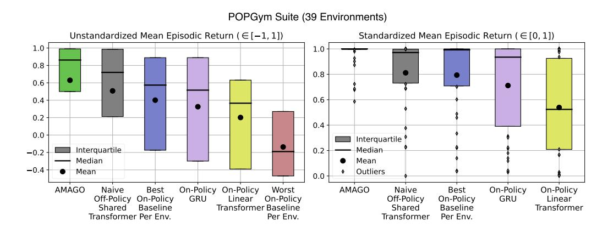
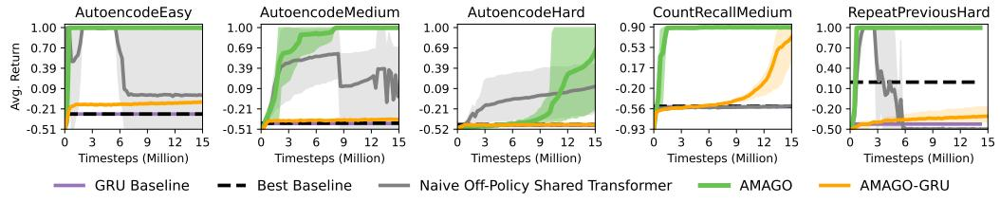
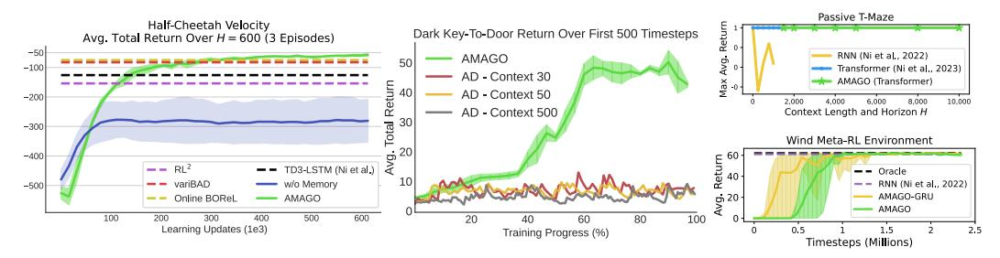
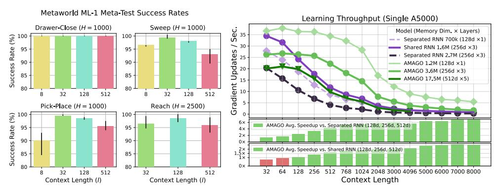
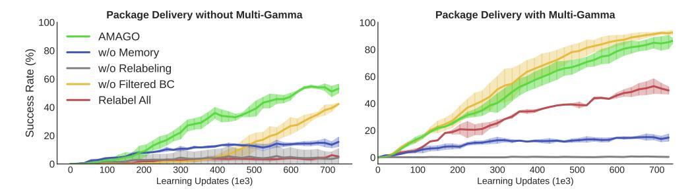
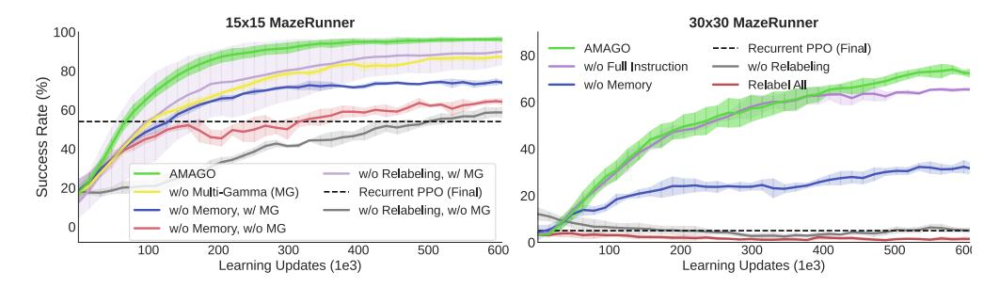
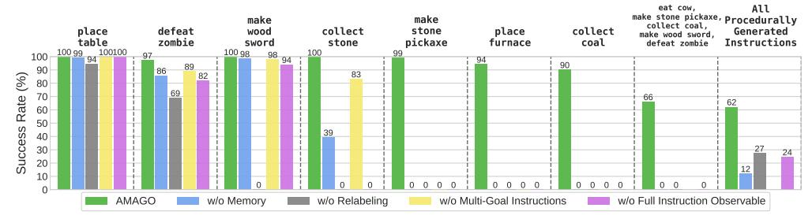

# 4 METHOD

We aim to extend the limits of off-policy in-context RL's three main barriers: 1) the memory limit or context length l, 2) the value discount factor γ, and 3) the size and recall of our sequence model. Transformers are a strong solution to the last challenge and may be able to address all three barriers if we were able to learn from long context lengths l ≈ H and select actions for γ ≥ .999 at test time. In principle, this would allow agents to remember and plan for long adaptation windows in order to scale to more challenging problems while removing the need to tune trade-offs between stability and context length. AMAGO overcomes several challenges to make this possible. This section summarizes the most important techniques that enable AMAGO's performance and flexibility. More details can be found in Appendix [A](#page-14-1) and in our open-source code release.

A high-level overview of AMAGO is illustrated in Figure [1.](#page-1-0) The observations of every environment are augmented to a unified goal-conditioned CMDP format, even when some of the extra input information is unnecessary. This unified format allows AMAGO to be equally applicable to generalization, meta-RL, long-term memory, and multi-task problems without changes. AMAGO is an off-policy method that takes advantage of large and diverse datasets; trajectory data is loaded from disk and can be relabeled with alternative goals and rewards. The shape and format of trajectories vary across domains, but we use a timestep encoder network to map each timestep to a fixed-size representation. AMAGO allows the timestep encoder to be the only architecture change across experiments. A single Transformer trajectory encoder processes sequences of timestep representations. AMAGO uses these representations as the inputs to small feed-forward actor and critic networks, which are optimized simultaneously across every timestep of the causal sequence. Like all implicit context-based methods (Sec. [2\)](#page-1-2), this architecture encourages the trajectory encoder outputs to be latent estimates of the current state and environment (si , e) (Sec. [3\)](#page-2-0). In short, AMAGO's learning update looks more like supervised sequence modeling than an off-policy actor-critic, where each training step involves exactly one forward pass of one Transformer model with two output heads. This end result is simple and scalable but is only made possible by important technical details.

Sharing One Sequence Model. The accepted best practice in off-policy RL is to optimize separate sequence models for the actor and critic(s) — using additional target models to compute the critic loss. Sharing actor and critic sequence models is possible but has repeatedly been shown to be unstable [\[22,](#page-9-21) [71,](#page-11-22) [72\]](#page-11-23). AMAGO addresses this instability and restructures the learning update to train its actor and critics on top of the same sequence representation; there are no target sequence models, and every parameter is updated simultaneously without alternating steps or conflicting learning rates. We combine the actor and critic objectives into a single loss trained by one optimizer. However, we must put each term on a predictable scale to prevent their weights from needing to be tuned across every experiment [\[85,](#page-12-11) [86\]](#page-12-12). The key detail enabling the simultaneous update to work in AMAGO — without separating the Transformer from the actor loss [\[72,](#page-11-23) [71\]](#page-11-22) — is to carefully detach the critic from the actor loss (Appendix [A.1\)](#page-14-2). We compute loss terms with a custom variant of REDQ [\[74\]](#page-12-0) for discrete and continuous actions that removes unintuitive hyperparameters wherever possible.

Stable Long-Context Transformers in Off-Policy RL. Transformers bring additional optimization questions that can be more challenging in RL than supervised learning (Sec. [2\)](#page-1-2). The shared off-policy update may amplify these issues, as we were unable to successfully apply existing architectural changes for Transformers in on-policy RL [\[84,](#page-12-10) [20\]](#page-9-19) to our setting. We find that *attention entropy collapse* [\[87\]](#page-12-13) is an important problem in long-sequence RL. Language modeling and other successful applications of Transformers involve learning a variety of temporal patterns. In contrast, RL

> **[图片提取文字 (无描述)]:**
> $R_{\text{opp}}(s_t, a_t) = 0.00000100000010000001$  $R_{\Psi \Psi \Psi}(s_t, a_t) = 00000000000000000000000000000000000$  $R_{\odot \Psi}(s_t, a_t) = 000010000000000000000000000000000000$  $\begin{array}{c} R_{\textcircled{\tiny{\textbf{A}}\textcircled{\tiny{\textbf{A}}}}} = (s_t, a_t) = 0 \ 0 \ 0 \ 1 \ 0 \ 0 \ 0 \ 0 \ 0 \ 0 \$  $R_{\text{prop}}(s_t, a_t) = 0 \ 0 \ 0 \ 0 \ 0 \ 1 \ 0 \ 0 \ 0 \ 0 \$  $R_{\text{POP}}(s_t, a_t) = 0.0000010000100001$

Figure 2: The agent (top left) navigates a maze to reach goal locations  $(g^0, g^1, g^2)$ . Yellow, red, and blue paths with locations (A, ..., E) are examples of trajectories and achieved goals for relabeling. We show how instruction-relabeling creates a variety of alternative reward sequences.

agents can converge on precise memory strategies that consistently recall specific timesteps of long sequences (Figure 15). Optimizing these policies encourages large dot products between a small set of queries and keys that can destabilize attention2. We modify the Transformer architecture based on Normformer [88] and  $\sigma$ Reparam [87], and replace saturating activations with Leaky ReLUs to preserve plasticity [83, 89] as discussed in Appendix A.3. This architecture effectively stabilizes training and reduces tuning by letting us pick model sizes that are safely too large for the problem.

Long Horizons and Multi-Gamma Learning. While long-sequence Transformers improve recall, adaptation over extended rollouts creates a challenging credit assignment and planning problem. An important barrier in increasing adaption horizons is finding stable ways to increase the discount factor  $\gamma$ . Time information in the trajectory improves stability [90], but we also use a "multi-gamma" update that jointly optimizes many different values of  $\gamma$  in parallel. Each  $\gamma$  creates its own Q-value surface, making the shared Transformer more likely to have a strong actor-critic learning signal for some  $\gamma$  throughout training. The relative cost of the multi-gamma update becomes low as the size of the sequence model increases. AMAGO can select the action corresponding to any  $\gamma$  during rollouts, and we use  $\gamma \geq .999$  unless otherwise noted. A discrete-action version of the multi-gamma update has previously been studied as a byproduct of hyperbolic discounting in (memory-free) MDPs with shared visual representations [91]. As a fail-safe, we include a filtered behavior cloning (BC) term [92, 93], which performs supervised learning when actions are estimated to have positive advantage (Q(s,a)-V(s)>0) but does not directly depend on the scale of the Q function.

**Hindsight Instruction Relabeling.** AMAGO's use of off-policy data and high discount factors allows us to relabel long trajectories in hindsight. This ability lets us expand the in-context RL framework to include goal-conditioned problems with sparse rewards that are too difficult for onpolicy agents with short planning horizons to explore. AMAGO introduces a variant of HER (Sec. 3) for *multi-step* goals where  $g = (g^0, \ldots, g^k)$ . Besides adding the flexibility to create more complex multi-stage tasks, our experiments show that relabeling multi-step goals effectively creates automatic exploration plans in open-world domains like Crafter [33].

Our relabeling scheme works in two steps. First, we do not restrict goals to represent target states and allow them to be an abstract set of tokens or strings from a closed vocabulary. During rollouts, we can evaluate the goal tokens we were instructed to achieve and record alternatives that can be used for relabeling. The second step extends the HER relabeling scheme to "instructions", or sequences of up to k subgoals. If an agent is tasked with k goals but only completes the first  $n \le k$  steps of the instruction, we sample  $h \in [0, k-n]$  timesteps that provide alternative goals, and then sample from all the goals achieved at those timesteps. We merge the k alternative goals into the original instruction in chronological order and replay the trajectory from the beginning, recomputing the reward for the new instruction, which leads to a return of k0 when rewards are binary. Figure 2 illustrates the technique with a maze-navigation example. Our implementation also considers importance-sampling variants that weight goal selection based on rarity and improve sample efficiency. Details are discussed in Appendix B.

&lt;sup>2Environments that require little memory create a similar problem to those that demand long-term memory of specific information. Long context sequences create narrow attention distributions in both cases.

#### 5 EXPERIMENTS

Our experiments are divided into two parts. First, we evaluate our agent in a variety of existing long-term memory, generalization, and meta-learning environments. We then explore the combination of AMAGO's adaptive memory and hindsight instruction relabeling in multi-task domains with procedurally generated environments. Additional results, details, and discussion for each of our experiments can be found in Appendix C. Unless otherwise noted, AMAGO uses a context length  $\ell$  equal to the entire rollout horizon  $\ell$ . These memory lengths are not always necessary on current benchmarks, but we are interested in evaluating the performance of RL on long sequences so that AMAGO can serve as a strong baseline in developing new benchmarks that require more adaptation.

#### 5.1 LONG-TERM MEMORY, GENERALIZATION, AND META-LEARNING

> **[图片提取文字 (无描述)]:**
> POPGym Suite (39 Environments) Unstandardized Mean Episodic Return ( $\in$  [-1, 1]) Standardized Mean Episodic Return ( $\in$  [0, 1]) 1.0 -1.0 0.8 -0.8 0.6 0.6 0.4 0.2 -0.4 0.0 -Interquartile Interquartile Median 0.2 -0.2Median Mean -0.4Outliers Mean 0.0 Naive On-Policy On-Policy **AMAGO** Naive On-Policy On-Policy AMAGO Best Worst Best Off-Policy On-Policy GRU Linear On-Policy Off-Policy On-Policy GRU Linear Shared Baseline Transformer Baseline Shared Baseline Transformer Transformer Per Env. Per Env. Transformer Per Env.

Figure 3: **Summary of POPGym Suite Results.** (**Left**) Aggregate results based on raw returns. (**Right**) Relative performance standardized by the highest and lowest scores in each environment.

POPGym [30] is a recent benchmark for evaluating long-term memory and generalization in a range of CMDPs. Performance in POPGym is far from saturated, and the challenges of sequence-based learning often prevent prior on-policy results from meaningfully outperforming memory-free policies. We tune AMAGO on one environment to meet the sample limit and architecture constraints of the original benchmark before copying these settings across 38 additional environments. Figure 3 summarizes results across the suite. We compare against the best existing baseline (a recurrent GRU-based agent [94]) and the most comparable architecture (an efficient Transformer variant [95]). We also report the aggregated results of the best baseline in each environment — equivalent to an exhaustive grid search over 13 alternative sequence models trained by on-policy RL. If we standardize the return in each environment to [0,1] based on the highest and lowest baseline, as done in [30], AMAGO achieves an average score of .95 across the suite, making it a remarkably strong default for sequence-based RL. We perform an ablation that naively applies the shared Transformer learning update without AMAGO's other details — such as our Transformer architecture and multi-gamma update. The naive baseline performs significantly worse, and the metrics in Figure 3 mask its collapse in 9/39 environments; AMAGO maintains stability in all of its 120+ trials despite using model sizes and update-to-data ratios that are not tuned. Learning curves and additional experiments are listed in Appendix C.1.

> **[图片提取文字 (无描述)]:**
> AutoencodeMedium AutoencodeHard CountRecallMedium RepeatPreviousHard AutoencodeEasy 1.00 T  $0.90 \pm$ 1.00 -1.00 1.00 Ę 0.70 -0.69 0.53 -0.69 -0.70 -0.39 0.39 0.39 -0.17 0.40 6 0.09 -8 -0.21 -0.09 -0.09 -0.20 -0.10 --0.21-0.21-0.56 --0.20 --0.51 -0.51-0.52 -0.93 --0.50Timesteps (Million) Timesteps (Million) Timesteps (Million) Timesteps (Million) Timesteps (Million) GRU Baseline Best Baseline Naive Off-Policy Shared Transformer AMAGO AMAGO-GRU

Figure 4: **Memory-Intensive POPGym Environments.** AMAGO's off-policy updates can improve performance in general, but its Transformer turns hard memory-intensive environments into a straightforward recall exercise. Appendix C.1 reports results on more than 30 additional environments.

Much of AMAGO's performance gain in POPGym appears to be due to its ability to unlock Transformers' memory capabilities in off-policy RL: there are 9 recall-intensive environments where the GRU baseline achieves a normalized score of .19 compared to AMAGO's .999. Figure [4](#page-5-1) ablates the impact of AMAGO's trajectory encoder from the rest of its off-policy details by replacing its Transformer with a GRU-based RNN in a sample of these recall-intensive environments.

We test the limits of AMAGO's recall using a "Passive T-Maze" environment from concurrent work [\[96\]](#page-12-22), which creates a way to isolate memory capabilities at any sequence length. Solving this task requires accurate recall of the first timestep at the last timestep H. AMAGO trains a single RL Transformer to recover the optimal policy until we run out of GPU memory at context length l = H = 10, 000 (Figure [5](#page-6-0) top right). One concern is that AMAGO's maximum context lengths, large policies, and long horizons may hinder performance on easier problems where they are unnecessary, leading to the kind of hyperparameter tuning we would like to avoid. We demonstrate AMAGO on two continuous-action meta-RL problems from related work with dense (Fig. [5](#page-6-0) left) and sparse (Fig. [5](#page-6-0) bottom right) rewards where performance is already saturated, with strong and stable results.

> **[图片提取文字 (无描述)]:**
> Passive T-Maze Half-Cheetah Velocity Return Dark Key-To-Door Return Over First 500 Timesteps Avg. Total Return Over H = 600 (3 Episodes) -50 RNN (Ni et al., 2022) AMAGO 50 -100Transformer (Ni et al., 2023) AD - Context 30 ¥a.₀. AMAGO (Transformer) AD - Context 50 -200 10,000 2,000 6,000 8,000 AD - Context 500 Context Length and Horizon H 30 -300 Wind Meta-RL Environment -400 -- RL2 TD3-LSTM (Ni et al.) -- Oracle 10 variBAD — w/o Memory — – RNN (Ni et al., 2022) -500 § 20 · AMAGO-GRU Online BOReL AMAGO AMAGO 100 200 300 500 600 80 100 60 Learning Updates (1e3) Training Progress (%) Timesteps (Millions)

Figure 5: Case Studies in In-Context Adaptation. (Left) Adaptation over three episodes in Half-Cheetah Velocity [\[97\]](#page-12-23). (Center) AMAGO vs. Algorithm Distillation over the first 500 timesteps of Dark Key-To-Door [\[28\]](#page-10-3). (Bottom Right) Adaptation to a sparse-reward environment with continuous actions [\[22\]](#page-9-21). (Top Right) AMAGO solves the Passive T-Maze memory experiment [\[96\]](#page-12-22) up until the GPU memory limit of l = H = 10, 000 timesteps.

Like several recent approaches that reformulate RL as supervised learning (Sec. [2\)](#page-1-2), AMAGO scales with the size and sequence length of a single Transformer. However, it creates a stable way to optimize its Transformer on the true RL objective rather than a sequence modeling loss. This can be an important advantage when the supervised objective becomes misaligned with our true goal. For example, we replicate Algorithm Distillation (AD) [\[28\]](#page-10-3) on a version of its Dark Key-To-Door meta-learning task. AMAGO's ability to successfully optimize the return over any horizon H lets us control sample efficiency at test-time (Fig. [5](#page-6-0) center), while AD's adaptation rate is limited by its dataset and converges several thousand timesteps later in this case.

> **[图片提取文字 (无描述)]:**
> Metaworld ML-1 Meta-Test Success Rates Learning Throughput (Single A5000) Drawer-Close (H = 1000) Sweep (H = 1000) Sec. Model (Memory Dim. x Layers) 35 %) 100 100 Separated RNN 700k (128d ×1) ~ 30 Shared RNN 1.6M (256d ×3) Success Rate 95 95 Updates Separated RNN 2.7M (256d ×3) 25 90 90 AMAGO 1.2M (128d ×1) 20 AMAGO 3.6M (256d ×3) 85 85 AMAGO 17.5M (512d ×5) 15 Gradient 80 80 10 128 512 32 128 512 32 Pick-Place (H = 1000) Reach (H = 2500) 100 100 6× AMAGO Avg. Speedup vs. Separated RNN (128d, 256d, 512d) Success Rate 95 95 4× 2× 90 90  $0 \times$ 1.5× 1× AMAGO Avg. Speedup vs. Shared RNN (128d, 256d, 512d) 85 85 0x 80 80 256 512 768 1024 2048 3000 4096 5000 6000 7000 8000 32 128 512 32 128 512 Context Length Context Length (1) Context Length (1)

Figure 6: (Left) Meta-World [\[98\]](#page-12-24) ML-1 success rate on held-out test tasks by context length. (Right) AMAGO enables larger models and longer context lengths than off-policy RNN variants. We compare training throughput in a common locomotion benchmark [\[97\]](#page-12-23) with more details in Appendix [D.](#page-32-0)

Figure [6](#page-6-1) (left) breaks from our default context length l = H and evaluates varying lengths on a sample of Meta-World ML-1 robotics environments [\[98\]](#page-12-24). Meta-World creates meta-RL tasks out of goal-conditioned environments by masking the goal information, which can be inferred from short

context lengths of dense reward signals. While the maximum meta-train performance of every context length is nearly identical, the meta-test success rates decrease slightly over long sequences. Extended contexts may encourage overfitting on these smaller environment distributions. Figure 6 (right) measures the scalability of AMAGO relative to off-policy agents with a separated RNN architecture as well as the more efficient (but previously unstable) shared model. AMAGO lets us train larger models faster than RNNs with equivalent memory capacity. More importantly, Transformers make optimizing these super-long sequences more realistic.

#### 5.2 GOAL-CONDITIONED ENVIRONMENT ADAPTATION

We now turn our focus towards generalization over procedurally generated environments  $e \sim p(e)$  and multi-step instructions  $(g^0,\ldots,g^k) \sim p(g\mid e)$  of up to k goals (Sec. 3). A successful policy is able to adapt to a new environment in order to achieve sparse rewards of +1 for completing each step of its instruction, creating a general instruction-following agent. Learning to explore from sparse rewards is difficult, but AMAGO's long-horizon off-policy learning update lets us relabel trajectories with alternative instructions (Figure 2). Before we scale up to a more complex domain, we introduce two easily-simulated benchmarks. "Package Delivery" is a toy problem where agents navigate a sequence of forks in a road to deliver items to a list of addresses. This task is both sparse and memory-intensive, as achieving any reward requires recall of previous attempts. Appendix C.3 provides a full environment description, and Figure 7 compares key ablations of AMAGO. Relabeling, memory, and multi-gamma learning are essential to performance and highlight the importance of AMAGO's technical details.

> **[图片提取文字 (无描述)]:**
> Package Delivery with Multi-Gamma Package Delivery without Multi-Gamma AMAGO w/o Memory Success Rate (%) w/o Relabeling w/o Filtered BC Relabel All Learning Updates (1e3) Learning Updates (1e3)

Figure 7: **Package Delivery Results.** Relabeling, long-term memory, and multi-gamma updates are essential to success in this sparse goal-conditioned adaptation problem (H=180).

> **[图片提取文字 (无描述)]:**
> 15x15 MazeRunner 30x30 MazeRunner 100 **AMAGO**  Recurrent PPO (Final) 80 w/o Full Instruction w/o Relabeling 80 (%) w/o Memory Relabel All 60 60 Success Rate 40 40 AMAGO w/o Relabeling, w/ MG w/o Multi-Gamma (MG) Recurrent PPO (Final) 20 w/o Memory, w/ MG w/o Relabeling, w/o MG w/o Memory, w/o MG 300 500 600 100 200 400 600 100 200 400 300 500 Learning Updates (1e3) Learning Updates (1e3)

Figure 8: **MazeRunner Results.** Memory improves navigation in a partially observed maze, but sparse rewards create the most significant barrier to learning  $(15 \times 15 \ H = 400, 30 \times 30 \ H = 1,000)$ .

"MazeRunner" is a zero-shot maze navigation problem modeled after the example in Figure 2 and loosely based on Memory Maze [99]. The agent finds itself in a familiar spawn location in an otherwise unfamiliar maze and needs to navigate to a sequence of  $k \in [1,3]$  locations. Although the underlying maze map is generated as an  $N \times N$  gridworld, the agent's observations are continuous Lidar-like depth sensors. When N=15, the problem is sparse but solvable without relabeling thanks to our implementation's low-level improvements (Figure 8 left). However, N=30 is impossibly sparse, and relabeling is crucial to success (Fig. 8 right). We run a similar experiment where action dynamics are randomly reset every episode in Appendix C.4. While this variant is more challenging,

our method outperforms other zero-shot meta-RL agents and nearly recovers the original performance while adapting to the new action space.

Crafter [33] is a research-friendly simplification of Minecraft designed to evaluate multi-task capabilities in procedurally generated worlds. Agents explore their surroundings to gather food and resources while progressing through a tech tree of advanced tools and avoiding dangerous enemies. We create an *instruction-conditioned* version where the agent is only successful if it completes the specified task. Our instructions are formed from the 22 original Crafter achievements with added goals for traveling to a grid of world coordinates and placing blocks in specific locations. Goals are represented as strings like "make stone pickaxe", which are tokenized at the word level with the motivation of enabling knowledge transfer between similar goals. Any sequence of  $k \le 5$  goal strings forms a valid instruction that we expect our agent to solve in any randomly generated Crafter environment.

> **[图片提取文字 (无描述)]:**
> eat cow, make stone pickaxe, Procedurally collect coal, make make Generated place defeat wood collect stone place collect make wood sword, table zombie Instructions sword stone pickaxe furnace coal defeat zombie 100 99 100100 100 98 98 94 : 100 100 94 89 90 86 (%) 83 82 69 Rate 62 60 50 39 40 **AMAGO** w/o Memory w/o Relabeling w/o Multi-Goal Instructions w/o Full Instruction Observable

Figure 9: **Crafter Instruction Success Rates.** Here we highlight specific instructions that reveal exploration capabilities. "All Procedurally Generated Instructions" indicates performance across the entire range of multi-step goals in randomly generated worlds.

Figure 9 shows the success of AMAGO on the entire goal distribution along with several highlighted tasks. Resource-acquisition and tool-making tasks that require test-time exploration and adaptation to a new world benefit from Transformer policies and long-term memory. As the steps in an instruction become less likely to be achieved by random exploration, relabeling becomes essential to success. However, Crafter reveals a more interesting capability of our multi-step hindsight relabeling. If we ablate our relabeling scheme to single-goal HER and evaluate on instructions with length k=1 (Fig. 9 "w/o Multi-Goal..."), we find AMAGO loses the ability to complete advanced goals. Crafter's achievement system locks skills behind a progression of prerequisite steps. For example, we can only make tools after we have collected the necessary materials. Relabeling with instructions lets us follow randomly generated sequences of goals we have mastered until we reach the "frontier" of skills we have discovered, where new goals have a realistic chance of occurring by random exploration. The agent eventually learns to complete new discoveries as part of other instructions, creating more opportunities for exploration. However, this effect only occurs when we provide the entire task in advance instead of revealing the instruction one step at a time (Fig. 9 "w/o Full Instruction..."). We continue this investigation in detail with additional Crafter experiments in Appendix C.5.

#### 6 CONCLUSION

We have introduced AMAGO, an in-context RL agent for generalization, long-term memory, and meta-learning. Our work makes important technical contributions by finding a stable and high-performance way to train off-policy RL agents on top of one long-context Transformer. With AMAGO, we can train policies to adapt over more distant planning horizons with longer effective memories. We also show that the benefits of an off-policy in-context method can go beyond stability and sample efficiency, as AMAGO lets us relabel multi-step instructions to discover sparse rewards while adapting to unfamiliar environments. Our agent's efficiency on long input sequences creates an exciting direction for future work, as very few academic-scale meta-RL or RL generalization benchmarks genuinely require adaptation over thousands of timesteps. AMAGO is open-source, and the combination of its performance and flexibility should let it serve as a strong baseline in the development of new benchmarks in this area. The core AMAGO framework is also compatible with sequence models besides Transformers and creates an extensible way to research more experimental long-term memory architectures that can push adaptation horizons even further.

## ACKNOWLEDGMENTS

This work was supported by NSF EFRI-2318065, Salesforce, and JP Morgan. We would like to thank Braham Snyder, Yifeng Zhu, Zhenyu Jiang, Soroush Nasiriany, Huihan Liu, Rutav Shah, Mingyo Seo, and the UT Austin Robot Perception and Learning Lab for constructive feedback on early drafts of this paper.

