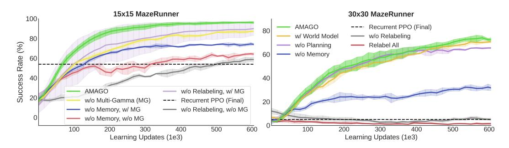
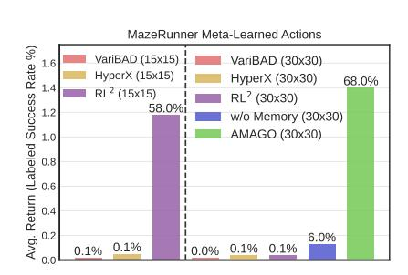
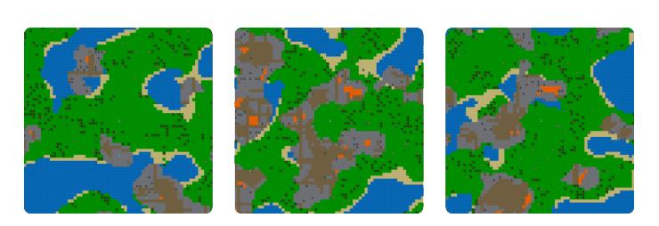
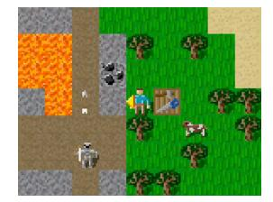
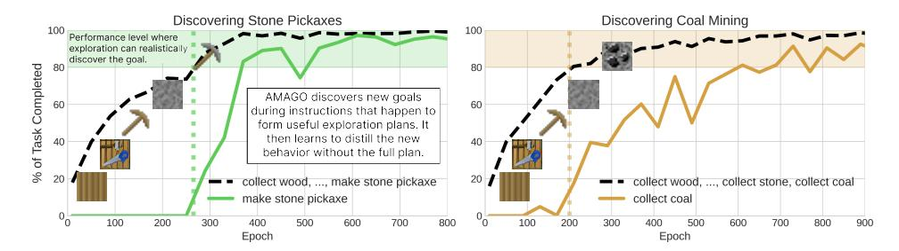
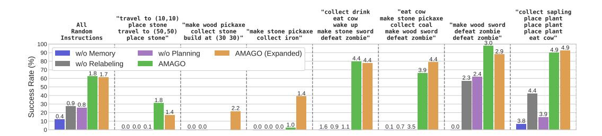
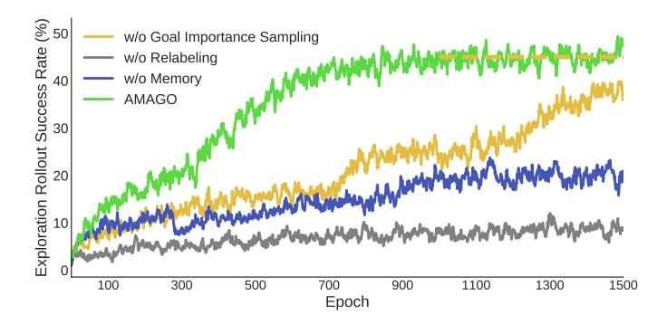
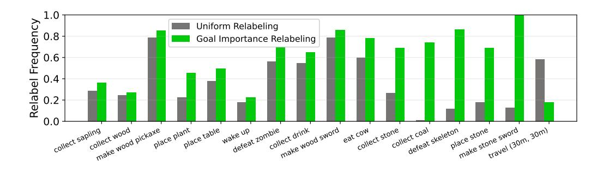
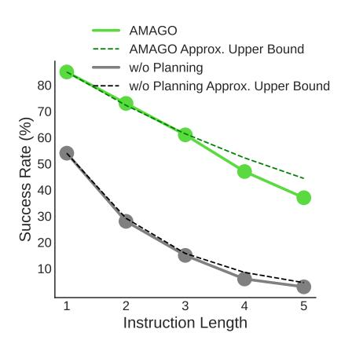
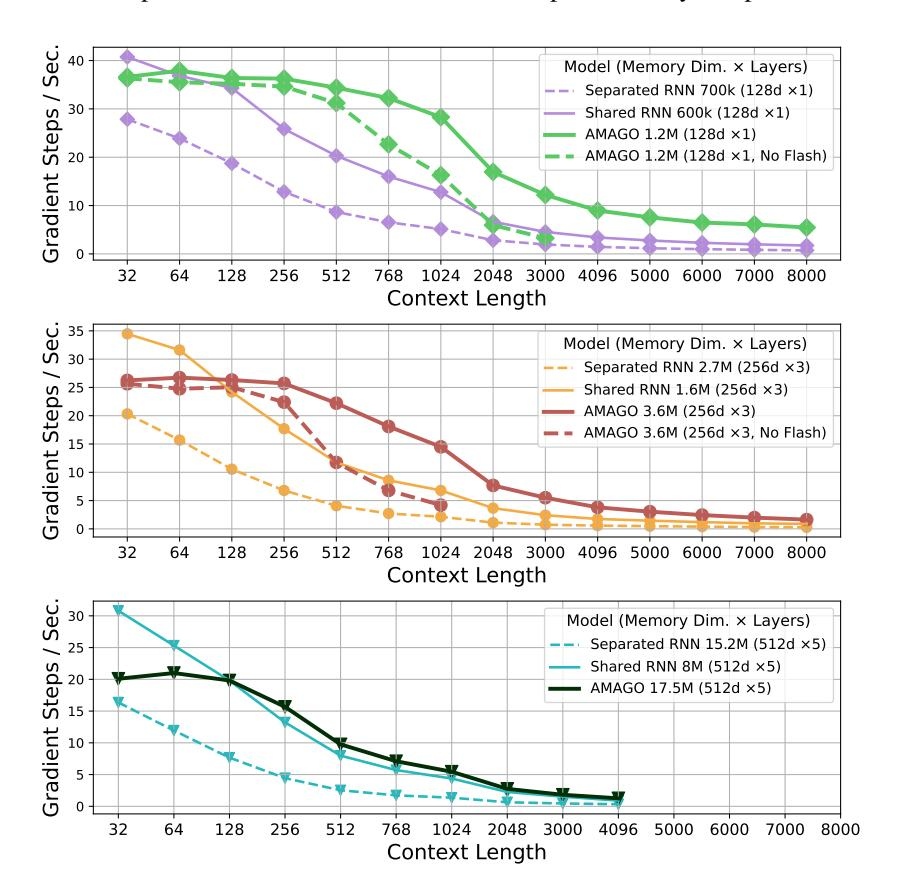

# C.4.2 ADDITIONAL RESULTS AND ANALYSIS

> **[图片提取文字 (无描述)]:**
> 15x15 MazeRunner 30x30 MazeRunner 100 AMAGO --- Recurrent PPO (Final) 80 w/ World Model w/o Relabeling 80 Rate (%) w/o Planning Relabel All w/o Memory 60 60 Success 40 40 AMAGO w/o Relabeling, w/ MG w/o Multi-Gamma (MG) Recurrent PPO (Final) 20 w/o Memory, w/ MG w/o Relabeling, w/o MG w/o Memory, w/o MG 100 500 600 100 200 300 400 500 600 200 300 400 Learning Updates (1e3) Learning Updates (1e3)

Figure 8: MazeRunner Results (reproduced here for convenience).

15 × 15 MazeRunner. Figure [8](#page-7-1) (left) evaluates the default version of MazeRunner with N = 15. Without random actions dynamics and with the current status of the task as an input to each timestep, a standard Recurrent PPO baseline could learn the same kind of adaptive generalization as AMAGO. The lowest-feature ablation of AMAGO's core agent ("w/o Relabeling, w/o Multi-Gamma") uses a Transformer to match the performance of Recurrent PPO on the 15 × 15 domain. However, our other technical improvements can almost double that performance, albeit with high variance ("w/o Relabeling, w/ Multi-Gamma"). Adding relabeling to create the full AMAGO method leads to a nearly perfect success rate in 15 × 15 with low variance ("AMAGO"). Position information (x, y) was included to help baseline performance, but we find that AMAGO can achieve a 91% success rate without it.

 $30 \times 30$  MazeRunner. The larger maze size creates an extremely challenging sparse exploration problem, and all ablations of the relabeling scheme fail along with the Recurrent PPO baseline. AMAGO performs well and uses its memory to efficiently explore its surroundings ("w/o Memory" has about half its final success rate). We believe there is room to continue to use the MazeRunner environment at larger maze sizes and task horizons to evaluate long-term-memory architectures at low simulation cost. We experiment with adding a dynamics modeling term to AMAGO's training objective ("w/ World Model"). World modeling is a natural fit for AMAGO's long-context Transformer backbone but does not appear to have an impact on this low-dimensional domain. The "w/o Planning" baseline hides future goal locations from the task-conditioned input. In theory, this effects AMAGO's ability to make exploration/exploitation trade-offs and take routes that maximize the chance of finding all k locations, and does make a noticeable but small difference as the agent's strategy improves. However, 1,000 timesteps may be too generous to highlight this trade-off.

**"Rewired"** Action Space Adaptation. Figure 22 shows the final performance of several methods with the randomly permuted action space feature enabled. Generalizing to new action dynamics requires a level of adaptation above standard Recurrent PPO, so our baselines shift to full meta-RL methods. While some multi-episodic methods can be modified to work in a zero-shot setting [111], we focus on three techniques that are more natural fits problem: variBAD [64], HyperX [111], and RL2 [11, 10]. In an effort to use validated external implementations of these algorithms, we switch to the continuous action space version of MazeRunner. We choose the hyperparameters from the largest-scale experiment in the original codebase, with some tuning performed by solving easier

> **[图片提取文字 (无描述)]:**
> MazeRunner Meta-Learned Actions Avg. Return (Labeled Success Rate %) VariBAD (15x15) VariBAD (30x30) 1.6 HyperX (15x15) HyperX (30x30) 68.0% 1.4 RL2 (15x15) RL2 (30x30) 58.0% 1.2 w/o Memory (30x30) AMAGO (30x30) 1.0 0.8 0.6 0.4 0.2 6.0% 0.1% 0.1% 0.1% 0.0% 0.1%

Figure 22: **MazeRunner with Random Dynamics.** The agent's action space is randomized in every environment.

versions of the problem. However, only  $RL^2$  shows signs of life on  $15 \times 15$  permuted actions (Fig. 22).  $30 \times 30$  is too sparse for  $RL^2$ , but AMAGO's relabeling and long-sequence improvements allow us to nearly recover the metrics in Figure 8 while adapting to the randomized action space.

#### C.5 CRAFTER

Figure 23: Examples of Crafter Terrain Generation (Left). Crafter generates new landscapes and locations of rare resources every episode (reproduced from [33]). Crafter Observation (Right). An example of the agent-centric view that forms observations.

Crafter [33] is a simplification of Minecraft with 2D graphics and a high framerate that facilitates research on building agents with the variety of skills necessary to survive and develop more advanced technology in a procedurally generated environment. The standard evaluation setting provides a lightly shaped dense reward that encourages survival and avoiding danger, while giving a sparse reward the first time the agent completes each of the 22 "achievements" in a new episode. This represents an *undirected* kind of multi-task learning, where the agent receives equal credit for completing any of its skills whenever the opportunity arises, and cannot be prompted with a specific objective. We create a *directed* version where the agent is only rewarded for completing the next step of an instruction we provide.

## C.5.1 ENVIRONMENT AND TASK DETAILS

Environment Distribution p(e): Crafter generates a new world map that randomizes the locations of caves, lakes, and rare resources upon every reset. Three examples are shown in Figure [23.](#page-27-2)

Goal Space G: We create goals from Crafter's 22 achievements, which include those listed in Table [1](#page-29-0) as well as "collect sapling" (where all agents have a near 100% success rate) and more difficult goals like "make iron sword" and "collect diamond" (where all agents have a near 0% success rate). We add more complexity by creating goals for traveling to every (x, y) location spaced 5 units apart, such as "travel to (5, 5)" and "travel to (60, 15)". An "Expanded" version of Crafter adds goals for placing blocks at every (x, y) location. All goal strings are represented as three tokens – e.g., "<make> <stone> <sword>", "<travel> < 50 > < 5 >", "<collect> <coal> <PAD>" — which is meant to improve generalization across goals relative to one-hot identifiers.

Observation Space: Crafter observations are egocentric views of the agent and its surrounding area (Figure [23](#page-27-2) right) along with health and inventory data. AMAGO supports pixel observations, but our experiments default to a version that maps the image (Figure [23](#page-27-2) right) to texture IDs, which can be processed with an embedding rather than a CNN. This simplification shortens training times and lets us run many ablations, and is inspired by the NetHack Learning Environment [\[112\]](#page-13-13) — another high-throughput generalization benchmark. However, we do evaluate the full AMAGO method on pixel observations with a CNN (Table [2\)](#page-31-0), and the results are similar to the simplified version.

Action Space: Crafter has 17 discrete actions corresponding to player movement, tool making, and item placement.

Instruction Distribution p(g | e): By default, our instructions are generated by randomly choosing an instruction length k ∼ U(1, 5) and then filling that length by weighted sampling (with replacement) from the goal space. We pick sample weights that ensured non-relabeling baselines could make some progress by down-weighting the hardest goals (like diamond collection). We defer the exact weights to our open-source code release. We also experiment with using the ground-truth Crafter achievement progression (see Crafter Figure 4 [\[33\]](#page-10-8)) to generate instructions.

Task Horizon H: We enforce a maximum episode length of H = 2, 000 timesteps. However, a typical episode is less than 500 timesteps, because the agents either succeed quickly or are defeated by an enemy.

## C.5.2 ADDITIONAL RESULTS AND ANALYSIS

Table [1](#page-29-0) evaluates agents on single-goal instructions and lets us measure AMAGO's knowledge of the 22 main skills similar to existing Crafter results (Table [1](#page-29-0) top section). We add a baseline version of our core agent trained with Crafter's default reward function to control for changes in state representation, sample limit, memory, and maximum episode length. Moving from the undirected reward function to sparse instruction-conditioning leads to a dramatic decline in performance without relabeling or long-term memory (Table [1](#page-29-0) middle section). The lower section of Table [1](#page-29-0) compares versions of our method with different instruction-generation and relabeling schemes, which will be explained below. AMAGO has learned to complete Crafter's achievement progression up to collecting iron despite the added difficulty that comes with being task-conditioned.

Exploring with Instructions. The instruction format lets us discover new behavior by following sequences of steps from our own goal space, and turns exploration into a multi-task generalization problem. The process works in three steps. First, relabeling lets AMAGO master sequences of goals that are frequently achieved early in training. Second, we follow randomly generated instructions that happen to be made up of those easier goals, eventually reaching the frontier of what we have already discovered. Random exploration then has a realistic chance of finding new outcomes. We can verify the first two steps by ablating AMAGO's ability to follow multi-goal instructions during training (Table [1](#page-29-0) "w/o Multi-Goal"), and observing a steep decline in performance on hard-exploration goals like tool making. In the third and final step, AMAGO learns to internalize the new discovery so that it can be achieved without the help of the instruction curriculum. We suspect this is closely tied with AMAGO's ability to observe the full instruction that led to the discovery, and test this by hiding the full task (Table [1](#page-29-0) "w/o Planning"), which fails to discover hard goals despite following multi-goal instructions. The goal discovery process is supported by Figure [24,](#page-29-1) which measures the progress

|                                                  | Collect Wood | Collect Drink | Place Plant | Wake Up   | Place Table | Wood Sword | Eat Cow   | Defeat Zombie | Wood Pickaxe | Collect Stone | Place Furnace | Stone Pickaxe | Stone Sword | Collect Coal | Defeat Skeleton | Collect Iron |
|--------------------------------------------------|-----------------|------------------|----------------|--------------|----------------|---------------|--------------|------------------|-----------------|------------------|------------------|------------------|----------------|-----------------|--------------------|-----------------|
| Rainbow (Undirected) [104]                       | 74.9            | 24.0             | 94.2           | 93.3         | 52.3           | 9.8           | 26.1         | 39.6             | 4.8             | 0.2              | 0.0              | 0.0              | 0.0            | 0.0             | 0.7                | 0.0             |
| DreamerV2 (Undirected)[86] AMAGO (Undirected) | 92.7 99.9    | 80.0 93.3     | 84.4 99.9   | 92.8 95.8 | 85.7 99.8   | 40.2 99.1  | 17.1 81.1 | 53.1 91.3     | 59.6 99.4    | 42.7 97.5     | 1.8 93.6      | 0.2 86.3      | 0.3 92.3    | 14.7 69.5    | 2.6 53.5        | 0.0             |
| w/o Relabeling                                   | 97.3            | 79.2             | 99.9           | 4.5          | 94.4           | 0.0           | 15.2         | 68.9             | 0.0             | 0.0              | 0.0              | 0.0              | 0.0            | 0.0             | 0.0                | 0.0             |
| w/o Memory                                       | 99.8            | 91.3             | 99.9           | 91.5         | 98.9           | 98.4          | 62.2         | 85.7             | 99.2            | 39.3             | 0.0              | 0.0              | 0.0            | 0.0             | 0.0                | 0.0             |
| w/o Multi-Goal                                   | 99.8            | 93.1             | 99.9           | 97.8         | 99.4           | 97.8          | 93.9         | 88.9             | 99.5            | 83.1             | 0.0              | 0.0              | 0.0            | 0.0             | 10.4               | 0.0             |
| w/o Planning                                     | 99.9            | 98.1             | 98.7           | 93.6         | 95.7           | 93.9          | 36.0         | 82.0             | 98.6            | 0.0              | 0.0              | 0.0              | 0.0            | 0.0             | 0.0                | 0.0             |
| w/o Importance Sampling                          | 99.9            | 98.4             | 99.8           | 93.3         | 99.8           | 99.9          | 98.9         | 95.1             | 99.9            | 96.1             | 92.1             | 98.6             | 97.5           | 81.5            | 57.5               | 0.0             |
| AMAGO                                            | 99.9            | 99.9             | 99.3           | 99.9         | 96.7           | 99.8          | 96.6         | 97.2             | 99.8            | 99.5             | 94.2             | 97.8             | 98.3           | 90.1            | 76.5               | 0.0             |
| AMAGO (w/ Tech Tree)                             | 99.9            | 98.3             | 99.8           | 96.1         | 99.9           | 99.8          | 98.5         | 97.3             | 99.8            | 97.8             | 97.0             | 99.0             | 99.5           | 84.0            | 58.4               | 0.0             |
| AMAGO (Expanded)                                 | 99.9            | 97.4             | 99.9           | 94.3         | 99.9           | 99.8          | 97.9         | 96.7             | 99.9            | 98.6             | 97.7             | 99.0             | 99.0           | 84.8            | 40.4               | 0.0             |

Table 1: **Crafter Achievement Success Rates** (%). We compare *undirected* shaped reward agents (top section) with *directed* ablations of our agent (middle). AMAGO (bottom) recovers all the skills of the undirected reward function while being steerable/instruction-conditioned. The Rainbow/DreamerV2 vs. Undirected AMAGO comparison measures how skill coverage changes when using an increased sample limit, long-term memory, and simplified default observations.

of a single difficult goal relative to an easier multi-step instruction in which it is the final step. We note that Crafter's default reward function of giving +1 the first time each achievement occurs in an episode leads to this same exploration behavior. The best way for an agent to maximize the Crafter reward is to quickly enumerate every skill it has already mastered, and then start exploring for new rare possibilities. AMAGO's instruction format and relabeling scheme create a way to bring this behavior to a goal-conditioned setting.

> **[图片提取文字 (无描述)]:**
> Discovering Stone Pickaxes Discovering Coal Mining 100 100 Performance level where exploration can realistically discover the goal. 80 80 % of Task Completed AMAGO discovers new goals 60 during instructions that happen to form useful exploration plans. It then learns to distill the new 40 behavior without the full plan. 20 collect wood, ..., make stone pickaxe collect wood, ..., collect stone, collect coal make stone pickaxe collect coal 800 900 100 200 300 400 500 600 700 100 200 300 400 500 600 700 800 Epoch Epoch

Figure 24: **Multi-Goal Learning and Exploration.** We compare AMAGO's performance on difficult single-goal instructions with another task that forms a useful exploration plan. We measure the average task progress, which is equivalent to return normalized by instruction length.

> **[图片提取文字 (无描述)]:**
> "collect drink "eat cow "collect sapling make stone pickaxe place plant "travel to (10.10) eat cow All place stone "make wood pickaxe collect coal "make wood sword place plant wake up Random travel to (50,50) collect stone make wood sword defeat zombie place plant "make stone pickaxe make stone sword Instructions place stone" build at (30 30)" collect iron" defeat zombie" defeat zombie" defeat zombie" eat cow" 100 4.9 4.9 2.9 w/o Planning AMAGO (Expanded) 90 w/o Memory 4.4 4.4 4.4 (%) 80 w/o Relabeling **AMAGO** 70 3.9 Success Rate 2.3 2.4 1.8 1.7 60 50 4.4 40 30 20 0.9 0.8 1.4 3.9 0.4 3.8 10 0.0 0.0 0.0 1.0 0.0 0.0 0.1 0.0 0.0 1.6 0.9 1.1 0.1 0.7 3.5

Figure 25: **Crafter Instruction Success Rates.** Bar labels are average returns. AMAGO generalizes well to user-prompted instructions in new Crafter environments.

Figure 25 expands on the results in Figure 9 to show more examples of user-selected multi-goal instructions in addition to "All Random Instructions", which corresponds to an expectation over the procedurally generated  $p(g \mid e)$ . Qualitatively, the agents show a clear understanding of instructions and typically fail by rushing to complete tasks during nighttime when they become surrounded by enemies.

**Impact of Goal Importance Sampling.** Learning curves in Crafter can have a sigmoid pattern where our agent plateaus for long periods of time before suddenly discovering a new skill that unlocks success in a higher percentage of tasks. Goal importance sampling shortens these plateaus by

prioritizing new skills during relabeling, and this leads to a significant increase in sample efficiency (Figure 26). Figure 27 demonstrates this goal prioritization on the kind of low-performance data AMAGO sees early in training. Unfortunately, all agents eventually reach the exploration barrier of consistently finding the iron and cannot complete Crafter's tech-tree. Below we discuss several preliminary attempts to address this problem.

> **[图片提取文字 (无描述)]:**
> Exploration Rollout Success Rate (%) w/o Goal Importance Sampling w/o Relabeling w/o Memory **AMAGO** 100 300 500 700 900 1100 1300 1500 Epoch

Figure 26: **Learning Curves in Crafter.** Goal importance sampling improves sample efficiency by shortening the "plateaus" between discoveries. However, both agents converge to the same exploration barrier (Table 1). "w/o Goal Importance Sampling" final performance is indicated by a dashed yellow line. This plot records *train-time* success rates and shows one random seed to highlight the sudden spikes in performance of individual runs.

> **[图片提取文字 (无描述)]:**
> Frequency Uniform Relabeling Goal Importance Relabeling Relabel F collect wood bickaxe place place table wak wake up control drink defeat zomble make wood sword 0.0 collect stone collect sapling eat cow one collect coal collect skeleton place stone sword make stone (30m, 30m)

Figure 27: **Importance Sampling Alternative Goal Selection.** We use replay buffer data from a low-performance ablation ("w/o Planning") to demonstrate how our rarity-based relabeling scheme improves sample efficiency by prioritizing challenging goals. This plot is interpreted: "given that a particular goal is achieved in a trajectory that needs to be relabeled, what is the probability that it will be chosen to create an alternative instruction?" The rarity-based scheme exaggerates the frequency of challenging goals like "collect coal" and "make stone sword", and diminishes trivial goals like "travel (30m, 30m)." As the agent improves, goals that were once rare become more common and this effect is less extreme.

Following "Tech-Tree" Instructions and "Expanded" Crafter. While AMAGO learns many of Crafter's core skills, it still converges without mastering all of the goal space. Our results lead us to believe there are two main components driving AMAGO's exploration, and it is not clear which is the main bottleneck. First is the instruction distribution  $p(g \mid e)$  that forms exploration plans for new goals. The exploration effect relies on generating useful instructions that can lead to new discoveries, and could be improved if the instructions we provide are more likely to be helpful. We can use ground-truth knowledge of Crafter's skill progression to bias  $p(g \mid e)$  towards instructions that form useful exploration plans. In this "Tech-Tree" version, half of the instructions are generated by sampling sub-sequences of Crafter's progression up until the most advanced goal we have previously achieved. Unfortunately, this does not lead to the discovery of new skills (Table 1 "w/ Tech-Tree"). The second opportunity is to expand the goal space that forms exploration curricula. "Expanded" Crafter experiments with this idea and creates tech-tree instructions with added goals for being nearby

rare resources like iron and diamond. This does not fully solve the problem, but shows some signs of improvement, as multi-goal prompts like "make stone pickaxe, collect iron" now find iron nearly 40% of the time (Figure 25). Finding better ways to improve instruction generation (preferably without the domain knowledge used here) and extend the goal space by learning in more complex multi-task domains are exciting directions for future work.

**Planning and Long-Horizon Tasks.** AMAGO's ability to see all k steps of its instruction is meant to allow value learning to form long-term plans. If we only provide the current step, our instruction is effectively handling all the agent's planning. However, if we provide the full instruction, AMAGO is free to explore its environment with the future in mind and take actions that are not directly related to completing the task but will better prepare it for later events. Figure 28 measures the success rate at increasing instruction lengths. We can use the fact that our default instruction distribution samples each step independently to get a rough upper bound on performance. This is not a fair expectation because each additional goal extends the length of the episode and leaves more time for starvation or dangerous enemies to cause failure. However, AMAGO holds to this line quite well despite solving complex goals that take hundreds of timesteps to complete. We would ideally see the "w/o Planning" ablation fall well below its

> **[图片提取文字 (无描述)]:**
> **AMAGO** AMAGO Approx. Upper Bound w/o Planning 80 w/o Planning Approx. Upper Bound 70 Success Rate (%) 10 Instruction Length

Figure 28: **Impact of AMAGO's (Implicit) Planning on Crafter Instructions.** 

upper bound because it would be less careful about resource management. However, it learns to solve so many fewer complex goals to begin with that looking at long instructions that succeed reduces us to a sample of mostly trivial tasks that would not require much planning at all.

Instruction-Specific Behavior. One concern is that because Crafter only has 22 different core skills, our agents could learn an uninteresting strategy of ignoring their instruction and cycling through every behavior they have learned to accomplish. This is one of the reasons we add travel goals, which brings the total goal count high enough where this strategy would be very difficult to learn and execute. "Expanded" Crafter also includes goals for placing stone blocks at each (x,y) location. Some of the manually-generated instructions in Figure 25 were specifically chosen to be unrelated to the natural progression of Crafter's achievement system. For example, "travel to (10, 10), place stone, travel to (50, 50), place stone" requires the agent to traverse nearly the full length of its world and would not involve advanced resource-gathering. This task is difficult because long-distance travel attracts dangerous enemies, but even when AMAGO fails it does so with a clear understanding of what was being asked and does not waste time on unrelated objectives.

Relabeling Corrects for Missing Instructions. An advantage of hindsight instruction relabeling is that the train-time  $p(g \mid e)$  it generates includes every goal that is accomplished, rather than just those we assign during rollouts. This lets us learn about instructions that could not be generated by the domain's natural instruction distribution. We create a simple demonstration of this by removing the "wake up" goal from our instruction generation. Because this goal will occur unintentionally, AMAGO learns to complete it when requested 99.9% of the time (Table 1). However, the "w/o Relabeling" ablation has never seen these goal tokens and its 4.5% success rate represents the episodes where it is achieved by chance due to a stochastic policy.

|          | Collect Sapling | Collect Wood | Collect Drink | Place Plant | Wake Up | Place Table | Place Furnace | Eat Cow | Defeat Zombie | Wood Pickaxe | Wood Sword | Collect Stone | Stone Pickaxe | Stone Sword | Collect Coal | Defeat Skeleton | Collect Iron | All Random Instructions |
|----------|--------------------|-----------------|------------------|----------------|------------|----------------|------------------|------------|------------------|-----------------|---------------|------------------|------------------|----------------|-----------------|--------------------|-----------------|-------------------------------|
| Textures | 99.9               | 99.9            | 99.9             | 99.3           | 99.9       | 99.9           | 94.5             | 96.2       | 96.6             | 99.9            | 99.9          | 99.5             | 97.8             | 98.3           | 90.1            | 76.5               | 0.0             | 62.1                          |
| Pixels   | 99.9               | 99.9            | 99.4             | 99.9           | 93.7       | 99.5           | 94.0             | 99.3       | 96.7             | 99.9            | 99.9          | 98.3             | 98.8             | 97.7           | 89.8            | 80.0               | 0.0             | 53.9                          |

Table 2: AMAGO Crafter Success Rates (%) from Pixels.

**Learning from Pixels.** Our main experiments map Crafter image observations to discrete block textures. This is primarily a compute-saving measure that lets us study more ablations. However, we do evaluate the full AMAGO method on pixel observations, with a summary of key results in Table

2. Learning from pixels performs similarly to texture observations on all single-goal instructions. However, there is a roughly 9% drop in performance on the full range of instructions  $p(g \mid e)$ .

#### D POLICY ARCHITECTURE AND TRAINING DETAILS

**AMAGO Hyperparameter Information.** Network architecture details for our main experimental domains are provided in Table 3. Table 4 lists the hyperparameters for our RL training process. Many of AMAGO's details are designed to reduce hyperparameter sensitivity, and this allows us to use a consistent configuration across most experiments.

|                         | POPGym                   | Dark Key-To-Door      | Wind                     | Passive T-Maze        | Meta-World               | Package Delivery      | MazeRunner               | Crafter                             |
|-------------------------|--------------------------|--------------------------|--------------------------|--------------------------|--------------------------|--------------------------|--------------------------|-------------------------------------|
| Transformer             |                          |                          |                          |                          |                          |                          |                          |                                     |
| Model Dim.              | 256                      | 256                      | 128                      | 128                      | 256                      | 128                      | 128                      | 384                                 |
| FF Dim.                 | 1024                     | 1024                     | 512                      | 512                      | 1024                     | 512                      | 512                      | 1536                                |
| Heads                   | 8                        | 8                        | 8                        | 8                        | 8                        | 8                        | 8                        | 12                                  |
| Layers                  | 3                        | 3                        | 2                        | 2                        | 3                        | 3                        | 3                        | 6                                   |
| Other Networks          |                          |                          |                          |                          |                          |                          |                          |                                     |
| Actor MLP Critic MLP | (256, 256) (256, 256) | (256, 256) (256, 256) | (256, 256) (256, 256) | (256, 256) (256, 256) | (256, 256) (256, 256) | (256, 256) (256, 256) | (256, 256) (256, 256) | (400, 400) (400, 400)            |
| Goal Emb.               | N/A                      | N/A                      | N/A                      | N/A                      | N/A                      | FF (64, 32)              | FF (64, 32)              | RNN (Hid. Dim 9 $\rightarrow$ 64 |
| Timestep Encoder        | (512, 512, 200)          | (128, 128, 64)           | (128, 128, 64)           | (128, 128, 128)          | (256, 256, 200)          | (128, 128, 128)          | (128, 128, 128)          | Embedding  → MLP (384, 38           |

Table 3: AMAGO Network Architecture Details.

|                                              | Package Delivery                                                                     | MazeRunner | Crafter              | Other Domains (POPGym) |  |  |  |  |  |
|----------------------------------------------|--------------------------------------------------------------------------------------|------------|----------------------|------------------------|--|--|--|--|--|
| Critics                                      |                                                                                      |            | 4                    |                        |  |  |  |  |  |
| Critics in Clipped TD Target                 |                                                                                      |            | 2                    |                        |  |  |  |  |  |
| Context Length l                             |                                                                                      |            | H                    |                        |  |  |  |  |  |
| Actor Loss Weight                            |                                                                                      |            | 1                    |                        |  |  |  |  |  |
| Filtered BC Loss Weight                      |                                                                                      |            | .1                   |                        |  |  |  |  |  |
| Value Loss Weight                            | 10                                                                                   |            |                      |                        |  |  |  |  |  |
| Multi-Gamma $\gamma$ Values (Discrete)       | .7, .9, .93, .95, .98, .99, .992, .994, .995, .997, .998, .999, .9991, .9992,, .9995 |            |                      |                        |  |  |  |  |  |
| Multi-Gamma $\gamma$ Values (Continuous)     | .9, .95, .99, .993, .996, .999                                                       |            |                      |                        |  |  |  |  |  |
| Target Update $\tau$                         |                                                                                      |            | .003                 |                        |  |  |  |  |  |
| Gradient Clip (Norm)                         |                                                                                      |            | 1                    |                        |  |  |  |  |  |
| Learning Rate                                | 3e-4                                                                                 | 3e-4       | 1e-4                 | 1e-4                   |  |  |  |  |  |
| L2 Penalty                                   | 1e-4                                                                                 | 1e-4       | 1e-4                 | 1e-3                   |  |  |  |  |  |
| Batch Size (in Full Trajectories)            | 24                                                                                   | 24         | 18                   | 24                     |  |  |  |  |  |
| Max Buffer Size (in Full Trajectories)       | 15,000                                                                               | 20,000     | 20,000               | 20,000 (80,000)        |  |  |  |  |  |
| Gradient Updates Per Epoch                   | 1500                                                                                 | 1000       | 1500                 | 1000                   |  |  |  |  |  |
| Parallel Actors                              | 24                                                                                   | 24         | 8                    | 12 (24)                |  |  |  |  |  |
| Timesteps Per Actor Per Epoch                | H                                                                                    | H          | H                    | H(1000)                |  |  |  |  |  |
| Epochs                                       | 600                                                                                  | 600        | 2000                 | (625)                  |  |  |  |  |  |
| Exploration Max $\epsilon$ at Ep. Start      |                                                                                      |            | $1. \rightarrow .05$ |                        |  |  |  |  |  |
| Exploration Max $\epsilon$ at Ep. End        |                                                                                      |            | $.8 \rightarrow .01$ |                        |  |  |  |  |  |
| Exploration Annealed (Timesteps - Per Actor) |                                                                                      | 1          | ,000,000             |                        |  |  |  |  |  |

Table 4: AMAGO Training Hyperparameters.

Compute Requirements. Each AMAGO agent is trained on one A5000 GPU. Results are reported as the average of at least three random seeds unless otherwise noted. Learning curves default to displaying the mean and standard deviation of trials. The POPGym (Appendix C.1) and Wind (Figure 5) learning curves show the maximum and minimum values achieved by any seed. Wall-clock training times vary significantly across experiments and were improved over the course of this work. For reference, POPGym training runs take approximately 8 hours to complete. AMAGO alternates between data collection and learning updates for consistent comparisons across baselines. However, these steps could be done in parallel or asynchronously if wall-clock speed was critical.

**Sample Efficiency.** The AMAGO training loop alternates between collecting trajectory rollouts from parallel actors and performing learning updates. Sample efficiency in off-policy RL is primarily determined by the update-to-data ratio between these two stages [79, 74]. It has been shown that common defaults are often too conservative and that sample efficiency can be greatly improved by

increasing the update-to-data ratio [113, 80]. AMAGO's use of Transformers resets this hyperparameter landscape. Due to compute constraints and the large number of technical details we are already evaluating, our experiments make little effort to optimize sample efficiency. It would be surprising if the current results represent the best trade-off between sample efficiency and performance.

> **[图片提取文字 (无描述)]:**
> Gradient Steps / Sec. Model (Memory Dim. x Layers) Separated RNN 700k (128d ×1) Shared RNN 600k (128d ×1) AMAGO 1.2M (128d ×1) AMAGO 1.2M (128d ×1, No Flash) 1024 2048 3000 4096 5000 6000 7000 8000 Context Length 35 GC 30 Model (Memory Dim. x Layers) Separated RNN 2.7M (256d ×3) Gradient Steps / Shared RNN 1.6M (256d ×3) AMAGO 3.6M (256d ×3) AMAGO 3.6M (256d ×3, No Flash) 1024 2048 3000 4096 5000 6000 7000 8000 Context Length Gradient Steps / Sec. Model (Memory Dim. x Layers) Separated RNN 15.2M (512d ×5) Shared RNN 8M (512d ×5) AMAGO 17.5M (512d ×5) Context Length

Figure 29: **Training Throughput: AMAGO vs. Off-Policy RNNs.** We compare training speed in terms of gradient updates per second at various context lengths with a batch size of 24 sequences on a single NVIDIA A5000 GPU. These experiments use a HalfCheetah locomotion environment [97] and the codebase from [22] to benchmark the RNN agents. We modify AMAGO's hyperparameters to create a fair comparison, though AMAGO is loading data from disk while the RNNs are loading from RAM. "No Flash" baselines remove Flash Attention [108].