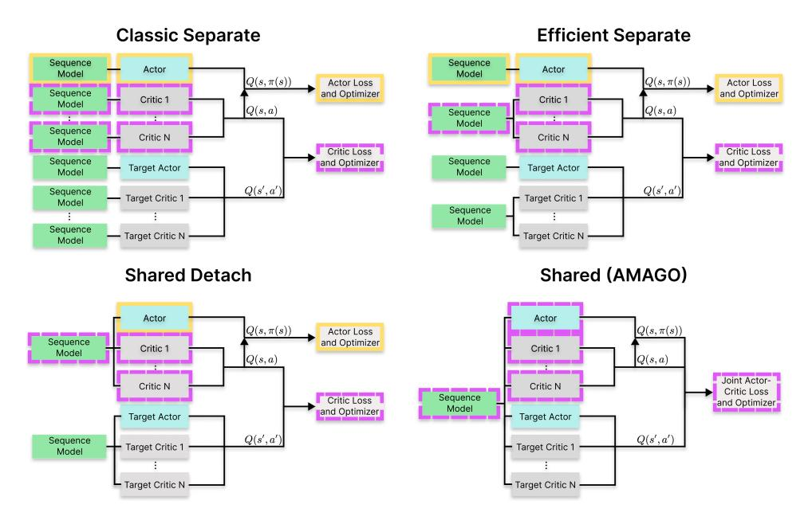
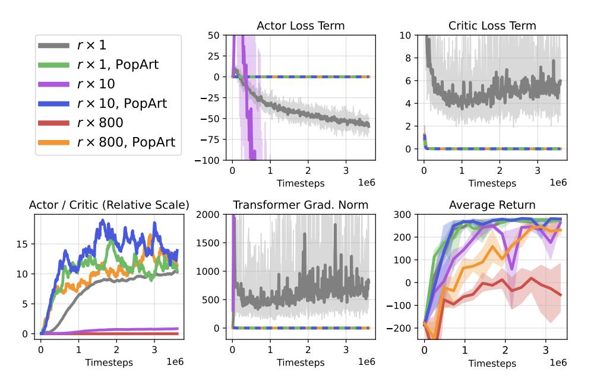
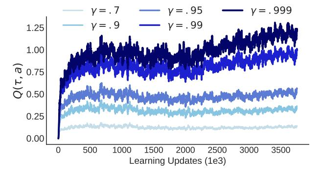
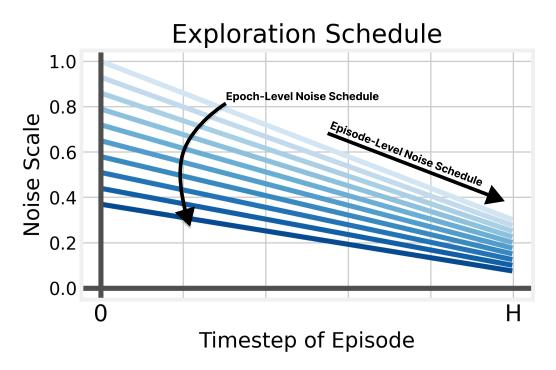

# A AMAGO DETAILS

## A.1 SHARING A SINGLE SEQUENCE MODEL IN OFF-POLICY RL

Off-policy actor-critic methods compute loss terms with an ensemble of actor and critic networks along with a moving-average copy of their parameters used to generate temporal difference targets. Extending the feed-forward (fully observed) setup to sequence-based learning results in an excessive number of sequence model forward/backward passes per training step (Figure [10](#page-14-0) top left) [\[69\]](#page-11-20). This has created several ways to share parameters and improve efficiency. Ni et al. [\[22\]](#page-9-21) share a sequence model between the ensemble of critic networks, which becomes more important when using REDQ [\[74\]](#page-12-0) (Fig. [10](#page-14-0) top right). Parameters can be shared across the actor and critics, but this has been shown to be unstable. SAC+AE [\[72\]](#page-11-23) confronts a similar problem in pixel-based learning and popularized the solution of detaching the larger base model (the Transformer in our case) from the actor's gradients (Fig. [10](#page-14-0) bottom left). This approach has also been demonstrated in sequence-learning [\[71\]](#page-11-22). AMAGO removes the target sequence model as well — sharing one Transformer across every actor, critic, and target network while preserving the actor's gradients and training with one optimizer (Fig. [10](#page-14-0) bottom right). Ni et al. [\[22\]](#page-9-21) evaluate a fully shared architecture but find it to be unstable and do not consistently apply it across every domain. We find that instability is caused by the critic receiving gradients from the actor's loss and remove these terms during the backward pass of the joint actor-critic objective (Appendix [A.2](#page-14-3) Equation [3\)](#page-15-0). Concurrent to our work, [\[96\]](#page-12-22) addressed the same problem by using a frozen copy of the critics to compute the actor loss.

> **[图片提取文字 (无描述)]:**
> Classic Separate **Efficient Separate** Sequence Sequence Actor Actor Model Model  $Q(s, \pi(s))$  $Q(s, \pi(s))$ Actor Loss Actor Loss Sequence and Optimizer and Optimizer Critic 1 Critic 1 Model Q(s, a)Q(s, a)Sequence Model Sequence Critic N Critic N Model Critic Loss Critic Loss Sequence Sequence and Optimizer and Optimizer Target Actor Target Actor Model Model Q(s', a')Q(s', a')Sequence Target Critic 1 Target Critic 1 Model Sequence 1 Model Sequence Target Critic N Target Critic N Model Shared (AMAGO) Shared Detach Actor Actor  $Q(s, \pi(s))$ Actor Loss  $Q(s, \pi(s))$ Sequence and Optimizer Critic 1 Critic 1 Model Q(s, a)Q(s, a)Joint Actor-Critic N Critic N Critic Loss Sequence Critic Loss and Optimizer Model and Optimizer Target Actor Target Actor Q(s', a')Q(s', a')Sequence Target Critic 1 Target Critic 1 Model Target Critic N Target Critic N

Figure 10: Evolution of Off-Policy Actor-Critic Agent Architectures. Black arrows give a highlevel overview of how the actor, critic(s), and target networks combine to compute the training objective(s). Network borders are color-coded according to the loss function they optimize. Sequence models (green) are more expensive than feed-forward actors (blue) and critics (gray), which has motivated several ways to simplify the training process while maintaining stability.

## A.2 BASE ACTOR-CRITIC UPDATE

AMAGO's shared sequence model reduces the RL training process to the standard feed-forward case where the output of the trajectory encoder becomes the state array (s), and the batch size is effectively larger by a factor of the context length l. At a high level, we are training a stochastic policy π with a custom variant of the off-policy actor-critic update derived from DDPG [\[69\]](#page-11-20). In continuous control, the critic Q takes actions as a network input and outputs a scalar value. In discrete environments, the critic outputs an array corresponding to the value for each of the |A| actions [\[70\]](#page-11-21). The actor is trained

to maximize the output of the critic (LPG) while the critic is trained to minimize the classic one-step temporal difference error (LTD):

$$\mathcal{L}_{PG}(s) = -Q(\nabla\!\!\!/ s, \pi(s))$$
 Actor Term (1)

$$\mathcal{L}_{\text{TD}}(s, a, r, s') = \left(Q(s, a) - (r + \gamma \not \nabla \bar{Q}(s', \bar{\pi}(s')))\right)^2 \qquad \text{Critic Term} \qquad (2)$$

Where ∇ is a stop-gradient, and Q¯ and π¯ denote target critic and actor networks, respectively. AMAGO then combines these two terms into a single shared loss:

$$\mathcal{L}_{\text{AMAGO}} = \underset{\tau \sim \mathcal{D}}{\mathbb{E}} \left[ \frac{1}{l} \sum_{t=0}^{l} \lambda_0 \mathcal{L}_{\text{TD}}(s_t, a_t, r_t, s_{t+1}) + \lambda_1 \mathcal{L}_{\text{PG}}(s_t) \right]$$
(3)

As mentioned in Appendix [A.1,](#page-14-2) we zero gradients to prevent our critic from directly minimizing the actor's objective LPG. The weights of each term (λ0, λ1) can be important but unintuitive hyperparameters. LPG and LTD do not scale equally with Q, and the scale of Q values depends on the environment's reward function and changes over time at a rate determined by learning progress. This means that the relative importance of our loss terms to their shared trajectory encoder's gradient update is shifting unpredictably, making (λ0, λ1) difficult to set in a new environment.

> **[图片提取文字 (无描述)]:**
> Actor Loss Term Critic Loss Term 50 10  $r \times 1$ 25 8  $r \times 1$ , PopArt 0 6  $r \times 10$ -25  $r \times 10$ , PopArt 4 -50  $r \times 800$ 2 -75 $r \times 800$ , PopArt 0 -1001e6 1e6 **Timesteps** Timesteps Actor / Critic (Relative Scale) Transformer Grad. Norm Average Return 2000 300 200 1500 15 100 1000 10 0 500 5 -100-200 0 1e6 1e6 **Timesteps Timesteps** 1e6 **Timesteps**

Figure 11: Scaling AMAGO's Learning Update with PopArt. PopArt automatically places the relative importance of the actor and critic loss terms in AMAGO's shared learning update on a reasonably predictable scale, and enables stable training without extreme gradient clipping.

PopArt [\[85\]](#page-12-11) is typically used to normalize the scale of value-based loss functions when training one policy across multiple domains. However, we use it to reduce hyperparameter tuning by putting Q (and therefore LPG and LTD) on a predictable scale so that (λ0, λ1) can have meaningful default values. Figure [11](#page-15-1) demonstrates the problem and PopArt's solution. In this example, we train context length l = 128 AMAGO agents on LunarLander-v2 [\[100\]](#page-13-1). We use our default values (λ0, λ1) = (10, 1) (Table [4\)](#page-32-1). The gray curves track the actor and critic objectives on the environment's default reward scale without using PopArt. Performance happens to be quite strong (Fig. [11](#page-15-1) lower right), but the actor and critic loss scales make gradient norms (lower center) destructively large without clipping. When we scale rewards by a constant (r × 10, r × 800), the optimization metrics often cannot be shown on a readable y-axis and the relative importance of the actor term is now nearly zero (lower left). PopArt automatically puts the relative importance of the actor loss on a predictable order of magnitude (blue, green, orange), and we are no longer relying on alarming levels of gradient clipping.

**Critic Ensembling.** In practice, the actor's goal of maximizing the critic's output leads to value overestimation that is handled by using the minimum prediction of two critics trained in parallel [73]. Overestimation is especially concerning in our case, because AMAGO's use of long sequences means that its effective replay ratio [79] can be unusually high; it is not uncommon for our agents to train on their entire replay buffer several times between rollouts. We enable the use of REDQ ensembles [74] with more than two critics as a precaution.

**Filtered Behavioral Cloning.** One difference between training policies with a supervised objective (where Transformers are common and relatively stable) and RL is that our actor's update depends on the scale and stability of the Q-value surface (Eq. 1). We can improve learning with a "filtered" behavior cloning (BC) actor objective that is independent of the scale of the critics' output space, which is added to Eq. 3 with a third weight  $\lambda_2$ :

$$A(s,a) = Q(s,a) - V(s) = Q(s,a) - \mathop{\mathbb{E}}_{a' \sim \pi(s)}[Q(s,a')] \quad \text{Advantage Estimate} \qquad \text{(4)}$$
 
$$f(s,a) = \mathbbm{1}_{\{A(s,a) > 0\}} \qquad \qquad \text{Binary Filter [92]} \qquad \text{(5)}$$

$$f(s,a) = 1_{\{A(s,a)>0\}}$$
 Binary Filter [92] (5)

$$\mathcal{L}_{FBC}(s, a) = -f(s, a)\log\pi(a \mid s)$$
 Filtered BC Term (6)

The actor's standard  $\mathcal{L}_{PG}$  term has a strong learning signal when the value surface is steep, but  $\mathcal{L}_{FBC}$ only depends on the sign of the advantage and behaves more like supervised learning. AMAGO is now always optimizing a stable sequence modeling objective where we learn to predict replay buffer actions with positive advantage. Variants of the filtered BC update appear in online RL but have become more common in offline settings [101, 102]. AMAGO's gradient flow causes  $\lambda_2 \mathcal{L}_{FBC}$ to impact the objective of the trajectory encoder and actor network but not the critic. We use the binary filter from CRR [92] because it does not add hyperparameters, and training on batches of long sequences helps mask its tendency to increase variance by filtering too many actions [103].

Multi-Gamma Learning. Long horizons and sparse rewards can lead to flat Q-value surfaces and slow the convergence of TD learning. AMAGO computes  $\mathcal{L}_{PG}$ ,  $\mathcal{L}_{TD}$ , and  $\mathcal{L}_{FBC}$  in parallel across  $\gamma_N$  values of the discount factor  $\gamma$ . Each  $\gamma$  creates its own value surface — informally making it less likely that all of our loss terms have converged and improving representation learning of shared parameters. Discrete actor and critics' output layers become  $\gamma_N$  times larger. Actions for each  $\gamma$  need to be an input to continuous critics (along with  $\gamma$  values themselves), so the effective batch size of continuous-action critic networks is multiplied by  $\gamma_N$ . In either case, however, the relative cost of this technique becomes low as the size of the shared Transformer increases. An example of the Qscales learned by different values of  $\gamma$  is plotted in Figure 12. During rollouts, we can select the index of the actor's outputs corresponding to any of the  $\gamma_N$  horizons used during training. This selection could potentially be randomized to generate more diverse behavior, but we select a fixed  $\gamma = .999$  in our experiments.

> **[图片提取文字 (无描述)]:**
> y = .999 $\gamma = .7$ y = .95y = .991.25 1.00 (a, t) 0.75 0.50 0.25 0.00 0 500 1000 1500 2000 2500 3000 3500 Learning Updates (1e3)

Figure 12: Multi-Gamma Actor-Critic Training. AMAGO optimizes one Transformer on actorcritic loss terms corresponding to many values of the discount factor  $\gamma$ , and can use the actions that maximize any horizon at test-time. We show the average Q-value across trajectory sequences throughout training at different discounts.

Our multi-gamma update is motivated by a need to improve learning signal for unstable sequence models in long-horizon actor-critic updates with discrete and continuous actions. This approach was developed as a natural extension of a training objective that is already parallelized across timesteps and an ensemble of critics. After the initial release of our work, we learned that a discrete value-based [\[3,](#page-9-2) [104\]](#page-13-5) version of the multi-gamma update has previously been studied as a byproduct of hyperbolic discounting in pixel-based MDP environments [\[91,](#page-12-17) [105\]](#page-13-6). The hyperbolic discounting perspective actually motivates a more diverse range of γ values than used in our results (Table [4\)](#page-32-1), and may greatly improve AMAGO's sample efficiency (Appendix [C.1](#page-20-1) Figure [18\)](#page-21-0).

Stochastic Policies and Exploration. AMAGO samples from a stochastic policy during both data collection and evaluation. Because we do not use entropy constraints [\[106\]](#page-13-7), we add exploration noise during data collection. In discrete domains, noise is added as in classic epsilon-greedy, while continuous domains randomly perturb the action vector as in TD3 [\[73\]](#page-11-24). The level of action randomness is determined by a hyperparameter ϵ that is typically annealed over a fixed number of environment steps. AMAGO adapts this schedule to more closely align with the exploration/exploitation trade-off that occurs within the adaption horizon of any given CMDP [\[64\]](#page-11-15). ϵ is annealed over the H timesteps of a rollout, and the intensity of this schedule decreases over training. This process is visualized in Figure [13.](#page-17-1) Because the parameters of this schedule are difficult to tune, we heavily randomize them across AMAGO's parallel actors — meaning we are always collecting data at varying levels of action noise. Due to this randomization there are no main experiments where we found tuning the exploration schedule to be critical to achieving strong results[3](#page-17-2) . In fact, randomizing over ϵ is probably the more important implementation detail, but we describe the rest of the approach for completeness. The slope of the episode-level schedule can be set to zero to recover the standard approach.

> **[图片提取文字 (无描述)]:**
> **Exploration Schedule** 1.0 **Epoch-Level Noise Schedule** 0.8 Noise Scale Episode-Level Noise Schedule 0.0 Timestep of Episode

Figure 13: Exploration Noise in Implicit POMDPs. AMAGO adapts the standard random exploration schedule to more closely align with the exploration/exploitation trade-off that occurs when acting in an implicit POMDP.

