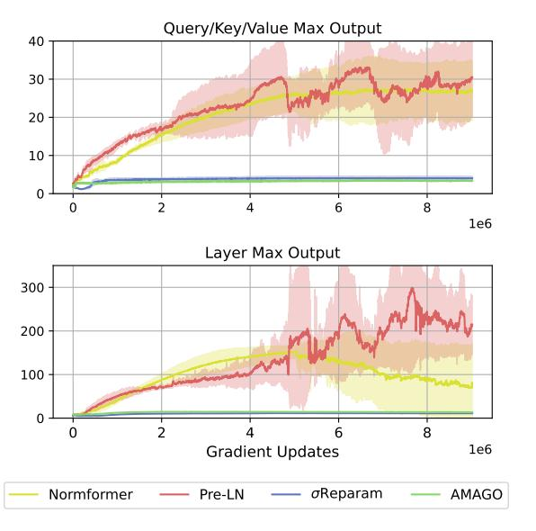
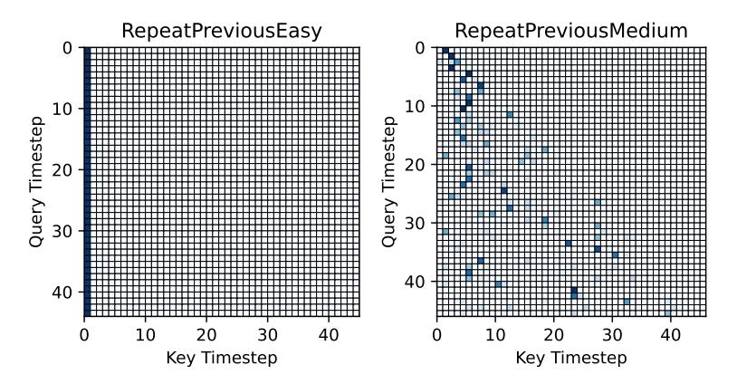
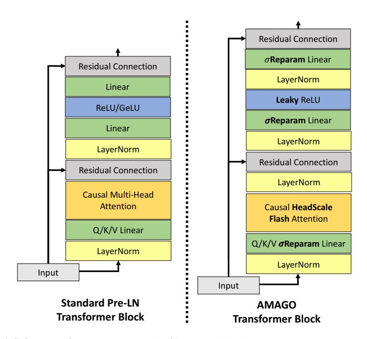
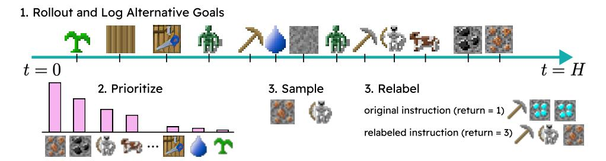

# A.3 AMAGO ARCHITECTURE

Transformer. We observe performance collapse when using a standard Pre-LayerNorm [\[77\]](#page-12-3) Transformer in long training runs. In rare cases, we find that this is caused by gradient collapse due to saturating ReLU activations. For this reason we replace every ReLU/GeLU (including those in the actor/critic MLPs) with a Leaky ReLU that will allow learning to continue. This idea is also motivated by work in network plasticity and long training runs in continual RL, where activations other than ReLU can be a simple baseline [\[83\]](#page-12-9). We find that this change fixes gradient instability, but does not prevent performance collapse. Instead, collapse is now caused by saturating activations in the residual block of AMAGO's Transformer. We apply two existing methods that effectively solve this problem. Normformer's [\[88\]](#page-12-14) additional LayerNorms [\[107\]](#page-13-8) isolate the optimization problem to the query/key/value activations whose saturation directly causes attention entropy collapse. σReparam [\[87\]](#page-12-13) stabilizes attention by limiting the magnitude of queries, keys, and values. Figure [14](#page-18-1) demonstrates this pattern of activations on a sample POPGym environment where the optimal policy requires recall of a specific timestep and encourages low-entropy attention matrices. However, we observe

3The toy T-Maze memory result (Figure [5\)](#page-6-0) uses a unique schedule discussed in Appendix [C.2,](#page-23-0) but this adjustment is motivated by the environment setup and is not based on tuning.

> **[图片提取文字 (无描述)]:**
> Query/Key/Value Max Output 40 30 20 10 0 2 6 8 1e6 Layer Max Output 300 200 100 0 ż 1e6 **Gradient Updates** Normformer  $\sigma$ Reparam Pre-LN **AMAGO**

Figure 14: **Transformer Residual Block Activations in a Low-Entropy Attention Environment.** We record the maximum output of a Transformer layer and its query/key/value vectors in our default POPGym architecture while training in a recall-intensive environment where the optimal policy encourages a low-entropy attention matrix (Figure 15).

> **[图片提取文字 (无描述)]:**
> RepeatPreviousEasy RepeatPreviousMedium Timeste 20 Query 30 ---------------------------------------\_\_\_\_\_\_\_\_\_\_\_\_\_\_\_\_\_\_\_\_\_\_\_\_\_\_\_\_\_\_\_\_\_\_\_\_\_\_\_ 10 10 Key Timestep Key Timestep

Figure 15: **Examples of Low-Entropy Attention Matrices.** We visualize representative examples of AMAGO attention heads in two recall-intensive POPGym environments on the 45th timestep of a rollout (for readability). Darker blue entries indicate high attention weights. Both policies are nearly optimal with average returns > .99.

collapse due to saturating activations in many environments in our experiments if training continues for long enough — even when performance has not yet converged. Our architectural changes let us stably train sparse attention patterns like those visualized in Figure 15. AMAGO uses Flash Attention [108] to enable long context lengths on a single GPU (Figure 29). Figure 16 summarizes our default architectural changes.

**Instruction-Conditioning.** AMAGO uses a small RNN or MLP to process the instruction sequence of goal tokens, and the resulting representation is concatenated to the CMDP information that forms Transformer input tokens. It would be simpler to add the instruction to the beginning of the context sequence. The only reason for the extra complexity of the goal embedding is to allow for fair baselines that do not use context sequences ("w/o Memory").

> **[图片提取文字 (无描述)]:**
> Residual Connection σReparam Linear Residual Connection LayerNorm Linear Leaky ReLU ReLU/GeLU σReparam Linear Linear LayerNorm LayerNorm Residual Connection Residual Connection LayerNorm Causal Multi-Head Attention Causal HeadScale Flash Attention Q/K/V Linear Q/K/V **oReparam** Linear LayerNorm LayerNorm Input Input Standard Pre-LN AMAGO Transformer Block Transformer Block

Figure 16: **AMAGO Transformer Block.** (**Left**) A standard Pre-LayerNorm (Pre-LN) Transformer layer [77]. (**Right**) AMAGO replaces all saturating activations with Leaky ReLUs and uses additional LayerNorms [107] (as in NormFormer [88]) and a modified linear layer ( $\sigma$ Reparam [87]). These strategies limit the magnitude of activations along the residual block and effectively prevent attention entropy collapse.

#### B RELABELING WITH GOAL IMPORTANCE SAMPLING

AMAGO generates training data in multi-goal domains by relabeling trajectories with alternative instructions based on hindsight outcomes. Relabeling improves reward sparsity for actor-critic training, and greatly amplifies the learning signal of existing data by recycling the same experience with many different instructions. This technique works by saving the rewards for the entire goal space during rollouts, rather than just the rewards for the goals in the intended instruction (Figure 17 Step 1). While evaluating many different dense reward terms would be unrealistic, it is more practical in sparse goal-conditioned domains where success can be evaluated with simple rules. Algorithm 1 provides a high-level overview of multi-step relabeling. This technique reduces to HER [45] when: 1) the goal space is a subset of the state space, 2) goal sequence lengths k=1, and 3) alternative goals are primarily sampled from the end of the trajectory (Alg. 1 line 4).

## Algorithm 1 Simplified Hindsight Instruction Relabeling

**Require:** Trajectory  $\tau$  with goal sequence  $g = (g^0, \dots, g^k)$  of length k

- 1:  $n \leftarrow$  number of steps in g successfully completed by  $\tau$
- 2:  $(t_{q^0}, \dots, t_{q^n}) \leftarrow \text{timesteps where each sub-goal of } g \text{ was achieved}$
- 3:  $h \leftarrow \text{relabel\_count}(0, k n) \in [0, k n] \triangleright \text{Choose a number of hindsight goals to insert.}$  Defaults to uniform sampling.
- 4:  $(a^0, \ldots, a^h), (t_{a^0}, \ldots, t_{a^h}) \leftarrow \text{sample\_alternative\_goals}(\tau) \triangleright \text{Sample a goal from } h$  timesteps in  $\tau$  that completed alternative objectives. Defualts to uniform sampling.
- 5:  $r \leftarrow \text{sort}((a^0, \dots, a^h, g^0, \dots, g^n), \text{by}=(t_{a^0}, \dots, t_{a^h}, t_{g^0}, \dots, t_{g^n})) \rightarrow \text{Insert new goals in chronological order.}$
- 6:  $\tau' \leftarrow \text{replay}(\tau, r)$   $\triangleright$  Recompute rewards and terminals based on goal sequence r (Fig. 2).

Generating a diverse training dataset with relabeled sequences of goals allows our agents to carry out multi-stage tasks and has important exploration advantages (Appendix C.5), but creates a practical

issue where we have too many alternative instructions to choose from. Domains like Crafter and MazeRunner create rollouts with dozens or hundreds of candidate goals over the full length of the trajectory. There are also goal types that can occur simultaneously and for many consecutive timesteps. AMAGO relabels by sampling one instruction from the many sub-sequences of these goals (Alg. [1](#page-19-2) line 4). With so many combinations of goal instructions available to us, we need a way to focus our learning updates on useful information.

> **[图片提取文字 (无描述)]:**
> 1. Rollout and Log Alternative Goals 2. Prioritize 3. Relabel 3. Sample original instruction (return = 1) relabeled instruction (return = 3)

Figure 17: Relabeling With Prioritized Goal Sampling. Long rollouts in multi-goal domains lead to an unmanageable number of candidate instructions for relabeling. AMAGO improves sample efficiency without domain knowledge by prioritizing rare goals.

Our solution is a weighted relabeling scheme that helps sort through the noise of common outcomes by prioritizing interesting goals. While there could be opportunities to add domain knowledge in this process, we prefer to avoid this and sample goals according to their rarity. AMAGO tracks both the frequency that a particular goal occurs at any given timestep, and the frequency that it occurs at all in a given episode. We assign a priority score to goals based on their rarity, which then lets us modify the relabeling scheme to sample based on these scores (Figure [17\)](#page-20-2). AMAGO's technical details are designed to reduce hyperparameter sensitivity and prevent individual tricks like this from becoming unintuitive points of failure that require manual tuning. Therefore we automatically randomize over several reasonable approaches. Examples include sampling from the top-k most rare goals according to either frequency statistic, or those above either the median or minimum rarity in a trajectory to filter trivial goals. AMAGO still relabels uniformly with some frequency, which keeps the full diversity of our dataset available and prevents information from being lost. Randomization over these implementation details occurs on a per-trajectory level, meaning every batch has sequences that were generated with a wide range of strategies. We defer the precise details to our open-source code release. Appendix [C.5](#page-27-0) provides a quantitative demonstration of our method.

