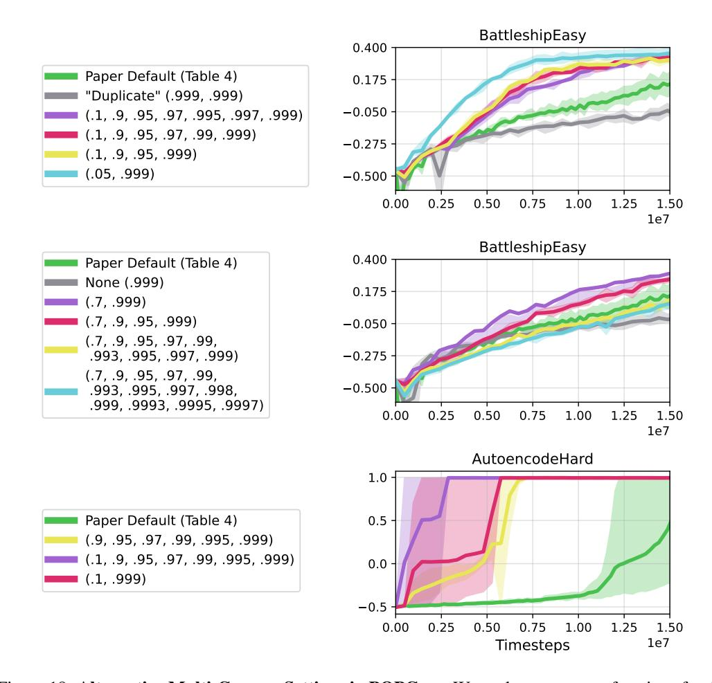
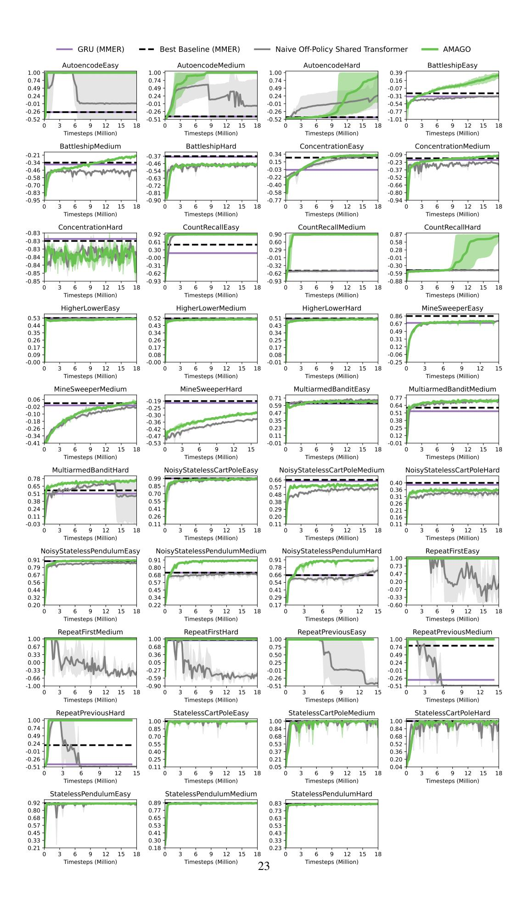
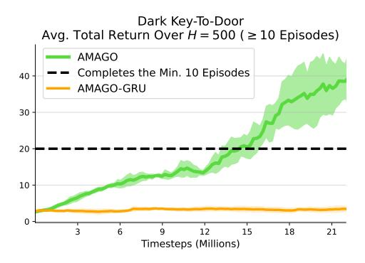
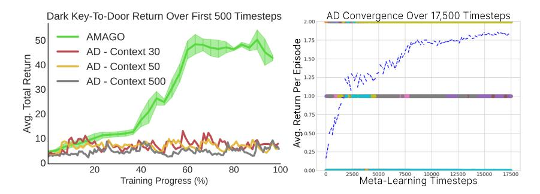
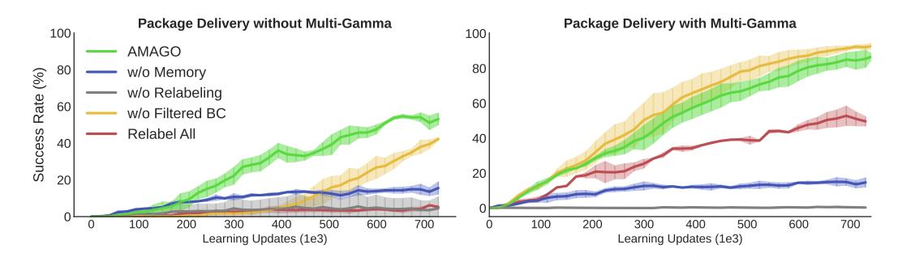
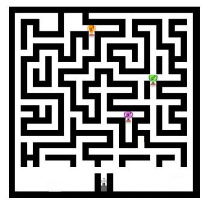

# C EXPERIMENTAL DETAILS AND FURTHER ANALYSIS

This section provides a detailed analysis of AMAGO's main results. Each subsection will give a description of our custom learning domains, followed by a more complete discussion of the results in the main text with additional experiments. Hyperparameter and compute information is listed in Appendix [D.](#page-32-0)

## C.1 POPGYM

We evaluate on 39 environments from the POPGym suite [\[30\]](#page-10-5) and follow the original benchmark in using policy architectures with a memory hidden state of 256. Learning curves for each environment are shown on a full page below. Figure [3](#page-5-0) reports results at the benchmark standard of 15M timesteps, though the learning curves extend slightly further when data is available. We plot the maximum and minimum value achieved by any seed to highlight the stability of AMAGO relative to the "naive" off-policy Transformer baseline. Each environment defaults to 3 random seeds, as in [\[30\]](#page-10-5). The variance of AMAGO at convergence is extremely low. However, there can be significant variance in the timestep where rapid increases in performance begin. There are two environments where this variance impacts results because it occurs near the 15M sample limit (AutoencodeHard and CountRecallHard), which we address by running 9 random seeds.

The "naive" agent maintains AMAGO's shared actor-critic update but disables many of our other technical details. These include the modified Transformer architecture (Appendix [A.3\)](#page-17-0) and multigamma update. The naive agent also reduces the REDQ ensemble from AMAGO's default of 4 parallel critics to the standard 2, and uses a lower discount factor of γ = .99. This causes learning to collapse in many seeds. However, collapse generally does not impact the final scores reported in Figure [3](#page-5-0) which indicate the *maximum mean episodic return* (MMER) achieved during training. The effects of policy collapse can be much more damaging in longer goal-conditioned experiments where it occurs before convergence, but is too expensive to demonstrate at this scale.

AMAGO was briefly tuned on one environment (ConcentrationEasy) to meet the benchmark's sample limit. However, our results suggest that we likely did not push sample efficiency settings high enough, as AMAGO is still improving well after 15M timesteps in some difficult environments. The multi-gamma update (Appendix [A.2\)](#page-14-3) provides a useful starting point for increased sample efficiency. The combination of this techniques' compute efficiency and our focus on long-horizon learning motivated a large number of γ > .99 (Table [4\)](#page-32-1) throughout our work. However, another motivation for a similar update inspires a broader range including low γ values [\[91,](#page-12-17) [105\]](#page-13-6). We experiment with a wider range of settings in two POPGym environments where our main results are limited by sample efficiency in Figure [18.](#page-21-0)

> **[图片提取文字 (无描述)]:**
> BattleshipEasy 0.400 Paper Default (Table 4) 0.175 "Duplicate" (.999, .999) -0.050(.1, .9, .95, .97, .995, .997, .999) (.1, .9, .95, .97, .99, .999) -0.275(.1, .9, .95, .999) (.05, .999)-0.5000.50 0.25 0.75 1.25 1.50 0.00 1.00 1e7 BattleshipEasy 0.400 Paper Default (Table 4) None (.999) 0.175 (.7, .999)(.7, .9, .95, .999)-0.050(.7, .9, .95, .97, .99,.993, .995, .997, .999) -0.275(.7, .9, .95, .97, .99,-0.500.993, .995, .997, .998, .999, .9993, .9995, .9997) 0.25 0.50 1.00 0.75 0.00 1.25 1.50 1e7 AutoencodeHard 1.0 Paper Default (Table 4) 0.5 (.9, .95, .97, .99, .995, .999) (.1, .9, .95, .97, .99, .995, .999)0.0 (.1, .999)-0.50.50 0.75 1.00 1.25 0.25 1.50 0.00 1e7 **Timesteps**

Figure 18: Alternative Multi-Gamma Settings in POPGym. We evaluate a range of settings for the discount factor ensemble used in AMAGO's learning update, and find that the defaults used in our main experiments may be underestimating the importance of short-horizon γ values.

> **[图片提取文字 (无描述)]:**
> — GRU (MMER) — Naive Off-Policy Shared Transformer Best Baseline (MMER) AMAGO AutoencodeEasy AutoencodeMedium AutoencodeHard BattleshipEasy 1.00 1.00 1.00 0.39 0.74 0.74 0.74 0.16 0.49 0.49 0.49 -0.070.24 0.24 0.24 -0.31-0.01 -0.01-0.01 -0.54-0.26-0.26-0.26-0.77-0.52-0.52-1.0112 15 0 15 12 15 12 12 Timesteps (Million) Timesteps (Million) Timesteps (Million) Timesteps (Million) BattleshipMedium BattleshipHard ConcentrationEasy ConcentrationMedium 0.34 -0.09-0.21 -0.370.15 -0.34-0.23-0.46-0.03 -0.46-0.37-0.54-0.22-0.52-0.58-0.63-0.40-0.70-0.66-0.72-0.83-0.81-0.58-0.80-0.95-0.90-0.9412 15 18 12 15 18 12 15 18 12 15 Timesteps (Million) Timesteps (Million) Timesteps (Million) Timesteps (Million) CountRecallEasy CountRecallMedium CountRecallHard ConcentrationHard -0.830.92 0.90 0.87 -0.830.61 0.60 0.58 -0.830.30 0.29 0.28 -0.84 -0.00 -0.01 -0.01-0.84-0.30-0.31-0.32-0.85-0.62-0.62-0.59-0.85-0.93-0.93-0.8815 18 12 15 9 12 15 9 12 15 12 Timesteps (Million) Timesteps (Million) Timesteps (Million) Timesteps (Million) HigherLowerEasy HigherLowerMedium HigherLowerHard MineSweeperEasy 0.86 0.53 0.52 0.51 0.67 0.44 0.43 0.43 0.49 0.35 0.34 0.34 0.31 0.26 0.26 0.25 0.12 0.17 0.17 0.17 0.09 0.08 0.08 -0.06-0.00 -0.01-0.25 15 9 12 15 18 12 15 9 12 18 12 15 18 Timesteps (Million) Timesteps (Million) Timesteps (Million) Timesteps (Million) MineSweeperMedium MineSweeperHard MultiarmedBanditEasy MultiarmedBanditMedium 0.77 0.71 0.06 -0.190.59 0.64 -0.02 -0.250.51 0.47 -0.10-0.30 0.35 0.38 -0.18-0.36-0.260.23 0.25 -0.42-0.470.11 0.12 -0.34-0.41-0.53-0.01 -0.0115 12 15 12 15 12 12 15 Timesteps (Million) Timesteps (Million) Timesteps (Million) Timesteps (Million) MultiarmedBanditHard NoisyStatelessCartPoleEasy NoisyStatelessCartPoleMedium NoisyStatelessCartPoleHard 0.78 0.99 0.40 0.65 0.85 0.57 0.36 0.51 0.70 0.48 0.31 0.38 0.55 0.38 0.26 0.24 0.41 0.29 0.21 0.11 0.26 0.20 0.16 -0.030.11 12 15 18 12 15 18 12 15 12 15 18 Timesteps (Million) Timesteps (Million) Timesteps (Million) Timesteps (Million) NoisyStatelessPendulumEasy NoisyStatelessPendulumMedium NoisyStatelessPendulumHard RepeatFirstEasy 1.00 0.91 0.91 0.91 0.73 0.79 0.78 0.80 0.47 0.67 0.68 0.66 0.20 0.56 0.57 0.54 -0.070.44 0.45 0.41 0.32 0.34 0.29 -0.330.20 0.22 -0.600.17 15 15 15 12 18 12 18 12 Timesteps (Million) Timesteps (Million) Timesteps (Million) Timesteps (Million) RepeatFirstMedium RepeatFirstHard RepeatPreviousEasy RepeatPreviousMedium 1.00 1.00 1.00 1.00 0.67 0.68 0.75 0.74 0.33 0.36 0.50 0.49 0.00 0.05 0.25 0.24 -0.33-0.27-0.01-0.01-0.66-0.59-0.26-0.26-1.00 -0.90 -0.51-0.5115 18 12 15 12 12 12 Timesteps (Million) Timesteps (Million) Timesteps (Million) Timesteps (Million) RepeatPreviousHard StatelessCartPoleEasy StatelessCartPoleMedium StatelessCartPoleHard 1.00 1.00 1.00 1.00 0.74 0.84 0.85 0.84 0.49 0.70 0.68 0.68 0.24 0.52 0.55 0.53 -0.01 0.40 0.37 0.36 -0.260.25 0.21 0.20 -0.51 0.11 0.05 0.04 12 15 18 0 15 18 18 15 12 12 12 15 Timesteps (Million) Timesteps (Million) Timesteps (Million) Timesteps (Million) StatelessPendulumEasy StatelessPendulumMedium StatelessPendulumHard 0.92 0.89 0.83 0.80 0.77 0.73 0.68 0.65 0.63 0.57 0.53 0.53 0.45 0.41 0.43 0.33 0.30 0.33 0.21 0.18 15 12 18 12 15 18 12 15 Timesteps (Million) Timesteps (Million) Timesteps (Million) 23

## C.2 ADDITIONAL MEMORY AND MULTI-EPISODIC META-RL RESULTS

Half-Cheetah Velocity. In Figure [5](#page-6-0) (left) we use a classic meta-RL benchmark from [\[97\]](#page-12-23) as an example of a case where AMAGO's long sequences and high discount factors are clearly unnecessary but do not need tuning. This task is solvable with short context lengths of just a few timesteps. We evaluate adaptation over the first 3 episodes (H = 600) and report baselines from variBAD [\[64\]](#page-11-15), BOReL [\[109\]](#page-13-10), RL2 [\[11\]](#page-9-10), and the recurrent off-policy implementation in [\[22\]](#page-9-21).

Dark-Key-To-Door. Dark-Key-To-Door is a sparse-reward multi-episodic meta-RL problem [\[28\]](#page-10-3). Figure [19](#page-23-1) compares a version of AMAGO with a Transformer and RNN trajectory encoder on a 9 × 9 version of the environment with a max episode length of 50. An agent that always fails to solve the task will encounter 10 episodes of a new environment during a meta-testing horizon of H = 500 timesteps. The maximum return per episode is 2. An adaptive agent learns to solve the task quickly once it has identified the key and door location by meta-exploration, and tries to complete as many episodes as possible in the H = 500 timestep limit. The Transformer and RNN model architectures have equal memory hidden state size and layer count, and all other training details are held fixed.

> **[图片提取文字 (无描述)]:**
> Dark Key-To-Door Avg. Total Return Over  $H = 500 \ (\ge 10 \text{ Episodes})$ AMAGO Completes the Min. 10 Episodes 40 AMAGO-GRU 30 20 10 6 12 15 18 21 Timesteps (Millions)

Figure 19: Dark Key-To-Door Trajectory Encoder Comparison. On-Policy RNNs have previously been successful in this environment but fail to make progress at l = H = 500 when directly substituted into the AMAGO agent.

We replicate Algorithm Distillation [\[28\]](#page-10-3) (AD) on an 8 × 8 version of the task by collecting training histories from 700 source RL agents. Each history is generated by a memory-free actor-critic as it improves for 50, 000 timesteps in a fixed environment e. We then train a standard Transformer architecture on the supervised task of predicting the next action in sequences sampled from these learning histories. While AD converges to high performance, it does so on roughly the same timescale as the single-task agents in its training data (Figure [20](#page-23-2) right). AMAGO can directly optimize for fast adaptation over the given horizon H, and learns a much more efficient strategy over the first few episodes in a new environment (Fig. [20](#page-23-2) left).

> **[图片提取文字 (无描述)]:**
> Dark Key-To-Door Return Over First 500 Timesteps AD Convergence Over 17,500 Timesteps 2.00 with the first of the **AMAGO** 50 9 1.75 Ebisod 1.50 AD - Context 30 **Total Return** 40 AD - Context 50 1.25 AD - Context 500 30 Return 0.75 φ.0.50 VQ 10 0.25 20 40 60 80 100 0.00 Meta-Learning Timesteps 2500 15000 17500 Training Progress (%)

Figure 20: Fast-Adaptation with Long-Context Transformers. AMAGO uses a long-context Transformer to directly optimize for fast adaptation to new environments (Left), while AD [\[28\]](#page-10-3) converges at approximately the speed of the single-task agents that generated its training data (Right).

Passive T-Maze. Ni et al. [\[96\]](#page-12-22) is a concurrent work that includes a T-maze experiment to effectively unit-test the recall ability of in-context agents; any policy that achieves the maximum return must be able to recall information from the first timestep at the final timestep H. Their results show that recurrent approaches fail around context lengths of 100, but that Transformers can stretch as high as H = 1, 500. The T-Maze task is intended to isolate memory from the effects of credit assignment and exploration. However, at extreme sequence lengths the reward begins to test the sample efficiency of epsilon-greedy exploration because reaching the memory challenge requires following the optimal policy for at least the first H − 1 timesteps. The exploration noise schedule (Appendix [A\)](#page-14-1) is modified to have standard noise near the beginning and end of an episode (when there are interesting actions to learn) but low noise in-between when it would waste a rollout to deviate from the learned policy. We avoid sampling from our stochastic policy because numerical stability protections prevent it from becoming fully deterministic, and this error accumulates over long rollouts. The reward penalty is also adapted to remain informative after the first timestep the policy disagrees with the optimal policy. These changes are not important to the main question of long-term recall but allow this environment to evaluate long sequence lengths in practice. With these adjustments, AMAGO can stably learn the optimal policy all the way out to the GPU memory barrier with context lengths l = H = 10, 000 (Figure [5](#page-6-0) top right). However, as noted in [\[96\]](#page-12-22) our choice of sequence model has no effect on the credit assignment problem of RL backups and AMAGO's Transformer does not lead to a significant improvement in the "Active T-Maze" variant of this problem.

Wind Environment. Figure [5](#page-6-0) (bottom right) reports scores of a sparse-reward meta-RL task from [\[22\]](#page-9-21). This task has continuous actions and is noted to be sensitive to hyperparameters. We evaluate AMAGO with a Transformer and RNN trajectory encoder — keeping all other details the same as in the Dark-Key-To-Door experiment. The RNN encoder is much more effective at the shorter sequence lengths in this environment (H = 75) than the Dark-Key-To-Door environment. It appears that the RNN is slightly more sample efficient than the Transformer when using the same update-to-data ratio.

Meta-World ML-1. We train AMAGO for up to 10M timesteps with various context lengths (Figure [6](#page-6-1) left). The checkpoint that reached the highest average return on the training tasks is evaluated on held-out test tasks. Each episode lasts for 500 timesteps and we evaluate for less than the 10 trials used in the original results [\[98\]](#page-12-24) because we notice the success rates saturate within the first attempt. We have also experimented with the ML-10 and ML-45 multi-task variants of Meta-World. Preliminary results suggest that short context lengths are still surprisingly capable of identifying the task. However, we find that success in these benchmarks is very dependent on the agent's ability to independently normalize the scale of rewards in each of the 10 or 45 domains. This issue is not specific to meta-RL and is common in multi-task RL generally [\[85,](#page-12-11) [110\]](#page-13-11). AMAGO assumes we do not know how many tasks make up p(e) (because in most of our other experiments this number is very large), so we leave this to future work.

## C.3 PACKAGE DELIVERY

Package Delivery is a toy problem designed to test our central focus of learning goal-conditioned policies that need to adapt to a distribution of different environments. The agent travels along a road and is rewarded for making deliveries at provided locations along the way. However, there are "forks" in the road where it needs to decide whether to turn left or right. If the agent picks the wrong direction at any fork, or reaches the end of the road, it is sent back to the starting position. The correct approach is to advance to a fork in the road, pick a direction, note whether it was the correct choice, and then recall that outcome the next time we reach the same decision. For an added factor of variation, the action that needs to be taken to be rewarded for dropping off a package is randomized in each environment, and needs to discovered by trial-and-error and then remembered so we do not run out of packages.

## C.3.1 ENVIRONMENT AND TASK DETAILS

Environment Distribution p(e): we randomly choose f ∼ U(2, 6) locations for forks on a road with length L = 30. Each fork is uniformly assigned a correct direction of left or right. These hyperparmeters could be tuned to create more difficult versions of this problem. We also uniformly sample a correct action for package delivery from 4 possibilities.

Goal Space G: all of the locations (0, . . . , L = 30) where packages could be delivered.

Observation Space: current position, remaining packages, and a binary indicator of arriving at a fork in the road.

Action Space: 8 discrete actions corresponding to moving forwards along the road, left/right at a fork, standing still (no-op), and the 4 actions that could correspond to successfully dropping off a package (depending on the environment e).

Instruction Distribution p(g | e): we randomly choose k ∼ U(2, 4) locations (without replacement) that are not road forks for package delivery.

Task Horizon H: This is the shortest problem in our goal-conditioned experiments with a maximum horizon (and therefore a maximum sequence length) of H = 180.

## C.3.2 ADDITIONAL RESULTS AND ANALYSIS

> **[图片提取文字 (无描述)]:**
> Package Delivery without Multi-Gamma Package Delivery with Multi-Gamma 100 ı **AMAGO** w/o Memory Success Rate (%) w/o Relabeling w/o Filtered BC Relabel All Learning Updates (1e3) Learning Updates (1e3)

Figure 7: Delivery Results (reproduced here for convenience).

Figure [7](#page-7-0) compares ablations of AMAGO on the Package Delivery domain. The main result is that AMAGO can successfully learn the memory-based strategy necessary to adapt to new roads. As expected, removing its context-based meta-learning capabilities ("w/o Memory") greatly reduces performance. The memory challenge of generalizing to new environments makes rewards difficult to find and relabeling is essential to learning any non-random behavior ("w/o Relabeling"). This gap between relabeling and not relabeling is a common theme across all our goal-conditioned experiments, and causes most external baselines to fail in an uninformative way. Figure [7](#page-7-0) directly compares ablations with and without multi-gamma learning. Multi-gamma is one of several implementation details in AMAGO meant to enable stable learning from sparse rewards with Transformers. Filtered behavior cloning ("w/o Filtered BC") [\[92\]](#page-12-18) is also meant to address sparsity, but we can see that its impact goes from quite positive (Fig. [7](#page-7-0) left) to slightly negative (Fig. [7](#page-7-0) right) when combined with multi-gamma. Filtered BC and multi-gamma are addressing a similar problem, but multi-gamma does so more effectively and exposes some of the drawbacks of filtered BC once the sparsity issue is resolved. For example, filtered BC can lead to a higher-entropy policy by cloning sub-optimal actions that leak through a noisy filter.

AMAGO randomly relabels trajectories to a mixture of returns between the true outcome and a complete success. The "Relabel All" curves follow the goal-conditioned supervised learning (GCSL) (Sec. [2\)](#page-1-2) approach of relabeling every trajectory with a successful instruction. While this may improve data quality, it turns the value learning problem from predicting *if* a goal will be achieved to *when* it will happen, because from the agent's perspective every goal always does [\[60\]](#page-11-11). AMAGO's high discount factors cause this to have low learning signal, making actor optimization difficult. Multigamma improves performance (Fig. [7](#page-7-0) right), because many of the γ values used during training have a short enough horizon to mask the problem. Relabeling all trajectories to be a success while turning off the BC filter and policy gradient actor loss would create a GCSL method, which have shown promise with large Transformer architectures (Sec. [2\)](#page-1-2). However we were unable to achieve competitive performance with this setup and prefer a more traditional RL learning update.

## C.4 MAZERUNNER

MazeRunner is a difficult but easily simulated problem that combines sparse goal-conditioning with long-term exploration. The agent needs to learn to navigate a randomly generated maze in order to reach a sequence of goal coordinates.

## C.4.1 ENVIRONMENT AND TASK DETAILS

Environment Distribution p(e): we randomly generate an N × N maze, and then manually adjust the bottom three rows to have a familiar layout where the agent starts in a small tunnel with open space on either side. An example 30 × 30 environment is rendered in Figure [21.](#page-26-1) We can optionally generate a random permutation of the action space, which adjusts the actions that corresponds to each direction of movement.

Goal Space G: all of the locations ((0, 0), . . . ,(N, N)) in the maze.

Observation Space: 4 depth sensors from the agent's location to the nearest wall in each direction. By default we include the (x, y) coordinates of the agent's position, which can be removed for an extra challenge that forces the agent to self-localize.

Action Space: Either 4 discrete actions or a 2-dimensional continuous space that is mapped to the 4 cardinal directions. The action directions can be randomized based on the environment e.

Instruction Distribution p(g | e): we choose k ∼ U(1, 3) locations (without replacement) that are not covered by a wall of the maze.

Task Horizon H: The task horizon creates a difficult trade-off between exploration and exploitation. There can also be worst-case scenarios where the layout of the random maze and position of the goals make completing the task impossible in a fixed time limit. We compute difficulty statistics with an oracle tree-search agent and use the results to pick safe values where the 15 × 15 version sets H = 400 while 30 × 30 sets H = 1, 000.

Figure 21: 30 × 30 MazeRunner. The agent begins in the bottom center with goal locations shown as colored trophies.

