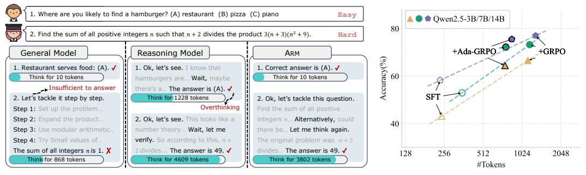

# 1 Introduction

The emergence of large reasoning models (LRMs) such as OpenAI-o1 [\[19\]](#page-10-0) and DeepSeek-R1 [\[11\]](#page-9-0) has led to unprecedented breakthroughs in problem-solving capabilities through test-time scaling [\[3;](#page-9-1) [57\]](#page-12-0). These models are designed to solve tasks using Long Chain-of-Thought (Long CoT), generating more tokens to achieve better performance. However, because they are primarily trained on tasks requiring intensive reasoning, LRMs tend to apply Long CoT uniformly across all tasks, resulting in the socalled "overthinking" problem [\[4;](#page-9-2) [42\]](#page-11-0). This issue refers to the excessive use of tokens for reasoning, which yields no performance gains and may introduce noise that misleads the model [\[52;](#page-12-1) [7\]](#page-9-3).

While some efforts aim to reduce token usage in LRMs, they often rely on clear estimations of the token budget per task [\[1;](#page-9-4) [46\]](#page-12-2) or require specialized, length-constrained model training [\[16\]](#page-10-1). In reality, such estimations are not always accurate, and a more desirable solution is for models to adaptively

∗ Project lead. Part of the work was done at Fudan University.

†Corresponding author.

> **[图片提取文字 (无描述)]:**
> 1. Where are you likely to find a hamburger? (A) restaurant (B) pizza (C) piano Easy Qwen2.5-3B/7B/14B 80 Find the sum of all positive integers n such that n + 2 divides the product 3(n + 3)(n2 + 9). Hard +Ada-GRPC +GRPO General Model Reasoning Model ARM Restaurant serves food: (A). ✓ 1. Ok, let's see. I know that 1. Correct answer is (A). < 60 Think for 10 tokens Think for 10 tokens hamburgers are... Wait, maybe Insufficient to answer there's a... The answer is (A). < 2. Let's tackle it step by step. Think for 1228 tokens 2. Ok, let's tackle this question. Overthinking Step 1: Set up the problem .... Find the sum of all positive Step 2: Expand the product... 2. Ok, let's see. This looks like a integers n... Alternatively, could 40 Step 3: Use modular arithmetic... number theory... Wait, let me there be... Let me think again. verify. So according to this, n +The original problem was n+2Step 4: Try Small values of... The sum of all integers n is 1. X2 divides... The answer is 49. ✓ divides... The answer is 49. ✓ 128 256 512 1024 2048 Think for 868 tokens Think for 4609 tokens Think for 3802 tokens #Tokens

- (a) Comparison of model reasoning behaviors on easy and hard tasks.
- (b) Accuracy vs. Token Cost.

Figure 1: (a) Comparison of reasoning behaviors across different models on easy and hard tasks. The General Model fails on harder tasks without elaborate reasoning. The Reasoning Model applies Long CoT across all tasks, causing the "overthinking" phenomenon. In contrast, our proposed ARM adapts its reasoning formats based on task difficulty, answering easy questions efficiently while adopting Long CoT for hard tasks. (b) Accuracy versus token cost for Qwen2.5 under different training strategies. "SFT", "+GRPO", and "+Ada-GRPO" refer to models trained with SFT, SFT+GRPO, and SFT+Ada-GRPO, respectively. "+Ada-GRPO" consistently outperforms the expected trade-off line between "SFT" and "+GRPO," demonstrating ARM's superior effectiveness-efficiency balance.

control their token usage based on task complexity without human intervention. For example, for the first easy question in Figure 1a, answering directly is the ideal choice, whereas for the second, hard question, the use of Long CoT is precisely what is needed. Thus, Long CoT is not a "silver bullet"; selecting an appropriate reasoning format is essential to balance efficiency and effectiveness.

In this work, we propose *Adaptive Reasoning Model* (ARM), a reasoning model capable of adaptively selecting reasoning formats based on task difficulty, balancing both performance and computational efficiency. ARM supports four reasoning formats: three efficient ones—*Direct Answer*, *Short CoT*, and *Code*—and one elaborate format, *Long CoT*. In addition to its adaptive selection mechanism (*Adaptive Mode*), ARM also supports an *Instruction-Guided Mode*, which allows explicit control over the reasoning format via special tokens, and a *Consensus-Guided Mode*, which aggregates the outputs of the three efficient formats and resorts to *Long CoT* in case of disagreement.

To train ARM, we adopt a two-stage training framework. In Stage 1, we apply supervised fine-tuning (SFT) to equip the language model with a foundational understanding of four reasoning formats. In Stage 2, we introduce Ada-GRPO, an adaptation of Group Relative Policy Optimization (GRPO) [38], which encourages efficient format selection while preserving accuracy as the primary objective. Ada-GRPO is designed to address two key issues: 1) The uniform distribution of reasoning formats regardless of task difficulty observed during the SFT stage; 2) The format collapse problem in GRPO, where  $Long\ CoT$  gradually dominates as training progresses, leading to the diminished use of other, more efficient formats. Extensive evaluations show that ARM trained with Ada-GRPO achieves comparable performance while using  $\sim 30\%$  fewer tokens than GRPO (as shown in Figure 1b), across both in-domain and out-of-domain tasks in commonsense, mathematical, and symbolic reasoning. Furthermore, by leveraging the three more efficient reasoning formats in the roll-out stage, Ada-GRPO achieves approximately a  $2\times$  training speedup compared to GRPO.

Our additional analysis further reveals that: 1) Adaptive Mode achieves a superior balance between effectiveness and token efficiency by adaptively selecting suitable reasoning formats, while Instruction-Guided Mode performs well when the specified format is suitable for the task, and Consensus-Guided Mode prioritizes performance at the cost of higher token usage. 2) The choice of backbone model has limited impact on ARM's performance when using base or instruction-tuned models, which yield similar results; however, using the DeepSeek-R1-Distill backbone improves performance on hard tasks due to the advanced reasoning capability distilled from the strong teacher DeepSeek-R1, but leads to worse performance on easy tasks despite increased token cost. 3) Length-penalty-based strategies for improving LRM efficiency suffer from performance degradation as the token budget decreases, whereas ARM maintains stable performance.

In summary, our contributions are three-fold: 1) We propose ARM, a reasoning model that balances effectiveness and efficiency by adaptively selecting task-appropriate reasoning formats. Compared to

the model that relies solely on *Long CoT*, ARM achieves comparable performance while significantly reducing token cost, saving an average of ∼ 30% and up to ∼ 70%. *2)* In addition to the default Adaptive Mode, ARM also supports Instruction-Guided Mode, which performs well when the reasoning format is appropriately specified, and Consensus-Guided Mode, which maximizes performance at the cost of higher token usage. *3)* We introduce Ada-GRPO, an adaptation of GRPO that addresses the format collapse problem and achieves a ∼ 2× training speedup without compromising performance.

