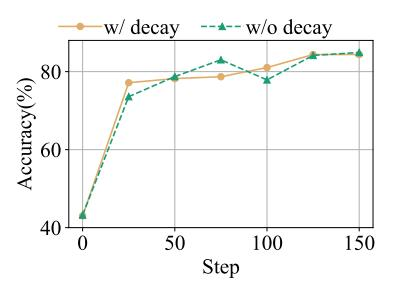
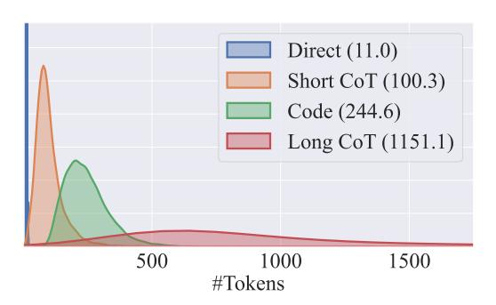

# References

- <span id="page-9-4"></span>[1] Pranjal Aggarwal and Sean Welleck. L1: Controlling how long a reasoning model thinks with reinforcement learning. *arXiv preprint arXiv:2503.04697*, 2025.
- <span id="page-9-9"></span>[2] Daman Arora and Andrea Zanette. Training language models to reason efficiently. *arXiv preprint arXiv:2502.04463*, 2025.
- <span id="page-9-1"></span>[3] Qiguang Chen, Libo Qin, Jinhao Liu, Dengyun Peng, Jiannan Guan, Peng Wang, Mengkang Hu, Yuhang Zhou, Te Gao, and Wangxiang Che. Towards reasoning era: A survey of long chain-of-thought for reasoning large language models. *arXiv preprint arXiv:2503.09567*, 2025.
- <span id="page-9-2"></span>[4] Xingyu Chen, Jiahao Xu, Tian Liang, Zhiwei He, Jianhui Pang, Dian Yu, Linfeng Song, Qiuzhi Liu, Mengfei Zhou, Zhuosheng Zhang, et al. Do not think that much for 2+ 3=? on the overthinking of o1-like llms. *arXiv preprint arXiv:2412.21187*, 2024.
- <span id="page-9-8"></span>[5] Jeffrey Cheng and Benjamin Van Durme. Compressed chain of thought: Efficient reasoning through dense representations. *arXiv preprint arXiv:2412.13171*, 2024.
- <span id="page-9-10"></span>[6] Karl Cobbe, Vineet Kosaraju, Mohammad Bavarian, Mark Chen, Heewoo Jun, Lukasz Kaiser, Matthias Plappert, Jerry Tworek, Jacob Hilton, Reiichiro Nakano, et al. Training verifiers to solve math word problems. *arXiv preprint arXiv:2110.14168*, 2021.
- <span id="page-9-3"></span>[7] Chenrui Fan, Ming Li, Lichao Sun, and Tianyi Zhou. Missing premise exacerbates overthinking: Are reasoning models losing critical thinking skill? *arXiv preprint arXiv:2504.06514*, 2025.
- <span id="page-9-12"></span>[8] Mor Geva, Daniel Khashabi, Elad Segal, Tushar Khot, Dan Roth, and Jonathan Berant. Did aristotle use a laptop? a question answering benchmark with implicit reasoning strategies. *Transactions of the Association for Computational Linguistics*, 9:346–361, 2021.
- <span id="page-9-11"></span>[9] Google. Aime problems and solutions, 2025. URL [https://artofproblemsolving.com/](https://artofproblemsolving.com/wiki/index.php/AIME_Problems_and_Solutions) [wiki/index.php/AIME\\_Problems\\_and\\_Solutions](https://artofproblemsolving.com/wiki/index.php/AIME_Problems_and_Solutions).
- <span id="page-9-13"></span>[10] Aaron Grattafiori, Abhimanyu Dubey, Abhinav Jauhri, Abhinav Pandey, Abhishek Kadian, Ahmad Al-Dahle, Aiesha Letman, Akhil Mathur, Alan Schelten, Alex Vaughan, et al. The llama 3 herd of models. *arXiv preprint arXiv:2407.21783*, 2024.
- <span id="page-9-0"></span>[11] Daya Guo, Dejian Yang, Haowei Zhang, Junxiao Song, Ruoyu Zhang, Runxin Xu, Qihao Zhu, Shirong Ma, Peiyi Wang, Xiao Bi, et al. Deepseek-r1: Incentivizing reasoning capability in llms via reinforcement learning. *arXiv preprint arXiv:2501.12948*, 2025.
- <span id="page-9-5"></span>[12] Simeng Han, Tianyu Liu, Chuhan Li, Xuyuan Xiong, and Arman Cohan. Hybridmind: Meta selection of natural language and symbolic language for enhanced llm reasoning. *arXiv preprint arXiv:2409.19381*, 2024.
- <span id="page-9-6"></span>[13] Tingxu Han, Zhenting Wang, Chunrong Fang, Shiyu Zhao, Shiqing Ma, and Zhenyu Chen. Token-budget-aware llm reasoning. *arXiv preprint arXiv:2412.18547*, 2024.
- <span id="page-9-7"></span>[14] Shibo Hao, Sainbayar Sukhbaatar, DiJia Su, Xian Li, Zhiting Hu, Jason Weston, and Yuandong Tian. Training large language models to reason in a continuous latent space. *arXiv preprint arXiv:2412.06769*, 2024.

- <span id="page-10-10"></span>[15] Dan Hendrycks, Collin Burns, Saurav Kadavath, Akul Arora, Steven Basart, Eric Tang, Dawn Song, and Jacob Steinhardt. Measuring mathematical problem solving with the math dataset. *NeurIPS*, 2021.
- <span id="page-10-1"></span>[16] Bairu Hou, Yang Zhang, Jiabao Ji, Yujian Liu, Kaizhi Qian, Jacob Andreas, and Shiyu Chang. Thinkprune: Pruning long chain-of-thought of llms via reinforcement learning. *arXiv preprint arXiv:2504.01296*, 2025.
- <span id="page-10-13"></span>[17] Edward J Hu, yelong shen, Phillip Wallis, Zeyuan Allen-Zhu, Yuanzhi Li, Shean Wang, Lu Wang, and Weizhu Chen. LoRA: Low-rank adaptation of large language models. In *International Conference on Learning Representations*, 2022. URL [https://openreview.](https://openreview.net/forum?id=nZeVKeeFYf9) [net/forum?id=nZeVKeeFYf9](https://openreview.net/forum?id=nZeVKeeFYf9).
- <span id="page-10-5"></span>[18] Jingcheng Hu, Yinmin Zhang, Qi Han, Daxin Jiang, Xiangyu Zhang, and Heung-Yeung Shum. Open-reasoner-zero: An open source approach to scaling up reinforcement learning on the base model. *arXiv preprint arXiv:2503.24290*, 2025.
- <span id="page-10-0"></span>[19] Aaron Jaech, Adam Kalai, Adam Lerer, Adam Richardson, Ahmed El-Kishky, Aiden Low, Alec Helyar, Aleksander Madry, Alex Beutel, Alex Carney, et al. Openai o1 system card. *arXiv preprint arXiv:2412.16720*, 2024.
- <span id="page-10-2"></span>[20] Bowen Jin, Hansi Zeng, Zhenrui Yue, Dong Wang, Hamed Zamani, and Jiawei Han. Search-r1: Training llms to reason and leverage search engines with reinforcement learning. *arXiv preprint arXiv:2503.09516*, 2025.
- <span id="page-10-3"></span>[21] Nathan Lambert, Jacob Morrison, Valentina Pyatkin, Shengyi Huang, Hamish Ivison, Faeze Brahman, Lester James V Miranda, Alisa Liu, Nouha Dziri, Shane Lyu, et al. T\" ulu 3: Pushing frontiers in open language model post-training. *arXiv preprint arXiv:2411.15124*, 2024.
- <span id="page-10-6"></span>[22] Ayeong Lee, Ethan Che, and Tianyi Peng. How well do llms compress their own chain-ofthought? a token complexity approach. *arXiv preprint arXiv:2503.01141*, 2025.
- <span id="page-10-15"></span>[23] Chengshu Li, Jacky Liang, Andy Zeng, Xinyun Chen, Karol Hausman, Dorsa Sadigh, Sergey Levine, Li Fei-Fei, Fei Xia, and brian ichter. Chain of code: Reasoning with a language model-augmented code emulator. In *Forty-first International Conference on Machine Learning*, 2024. URL <https://openreview.net/forum?id=vKtomqlSxm>.
- <span id="page-10-7"></span>[24] Junlong Li, Daya Guo, Dejian Yang, Runxin Xu, Yu Wu, and Junxian He. Codei/o: Condensing reasoning patterns via code input-output prediction. *arXiv preprint arXiv:2502.07316*, 2025.
- <span id="page-10-4"></span>[25] Zhong-Zhi Li, Duzhen Zhang, Ming-Liang Zhang, Jiaxin Zhang, Zengyan Liu, Yuxuan Yao, Haotian Xu, Junhao Zheng, Pei-Jie Wang, Xiuyi Chen, et al. From system 1 to system 2: A survey of reasoning large language models. *arXiv preprint arXiv:2502.17419*, 2025.
- <span id="page-10-8"></span>[26] Wang Ling, Dani Yogatama, Chris Dyer, and Phil Blunsom. Program induction by rationale generation: Learning to solve and explain algebraic word problems. In *Proceedings of the 55th Annual Meeting of the Association for Computational Linguistics (Volume 1: Long Papers)*, pages 158–167, 2017.
- <span id="page-10-12"></span>[27] Aixin Liu, Bei Feng, Bing Xue, Bingxuan Wang, Bochao Wu, Chengda Lu, Chenggang Zhao, Chengqi Deng, Chenyu Zhang, Chong Ruan, et al. Deepseek-v3 technical report. *arXiv preprint arXiv:2412.19437*, 2024.
- <span id="page-10-14"></span>[28] Yan Ma, Steffi Chern, Xuyang Shen, Yiran Zhong, and Pengfei Liu. Rethinking rl scaling for vision language models: A transparent, from-scratch framework and comprehensive evaluation scheme. *arXiv preprint arXiv:2504.02587*, 2025.
- <span id="page-10-11"></span>[29] Todor Mihaylov, Peter Clark, Tushar Khot, and Ashish Sabharwal. Can a suit of armor conduct electricity? a new dataset for open book question answering. In *Proceedings of the 2018 Conference on Empirical Methods in Natural Language Processing*, pages 2381–2391, 2018.
- <span id="page-10-9"></span>[30] OpenAI. Hello GPT-4o, 2024. URL <https://openai.com/index/hello-gpt-4o/>.

- <span id="page-11-7"></span>[31] OpenAI. Learning to reason with llms, 2024. URL [https://openai.com/index/](https://openai.com/index/learning-to-reason-with-llms) [learning-to-reason-with-llms](https://openai.com/index/learning-to-reason-with-llms).
- <span id="page-11-11"></span>[32] OpenAI. Introducing openai o3 and o4-mini, 2025. URL [https://openai.com/index/](https://openai.com/index/introducing-o3-and-o4-mini/) [introducing-o3-and-o4-mini/](https://openai.com/index/introducing-o3-and-o4-mini/).
- <span id="page-11-2"></span>[33] Long Ouyang, Jeffrey Wu, Xu Jiang, Diogo Almeida, Carroll Wainwright, Pamela Mishkin, Chong Zhang, Sandhini Agarwal, Katarina Slama, Alex Ray, et al. Training language models to follow instructions with human feedback. *Advances in neural information processing systems*, 35:27730–27744, 2022.
- <span id="page-11-9"></span>[34] Arkil Patel, Satwik Bhattamishra, and Navin Goyal. Are nlp models really able to solve simple math word problems? In *Proceedings of the 2021 Conference of the North American Chapter of the Association for Computational Linguistics: Human Language Technologies*, pages 2080–2094, 2021.
- <span id="page-11-3"></span>[35] Xiao Pu, Michael Saxon, Wenyue Hua, and William Yang Wang. Thoughtterminator: Benchmarking, calibrating, and mitigating overthinking in reasoning models. *arXiv preprint arXiv:2504.13367*, 2025.
- <span id="page-11-12"></span>[36] Jeff Rasley, Samyam Rajbhandari, Olatunji Ruwase, and Yuxiong He. Deepspeed: System optimizations enable training deep learning models with over 100 billion parameters. In *Proceedings of the 26th ACM SIGKDD international conference on knowledge discovery & data mining*, pages 3505–3506, 2020.
- <span id="page-11-14"></span>[37] David Rein, Betty Li Hou, Asa Cooper Stickland, Jackson Petty, Richard Yuanzhe Pang, Julien Dirani, Julian Michael, and Samuel R Bowman. Gpqa: A graduate-level google-proof q&a benchmark. In *First Conference on Language Modeling*, 2024.
- <span id="page-11-1"></span>[38] Zhihong Shao, Peiyi Wang, Qihao Zhu, Runxin Xu, Junxiao Song, Xiao Bi, Haowei Zhang, Mingchuan Zhang, YK Li, Y Wu, et al. Deepseekmath: Pushing the limits of mathematical reasoning in open language models. *arXiv preprint arXiv:2402.03300*, 2024.
- <span id="page-11-4"></span>[39] Zhenyi Shen, Hanqi Yan, Linhai Zhang, Zhanghao Hu, Yali Du, and Yulan He. Codi: Compressing chain-of-thought into continuous space via self-distillation. *arXiv preprint arXiv:2502.21074*, 2025.
- <span id="page-11-13"></span>[40] Guangming Sheng, Chi Zhang, Zilingfeng Ye, Xibin Wu, Wang Zhang, Ru Zhang, Yanghua Peng, Haibin Lin, and Chuan Wu. Hybridflow: A flexible and efficient rlhf framework. *arXiv preprint arXiv:2409.19256*, 2024.
- <span id="page-11-5"></span>[41] DiJia Su, Sainbayar Sukhbaatar, Michael Rabbat, Yuandong Tian, and Qinqing Zheng. Dualformer: Controllable fast and slow thinking by learning with randomized reasoning traces. In *The Thirteenth International Conference on Learning Representations*, 2024.
- <span id="page-11-0"></span>[42] Yang Sui, Yu-Neng Chuang, Guanchu Wang, Jiamu Zhang, Tianyi Zhang, Jiayi Yuan, Hongyi Liu, Andrew Wen, Hanjie Chen, Xia Hu, et al. Stop overthinking: A survey on efficient reasoning for large language models. *arXiv preprint arXiv:2503.16419*, 2025.
- <span id="page-11-10"></span>[43] Mirac Suzgun, Nathan Scales, Nathanael Schärli, Sebastian Gehrmann, Yi Tay, Hyung Won Chung, Aakanksha Chowdhery, Quoc V Le, Ed H Chi, Denny Zhou, et al. Challenging bigbench tasks and whether chain-of-thought can solve them. *arXiv preprint arXiv:2210.09261*, 2022.
- <span id="page-11-8"></span>[44] Alon Talmor, Jonathan Herzig, Nicholas Lourie, and Jonathan Berant. Commonsenseqa: A question answering challenge targeting commonsense knowledge. In *Proceedings of the 2019 Conference of the North American Chapter of the Association for Computational Linguistics: Human Language Technologies, Volume 1 (Long and Short Papers)*, pages 4149–4158, 2019.
- <span id="page-11-6"></span>[45] Kimi Team, Angang Du, Bofei Gao, Bowei Xing, Changjiu Jiang, Cheng Chen, Cheng Li, Chenjun Xiao, Chenzhuang Du, Chonghua Liao, et al. Kimi k1. 5: Scaling reinforcement learning with llms. *arXiv preprint arXiv:2501.12599*, 2025.

- <span id="page-12-2"></span>[46] Qwen Team. Qwen3 technical report, 2025. URL [https://github.com/QwenLM/Qwen3/](https://github.com/QwenLM/Qwen3/blob/main/Qwen3_Technical_Report.pdf) [blob/main/Qwen3\\_Technical\\_Report.pdf](https://github.com/QwenLM/Qwen3/blob/main/Qwen3_Technical_Report.pdf).
- <span id="page-12-3"></span>[47] Luong Trung, Xinbo Zhang, Zhanming Jie, Peng Sun, Xiaoran Jin, and Hang Li. Reft: Reasoning with reinforced fine-tuning. In *Proceedings of the 62nd Annual Meeting of the Association for Computational Linguistics (Volume 1: Long Papers)*, pages 7601–7614, 2024.
- <span id="page-12-12"></span>[48] Zengzhi Wang, Fan Zhou, Xuefeng Li, and Pengfei Liu. Octothinker: Mid-training incentivizes reinforcement learning scaling. *arXiv preprint arXiv:2506.20512*, 2025.
- <span id="page-12-7"></span>[49] Jason Wei, Xuezhi Wang, Dale Schuurmans, Maarten Bosma, Fei Xia, Ed Chi, Quoc V Le, Denny Zhou, et al. Chain-of-thought prompting elicits reasoning in large language models. *Advances in neural information processing systems*, 35:24824–24837, 2022.
- <span id="page-12-8"></span>[50] Nathaniel Weir, Muhammad Khalifa, Linlu Qiu, Orion Weller, and Peter Clark. Learning to reason via program generation, emulation, and search. In *The Thirty-eighth Annual Conference on Neural Information Processing Systems*, 2024. URL [https://openreview.net/forum?](https://openreview.net/forum?id=te6VagJf6G) [id=te6VagJf6G](https://openreview.net/forum?id=te6VagJf6G).
- <span id="page-12-9"></span>[51] Jiaxin Wen, Jian Guan, Hongning Wang, Wei Wu, and Minlie Huang. Codeplan: Unlocking reasoning potential in large language models by scaling code-form planning. In *The Thirteenth International Conference on Learning Representations*, 2025. URL [https://openreview.](https://openreview.net/forum?id=dCPF1wlqj8) [net/forum?id=dCPF1wlqj8](https://openreview.net/forum?id=dCPF1wlqj8).
- <span id="page-12-1"></span>[52] Siye Wu, Jian Xie, Jiangjie Chen, Tinghui Zhu, Kai Zhang, and Yanghua Xiao. How easily do irrelevant inputs skew the responses of large language models? In *First Conference on Language Modeling*, 2024. URL <https://openreview.net/forum?id=S7NVVfuRv8>.
- <span id="page-12-4"></span>[53] Fengli Xu, Qianyue Hao, Zefang Zong, Jingwei Wang, Yunke Zhang, Jingyi Wang, Xiaochong Lan, Jiahui Gong, Tianjian Ouyang, Fanjin Meng, et al. Towards large reasoning models: A survey of reinforced reasoning with large language models. *arXiv preprint arXiv:2501.09686*, 2025.
- <span id="page-12-6"></span>[54] Silei Xu, Wenhao Xie, Lingxiao Zhao, and Pengcheng He. Chain of draft: Thinking faster by writing less. *arXiv preprint arXiv:2502.18600*, 2025.
- <span id="page-12-10"></span>[55] An Yang, Baosong Yang, Beichen Zhang, Binyuan Hui, Bo Zheng, Bowen Yu, Chengyuan Li, Dayiheng Liu, Fei Huang, Haoran Wei, et al. Qwen2. 5 technical report. *arXiv preprint arXiv:2412.15115*, 2024.
- <span id="page-12-5"></span>[56] Weihao Zeng, Yuzhen Huang, Qian Liu, Wei Liu, Keqing He, Zejun Ma, and Junxian He. Simplerl-zoo: Investigating and taming zero reinforcement learning for open base models in the wild. *arXiv preprint arXiv:2503.18892*, 2025.
- <span id="page-12-0"></span>[57] Qiyuan Zhang, Fuyuan Lyu, Zexu Sun, Lei Wang, Weixu Zhang, Zhihan Guo, Yufei Wang, Irwin King, Xue Liu, and Chen Ma. What, how, where, and how well? a survey on test-time scaling in large language models. *arXiv preprint arXiv:2503.24235*, 2025.
- <span id="page-12-11"></span>[58] Yaowei Zheng, Richong Zhang, Junhao Zhang, Yanhan Ye, and Zheyan Luo. Llamafactory: Unified efficient fine-tuning of 100+ language models. In *Proceedings of the 62nd Annual Meeting of the Association for Computational Linguistics (Volume 3: System Demonstrations)*, pages 400–410, 2024.

### **Appendix**

### <span id="page-13-0"></span>A Details of Ada-GRPO

#### A.1 Training Objective

Following GRPO [38], given a query q and a set of responses  $O = \{o_1, o_2, \dots, o_G\}$  sampled from the old policy  $\pi_{\text{old}}$ , we optimize the policy model  $\pi$  using the Ada-GRPO objective:

$$\mathcal{J}_{\text{Ada-GRPO}}(\theta) = \mathbb{E}\left[q \sim P(Q), \{o_i\}_{i=1}^G \sim \pi_{\theta_{\text{old}}}(O|q)\right] \left[\frac{1}{\sum_{i=1}^G |o_i|} \sum_{i=1}^G \sum_{k=1}^{|o_i|} \left\{\min\left[\frac{\pi_{\theta}(o_{i,k}|q, o_{i, < k})}{\pi_{\theta_{\text{old}}}(o_{i,k}|q, o_{i, < k})}, \hat{A}_{i,k}, \right] - \beta \operatorname{KL}\left[\pi_{\theta} \parallel \pi_{\text{ref}}\right]\right\} \right], \tag{7}$$

where  $\pi_{\text{ref}}$  denotes the reference model, and the KL divergence term KL serves as a constraint to prevent the updated policy from deviating excessively from the reference. The advantage estimate  $\hat{A}_{i,k}$  is computed based on a group of rewards  $\{r'_1, r'_2, \cdots, r'_G\}$  associated with the responses in O, as defined in equation 5.

### A.2 Decay Factor

In Ada-GRPO, the decay factor  $decay_i(t)$  is introduced to regulate the influence of the format diversity scaling factor during training. Without decay, the model may continue to overly reward less frequent reasoning formats even after sufficient exploration, misaligning with our objective. To evaluate the effectiveness of the decay mechanism, we track the test set performance across three in-domain datasets (CSQA, GSM8K, and MATH) using checkpoints saved every 25 training steps for models trained with and without decay. As shown in Figure 7, models trained without decay exhibit larger performance fluctuations in test accuracy, indicating unstable exploration. In contrast, the decay mechanism stabilizes training, resulting in smoother and more consistent improvements in accuracy during the middle and later training stages.

<span id="page-13-2"></span>> **[图片提取文字 (无描述)]:**
> w/ decay w/o decay Accuracy(%) 40 150 50 100 Step


Figure 7: Test set accuracy with and without the decay mechanism.

### <span id="page-13-1"></span>**B** Details of Processing SFT Dataset

#### **B.1** Prompt List

We use gpt-4o-2024-11-20 to generate *Code* reasoning rationales. Following previous work [50], we ask the model to return the output as a dictionary containing all intermediate and final outputs, which is beneficial for emulating the generated program's execution.

```
For the following questions and answers, generate a function that solves the question. The function should return a dictionary with the field 'answer': <answer>, as well as the values for intermediate decisions. Ensure that both the function and its call are wrapped in < CODE>...</CODE>, and that the emulation of its execution is wrapped in <OUTPUT>...</OUTPUT>.

{examples}

Question:
{question}
Answer:
{rational}
#### {ground_truth}
```

<span id="page-14-1"></span>Table 3: Dataset in each training stage.

| Dataset                        | Answer Format                   | Size         |  |  |  |  |  |  |  |  |  |
|--------------------------------|---------------------------------|--------------|--|--|--|--|--|--|--|--|--|
| Stage 1: Supervised Finetuning |                                 |              |  |  |  |  |  |  |  |  |  |
| AQuA-Rat                       | Multiple-Choice<br>Open-Form    | 3.0K<br>7.8K |  |  |  |  |  |  |  |  |  |
|                                |                                 | 10.8K        |  |  |  |  |  |  |  |  |  |
|                                | Stage 2: Reinforcement Learning |              |  |  |  |  |  |  |  |  |  |
| CSQA                           | Multiple-Choice                 | 4.9K         |  |  |  |  |  |  |  |  |  |
| GSM8K                          | Open-Form                       | 7.4K         |  |  |  |  |  |  |  |  |  |
| MATH                           | Open-Form                       | 7.5K         |  |  |  |  |  |  |  |  |  |
|                                |                                 | 19.8K        |  |  |  |  |  |  |  |  |  |

> **[图片提取文字 (无描述)]:**
> Direct (11.0) Short CoT (100.3) Code (244.6) Long CoT (1151.1) 500 1000 1500 #Tokens


Figure 8: Token count distribution across reasoning formats in the SFT dataset AQuA-Rat, with brackets indicating average counts.

We use Deepseek-R1 to generate *Long CoT* rationales.

```
✞ ☎
Put the answer in format " < ANSWER >... </ ANSWER >".
{ question }
✝ ✆
```

### B.2 Filter Out Rationales

For *Code* rationales, we utilize a Python interpreter to execute each generated code snippet. We apply the following filters: *1)* execution failure, *2)* missing *answer* key, *3)* inconsistencies between intermediate steps and execution results, and *4)* mismatches between the predicted and ground-truth answers. For *Long CoT* rationales, we filter out those with incorrect answers. Token count distribution across reasoning formats in the SFT dataset can be seen in Figure [8.](#page-14-1)

