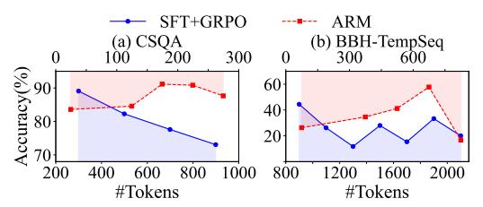

# <span id="page-18-0"></span>H Ablation Study on Reasoning Formats

To further investigate whether defining other reasoning formats would help, we add an additional reasoning format: *function-calling*, implemented via code execution. Specifically, during inference, when the model selects the *Code* reasoning format, we run the generated code using an interpreter to obtain an answer. If execution fails, the model falls back to simulating the output of the code, consistent with prior work [\[23\]](#page-10-15).

As shown in Table [8,](#page-19-1) incorporating the *function-calling* format yields improvements, suggesting that more fine-grained formats can provide benefits. However, we also note that incorporating additional reasoning formats demands extra resources to implement the pipeline. For example, parallel function calls during training can lead to high memory consumption, and decreasing the number of processes may prolong the training time. Furthermore, formats like *function-calling* would introduce additional inference-time latency (e.g., due to runtime execution). Therefore, we adopt the current four reasoning formats for their widespread use and practicality, and leave the exploration of more reasoning formats to future work.

In addition to adding reasoning formats, we further examine the effect of removing specific reasoning formats on performance and token efficiency. Specifically, during inference, we remove *Direct Answer* on CSQA, *Short CoT* on GSM8K, and *Long CoT* on AIME'25. The results are summarized in Table [9.](#page-19-2) On CSQA, removing *Direct Answer* increases token usage by +29.4% with negligible accuracy gain, showing it is crucial for efficiently handling simple tasks. In contrast, on AIME'25, removing *Long CoT* leads to a significant accuracy drop (-8.4), confirming its importance for complex reasoning. Overall, these results validate the necessity of the predefined reasoning formats in enabling adaptive reasoning.

<span id="page-19-1"></span>Table 8: Accuracy across benchmarks when adding a function-calling reasoning format to ARM.

| 7B Models              | Ea   | nsy  |       | Medi |       | Hard | Avg.    |      |
|------------------------|------|------|-------|------|-------|------|---------|------|
| , =                    | CSQA | OBQA | GSM8K | MATH | SVAMP | BBH  | AIME'25 |      |
| vanilla ARM            | 86.1 | 84.4 | 89.2  | 73.9 | 92.0  | 61.4 | 16.7    | 72.0 |
| ARM + function-calling | 86.1 | 84.5 | 90.3  | 74.3 | 92.8  | 62.1 | 16.7    | 72.4 |
| $\check{\Delta}$       | 0.0  | +0.1 | +1.1  | +0.4 | +0.8  | +0.7 | 0.0     | +0.4 |

Table 9: Effect of removing reasoning formats from ARM.

<span id="page-19-2"></span>

| 7B Models                           | C                    | SQA                  | GS                   | SM8K                 | AIME'25             |                        |  |
|-------------------------------------|----------------------|----------------------|----------------------|----------------------|---------------------|------------------------|--|
| , 2 1,100018                        | Acc.                 | Tok.                 | Acc.                 | Tok.                 | Acc.                | Tok.                   |  |
| vanilla ARM after removing $\Delta$ | 86.1<br>86.2<br>+0.1 | 136<br>176<br>+29.4% | 89.2<br>89.5<br>+0.3 | 305<br>385<br>+26.2% | 16.7<br>8.3<br>-8.4 | 3253<br>2137<br>-34.3% |  |

### <span id="page-19-0"></span>I Details of the Overthinking Phenomenon

Overthinking refers to the phenomenon where LLMs apply unnecessarily complex reasoning to simple tasks, leading to diminishing returns in performance [42]. As demonstrated in Table 1 and 2, using *Long CoT*, despite incurring higher computation costs, significantly enhances model performance on tasks requiring complex mathematical reasoning, such as MATH. However, as mentioned in Section 4.3 and 5.3, longer responses do not consistently lead to better performance for all task types. In this section, we analyze the overthinking phenomenon in depth, focusing on how overly complex reasoning formats can hurt performance when applied to certain tasks.

<span id="page-19-3"></span>> **[图片提取文字 (无描述)]:**
> SFT+GRPO ARM (b) BBH-TempSeq 300 600 (a) CSQA 00 200 300 Accuracy(%) 60 40 20 1000 800 1600 800 #Tokens #Tokens


Figure 9: Overthinking in 7B model performance across two representative datasets. We remove the extreme data points and ensure that sufficient data points fall within the intervals.

#### I.1 Analysis

We analyze the evaluation datasets and illustrate the "overthinking" phenomenon using two representative datasets: CSQA and TemporalSequences in BBH Benchmark. From Figure 9 (note that the horizontal axis scales differ between SFT+GRPO and ARM.), we observe that SFT+GRPO, which relies heavily on Long CoT, shows a significant drop in accuracy as the model generates lengthy responses. It indicates that the model starts generating excessive information that does not contribute to task resolution. In contrast, ARM achieves better performance with fewer tokens for simpler tasks. This analysis reinforces the idea that longer reasoning does not equate to better performance [7; 42], and the optimal reasoning format depends on task type. ARM provides a more flexible, task-specific solution to avoid overthinking, ultimately improving performance. Please refer to Appendix I.3 for a detailed example of how Long CoT errs in CSQA, while a simpler reasoning format with lower token usage successfully solves the problem.

### I.2 Data Examples

<BBH-Temporal Sequences>
Today, Ashley went to the bookstore. Between what times could they have gone?
We know that: Ashley woke up at 5am. Jason saw Ashley buying lunch at the deli from 11am to 1pm. Emily saw Ashley driving to the water park from 1pm to 3pm. Kimberly saw Ashley stretching at a yoga studio from 3pm to 6pm.

The bookstore was closed after 6 pm . Between what times could Ashley have gone to the bookstore ? ( A ) 1 pm to 3 pm ( B ) 11 am to 1 pm ( C ) 3 pm to 6 pm ( D ) 5 am to 11 am ground truth : D

✝ ✆

#### <span id="page-20-0"></span>I.3 An Example of Overthinking in CSQA

✞ ☎ Where does a maid empty a trash can ? ( A ) bus stop ( B ) corner ( C ) hockey game ( D ) motel (E ) alley

Long CoT used by + SFT + GRPO : < LONG\_COT >

Okay , let ' s see . The question is where a maid would empty a trash can . Hmm , pick one of the options given . Let ' s break down the terms .

First , a maid is someone who works in a hotel or other environment , such as cleaning . Their job might involve domestic duties for a specific kind of client , perhaps upper class , but specific job would involve handling various items . So having cleaning duties like trash removal .

Now , traditionally , maid service might be focused on particular areas probably the rooms in a hotel , apartment , or maybe an individual client if they work as an in - home maid . So for that\_RESULTS , would probably be ... Alright . Let 's look at the choices :

- ( A ) Bus stop . Seems like they shouldn ' t dispose of anything there . A bus stop would have trash cans , but personally I doubt a maid would dump trash in a bus station . That ' s probably not part of their responsibilities .
- ( B ) Corner . Hmm . A literal street corner , perhaps maybe a public restroom ? Or other outdoor spot ? But where tomorrow ' s trash can ? I can ' t imagine a location in caring for trash outside normal public areas . Maybe mega cities and sanitation handling upgrades , but again not a typical everyday task for a maid .
- ( C ) Hockey Game . Hmm . Trash removal at a hockey game ... Never heard of a maid working at a hockey game . Probably no . The grounds might be cleaned by different personnel , like stadium employees , most likely more specialized . Hell , playerName duplication , maybe the trash cans outside the arena get cleaned ? That probably exclude maid ' s work issue . So probably can be discounted .
- ( D ) Motel . Hmm . Maybe the version of this ? Or hotels . Wait , motel is final answer . But wait , official work responsibility . The main point here is where professional maid service has responsibilities . For example , in hotels - motel rooms ( though maybe not modern motels , which had more community facilities ?) The specific task is they probably need to take trash cans to the disposal area - usually outside the room in compilations . So perhaps dump it into a proper receptacle . That would happen in backend trash can disposal , but Solutions associated with cleaning , not directly in guest areas .
- ( E ) Alley . Hmm . Alley avoids touristy trash ? Wait , perhaps like backstage scenario . Or alleyways can be garbage collection areas . But how typical ? Probably the communities are serviced by regular collection with professionals . For same reasons as airliner ( like trash in the alley ) . The main thing is that probably would move trash to the nearest dumpster , possibly in an alley . Though not a public

```
area of the house . Though again , problem is which alley . It ' s not
nearly as common would be this responsibility . Probably more likely
that a maid would take the trash to a dumpster outside . So option E
probably can be considered .
Wait , not sure , but none of the options are obvious , but Zeeland E .
Because the equipment is usually moved from rooms to a centralized
dumpster . Probably near the alley . Although may not be the primary
course of action . However , this is what might be discussed . Because
depending on the structure . For example , perhaps motel rooms need to
dispose garbage in dumpster , making alley collection possible .
But options like motel and motel would probably be the right answer .
But museum ? Not typical . So perhaps neither of the answers given . Wait
, maybe E .
</ LONG_COT >
< ANSWER >
E
</ ANSWER >
Short CoT used by ARM :
< SHORT_COT >
A maid works in a motel . A maid may empty a trash can in a motel .
The answer is D
</ SHORT_COT >
< ANSWER >
D
</ ANSWER >
```

