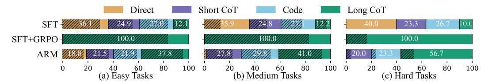
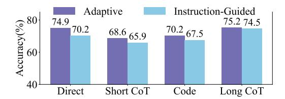
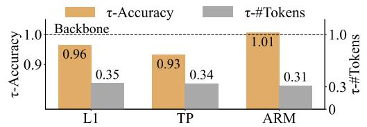
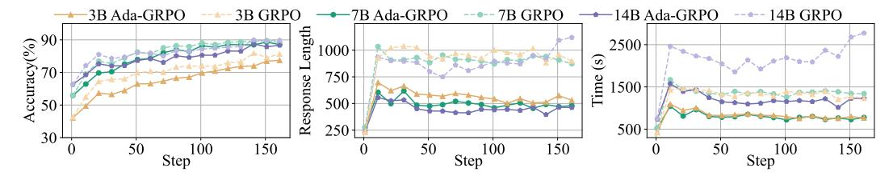
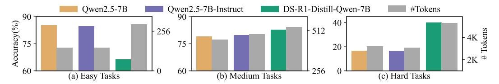

# 4.2 Evaluation

Evaluation Datasets To assess the models' reasoning capabilities, we select a range of evaluation datasets, including both in-domain and out-of-domain samples. These datasets span commonsense, mathematical, and symbolic reasoning tasks. For commonsense reasoning, we include CommonsenseQA (CSQA)[\[44\]](#page-11-8) and OpenBookQA (OBQA)[\[29\]](#page-10-11), which are easier tasks based on intuitive knowledge. For mathematical reasoning, we utilize SVAMP [\[34\]](#page-11-9), GSM8K [\[6\]](#page-9-10), MATH [\[15\]](#page-10-10), and AIME'25 [\[9\]](#page-9-11) to assess models' ability to solve complex mathematical problems that require advanced reasoning and strict logical thinking. For symbolic reasoning, we turn to Big-Bench-Hard (BBH) [\[43\]](#page-11-10), a benchmark for evaluating models' structured reasoning ability to manipulate symbols according to formal rules. For further analysis, we group the evaluation datasets into three difficulty levels: commonsense tasks as *easy*; mathematical and symbolic tasks as *medium*; and AIME'25 as *hard* given its competition-level difficulty.

Inference During inference, we set the temperature to 0.7 and top-p to 1.0. For all evaluation datasets, we use accuracy as the metric. In addition to pass@1, to reduce bias and uncertainty associated with single generation outputs and to enhance the robustness of the results [\[57\]](#page-12-0), we further use majority@k (maj@k), which measures the correctness of the majority vote from k independently

4 In preliminary experiments, we observed that using the same training data in both stages causes the model to recite answers rather than reasoning during the RL stage, resulting in poor generalization.

Table 1: Performance of various models across evaluation datasets. "#Tokens" refers to the token cost for each model on each dataset. For each model, k=1 corresponds to pass@1, and k=8 corresponds to maj@8. When k=8, the token cost is averaged over a single output to facilitate clear comparison. "†" denotes in-domain tasks, while "‡" denotes out-of-domain tasks. " $\Delta$ " represents the difference between ARM and Qwen2.5SFT+GRPO, calculated by subtracting the accuracy of Qwen2.5SFT+GRPO from that of ARM, with the token usage expressed as the ratio of tokens saved by ARM compared to Qwen2.5SFT+GRPO, with all settings based on k=8 to ensure a stable comparison.

|                                 |   |       |       |        | Accura | cy (†) |      |          |      |        |        |        | #Tol   | kens (↓) |        |          |        |
|---------------------------------|---|-------|-------|--------|--------|--------|------|----------|------|--------|--------|--------|--------|----------|--------|----------|--------|
| Models                          |   | E     | asy   |        | Medi   | um     |      | Hard     | Avg. | E      | asy    |        | Med    | lium     |        | Hard     | Avg.   |
|                                 | k | CSQA† | OBQA‡ | GSM8K† | MATH†  | SVAMP‡ | BBH‡ | AIME'25‡ |      | CSQA†  | OBQA‡  | GSM8K† | MATH†  | SVAMP‡   | BBH‡   | AIME'25‡ |        |
| GPT-40                          | 1 | 85.9  | 94.2  | 95.9   | 75.9   | 91.3   | 84.7 | 10.0     | 76.8 | 192    | 165    | 287    | 663    | 156      | 278    | 984      | 389    |
| o1-preview                      | 1 | 85.5  | 95.6  | 94.2   | 92.6   | 92.7   | 91.8 | 40.0     | 84.6 | 573    | 492    | 456    | 1863   | 489      | 940    | 7919     | 1819   |
| o4-mini-high                    | 1 | 84.7  | 96.0  | 96.9   | 97.7   | 94.0   | 92.2 | 96.7     | 94.0 | 502    | 289    | 339    | 1332   | 301      | 755    | 9850     | 1910   |
| DeepSeek-V3                     | 1 | 82.4  | 96.0  | 96.5   | 91.8   | 93.7   | 85.8 | 36.7     | 83.3 | 231    | 213    | 236    | 887    | 160      | 400    | 2992     | 732    |
| DeepSeek-R1                     | 1 | 83.3  | 94.8  | 96.4   | 97.1   | 96.0   | 85.0 | 70.0     | 88.9 | 918    | 736    | 664    | 2339   | 589      | 1030   | 9609     | 2270   |
| DS-R1-Distill-1.5B              | 1 | 47.6  | 48.6  | 79.4   | 84.6   | 86.7   | 53.5 | 20.0     | 60.1 | 987    | 1540   | 841    | 3875   | 606      | 3005   | 13118    | 3425   |
| DS-R1-Distill-7B                | 1 | 64.9  | 77.4  | 90.0   | 93.6   | 90.3   | 72.1 | 40.0     | 75.5 | 792    | 928    | 574    | 3093   | 315      | 1448   | 12427    | 2797   |
| DS-R1-Distill-14B               | 1 | 80.6  | 93.2  | 94.0   | 95.5   | 92.7   | 80.4 | 50.0     | 83.8 | 816    | 750    | 825    | 2682   | 726      | 1292   | 11004    | 2585   |
| DS-R1-Distill-32B               | 1 | 83.2  | 94.6  | 93.5   | 93.0   | 92.0   | 86.3 | 56.7     | 85.6 | 674    | 698    | 438    | 2161   | 283      | 999    | 11276    | 2361   |
| Owen2.5-3B                      | 1 | 66.5  | 65.8  | 66.9   | 37.7   | 71.3   | 38.4 | 0        | 49.5 | 97     | 120    | 150    | 419    | 76       | 232    | 1393     | 355    |
| Qweii2.J=JB                     | 8 | 75.5  | 77.4  | 80.9   | 50.8   | 83.7   | 47.1 | 0        | 59.3 | 96     | 100    | 149    | 424    | 85       | 240    | 1544     | 377    |
| Owen2.5-3B SFT       | 1 | 72.8  | 72.4  | 35.7   | 20.9   | 62.3   | 37.4 | 0        | 43.1 | 99     | 108    | 145    | 229    | 126      | 311    | 694      | 245    |
| Qwell2.J-3DSFT                  | 8 | 75.5  | 77.4  | 56.0   | 27.6   | 74.7   | 43.5 | 0        | 50.7 | 97     | 103    | 132    | 231    | 108      | 309    | 537      | 217    |
| 0 2530                          | 1 | 79.7  | 79.0  | 88.7   | 66.6   | 92.0   | 52.6 | 6.7      | 66.5 | 425    | 501    | 788    | 1586   | 630      | 994    | 3027     | 1136   |
| $Qwen 2.5\text{-}3B_{SFT+GRPO}$ | 8 | 80.3  | 80.0  | 91.4   | 74.0   | 94.7   | 56.2 | 6.7      | 69.0 | 429    | 506    | 802    | 1590   | 638      | 996    | 3247     | 1172   |
|                                 | 1 | 79.8  | 78.0  | 83.8   | 62.9   | 89.7   | 50.0 | 6.7      | 64.4 | 118    | 156    | 346    | 1013   | 264      | 436    | 2958     | 756    |
| ARM-3B                          | 8 | 80.1  | 78.0  | 90.8   | 72.8   | 95.0   | 53.8 | 6.7      | 68.2 | 123    | 169    | 359    | 1036   | 246      | 430    | 3083     | 778    |
| $\Delta$                        |   | -0.2  | -2.0  | -0.6   | -1.2   | +0.3   | -2.4 | 0        | -0.8 | -71.3% | -66.6% | -55.2% | -34.8% | -61.4%   | -56.8% | -5.1%    | -33.6% |
| Owen2.5-7B                      | 1 | 76.7  | 78.6  | 81.6   | 50.1   | 81.0   | 51.7 | 3.3      | 60.4 | 64     | 83     | 156    | 376    | 99       | 182    | 767      | 247    |
| Qwen2.5-/B                      | 8 | 82.0  | 86.4  | 89.9   | 64.7   | 89.7   | 62.0 | 3.3      | 68.3 | 66     | 74     | 156    | 370    | 92       | 183    | 881      | 260    |
| 0 25.70                         | 1 | 80.8  | 81.2  | 54.4   | 30.4   | 76.0   | 48.2 | 0        | 53.0 | 136    | 150    | 184    | 348    | 126      | 245    | 1239     | 347    |
| Qwen2.5-7B SFT       | 8 | 83.9  | 84.6  | 79.4   | 42.4   | 88.0   | 56.0 | 0        | 62.0 | 141    | 137    | 185    | 361    | 141      | 274    | 1023     | 323    |
|                                 | 1 | 83.1  | 82.2  | 92.8   | 79.4   | 93.7   | 64.3 | 16.7     | 73.2 | 491    | 651    | 739    | 1410   | 587      | 1133   | 3196     | 1173   |
| Qwen2.5-7B SFT+GRPO  | 8 | 83.7  | 84.6  | 94.8   | 84.9   | 95.3   | 69.3 | 20.0     | 76.1 | 496    | 625    | 745    | 1415   | 586      | 1135   | 3145     | 1164   |
|                                 | 1 | 86.1  | 84.4  | 89.2   | 73.9   | 92.0   | 61.4 | 16.7     | 72.0 | 136    | 159    | 305    | 889    | 218      | 401    | 3253     | 766    |
| ARM-7B                          | 8 | 85.7  | 85.8  | 93.7   | 82.6   | 95.3   | 67.9 | 20.0     | 75.9 | 134    | 154    | 297    | 893    | 218      | 413    | 3392     | 786    |
| Δ                               |   | +2.0  | +1.2  | -1.1   | -2.3   | 0      | -1.4 | 0        | -0.2 | -73.0% | -75.4% | -60.1% | -36.9% | -62.8%   | -63.6% | +7.9%    | -32.5% |
|                                 | 1 | 79.9  | 83.8  | 84.9   | 52.7   | 84.7   | 56.8 | 3.3      | 63.7 | 56     | 60     | 132    | 335    | 77       | 139    | 611      | 201    |
| Qwen2.5-14B                     | 8 | 83.8  | 90.2  | 92.3   | 68.4   | 91.7   | 67.4 | 3.3      | 71.0 | 55     | 60     | 131    | 325    | 81       | 131    | 735      | 217    |
|                                 | 1 | 81.8  | 88.0  | 62.6   | 37.4   | 84.0   | 53.5 | 0        | 58.2 | 155    | 140    | 161    | 276    | 152      | 254    | 527      | 238    |
| Qwen2.5-14B SFT      | 8 | 85.0  | 91.4  | 86.4   | 48.8   | 91.7   | 64.4 | 3.3      | 67.3 | 149    | 141    | 165    | 288    | 140      | 247    | 493      | 232    |
|                                 | 1 | 85.4  | 93.0  | 94.8   | 81.7   | 93.7   | 70.5 | 20.0     | 77.0 | 558    | 531    | 693    | 1805   | 565      | 945    | 4031     | 1304   |
| Qwen2.5-14B SFT+GRPO | 8 | 85.8  | 94.2  | 96.1   | 87.1   | 95.3   | 77.0 | 20.0     | 79.4 | 552    | 537    | 696    | 1810   | 565      | 943    | 3723     | 1261   |
| ARM-14B                         | 1 | 85.3  | 91.8  | 92.5   | 79.1   | 93.3   | 66.6 | 20.0     | 75.5 | 146    | 128    | 294    | 903    | 212      | 420    | 3871     | 853    |
|                                 | 8 | 85.6  | 91.8  | 96.3   | 86.4   | 95.7   | 72.1 | 23.3     | 78.7 | 145    | 134    | 293    | 910    | 189      | 415    | 3996     | 869    |
| Δ                               | 0 | -0.2  | -2.4  | +0.2   | -0.7   | +0.4   | -4.9 | +3.3     | -0.7 | -73.7% | -75.0% |        | -49.7% | -66.5%   | -56.0% | +7.3%    | -31.1% |
|                                 |   | 0.2   | 2.4   | 10.2   | 5.1    |        | 2.0  | . 5.0    | 0.1  | 13.170 | 13.070 | 57.576 | 10.170 | 00.070   | 55.076 | 0 /0     | 01.170 |

sampled outputs. For inference on the three backbone models, we use an example with a short-cotbased answer within the prompt to guide the model toward specific answer formats while preserving its original reasoning capabilities as much as possible.

#### 4.3 Main Results

Alongside our baselines, we include several state-of-the-art general models, including GPT-40 [30] and DeepSeek-V3 [27], as well as reasoning models o1-preview [31], o4-mini-high [32], and DeepSeek-R1 [11], along with several DeepSeek-R1-Distill-Qwen (DS-R1-Distill) models ranging from 1.5B to 32B [11]. We report our results in Table 1, and we have the following findings:

Current reasoning models struggle with the "overthinking" problem, with smaller distilled models being more affected. We observe that all current reasoning models consume more than 500 tokens on easy commonsense tasks but do not always achieve corresponding improvements. For example, although DeepSeek-R1 and DS-R1-Distill-7B use nearly  $4\times$  and  $10\times$  more tokens than their backbone models, DeepSeek-V3 and Qwen2.5-7B, they do not show significant improvement and even experience performance degradation, highlighting the "overthinking" problem. Additionally, we find that when comparing different sizes of DS-R1-Distill, smaller models often require more tokens while delivering worse performance.

SFT only teaches models about formats, yet does not teach how to choose the appropriate formats based on the task. We observe that SFT models, across three sizes, show improvement on easy commonsense tasks but experience performance drops on medium and hard tasks. To investigate the cause, we conduct a deeper analysis of the reasoning formats selected during inference. Figure 2 visualizes how models allocate the four reasoning formats across three difficulty levels. Specifically, we find that for models trained with SFT, their outputs are distributed almost uniformly across the reasoning formats, with the majority in *Direct Answer* and the least in *Long CoT*, regardless of task difficulty. As shown in Figure 2, the inappropriate selection of *Direct Answer*, which yields extremely low accuracy (35.2%) on medium tasks and significantly hinders the model's reasoning capabilities,

> **[图片提取文字 (无描述)]:**
> Short CoT Direct Code Long CoT ///24.8 SFT+GRPO 100.0100.0 100.00 40 60 (b) Medium Tasks 80 100 80 100 60 80 100 (c) Hard Tasks

Figure 2: Format distribution by task difficulty with Qwen2.5-7B. The hatched areas indicate the percentage of correct answers that were generated using the selected reasoning format.

Table 2: Accuracy (Acc.) and token usage (Tok.) for the three reasoning modes supported by ARM-7B. In the Consensus-Guided Mode, the percentage of *Long CoT* usage indicates how often the model resorts to *Long CoT* when simpler reasoning formats fail to reach a consensus.

|                    |      |       | Easy                               |       | Medium |       |       |                |        |                |      |       | Hard     |                               | Avg. |       |  |
|--------------------|------|-------|------------------------------------|-------|--------|-------|-------|----------------|--------|----------------|------|-------|----------|-------------------------------|------|-------|--|
| ARM-7B             |      | CSQA† | OBQA‡                              |       | GSM8K† |       | MATH† |                | SVAMP‡ |                | BBH‡ |       | AIME'25‡ |                               |      |       |  |
|                    |      |       | Acc. Tok. Acc. Tok. Acc. Tok. Acc. |       |        |       |       | Tok.           |        | Acc. Tok. Acc. |      | Tok.  | Acc.     | Tok.                          | Acc. | Tok.  |  |
| Adaptive 86.1      |      | 136   | 84.4                               | 159   | 89.2   | 305   | 73.9  | 889            | 92.0   | 218            | 61.4 | 401   |          | 16.7 3253 72.0                |      | 766   |  |
| InstDirect         | 84.1 | 10    | 81.8                               | 10    | 22.9   | 11    | 23.1  | 13             | 67.0   | 11             | 44.7 | 21    | 0        | 12                            | 46.2 | 13    |  |
| InstShort CoT 81.3 |      | 33    | 77.4                               | 35    | 85.0   | 124   | 70.9  | 633            | 86.7   | 66             | 49.7 | 101   |          | 10.0 2010 65.9                |      | 428   |  |
| InstCode 84.4      |      | 140   | 81.6                               | 147   | 84.2   | 285   | 65.9  | 559            | 88.3   | 182            | 57.9 | 344   |          | 10.0 1821 67.5                |      | 497   |  |
| InstLong CoT 84.0  |      | 259   | 87.4                               | 294   | 91.8   | 426   |       | 77.2 1220 94.3 |        | 340            | 66.9 | 660   |          | 20.0 4130 74.5 1047           |      |       |  |
| Consensus 85.8     |      | 228   | 87.0                               | 260   | 92.9   | 777   |       | 78.4 2281 95.7 |        | 433            |      |       |          | 66.4 1039 20.0 7973 75.2 1856 |      |       |  |
| Long CoT Usage     |      | 12.9% |                                    | 21.4% |        | 79.8% |       | 79.2%          |        | 36.3%          |      | 56.3% |          |                               | 100% | 55.1% |  |

finally leads to a decline in overall performance. This suggests that while SFT teaches models various formats, it fails to help them adaptively select appropriate ones based on the task, leading to an inability to choose more advanced formats as problem complexity increases.

GRPO does improve reasoning capabilities, but it tends to rely on *Long CoT* to solve all tasks. We observe that models trained with GRPO achieve significant improvements across all tasks, yet the token cost remains substantial, especially for the two easier tasks. Further analysis reveals that *Long CoT* is predominantly used in the inference stage, as shown in Figure [2.](#page-6-0) This behavior stems from the nature of GRPO (i.e., format collapse discussed in Section [3.2\)](#page-3-0), where models converge to the format with the highest accuracy (i.e., *Long CoT*) early in training (∼10 steps in our experiment). As a result, GRPO also fails to teach models how to select a more efficient reasoning format based on the task. We provide more details of format collapse in Appendix [E.](#page-17-0)

ARM is able to adaptively select reasoning formats based on task difficulty, while achieving comparable accuracy across all tasks compared to GRPO and using significantly fewer tokens. As shown in Table [1,](#page-5-1) across three different model sizes, all ARMs experience an average performance drop of less than 1% compared to models trained with GRPO, yet they save more than 30% of the tokens. Specifically, ARM demonstrates a clear advantage on easy tasks, saving over 70% of tokens while maintaining comparable accuracy. This advantage extends to medium tasks as well. For the more challenging AIME'25 task, ARM adapts to the task difficulty by increasingly selecting *Long CoT*, thereby avoiding performance degradation on harder tasks, with ARM-14B even surpassing its counterpart Qwen2.5-14BSFT+GRPO. Figure [2](#page-6-0) further confirms that ARM is able to gradually adopt more advanced reasoning formats and discards simpler ones as task difficulty increases. Moreover, as shown in Figure [1b,](#page-1-0) the line connecting "SFT" and "+GRPO" illustrates the expected trade-off, while "+Ada-GRPO" consistently lies above it, indicating a better balance between effectiveness and efficiency of ARM. Additionally, ARM-7B achieves comparable performance to DS-R1-Distill-7B while using only 27.8% of the tokens on average. For a broader view of generalization across additional benchmarks, please refer to Appendix [F.](#page-17-1)

### 4.4 Reasoning Mode Switching

ARM is capable of autonomously selecting appropriate reasoning formats (Adaptive Mode), while also supporting explicit guidance to reason in specified formats (Instruction-Guided Mode) or through consensus between different reasoning formats (Consensus-Guided Mode). Specifically, *1)* Adaptive Mode: In this mode, ARM autonomously selects the reasoning format for each task, which is also the

> **[图片提取文字 (无描述)]:**
> Adaptive Instruction-Guided Accuracy(%) 74.975.2 74.5 <del>70.2</del> 67.5 70.268.6 65.9 Direct Short CoT Code Long CoT

> **[图片提取文字 (无描述)]:**
> τ-Accuracy τ-#Tokens Backbone 0.96 0.93 0.35 0.31

Figure 3: Accuracy comparison between ARM's **Adaptive** and **Instruction-Guided** modes. The figure shows average accuracy across evaluation datasets, with *Direct Answer* applied only to commonsense and symbolic tasks, as it does not appear in mathematical tasks in Adaptive mode.

Figure 4: Relative accuracy and token usage of different models compared to their backbone models on CSQA. "L1" denotes L1-Exact [1], and "TP" denotes THINKPRUNE [16]. " $\tau$ -Accuracy" and " $\tau$ -#Tokens" are reported relative to each model's backbone after RL training.

default reasoning mode if not specified in this paper. 2) **Instruction-Guided Mode:** In this mode, a specific token (e.g., <*Long CoT>*) is provided as the first input, forcing ARM to reason in the specified format. 3) **Consensus-Guided Mode:** In this mode, ARM first generates answers using the three simpler reasoning formats (i.e., *Direct Answer, Short CoT*, and *Code*) and checks for consensus among them. If all formats agree, the consensus answer is adopted as the final result. Otherwise, ARM defaults to *Long CoT* for the final answer, treating the task as sufficiently complex.

To evaluate the performance and effectiveness of the proposed reasoning modes, we conduct experiments across various evaluation datasets. Table 2 presents the results for ARM-7B. Specifically: 1) Adaptive Mode strikes a superior balance between high accuracy and efficient token usage across all datasets, demonstrating its ability to adaptively select the reasoning formats. 2) Instruction-Guided Mode offers a clear advantage when the assigned reasoning format is **appropriate.** For example, *Direct Answer* is sufficient for commonsense tasks, while *Code*, due to its structured nature, performs better on symbolic reasoning tasks compared to Direct Answer and Short CoT. Furthermore, InstLong CoT achieves better performance (74.5%) than the same-sized model trained on GRPO (73.2% in Table 1). This demonstrates that Ada-GRPO does not hinder the model's Long CoT reasoning capabilities. We further validate this by analyzing the reflective words used by ARM-7B and Qwen2.5-7BSFT+GRPO in Appendix G. 3) Consensus-Guided Mode, on the other hand, is performance-oriented, requiring more tokens to achieve better performance. This mode leverages consensus across multiple formats to mitigate bias and uncertainty present in any single format, offering greater reliability, particularly for reasoning tasks that demand advanced cognitive capabilities, where simpler formats may fall short. This is evidenced by the fact that Long CoT is less likely to be used for easy tasks, but is highly likely to be selected for medium tasks and even used 100% of the time for the most difficult AIME'25 task.

#### 5 Analysis

#### 5.1 Effectiveness of Adaptive Format Selection

To verify that ARM's format selection indeed adapts to the task at hand rather than relying on random selection, we compare ARM's **Adaptive Mode** with **Instruction-Guided Mode**. In Instruction-Guided Mode, the reasoning format is fixed and manually specified, providing a strong baseline to test whether adaptive selection offers real benefits over using a uniform format across tasks. We report the accuracy of both modes in Figure 3. We observe that the accuracy of the reasoning formats selected in Adaptive Mode is higher than that in Instruction-Guided Mode. Specifically, Adaptive Mode improves accuracy by 4.7% on *Direct Answer*, by 2.7% on both *Short CoT* and *Code*, and even yields a slight improvement on *Long CoT*. These results confirm that ARM is not randomly switching formats but is instead learning to select an appropriate one for each task. Further ablation results on reasoning formats are presented in Appendix H.

#### 5.2 Comparison of Ada-GRPO and GRPO

We find that, compared to GRPO, ARM trained with Ada-GRPO achieves comparable performance on the evaluation dataset while achieving approximately a  $\sim 2\times$  speedup in training time. To understand the source of this efficiency, we compare the training dynamics of Ada-GRPO and GRPO across

> **[图片提取文字 (无描述)]:**
> 3B Ada-GRPO 3B GRPO → 7B Ada-GRPO ---- 7B GRPO ·14B Ada-GRPO ---- 14B GRPO ength  $\Re^{90}$ 2500 1000 70 ccuracy 750 nse Tim 500 500 ds 500 250 2 30 100 150 100 150 50 100 150 50 Step Step Step

Figure 5: Performance on the training set across different model sizes trained with Ada-GRPO and GRPO. Except for the implementation of the algorithm, all hyperparameters are kept the same.

> **[图片提取文字 (无描述)]:**
> Qwen2.5-7B Owen2.5-7B-Instruct DS-R1-Distill-Qwen-7B #Tokens 40 -256 20 -- 2K ‡‡ (b) Medium Tasks (a) Easy Tasks (c) Hard Tasks

Figure 6: ARMs' performance across different backbones. Base and instruction-tuned models perform similarly, while DS-R1-Distill improves on medium and hard tasks but struggles on easy ones.

different model sizes, focusing on accuracy, response length, and training time, as shown in Figure 5. The results highlight the following advantages of Ada-GRPO: 1) Comparable Accuracy. Although Ada-GRPO initially lags behind GRPO in accuracy due to suboptimal reasoning format selection in the early training steps, both methods converge to similar final accuracy across all model sizes. This demonstrates that Ada-GRPO does not compromise final performance. 2) Half Response Length. While GRPO uses Long CoT uniformly across all tasks, Ada-GRPO adaptively selects reasoning formats based on task difficulty. Due to the length efficiency of Direct Answer, Short CoT, and Code, Ada-GRPO ultimately reduces the average response length to roughly half that of GRPO. 3) Half Training Time Cost. Since the majority of training time is spent on response generation during the roll-out stage, reducing response length directly translates into lower time cost. As a result, Ada-GRPO achieves approximately a  $\sim 2\times$  speedup compared to GRPO. Overall, Ada-GRPO maintains strong performance while significantly reducing computational overhead, underscoring its efficiency and reliability for training.

#### 5.3 Comparison of Backbone Models

Beyond the base model, we further analyze the impact of different backbone models, including instruction-tuned and DS-R1-Distill variants. Figure 6 reports accuracy and token usage across *easy, medium*, and *hard* tasks. We observe that base and instruction-tuned models have a highly similar performance. This suggests that RL effectively bridges the gap left by instruction tuning, enabling base models to achieve comparable performance, consistent with findings from previous work [20]. In contrast, the DS-R1-Distill variant performs notably better on medium and hard tasks, benefiting from distilled knowledge from the stronger DeepSeek-R1 model, though at the expense of increased token cost. However, it performs significantly worse on easy tasks, even with excessive token usage, resulting from the overthinking phenomenon. Additional discussion and case studies on the overthinking phenomenon are presented in Appendix I, and a complementary analysis of LLaMA-based backbones is included in Appendix J.

#### 5.4 Comparison of ARM and Length-Penalty-Based Strategies

To examine whether previously proposed length-penalty-based strategies—proven effective in complex reasoning—remain effective for easier tasks, we evaluate two representative methods, L1 [1] and ThinkPrune [16], on the CSQA dataset. Since both methods are based on the DS-R1-Distill model, we ensure a fair comparison by also evaluating the version of ARM trained on the same backbone. We report the relative accuracy and token usage of all three models compared to their respective backbone models in Figure 4. When using the minimum allowed lengths specified in the official settings of L1 and ThinkPrune, both methods exhibit performance drops. In contrast, ARM maintains strong performance while using relatively fewer tokens, demonstrating its ability to balance reasoning efficiency and effectiveness. Please see Appendix K for further discussion and details.

