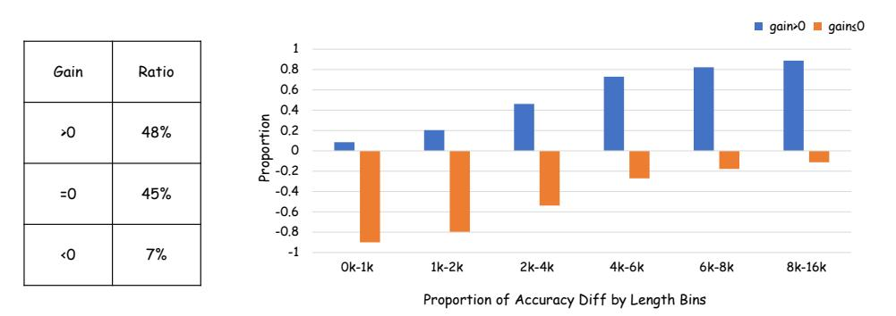

# 2 Related Work

Model Merging Model merging [\[11\]](#page-9-10) is an emerging technique that fuses parameters from multiple trained models into one without access to original training data. Recent methods include parameter interpolation [\[12\]](#page-9-11) and alignment-based strategies [\[13\]](#page-9-12), with applications in LLMs, multimodal models, and other machine learning subfields. Beyond simple linear averaging, advanced methods such as DARE [\[14\]](#page-9-13), TIES-Merging [\[15\]](#page-9-14), and AdaMerging [\[16\]](#page-9-15) have been proposed. DARE reduces redundancy by dropping and rescaling delta parameters. TIES-Merging mitigates interference by trimming and aligning parameter signs. AdaMerging improves performance via entropy-based layer or task weighting on unlabeled data. In contrast to traditional model merging that consolidates capabilities from multiple models, our work enables a single model to adaptively choose between Long-CoT and Short-CoT reasoning for each instance, aiming to optimize computational efficiency rather than multi-task performance.

Efficient Reasoning A variety of methods have been proposed for improved reasoning efficiency. Several techniques apply post-training strategies to shorten reasoning paths. [\[4\]](#page-9-6) constructs preference datasets using DPO and SimPO, guiding models toward concise reasoning through preferencebased fine-tuning. O1-Pruner[\[6\]](#page-9-4) samples CoTs to build baselines for length and accuracy, then applies offline optimization to reduce reasoning length without harming performance. Similarly, [\[17\]](#page-9-16) leverages simple fine-tuning on self-generated concise CoTs obtained via best-of-N sampling and few-shot prompting. Some approaches focus on token-level compression. TokenSkip[\[18\]](#page-9-17), for instance, removes tokens selectively based on their estimated importance within the CoT. CoT-Valve[\[8\]](#page-9-7), in contrast, manipulates the parameter space to produce CoTs with varying degrees of compression. Besides, various methods adopt different reasoning paradigms for efficiency. For instance, COCONUT[\[19\]](#page-9-18) and CCOT[\[3\]](#page-9-2) enable reasoning within the latent space, reducing the need for explicit token-level generation. Speculative Thinking[\[20\]](#page-9-19) enhances small model inference by allowing large models to guide them during reasoning. Similarly, LightThinker[\[21\]](#page-10-0) achieves efficiency by dynamically compressing intermediate thoughts throughout the reasoning process. Also, some works ([\[22\]](#page-10-1),[\[23\]](#page-10-2), [\[24\]](#page-10-3), [\[25\]](#page-10-4), [\[26\]](#page-10-5), [\[27\]](#page-10-6)) design novel reasoning paradigms for efficiency. [\[28\]](#page-10-7)

also explores model merging technical for reasoning efficiency. Different from most works, our work solves reasoning efficiency in a novel adaptive reasoning perspective.

#### 3 Motivation

#### 3.1 Problem Setup

Chain-of-Thought (CoT) prompting has emerged as a powerful technique for enhancing the reasoning capabilities of large language models. Within the CoT paradigm, a distinction can be made between Long-CoT, which involves generating detailed and extensive thinking steps, and Short-CoT, which directly generate solving steps.

## 3.2 When Do We Need Long-CoT?

Simply applying Long-CoT to all problems introduces unnecessary overhead, especially for easier tasks where detailed reasoning brings little or no benefit. To understand when Long-CoT is truly needed, we empirically analyze its effectiveness across different problem types. We compare Long-CoT and Short-CoT on a mixed dataset (MixMathematics) composed of samples from AIME[29], MATH, and GSM8K (details in Section 5.1). We use DeepSeek-R1-Distill-Qwen-7B for Long-CoT, and fine-tune it with 2,000 Short-CoT samples from Qwen2.5-Math-7B-Instruct[30] to create a consistent Short-CoT model. We avoid using Qwen2.5 directly due to its differing training format, which may affect later merging and sampling. From 2,500 problems, we generate 12 responses per model per question and remove cases where both models fail completely. We then calculate accuracy gains (Long-CoT accuracy minus Short-CoT accuracy).

As shown in Figure 1 (left), nearly half the samples show no improvement from Long-CoT, and some even suffer performance drops. Further analysis (Figure 1, right) groups samples by the average length of their Long-CoT outputs—longer CoTs tend to correspond to harder problems. We find that Long-CoT significantly improves accuracy on complex questions but provides little or no benefit for simpler ones.

> **[图片提取文字 (无描述)]:**
> gain>0 gain≤0 0.8 Ratio Gain 0.6 0.4 Proportion 0.5 0.7 0.7 0.7 **>**0 48% -0.4 =0 45% -0.6 -0.8 ۷٥ -1 7% 0k-1k 2k-4k 4k-6k 6k-8k 8k-16k 1k-2k Proportion of Accuracy Diff by Length Bins

Figure 1: The proportion of gain in the data (left) and the relationship between CoT length and accuracy improvement (right), Long-CoT reasoning improves accuracy on difficult problems but has little effect or harms performance on easy ones.

## 3.3 A New Perspective on CoT Efficiency

Prior methods (Table 1), such as Overthinking [4], kimi-1.5 [31], and O1-Pruner, typically operate within a limited optimization scope but generally maintain performance stability or incur only a slight drop, with O1-Pruner notably achieving no performance decrease. In contrast, methods designed for a broad optimization scope, including Model Merge and CoT-Valve, did not consider how to tackle easy and different problems, rendering the model incapable of determining its reasoning depth according to the inherent difficulty of the task. Thus they frequently result in significant performance degradation. In a nutshell, methods with a restricted optimization can generally preserve performance but lose the chance to utilize shorter CoT. However, approaches capable of utilize broader CoT

| Method          | CoT Optimization Scope | Performance (Accuracy) |
|-----------------|------------------------|------------------------|
| Overthinking[4] | Limited ×              | Slightly Dropped ✓     |
| kimi-1.5[31]    | Limited ×              | Slightly Dropped √     |
| O1-Pruner       | Limited ×              | Not Dropped ✓          |
| Naive Merge     | Broad √                | (mostly) Dropped ×     |
| CoT-Valve       | Broad √                | Dropped ×              |
| Ada-R1(Ours)    | Broad √                | Slightly Dropped √     |

Table 1: Comparison of Different Methods. "Limited" indicates optimization within the Long-CoT distribution, restricting efficiency. "Broader" covers both Long- and Short-CoT, enabling shorter, more efficient responses. "Slightly dropped" means accuracy decreased by less than 3%, while "dropped" refers to a decrease greater than 3%.

distribution have struggled to maintain accuracy due to their inability to adapt adequate reasoning depth to problem complexity.

The finding mentioned in last section motivates us to address the efficiency challenge of Long-CoT models from a novel perspective: enabling the reasoning model to adaptively select an appropriate reasoning mode (long or short CoT) for different problems, and then generate a correct and concise CoT in the determined mode. Our proposed method (Ada-R1) differentiates itself by successfully achieving a broad optimization scope while incurring only a marginal performance decrement. This demonstrates a more favorable trade-off between efficiency and accuracy compared to existing broad-scope optimization techniques.

