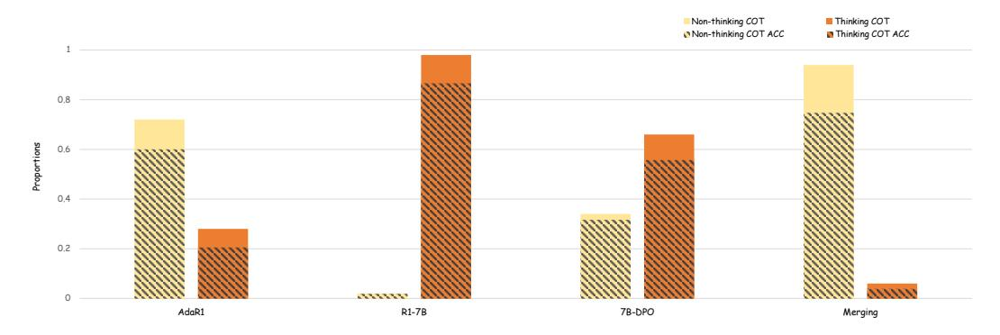
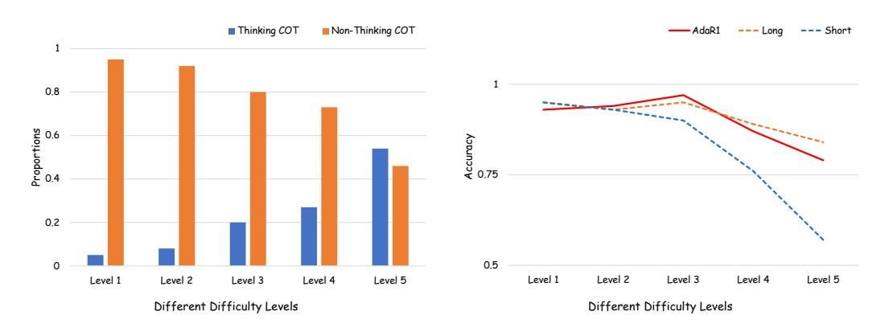

# 6.1 Thinking Ratio Study

To investigate the thinking characteristics of different models, we propose the "Thinking Ratio" metric. This metric is designed to detect whether a response constitutes a deep thinking (Long-CoT) sample. Long-CoT responses typically include unique keywords (e.g., 'wait', 'recheck'). By detecting the presence of these keywords in a response, we can determine if it is a deep thinking sample. This detection method is more generalizable than relying solely on response length. We use a subset of Math Testset. Using the method described above, we analyzed the proportion of deep thinking samples for each model. Furthermore, for each category (thinking/non-thinking samples), we also calculated their accuracy.

The results are shown in Figure [3.](#page-8-0) The baseline Long-CoT model predominantly employs deep thinking (0.98), yielding high accuracy. In contrast, the Naive Merge model drastically shifts towards non-thinking responses (0.94) but suffers significant accuracy degradation on both thinking (0.68) and non-thinking (0.81) paths. DPO shows a moderate shift to non-thinking (0.34) while preserving accuracy. Our Ada-R1 model achieves a more significant shift towards non-thinking (0.72) than DPO, yet crucially maintains high accuracy for these dominant non-thinking responses (0.96), unlike the Naive Merge. This demonstrates Ada-R1's effective adaptation, utilizing efficient shorter paths without substantial accuracy loss.

> **[图片提取文字 (无描述)]:**
> ■ Thinking COT
> 
> Thinking COT ACC Non-thinking COT Non-thinking COT ACC 0,8 0.6 0.2 arrests. AdaR1 7B-DPO Merging R1-7B

Figure 3: The proportion and accuracy of thinking and non-thinking in different methods, Ada-R1 can achieve a good balance and accuracy between thinking and non-thinking.

### **6.2** Adaptive Reasoning Study

This section evaluates the adaptive reasoning ability of Ada-R1 (7B) on the MATH dataset, which is divided into five difficulty levels (Level 1–5). We analyze both the model's thinking ratio (Long-CoT usage) and its average accuracy across these levels. As shown in the left part of Figure 4, the thinking ratio increases significantly with task difficulty. Level 1 problems have the lowest Long-CoT usage, while Level 5 shows the highest, indicating that Ada-R1 adaptively chooses to think more on harder problems. In terms of accuracy (Figure 4, right), Ada-R1 achieves strong performance across difficulty levels. Its accuracy is comparable to that of a full Long-CoT model (Deepseek-R1-Qwen-7B-Distill) and consistently higher than the Short-CoT model, especially on Levels 3 to 5. These results support our hypothesis from Section 3: Ada-R1 can selectively apply Long-CoT when needed, achieving a better balance between accuracy and efficiency.

> **[图片提取文字 (无描述)]:**
> Thinking COT Non-Thinking COT — AdaR1 --- Short --- Long 0.8 Proportions 9.0 9.0 Accuracy 22.0 0.2 0.5 0 Level 4 Level 5 Level 1 Level 2 Level 4 Level 5 Level 1 Level 2 Level 3 Level 3 Different Difficulty Levels Different Difficulty Levels

Figure 4: The ratio of thinking and non-thinking CoTs of Ada-R1-7B on different MATH levels (left) and the accuracy on different MATH levels of different models (right). As the difficulty increases, Ada-R1 is able to think more on harder problems and maintain higher accuracy.

