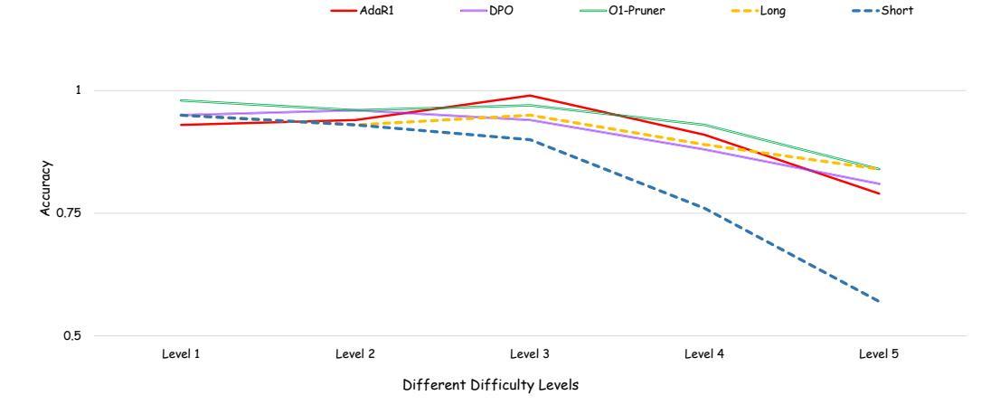
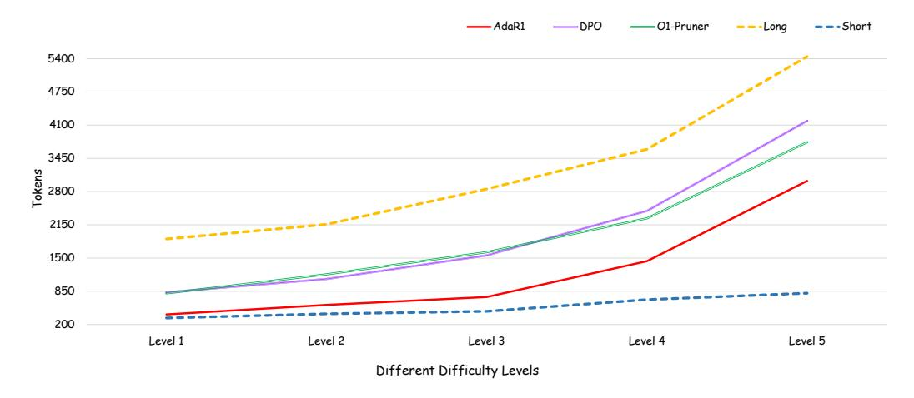
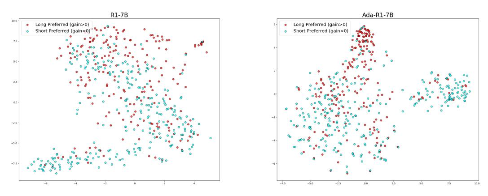

# C How Does Ada-R1 Work?

## C.1 Early Mode Selection Assumption

While Ada-R1 significantly reduces inference cost by adaptively selecting a reasoning strategy during the inference stage, its design relies on an important assumption: the model determines the reasoning mode (Long-CoT or Short-CoT) immediately after receiving the problem input, without relying on any intermediate computation or external signals. In other words, the model is expected to assess the complexity of the problem and select an appropriate reasoning path before beginning the actual problem-solving process.

## C.2 Visualization Setup

To investigate this question and better understand how Ada-R1 works, we design an experiment. We randomly select 500 problems from the training data and evaluate them using the 7B models (R1, and Ada-R1). For each problem, we extract the hidden states of the final token in the input sequence and use the last layer's hidden states as the internal representation of the problem. Based on previously

> **[图片提取文字 (无描述)]:**
> -AdaR1 ----DPO -----O1-Pruner ---Short ---Long Accuracy 57.0 0.5 Level 1 Level 2 Level 3 Level 4 Level 5 Different Difficulty Levels

Figure 5: The ratio of accuracy at different MATH levels on different models. As the difficulty increases, Ada-R1 is able to maintain high accuracy.

> **[图片提取文字 (无描述)]:**
> AdaR1 ----DPO ----O1-Pruner ---Long ---Short 5400 4750 4100 3450 Tokens 0082 2150 1500 850 200 Level 2 Level 3 Level 4 Level 1 Level 5 Different Difficulty Levels

Figure 6: The ratio of average tokens on different models. As the difficulty increases, Ada-R1 is able to use relatively fewer tokens to solve difficult problems.

> **[图片提取文字 (无描述)]:**
> R1-7B Ada-R1-7B Long Preferred (gain>0) Short Preferred (gain<0) Long Preferred (gain>0) Short Preferred (gain<0) 7.5 5.0 25-0.0 -3.0 10.0 ~7.5 -5.0 -2.5 0.0 2.5 7.5 5.0

Figure 7: Visualization of R1 model Figure 8: Visualization of Ada-R1 model

computed group-level preferences (i.e., whether the problem should be solved using Long-CoT or Short-CoT), we assign a color label to each sample—red for problems requiring Long-CoT and blue for those suitable for Short-CoT. We then apply t-SNE to project the high-dimensional hidden states into a two-dimensional space for visualization.

## C.3 Ada-R1 Learns an Implicit Problem Classifier

From the visualization, we observe that after preference-based training, Ada-R1 is able to partially separate problems that require Long-CoT from those that do not, based solely on their internal representations. This suggests that the model learns to encode problem complexity in representation space, enabling early and efficient reasoning mode selection. Such a capability underpins the effectiveness of Ada-R1: by making an informed decision on the reasoning strategy at the problem stage, the model avoids unnecessary computation for simpler problems while retaining full reasoning capacity for more complex ones.

