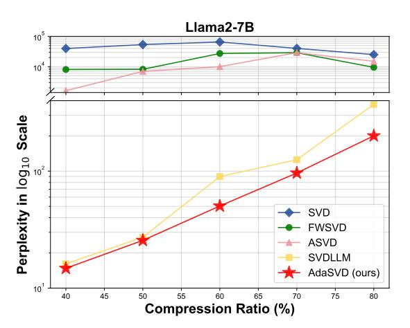
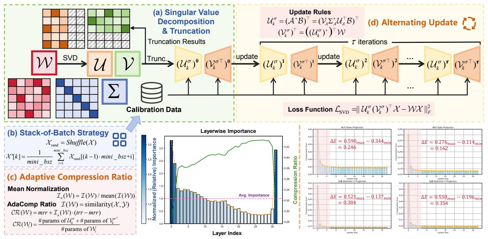
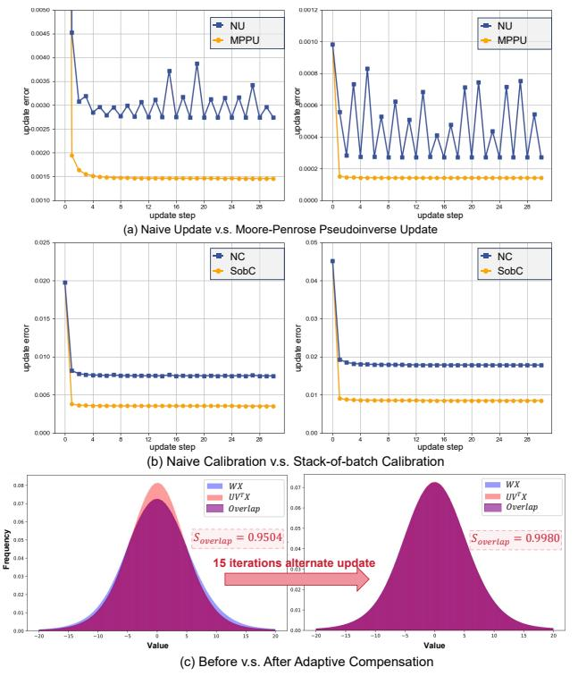
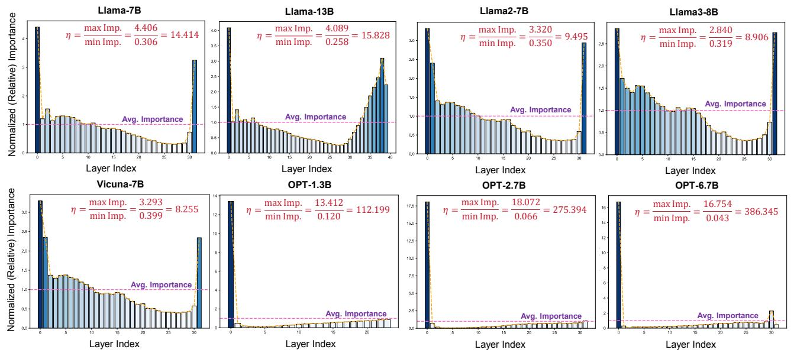

# <span id="page-0-0"></span>AdaSVD: Adaptive Singular Value Decomposition for Large Language Models

Zhiteng Li<sup>1\*</sup>, Mingyuan Xia<sup>1\*</sup>, Jingyuan Zhang<sup>1</sup>, Zheng Hui<sup>2</sup>, Haotong Qin<sup>3</sup>, Linghe Kong<sup>1†</sup>, Yulun Zhang<sup>1†</sup>, Xiaokang Yang<sup>1</sup> Shanghai Jiao Tong University, <sup>2</sup>MGTV, Shanhai Academy, <sup>3</sup>ETH Zürich

#### **Abstract**

Large language models (LLMs) have achieved remarkable success in natural language processing (NLP) tasks, yet their substantial memory requirements present significant challenges for deployment on resource-constrained devices. Singular Value Decomposition (SVD) has emerged as a promising compression technique for LLMs, offering considerable reductions in memory overhead. However, existing SVD-based methods often struggle to effectively mitigate the errors introduced by SVD truncation, leading to a noticeable performance gap when compared to the original models. Furthermore, applying a uniform compression ratio across all transformer layers fails to account for the varying importance of different layers. To address these challenges, we propose AdaSVD, an adaptive SVD-based LLM compression approach. Specifically, AdaSVD introduces adaComp, which adaptively compensates for SVD truncation errors by alternately updating the singular matrices  $\mathcal{U}$  and  $\mathcal{V}^{\top}$ . Additionally, AdaSVD introduces adaCR, which adaptively assigns layer-specific compression ratios based on the relative importance of each layer. Extensive experiments across multiple LLM/VLM families and evaluation metrics demonstrate that AdaSVD consistently outperforms state-of-the-art (SOTA) SVD-based methods, achieving superior performance with significantly reduced memory requirements. Code and models of AdaSVD will be available at https://qithub.com/ZHITENGLI/AdaSVD.

## 1. Introduction

Recently, large language models (LLMs) based on the Transformer architecture [37] have shown remarkable potential across a wide range of natural language processing (NLP) tasks. However, their success is largely driven by their massive scale, with models such as the LLaMA family [35] and the Open Pre-trained Transformer (OPT) series [45] containing up to 70B and 66B parameters, respectively. The substantial memory requirements of these models present significant challenges for deploying them on mobile devices.

> **[图片提取文字 (无描述)]:**
> Llama2-7B 10<sup>5</sup> 104 Perplexity in  $\log_{10}$  Scale SVD **FWSVD ASVD** SVDLLM AdaSVD (ours) 10<sup>1</sup> 50 55 40 45 60 65 70 75 80 Compression Ratio (%)


Figure 1. Comparison between vanilla SVD, FWSVD [17], ASVD [42], SVD-LLM [40], and our AdaSVD on WikiText2.

Consequently, the widespread adoption of LLMs remains limited by their immense resource demands [38, 39, 47].

Recent research on large language model (LLM) compression has explored various techniques, including weight quantization [11, 22], network pruning [10, 34], low-rank factorization [40, 42, 44], and knowledge distillation [15, 46]. Among these methods, low-rank factorization using Singular Value Decomposition (SVD) [17, 40, 42] stands out as a powerful approach for reducing both model size and computational cost. SVD achieves this by decomposing large weight matrices into smaller, low-rank components while preserving model performance. Since LLMs are often memorybound during inference [6, 7], SVD compression can effectively accelerate model inference by reducing the memory requirements, even when applied solely to the weights. This approach does not require specialized hardware or custom operators, unlike weight quantization, making SVD more versatile across different platforms. Additionally, SVD is orthogonal to other compression techniques [40], allowing it to be combined with methods like weight quantization or network pruning for even greater efficiency, enabling more scalable and adaptable solutions for deploying LLMs.

Recent advancements in SVD-based LLM compression, including FWSVD [17], ASVD [42], and SVD-LLM [40], have significantly improved the low-rank factorization ap-

<sup>\*</sup>Equal contribution

 $<sup>^{\</sup>dagger} Corresponding$  authors: Linghe Kong, linghe.kong@sjtu.edu.cn, Yulun Zhang, yulun100@gmail.com

<span id="page-1-1"></span><span id="page-1-0"></span>> **[图片提取文字 (无描述)]:**
> (a) Singular Value **Update Rules**  $\mathcal{U}_{k}^{\sigma} = (\mathcal{A}^{+}\mathcal{B})^{\top} = (\mathcal{V}_{k}\Sigma_{A}^{+}\mathcal{U}_{A}^{\top}\mathcal{B})^{\top}$  (d) Alternating Update Decomposition  $(\mathcal{V}_{k}^{\sigma})^{\top} = ((\mathcal{U}_{k}^{\sigma})^{+})^{\top} \mathcal{W}$ & Truncation Truncation Results  $\tau$  iterations Trunc.  $(\mathcal{U}_{k}^{\sigma})^{0}$   $(\mathcal{V}_{k}^{\sigma^{\top}})^{0}$  update  $(\mathcal{U}_{k}^{\sigma})^{1}$   $(\mathcal{V}_{k}^{\sigma^{\top}})^{1}$  update  $(\mathcal{U}_{k}^{\sigma})^{2}$   $(\mathcal{V}_{k}^{\sigma^{\top}})^{2}$   $(\mathcal{V}_{k}^{\sigma^{\top}})^{2}$   $(\mathcal{V}_{k}^{\sigma^{\top}})^{r}$ SVD Loss Function  $\mathcal{L}_{SVD} = \|\mathcal{U}_k^{\sigma}(\mathcal{V}_k^{\sigma})^{\top}\mathcal{X} - \mathcal{W}\mathcal{X}\|_F^2$ Calibration Data (b) Stack-of-Batch Strategy Layerwise Importance  $\Delta E = 0.590_{max} - 0.344_{min}$ (Relative) Importance  $\Delta E = 0.276_{max} - 0.114_{min}$  $\mathcal{X}_{rand} = Shuffle(\mathcal{X})$  $\mathcal{X}'[k] = \frac{1}{mini\_bsz} \sum_{i=1}^{mini\_bsz} \mathcal{X}_{rand}[(k-1) \cdot mini\_bsz + i]$ = 0.246= 0.162(c) Adaptive Compression Ratio Mean Normalization  $\mathcal{I}_{\mathbf{w}}(\mathcal{W}) = \mathcal{I}(\mathcal{W}) / \operatorname{mean}(\mathcal{I}(\mathcal{W}))$ Avg. Importance  $\Delta E = 0.521_{max} - 0.137_{min}$  $\Delta E = 0.550_{max} - 0.196_{min}$ = 0.384= 0.354AdaComp Ratio  $\mathcal{I}(\mathcal{W}) = \text{similarity}(\mathcal{X}, \mathcal{Y})$  $CR(W) = mrr + I_n(W) \cdot (trr - mrr)$  $CR(\mathcal{W}_i) = \frac{\text{\#params of } \mathcal{U}_k^{\sigma} + \text{\#params of } \mathcal{V}_k^{\sigma^{\top}}}{\text{}}$ #params of  $W_i$ Layer Index


Figure 2. Overview of the proposed AdaSVD method: (a) SVD decomposition and truncation for linear layer weights; (b) Stack-of-batch strategy for efficient use of calibration data under limited GPU memory; (c) Adaptive compression ratio assignment (**adaCR**) based on layer-wise importance; (d) Adaptive compensation (**adaComp**) through alternating updates of  $\mathcal{U}$  and  $\mathcal{V}^{\top}$ .

proach, enhancing the overall effectiveness of SVD compression. For example, FWSVD introduces Fisher information to prioritize the importance of parameters, while ASVD accounts for the impact of activation distribution on compression error. SVD-LLM establishes a relationship between singular values and compression loss through the data whitening techniques. While these methods have led to notable improvements in SVD compression, they still face challenges when applied at high compression ratios.

To bridge the performance gap between compressed and original models at both low and high compression ratios, we revisit SOTA solutions for LLM compression using SVD decomposition. Our analysis highlights two key observations: **First,** low-rank weight compensation after truncating the smallest singular vectors has been largely overlooked or insufficiently explored in prior methods. When truncating parts of the matrices  $\mathcal{U}$  and  $\mathcal{V}^{\top}$ , the remaining components should be adjusted accordingly to minimize the SVD compression error. **Second,** previous methods typically apply a uniform compression ratio across all transformer layers, failing to account for their varying relative importance. To address this, an importance-aware approach for assigning appropriate compression ratios is necessary.

To tackle the challenges outlined above, we propose AdaSVD, an adaptive SVD-based LLM compression method. **First,** AdaSVD proposes **adaComp**, an adaptive compensation technique designed to adjust the weights of  $\mathcal{U}$  and  $\mathcal{V}^{\top}$  after SVD truncation. By alternately updating the matrices  $\mathcal{U}$  and  $\mathcal{V}^{\top}$ , **adaComp** effectively reduces compression errors in a stable and efficient manner. To optimize the use of

calibration data with limited GPU memory, we also introduce a stack-of-batch technique when applying **adaComp**. **Second**, AdaSVD proposes **adaCR**, a method that assigns adaptive compression ratios to different layers based on their importance. With the target compression ratio fixed, this strategy significantly improves performance compared to using a uniform compression ratio across all layers.

Our key contributions are summarized as follows:

- We propose **adaComp**, a novel adaptive compensation method for SVD truncation. By alternately updating  $\mathcal{U}$  and  $\mathcal{V}^{\top}$  and employing the stack-of-batch technique, we effectively and stably minimize compression error.
- We propose adaCR, an adaptive compression ratio method that assigns layer-specific compression ratios according to their relative importance in LLMs. This importanceaware approach outperforms the previously used uniform compression ratio method.
- Extensive experiments on LLMs/VLMs demonstrate that our method, AdaSVD, significantly outperforms the previous SOTA SVD-based LLM compression method, SVD-LLM, effectively narrowing the performance gap between compressed and original models.

## 2. Related Works

#### 2.1. LLM Compression Techniques

Recent advancements in model compression techniques have significantly enhanced the efficiency of deploying LLMs while maintaining their performance. Widely explored approaches include weight quantization [11, 22], network pruning [1, 10, 14, 25, 41], and hybrid methods [8]. In unstruc-

#### <span id="page-2-1"></span>Algorithm 1 Pseudocode of AdaSVD

```
1: Inputs: LLM \mathcal{M}, Calib Data \mathcal{C}, Bucket Size M, Target Retention Ratio trr, Min Retention Ratio mrr, Update Iteration k
 2: Outputs: Updated Model \mathcal{M}' by AdaSVD
 3: procedure ADASVD(\mathcal{M}, \mathcal{C}, trr, mrr, k)
            \mathcal{X} \leftarrow \text{Get\_calib}(\mathcal{C})
 4:
                                                                                                                                 ▶ Randomly collect samples as calibration data
 5:
            \mathcal{X}'[1], \mathcal{X}'[2], ..., \mathcal{X}'[M] \leftarrow SOB(\mathcal{X}, M)
                                                                                                            ▶ Shuffle samples and utilize stack-of-batch (SOB) strategy
 6:
            \operatorname{Set}_{\mathcal{S}} \leftarrow \operatorname{Whitening}(\mathcal{M}, \mathcal{X}'), \operatorname{Set}_{\mathcal{SVD}} \leftarrow \emptyset, \operatorname{Set}_{\mathcal{W}} \leftarrow \mathcal{M}
                                                                                                                       ▶ Initialize sets of decomposed matrices and weights
            Set_{CR} \leftarrow Layer\_CR(\mathcal{M}, \mathcal{X}', trr, mrr)
                                                                                                                 ▶ Calculate layerwise importance and compression ratio
 7:
            for layer i in language model \mathcal{M} do
 8:
                  \mathcal{W}_i \leftarrow \operatorname{Set}_{\mathcal{W}}(i), \mathcal{S}_i \leftarrow \operatorname{Set}_{\mathcal{S}}(\mathcal{W}_i)
 9:
                                                                                                                        \triangleright Extract the whitening matrix of current weight W_i
10:
                  \mathcal{U}_i, \Sigma_i, \mathcal{V}_i \leftarrow \text{SVD}(\mathcal{W}_i \mathcal{S}_i)
                                                                                                                                              ▶ Apply Singular Value Decomposition
                  \Sigma' \leftarrow \text{Trunc}(\Sigma_i), (\mathcal{U}_i', \mathcal{V}_i') \leftarrow \text{Trunc\_UV}(\mathcal{U}, \mathcal{V}, \Sigma')
                                                                                                                           > Apply adaptive compression ratio and truncation
11:
                  \operatorname{Set}_{\mathcal{SVD}} \leftarrow (\mathcal{U}_i', \mathcal{V}_i') \cup \operatorname{Set}_{\mathcal{SVD}}
12:
13:
            \mathcal{M}' \leftarrow ADA\_UPDATE(\mathcal{M}, \mathcal{X}', SET_{SVD}, k)
                                                                                                                         \triangleright Utilize alternate update for \mathcal{U}'_i, \mathcal{V}'_i with iteration k
14:
            return \mathcal{M}'
16: end procedure
```

<span id="page-2-0"></span>tured pruning, SparseGPT [10] prunes weights based on their importance, as determined by the Hessian matrix. However, it faces challenges in achieving optimal speedup, particularly due to hardware compatibility issues. Structured pruning methods, in contrast, are more hardware-friendly. LLM-Pruner [25] selectively removes non-critical coupled structures using gradient information. LaCo [41] introduces a layer-wise pruning strategy, where subsequent layers collapse into preceding ones. Gromov et al. [14] explores the effectiveness of basic layer-pruning techniques combined with parameter-efficient fine-tuning (PEFT). Additionally, SliceGPT [1] has pioneered post-training sparsification, emphasizing the importance of layer removal order for optimal performance. Quantization techniques offer another significant avenue for compression. GPTQ [11] applies layer-wise quantization and reduces quantization errors through secondorder error compensation. AWQ [22] introduces activationaware weight quantization, employing a scale transformation between weights and activations. Moreover, BiLLM [19] and ARB-LLM [21] achieve further compression to 1-bit while maintaining remarkable performance. More recently, STB-LLM [8] combines 1-bit quantization with pruning to achieve even greater memory reduction for LLMs. However, many of these compression techniques face challenges related to hardware compatibility, often requiring custom CUDA kernels [8] to enable real-time inference speedup.

## 2.2. SVD-based LLM Compression

Singular Value Decomposition (SVD) is a widely used technique for reducing matrix size by approximating a matrix with two smaller, low-rank matrices [13]. Although SVD-based methods have demonstrated potential in compressing LLMs, their full capabilities remain underexplored. Standard SVD typically focuses on compressing the original weight

matrix without considering the significance of individual parameters, which can lead to considerable compression errors. To address this, Hsu et al. [18] introduced FWSVD, which incorporates Fisher information to weight the importance of parameters. However, this method requires complex gradient calculations, making it resource-intensive. Another limitation of standard SVD is the impact of activation distribution on compression errors. To mitigate this, Yuan et al. [42] proposed ASVD, which scales the weight matrix with a diagonal matrix that accounts for the influence of input channels on the weights. Subsequently, Wang et al. [40] introduced SVD-LLM, which establishes a connection between singular values and compression loss. This work demonstrates that truncating the smallest singular values after data whitening effectively minimizes compression loss. Despite these advancements, existing methods still exhibit significant accuracy loss at higher compression ratios and lack a comprehensive approach for compensating compressed weights after SVD truncation. Furthermore, most methods apply a uniform compression ratio across all transformer layers, overlooking the varying importance of different layers. AdaSVD seeks to address these limitations by proposing an adaptive compensation method (adaComp) and an importance-aware adaptive compression ratio method (adaCR).

#### 3. Method

Overview. As illustrated in Figure 2, our AdaSVD integrates adaptive compensation for SVD truncation (adaComp) with an adaptive importance-aware compression ratio method (adaCR). In Sec. 3.1, we first describe how adaComp compensates for SVD truncation. Next, in Sec. 3.2, we detail how adaCR determines the compression ratio based on layer importance. The pseudocode of AdaSVD is shown in Algorithm 1, and pseudocodes for adaComp and adaCR are provided in the supplementary file.

## <span id="page-3-2"></span><span id="page-3-0"></span>3.1. Adaptive Compensation for SVD Truncation

SVD compression first applies SVD decomposition for matrix W, and then truncates the smallest singular values:

$$\mathcal{W} = \mathcal{U}\Sigma\mathcal{V}^{\top} \approx \mathcal{U}_k \Sigma_k \mathcal{V}_k^{\top} = \widehat{\mathcal{W}}, \tag{1}$$

where  $\Sigma_k$  indicates the retaining top-k largest singular values,  $\mathcal{U}_k$  and  $\mathcal{V}_k^{\top}$  represent the corresponding retaining singular vectors. Moreover, the diagonal matrix  $\Sigma_k$  can be further absorbed into  $\mathcal{U}_k$  and  $\mathcal{V}_k^{\top}$  by

$$\mathcal{U}_k^{\sigma} = \mathcal{U}_k \Sigma_k^{\frac{1}{2}}, \ \mathcal{V}_k^{\sigma} = \mathcal{V}_k \Sigma_k^{\frac{1}{2}}, \tag{2}$$

$$\widehat{\mathcal{W}} = \mathcal{U}_k \Sigma_k \mathcal{V}_k^{\top} = \mathcal{U}_k^{\sigma} (\mathcal{V}_k^{\sigma})^{\top}. \tag{3}$$

The truncation of the smallest singular values minimizes the compression error with respect to  $\mathcal{W}$ , ensuring that  $||\mathcal{U}_k^{\sigma}(\mathcal{V}_k^{\sigma})^{\top} - \mathcal{W}||_F^2$  is minimized, which we refer to as the vanilla SVD method. However, this approach does not fully account for the practical effects of  $\mathcal{X}$ . To address this limitation, we introduce a more application-relevant metric for the SVD compression error, defined as follows:

$$\mathcal{L}_{SVD} = ||\widehat{\mathcal{W}}\mathcal{X} - \mathcal{W}\mathcal{X}||_F^2$$
  
=  $||\mathcal{U}_k^{\sigma}(\mathcal{V}_k^{\sigma})^{\top}\mathcal{X} - \mathcal{W}\mathcal{X}||_F^2$ . (4)

Previous works [18, 40, 42] have made significant efforts to minimize  $\mathcal{L}_{SVD}$ . However, some of them involve complex and time-consuming preprocessing steps. Furthermore, they still face substantial challenges in effectively mitigating the large errors that arise under high compression ratios, particularly when truncating 60% or more of the parameters.

To compensate for the error attributed to SVD truncation, we need to optimize the following objective:

$$\mathcal{U}_{k}^{\sigma}, \mathcal{V}_{k}^{\sigma^{\top}} = \arg\min_{\mathcal{U}_{k}^{\sigma}, \mathcal{V}_{k}^{\sigma^{\top}}} \|\mathcal{U}_{k}^{\sigma} \mathcal{V}_{k}^{\sigma^{\top}} \mathcal{X} - \mathcal{W} \mathcal{X}\|_{F}^{2}. \tag{5}$$

A straightforward approach is to compute the partial derivatives of the SVD compression objective with respect to  $\mathcal{U}_k^{\sigma}$  and  $\mathcal{V}_k^{\sigma^{\top}}$ , resulting in the following expressions (additional details can be found in the supplementary file):

$$\frac{\partial \mathcal{L}_{\text{SVD}}}{\partial \mathcal{U}_{k}^{\sigma}} = 0$$

$$\Rightarrow \mathcal{U}_{k}^{\sigma} = \mathcal{W} \mathcal{X} \mathcal{X}^{\top} \mathcal{V}_{k}^{\sigma} ((\mathcal{V}_{k}^{\sigma})^{\top} \mathcal{X} \mathcal{X}^{\top} \mathcal{V}_{k}^{\sigma})^{-1}, \quad (6)$$

$$\frac{\partial \mathcal{L}_{\text{SVD}}}{\partial \mathcal{V}_{k}^{\sigma}} = 0$$

$$\Rightarrow \mathcal{V}_{k}^{\sigma} = ((\mathcal{U}_{k}^{\sigma})^{\top} \mathcal{U}_{k}^{\sigma})^{-1} (\mathcal{U}_{k}^{\sigma})^{\top} \mathcal{W}. \quad (7)$$

However, this method involves computing the matrix inverse, which can lead to unstable updates and significant compression errors, as shown in Figure 3 (a). To mitigate the issue of numerical instability, we propose a two-fold strategy to enhance the update quality of  $\mathcal{U}_k^{\sigma}$  and  $\mathcal{V}_k^{\sigma^{\top}}$ .

**First**, the optimization objective for  $\mathcal{U}_k^{\sigma}$  is reformulated as a Least Squares Estimation (LSE) problem, where  $\mathcal{V}_k^{\sigma^{\top}}\mathcal{X}$  is treated as the input and  $\mathcal{W}\mathcal{X}$  as the output:

$$\mathcal{U}_k^{\sigma} = \arg\min_{\mathcal{U}_k^{\sigma}} \|\mathcal{A}(\mathcal{U}_k^{\sigma})^{\top} - \mathcal{B}\|_F^2, \tag{8}$$

<span id="page-3-1"></span>> **[图片提取文字 (无描述)]:**
> 0.0050 - NU - NU 0.0045 MPPU MPPU 0.0010 0.0040 0.0008 0.0035 update error 0.0030 update error 0.0020 0.0002 0.0015 0.0000 0.0010 update step update step (a) Naive Update v.s. Moore-Penrose Pseudoinverse Update 0.025 - NC - NC SobC SobC 0.020 0.04 0.015 0.03 update error update error 0.010 0.02 0.01 0.005 0.000 (b) Naive Calibration v.s. Stack-of-batch Calibration WX0.05 WX 0.07  $UV^TX$  $UV^TX$ 0.07 Overlap Overlap 0.06 0.06 0.05 Frequency  $S_{overlap} = 0.9504$  $S_{overlap} = 0.9980$ 15 iterations alternate update 0.03 0.02 0.02 0.01 0.01 -19 -10 -5 Value Value (c) Before v.s. After Adaptive Compensation


Figure 3. Adaptive compensation for SVD truncation (adaComp). (a) Comparison between naive (NU) and Moore-Penrose pseudoinverse update (MPPU). (b) Comparison between naive (NC) and stack-of-batch calibration strategy (SobC). (c) Distribution comparison before and after applying adaComp.

where  $\mathcal{A} = \mathcal{X}^{\top} \mathcal{V}_k^{\sigma}$  and  $\mathcal{B} = (\mathcal{W} \mathcal{X})^{\top}$ . Since  $\mathcal{A}$  is typically not a square matrix and may not be full rank, we first apply SVD to  $\mathcal{A}$  to enhance numerical stability:

$$\mathcal{A} = \mathcal{U}_{\mathcal{A}} \Sigma_{\mathcal{A}} \mathcal{V}_{\mathcal{A}}^{\top}, \tag{9}$$

and then obtain the solution for  $\mathcal{U}_k^{\sigma}$  by using the Moore-Penrose pseudoinverse [31] of  $\mathcal{A}$ :

$$\mathcal{U}_k^{\sigma} = (\mathcal{A}^+ \mathcal{B})^{\top} = (\mathcal{V}_{\mathcal{A}} \Sigma_{\mathcal{A}}^+ \mathcal{U}_{\mathcal{A}}^{\top} \mathcal{B})^{\top}, \tag{10}$$

where  $\Sigma_A^+$  denotes the Moore-Penrose pseudoinverse of  $\Sigma_A$ :

$$\Sigma_A = \operatorname{diag}(\sigma_1, \sigma_2, \dots, \sigma_n), \tag{11}$$

$$\Sigma_{A}^{+} = \operatorname{diag}\left(\sigma_{1}^{-1} \mathbb{1}_{\sigma_{1} \neq 0}, \sigma_{2}^{-1} \mathbb{1}_{\sigma_{2} \neq 0}, \dots, \sigma_{n}^{-1} \mathbb{1}_{\sigma_{n} \neq 0}\right).$$
(12)

Similarly, we update  $\mathcal{V}_k^{\sigma^\top}$  using the Moore-Penrose pseudoinverse of  $\mathcal{U}_k^{\sigma}$  to handle numerical instability:

$$\mathcal{V}_{k}^{\sigma\top} = \arg\min_{\mathcal{V}_{k}^{\sigma\top}} \|\mathcal{U}_{k}^{\sigma}\mathcal{V}_{k}^{\sigma\top}\mathcal{X} - \mathcal{W}\mathcal{X}\|_{F}^{2}$$

$$= \left((\mathcal{U}_{k}^{\sigma})^{+}\right)^{\top}\mathcal{W}.$$
(13)

As shown in Figure 3 (a), by reformulating the optimization objective as an LSE problem and solving for  $\mathcal{U}$  and  $\mathcal{V}^{\top}$  using the Moore-Penrose pseudoinverse, we achieve a smooth curve that consistently reduces compression error stably.

**Second**, since the update rule incorporates the calibration data  $\mathcal{X}$ , ideally, a large volume of  $\mathcal{X}$  would yield better

<span id="page-4-2"></span><span id="page-4-1"></span>> **[图片提取文字 (无描述)]:**
> Llama-7B Llama2-7B Llama-13B Llama3-8B Normalized (Relative) Importance  $\eta = \frac{\text{max Imp.}}{\text{min Imp.}} = \frac{4.406}{0.306} = 14.414$  $\eta = \frac{\text{max Imp.}}{\text{min Imp.}} = \frac{4.089}{0.258} = 15.828$  $\eta = \frac{\text{max Imp.}}{\text{min Imp.}} = \frac{3.320}{0.350} = 9.495$  $\eta = \frac{\text{max Imp.}}{\text{min Imp.}} = \frac{2.840}{0.319} = 8.906$ 3.5 3.0 2.5 2.0 Avg. Importance 1.5 Avg. Importance Avg. Importance Avg. Importance Layer Index Layer Index Layer Index Layer Index Vicuna-7B OPT-1.3B OPT-6.7B OPT-2.7B Normalized (Relative) Importance  $\frac{\text{max Imp.}}{\text{min Imp.}} = \frac{18.072}{0.066} = 275.394$  $\frac{\text{max Imp.}}{\text{min Imp.}} = \frac{3.293}{0.399} = 8.255$  $\frac{\text{max Imp.}}{\text{min Imp.}} = \frac{13.412}{0.120} = 112.199$  $\frac{\text{max Imp.}}{\text{min Imp.}} = \frac{16.754}{0.043} = 386.345$ 15.0 -12.5 10.0 -Avg. Importance 2.5 Avg. Importance Avg. Importance Avg. Importance Layer Index Layer Index Layer Index Layer Index


Figure 4. Layer-wise relative importance of different LLMs. The importance across different layers varies significantly, and the first layer always weight most importance. More layer-wise importance visualization can be found in the supplementary file.

results. However, during our experiments, we found that extending  $\mathcal{X}$  to just 32 samples on an 80GB GPU is challenging. To address this, we propose a **stack-of-batch** strategy that enables the utilization of more calibration data without increasing memory overhead. Specifically, given N calibration samples and a bucket size M (the maximum number of samples that can fit within the fixed GPU memory), we randomly sample  $mini\_bsz = \lceil \frac{N}{M} \rceil$  samples into one bucket by taking their mean value as follows:

$$\mathcal{X}_{\text{rand}} = Shuffle(\mathcal{X}),$$
 (14)

$$\mathcal{X}'[k] = \frac{1}{mini\_bsz} \sum_{i=1}^{mini\_bsz} \mathcal{X}_{rand}[(k-1) \cdot mini\_bsz + i],$$
(15)

where k = 1, 2, ..., M, and cardinality  $|\mathcal{X}'| = M$ . As shown in Figure 3 (b), integrating the **stack-of-batch** strategy further reduces the compression error.

As shown in Figure 2, to compensate for the error attributed to SVD truncation, we propose an adaptive method to subsequently update  $\mathcal{U}_k^{\sigma}$  and  $\mathcal{V}_k^{\sigma}$  with the above update rules. Moreover, the adaptation of  $\mathcal{U}_k^{\sigma}$  and  $\mathcal{V}_k^{\sigma}$  can be alternatively applied until convergence, where the update sequence over  $\tau$  iterations can be expressed as

$$\begin{array}{c}
(\mathcal{U}_{k}^{\sigma})^{\mathbf{1}} \to (\mathcal{V}_{k}^{\sigma^{\top}})^{\mathbf{1}} \to \left[ (\mathcal{U}_{k}^{\sigma})^{\mathbf{2}} \to (\mathcal{V}_{k}^{\sigma^{\top}})^{\mathbf{2}} \right] \\
\to \cdots \to \left[ (\mathcal{U}_{k}^{\sigma})^{\tau} \to (\mathcal{V}_{k}^{\sigma^{\top}})^{\tau} \right], \quad (16)
\end{array}$$

where  $(\mathcal{U}_k^{\sigma})^{\tau}$  and  $(\mathcal{V}_k^{\sigma^{\top}})^{\tau}$  denote the updated singular matrices after  $\tau$ -th iteration, respectively, while the region bounded by corresponding to one iteration of alternative update. As shown in Figure 3 (c), the gap between the outputs of the compressed and original models narrows

after alternative updates. The overlapping area rapidly increases after just a few iterations. More visual comparisons are shown in the supplementary file.

Notably, our adaptive compensation can be integrated with data whitening proposed by Wang et al. [40] and Liu et al. [24], further reducing the SVD truncation error.

#### <span id="page-4-0"></span>3.2. Adaptive SVD Compression Ratio

Previous studies on SVD compression typically apply a uniform compression ratio across all transformer layers of LLMs, overlooking the varying importance of different layers. Inspired by Men et al. [27] and Dumitru et al. [9], we propose **adaCR**, which adaptively determines the SVD compression ratio for each transformer layer, considering each layer's distinct impact on activations.

The importance of W can be measured by its impact on the input, which is quantified as the similarity between the input X and the output Y after passing through W.

$$\mathcal{Y} = \mathcal{W}\mathcal{X},\tag{17}$$

$$\mathcal{I}(\mathcal{W}) = \text{similarity}(\mathcal{X}, \mathcal{Y}),$$
 (18)

where  $\mathcal{I}(\mathcal{W})$  denotes the layer-wise importance of  $\mathcal{W}$ . The similarity metric used can vary, and for simplicity, we adopt cosine similarity in our method.

Then, we normalize  $\mathcal{I}(\mathcal{W})$  through mean centering to obtain the relative importance of  $\mathcal{W}$ :

$$\mathcal{I}_n(\mathcal{W}) = \mathcal{I}(\mathcal{W})/\text{mean}(\mathcal{I}(\mathcal{W})).$$
 (19)

After mean normalization, the average importance is 1. A value of  $\mathcal{I}_n(\mathcal{W})$  greater than 1 indicates greater importance, while a value lower than 1 indicates lesser importance. The compression ratio of each layer will be adaptively adjusted

<span id="page-5-2"></span><span id="page-5-0"></span>

| RATIO | Метнор                                         | WikiText-2↓                                  | PTB↓                                            | C4↓                                          | Mmlu                                    | ARC_e                            | WinoG.                           | HellaS.                          | PIQA                                    | <b>Average</b> ↑                 |
|-------|------------------------------------------------|----------------------------------------------|-------------------------------------------------|----------------------------------------------|-----------------------------------------|----------------------------------|----------------------------------|----------------------------------|-----------------------------------------|----------------------------------|
| 0%    | Original                                       | 5.68                                         | 8.35                                            | 7.34                                         | 45.30                                   | 74.62                            | 69.22                            | 76.00                            | 79.11                                   | 68.85                            |
| 40%   | SVD<br>FWSVD [18]<br>ASVD [42]<br>SVD-LLM [40] | 39,661.03<br>8,060.35<br>1,609.32<br>16.11   | 69,493.00<br>9,684.10<br>7,319.49<br>719.44     | 56,954.00<br>7,955.21<br>1,271.85<br>61.95   | 26.51<br>25.74<br>24.35<br>22.97        | 26.39<br>26.05<br>26.81<br>36.99 | 48.62<br>50.20<br>49.49<br>56.04 | 25.64<br>25.70<br>25.83<br>30.49 | 52.99<br>52.39<br>53.81<br>56.96        | 36.03<br>36.01<br>36.06<br>40.69 |
|       | AdaSVD                                         | <b>14.76</b> (\$\\$%)                        | 304.62 (\$\dagger\$58%)                         | <b>56.98</b> (\dagger*8%)                    | 23.63                                   | 41.12                            | 58.17                            | 31.75                            | 58.49                                   | 42.63                            |
| 50%   | SVD<br>FWSVD [18]<br>ASVD [42]<br>SVD-LLM [40] | 53,999.48<br>8,173.21<br>6,977.57<br>27.19   | 39,207.00<br>8,615.71<br>15,539.44<br>1,772.91  | 58,558.00<br>8,024.67<br>4,785.15<br>129.66  | 25.43<br>24.83<br>24.52<br>23.44        | 25.80<br>25.84<br>25.13<br>31.65 | 47.36<br>48.70<br>49.17<br>51.14 | 25.55<br>25.64<br>25.48<br>28.38 | 52.67<br>52.83<br>52.94<br>54.57        | 35.36<br>35.57<br>35.45<br>37.83 |
|       | AdaSVD                                         | <b>25.58</b> (\$\ddot6\%)                    | <b>593.14</b> (\d)67%)                          | <b>113.84</b> (\12%)                         | 23.24                                   | 34.18                            | 54.06                            | 28.88                            | 55.50                                   | 39.17                            |
| 60%   | SVD<br>FWSVD [18]<br>ASVD [42]<br>SVD-LLM [40] | 65,186.67<br>27,213.30<br>10,003.57<br>89.90 | 79,164.00<br>24,962.80<br>15,530.19<br>2,052.89 | 70,381.00<br>47,284.87<br>9,983.83<br>561.00 | 22.94<br><b>26.91</b><br>26.89<br>22.88 | 24.49<br>25.38<br>26.68<br>26.73 | <b>51.85</b> 48.46 48.86 47.43   | 25.40<br>25.61<br>25.76<br>26.89 | 53.16<br>51.96<br>51.80<br><b>53.48</b> | 35.57<br>35.66<br>36.00<br>35.48 |
|       | AdaSVD                                         | <b>50.33</b> (\.44%)                         | <b>1,216.95</b> (↓41%)                          | <b>239.18</b> (\$57%)                        | 24.69                                   | 28.20                            | 51.22                            | 27.36                            | 52.83                                   | 36.87                            |

Table 1. Zero-shot performance comparison of LLaMA2-7B between AdaSVD and previous SVD compressed methods under 40% to 60% compression ratios. Evaluation on three language modeling datasets (measured by perplexity (\$\psi\$)) and five common sense reasoning datasets (measured by both individual and average accuracy (\( \)) demonstrate the effectiveness of AdaSVD.

<span id="page-5-1"></span>

| Метнор       | OPT-6.7B    | LLaMA2-7B           | Mistral-7B  | Vicuna-7B            |
|--------------|-------------|---------------------|-------------|----------------------|
| SVD          | 18,607.24   | 65,186.67           | 30,378.35   | 78,704.50            |
| FWSVD [18]   | 8,569.56    | 27,213.30           | 5,481.24    | 8,185.66             |
| ASVD [42]    | 10,326.48   | 10,003.57           | 22,705.51   | 20,241.17            |
| SVD-LLM [40] | 92.10       | 89.90               | 72.17       | 64.06                |
| AdaSVD       | 86.64 (↓6%) | <b>50.33</b> (↓44%) | 67.22 (↓7%) | <b>56.97</b> (\$11%) |

Table 2. Perplexity (↓) of four different LLMs – OPT-6.7B, LLaMA 2-7B, Mistral-7B, and Vicuna-7B – under 60% compression ratio on WikiText-2, where AdaSVD shows consistent improvements.

based on the relative importance:

$$\mathcal{CR}(W) = mrr + \mathcal{I}_n(W) \cdot (trr - mrr),$$
 (20)  
where  $mrr$  and  $trr$  are the minimum and target retention ratios respectively. Notably  $\mathcal{CR}(W) = mrr$  when

tion ratios, respectively. Notably, CR(W) = mrr when  $\mathcal{I}_n(\mathcal{W}) = 0$ , and  $\mathcal{CR}(\mathcal{W}) = trr$  when  $\mathcal{I}_n(\mathcal{W}) = 1$ .

Given the compression ratio for the *i*-th layer by **adaCR**, we truncate the vectors of least singular values from both

we truncate the vectors of least singular values from both 
$$\mathcal{U}_{k}^{\sigma}$$
 and  $\mathcal{V}_{k}^{\sigma\top}$  so that 
$$\mathcal{CR}(\mathcal{W}_{i}) = \frac{\# \text{params of } \mathcal{U}_{k}^{\sigma} + \# \text{params of } \mathcal{V}_{k}^{\sigma\top}}{\# \text{params of } \mathcal{W}_{i}}. \tag{21}$$
As shown in Figure 4, the importance of different layers

As shown in Figure 4, the importance of different layers varies. It can be observed that the first layer always weighs the most importance, suggesting that we should retain more weight on it. For the Llama family, the relative importance curve approximates a bowl shape, highlighting the significance of both the initial and final layers.

## 4. Experiments

## **4.1. Setup**

We compare our AdaSVD with four baselines, including vanilla SVD and SOTA SVD-based LLM compression methods FWSVD [18], ASVD [42], and SVD-LLM [40].

**Models and Datasets.** To demonstrate the generalizability of our method, we evaluate the performance of AdaSVD and the baselines on four models from three different LLM families, including LLaMA2-7B [36], OPT-6.7B [45], Mistral-7B [20], and Vicuna-7B [4]. We benchmark on eight datasets, including three language modeling datasets (WikiText-2 [28], PTB [26], and C4 [32]) and five common-sense reasoning datasets (WinoGrande [33], HellaSwag [43], PIQA [2], ARC-e [5], and Mmlu [16]). We use the LM-Evaluation-Harness framework [12] to evaluate the model performance on these zero-shot Question-Answering (QA) datasets.

Implementation Details. To ensure a fair comparison, we followed ASVD [42] and SVD-LLM [40] to randomly select 256 samples from WikiText-2 as the calibration data and conduct data whitening before SVD truncation. All the experiments are conducted with PyTorch [30] and Huggingface [29] on a single NVIDIA A100-80GB GPU.

#### 4.2. Main Results

We evaluate the overall performance of AdaSVD from three aspects: (1) performance under different compression ratios (40%, 50%, 60%, 70%, and 80%), (2) performance on different LLMs. (3) performance on visual language models. Some performance evaluation results and generated contents by the compressed LLMs are included in the supplementary file to provide a more straightforward comparison.

#### Performance under Different Compression Ratios.

First, we evaluate the performance of LLaMA2-7B compressed by AdaSVD, vanilla SVD and the SOTA method SVD-LLM [40] under compression ratios ranging from 40% to 80% on all 8 datasets, as shown in Sec. 3.1. On the three language modeling datasets, AdaSVD consistently outperforms vanilla SVD, and SVD-LLM across all the compres-

<span id="page-6-1"></span><span id="page-6-0"></span>

**SVD**: a man standing on one side of the road and another man sitting on the other side. In this book, it'ans was written by an author who wrote ...

**SVD-LLM**: Assistants - Asassistant - assasat - as - sasasm - saasam \u2013 Sasmas \u2013 Saas...

<u>AdaSVD</u>: The vehicle is a motorcycle, which is an automobile that is used for transportation. ...


**SVD**: In this book, it's written by ... John an author of his own books and he is known for his writing ..

**SVD-LLM**: What'stans was an old name, used by a group of people who were on their way to city...

AdaSVD: It's a photo of children standing together, wearing uniforms... They are sitting on their kneels, it is an old photograph that ...

> **[图片提取文字 (无描述)]:**
> J.P.Morgan


**SVD**: it's a man ... and he has been injured by an injury that he was not able to play at 20 ...

SVD-LLM: a man who was seen to be an outsider, and he was not able to play at all, but he played with his right hand, which was broken, ...

AdaSVD: It's a person playing tennis on court, and he is wearing white shorts. ... playing his tennis with a tennis racket, ...


SVD: ... The mountains are covered with snow, .. difficult for them to climb ... not able to walk through the snow ... trapped in snow holes

SVD-LLM: ... walking on snowy mountains, snow falls down from top of the mountain to bottom ...

AdaSVD: The mountain is covered by snow, ... a group of people skiing and walking on slopes.

Figure 5. We perform image captioning by applying SVD, SVD-LLM [40], and our AdaSVD to LLaVA-7B model on the COCO dataset respectively, highlighting the correct captions and wrong captions in different colors.

sion ratios. More importantly, AdaSVD exhibits significant advantages over the baselines under higher compression ratios. These results indicate that AdaSVD is more effective in compressing LLMs for more resource-constrained devices such as smartphones and IoT devices, which often have limited memory and processing capabilities. On the five common sense reasoning datasets, AdaSVD also maintains its edge and performs better than the best-performing baseline on most of the datasets and consistently achieves higher average accuracy across all the compression ratios. Due to page limitations, comparisons for 70% and 80% compression ratios are provided in the supplementary file.

Performance on Different LLMs. To demonstrate the generability of AdaSVD across different LLMs, we compare AdaSVD and the baselines on four different models OPT-6.7B, LLaMA2-7B, Vicuna-7B, and Mistral-7B – under 60% compression ratio on WikiText-2. As shown in Tab. 2, AdaSVD consistently outperforms vanilla SVD, FWSVD, ASVD and SVD-LLM on all LLMs, and exhibits more stable performance across different LLMs, especially compared to vanilla SVD and FWSVD. We reproduce FWSVD, ASVD, and SVD-LLM using their official GitHub repositories. FWSVD and ASVD fail on these LLMs with compression ratios under 60%, whereas SVD-LLM and AdaSVD maintain reasonable perplexity in such cases.

**Performance on Visual Language Models.** Note that our AdaSVD can also be applied to visual language models (VLMs) like LLaVA [23]. Following Lin et al. [22], we apply SVD compression to the language part of the VLMs since it dominates the model size. As shown in Figure 5, AdaSVD shows better image captioning results than vanilla SVD and SVD-LLM on COCO dataset [3] under 40% compression ratio. More image captioning comparisons with various compression ratios can be found in supplementary file.

#### 4.3. Ablation Study

We provide extensive ablation study results in Tab. 3 to show the effect of some key components in our work. Effectiveness of Adaptive Compensation. To validate the effectiveness of the proposed adaComp, we compare the PPL results of Llama2-7B with and without adaComp on Wikitest-2, PTB, and C4 datasets in Tab. 3a. Results of 70% and 80% compression ratios can be found in the supplementary file. It can be observed that AdaSVD consistently outperforms SVD-LLM after applying adaComp, and the performance gap is more significant under high compression ratios (*i.e.*, 60%, 70%, and 80%).

**Iteration Number.** To investigate the impact of the number of adaComp iterations under different compression ratios, we perform an ablation study with 1, 3, and 15 iterations, as shown in Tab. 3c. Results for 70% and 80% compression ratios are provided in the supplementary file. At lower compression ratios (e.g., 40%, 50%, and 60%), it is observed that just 1 iteration of **adaComp** already outperforms the state-of-the-art method, SVD-LLM. However, increasing the number of iterations may lead to overfitting due to the limited calibration data, resulting in a performance drop. In contrast, at higher compression ratios (e.g., 70% and 80%), additional iterations lead to performance improvements, indicating that AdaSVD is more effective in high compression ratio scenarios where previous methods still struggle. This highlights the importance of balancing the number of iterations with the available data to avoid over-optimization, especially in low compression scales.

Effectiveness of Adaptive Compression Ratio. To validate the effectiveness of our adaCR, we compared the results after removing adaCR (*i.e.*, using constant compression ratios for all layers) from AdaSVD. As shown in Tab. 3b, AdaSVD already outperforms SOTA SVD-LLM without using adaCR, while integrating adaCR can further enhance the performance across all compression ratios.

**Minimum Retention Ratio.** The minimum retention ratio (mrr) in **adaCR** is also crucial, and we investigate the impact of different mrr values in Tab. 3d for 40%, 50%, and 60% compression ratios (70% and 80% in supplementary file). It can be observed that mrr remains relatively robust at

<span id="page-7-2"></span><span id="page-7-0"></span>

| Method  | Tgt. CR | adaComp | WikiText2↓ | $\mathbf{PTB}\downarrow$ | <b>C4</b> ↓ |
|---------|---------|---------|------------|--------------------------|-------------|
| SVD-LLM | 40%     | X       | 16.11      | 719.44                   | 61.95       |
| AdaSVD  | 40%     | ×       | 15.47      | 406.83                   | 66.29       |
| AdaSVD  | 40%     | ✓       | 14.76      | 304.62                   | 56.98       |
| SVD-LLM | 50%     | X       | 27.19      | 1,772.91                 | 129.66      |
| AdaSVD  | 50%     | ×       | 30.00      | 1101.15                  | 166.02      |
| AdaSVD  | 50%     | ✓       | 25.58      | 593.14                   | 113.84      |
| SVD-LLM | 60%     | Х       | 89.90      | 2,052.89                 | 561.00      |
| AdaSVD  | 60%     | ×       | 78.82      | 6,929.39                 | 339.31      |
| AdaSVD  | 60%     | ✓       | 50.33      | 1,216.95                 | 239.18      |

| (a) | Effectiveness | of Ad | aptive ( | Compensation |
|-----|---------------|-------|----------|--------------|
|-----|---------------|-------|----------|--------------|

| Method  | Tgt. CR | #Iteration | WikiText2↓ | $\mathbf{PTB}\downarrow$ | <b>C4</b> ↓ |
|---------|---------|------------|------------|--------------------------|-------------|
| SVD-LLM | 40%     |            | 16.11      | 719.44                   | 61.95       |
| AdaSVD  | 40%     | 1          | 14.76      | 304.62                   | 56.98       |
| AdaSVD  | 40%     | 3          | 15.47      | 249.41                   | 57.28       |
| AdaSVD  | 40%     | 15         | 15.84      | 257.96                   | 57.39       |
| SVD-LLM | 50%     | -          | 27.19      | 1,772.91                 | 129.66      |
| AdaSVD  | 50%     | 1          | 25.58      | 593.14                   | 113.84      |
| AdaSVD  | 50%     | 3          | 27.11      | 844.09                   | 115.51      |
| AdaSVD  | 50%     | 15         | 27.45      | 812.21                   | 110.35      |
| SVD-LLM | 60%     | -          | 89.90      | 2,052.89                 | 561.00      |
| AdaSVD  | 60%     | 1          | 50.33      | 1,216.95                 | 239.18      |
| AdaSVD  | 60%     | 3          | 64.12      | 3,546.45                 | 301.19      |
| AdaSVD  | 60%     | 15         | 62.34      | 4,293.79                 | 267.29      |

(c) Iteration Number for Adaptive Compression

| Method  | Tgt. CR | CR    | WikiText2 $\downarrow$ | $\mathbf{PTB}\downarrow$ | <b>C4</b> ↓ |
|---------|---------|-------|------------------------|--------------------------|-------------|
| SVD-LLM | 40%     | Const | 16.11                  | 719.44                   | 61.95       |
| AdaSVD  | 40%     | Const | 15.38                  | 617.11                   | 60.43       |
| AdaSVD  | 40%     | Adapt | 14.76                  | 304.62                   | 56.98       |
| SVD-LLM | 50%     | Const | 27.19                  | 1,772.91                 | 129.66      |
| AdaSVD  | 50%     | Const | 27.33                  | 1,177.53                 | 126.85      |
| AdaSVD  | 50%     | Adapt | 25.58                  | 593.14                   | 113.84      |
| SVD-LLM | 60%     | Const | 89.90                  | 2,052.89                 | 561.00      |
| AdaSVD  | 60%     | Const | 69.46                  | 2,670.20                 | 336.90      |
| AdaSVD  | 60%     | Adapt | 50.33                  | 1,216.95                 | 239.18      |

(b) Effectiveness of Adaptive Compression Ratio

| Method  | Tgt. CR | MRR  | WikiText2 ↓ | $\mathbf{PTB}\downarrow$ | <b>C4</b> ↓ |
|---------|---------|------|-------------|--------------------------|-------------|
| SVD-LLM | 40%     | -    | 16.11       | 719.44                   | 61.95       |
| AdaSVD  | 40%     | 0.40 | 15.01       | 223.19                   | 57.17       |
| AdaSVD  | 40%     | 0.45 | 14.85       | 241.90                   | 57.08       |
| AdaSVD  | 40%     | 0.50 | 14.76       | 304.62                   | 56.98       |
| SVD-LLM | 50%     | -    | 27.19       | 1,772.91                 | 129.66      |
| AdaSVD  | 50%     | 0.40 | 25.58       | 593.14                   | 113.84      |
| AdaSVD  | 50%     | 0.45 | 26.01       | 814.63                   | 117.58      |
| AdaSVD  | 50%     | 0.50 | 27.33       | 1,177.53                 | 126.85      |
| SVD-LLM | 60%     | -    | 89.90       | 2,052.89                 | 561.00      |
| AdaSVD  | 60%     | 0.30 | 50.33       | 1,216.95                 | 239.18      |
| AdaSVD  | 60%     | 0.35 | 53.17       | 1,608.19                 | 256.66      |
| AdaSVD  | 60%     | 0.40 | 60.08       | 2,137.29                 | 294.26      |

(d) Minimum Retention Ratio for Adaptive CR

Table 3. Ablation studies on LLaMA-2-7B. Results are measured by perplexity, with best results highlighted in ...

<span id="page-7-1"></span>

| RATIO | Метнор   | GPTQ-INT4 | WikiText-2↓ | PTB↓     | C4↓      |
|-------|----------|-----------|-------------|----------|----------|
| 0%    | Original | Х         | 5.68        | 8.35     | 7.34     |
|       | SVD-LLM  | ×         | 16.11       | 719.44   | 61.95    |
| 40%   | SVD-LLM  | ✓         | 33.56       | 1,887.50 | 184.61   |
| 40 /0 | AdaSVD   | X         | 14.76       | 304.62   | 56.98    |
|       | AdaSVD   | ✓         | 22.55       | 844.21   | 106.41   |
|       | SVD-LLM  | Х         | 27.19       | 1,772.91 | 129.66   |
| 50%   | SVD-LLM  | ✓         | 41.70       | 2,335.65 | 291.62   |
| 30%   | AdaSVD   | X         | 25.58       | 593.14   | 113.84   |
|       | AdaSVD   | ✓         | 37.34       | 1,326.55 | 203.11   |
|       | SVD-LLM  | Х         | 89.90       | 2,052.89 | 561.00   |
| 60%   | SVD-LLM  | ✓         | 119.46      | 3,136.60 | 723.80   |
| 00%   | AdaSVD   | X         | 60.08       | 2,137.28 | 294.26   |
|       | AdaSVD   | ✓         | 82.08       | 1,705.19 | 379.96   |
|       | SVD-LLM  | Х         | 125.16      | 6,139.78 | 677.38   |
| 70%   | SVD-LLM  | ✓         | 159.53      | 2,115.44 | 848.24   |
| 10%   | AdaSVD   | X         | 107.90      | 5,027.62 | 441.33   |
|       | AdaSVD   | ✓         | 118.75      | 1,606.94 | 466.64   |
|       | SVD-LLM  | Х         | 372.48      | 6,268.53 | 1,688.78 |
| 80%   | SVD-LLM  | ✓         | 420.25      | 3,716.08 | 1,996.42 |
| 80%   | AdaSVD   | X         | 206.51      | 6,613.44 | 679.66   |
|       | AdaSVD   | ✓         | 214.51      | 2,728.78 | 654.79   |

Table 4. AdaSVD with weight quantization method GPTQ.

lower compression ratios (40% and 50%), while contributing more at higher compression ratios (60%).

#### 4.4. Integrate with Weight Quantization

Similar to previous SVD-based compression methods [17, 40, 42], our AdaSVD is orthogonal to other types of compression techniques. Following Wang et al. [40], we integrate

AdaSVD with the widely used weight quantization method GPTQ [11]. As shown in Tab. 4, we compare AdaSVD with SVD-LLM [40] on the LLaMA2-7B model, using different compression ratios (40%, 50%, 60%, 70%, and 80%) across the WikiText-2, PTB, and C4 datasets. The results demonstrate that, when combined with the 4-bit weight quantization method GPTQ, AdaSVD also consistently outperforms SOTA SVD-LLM across all compression ratios. Under high compression ratios (*i.e.*, 60%, 70%, and 80%), AdaSVD + GPTQ-INT4 even surpasses SVD-LLM.

## 5. Conclusion

In this work, we propose AdaSVD, an adaptive SVD-based compression method for LLMs. AdaSVD first proposes ada-Comp, which adaptively compensates for the error caused by the truncation of singular matrices, efficiently reducing compression error without requiring additional training. Furthermore, AdaSVD proposes adaCR, which adaptively assigns compression ratios based on the importance of each layer, further enhancing performance while maintaining the same target compression rate. Both strategies effectively minimize SVD compression errors, particularly at high compression ratios. Our experiments on multiple open-source LLM and VLM families demonstrate that AdaSVD pushes the performance boundary beyond the current state-of-the-art SVD-based LLM compression methods.

## References

- <span id="page-8-7"></span>[1] Saleh Ashkboos, Maximilian L. Croci, Marcelo Gennari do Nascimento, Torsten Hoefler, and James Hensman. Slicegpt: Compress large language models by deleting rows and columns. In *ICLR*, 2024. [2,](#page-1-1) [3](#page-2-1)
- <span id="page-8-22"></span>[2] Yonatan Bisk, Rowan Zellers, Ronan Le Bras, Jianfeng Gao, and Yejin Choi. Piqa: Reasoning about physical commonsense in natural language. In *AAAI*, 2020. [6](#page-5-2)
- <span id="page-8-28"></span>[3] Xinlei Chen, Hao Fang, Tsung-Yi Lin, Ramakrishna Vedantam, Saurabh Gupta, Piotr Dollar, and C Lawrence Zitnick. ´ Microsoft coco captions: Data collection and evaluation server. *arXiv preprint arXiv:1504.00325*, 2015. [7](#page-6-1)
- <span id="page-8-19"></span>[4] Wei-Lin Chiang, Zhuohan Li, Zi Lin, Ying Sheng, Zhanghao Wu, Hao Zhang, Lianmin Zheng, Siyuan Zhuang, Yonghao Zhuang, Joseph E Gonzalez, et al. Vicuna: An open-source chatbot impressing gpt-4 with 90%\* chatgpt quality. In *LM-SYS*, 2023. [6](#page-5-2)
- <span id="page-8-23"></span>[5] Peter Clark, Isaac Cowhey, Oren Etzioni, Tushar Khot, Ashish Sabharwal, Carissa Schoenick, and Oyvind Tafjord. Think you have solved question answering? try arc, the ai2 reasoning challenge. *arXiv preprint arXiv:1803.05457*, 2018. [6](#page-5-2)
- <span id="page-8-5"></span>[6] Tri Dao. Flashattention-2: Faster attention with better parallelism and work partitioning. In *ICLR*, 2024. [1](#page-0-0)
- <span id="page-8-6"></span>[7] Tri Dao, Dan Fu, Stefano Ermon, Atri Rudra, and Christopher Re. Flashattention: Fast and memory-efficient exact attention ´ with io-awareness. In *NeurlPS*, 2022. [1](#page-0-0)
- <span id="page-8-10"></span>[8] Peijie Dong, Lujun Li, Yuedong Zhong, Dayou Du, Ruibo Fan, Yuhan Chen, Zhenheng Tang, Qiang Wang, Wei Xue, Yike Guo, et al. Stbllm: Breaking the 1-bit barrier with structured binary llms. In *ICLR*, 2025. [2,](#page-1-1) [3](#page-2-1)
- <span id="page-8-17"></span>[9] Razvan-Gabriel Dumitru, Paul-Ioan Clotan, Vikas Yadav, Darius Peteleaza, and Mihai Surdeanu. Change is the only constant: Dynamic llm slicing based on layer redundancy. In *EMNLP*, 2024. [5](#page-4-2)
- <span id="page-8-3"></span>[10] Elias Frantar and Dan Alistarh. Sparsegpt: Massive language models can be accurately pruned in one-shot. In *ICML*, 2023. [1,](#page-0-0) [2,](#page-1-1) [3](#page-2-1)
- <span id="page-8-1"></span>[11] Elias Frantar, Saleh Ashkboos, Torsten Hoefler, and Dan Alistarh. Gptq: Accurate post-training quantization for generative pre-trained transformers. In *ICLR*, 2023. [1,](#page-0-0) [2,](#page-1-1) [3,](#page-2-1) [8](#page-7-2)
- <span id="page-8-25"></span>[12] Leo Gao, Jonathan Tow, Baber Abbasi, Stella Biderman, Sid Black, Anthony DiPofi, Charles Foster, Laurence Golding, Jeffrey Hsu, Alain Le Noac'h, Haonan Li, Kyle Mc-Donell, Niklas Muennighoff, Chris Ociepa, Jason Phang, Laria Reynolds, Hailey Schoelkopf, Aviya Skowron, Lintang Sutawika, Eric Tang, Anish Thite, Ben Wang, Kevin Wang, and Andy Zou. A framework for few-shot language model evaluation. *Zenodo*, 2023. [6](#page-5-2)
- <span id="page-8-13"></span>[13] G.H. Golub, Alan Hoffman, and G.W. Stewart. A generalization of the eckart-young-mirsky matrix approximation theorem. *Linear Algebra and its Applications*, 1987. [3](#page-2-1)
- <span id="page-8-8"></span>[14] Andrey Gromov, Kushal Tirumala, Hassan Shapourian, Paolo Glorioso, and Daniel A. Roberts. The unreasonable ineffectiveness of the deeper layers. In *ICLR*, 2025. [2,](#page-1-1) [3](#page-2-1)

- <span id="page-8-4"></span>[15] Yuxian Gu, Li Dong, Furu Wei, and Minlie Huang. Knowledge distillation of large language models. In *ICLR*, 2024. [1](#page-0-0)
- <span id="page-8-24"></span>[16] Dan Hendrycks, Collin Burns, Steven Basart, Andy Zou, Mantas Mazeika, Dawn Song, and Jacob Steinhardt. Measuring massive multitask language understanding. *Proceedings of the International Conference on Learning Representations (ICLR)*, 2021. [6](#page-5-2)
- <span id="page-8-0"></span>[17] Yen-Chang Hsu, Ting Hua, Sungen Chang, Qian Lou, Yilin Shen, and Hongxia Jin. Language model compression with weighted low-rank factorization. In *ICLR*, 2022. [1,](#page-0-0) [8](#page-7-2)
- <span id="page-8-14"></span>[18] Yen-Chang Hsu, Ting Hua, Sungen Chang, Qian Lou, Yilin Shen, and Hongxia Jin. Language model compression with weighted low-rank factorization. In *ICLR*, 2022. [3,](#page-2-1) [4,](#page-3-2) [6](#page-5-2)
- <span id="page-8-11"></span>[19] Wei Huang, Yangdong Liu, Haotong Qin, Ying Li, Shiming Zhang, Xianglong Liu, Michele Magno, and Xiaojuan Qi. Billm: Pushing the limit of post-training quantization for llms. In *ICML*, 2024. [3](#page-2-1)
- <span id="page-8-18"></span>[20] Albert Q Jiang, Alexandre Sablayrolles, Arthur Mensch, Chris Bamford, Devendra Singh Chaplot, Diego de las Casas, Florian Bressand, Gianna Lengyel, Guillaume Lample, Lucile Saulnier, et al. Mistral 7b. *arXiv preprint arXiv:2310.06825*, 2023. [6](#page-5-2)
- <span id="page-8-12"></span>[21] Zhiteng Li, Xianglong Yan, Tianao Zhang, Haotong Qin, Dong Xie, Jiang Tian, Linghe Kong, Yulun Zhang, Xiaokang Yang, et al. Arb-llm: Alternating refined binarizations for large language models. In *ICLR*, 2025. [3](#page-2-1)
- <span id="page-8-2"></span>[22] Ji Lin, Jiaming Tang, Haotian Tang, Shang Yang, Wei-Ming Chen, Wei-Chen Wang, Guangxuan Xiao, Xingyu Dang, Chuang Gan, and Song Han. Awq: Activation-aware weight quantization for on-device llm compression and acceleration. In *MLSys*, 2024. [1,](#page-0-0) [2,](#page-1-1) [3,](#page-2-1) [7](#page-6-1)
- <span id="page-8-27"></span>[23] Haotian Liu, Chunyuan Li, Qingyang Wu, and Yong Jae Lee. Visual instruction tuning. In *NeurlPS*, 2023. [7](#page-6-1)
- <span id="page-8-15"></span>[24] Shih-Yang Liu, Huck Yang, Chein-Yi Wang, Nai Chit Fung, Hongxu Yin, Charbel Sakr, Saurav Muralidharan, Kwang-Ting Cheng, Jan Kautz, Yu-Chiang Frank Wang, et al. Eora: Training-free compensation for compressed llm with eigenspace low-rank approximation. *arXiv preprint arXiv:2410.21271*, 2024. [5](#page-4-2)
- <span id="page-8-9"></span>[25] Xinyin Ma, Gongfan Fang, and Xinchao Wang. Llm-pruner: On the structural pruning of large language models. In *NeurlPS*, 2023. [2,](#page-1-1) [3](#page-2-1)
- <span id="page-8-21"></span>[26] Mitch Marcus, Beatrice Santorini, and Mary Ann Marcinkiewicz. Building a large annotated corpus of english: The penn treebank. *CL*, 1993. [6](#page-5-2)
- <span id="page-8-16"></span>[27] Xin Men, Mingyu Xu, Qingyu Zhang, Bingning Wang, Hongyu Lin, Yaojie Lu, Xianpei Han, and Weipeng Chen. Shortgpt: Layers in large language models are more redundant than you expect. *arXiv preprint arXiv:2403.03853*, 2024. [5](#page-4-2)
- <span id="page-8-20"></span>[28] Stephen Merity, Caiming Xiong, James Bradbury, and Richard Socher. Pointer sentinel mixture models. In *ICLR*, 2017. [6](#page-5-2)
- <span id="page-8-26"></span>[29] A Paszke, S Gross, F Massa, A Lerer, JP Bradbury, G Chanan, T Killeen, Z Lin, N Gimelshein, L Antiga, et al. An imperative style, high-performance deep learning library. In *NeurIPS*, 2019. [6](#page-5-2)

- <span id="page-9-17"></span>[30] Adam Paszke, Sam Gross, Francisco Massa, Adam Lerer, James Bradbury, Gregory Chanan, Trevor Killeen, Zeming Lin, Natalia Gimelshein, Luca Antiga, et al. Pytorch: An imperative style, high-performance deep learning library. In *NeurIPS*, 2019. [6](#page-5-2)
- <span id="page-9-12"></span>[31] R. Penrose. On the generalized inverse of matrices. *Mathematika*, 1955. [4](#page-3-2)
- <span id="page-9-14"></span>[32] Colin Raffel, Noam Shazeer, Adam Roberts, Katherine Lee, Sharan Narang, Michael Matena, Yanqi Zhou, Wei Li, and Peter J. Liu. Exploring the limits of transfer learning with a unified text-to-text transformer. *JMLR*, 2020. [6](#page-5-2)
- <span id="page-9-15"></span>[33] Keisuke Sakaguchi, Ronan Le Bras, Chandra Bhagavatula, and Yejin Choi. Winogrande: An adversarial winograd schema challenge at scale. *arXiv preprint arXiv:1907.10641*, 2019. [6](#page-5-2)
- <span id="page-9-8"></span>[34] Mingjie Sun, Zhuang Liu, Anna Bair, and J Zico Kolter. A simple and effective pruning approach for large language models. In *ICLR*, 2024. [1](#page-0-0)
- <span id="page-9-1"></span>[35] Hugo Touvron, Thibaut Lavril, Gautier Izacard, Xavier Martinet, Marie-Anne Lachaux, Timothee Lacroix, Baptiste ´ Roziere, Naman Goyal, Eric Hambro, Faisal Azhar, et al. ` Llama: Open and efficient foundation language models. *arXiv preprint arXiv:2302.13971*, 2023. [1](#page-0-0)
- <span id="page-9-13"></span>[36] Hugo Touvron, Louis Martin, Kevin Stone, Peter Albert, Amjad Almahairi, Yasmine Babaei, Nikolay Bashlykov, Soumya Batra, Prajjwal Bhargava, Shruti Bhosale, Dan Bikel, Lukas Blecher, Cristian Canton Ferrer, Moya Chen, Guillem Cucurull, David Esiobu, Jude Fernandes, Jeremy Fu, Wenyin Fu, Brian Fuller, Cynthia Gao, Vedanuj Goswami, Naman Goyal, Anthony Hartshorn, Saghar Hosseini, Rui Hou, Hakan Inan, Marcin Kardas, Viktor Kerkez, Madian Khabsa, Isabel Kloumann, Artem Korenev, Punit Singh Koura, Marie-Anne Lachaux, Thibaut Lavril, Jenya Lee, Diana Liskovich, Yinghai Lu, Yuning Mao, Xavier Martinet, Todor Mihaylov, Pushkar Mishra, Igor Molybog, Yixin Nie, Andrew Poulton, Jeremy Reizenstein, Rashi Rungta, Kalyan Saladi, Alan Schelten, Ruan Silva, Eric Michael Smith, Ranjan Subramanian, Xiaoqing Ellen Tan, Binh Tang, Ross Taylor, Adina Williams, Jian Xiang Kuan, Puxin Xu, Zheng Yan, Iliyan Zarov, Yuchen Zhang, Angela Fan, Melanie Kambadur, Sharan Narang, Aurelien Rodriguez, Robert Stojnic, Sergey Edunov, and Thomas Scialom. Llama 2: Open foundation and fine-tuned chat models. *arXiv preprint arXiv:2307.09288*, 2023. [6](#page-5-2)
- <span id="page-9-0"></span>[37] A Vaswani. Attention is all you need. In *NeurIPS*, 2017. [1](#page-0-0)
- <span id="page-9-5"></span>[38] Zhongwei Wan, Xin Wang, et al. Efficient large language models: A survey. In *TMLR*, 2023. [1](#page-0-0)
- <span id="page-9-6"></span>[39] Xin Wang, Zhongwei Wan, Arvin Hekmati, Mingyu Zong, Samiul Alam, Mi Zhang, and Bhaskar Krishnamachari. Iot in the era of generative ai: Vision and challenges. *IEEE Internet Computing*, 2024. [1](#page-0-0)
- <span id="page-9-4"></span>[40] Xin Wang, Yu Zheng, Zhongwei Wan, and Mi Zhang. Svdllm: Truncation-aware singular value decomposition for large language model compression. In *ICLR*, 2025. [1,](#page-0-0) [3,](#page-2-1) [4,](#page-3-2) [5,](#page-4-2) [6,](#page-5-2) [7,](#page-6-1) [8](#page-7-2)
- <span id="page-9-11"></span>[41] Yifei Yang, Zouying Cao, and Hai Zhao. Laco: Large language model pruning via layer collapse. In *EMNLP*, 2024. [2,](#page-1-1) [3](#page-2-1)

- <span id="page-9-3"></span>[42] Zhihang Yuan, Yuzhang Shang, Yue Song, Qiang Wu, Yan Yan, and Guangyu Sun. Asvd: Activation-aware singular value decomposition for compressing large language models. *arXiv preprint arXiv:2312.05821*, 2024. [1,](#page-0-0) [3,](#page-2-1) [4,](#page-3-2) [6,](#page-5-2) [8](#page-7-2)
- <span id="page-9-16"></span>[43] Rowan Zellers, Ari Holtzman, Yonatan Bisk, Ali Farhadi, and Yejin Choi. Hellaswag: Can a machine really finish your sentence? In *ACL*, 2019. [6](#page-5-2)
- <span id="page-9-9"></span>[44] Mingyang Zhang, Hao Chen, Chunhua Shen, Zhen Yang, Linlin Ou, Xinyi Yu, and Bohan Zhuang. Loraprune: Pruning meets low-rank parameter-efficient fine-tuning. In *ACL*, 2024. [1](#page-0-0)
- <span id="page-9-2"></span>[45] Susan Zhang, Stephen Roller, Naman Goyal, Mikel Artetxe, Moya Chen, Shuohui Chen, Christopher Dewan, Mona Diab, Xian Li, Xi Victoria Lin, et al. Opt: Open pre-trained transformer language models. *arXiv preprint arXiv:2205.01068*, 2022. [1,](#page-0-0) [6](#page-5-2)
- <span id="page-9-10"></span>[46] Qihuang Zhong, Liang Ding, Li Shen, Juhua Liu, Bo Du, and Dacheng Tao. Revisiting knowledge distillation for autoregressive language models. In *ACL*, 2024. [1](#page-0-0)
- <span id="page-9-7"></span>[47] Zixuan Zhou, Xuefei Ning, Ke Hong, Tianyu Fu, Jiaming Xu, Shiyao Li, Yuming Lou, Luning Wang, Zhihang Yuan, Xiuhong Li, Shengen Yan, Guohao Dai, Xiao-Ping Zhang, Yuhan Dong, and Yu Wang. A survey on efficient inference for large language models. *arXiv preprint arXiv:2404.14294*, 2024. [1](#page-0-0)