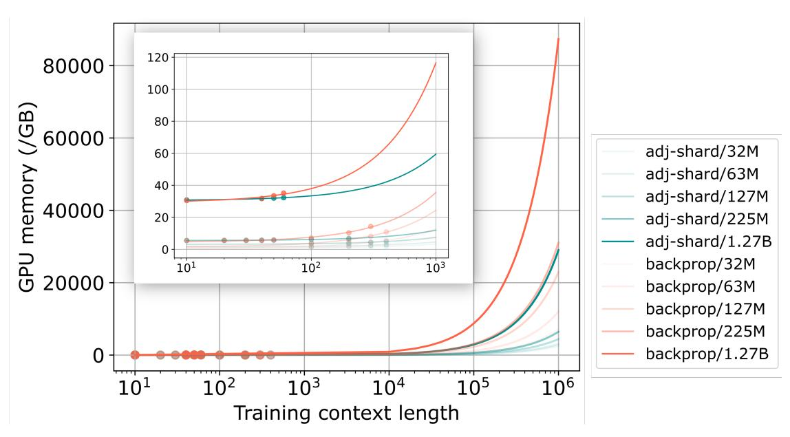
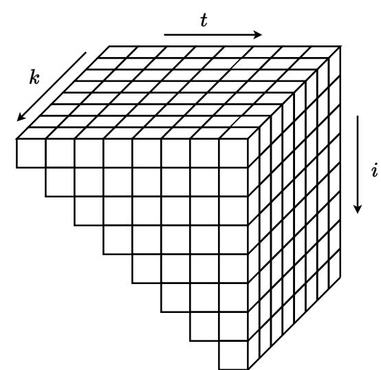
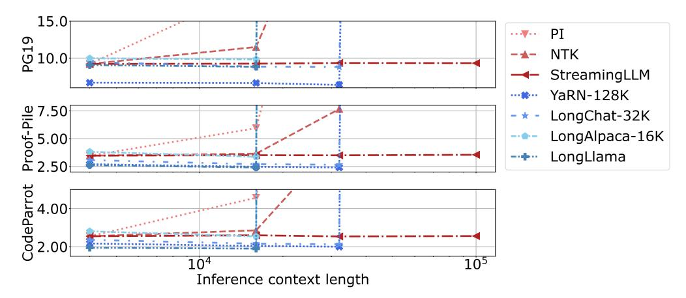
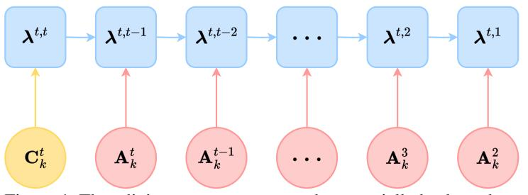
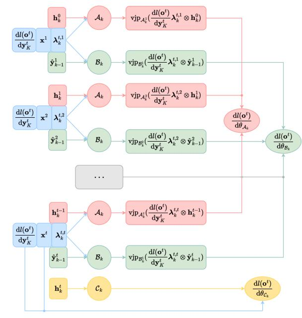

## ADJOINT SHARDING FOR VERY LONG CONTEXT TRAINING OF STATE SPACE MODELS

Xingzi Xu <sup>1</sup>,2<sup>∗</sup> Amir Tavanaei <sup>1</sup> Kavosh Asadi <sup>1</sup> Karim Bouyarmane <sup>1</sup>

<sup>1</sup> Amazon Seattle, WA 98109, USA {xingzixu,atavanae,kavasadi,bouykari}@amazon.com

<sup>2</sup> Duke University Durham, NC 27708, USA xingzi.xu@duke.edu

December 31, 2024

## ABSTRACT

Despite very fast progress, efficiently training large language models (LLMs) in very long contexts remains challenging. Existing methods fall back to training LLMs with short contexts (a maximum of a few thousands tokens in training) and use inference time techniques when evaluating on long contexts (above 1M tokens context window at inference). As opposed to long-context-inference, training on very long context input prompts is quickly limited by GPU memory availability and by the prohibitively long training times it requires on state-of-the-art hardware. Meanwhile, many real-life applications require not only inference but also training/fine-tuning with long context on specific tasks. Such applications include, for example, augmenting the context with various sources of raw reference information for fact extraction, fact summarization, or fact reconciliation tasks. We propose adjoint sharding, a novel technique that comprises sharding gradient calculation during training to reduce memory requirements by orders of magnitude, making training on very long context computationally tractable. Adjoint sharding is based on the adjoint method and computes equivalent gradients to backpropagation. We also propose truncated adjoint sharding to speed up the algorithm while maintaining performance. We provide a distributed version, and a paralleled version of adjoint sharding to further speed up training. Empirical results show the proposed adjoint sharding algorithm reduces memory usage by up to 3X with a 1.27B parameter large language model on 1M context length training. This allows to increase the maximum context length during training or fine-tuning of a 1.27B parameter model from 35K tokens to above 100K tokens on a training infrastructure composed of five AWS P4 instances. [3](#page-0-0)

## 1 Introduction

Foundation models are a new paradigm in artificial intelligence research focused on building large, general-purpose models that adapt to different tasks [\[44,](#page-12-0) [40,](#page-11-0) [7,](#page-10-0) [51\]](#page-12-1). Extensive training on large datasets equips foundation models with broad capabilities, which are then fine-tuned on smaller datasets for specific applications. Foundation models commonly employ the transformer architecture [\[60\]](#page-12-2). Despite the immense success, training transformer-based models requires memory growing quadratically with the context length L, limiting their applications on long context tasks [\[36\]](#page-11-1). Researchers developed various techniques to conquer this problem, ranging from inference time context window expansion [\[19,](#page-10-1) [18\]](#page-10-2), IO-aware algorithms [\[16,](#page-10-3) [13,](#page-10-4) [55\]](#page-12-3), and various linearly scaling language model architectures [\[23,](#page-11-2) [15,](#page-10-5) [49,](#page-12-4) [6\]](#page-10-6). On another note, distributed learning enables training large models with a big number of GPUs, and efficient

<sup>∗</sup>Work done during internship at Amazon.

<span id="page-0-0"></span><sup>3</sup>Additional material for this paper can be found at: <https://adjoint-sharding.github.io>.

> **[图片提取文字 (无描述)]:**
> 120 80000 100 80 60000 adj-shard/32M 60 GPU memory adj-shard/63M 40 adj-shard/127M 40000 adj-shard/225M 20 adj-shard/1.27B 0 backprop/32M 10<sup>1</sup> 10<sup>2</sup>  $10^{3}$ 20000 backprop/63M backprop/127M backprop/225M backprop/1.27B 0  $10^{2}$  $10^{3}$  $10^{5}$  $10^{6}$ 10<sup>4</sup>  $10^{1}$ Training context length


Figure 1: Compared to backpropagation (red lines), adjoint sharding (blue lines) significantly reduces memory requirements at training. Showing memory cost to train 32M, 63M, 127M, 225M, and 1.27B parameter State Space Model (SSM) with batch size 2 and Adam optimizer on one GPU.

training methods like activation checkpointing, model/gradient sharding, and mixed-precision computing have further reduced the memory requirement of training a large model [\[61,](#page-12-5) [69,](#page-13-0) [53,](#page-12-6) [41,](#page-11-3) [30\]](#page-11-4). However, current methodologies are entirely based on backpropagation and compute the gradient as a whole, inevitably requiring a memory growing rapidly with model size and context length [\[12\]](#page-10-7). Current sharding methods ignore the activations and only consider the model weights and optimizer states, constituting only a small fraction of the total memory cost [\[56\]](#page-12-7). Activation checkpointing is among the limited techniques that consider activation values. Activation checkpointing offloads necessary intermediate states to the CPU and recompute them on the fly, trading compute time for memory reduction [\[56,](#page-12-7) [52\]](#page-12-8). The substantial time required for offloading to the CPU hinders the effectiveness of activation checkpointing.

We propose adjoint sharding to dissemble gradient computation of residual and/or recurrent based models to achieve orders of magnitude lower memory usage during training.

Adjoint method The adjoint sharding method is based on the adjoint method for recurrent models [\[8,](#page-10-8) [32\]](#page-11-5). Given an optimization problem of a parametric recurrent forward process, the adjoint method is concerned with computations of the gradients regarding the process's parameters. Backpropagation saves intermediate states to calculate gradients, whereas the adjoint method relies on a backward adjoint process to compute gradients. The adjoint method is a constant-memory optimization technique for dynamical systems [\[9,](#page-10-9) [66\]](#page-13-1). In this paper, we are only concerned with the adjoint method for recurrent relations.

Vector-Jacobian product Adjoint sharding dissembles the gradient computation of a large language model (LLM) into independent vector-Jacobian product (VJP) computations. By left-multiplying the Jacobian with a vector, it becomes unnecessary to compute the expensive Jacobian. Modern VJPs are as fast as a forward function call of the model, and can be thousands of times faster than Jacobian computations [\[2\]](#page-10-10). We speed up adjoint sharding by employing the VJPs.

> **[图片提取文字 (无描述)]:**
> ki


Figure 2: Adjoint sharding dissembles large models' gradient computations along the sequence dimension t and the layer dimension k. When evaluating the gradient at time t, we perform t vector-Jacobian products along the adjoint dimension i for every layer indices k.

**Truncated adjoint sharding** Sharding the gradient computation allows us to prioritize the important gradients and disregard the rest, resulting in faster computation. We term this novel method truncated adjoint sharding, and empirically showcase its performance.

**Distributed and parallel computation** In addition, we have developed a distributed multi-GPU variant of adjoint sharding to further improve the scalability of LLM training. We also analyze the memory cost of parallel computation of adjoint sharding, opening up directions for massive speedups.

**State-space models and residual networks** Residual networks (ResNets) are a commonly applied neural network structure. We illustrate adjoint sharding assuming a ResNet structure [28]. State-space models (Mamba) have achieved performances on par with attention based models while possessing a linear scaling regarding the context length L, a polynomial speedup compared to the  $L^2$  scaling of transformers [60, 22].

#### 2 Related works

**Linear LLMs** [17, 5, 49] proposed LLM architectures with a linear inference time complexity. Each of them is formed by stacking K residual layers together, where each layer has a recurrent relation. However, their temporal relationships are nonlinear, which limits the application of adjoint sharding to dissemble the gradients into independent vector-Jacobian products.

**Backpropagation through time** Applying the adjoint method for recurrent models leads to backpropagation through time (BPTT) [64]. BPTT is a training algorithm developed for recurrent neural networks (RNNs). RNN models suffer from the exploding and vanishing gradient because of the  $\prod_{j=i+1}^t \partial \mathbf{f}(\mathbf{x}^j, \mathbf{h}^{j-1}, \mathbf{W_h})/\partial \mathbf{h}^{j-1}$  term [46]. SSMs provide remedies with careful parameterization of the recurrent dynamics inspired by classical SSM theory [21, 24, 25, 27, 45, 33]. Linear temporal relations allow efficient evaluations of the model, while preserving universal approximation capabilities [63]. By a similar token, truncated adjoint sharding can be seen as a more general version of the truncated backpropagation through time [31, 57].

**Neural ordinary differential equations** The adjoint method has also been applied to the optimization of continuous systems, especially the ordinary differential equations (ODEs) [9, 20]. Optimizing neural ODEs with autograd requires backpropagating through numerical solvers along every step, using an unrealistic amount of memory. The adjoint method does not backpropagate through the operations of the solver and uses a constant amount of memory. However, applying the adjoint method for continuous systems requires solving a costly ODE initial value problem with dimensionality of the number of parameters.

Low memory training methods Researchers proposed various low memory training techniques to train big models in long contexts. ZERO provides data- and model-parallel training while retaining low communication volume, while eliminating memory redundancies [53]. PyTorch FSDP provides a streamline for model, gradient, and data parallelization [69]. Activation checkpointing discards intermediate values during the forward step, and recompute on the fly during the training phase [56]. CPU offloading scales large model training by offloading data and computations to the CPU, trading computing time for memory reduction [54]. Ring attention leverages the blockwise computation of self-attention and feedforward to distribute long sequences across multiple devices while fully overlapping the communication of key-value blocks with the computation of blockwise attention, enabling very-long context training of attention-based methods [38, 39]. The proposed adjoint sharding distributes state-space model computations across multiple devices as well as multiple multi-GPU-instances (MIG) to enable very-long context training of state-space models.

Context length extension methods Existing context length extension method separate into two classes. The first type is fine-tuning free methods, including Positional Interpolation (PI) [10], the NTKAware Scale ROPE (NTK) [59], and StreamingLLM [65]. The second type is fine-tuning methods, including LongChat [35], LongAlpaca [11], YaRN [50], and LongLlama [11]. Additional methods such as activation beacon do tune a network separate from the LLM [68]. As shown in Figure 3, fine-tuning methods achieve better performances than that of fine-tuning free methods at lengths that they have been fine-tuned on. However, fine-tuning methods suffer from a high computational cost and require a potentially intractable amount of GPU memory during fine-tuning.

<span id="page-3-0"></span>> **[图片提取文字 (无描述)]:**
> 15.0 0.0 PG 10.0 NTK StreamingLLM YaRN-128K 9.50 -Jood 5.00 2.50 LongChat-32K LongAlpaca-16K LongLlama CodeParrot 00.2  $10^{5}$  $10^{4}$ Inference context length


Figure 3: Lines in red are fine-tuning free methods and lines in blue are fine-tuning methods. Fine-tuning methods achieve better performances than fine-tuning free method but often suffer from out of memory issues [10, 59, 65, 35, 11, 50, 68, 58]. Lower values are better across all three tasks.

### 3 Background

We first give a concise introduction to the state-space models, the residual networks, and the adjoint method.

#### 3.1 State-space models

While our method generally applies to all recurrent models, we illustrate the idea using state-space models (SSMs), which have shown performances at least on par with transformers at small to medium scale [14]. Given an input token sequence  $\{\mathbf{x}_t\}_{t=1}^T$ , the SSMs first calculate the corresponding matrices  $\mathbf{A}^t$ ,  $\mathbf{B}^t$ , and  $\mathbf{C}^t$  to evolve the dynamics as follows:

$$\mathbf{A}^t = \mathcal{A}(\mathbf{x}^t); \ \mathbf{B}^t = \mathcal{B}(\mathbf{x}^t); \ \mathbf{C}^t = \mathcal{C}(\mathbf{x}^t).$$

The SSMs evolve a latent dynamics  $\mathbf{h}^t$ , whose initial condition  $\mathbf{h}^0$  is often assumed to be zero. With  $\mathbf{h}^0$  and  $\mathbf{A}^t$ ,  $\mathbf{B}^t$  defined, the dynamics evolves as:

$$\mathbf{h}^t = \mathbf{A}^t \mathbf{h}^{t-1} + \mathbf{B}^t \mathbf{x}^t$$

The matrices  $\mathbf{C}^t$  then maps the latent dynamics  $\mathbf{h}^t$  back to token space as  $\mathbf{y}^t = \mathbf{C}^t \mathbf{h}^t$ , with  $\mathbf{y}^t$  being the predicted token at t. For a sequence of T tokens, we denote:

$$\mathbf{A} = (\mathbf{A}^1, \mathbf{A}^2, \dots, \mathbf{A}^T), \ \mathbf{B} = (\mathbf{B}^1, \mathbf{B}^2, \dots, \mathbf{B}^T), \ \mathbf{C} = (\mathbf{C}^1, \mathbf{C}^2, \dots, \mathbf{C}^T),$$
$$\mathbf{H} = (\mathbf{h}^1, \mathbf{h}^2, \dots, \mathbf{h}^T), \ \mathbf{X} = (\mathbf{x}^1, \mathbf{x}^2, \dots, \mathbf{x}^T), \ \mathbf{Y} = (\mathbf{y}^1, \mathbf{y}^2, \dots, \mathbf{y}^T).$$

In the most general case, we have  $\mathbf{H} \in \mathbb{R}^{T \times N}, \mathbf{A} \in \mathbb{R}^{T \times N \times N}, \mathbf{B} \in \mathbb{R}^{T \times N \times P}, \mathbf{C} \in \mathbb{R}^{T \times P \times N}, \mathbf{X} \in \mathbb{R}^{T \times P}, \mathbf{Y} \in \mathbb{R}^{T \times P}$ , where N is the hidden state dimension, and P is the input/output dimension. We evolve the dynamics for  $t = 1, \dots, T$ , and assume that  $\mathbf{h}^0$  is a fixed and predefined constant.

The input to an SSM is **X** and  $\mathbf{h}^0$ , and the output is **Y**. We define SSM(·) as performing the following five steps:

- 1.  $\{\mathbf{A}^t\}_{t=1}^T = \{\mathcal{A}(\mathbf{x}^t)\}_{t=1}^T$ ,
- 2.  $\{\mathbf{B}^t\}_{t=1}^T = \{\mathbf{\mathcal{B}}(\mathbf{x}^t)\}_{t=1}^T$ ,
- 3.  $\{\mathbf{C}^t\}_{t=1}^T = \{\mathcal{C}(\mathbf{x}^t)\}_{t=1}^T$ ,
- 4.  $\{\mathbf{h}^t\}_{t=1}^T = \{\mathbf{A}^t \mathbf{h}^{t-1} + \mathbf{B}^t \mathbf{x}^t\}_{t=1}^T;$
- 5.  $\{\mathbf{y}^t\}_{t=1}^T = \{\mathbf{C}^t \mathbf{h}^t\}_{t=1}^T$ .

The input to the five steps is X, and the output is Y. We can then write SSM(X) = Y. SSMs decrease the quadratic computational complexity with sequence length on transformers to linear and decrease the large inference-time memory requirements from the key-value cache. SSM-based models at a small to medium scale have shown performances on par with or better than transformer-based models. For instance, [51, 1] shows that SSM-based mixture-of-experts

(MOE) model outperforms baseline transformer-based MOE model on model sizes as big as 2400M parameters. [62] performed an extensive empirical study and found that while SSMs outperform transformers on various tasks, they underperform on tasks which require strong copying, in-context learning, or long-context reasoning abilities. [62] also experimented with a SSM-transformer hybrid model, which outperforms transformers and is up to eight times faster when generating tokens at inference time. [37] trained a 52B parameter model and further affirmed the hybrid models performances.

#### <span id="page-4-1"></span>3.2 Residual Networks

In practice, we have K SSMs stacked together, and we have a large language head (LLH)  $\Omega \in \mathbb{R}^{\mathbb{T} \times P}$ , where  $\mathbb{T}$  is the number of all possible tokens. To predict a token, we have  $\mathbf{o}^t = \Omega \hat{\mathbf{y}}_K^t$ . Define  $(\mathbf{y}_K^1, \dots, \mathbf{y}_K^T) = \mathbf{Y}_K$ , a ResNet computes  $\mathbf{Y}_K$  as follows:

$$(\mathbf{y}_{K}^{1}, \dots, \mathbf{y}_{K}^{T}) = \mathbf{Y}_{K-1} + \mathrm{SSM}_{K}(\hat{\mathbf{Y}}_{K-1})$$

$$= \mathbf{Y}_{0} + \mathrm{SSM}_{1}(\hat{\mathbf{Y}}_{0}) + \dots + \mathrm{SSM}_{K}(\hat{\mathbf{Y}}_{K-1})$$

$$= \mathbf{Y}_{0} + \sum_{k=1}^{K} \mathrm{SSM}_{k}(\hat{\mathbf{Y}}_{k-1}) = \mathbf{Y}_{0} + \sum_{k=1}^{K} \tilde{\mathbf{Y}}_{k},$$

where  $\hat{\mathbf{Y}}_k = (\hat{\mathbf{y}}_k^1, \dots, \hat{\mathbf{y}}_k^T) = (\operatorname{Norm}(\mathbf{y}_k^1), \dots, \operatorname{Norm}(\mathbf{y}_k^T))$  and  $\operatorname{SSM}_k(\hat{\mathbf{Y}}_{k-1}) = \tilde{\mathbf{Y}}_k$ . Therefore, for a latent state at time t we have  $\mathbf{y}_K^t = \mathbf{y}_0^t + \sum_{k=1}^K \tilde{\mathbf{y}}_k^t$ .

ResNet has been the foundation of numerous modern networks, including the transformers, diffusion models, segmentation models, SSMs, and more [29, 26, 34, 48]. ResNet's residual structure allows for a separation between gradients of each layer by applying differentiation on summations.

#### 3.3 Adjoint method

The adjoint method is concerned with optimizing  $\mathbf{y}(\mathbf{h}(\boldsymbol{\theta}), \boldsymbol{\theta})$  with respect to  $\boldsymbol{\theta}$ , where  $\mathbf{h}(\boldsymbol{\theta}) \in \mathbb{R}^P$  is the solution to  $\mathbf{f}(\mathbf{h}(\boldsymbol{\theta}), \boldsymbol{\theta}) = 0$  [8]. To employ gradient based algorithms like the stochastic gradient descent (SGD) or the Adam, we compute the derivative of  $\mathbf{y}$  regarding  $\boldsymbol{\theta} \in \mathbb{R}^{|\boldsymbol{\theta}|}$ :

$$\frac{\mathrm{d}\mathbf{y}}{\mathrm{d}\boldsymbol{\theta}} = \frac{\partial\mathbf{y}}{\partial\boldsymbol{\theta}} + \frac{\partial\mathbf{y}}{\partial\mathbf{h}}\frac{\partial\mathbf{h}}{\partial\boldsymbol{\theta}},\tag{1}$$

with d being the total derivative, and  $\partial$  being the partial derivative. The adjoint method converts computing  $d\mathbf{y}/d\boldsymbol{\theta}$  to solving an adjoint equation. In our case, we need the adjoint method for recurrence relations, where  $\mathbf{y}$  is given by  $\mathbf{y} = \mathbf{y}^t \equiv \mathbf{y}(\mathbf{h}^t(\boldsymbol{\theta}), \boldsymbol{\theta})$ , and  $\mathbf{h}$  is given by

<span id="page-4-0"></span>
$$\begin{cases} \mathbf{h}^0 &= \mathbf{b}(\boldsymbol{\theta}), \\ \mathbf{h}^t &= \mathbf{f}(t, \mathbf{h}^{t-1}, \boldsymbol{\theta}). \end{cases}$$
 (2)

We have

$$\frac{\mathrm{d}\mathbf{f}(t,\mathbf{h}^{t-1},\boldsymbol{\theta})}{\mathrm{d}\boldsymbol{\theta}} = \frac{\partial\mathbf{f}(t,\mathbf{h}^{t-1},\boldsymbol{\theta})}{\partial\boldsymbol{\theta}} + \frac{\partial\mathbf{f}(t,\mathbf{h}^{t-1},\boldsymbol{\theta})}{\partial\mathbf{h}^{t-1}} \frac{\partial\mathbf{h}^{t-1}}{\partial\boldsymbol{\theta}}.$$
 (3)

<span id="page-4-2"></span>**Proposition 1** [8] When the states  $\mathbf{h}$  are defined as Equation 2, the gradient of  $\mathbf{y}$  with respect to  $\boldsymbol{\theta}$  is given as:

$$\begin{cases}
d\mathbf{y}^{t}/d\boldsymbol{\theta} &= \partial \mathbf{y}^{t}/\partial \boldsymbol{\theta} + \boldsymbol{\lambda}^{0} \mathbf{b}(\boldsymbol{\theta}) + \sum_{i=1}^{t} \boldsymbol{\lambda}^{i} \left( \partial \mathbf{f}(i, \mathbf{h}^{i-1}, \boldsymbol{\theta}) / \partial \boldsymbol{\theta} \right), \\
\boldsymbol{\lambda}^{t} &= \partial \mathbf{y}^{t}/\partial \mathbf{h}^{t}, \\
\boldsymbol{\lambda}^{i-1} &= \boldsymbol{\lambda}^{i} \left( \partial \mathbf{f}(i, \mathbf{h}^{i-1}, \boldsymbol{\theta}) / \partial \mathbf{h}^{i-1} \right).
\end{cases} \tag{4}$$

Equivalently, we have  $\lambda^i = (\partial \mathbf{y}^t / \partial \mathbf{h}^t) \left( \prod_{j=t}^{i+1} \left( \partial \mathbf{f}(j, \mathbf{h}^{j-1}, \boldsymbol{\theta}) / \partial \mathbf{h}^{j-1} \right) \right)$  [32].

After computing adjoint states  $\{\lambda^i\}_{i=0}^t$ , the computation of the elements of  $\lambda^i(\partial \mathbf{f}(i,\mathbf{h}^{i-1},\boldsymbol{\theta})/\partial\boldsymbol{\theta})$  are independent, allowing parallelism. This computation is a vector-Jacobian product (vjp), with  $\lambda^i$  as the vector and  $\partial \mathbf{f}(i,\mathbf{h}^{i-1},\boldsymbol{\theta})/\partial\boldsymbol{\theta}$  as the Jacobian. vjps can be evaluated with the reverse-mode automatic differentiation and initializing the reverse phase with  $\lambda^i$  [3]. As each vjp only requires saving their corresponding computation graph, and can be disposed

after the computation, we can compute vjps in parallel on modern GPUs. We will discuss this in more details in subsection 4.5. Adjoint sharding aims to use the adjoint method to replace backpropagation, which solves:

$$\begin{split} \frac{\mathrm{d}\mathbf{y}^{t}}{\mathrm{d}\boldsymbol{\theta}} &= \frac{\partial\mathbf{y}^{t}}{\partial\boldsymbol{\theta}} + \frac{\partial\mathbf{y}^{t}}{\partial\mathbf{h}^{t}} \bigg( \frac{\partial\mathbf{f}(t, \mathbf{h}^{t-1}, \boldsymbol{\theta})}{\partial\boldsymbol{\theta}} + \frac{\partial\mathbf{f}(t, \mathbf{h}^{t-1}, \boldsymbol{\theta})}{\partial\boldsymbol{h}^{t-1}} \\ & \bigg[ \frac{\partial\mathbf{f}(t-1, \mathbf{h}^{t-2}, \boldsymbol{\theta})}{\partial\boldsymbol{\theta}} + \frac{\partial\mathbf{f}(t-1, \mathbf{h}^{t-2}, \boldsymbol{\theta})}{\partial\boldsymbol{h}^{t-2}} \bigg\{ \frac{\partial\mathbf{f}(t-2, \mathbf{h}^{t-3}, \boldsymbol{\theta})}{\partial\boldsymbol{\theta}} + \dots \bigg\} \bigg] \bigg). \end{split}$$

The backpropagation requires a sequential accumulation of the gradients, computing from the outmost layer inwards, therefore needs to save the computation graph for computations at all time t's and creates memory bottlenecks.

### 4 Adjoint sharding

We now introduce the adjoint sharding technique. We first illustrate the method assuming only one layer of SSM, and generalize to K layers.

#### <span id="page-5-1"></span>4.1 Adjoint sharding for one SSM

Large scale neural networks are usually trained with the autograd framework [4, 47]. However, this framework suffers from a high memory cost when used with networks of recurrent nature [4]. Although activation checkpointing has been developed, which discards part of the intermediate values and recomputes them later on the fly, the memory cost is still high [30]. We employ the adjoint method for recurrence relations to further reduce the memory cost, and more importantly, to break the temporal dependencies of activations and parallelize their computations.

Define  $\theta = \langle \theta_{\mathcal{A}}, \theta_{\mathcal{B}}, \theta_{\mathcal{C}} \rangle$  as  $\mathcal{A}$ 's,  $\mathcal{B}$ 's, and  $\mathcal{C}$ 's parameters, for loss  $l^t = l(\mathbf{y}^t)$ , in the context of a single-layer SSM, we prove:

<span id="page-5-0"></span>**Proposition 2** The gradient  $dl^t/d\theta$  is given as

$$\frac{\mathrm{d}l^t}{\mathrm{d}\boldsymbol{\theta}} = \left[\sum_{i=1}^t \mathrm{vjp}_{\boldsymbol{\mathcal{A}}^i} (\frac{\mathrm{d}l^t}{\mathrm{d}\mathbf{y}^t} \boldsymbol{\lambda}^{t,i} \otimes \mathbf{h}^{i-1})\right] \oplus \left[\sum_{i=1}^t \mathrm{vjp}_{\boldsymbol{\mathcal{B}}^i} (\frac{\mathrm{d}l^t}{\mathrm{d}\mathbf{y}^t} \boldsymbol{\lambda}^{t,i} \otimes \hat{\mathbf{x}}^i)\right] \oplus \mathrm{vjp}_{\boldsymbol{\mathcal{C}}^t} (\frac{\mathrm{d}l^t}{\mathrm{d}\mathbf{y}^t} \otimes \mathbf{h}^t), \tag{5}$$

where the adjoint state  $\lambda^{t,\tau} = \mathbf{C}^t(\prod_{i=1}^{t-\tau} \mathbf{A}^{t+1-i})$ ,  $\operatorname{vjp}_{\operatorname{Net}^i}(v) = v \cdot \operatorname{Net}_{\boldsymbol{\theta}}(\operatorname{Input}^i)$ , with  $\boldsymbol{\theta}$  being  $\operatorname{Net}$ 's parameters and i being the index of  $\operatorname{Input}$ ,  $\otimes$  is the vector outer product, and  $\oplus$  is vector concatenation.

<span id="page-5-2"></span>The proof of proposition 2 is in section A.1. The gradient for parameters of  $\mathcal{A}$ , and  $\mathcal{B}$  are each separated into  $\{\operatorname{vjp}_{\mathcal{A}^i}(\frac{\mathrm{d}^{l^t}}{\mathrm{d}\mathbf{y}^t}\boldsymbol{\lambda}^{t,i}\otimes\mathbf{h}^{i-1})\}_{i=1}^t,\{\operatorname{vjp}_{\mathcal{B}^i}(\frac{\mathrm{d}^{l^t}}{\mathrm{d}\mathbf{y}^t}\boldsymbol{\lambda}^{t,i}\otimes\hat{\mathbf{x}}^i)_{i=1}^t,\text{ and the gradient for parameters of }\mathcal{C}\text{ only depend on inputs at time }t.$  After computing the adjoint states, these vjp computations are separate from each other on both the network and the temporal level.

> **[图片提取文字 (无描述)]:**
> $\boldsymbol{\lambda}^{t,t-2}$  $\boldsymbol{\lambda}^{t,t}$  $\boldsymbol{\lambda}^{t,t-1}$  $\boldsymbol{\lambda}^{t,2}$  $\boldsymbol{\lambda}^{t,1}$  $\mathbf{A}_k^{t-1}$  $\mathbf{C}_k^t$  $\mathbf{A}_k^3$  $\mathbf{A}_k^t$


Figure 4: The adjoint states are computed sequentially backwards.

### 4.2 Adjoint sharding for multiple SSMs

We now generalize the results from subsection 4.1 to the general case of K SSMs concatenated together. As introduced in subsection 3.2, the outputs of each SSM layer are added to the results of the last layer and normalized before it is fed into the next layer. Define the loss over all token predictions  $L = \sum_{t=1}^{T} l^t$ , using the residual structure we have

$$\frac{\mathrm{d}L}{\mathrm{d}\boldsymbol{\theta}} = \sum_{t=1}^T \frac{\mathrm{d}l^t}{\mathrm{d}\mathbf{y}_K^t} \frac{\mathrm{d}\mathbf{y}_K^t}{\mathrm{d}\boldsymbol{\theta}} = \sum_{t=1}^T \frac{\mathrm{d}l^t}{\mathrm{d}\mathbf{y}_K^t} \frac{\mathrm{d}(\mathbf{y}_0^t + \sum_{k=1}^K \tilde{\mathbf{y}}_k^t)}{\mathrm{d}\boldsymbol{\theta}} = \sum_{t=1}^T \frac{\mathrm{d}l^t}{\mathrm{d}\mathbf{y}_K^t} \sum_{k=1}^K \frac{\mathrm{d}\tilde{\mathbf{y}}_k^t}{\mathrm{d}\boldsymbol{\theta}}.$$

Combining with proposition 2, we have

<span id="page-6-0"></span>**Proposition 3** The gradient of the total loss L with respect to the SSM parameters  $\theta$  is given as

$$\frac{\mathrm{d}L}{\mathrm{d}\boldsymbol{\theta}} = \left(\sum_{t=1}^{T} \sum_{k=1}^{K} \sum_{i=1}^{t} \mathrm{vjp}_{\boldsymbol{\mathcal{A}}_{k}^{i}} \left(\frac{\mathrm{d}l^{t}}{\mathrm{d}\mathbf{y}_{K}^{t}} \boldsymbol{\lambda}_{k}^{t,i} \otimes \mathbf{h}_{k}^{i-1}\right)\right)$$

$$\oplus \left(\sum_{t=1}^{T} \sum_{k=1}^{K} \sum_{i=1}^{t} \mathrm{vjp}_{\boldsymbol{\mathcal{B}}_{k}^{i}} \left(\frac{\mathrm{d}l^{t}}{\mathrm{d}\mathbf{y}_{K}^{t}} \boldsymbol{\lambda}_{k}^{t,i} \otimes \hat{\mathbf{y}}_{k-1}^{i}\right)\right)$$

$$\oplus \left(\sum_{t=1}^{T} \sum_{k=1}^{K} \mathrm{vjp}_{\boldsymbol{\mathcal{C}}_{k}^{t}} \left(\frac{\mathrm{d}l^{t}}{\mathrm{d}\mathbf{y}_{K}^{t}} \otimes \mathbf{h}_{k}^{t}\right)\right),$$
(6)

where the input to  $\operatorname{vjp}_{\mathcal{C}_k^t}(\frac{\mathrm{d}^{l^t}}{\mathrm{d}\mathbf{y}_K^t}\otimes\mathbf{h}_k^t)$ ,  $\operatorname{vjp}_{\mathcal{A}_k^i}(\frac{\mathrm{d}^{l^t}}{\mathrm{d}\mathbf{y}_K^t}\boldsymbol{\lambda}_k^{t,i}\otimes\mathbf{h}_k^{i-1})$ , and  $\operatorname{vjp}_{\mathcal{B}_k^i}(\frac{\mathrm{d}^{l^t}}{\mathrm{d}\mathbf{y}_K^t}\boldsymbol{\lambda}_k^{t,i}\otimes\hat{\mathbf{y}}_{k-1}^i)$  are computed with the k-th SSM and the  $\hat{\mathbf{y}}_{k-1}^i=\operatorname{Norm}(\mathbf{y}_{k-2}^i+\operatorname{SSM}_{k-1}(\hat{\mathbf{Y}}_{k-2})^i)$  (the normalized output sequence of the (k-1)-th SSM). The adjoint state at layer k is defined as  $\boldsymbol{\lambda}_k^{t,\tau}=\mathbf{C}_k^t(\prod_{i=1}^{t-\tau}\mathbf{A}_{i}^{t+1-i})$ .

We provide the proof to proposition 3 in section A.2. Define  $\Lambda_k^t = \{\lambda_k^{t,\tau}\}_{\tau=1}^t$ , proposition 3 shows that the gradients of each network's parameters computed with each token only correlate through the adjoint states  $\{\Lambda_k^t\}_{k,t=1,1}^{K,T}$ . The adjoint states can be easily computed after a forward pass. The adjoint states can also be computed on the fly in the gradient computation phase, as it only depends on  $\mathbf{C}_k^t$  and  $\mathbf{A}_k^t$  and has no dependencies on the network Jacobians regarding the network parameters. The adjoint sharding method breaks down the backpropagation computation both layer-wise and token-wise into foundational vjp computations that do not have any dependencies on each other.

We show a schematic of the computations to  $\mathrm{d}l^t/\mathrm{d}\boldsymbol{\theta}_{\boldsymbol{\mathcal{A}}_k}$ ,  $\mathrm{d}l^t/\mathrm{d}\boldsymbol{\theta}_{\boldsymbol{\mathcal{B}}_k}$ , and  $\mathrm{d}l^t/\mathrm{d}\boldsymbol{\theta}_{\boldsymbol{\mathcal{C}}_k}$  in Figure 5 and a schematic for computing the adjoint states in Figure 4.

#### 4.3 Truncated adjoint sharding

One limitation of adjoint sharding is that the number of vjps performed increases polynomially regarding the number of tokens T. In particular, adjoint sharding computes the vjp for  $\mathcal{A}_k$  and  $\mathcal{B}_k$  (1+T)T/2 times, and for

<span id="page-6-1"></span>> **[图片提取文字 (无描述)]:**
> $\mathrm{vjp}_{\mathcal{A}_k^1}(\frac{\mathrm{d}l(\mathbf{o}^t)}{\mathrm{d}\mathbf{y}_{_{K}^t}^t}\boldsymbol{\lambda}_k^{t,1}\otimes\mathbf{h}_k^0)$  $\mathbf{h}_{k}^{0}$  $A_k$  $\frac{\mathrm{d}l(\mathbf{o}^t)}{\mathrm{d}\mathbf{y}_K^t} \mathbf{x}^1 \mathbf{\lambda}_k^{t,1}$  $\mathrm{vjp}_{\mathcal{B}_k^1}(\frac{\mathrm{d}l(\mathbf{o}^t)}{\mathrm{d}\mathbf{v}_w^t}\boldsymbol{\lambda}_k^{t,1}\otimes\hat{\mathbf{y}}_{k-1}^1)$  $\hat{\mathbf{y}}_{k-1}^1$  $\mathcal{B}_k$  $\mathrm{vjp}_{\mathcal{A}_k^2}(\frac{\mathrm{d}l(\mathbf{o}^t)}{\mathrm{d}\mathbf{v}_{\scriptscriptstyle K}^t}\boldsymbol{\lambda}_k^{t,2}\otimes\mathbf{h}_k^1)$  $\mathbf{h}_k^1$  $A_k$  $\frac{\mathrm{d}l(\mathbf{o}^t)}{\mathrm{d}\mathbf{y}_K^t}$   $\mathbf{x}^2$   $\lambda_k^{t,2}$  $\mathrm{vjp}_{\mathcal{B}_{k}^{2}}(\frac{\mathrm{d}l(\mathbf{o}^{t})}{\mathrm{d}\mathbf{v}_{k}^{t}}\boldsymbol{\lambda}_{k}^{t,2}\otimes\hat{\mathbf{y}}_{k-1}^{2})$  $\frac{\mathrm{d}l(\mathbf{o}^t)}{\mathrm{d}\theta_{\mathcal{B}_k}}$  $\hat{\mathbf{y}}_{k-1}^2$  $\mathcal{B}_k$  $\operatorname{vjp}_{\mathcal{A}_{k}^{t}}(\frac{\operatorname{d}l(\mathbf{o}^{t})}{\operatorname{d}\mathbf{v}_{-\epsilon}^{t}}\boldsymbol{\lambda}_{k}^{t,t}\otimes\mathbf{h}_{k}^{t-1})$  $\mathbf{h}_k^{t-1}$  $A_k$  $\frac{\mathrm{d}l(\mathbf{o}^t)}{\mathrm{d}\mathbf{y}_K^t}$   $\mathbf{x}^t$  $\lambda_k^{t,t}$  $\mathrm{vjp}_{\mathcal{B}_k^1}(\frac{\mathrm{d}l(\mathbf{o}^t)}{\mathrm{d}\mathbf{v}^t}\boldsymbol{\lambda}_k^{t,t}\otimes\hat{\mathbf{y}}_{k-1}^t)$  $\hat{\mathbf{y}}_{k-1}^t$  $\mathcal{B}_k$  $\mathbf{h}_k^t$  $C_k$


Figure 5: Computation schematic of  $dl^t/d\theta_{A_k}$ ,  $dl^t/d\theta_{B_k}$ , and  $dl^t/d\theta_{C_k}$ .

 $C_k$  T times. When training large networks with many layers and long context length T, applying adjoint sharding becomes computationally expensive. We propose truncated adjoint sharding, with which we argue that we can get similar results by computing a linearly growing number of vjps, and empirically showcase its performance.

Attention mechanisms have suffered from the  $\mathcal{O}(T^2)$  complexities arising from the self-attention structure [60]. To enable training with longer context lengths, global-local attention has been proposed, where we divide the contexts into sections, and compute the attention between sections rather than tokens [67]. [57] proposed truncated backpropagation through time (T-BPTT) to avoid gradient explosion/vanishing when training with long contexts by only counting a fixed number of state transitions. Here, inspired by global-local attention and T-BPTT, instead of computing the full gradient given in Equation 11, we propose to train the SSMs to depend on up to  $\bar{T}$  states:

<span id="page-6-2"></span>
$$\frac{\mathrm{d}L}{\mathrm{d}\boldsymbol{\theta}} = \left(\sum_{t=1}^{T} \sum_{k=1}^{K} \mathrm{vjp}_{\boldsymbol{\mathcal{C}}_{k}^{t}} \left(\frac{\mathrm{d}l^{t}}{\mathrm{d}\mathbf{y}_{K}^{t}} \otimes \mathbf{h}_{k}^{t}\right)\right)$$

$$\oplus \left(\sum_{t=1}^{\bar{T}} \sum_{k=1}^{K} \sum_{i=1}^{t} \mathrm{vjp}_{\boldsymbol{\mathcal{A}}_{k}^{i}} \left(\frac{\mathrm{d}l^{t}}{\mathrm{d}\mathbf{y}_{K}^{t}} \boldsymbol{\lambda}_{k}^{t,i} \otimes \mathbf{h}_{k}^{i-1}\right) + \sum_{t=\bar{T}+1}^{T} \sum_{k=1}^{K} \sum_{i=t+1-\bar{T}}^{t} \mathrm{vjp}_{\boldsymbol{\mathcal{A}}_{k}^{i}} \left(\frac{\mathrm{d}l^{t}}{\mathrm{d}\mathbf{y}_{K}^{t}} \boldsymbol{\lambda}_{k}^{t,i} \otimes \mathbf{h}_{k}^{i-1}\right)\right)$$

$$\oplus \left(\sum_{t=1}^{\bar{T}} \sum_{k=1}^{K} \sum_{i=1}^{t} \mathrm{vjp}_{\boldsymbol{\mathcal{B}}_{k}^{i}} \left(\frac{\mathrm{d}l^{t}}{\mathrm{d}\mathbf{y}_{K}^{t}} \boldsymbol{\lambda}_{k}^{t,i} \otimes \hat{\mathbf{y}}_{k-1}^{i}\right) + \sum_{t=\bar{T}+1}^{T} \sum_{k=1}^{K} \sum_{i=t+1-\bar{T}}^{t} \mathrm{vjp}_{\boldsymbol{\mathcal{B}}_{k}^{i}} \left(\frac{\mathrm{d}l^{t}}{\mathrm{d}\mathbf{y}_{K}^{t}} \boldsymbol{\lambda}_{k}^{t,i} \otimes \hat{\mathbf{y}}_{k-1}^{i}\right)\right)$$

$$(7)$$

As shown in Equation 7 above, we perform the same computations for  $t=1,\ldots,\bar{T}$  as before, and only perform the vjps back to the last  $\bar{T}$  states for  $t>\bar{T}$ . With truncated adjoint sharding, we perform  $\bar{T}T+\bar{T}(\bar{T}-1)/2$  vjps, which grows linearly. We show the number of vjps performed with and without truncated adjoint sharding in Figure 6. When  $\bar{T}=2000$ , truncated adjoint sharding reduces 64% of the vjps when training with a context length of  $10\mathrm{K}$ .

The essence of the truncated adjoint sharding method is that we only explicitly count gradients related to the last  $\bar{T}$  states. As each state depends on its prior state, states still implicitly depend on all their prior states. We leave investigation of  $\bar{T}$ 's impact on performances for future works.

#### 4.4 Distributed training

We now discuss how to distribute the storage and compute of the adjoint sharding method, assuming that we have  $\Upsilon$  GPUs. Given the networks  $\{A_k, \mathcal{B}_k, \mathcal{C}_k\}_{k=1}^K$ , initial tokens  $\{\hat{\mathbf{y}}_0^t\}_{t=1}^T = \{\text{Norm}(\mathbf{x}^t)\}_{t=1}^T$ , and initial conditions  $\{\mathbf{h}_k^0\}_{k=1}^K$  (usually set to 0), we can call algorithm 1 to get all necessary vectors for computing the gradient with adjoint sharding.

#### <span id="page-7-0"></span>**Algorithm 1** Forward step in evaluation mode on a distributed system

```
1: Inputs: \{\hat{y}_0^t\}_{t=1}^T, \{\mathbf{h}_k^0\}_{k=1}^K, \{A_k, \mathcal{B}_k, \mathcal{C}_k\}_{k=1}^K, \Omega

2: On devices v = 1, \dots, \Upsilon, in parallel do

3: for SSM model index k = (v-1)(K//\Upsilon) + 1, \dots, v(K//\Upsilon) do

4: for Time step index t = 1, \dots, T do

5: Compute: \mathbf{A}_k^t = A_k(\hat{\mathbf{y}}_{k-1}^t); \mathbf{B}_k^t = \mathcal{B}_k(\hat{\mathbf{y}}_{k-1}^t); \mathbf{C}_k^t = \mathcal{C}_k(\hat{\mathbf{y}}_{k-1}^t); \mathbf{h}_k^t = \mathbf{A}_k^t \mathbf{h}_k^{t-1} + \mathbf{B}_k^t \hat{\mathbf{y}}_{k-1}^t; \mathbf{y}_k^t = \mathbf{C}_k^t \mathbf{h}_k^t.

6: Compute: \mathbf{y}_k^t = \mathbf{y}_{k-1}^t + \tilde{\mathbf{y}}_k^t.

7: Compute: \hat{\mathbf{y}}_k^t = \operatorname{Norm}(\mathbf{y}_k^t).

8: end for

9: end for

10: Store: \{\mathbf{h}_k^t\}_{(t,k)=(1,(v-1)(K//\Upsilon)+1)}^{T,v(K//\Upsilon)}, \{\mathbf{C}_k^t\}_{(t,k)=(1,(v-1)(K//\Upsilon)+1)}^{T,v(K//\Upsilon)}, \{\hat{\mathbf{y}}_k^t\}_{(t,k)=(1,(v-1)(K//\Upsilon)+1)}^{T,v(K//\Upsilon)-1}, \{\hat{\mathbf{y}}_k^t\}_{(t,k)=(1,(v-1)(K//\Upsilon))}^{T,v(K//\Upsilon)-1}, \{\hat{\mathbf{y}}_k^t\}_{(t,k)=(1,(v-1)(K//\Upsilon))}^{T,v(K//\Upsilon)-1}\}_{t=1}^{T}, \{\hat{\mathbf{y}}_v^t\}_{(t,k)=(1,(v-1)(K//\Upsilon))}^{T,v(K//\Upsilon)-1}\}_{t=1}^{T}, \{\hat{\mathbf{y}}_v^t\}_{(t,k)=(1,(v-1)(K//\Upsilon))}^{T,v(K//\Upsilon)-1}\}_{t=1}^{T}, \{\hat{\mathbf{y}}_v^t\}_{(t,k)=(1,(v-1)(K//\Upsilon))}^{T,v(K//\Upsilon)-1}\}_{t=1}^{T}, \{\hat{\mathbf{y}}_v^t\}_{(t,k)=(1,(v-1)(K//\Upsilon))}^{T,v(K//\Upsilon)-1}\}_{t=1}^{T}, \{\hat{\mathbf{y}}_v^t\}_{(t,k)=(1,(v-1)(K//\Upsilon))}^{T,v(K//\Upsilon)-1}\}_{t=1}^{T}, \{\hat{\mathbf{y}}_v^t\}_{(t,k)=(1,(v-1)(K//\Upsilon))}^{T,v(K//\Upsilon)-1}\}_{t=1}^{T}, \{\hat{\mathbf{y}}_v^t\}_{(t,k)=(1,(v-1)(K//\Upsilon))}^{T,v(K//\Upsilon)-1}\}_{t=1}^{T}, \{\hat{\mathbf{y}}_v^t\}_{(t,k)=(1,(v-1)(K//\Upsilon))}^{T,v(K//\Upsilon)-1}\}_{t=1}^{T}, \{\hat{\mathbf{y}}_v^t\}_{(t,k)=(1,(v-1)(K/(\Upsilon))}^{T,v(K/(\Upsilon))}\}_{t=1}^{T,v(K/(\Upsilon))}, \{\hat{\mathbf{y}}_v^t\}_{(t,k)=(1,(v-1)(K/(\Upsilon)))}^{T,v(K/(\Upsilon))}\}_{t=1}^{T,v(K/(\Upsilon))}, \{\hat{\mathbf{y}}_v^t\}_{(t,k)=(1,(v-1)(K/(\Upsilon))}^{T,v(K/(\Upsilon))}\}_{t=1}^{T,v(K/(\Upsilon))}, \{\hat{\mathbf{y}}_v^t\}_{(t,k)=(1,(v-1)(K/(\Upsilon))}^{T,v(K/(\Upsilon))}\}_{t=1}^{T,v(K/(\Upsilon))}, \{\hat{\mathbf{y}}_v^t\}_{(t,k)=(1,(v-1)(K/(\Upsilon))}^{T,v(K/(\Upsilon))}\}_{t=1}^{T,v(K/(\Upsilon))}, \{\hat{\mathbf{y}}_v^t\}_{(t,k)=(1,(v-1)(K/(\Upsilon))}^{T,v(K/(\Upsilon))}\}_{t=1}^{T,v(K/(\Upsilon))}, \{\hat{\mathbf{y}}_v^t\}_{(t,k)=(1,(v-1)(K/(\Upsilon))}^{T,v(K/(\Upsilon))}\}_{t=1}^{T,v(K/(\Upsilon))}, \{\hat{\mathbf{y}}_v^t\}_{(t,k)=(1,(v-1)(K/(\Upsilon))}^{T,v(K/(\Upsilon))}\}_{t=1}^{T,v(K/(\Upsilon))}, \{\hat{\mathbf{y}}_v^t\}_{(t,k)=(1,(v-1)(K/(\Upsilon))}^{T,v(K/(\Upsilon))}\}
```

## <span id="page-7-1"></span>**Algorithm 2** Evaluating adjoint states for token index t and ResNet index k with truncated adjoint sharding $\bar{T}$

```
1: Inputs: t, k, \bar{T}, \mathbf{C}_k^t, \{\mathbf{A}_k^i\}_{i=t+2-\bar{T}}^t
2: Initialize adjoint state \boldsymbol{\lambda}_k^{t,t} = \mathbf{C}_k^t
3: Compute: intermediate values:
4: \boldsymbol{\zeta}^{\bar{T}} = (\mathbf{A}_k^t \mathbf{A}_k^{t-1} \dots \mathbf{A}_k^{t+2-\bar{T}}, \mathbf{A}_k^t \mathbf{A}_k^{t-1} \dots \mathbf{A}_k^{t+3-\bar{T}}, \dots, \mathbf{A}_k^t \mathbf{A}_k^{t-1}, \mathbf{A}_k^t, \mathbb{I}).
5: Compute: adjoint states \bar{\boldsymbol{\Lambda}}_k^{\bar{T}} = (\boldsymbol{\lambda}_k^{t,t+1-\bar{T}}, \boldsymbol{\lambda}_k^{t,t+2-\bar{T}}, \dots, \boldsymbol{\lambda}_k^{t,t}) = \mathbf{C}_k^t \boldsymbol{\zeta}^{\bar{T}}.
6: Return: \bar{\boldsymbol{\Lambda}}_k^{\bar{T}}.
```

As shown in algorithm 3, to compute the vjps' for token index t and ResNet index k, we only need  $t, k, \mathrm{d} l(\mathbf{o}^t)/\mathrm{d}\mathbf{y}_K^t, \{\mathbf{h}_k^i\}_{i=0}^t, \mathbf{C}_k^t, \{\hat{\mathbf{y}}_{k-1}^i\}_{i=1}^t, \{\mathbf{A}_k^i\}_{i=2}^t$ . To compute all the gradients for layer k, we only need  $\mathbf{A}$ ,  $\mathbf{h}$ , and  $\mathbf{C}$  from the k-th layer, and  $\hat{\mathbf{y}}$  from the k-1-th layer. Therefore, we can divide the K layers into  $\Upsilon$  pieces, as shown in the appendix A.4.

As the computations are fully independent and we compute the gradients using only data on local devices, we additionally distribute the model and the gradients, as shown in Table 6, where  $\theta_k$  represents the parameters of  $A_k$ ,  $B_k$ , and  $C_k$ , and Gradient<sub>k</sub> represents the optimizer states for  $\theta_k$ .

The complete training streamline is then as shown in algorithm 4. We fully distribute the activations, computations, gradients, and optimization states across  $\Upsilon$  devices. While the forward evaluation pass results across different devices,

## <span id="page-8-1"></span>Algorithm 3 Evaluating the vjp's for token index t and ResNet index k with truncated adjoint sharding $\bar{T}$

```
1: Inputs: t, k, \bar{T}, \frac{\mathrm{d}(o^t)}{\mathrm{d}\mathbf{y}_K^t}, \{\mathbf{h}_k^i\}_{i=t-\bar{T}}^t, \mathbf{C}_k^t, \{\mathbf{y}_{k-1}^i\}_{i=t+1-\bar{T}}^t, \{\mathbf{A}_k^i\}_{i=t+2-\bar{T}}^t

2: Call alg. 2 to compute \{\boldsymbol{\lambda}_k^{t,i}\}_{i=t+1-\bar{T}}^t

3: Compute: \frac{\mathrm{d}(o^t)}{\mathrm{d}\mathbf{y}_K^t} \otimes \mathbf{h}_k^t, \{\frac{\mathrm{d}(o^t)}{\mathrm{d}\mathbf{y}_K^t} \boldsymbol{\lambda}_k^{t,i} \otimes \mathbf{h}_k^{i-1}\}_{i=t+1-\bar{T}}^t, \{\frac{\mathrm{d}(o^t)}{\mathrm{d}\mathbf{y}_K^t} \boldsymbol{\lambda}_k^{t,i} \otimes \hat{\mathbf{y}}_{k-1}^i\}_{i=t+1-\bar{T}}^t

4: Compute: \left(\mathrm{vjp}_{\mathbf{C}_k^t} (\frac{\mathrm{d}(o^t)}{\mathrm{d}\mathbf{y}_K^t} \otimes \mathbf{h}_k^t), \sum_{i=t+1-\bar{T}}^t \mathrm{vjp}_{\mathbf{A}_k^i} (\frac{\mathrm{d}(o^t)}{\mathrm{d}\mathbf{y}_K^t} \boldsymbol{\lambda}_k^{t,i} \otimes \mathbf{h}_k^{i-1}), \sum_{i=t+1-\bar{T}}^t \mathrm{vjp}_{\mathbf{B}_k^i} (\frac{\mathrm{d}(o^t)}{\mathrm{d}\mathbf{y}_K^t} \boldsymbol{\lambda}_k^{t,i} \otimes \hat{\mathbf{y}}_{k-1}^i)\right)

5: Return: \left(\mathrm{vjp}_{\mathbf{C}_k^t} (\frac{\mathrm{d}(o^t)}{\mathrm{d}\mathbf{y}_K^t} \otimes \mathbf{h}_k^t), \sum_{i=t+1-\bar{T}}^t \mathrm{vjp}_{\mathbf{A}_k^i} (\frac{\mathrm{d}(o^t)}{\mathrm{d}\mathbf{y}_K^t} \boldsymbol{\lambda}_k^{t,i} \otimes \mathbf{h}_k^{i-1}), \sum_{i=t+1-\bar{T}}^t \mathrm{vjp}_{\mathbf{B}_k^i} (\frac{\mathrm{d}(o^t)}{\mathrm{d}\mathbf{y}_K^t} \boldsymbol{\lambda}_k^{t,i} \otimes \hat{\mathbf{y}}_{k-1}^i)\right)
```

