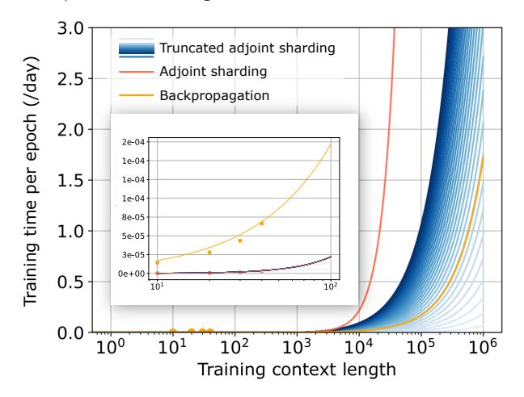

# <span id="page-8-2"></span>**Algorithm 4** Evaluating $\frac{dL}{d\theta}$ with truncated adjoint sharding $\bar{T}$ on $\Upsilon$ devices

```
1: Inputs: \{\mathbf{y}_0^t\}_{t=1}^T, \{\mathbf{h}_k^0\}_{k=1}^K, \{A_k, \mathcal{B}_k, \mathcal{C}_k\}_{k=1}^K, \Omega, \bar{T}, \Upsilon

2: Call alg. 1 for \{\mathbf{A}_k^t, \mathbf{C}_k^t, \mathbf{h}_k^t, \hat{\mathbf{y}}_k^t\}_{(t,k)=(1,1)}^{(T,K)}, \{\frac{\mathrm{d}(\mathbf{o}^t)}{\mathrm{d}\mathbf{y}_K^t}\}_{t=1}^T and saved on each GPU device.

3: On each device v, in parallel do

4: Initialize gradient \frac{\mathrm{d}L}{\mathrm{d}\theta}

5: for Time step index t=1,\ldots,\bar{T}, layer index k=(v-1)(K//\Upsilon)+1,\ldots,v(K//\Upsilon) do

6: Call alg. 3 for \Xi=\left(\mathrm{vjp}_{\mathbf{C}_k^t}(\frac{\mathrm{d}(\mathbf{o}^t)}{\mathrm{d}\mathbf{y}_K^t}\otimes\mathbf{h}_k^t), \sum_{i=1}^t \mathrm{vjp}_{\mathbf{A}_k^i}(\frac{\mathrm{d}(\mathbf{o}^t)}{\mathrm{d}\mathbf{y}_K^t})\lambda_k^{t,i}\otimes\mathbf{h}_k^{i-1}), \sum_{i=1}^t \mathrm{vjp}_{\mathbf{B}_k^i}(\frac{\mathrm{d}(\mathbf{o}^t)}{\mathrm{d}\mathbf{y}_K^t})\lambda_k^{t,i}\otimes\hat{\mathbf{y}}_{k-1}^i)\right)

7: Compute: \frac{\mathrm{d}L}{\mathrm{d}\theta}+\Xi

8: end for

9: for Time step index t=\bar{T}+1,\ldots,T, layer index k=(v-1)(K//\Upsilon)+1,\ldots,v(K//\Upsilon) do

10: Call alg. 3 for \Xi=\left(\mathrm{vjp}_{\mathbf{C}_k^t}(\frac{\mathrm{d}(\mathbf{o}^t)}{\mathrm{d}\mathbf{y}_K^t})\otimes\mathbf{h}_k^t), \sum_{i=t+1-\bar{T}}^t \mathrm{vjp}_{\mathbf{A}_k^i}(\frac{\mathrm{d}(\mathbf{o}^t)}{\mathrm{d}\mathbf{y}_K^t})\lambda_k^{t,i}\otimes\mathbf{h}_k^{i-1}),
\sum_{i=t+1-\bar{T}}^t \mathrm{vjp}_{\mathbf{B}_k^i}(\frac{\mathrm{d}(\mathbf{o}^t)}{\mathrm{d}\mathbf{y}_K^t})\lambda_k^{t,i}\otimes\hat{\mathbf{y}}_{k-1}^i)\right)

11: Compute: \frac{\mathrm{d}L}{\mathrm{d}\theta}+\Xi

12: end for

13: Return: \frac{\mathrm{d}L}{\mathrm{d}\theta}
```

as shown in algorithm 1, the computation of gradients is parallel across the  $\Upsilon$  devices. This will speed up the training as the gradient computation takes most of the computation budget. We will also get a memory per GPU close to Mem/ $\Upsilon$ , with Mem being the memory cost if we only have a single GPU. If we have  $\Upsilon > K$  devices, we can further speed up the forward evaluation by first evaluating  $\mathcal{A}$ ,  $\mathcal{B}$ ,  $\mathcal{C}$  in parallel, and then sequentially add them together on the distributed devices.

#### <span id="page-8-0"></span>4.5 Parallel computing

Adjoint sharding converts the sequential process of backpropagation gradient computation into individual independent vjps, allowing for parallel computation. We analyze the time and memory cost of  $\text{vjp}_{\mathcal{A}_k^i}((\mathrm{d}l^t/\mathrm{d}\mathbf{y}_K^t)\boldsymbol{\lambda}_k^{t,i}\otimes\mathbf{h}_k^{i-1})$ ,  $\text{vjp}_{\mathcal{B}_k^i}((\mathrm{d}l^t/\mathrm{d}\mathbf{y}_K^t)\boldsymbol{\lambda}_k^{t,i}\otimes\hat{\mathbf{y}}_{k-1}^i)$ , and  $\text{vjp}_{\mathcal{C}_k^t}((\mathrm{d}l^t/\mathrm{d}\mathbf{y}_K^t)\otimes\mathbf{h}_k^t)$ .

vjp has a similar time complexity as a forward pass, and a memory complexity of  $bs(|\theta| + \mathbb{O}) + |\theta|$ , where bs is the batch size,  $\mathbb{O}$  is the number of elements in the network output, and  $|\theta|$  is the number of parameters [42]. We provide the memory and FLOPs required to compute the vjps in Table 1 [43].

We analyze training with a dataset containing contexts of lengths T, with  $\Upsilon$  NVIDIA H100 GPUs, and performing computations in FP16. We use a selective diagonal SSM with K layers, and each  $\mathcal{A}_k$ ,  $\mathcal{B}_k$ , and  $\mathcal{C}_k$  network is a single-layer multi-layer perceptron (MLP).

For each data point  $\{\mathbf{x}^t\}_{t=1}^T$ , we store  $\{\mathbf{A}_k^t, \mathbf{C}_k^t, \mathbf{h}_k^t, \mathbf{y}_k^t\}_{(t,k)=(1,1)}^{(T,K)}$  and  $\{\mathrm{d}l(\mathbf{o}^t)/\mathrm{d}\mathbf{y}_K^t\}_{t=1}^T$ , which is TK(2N+P)+TP FP16 numbers. We also save  $\theta_{\mathcal{A}}$ ,  $\theta_{\mathcal{B}}$ , and  $\theta_{\mathcal{C}}$ , each taking PN+N FP16 numbers. We need to store T(2NK+PK+P)+3N(P+1) FP16 numbers before computing the vjp.

<span id="page-9-1"></span>

|                  |        | $^{\text{vjp}}_{\mathcal{A}}$                                                                          | $\mathrm{vjp}_{\mathcal{B}}$                                                                         | $^{\mathrm{vjp}}c$                                                                     |
|------------------|--------|--------------------------------------------------------------------------------------------------------|------------------------------------------------------------------------------------------------------|----------------------------------------------------------------------------------------|
| Unstructured SSM | Memory | $\operatorname{bs}(N^2 +  \boldsymbol{\theta}_{\mathcal{A}} ^*) +  \boldsymbol{\theta}_{\mathcal{A}} $ | $bs(NP +  \boldsymbol{\theta_B} ^*) +  \boldsymbol{\theta_B} $                                       | $bs(NP +  \boldsymbol{\theta_{\mathcal{C}}} ^*) +  \boldsymbol{\theta_{\mathcal{C}}} $ |
|                  | FLOPs  | $bs(N^2(2P+1))$                                                                                        | bs(NP(2P+1))                                                                                         | $bs(NP \times (2P+1))$                                                                 |
| Diagonal SSM     | Memory | $\operatorname{bs}(N +  \boldsymbol{\theta}_{\mathcal{A}} ^*) +  \boldsymbol{\theta}_{\mathcal{A}} $   | $\operatorname{bs}(N +  \boldsymbol{\theta_{\mathcal{B}}} ^*) +  \boldsymbol{\theta_{\mathcal{B}}} $ | $bs(N +  \boldsymbol{\theta_c} ^*) +  \boldsymbol{\theta_c} $                          |
|                  | FLOPs  | bs(N(2P+1))                                                                                            | bs(N(2P+1))                                                                                          | bs(N(2P+1))                                                                            |
| Scalar SSM       | Memory | $bs(1+ \boldsymbol{\theta}_{\mathcal{A}} ^*)+ \boldsymbol{\theta}_{\mathcal{A}} $                      | $bs(N +  \boldsymbol{\theta_B} ^*) +  \boldsymbol{\theta_B} $                                        | $bs(N +  \boldsymbol{\theta_c} ^*) +  \boldsymbol{\theta_c} $                          |
|                  | FLOPs  | bs(2P+1)                                                                                               | bs((N(2P+1))                                                                                         | bs(N(2P+1))                                                                            |

Table 1: Memory and FLOPs required to compute the vjps.  $|\theta_{\mathcal{A}}|^*$ ,  $|\theta_{\mathcal{B}}|^*$ , and  $|\theta_{\mathcal{C}}|^*$  represents the number of elements of the biggest parameter vector of  $\mathcal{A}$ ,  $\mathcal{B}$ , and  $\mathcal{C}$ .

As computing all adjoint state sequences takes up to N(2P+1)(1+T)T/2 FLOPs, it takes NP(1+T)/T FLOPs on average for each adjoint state. For T large enough,  $(1+T)/T \approx 1$ , and we approximate the average FLOPs for each adjoint state with NP. Each vjp then takes bs(7NP+3N) FLOPs of computation.

When computing with a selective diagonal SSM with  $P=128,\ N=225,\ {\rm and\ bs}=8,\ {\rm while\ storing}$  and performing computations in FP16, computing  ${\rm vjp}_{\mathcal A}$ ,  ${\rm vjp}_{\mathcal B}$ , and  ${\rm vjp}_{\mathcal C}$  each takes around  $0.6{\rm MB}$  memory and  $1798144\ {\rm FLOPs}$ . The capacity of a modern GPU is mostly characterized by FLOPs/sec, which measures the computation speed; GPU memory bandwidth, which is the rate at which a GPU can move data between its memory and processing cores; GPU Memory, which is the amount of data a GPU can hold; and number of Multi-Instance GPU (MIG) instances, which is the number of fully isolated GPU instances with its own high-bandwidth memory, cache, and compute cores a GPU can host.

An NVIDIA H100 Tensor Core GPU has a GPU memory bandwidth  $3.35 \, \mathrm{TB/s}$  and performs  $1,979 \, \mathrm{tera} \, \mathrm{FP16}$  FLOPS per second. Therefore, the memory bandwidth allows computing  $(3.35 \, \mathrm{TB/s})/0.6 \, \mathrm{MB} = 5.58 \times 10 \, \mathrm{E6}$  batches of vjps per second, and the computing speed allows computing  $(1979 \, \mathrm{tera/s})/1798144 = 3.76 \times 1.1 \, \mathrm{E9}$  batches of vjps per second. At the same time, since the H100 GPU has  $80 \, \mathrm{GB} \, \mathrm{memory}$ , it can hold up to  $80 \, \mathrm{GB}/(0.6 \, \mathrm{MB/vjp}) = 133 \, \mathrm{batches}$  of vjps at the same

<span id="page-9-0"></span>> **[图片提取文字 (无描述)]:**
> 3.0 Truncated adjoint sharding Training time per epoch (/day) Adjoint sharding 2.5 Backpropagation 2.0 2e-04 1e-04 1.5 1e-04 1e-04 8e-05 1.0 5e-05 3e-05 0e+00-0.5 101 10<sup>2</sup> 0.0 10<sup>3</sup> 101 10<sup>2</sup> 105  $10^{4}$ Training context length


Figure 6: Training time (/day) per epoch comparison for adjoint sharding, truncated adjoint sharding, and backpropagation with different context lengths. Assumed a 100-layer SSM-ResNet model, a 280x acceleration for adjoint sharding from parallel computing (achievable with five Amazon P4 instances), and T from 15 to 2500.

time if we do not consider any memory overhead. As each H100 GPU can hold up to 7 instances in parallel, we perform the adjoint sharding algorithm with  $7\Upsilon$  instances, offering as much as a 56x speedup on one AWS P4 instance (8 H100 GPUs). Such speedup cannot be achieved for backpropagation because of its sequential nature.

Limitation The adjoint sharding method provides an alternative method of computing gradients to backpropagation. While we analytically proved that the gradients computed from adjoint sharding equals to that from backpropagation, adjoint sharding suffer from a time complexity polynomial regarding the training context length when computing equivalent gradients. We provided the truncated adjoint sharding as a linear time complexity alternative, and leave the analysis of its convergence and further improvements on it for future works. We also provided a distributed and parallel computing algorithm for performing adjoint sharding. However, the overhead of naïve implementation of such algorithm with multi-threading or multiprocessing overweights the speedups when the training context length is small. We leave efficient implementation of the parallel algorithm on a CUDA kernel for future work.

**Conclusion** We introduced adjoint sharding, a distributed and parallel computing algorithm, to facilitate training of LLMs on long contexts. Unlike the sequential backpropagation, the adjoint sharding computes gradients of each LLM layer against each token independently through vector-Jacobian product, allowing for parallel computation. To avoid the limitation of vjps increasing polynomially regarding context length, we propose truncated adjoint sharding to focus on important gradients. We analyzed the memory and FLOP cost of each computation block in adjoint sharding and proposed a method to accelerate it through parallel computing. Empirical results suggest orders of magnitude of memory reduction in training while maintaining the same training results as backpropagation.

## References

- <span id="page-10-17"></span>[1] Quentin Anthony, Yury Tokpanov, Paolo Glorioso, and Beren Millidge. Blackmamba: Mixture of experts for state-space models, 2024. URL <https://arxiv.org/abs/2402.01771>.
- <span id="page-10-10"></span>[2] Randall Balestriero and Richard Baraniuk. Fast jacobian-vector product for deep networks, 2021. URL [https:](https://arxiv.org/abs/2104.00219) [//arxiv.org/abs/2104.00219](https://arxiv.org/abs/2104.00219).
- <span id="page-10-18"></span>[3] Atilim Gunes Baydin, Barak A. Pearlmutter, Alexey Andreyevich Radul, and Jeffrey Mark Siskind. Automatic differentiation in machine learning: a survey, 2018. URL <https://arxiv.org/abs/1502.05767>.
- <span id="page-10-19"></span>[4] Atilim Gunes Baydin, Barak A. Pearlmutter, Alexey Andreyevich Radul, and Jeffrey Mark Siskind. Automatic differentiation in machine learning: a survey, 2018. URL <https://arxiv.org/abs/1502.05767>.
- <span id="page-10-12"></span>[5] Maximilian Beck, Korbinian Poppel, Markus Spanring, Andreas Auer, Oleksandra Prudnikova, Michael Kopp, ¨ Gunter Klambauer, Johannes Brandstetter, and Sepp Hochreiter. xlstm: Extended long short-term memory, 2024. ¨ URL <https://arxiv.org/abs/2405.04517>.
- <span id="page-10-6"></span>[6] Iz Beltagy, Matthew E. Peters, and Arman Cohan. Longformer: The long-document transformer, 2020. URL <https://arxiv.org/abs/2004.05150>.
- <span id="page-10-0"></span>[7] Zheng Cai, Maosong Cao, Haojiong Chen, Kai Chen, Keyu Chen, Xin Chen, et al. Internlm2 technical report, 2024. URL <https://arxiv.org/abs/2403.17297>.
- <span id="page-10-8"></span>[8] Yang Cao, Shengtai Li, and Linda Petzold. Adjoint sensitivity analysis for differential-algebraic equations: algorithms and software. *Journal of Computational and Applied Mathematics*, 149(1):171–191, 2002. ISSN 0377-0427. doi: https://doi.org/10.1016/S0377-0427(02)00528-9. URL [https://www.sciencedirect.com/](https://www.sciencedirect.com/science/article/pii/S0377042702005289) [science/article/pii/S0377042702005289](https://www.sciencedirect.com/science/article/pii/S0377042702005289). Scientific and Engineering Computations for the 21st Century - Me thodologies and Applications Proceedings of the 15th Toyota Conference.
- <span id="page-10-9"></span>[9] Ricky T. Q. Chen, Yulia Rubanova, Jesse Bettencourt, and David Duvenaud. Neural ordinary differential equations, 2019. URL <https://arxiv.org/abs/1806.07366>.
- <span id="page-10-14"></span>[10] Shouyuan Chen, Sherman Wong, Liangjian Chen, and Yuandong Tian. Extending context window of large language models via positional interpolation, 2023. URL <https://arxiv.org/abs/2306.15595>.
- <span id="page-10-15"></span>[11] Yukang Chen, Shengju Qian, Haotian Tang, Xin Lai, Zhijian Liu, Song Han, and Jiaya Jia. Longlora: Efficient fine-tuning of long-context large language models, 2024. URL <https://arxiv.org/abs/2309.12307>.
- <span id="page-10-7"></span>[12] Saeed Damadi, Golnaz Moharrer, and Mostafa Cham. The backpropagation algorithm for a math student, 2023. URL <https://arxiv.org/abs/2301.09977>.
- <span id="page-10-4"></span>[13] Tri Dao. Flashattention-2: Faster attention with better parallelism and work partitioning, 2023. URL [https:](https://arxiv.org/abs/2307.08691) [//arxiv.org/abs/2307.08691](https://arxiv.org/abs/2307.08691).
- <span id="page-10-16"></span>[14] Tri Dao and Albert Gu. Transformers are ssms: Generalized models and efficient algorithms through structured state space duality, 2024. URL <https://arxiv.org/abs/2405.21060>.
- <span id="page-10-5"></span>[15] Tri Dao and Albert Gu. Transformers are ssms: Generalized models and efficient algorithms through structured state space duality, 2024. URL <https://arxiv.org/abs/2405.21060>.
- <span id="page-10-3"></span>[16] Tri Dao, Daniel Y. Fu, Stefano Ermon, Atri Rudra, and Christopher Re. Flashattention: Fast and memory-efficient ´ exact attention with io-awareness, 2022. URL <https://arxiv.org/abs/2205.14135>.
- <span id="page-10-11"></span>[17] Soham De, Samuel L. Smith, Anushan Fernando, Aleksandar Botev, George Cristian-Muraru, Albert Gu, Ruba Haroun, Leonard Berrada, Yutian Chen, Srivatsan Srinivasan, Guillaume Desjardins, Arnaud Doucet, David Budden, Yee Whye Teh, Razvan Pascanu, Nando De Freitas, and Caglar Gulcehre. Griffin: Mixing gated linear recurrences with local attention for efficient language models, 2024. URL [https://arxiv.org/abs/2402.](https://arxiv.org/abs/2402.19427) [19427](https://arxiv.org/abs/2402.19427).
- <span id="page-10-2"></span>[18] Yiran Ding, Li Lyna Zhang, Chengruidong Zhang, Yuanyuan Xu, Ning Shang, Jiahang Xu, Fan Yang, and Mao Yang. Longrope: Extending llm context window beyond 2 million tokens. *arXiv preprint arXiv:2402.13753*, 2024.
- <span id="page-10-1"></span>[19] Yiran Ding, Li Lyna Zhang, Chengruidong Zhang, Yuanyuan Xu, Ning Shang, Jiahang Xu, Fan Yang, and Mao Yang. Longrope: Extending llm context window beyond 2 million tokens, 2024. URL [https://arxiv.org/](https://arxiv.org/abs/2402.13753) [abs/2402.13753](https://arxiv.org/abs/2402.13753).
- <span id="page-10-13"></span>[20] Emilien Dupont, Arnaud Doucet, and Yee Whye Teh. Augmented neural odes, 2019. URL [https://arxiv.](https://arxiv.org/abs/1904.01681) [org/abs/1904.01681](https://arxiv.org/abs/1904.01681).

- <span id="page-11-8"></span>[21] Daniel Y. Fu, Tri Dao, Khaled K. Saab, Armin W. Thomas, Atri Rudra, and Christopher Re. Hungry hungry ´ hippos: Towards language modeling with state space models, 2023. URL [https://arxiv.org/abs/2212.](https://arxiv.org/abs/2212.14052) [14052](https://arxiv.org/abs/2212.14052).
- <span id="page-11-7"></span>[22] Albert Gu and Tri Dao. Mamba: Linear-time sequence modeling with selective state spaces, 2024. URL [https:](https://arxiv.org/abs/2312.00752) [//arxiv.org/abs/2312.00752](https://arxiv.org/abs/2312.00752).
- <span id="page-11-2"></span>[23] Albert Gu and Tri Dao. Mamba: Linear-time sequence modeling with selective state spaces, 2024. URL [https:](https://arxiv.org/abs/2312.00752) [//arxiv.org/abs/2312.00752](https://arxiv.org/abs/2312.00752).
- <span id="page-11-9"></span>[24] Albert Gu, Isys Johnson, Karan Goel, Khaled Saab, Tri Dao, Atri Rudra, and Christopher Re. Combining ´ recurrent, convolutional, and continuous-time models with linear state-space layers, 2021. URL [https://](https://arxiv.org/abs/2110.13985) [arxiv.org/abs/2110.13985](https://arxiv.org/abs/2110.13985).
- <span id="page-11-10"></span>[25] Albert Gu, Isys Johnson, Aman Timalsina, Atri Rudra, and Christopher Re. How to train your hippo: State space ´ models with generalized orthogonal basis projections, 2022. URL <https://arxiv.org/abs/2206.12037>.
- <span id="page-11-19"></span>[26] Meng-Hao Guo, Tian-Xing Xu, Jiang-Jiang Liu, Zheng-Ning Liu, Peng-Tao Jiang, Tai-Jiang Mu, Song-Hai Zhang, Ralph R Martin, Ming-Ming Cheng, and Shi-Min Hu. Attention mechanisms in computer vision: A survey. *Computational visual media*, 8(3):331–368, 2022.
- <span id="page-11-11"></span>[27] Ankit Gupta, Harsh Mehta, and Jonathan Berant. Simplifying and understanding state space models with diagonal linear rnns, 2023. URL <https://arxiv.org/abs/2212.00768>.
- <span id="page-11-6"></span>[28] Kaiming He, Xiangyu Zhang, Shaoqing Ren, and Jian Sun. Deep residual learning for image recognition, 2015. URL <https://arxiv.org/abs/1512.03385>.
- <span id="page-11-18"></span>[29] Kaiming He, Xiangyu Zhang, Shaoqing Ren, and Jian Sun. Deep residual learning for image recognition. In *Proceedings of the IEEE Conference on Computer Vision and Pattern Recognition (CVPR)*, June 2016.
- <span id="page-11-4"></span>[30] Julien Herrmann, Olivier Beaumont, Lionel Eyraud-Dubois, Julien Hermann, Alexis Joly, and Alena Shilova. Optimal checkpointing for heterogeneous chains: how to train deep neural networks with limited memory, 2019. URL <https://arxiv.org/abs/1911.13214>.
- <span id="page-11-13"></span>[31] Herbert Jaeger. A tutorial on training recurrent neural networks , covering bppt , rtrl , ekf and the " echo state network " approach - semantic scholar. In *National Research Center for Information Technology, 2002*, 2005. URL <https://api.semanticscholar.org/CorpusID:192593367>.
- <span id="page-11-5"></span>[32] Steven Johnson. Adjoint methods and sensitivity analysis for recurrence, 01 2007.
- <span id="page-11-12"></span>[33] Shiva Kaul. Linear dynamical systems as a core computational primitive. In H. Larochelle, M. Ranzato, R. Hadsell, M.F. Balcan, and H. Lin, editors, *Advances in Neural Information Processing Systems*, volume 33, pages 16808–16820. Curran Associates, Inc., 2020. URL [https://proceedings.neurips.cc/paper\\_files/](https://proceedings.neurips.cc/paper_files/paper/2020/file/c3581d2150ff68f3b33b22634b8adaea-Paper.pdf) [paper/2020/file/c3581d2150ff68f3b33b22634b8adaea-Paper.pdf](https://proceedings.neurips.cc/paper_files/paper/2020/file/c3581d2150ff68f3b33b22634b8adaea-Paper.pdf).
- <span id="page-11-20"></span>[34] Alexander Kirillov, Eric Mintun, Nikhila Ravi, Hanzi Mao, Chloe Rolland, Laura Gustafson, Tete Xiao, Spencer Whitehead, Alexander C Berg, Wan-Yen Lo, et al. Segment anything. In *Proceedings of the IEEE/CVF International Conference on Computer Vision*, pages 4015–4026, 2023.
- <span id="page-11-16"></span>[35] Dacheng Li\*, Rulin Shao\*, Anze Xie, Ying Sheng, Lianmin Zheng, Joseph E. Gonzalez, Ion Stoica, Xuezhe Ma, and Hao Zhang. How long can open-source llms truly promise on context length?, June 2023. URL <https://lmsys.org/blog/2023-06-29-longchat>.
- <span id="page-11-1"></span>[36] Tianle Li, Ge Zhang, Quy Duc Do, Xiang Yue, and Wenhu Chen. Long-context llms struggle with long in-context learning, 2024. URL <https://arxiv.org/abs/2404.02060>.
- <span id="page-11-17"></span>[37] Opher Lieber, Barak Lenz, Hofit Bata, Gal Cohen, Jhonathan Osin, Itay Dalmedigos, Erez Safahi, Shaked Meirom, Yonatan Belinkov, Shai Shalev-Shwartz, Omri Abend, Raz Alon, Tomer Asida, Amir Bergman, Roman Glozman, Michael Gokhman, Avashalom Manevich, Nir Ratner, Noam Rozen, Erez Shwartz, Mor Zusman, and Yoav Shoham. Jamba: A hybrid transformer-mamba language model, 2024. URL [https:](https://arxiv.org/abs/2403.19887) [//arxiv.org/abs/2403.19887](https://arxiv.org/abs/2403.19887).
- <span id="page-11-14"></span>[38] Hao Liu, Matei Zaharia, and Pieter Abbeel. Ring attention with blockwise transformers for near-infinite context, 2023. URL <https://arxiv.org/abs/2310.01889>.
- <span id="page-11-15"></span>[39] Hao Liu, Wilson Yan, Matei Zaharia, and Pieter Abbeel. World model on million-length video and language with blockwise ringattention, 2024. URL <https://arxiv.org/abs/2402.08268>.
- <span id="page-11-0"></span>[40] Meta et al. The llama 3 herd of models, 2024. URL <https://arxiv.org/abs/2407.21783>.
- <span id="page-11-3"></span>[41] Paulius Micikevicius, Sharan Narang, Jonah Alben, Gregory Diamos, Erich Elsen, David Garcia, Boris Ginsburg, Michael Houston, Oleksii Kuchaiev, Ganesh Venkatesh, and Hao Wu. Mixed precision training, 2018. URL <https://arxiv.org/abs/1710.03740>.

- <span id="page-12-18"></span>[42] Roman Novak, Jascha Sohl-Dickstein, and Samuel S. Schoenholz. Fast finite width neural tangent kernel, 2022. URL <https://arxiv.org/abs/2206.08720>.
- <span id="page-12-19"></span>[43] NVIDIA. Matrix multiplication background user's guide, 2024. URL [https://docs.nvidia.com/](https://docs.nvidia.com/deeplearning/performance/dl-performance-matrix-multiplication/index.html) [deeplearning/performance/dl-performance-matrix-multiplication/index.html](https://docs.nvidia.com/deeplearning/performance/dl-performance-matrix-multiplication/index.html).
- <span id="page-12-0"></span>[44] OpenAI et al. Gpt-4 technical report, 2024. URL <https://arxiv.org/abs/2303.08774>.
- <span id="page-12-10"></span>[45] Antonio Orvieto, Samuel L Smith, Albert Gu, Anushan Fernando, Caglar Gulcehre, Razvan Pascanu, and Soham De. Resurrecting recurrent neural networks for long sequences, 2023. URL [https://arxiv.org/abs/2303.](https://arxiv.org/abs/2303.06349) [06349](https://arxiv.org/abs/2303.06349).
- <span id="page-12-9"></span>[46] Razvan Pascanu, Tomas Mikolov, and Yoshua Bengio. On the difficulty of training recurrent neural networks, 2013. URL <https://arxiv.org/abs/1211.5063>.
- <span id="page-12-17"></span>[47] Adam Paszke, Sam Gross, Francisco Massa, Adam Lerer, James Bradbury, Gregory Chanan, Trevor Killeen, Zeming Lin, Natalia Gimelshein, Luca Antiga, Alban Desmaison, Andreas Kopf, Edward Yang, Zach DeVito, ¨ Martin Raison, Alykhan Tejani, Sasank Chilamkurthy, Benoit Steiner, Lu Fang, Junjie Bai, and Soumith Chintala. Pytorch: An imperative style, high-performance deep learning library, 2019. URL [https://arxiv.org/abs/](https://arxiv.org/abs/1912.01703) [1912.01703](https://arxiv.org/abs/1912.01703).
- <span id="page-12-16"></span>[48] William Peebles and Saining Xie. Scalable diffusion models with transformers. In *Proceedings of the IEEE/CVF International Conference on Computer Vision*, pages 4195–4205, 2023.
- <span id="page-12-4"></span>[49] Bo Peng, Eric Alcaide, Quentin Anthony, Alon Albalak, Samuel Arcadinho, Stella Biderman, Huanqi Cao, Xin Cheng, Michael Chung, Matteo Grella, Kranthi Kiran GV, Xuzheng He, Haowen Hou, Jiaju Lin, Przemyslaw Kazienko, Jan Kocon, Jiaming Kong, Bartlomiej Koptyra, Hayden Lau, Krishna Sri Ipsit Mantri, Ferdinand Mom, Atsushi Saito, Guangyu Song, Xiangru Tang, Bolun Wang, Johan S. Wind, Stanislaw Wozniak, Ruichong Zhang, Zhenyuan Zhang, Qihang Zhao, Peng Zhou, Qinghua Zhou, Jian Zhu, and Rui-Jie Zhu. Rwkv: Reinventing rnns for the transformer era, 2023. URL <https://arxiv.org/abs/2305.13048>.
- <span id="page-12-14"></span>[50] Bowen Peng, Jeffrey Quesnelle, Honglu Fan, and Enrico Shippole. Yarn: Efficient context window extension of large language models, 2023. URL <https://arxiv.org/abs/2309.00071>.
- <span id="page-12-1"></span>[51] Maciej Pioro, Kamil Ciebiera, Krystian Kr ´ ol, Jan Ludziejewski, Michał Krutul, Jakub Krajewski, Szymon An- ´ toniak, Piotr Miłos, Marek Cygan, and Sebastian Jaszczur. Moe-mamba: Efficient selective state space models ´ with mixture of experts, 2024. URL <https://arxiv.org/abs/2401.04081>.
- <span id="page-12-8"></span>[52] Samyam Rajbhandari, Jeff Rasley, Olatunji Ruwase, and Yuxiong He. Zero: Memory optimizations toward training trillion parameter models, 2020. URL <https://arxiv.org/abs/1910.02054>.
- <span id="page-12-6"></span>[53] Samyam Rajbhandari, Jeff Rasley, Olatunji Ruwase, and Yuxiong He. Zero: Memory optimizations toward training trillion parameter models, 2020. URL <https://arxiv.org/abs/1910.02054>.
- <span id="page-12-12"></span>[54] Jie Ren, Samyam Rajbhandari, Reza Yazdani Aminabadi, Olatunji Ruwase, Shuangyan Yang, Minjia Zhang, Dong Li, and Yuxiong He. Zero-offload: Democratizing billion-scale model training, 2021. URL [https:](https://arxiv.org/abs/2101.06840) [//arxiv.org/abs/2101.06840](https://arxiv.org/abs/2101.06840).
- <span id="page-12-3"></span>[55] Jay Shah, Ganesh Bikshandi, Ying Zhang, Vijay Thakkar, Pradeep Ramani, and Tri Dao. Flashattention-3: Fast and accurate attention with asynchrony and low-precision, 2024. URL [https://arxiv.org/abs/2407.](https://arxiv.org/abs/2407.08608) [08608](https://arxiv.org/abs/2407.08608).
- <span id="page-12-7"></span>[56] Nimit S. Sohoni, Christopher R. Aberger, Megan Leszczynski, Jian Zhang, and Christopher Re. Low-memory ´ neural network training: A technical report, 2022. URL <https://arxiv.org/abs/1904.10631>.
- <span id="page-12-11"></span>[57] Corentin Tallec and Yann Ollivier. Unbiasing truncated backpropagation through time, 2017. URL [https:](https://arxiv.org/abs/1705.08209) [//arxiv.org/abs/1705.08209](https://arxiv.org/abs/1705.08209).
- <span id="page-12-15"></span>[58] Szymon Tworkowski, Konrad Staniszewski, Mikołaj Pacek, Yuhuai Wu, Henryk Michalewski, and Piotr Miłos.´ Focused transformer: Contrastive training for context scaling, 2023. URL [https://arxiv.org/abs/2307.](https://arxiv.org/abs/2307.03170) [03170](https://arxiv.org/abs/2307.03170).
- <span id="page-12-13"></span>[59] Reddit users. Ntk-aware scaled rope, 2023. URL [https://www.reddit.com/r/LocalLLaMA/comments/](https://www.reddit.com/r/LocalLLaMA/comments/ 14lz7j5/ntkaware_scaled_rope_allows_llama_models_to_have/.) [14lz7j5/ntkaware\\_scaled\\_rope\\_allows\\_llama\\_models\\_to\\_have/.](https://www.reddit.com/r/LocalLLaMA/comments/ 14lz7j5/ntkaware_scaled_rope_allows_llama_models_to_have/.)
- <span id="page-12-2"></span>[60] Ashish Vaswani, Noam Shazeer, Niki Parmar, Jakob Uszkoreit, Llion Jones, Aidan N. Gomez, Lukasz Kaiser, and Illia Polosukhin. Attention is all you need, 2023. URL <https://arxiv.org/abs/1706.03762>.
- <span id="page-12-5"></span>[61] Joost Verbraeken, Matthijs Wolting, Jonathan Katzy, Jeroen Kloppenburg, Tim Verbelen, and Jan S. Rellermeyer. A survey on distributed machine learning. *ACM Computing Surveys*, 53(2):1–33, March 2020. ISSN 1557-7341. doi: 10.1145/3377454. URL <http://dx.doi.org/10.1145/3377454>.

- <span id="page-13-6"></span>[62] Roger Waleffe, Wonmin Byeon, Duncan Riach, Brandon Norick, Vijay Korthikanti, Tri Dao, Albert Gu, Ali Hatamizadeh, Sudhakar Singh, Deepak Narayanan, Garvit Kulshreshtha, Vartika Singh, Jared Casper, Jan Kautz, Mohammad Shoeybi, and Bryan Catanzaro. An empirical study of mamba-based language models, 2024. URL https://arxiv.org/abs/2406.07887.
- <span id="page-13-3"></span>[63] Shida Wang and Beichen Xue. State-space models with layer-wise nonlinearity are universal approximators with exponential decaying memory, 2023. URL https://arxiv.org/abs/2309.13414.
- <span id="page-13-2"></span>[64] P.J. Werbos. Backpropagation through time: what it does and how to do it. *Proceedings of the IEEE*, 78(10): 1550–1560, 1990. doi: 10.1109/5.58337.
- <span id="page-13-4"></span>[65] Guangxuan Xiao, Yuandong Tian, Beidi Chen, Song Han, and Mike Lewis. Efficient streaming language models with attention sinks, 2024. URL https://arxiv.org/abs/2309.17453.
- <span id="page-13-1"></span>[66] Xingzi Xu, Ali Hasan, Khalil Elkhalil, Jie Ding, and Vahid Tarokh. Characteristic neural ordinary differential equations, 2022. URL https://arxiv.org/abs/2111.13207.
- <span id="page-13-8"></span>[67] Jianwei Yang, Chunyuan Li, Pengchuan Zhang, Xiyang Dai, Bin Xiao, Lu Yuan, and Jianfeng Gao. Focal self-attention for local-global interactions in vision transformers, 2021. URL https://arxiv.org/abs/2107.00641.
- <span id="page-13-5"></span>[68] Peitian Zhang, Zheng Liu, Shitao Xiao, Ninglu Shao, Qiwei Ye, and Zhicheng Dou. Soaring from 4k to 400k: Extending llm's context with activation beacon, 2024. URL https://arxiv.org/abs/2401.03462.
- <span id="page-13-0"></span>[69] Yanli Zhao, Andrew Gu, Rohan Varma, Liang Luo, Chien-Chin Huang, Min Xu, Less Wright, Hamid Shojanazeri, Myle Ott, Sam Shleifer, Alban Desmaison, Can Balioglu, Pritam Damania, Bernard Nguyen, Geeta Chauhan, Yuchen Hao, Ajit Mathews, and Shen Li. Pytorch fsdp: Experiences on scaling fully sharded data parallel, 2023. URL https://arxiv.org/abs/2304.11277.

### A Appendix

#### <span id="page-13-7"></span>A.1 Proof for proposition 2

**Proof 1** Define  $\partial \tilde{\mathbf{y}}/\partial \mathbf{h}^t = \tilde{\mathbf{y}}^t_{\mathbf{h}^t}$ ,  $\partial \tilde{\mathbf{h}}^t/\partial \mathbf{h}^{t-1} = \tilde{\mathbf{h}}^t_{\mathbf{h}^{t-1}}$ , and  $\partial \tilde{\mathbf{y}}/\partial \boldsymbol{\theta} = \tilde{\mathbf{y}}^t_{\boldsymbol{\theta}}$ ,  $\partial \tilde{\mathbf{h}}^t/\partial \boldsymbol{\theta} = \tilde{\mathbf{h}}^t_{\boldsymbol{\theta}}$ , by plugging in the expression for  $\tilde{\mathbf{y}}^t$  from subsection 3.2, proposition 1 states that

$$\frac{\mathrm{d}\tilde{\mathbf{y}}^t}{\mathrm{d}\boldsymbol{\theta}} = \tilde{\mathbf{y}}_{\mathbf{h}^t}^t \left[ (\prod_{i=1}^{t-1} \mathbf{h}_{\mathbf{h}^{t-i}}^{t-i+1}) \mathbf{h}_{\boldsymbol{\theta}}^1 + (\prod_{i=1}^{t-2} \mathbf{h}_{\mathbf{h}^{t-i}}^{t-i+1}) \mathbf{h}_{\boldsymbol{\theta}}^2 + \dots + \mathbf{h}_{\mathbf{h}^{t-1}}^t \mathbf{h}_{\boldsymbol{\theta}}^{t-1} + \mathbf{h}_{\boldsymbol{\theta}}^t \right] + \tilde{\mathbf{y}}_{\boldsymbol{\theta}}^t.$$

*In the context of* SSM, *we have:* 

$$\mathbf{h}^{t} = \mathbf{A}^{t} \mathbf{h}^{t-1} + \mathbf{B}^{t} \hat{\mathbf{x}}^{t}, \mathbf{h}_{\mathbf{h}^{t-1}}^{t} = \mathbf{A}^{t}, \mathbf{h}_{\boldsymbol{\theta}}^{t} = \mathbf{A}_{\boldsymbol{\theta}}^{t} \mathbf{h}^{t-1} + \mathbf{B}_{\boldsymbol{\theta}}^{t} \hat{\mathbf{x}}^{t}, \tilde{\mathbf{y}}^{t} = \mathbf{C}^{t} \mathbf{h}^{t}, \tilde{\mathbf{y}}_{\mathbf{h}^{t}}^{t} = \mathbf{C}^{t}, \tilde{\mathbf{y}}_{\boldsymbol{\theta}}^{t} = \mathbf{C}_{\boldsymbol{\theta}}^{t} \mathbf{h}^{t}. \tag{8}$$

Plugging in these relations, we get:

$$\frac{\mathrm{d}\tilde{\mathbf{y}}^t}{\mathrm{d}\boldsymbol{\theta}} = \mathbf{C}^t \left[ \left( \prod_{i=1}^{t-1} \mathbf{A}^{t+1-i} \right) \mathbf{h}_{\boldsymbol{\theta}}^1 + \left( \prod_{i=1}^{t-2} \mathbf{A}^{t+1-i} \right) \mathbf{h}_{\boldsymbol{\theta}}^2 + \dots + \left( \prod_{i=1}^{2} \mathbf{A}^{t+1-i} \right) \mathbf{h}_{\boldsymbol{\theta}}^{t-2} + \mathbf{A}^t \mathbf{h}_{\boldsymbol{\theta}}^{t-1} + \mathbf{h}_{\boldsymbol{\theta}}^t \right] + \tilde{\mathbf{y}}_{\boldsymbol{\theta}}^t. \tag{9}$$

Define the adjoint state  $\lambda^{t,\tau} = \mathbf{C}^t(\prod_{i=1}^{t-\tau} \mathbf{A}^{t+1-i})$ , we have

$$\frac{\mathrm{d}\tilde{\mathbf{y}}^t}{\mathrm{d}\boldsymbol{\theta}} = \boldsymbol{\lambda}^{t,1}\mathbf{h}_{\boldsymbol{\theta}}^1 + \boldsymbol{\lambda}^{t,2}\mathbf{h}_{\boldsymbol{\theta}}^2 + \dots + \boldsymbol{\lambda}^{t,t-1}\mathbf{h}_{\boldsymbol{\theta}}^{t-1} + \boldsymbol{\lambda}^{t,t}\mathbf{h}_{\boldsymbol{\theta}}^t + \tilde{\mathbf{y}}_{\boldsymbol{\theta}}^t$$

Therefore, we have

$$\frac{\mathrm{d}l^t}{\mathrm{d}\boldsymbol{\theta}} = \frac{\mathrm{d}l^t}{\mathrm{d}\mathbf{y}^t} \frac{\mathrm{d}(\tilde{\mathbf{y}}^t + \hat{\mathbf{x}}^t)}{\mathrm{d}\boldsymbol{\theta}} 
= \frac{\mathrm{d}l^t}{\mathrm{d}\mathbf{y}^t} \frac{\mathrm{d}\tilde{\mathbf{y}}^t}{\mathrm{d}\boldsymbol{\theta}} 
= \frac{\mathrm{d}l^t}{\mathrm{d}\mathbf{y}^t} [\boldsymbol{\lambda}^{t,1} \mathbf{h}_{\boldsymbol{\theta}}^1 + \boldsymbol{\lambda}^{t,2} \mathbf{h}_{\boldsymbol{\theta}}^2 + \dots + \boldsymbol{\lambda}^{t,t-1} \mathbf{h}_{\boldsymbol{\theta}}^{t-1} + \boldsymbol{\lambda}^{t,t} \mathbf{h}_{\boldsymbol{\theta}}^t + \tilde{\mathbf{y}}_{\boldsymbol{\theta}}^t]$$

Plug in everything, we have

$$\frac{\mathrm{d}l^{t}}{\mathrm{d}\boldsymbol{\theta}} = \frac{\mathrm{d}l^{t}}{\mathrm{d}\mathbf{y}^{t}} [\boldsymbol{\lambda}^{t,1} (\mathbf{A}_{\boldsymbol{\theta}}^{1} \mathbf{h}^{0} + \mathbf{B}_{\boldsymbol{\theta}}^{1} \hat{\mathbf{x}}^{1}) + \boldsymbol{\lambda}^{t,2} (\mathbf{A}_{\boldsymbol{\theta}}^{2} \mathbf{h}^{1} + \mathbf{B}_{\boldsymbol{\theta}}^{2} \hat{\mathbf{x}}^{2}) + \dots + \boldsymbol{\lambda}^{t,t} (\mathbf{A}_{\boldsymbol{\theta}}^{t} \mathbf{h}^{t-1} + \mathbf{B}_{\boldsymbol{\theta}}^{t} \hat{\mathbf{x}}^{t}) + \mathbf{C}_{\boldsymbol{\theta}}^{t} \mathbf{h}^{t}$$

$$= \left[ \sum_{i=1}^{t} \frac{\mathrm{d}l^{t}}{\mathrm{d}\mathbf{y}^{t}} \boldsymbol{\lambda}^{t,i} (\mathbf{A}_{\boldsymbol{\theta}}^{i} \mathbf{h}^{i-1} + \mathbf{B}_{\boldsymbol{\theta}}^{i} \hat{\mathbf{x}}^{i}) \right] + \frac{\mathrm{d}l^{t}}{\mathrm{d}\mathbf{y}^{t}} \mathbf{C}_{\boldsymbol{\theta}}^{t} \mathbf{h}^{t}$$

$$= \left[ \sum_{i=1}^{t} \mathrm{vjp}_{\boldsymbol{\mathcal{A}}^{i}} (\frac{\mathrm{d}l^{t}}{\mathrm{d}\mathbf{y}^{t}} \boldsymbol{\lambda}^{t,i} \otimes \mathbf{h}^{i-1}) + \mathrm{vjp}_{\boldsymbol{\mathcal{B}}^{i}} (\frac{\mathrm{d}l^{t}}{\mathrm{d}\mathbf{y}^{t}} \boldsymbol{\lambda}^{t,i} \otimes \hat{\mathbf{x}}^{i}) \right] + \mathrm{vjp}_{\boldsymbol{\mathcal{C}}^{t}} (\frac{\mathrm{d}l^{t}}{\mathrm{d}\mathbf{y}^{t}} \otimes \mathbf{h}^{t})$$

where we define  $\operatorname{vjp}_{NN^i}(v) = v \cdot NN_{\boldsymbol{\theta}}(\operatorname{Input}^i)$ , with  $\boldsymbol{\theta}$  being NN's parameters and i being the index of Input. Now, as  $\operatorname{vjp}_{\boldsymbol{\mathcal{A}}^i}(\frac{\operatorname{d}l^t}{\operatorname{d}\mathbf{y}^t}\boldsymbol{\lambda}^{t,i}\otimes\mathbf{h}^{i-1})$ ,  $\operatorname{vjp}_{\boldsymbol{\mathcal{B}}^i}(\frac{\operatorname{d}l^t}{\operatorname{d}\mathbf{y}^t}\boldsymbol{\lambda}^{t,i}\otimes\hat{\mathbf{x}}^i)$ , and  $\operatorname{vjp}_{\boldsymbol{\mathcal{C}}^t}(\frac{\operatorname{d}l^t}{\operatorname{d}\mathbf{y}^t}\otimes\mathbf{h}^t)$  are separate, we have

$$\frac{\mathrm{d}l^t}{\mathrm{d}\boldsymbol{\theta}} = \left[\sum_{i=1}^t \mathrm{vjp}_{\boldsymbol{\mathcal{A}}^i} \left(\frac{\mathrm{d}l^t}{\mathrm{d}\mathbf{y}^t} \boldsymbol{\lambda}^{t,i} \otimes \mathbf{h}^{i-1}\right)\right] \oplus \left[\sum_{i=1}^t \mathrm{vjp}_{\boldsymbol{\mathcal{B}}^i} \left(\frac{\mathrm{d}l^t}{\mathrm{d}\mathbf{y}^t} \boldsymbol{\lambda}^{t,i} \otimes \hat{\mathbf{x}}^i\right)\right] \oplus \mathrm{vjp}_{\boldsymbol{\mathcal{C}}^t} \left(\frac{\mathrm{d}l^t}{\mathrm{d}\mathbf{y}^t} \otimes \mathbf{h}^t\right),\tag{10}$$

where  $\oplus$  is vector concatenation.

#### <span id="page-14-0"></span>A.2 Proof for proposition 3

**Proof 2** First, using the structure of ResNet, we have

$$\frac{\mathrm{d}L}{\mathrm{d}\boldsymbol{\theta}} = \sum_{t=1}^{T} \frac{\mathrm{d}l^{t}}{\mathrm{d}\mathbf{y}_{K}^{t}} \frac{\mathrm{d}\mathbf{y}_{K}^{t}}{\mathrm{d}\boldsymbol{\theta}}$$

$$= \sum_{t=1}^{T} \frac{\mathrm{d}l^{t}}{\mathrm{d}\mathbf{y}_{K}^{t}} \frac{\mathrm{d}(\mathbf{y}_{0}^{t} + \sum_{k=1}^{K} \tilde{\mathbf{y}}_{k}^{t})}{\mathrm{d}\boldsymbol{\theta}}$$

$$= \sum_{t=1}^{T} \frac{\mathrm{d}l^{t}}{\mathrm{d}\mathbf{y}_{K}^{t}} \sum_{k=1}^{K} \frac{\mathrm{d}\tilde{\mathbf{y}}_{k}^{t}}{\mathrm{d}\boldsymbol{\theta}}$$

$$= \sum_{t=1}^{T} \sum_{k=1}^{K} \frac{\mathrm{d}l^{t}}{\mathrm{d}\mathbf{y}_{K}^{t}} \frac{\mathrm{d}\tilde{\mathbf{y}}_{k}^{t}}{\mathrm{d}\boldsymbol{\theta}}$$

from proposiiton 2, we have proven that for a single SSM model, we have

$$\frac{\mathrm{d}l^t}{\mathrm{d}\boldsymbol{\theta}} = \left[\sum_{i=1}^t \mathrm{vjp}_{\boldsymbol{\mathcal{A}}^i}(\frac{\mathrm{d}l^t}{\mathrm{d}\mathbf{y}^t}\boldsymbol{\lambda}^{t,i}\otimes\mathbf{h}^{i-1})\right] \oplus \left[\sum_{i=1}^t \mathrm{vjp}_{\boldsymbol{\mathcal{B}}^i}(\frac{\mathrm{d}l^t}{\mathrm{d}\mathbf{y}^t}\boldsymbol{\lambda}^{t,i}\otimes\hat{\mathbf{x}}^i)\right] \oplus \mathrm{vjp}_{\boldsymbol{\mathcal{C}}^t}(\frac{\mathrm{d}l^t}{\mathrm{d}\mathbf{y}^t}\otimes\mathbf{h}^t),$$

so for the ResNet model, we have

<span id="page-15-0"></span>
$$\frac{\mathrm{d}L}{\mathrm{d}\theta} = \sum_{t=1}^{T} \sum_{k=1}^{K} \frac{\mathrm{d}l^{t}}{\mathrm{d}\mathbf{y}_{K}^{t}} \frac{\mathrm{d}\tilde{\mathbf{y}}_{k}^{t}}{\mathrm{d}\theta} \\
= \sum_{t=1}^{T} \sum_{k=1}^{K} \left\{ \left[ \sum_{i=1}^{t} \mathrm{vjp}_{\mathcal{A}_{k}^{i}} \left( \frac{\mathrm{d}l^{t}}{\mathrm{d}\mathbf{y}_{K}^{t}} \boldsymbol{\lambda}_{k}^{t,i} \otimes \mathbf{h}_{k}^{i-1} \right) \right] \oplus \left[ \sum_{i=1}^{t} \mathrm{vjp}_{\mathcal{B}_{k}^{i}} \left( \frac{\mathrm{d}l^{t}}{\mathrm{d}\mathbf{y}_{K}^{t}} \boldsymbol{\lambda}_{k}^{t,i} \otimes \hat{\mathbf{x}}_{k}^{i} \right) \right] \oplus \mathrm{vjp}_{\mathcal{C}_{k}^{t}} \left( \frac{\mathrm{d}l^{t}}{\mathrm{d}\mathbf{y}_{K}^{t}} \otimes \mathbf{h}_{k}^{t} \right) \right\} \\
= \left( \sum_{t=1}^{T} \sum_{k=1}^{K} \mathrm{vjp}_{\mathcal{C}_{k}^{i}} \left( \frac{\mathrm{d}l^{t}}{\mathrm{d}\mathbf{y}_{K}^{t}} \boldsymbol{\lambda}_{k}^{t,i} \otimes \mathbf{h}_{k}^{i-1} \right) \right) \\
\oplus \left( \sum_{t=1}^{T} \sum_{k=1}^{K} \sum_{i=1}^{t} \mathrm{vjp}_{\mathcal{B}_{k}^{i}} \left( \frac{\mathrm{d}l^{t}}{\mathrm{d}\mathbf{y}_{K}^{t}} \boldsymbol{\lambda}_{k}^{t,i} \otimes \hat{\mathbf{x}}_{k}^{i} \right) \right) \\
= \left( \sum_{t=1}^{T} \sum_{k=1}^{K} \sum_{i=1}^{t} \mathrm{vjp}_{\mathcal{C}_{k}^{i}} \left( \frac{\mathrm{d}l^{t}}{\mathrm{d}\mathbf{y}_{K}^{t}} \boldsymbol{\lambda}_{k}^{t,i} \otimes \hat{\mathbf{x}}_{k}^{i} \right) \right) \\
\oplus \left( \sum_{t=1}^{T} \sum_{k=1}^{K} \sum_{i=1}^{t} \mathrm{vjp}_{\mathcal{A}_{k}^{i}} \left( \frac{\mathrm{d}l^{t}}{\mathrm{d}\mathbf{y}_{K}^{t}} \boldsymbol{\lambda}_{k}^{t,i} \otimes \hat{\mathbf{y}}_{k-1}^{i} \right) \right) \\
\oplus \left( \sum_{t=1}^{T} \sum_{k=1}^{K} \sum_{i=1}^{t} \mathrm{vjp}_{\mathcal{A}_{k}^{i}} \left( \frac{\mathrm{d}l^{t}}{\mathrm{d}\mathbf{y}_{K}^{t}} \boldsymbol{\lambda}_{k}^{t,i} \otimes \hat{\mathbf{y}}_{k-1}^{i} \right) \right) \\
\oplus \left( \sum_{t=1}^{T} \sum_{k=1}^{K} \sum_{i=1}^{t} \mathrm{vjp}_{\mathcal{B}_{k}^{i}} \left( \frac{\mathrm{d}l^{t}}{\mathrm{d}\mathbf{y}_{K}^{t}} \boldsymbol{\lambda}_{k}^{t,i} \otimes \hat{\mathbf{y}}_{k-1}^{i} \right) \right)$$

where the input to  $\operatorname{vjp}_{\mathcal{C}_k^t}(\frac{\mathrm{d}l^t}{\mathrm{d}\mathbf{y}_k^t}\otimes\mathbf{h}_k^t)$ ,  $\operatorname{vjp}_{\mathcal{A}_k^i}(\frac{\mathrm{d}l^t}{\mathrm{d}\mathbf{y}_k^t}\boldsymbol{\lambda}_k^{t,i}\otimes\mathbf{h}_k^{i-1})$ , and  $\operatorname{vjp}_{\mathcal{B}_k^i}(\frac{\mathrm{d}l^t}{\mathrm{d}\mathbf{y}_k^t}\boldsymbol{\lambda}_k^{t,i}\otimes\hat{\mathbf{y}}_{k-1}^i)$  are computed with the k-th SSM and the  $\hat{\mathbf{x}}_k^i=\hat{\mathbf{y}}_{k-1}^i=\operatorname{RMSNorm}(\mathbf{y}_{k-2}^i+\operatorname{SSM}_{k-1}(\hat{\mathbf{Y}}_{k-2})^i)$  (the normalized output sequence of the (k-1)-th SSM), and the adjoint state  $\boldsymbol{\lambda}_k^{t,\tau}=\mathbf{C}_k^t(\prod_{i=1}^{t-\tau}\mathbf{A}_k^{t+1-i})$ .

#### A.3 Proof of concept for VJP

As a proof of concept of why  $(dl^t/d\mathbf{y}^t)\mathbf{C}_{\boldsymbol{\theta}}^t\mathbf{h}^t$  can computed with vjp, we present an explicit and simple example. We have  $\mathbf{y} = [y_1, y_2]$ ,  $\mathbf{h} = [h_1, h_2, h_3]$ ,  $\boldsymbol{\theta} = \vec{\boldsymbol{\theta}}$ . We then have

$$\frac{dl}{d\mathbf{y}} = \begin{bmatrix} l_{y_1} & l_{y_2} \end{bmatrix} \in \mathbb{R}^{1 \times P}$$

$$\mathbf{C}_{\boldsymbol{\theta}} = \begin{bmatrix} C_{11}^{\vec{\theta}} & C_{12}^{\vec{\theta}} & C_{13}^{\vec{\theta}} \\ C_{21}^{\vec{\theta}} & C_{22}^{\vec{\theta}} & C_{23}^{\vec{\theta}} \end{bmatrix} \in \mathbb{R}^{P \times N \times |\boldsymbol{\theta}|}$$

$$\mathbf{h} = \begin{bmatrix} h_1 \\ h_2 \\ h_3 \end{bmatrix} \in \mathbb{R}^{N \times 1}$$

With each  $C_{ij}^{\vec{\theta}} = [\partial C_{ij}/\partial \theta_1, \dots, \partial C_{ij}/\partial \theta_{|\theta|}] \in \mathbb{R}^{|\theta|}$ . We have

$$\frac{\mathrm{d}l}{\mathrm{d}y} \mathbf{C}_{\theta} \mathbf{h} = C_{11}^{\vec{\theta}} l_{y_1} h_1 + C_{21}^{\vec{\theta}} l_{y_2} h_1 + C_{12}^{\vec{\theta}} l_{y_1} h_2 + C_{22}^{\vec{\theta}} l_{y_2} h_2 + C_{13}^{\vec{\theta}} l_{y_1} h_3 + C_{23}^{\vec{\theta}} l_{y_2} h_3$$

$$= [l_{y_1} h_1 \ l_{y_1} h_2 \ l_{y_1} h_3 \ l_{y_2} h_1 \ l_{y_2} h_2 \ l_{y_2} h_3] \cdot [C_{11}^{\vec{\theta}} \ C_{12}^{\vec{\theta}} \ C_{13}^{\vec{\theta}} C_{21}^{\vec{\theta}} \ C_{22}^{\vec{\theta}} \ C_{23}^{\vec{\theta}}]$$

$$= \operatorname{sum} \left( \left( \begin{bmatrix} l_{y_1} \\ l_{y_2} \end{bmatrix} \otimes [h_1 \ h_2 \ h_3] \right) \circ \begin{bmatrix} C_{11}^{\vec{\theta}} \ C_{12}^{\vec{\theta}} \ C_{23}^{\vec{\theta}} \ C_{23}^{\vec{\theta}} \end{bmatrix} \right)$$

where  $\cdot$  is vector dot product,  $\otimes$  is vector outer product,  $\circ$  is element-wise product, and sum means summing all elements in a matrix.

#### <span id="page-16-0"></span>A.4 Distributed tensors' locations

We provide the specific location for each tensors in distributed training:

Table 2: Tensors stored on each GPU, part 1.

| GPU index          | $\mid \mathrm{d}l(\mathbf{o}^t)/\mathrm{d}y_K^t$ | $h_k^t$                                                                                                                           |
|--------------------|--------------------------------------------------|-----------------------------------------------------------------------------------------------------------------------------------|
| v = 1              | $t = 1, \ldots, T$                               | $t=1,\ldots,T;\ k=1,\ldots K//\Upsilon$<br>$t=1,\ldots,T;\ k=K//\Upsilon+1,\ldots,2(K//\Upsilon)$                                 |
| v=2                | $t=1,\ldots,T$                                   | $t=1,\ldots,T;\ k=K//\Upsilon+1,\ldots,2(K//\Upsilon)$                                                                            |
|                    |                                                  |                                                                                                                                   |
| $v = \Upsilon - 1$ | $t=1,\ldots,T$                                   | $t=1,\ldots,T; k=(\Upsilon-2)(K//\Upsilon)+1,\ldots,(\Upsilon-1)(K//\Upsilon)$                                                    |
| $v = \Upsilon$     | $t=1,\ldots,T$                                   | $t = 1,, T; k = (\Upsilon - 2)(K//\Upsilon) + 1,, (\Upsilon - 1)(K//\Upsilon) t = 1,, T; k = (\Upsilon - 1)(K//\Upsilon) + 1,, K$ |

Table 3: Tensors stored on each GPU, part 2.

| GPU index                                                        | $\mid C_k^t$                                                                                                                                   |
|------------------------------------------------------------------|------------------------------------------------------------------------------------------------------------------------------------------------|
| $ \begin{aligned} \upsilon &= 1 \\ \upsilon &= 2 \end{aligned} $ | $ \begin{vmatrix} t = 1, \dots, T; \ k = 1, \dots K//\Upsilon \\ t = 1, \dots, T; \ k = K//\Upsilon + 1, \dots, 2(K//\Upsilon) \end{vmatrix} $ |
|                                                                  | $ \begin{array}{l} \dots \\ t = 1, \dots, T \\ t = 1, \dots, T; \ k = (\Upsilon - 1)(K//\Upsilon) + 1, \dots, K \end{array} $                  |

Table 4: Tensors stored on each GPU, part 3.

$$\begin{array}{c|c} \text{GPU index} & \hat{y}_k^t \\ \hline v = 1 & t = 1, \dots, T; \ k = 0, \dots K//\Upsilon - 1 \\ v = 2 & t = 1, \dots, T; \ k = K//\Upsilon, \dots, 2(K//\Upsilon) - 1 \\ \dots & \dots & \dots \\ v = \Upsilon - 1 & t = 1, \dots, T; \ k = (\Upsilon - 2)(K//\Upsilon), \dots, (\Upsilon - 1)(K//\Upsilon) - 1 \\ v = \Upsilon & t = 1, \dots, T; \ k = (\Upsilon - 1)(K//\Upsilon), \dots, K - 1 \\ \hline \end{array}$$

Table 5: Tensors stored on each GPU, part 4.

$$\begin{array}{c|c} \text{GPU index} & A_k^t \\ \hline v=1 & t=2,\ldots,T; \ k=1,\ldots K//\Upsilon \\ v=2 & t=2,\ldots,T; \ k=K//\Upsilon+1,\ldots,2(K//\Upsilon) \\ \ldots & \cdots \\ v=\Upsilon-1 & t=2,\ldots,T; \ k=(\Upsilon-2)(K//\Upsilon)+1,\ldots,(\Upsilon-1)(K//\Upsilon) \\ v=\Upsilon & t=2,\ldots,T; \ k=(\Upsilon-1)(K//\Upsilon)+1,\ldots,K \end{array}$$

Table 6: Tensors stored on each GPU, part 5.

<span id="page-16-1"></span>

| rable of Tensors stored on each of o, part 3. |                                                                                                                              |                                                                           |  |  |
|-----------------------------------------------|------------------------------------------------------------------------------------------------------------------------------|---------------------------------------------------------------------------|--|--|
| GPU index                                     | $\mid \boldsymbol{\theta}_k$                                                                                                 | $\operatorname{Gradient}_k$                                               |  |  |
| v = 1                                         | $k = 1, \dots K/\Upsilon$                                                                                                    | $k=1,\ldots K//\Upsilon$                                                  |  |  |
| $\upsilon = 2$                                | $\begin{vmatrix} k = 1, \dots K//\Upsilon \\ k = K//\Upsilon + 1, \dots, 2(K//\Upsilon) \end{vmatrix}$                       | $k = K//\Upsilon + 1, \dots, 2(K//\Upsilon)$                              |  |  |
|                                               |                                                                                                                              | • • •                                                                     |  |  |
| $v = \Upsilon - 1$                            | $k = (\Upsilon - 2)(K//\Upsilon) + 1, \dots, (\Upsilon - 1)(K//\Upsilon)$<br>$k = (\Upsilon - 1)(K//\Upsilon) + 1, \dots, K$ | $k = (\Upsilon - 2)(K//\Upsilon) + 1, \dots, (\Upsilon - 1)(K//\Upsilon)$ |  |  |
| $v = \Upsilon$                                | $k = (\Upsilon - 1)(K//\Upsilon) + 1, \dots, K$                                                                              | $k = (\Upsilon - 1)(K//\Upsilon) + 1, \dots, K$                           |  |  |