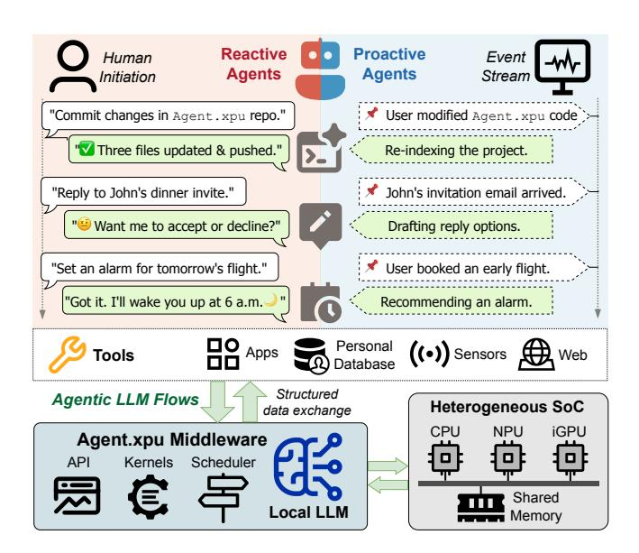
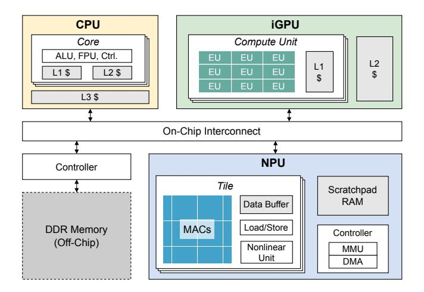
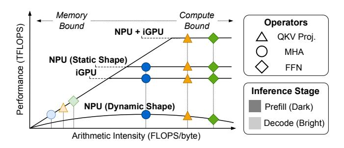
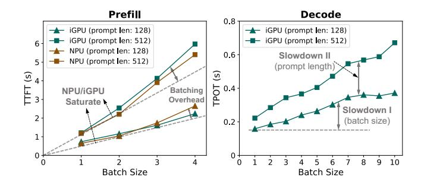

# Agent.xpu: Efficient Scheduling of Agentic LLM Workloads on Heterogeneous SoC

Xinming Wei1 Jiahao Zhang1 Haoran Li1 Jiayu Chen1 Haoning Guan2 Rui Qu1 Maoliang Li1 Xiang Chen1 Guojie Luo1,3

1School of Computer Science, Peking University 2The University of Hong Kong 3National Key Laboratory for Multimedia Information Processing, Peking University

#### **Abstract**

Personal LLM agents increasingly combine foreground reactive interactions with background proactive monitoring, forming long-lived, stateful LLM flows that interleave prefill and token-by-token decode. While modern heterogeneous SoCs integrate CPUs, iGPUs, and NPUs to support on-device intelligence, existing LLM engines assume static, single-shot inference and lack mechanisms for flow-level concurrency, prioritization, and efficient accelerator coordination. As a result, commodity SoCs remain poorly matched to the dynamic, mixed-criticality execution patterns of personal agents.

This paper presents Agent.xpu, the first LLM engine that orchestrates concurrent reactive and proactive LLM flows on commodity SoCs. Extensive profiling uncovers unique SoC characteristics of operator-accelerator affinity, asymmetric DDR contention, and stage-divergent batching behaviors distinct from cloud-serving assumptions. Agent.xpu introduces three key techniques: a heterogeneous execution graph (HEG) capturing NPU/iGPU affinity and elastic operator binding; flow-aware NPU-iGPU coordination with stage elasticity, decoupling prefill and decode to reduce bandwidth contention and enforce priorities; and fine-grained preemption with slack-aware piggybacking to guarantee reactive responsiveness without starving proactive work. Across realistic personal-agent workloads, Agent.xpu delivers 1.2-4.9× proactive throughput and reduces reactive latency by at least 91%, compared with both industrial iGPU-only serving engine and NPU-iGPU static inference with optimal tensor-partitioning schemes. Agent.xpu also minimizes energy consumption and graphics interference via controlled iGPU usage.

#### 1 Introduction

Large Language Models (LLMs) have revolutionized intelligent personal assistants [14], powering autonomous agentic workflows that combine answering, planning, and tool interaction [36,63,70]. Personal agents operate through two complementary modes [14,15,34,38,41]. As shown in Fig. 1, reactive agents respond to user-initiated queries in the foreground.

> **[图片提取文字 (无描述)]:**
> Reactive Proactive Event Human Agents Agents Initiation Stream 烤 User modified Agent.xpu code` "Commit changes in Agent.xpu repo." Three files updated & pushed." Re-indexing the project. John's invitation email arrived. "Reply to John's dinner invite." " Want me to accept or decline?" Drafting reply options. User booked an early flight. "Set an alarm for tomorrow's flight." "Got it. I'll wake you up at 6 a.m. Recommending an alarm. Personal ((•)) Sensors Tools Structured Agentic LLM Flows Heterogeneous SoC data exchange **iGPU** Agent.xpu Middleware API Kernels Scheduler Shared Local LLM Memory

Figure 1: **Personal LLM Agent System.** Agent.xpu bridges the agent applications and heterogeneous SoC, orchestrating stateful on-device LLM flows from both foreground *reactive* agents and background *proactive* agents.

Meanwhile, *proactive agents* continuously monitor event signals and perform speculative analysis without explicit user triggers. The agentic execution paths intersect at *LLM flows*, i.e., structured, stateful LLM invocations punctuated by stalls of human thinking or tool calling. Since LLM flows frequently manipulate personal data and involve interactive steps, ondevice deployment is preferable for privacy, responsiveness, and cost efficiency [67,72,74]. Emerging 0.6B-8B lightweight LLMs [24,44,45,69] finetuned for agentic behaviors increasingly act as on-device controllers for function calls [20], with complex reasoning tasks selectively routed to cloud LLMs for effective edge-cloud collaboration [55].

Modern heterogeneous system-on-chip (hetero-SoC) across laptops and mobile phones comprises CPU, integrated

GPU (iGPU), and NPU, to support local generative AI. While recent studies of on-device LLM acceleration [\[6,](#page-12-0) [7,](#page-12-1) [66,](#page-16-5) [68\]](#page-16-6) exploit hetero-SoC via quantization or NPU offloading, they basically target *static inference*, assuming isolated, singleshot model executions with one-off prompts, non-overlapping scheduling, and uniform latency goals. In contrast, agentic LLM flows break these assumptions: they require *flowlevel concurrency, coordination, and prioritization*. Reactive flows contain real-time, bursty requests that demand timeliness; proactive flows comprise long-running, best-effort background tasks; and flow stages interleave unpredictably as agents reason or stall on external events. Current hetero-SoC hardware-software stacks offer no native support for such dynamic, flow-oriented execution, widening their mismatch with real-world personal agents.

We identify three fundamental gaps between efficient agentic LLM flows and current hetero-SoC ecosystems ([§2.3\)](#page-2-0).

- *Flexibility-efficiency trade-off.* NPUs deliver high performance for static-shaped input and ahead-of-time-compiled computation graphs, yet they are ill-suited for variable sequence lengths, dynamic batch sizes, and irregular control flow inherent to agentic LLM workloads. Conversely, more flexible iGPUs suffer from lower energy efficiency and potential interference with graphics responsibilities.
- *Shared-memory contention.* Concurrent agentic flows often emit overlapping NPU and iGPU kernel executions, which intensify contention for the limited DDR bandwidth of modern shared-memory SoCs, potentially degrading the latency of each individual task.
- *Absence of flow-aware runtime abstractions.* Most ondevice LLM engines lack mechanisms such as in-flight batching, prioritized scheduling, and coordinated NPUiGPU control, which are essential for launching concurrent reactive and proactive flows while meeting their distinct latency or throughput requirements.

Despite the above constraints, our in-depth hetero-SoC profiling ([§3\)](#page-3-0) reveals concrete opportunities to accommodate agentic LLM flows efficiently on commodity SoCs. These insights are distinct from cloud-centric LLM serving assumptions, motivating the design of our system.

- *Operator-accelerator affinity.* We observe distinct efficiency trade-offs between NPU and iGPU handling static versus dynamic LLM operators during prefill or decode, two LLM inference stages. This motivates both pre-run static placement and runtime elastic binding to map operators to their most efficient hardware backend.
- *Asymmetric contention pattern.* Memory-bound kernels are significantly more sensitive to, and more likely to saturate, shared DDR bandwidth than compute-bound kernels. This suggests that contention-aware kernel dispatching can

maximize aggregate throughput by preventing concurrent memory-heavy accesses.

- *Stage-decoupled scheduling.* Co-locating all inference stages inevitably causes interference between reactive and proactive flows. However, distributing workloads based on distinct characteristics of prefill and decode across NPU and iGPU enables prioritized scheduling for reactive responsiveness while preserving proactive throughput.
- *Stage-divergent batching effects.* Prefill gains little from batching because it saturates compute regardless of batch size; decode batching improves multi-flow throughput, yet the individual latency of each flow is sensitive to total batch size and input length of all flows. This necessitates adaptive batching strategies for mixed reactive-proactive flows.

Agent.xpu Framework. We present Agent.xpu, the first LLM engine that orchestrates agentic flows on commodity hetero-SoCs (Fig. [1\)](#page-0-0). Agent.xpu not only fills the vacuum of fully on-device concurrent serving, but aligns heterogeneous accelerators with agentic objectives by jointly optimizing reactive timeliness, proactive throughput, and energy efficiency. Its design combines profiling-driven graph construction with online, flow-aware NPU-iGPU co-scheduling to balance these competing goals ([§4.1\)](#page-5-0).

Key Techniques. First, Agent.xpu introduces a heterogeneous execution graph (HEG) that abstracts NPU/iGPU operator behavior in LLM flows, encoding affinity-guided placement constraints, elastic chunked kernel binding, and predictive performance annotations for runtime scheduling (§[4.2\)](#page-6-0). Second, Agent.xpu deploys flow-aware NPU-iGPU coordination with stage elasticity: prefill flows opportunistically interleave NPU and iGPU executions, while decode flows remain iGPU-resident and continuously batched. This decoupled scheduling mitigates bandwidth contention. Dedicated iGPU arbitration, prefill compute partitioning, and on-the-fly NPU kernel warm-up dynamically redistribute work under fluctuating flow concurrency ([§4.3\)](#page-6-1). Third, Agent.xpu provides fine-grained preemption for reactive queries across both stages, leveraging unified memory space for copy-free context switching ([§4.4\)](#page-7-0). Agent.xpu also utilizes slack-aware piggybacking with adaptive decode batching to prevent proactive starvation while preserving reactive responsiveness (§[4.5\)](#page-8-0).

Implementation and Evaluations. We implement both the agent interface and the LLM backend from scratch on Intel Core Ultra SoCs [\[12\]](#page-13-4), representative of mainstream heteo-SoC architecture (§[5\)](#page-8-1). Agent.xpu builds atop Intel Open-VINO [\[48\]](#page-15-2) for efficient NPU/iGPU kernel implementations and hardware-native asynchronous APIs. Agent.xpu is orthogonal to low-bit quantization or sparse attention and therefore preserves model accuracy.

Agent.xpu substantially outperforms existing on-device LLM engines (§[6\)](#page-8-2) across realistic personal-agent workloads (e.g., event handling, function calling, retrieval-augmented generation), using Llama3-3B/8B [\[44\]](#page-14-4) as representative ondevice LLM backbones. Baselines comprise (a) OpenVINO iGPU *serving* [\[48\]](#page-15-2), (b) Llama.cpp CPU *serving* [\[22\]](#page-13-5), and (c) customized *serial* NPU-iGPU inference [\[6,](#page-12-0) [7\]](#page-12-1) with tuned tensor partitions for the target platform ([§6.1\)](#page-8-3). Under proactiveonly workloads, Agent.xpu yields 1.2-2.4× throughput over OpenVINO (iGPU) and 1.4-4.9× over serial NPU-iGPU inference. For mixed reactive-proactive flows with diverse combinations of request heaviness, Agent.xpu reduces reactive query latency by 91-97% while improving proactive throughput by 0.3-58% relative to OpenVINO (iGPU), with even larger gains over other baselines. The speedups are generally more pronounced on 8B than 3B model, indicating robust scalability ([§6.2\)](#page-9-0). Agent.xpu further reduces energy consumption by 26.8% and iGPU utilization by 32.5% compared with iGPU serving and NPU-iGPU serial baselines, respectively ([§6.4\)](#page-11-0).

### 2 Background

This section presents an overview of personal LLM agents (§[2.1\)](#page-2-1), the basics of LLM inference ([§2.2\)](#page-2-2), together with the landscape of hardware/software for on-device LLM, and their gaps towards smooth agentic flows ([§2.3\)](#page-2-0).

### 2.1 Personal LLM Agents

In this work, we focus on *personal* LLM agents deeply coupled with personal data, personal devices, and personal applications [\[36\]](#page-14-0). Analogous to the kernel in a traditional OS, the foundational LLM serves as the core execution engine of a personal LLM agent system, handling diverse queries issued by both reactive and proactive agents. Reactive agents are instantiated in direct response to explicit human requests. In contrast, proactive agents operate in a "human-in-the-loop" [\[47\]](#page-14-6) manner, initiating actions autonomously based on contextual cues from the user's environment, yet seeking human feedback or approval before execution. Mainstream LLM agent orchestration frameworks, such as LangChain [\[10\]](#page-13-6), LlamaIndex [\[11\]](#page-13-7), and AutoGen [\[64\]](#page-15-3), are equipped to customize both proactive and reactive agentic workflows.

## 2.2 LLM Inference Primer

LLM inference is typically based on decoder-only Transformers, comprising a *prefill* stage, which encodes the prompt and generates the first token, and an auto-regressive *decode* stage to produce subsequent tokens one by one. Intermediate states (known as *KV cache* [\[52\]](#page-15-4)) are updated after each step. The end-to-end latency of LLM inference consists of *time to first token (TTFT)*, i.e., the prefill phase, and *time per output token (TPOT)* multiplied by the number of decoded tokens after the first. In both prefill and decode, each Transformer

> **[图片提取文字 (无描述)]:**
> CPU **iGPU** Compute Unit Core ALU, FPU, Ctrl. EU EU EU L2 \$ L1 L1 \$ L2 \$ EU EU EU EU EU EU L3 \$ On-Chip Interconnect NPU Controller Tile Scratchpad RAM Data Buffer MACs Load/Store **DDR Memory** Controller (Off-Chip) Nonlinear MMU Unit DMA

Figure 2: Shared-Memory Hetero-SoC. iGPU builds upon thread-level execution unit (EU), while NPU adopts multiplyaccumulate (MAC) array for efficient tensor operations.

layer constitutes three major blocks: *1) QKV projection*, *2) multi-head attention (MHA)*[1](#page-2-3) , and *3) feed-forward network (FFN)*. QKV projection and FFN operate independently on each *token*, while attention attends over the entire *sequence*. This distinction underlines differences in data dependencies and parallelism between the two types of operations.

Cloud-based LLM inference is dedicated to serving user queries at high throughput while meeting service level objectives (SLOs). Established techniques include kernel optimization [\[13,](#page-13-8) [65\]](#page-15-5), continuous batching [\[33,](#page-14-7) [73\]](#page-16-7) with chunked prefill [\[2\]](#page-12-2), prefill-decode disaggregation [\[50,](#page-15-6) [77\]](#page-16-8), KV cache reuse [\[1,](#page-12-3) [60,](#page-15-7) [76\]](#page-16-9) or defragmentation [\[33\]](#page-14-7), and improved tensor or pipeline parallelism [\[37,](#page-14-8) [58\]](#page-15-8). For resource-constrained conditions where GPU memory is limited, existing solutions propose CPU memory/disk offloading by leveraging weight locality [\[59\]](#page-15-9) or I/O-aware scheduling [\[57\]](#page-15-10).

## 2.3 On-Device LLM

Heterogeneous SoC. As illustrated in Fig. [2,](#page-2-4) hetero-SoCs exhibit a unified memory architecture distinct from heterogeneous systems with discrete accelerators: CPU, iGPU, and NPU share the same physical memory. This eliminates costly host-device data transfers but can introduce bandwidth contention caused by concurrent DDR access. Compared with cloud-hosted accelerators, commodity NPUs and iGPUs have smaller on-chip SRAM and depend heavily on shared, bandwidth-limited DRAM, requiring dedicated tuning of kernel chunking, batch dimension, and execution ordering.

From the compute angle, iGPU adopts a SIMT execution model akin to discrete GPUs, while the NPU is purpose-built

1We use MHA as a unified term to denote attention variants such as grouped-query attention (GQA) [\[3\]](#page-12-4) and multi-latent attention (MLA) [\[40\]](#page-14-9).

| Table 1: Comparison of On-Device LLM Engine | Table | 1: | Compariso | on of O | n-Device | LLM | Engines |
|---------------------------------------------|-------|----|-----------|---------|----------|-----|---------|
|---------------------------------------------|-------|----|-----------|---------|----------|-----|---------|

| Framework         | iGPU    | NPU    | Hetero. Execution | Model Serving | Preempt. Support |
|-------------------|---------|--------|----------------------|------------------|---------------------|
| Llama.cpp [22]    | W4A16   | /      | CPU-iGPU             | Cont. Batching   | /                   |
| ONNX Runtime [18] | FP16/32 | INT8   | /                    | N/A (Offline)    | /                   |
| IPEX-LLM [9]      | W8A16   | INT4   | /                    | N/A (Offline)    | /                   |
| MNN [43]          | W4A16   | /      | /                    | N/A (Offline)    | /                   |
| MLLM [66,71]      | /       | INT4   | /                    | N/A (Offline)    | /                   |
| HeteroInfer [6,7] | W4A16   | W4A16  | NPU-iGPU             | N/A (Offline)    | /                   |
| Qualcomm AI [53]  | W4A16   | INT4/8 | /                    | N/A (Offline)    | /                   |
| OpenVINO [48]     | W8A16   | INT4   | /                    | Cont. Batching   | /                   |
| Agent.xpu         | W8A16   | W8A16  | NPU-iGPU             | Flow-Aware       | Stage-Aware         |
|                   |         |        |                      | Decoupling       | Preemption          |

The listed iGPU/NPU quantization methods represent the most common configurations for each framework; CPU is omitted as typically supported by default. Both W8A16 and INT8 store weights in INT8, but use FP16 and INT activation/arithmetic, respectively; similarly for W4A16 and INT4.

for specific tensor operations, offering similar levels of parallelism but with higher energy efficiency. Nevertheless, LLMs process arbitrarily sized user inputs via dynamic-shape operators along the sequence or batch dimension, but NPUs are optimized for static-shaped operations. NPUs depend on costly compilation of fixed computational graphs to pre-allocate resources and optimize dataflows (e.g., tiling GEMMs onto fixed-size MAC arrays), making cold-start compilation at runtime infeasible. These trade-offs require NPU-iGPU collaboration to fully leverage the NPU's compute efficiency and minimize iGPU overhead.

On-Device Inference Engines. Driven by increasing demands for privacy, responsiveness, and energy efficiency, a range of industrial on-device LLM inference engines have emerged, including Llama.cpp [22], OpenVINO [48], ONNX Runtime [18], IPEX-LLM [9], MNN [43], QNN [19], Core ML [16], LiteRT [17], and MLLM [66, 71]. These frameworks facilitate out-of-the-box LLM deployment on vendorspecific CPUs, GPUs, or NPUs. Table 1 summarizes mainstream frameworks in comparison to Agent.xpu. Agent.xpu implements W8A16 quantization on both NPUs and GPUs to balance inference efficiency and accuracy precision, and supports stage-elastic NPU-iGPU hybrid inference. In contrast, Llama.cpp [22] enables layer-wise CPU-iGPU pipelining without temporal overlapping. Llama.cpp and Open-VINO [48] support server-client-based LLM serving with continuous batching, which is limited on singular accelerator (§ 3.2). Only Agent.xpu supports preemptive scheduling during each inference stage, tailored for reactive flows with sub-100 ms wait time. Recent research has explored iGPU-NPU (or CPU-NPU) co-execution via activation outlier isolation [66, 68], as well as tensor parallelism through activation or weight partitioning [6,7]. However, these techniques primarily target reducing the end-to-end latency of monolithic inferences, whereas future on-device agentic applications demand broader support for concurrency, state dependency, and real-time interactivity.

> **[图片提取文字 (无描述)]:**
> Memory Compute Operators Bound Bound Performance (TFLOPS) NPU + iGPU QKV Proj. MHA NPU (Static Shape) FFN **iGPU** Inference Stage NPU (Dynamic Shape) Prefill (Dark) Decode (Bright) Arithmetic Intensity (FLOPS/byte)

Figure 3: Schematic Roofline Illustration of LLM Ops.

> **[图片提取文字 (无描述)]:**
> 1.59x Execution Time Change **GEMM GEMV** 1.39x 1.10x 1.04x 1.07x 1.00x 0.93x 0.95x000 Bandwidth (GB/s) 40 +3.6% 83.6 81.0 Standalone -26.1% Simultaneous 66.5 -37.3% 59.7 V-12.0% 61.8 -15.7% 58.5 50.8 50.3 32.3 31.7 -6.9% 12.8 11.0 NPU iGPU NPU iGPU NPU iGPU NPU iGPU

Figure 4: **Memory Contention Analysis.** Changes of execution time (upper) and DDR bandwidth (lower) from standalone NPU/iGPU kernel running to simultaneous co-execution. Memory-bound GEMV kernels are more sensitive to NPU/iGPU parallelism than compute-bound GEMM.

### 3 Hetero-SoC Analysis and Opportunities

We conduct a comprehensive hetero-SoC analysis to guide the design of Agent.xpu. Operator-level analysis (§ 3.1) characterizes the compute and memory demands of representative LLM operators (ops), while task-level analysis (§ 3.2) examines runtime behavior in end-to-end agentic LLM flows. Profiling experiments are conducted on an Intel Core Ultra processor [12] with DDR5 DRAM.

#### 3.1 Operator-Level Analysis

**Operator-Accelerator Affinity.** To illustrate the affinity between LLM ops and hetero-SoC accelerators, we construct a schematic roofline model (Fig. 3) derived from our profiling results of Llama 3B/8B models2. Static-shaped NPU kernels

&lt;sup>2Simplifications include: arithmetic intensity of each operator varies with prompt length (here is a moderate 512 tokens); roofline curves of different ops may actually diverge and are merged here; relative NPU/iGPU peak performance are vendor-dependent; memory bandwidth slope for each curve differs by factors such as L2 or scratchpad memory size; and NPU+iGPU

> **[图片提取文字 (无描述)]:**
> Prefill Decode 0.8 iGPU (prompt len: 128) iGPU (prompt len: 128) iGPU (prompt len: 512) iGPU (prompt len: 512) 6-NPU (prompt len: 128) 0.6 Slowdown II 5 NPU (prompt len: 512) (prompt length) S 4 (s) D 0.4 NPU/iGPU Batching Overhead Saturate > Slowdown I 2 · (batch size) 0.2 10 Batch Size Batch Size

Figure 5: **Individual Task Latency in Batching.** Distinctive batching effects of prefill and decode on Llama-3B model.

can be ahead-of-time (AOT) compiled, whereas dynamicshaped kernels require expensive just-in-time (JIT) compilation. In contrast, iGPU natively supports AOT kernels with variable-shaped inputs. For dynamic prefill kernels on NPUs, we amortize JIT compilation cost by LLM layers across which they can be reused; nevertheless, this overhead remains prohibitive for on-demand runtime compilation. By comparison, static-shaped NPU kernels achieve higher energy efficiency (TFLOPS/W) while delivering throughput comparable to iG-PUs. *Opportunity:* Pre-compile chunked NPU kernels for token-wise prefill ops, while offloading dynamic prefill and all decode ops to iGPU, which better handles growing dimensions and avoids NPU underutilization (§4.2). At runtime, warm up variable-shaped kernels on NPU for queued requests on-the-fly to hide compilation latency and opportunistically shift prefill from iGPU (§4.3).

Memory Access Pattern and Contention. Discrete GPUs with dedicated VRAM exhibit bulk transfer and decoupled compute, moving data between host DRAM and VRAM before or after execution. In contrast, we observe that NPUs and iGPUs with limited SRAM and DMA capacity adopt streaming access and coupled compute, consuming data progressively during execution, which underscores NPU-iGPU contention management under heavy DDR traffic. As shown in Fig. 4, we measure latency and bandwidth changes between separate and simultaneous GEMM/GEMV executions with Intel VTune [30]. GEMM and GEMV dominate prefill and decode stages, respectively. Co-executing memorybound GEMV degrades both latency and bandwidth, whereas compute-bound GEMM is largely unaffected. Opportunity: Contention can be largely mitigated through stage decoupling of prefill and decode to NPU and iGPU (§ 3.2), complemented by adaptive kernel dispatching with deferral (§4.3).

#### 3.2 Task-Level Analysis

**Batching Effects on Hetero-SoC.** Batching intuitively improves throughput, while the individual latency is more sensi-

parallelism can slightly boost bandwidth when memory-bound (Fig. 4, [6]).

> **[图片提取文字 (无描述)]:**
> Prefill Decode Tp Issued Reactive Task (TP) ···· Tp Issued Proactive Task (Tp) Discard Recompute (a) Strawman Preemptive Scheduling Co-Locate Slowed Down (b) Multitasking w/ Time Sharing Batching P-D Interference (c) Continuous Batching Checkpoint. Resume New Prefill Prefill Pipeline (NPU) (Adaptive) Slack-Aware Piggybacking Prev. Decode Decode Pipeline (iGPU) (Adaptive) Decode Piggybacking (Adaptive) (d) Our Hetero-SoC-Oriented Scheduling

Figure 6: **Proactive-Reactive Co-Scheduling.** (a)(b)(c) target single accelerator, while (d) uses NPU and iGPU primarily for prefill and decode, respectively.

tive to batch size on resource-constrained SoCs. As shown in Fig. 5, we analyze prefill and decode batching across varying batch sizes, prompt lengths, and accelerators3. Prefill latency scales nearly linearly with batch size, saturating the NPU or iGPU without performance gain. Decode latency rises gradually with larger batches or longer prompts, since each task's MHA operates on its own KV cache with unchanged arithmetic intensity, limiting batching efficiency. This effect is amplified by constrained memory bandwidth and quadratic MHA complexity in sequence length. Furthermore, the latency gap between prefill and decode reflects decode degradation when batched with prefill. *Opportunity:* To trade-off latency and throughput in batching, we can disaggregate prefill and decode across NPU and iGPU (§ 4.3), and employ adaptive decode batching tailored to flow priorities (§ 4.5).

Proactive-Reactive Interference. Agentic LLM serves interleave proactive flows with real-time reactive flows, creating conflicting throughput-latency demands. Fig. 6 compares four co-scheduling schemes. Single-accelerator approaches, including (a) instant preemption without context saving, (b) time-sharing via multi-stream or virtualization, and (c) continuous batching, all suffer inefficiencies: (a) recomputation and idle time, (b) slowdowns and duplicated intermediate buffers, and (c) prefill-decode interference, which lengthens decode and is exacerbated on resource-constrained SoCs with longer prefill times. By co-locating heterogeneous stages on the same accelerator with coupled resource allocation, these methods cannot simultaneously satisfy the objectives of agentic workloads. Our hetero-SoC scheme (d) principally partitions pre-

&lt;sup>3NPU decode is omitted since per-iteration kernel compilation is infeasible under growing sequence length and varying batch size.

Table 2: Key Notations

| Qreact ,Qproact | Global request queues containing reactive/proactive tasks         |
|-----------------|-------------------------------------------------------------------|
| Slen(r)         | Input sequence length of request r                                |
| Schk            | Fixed sequence length of a given AOT chunk kernel                 |
| Nchk (r)        | Total number of chunks for a request (Nchk (r) = ⌊Slen(r)/Schk ⌋) |
| nnpu            | Number of chunks dispatched to NPU                                |
| Srem(r)         | Remainder dynamic length (Srem(r) = Slen(r) (mod Schk ))          |
| bu fp           | Prefill buffer with shape (max_context_len,dmodel)                |
| bu fd           | Decode buffer with shape (max_decode_batch_size,dmodel)           |
| Bdec            | Decode batch containing reactive or proactive requests            |
| Dstatus         | Status of iGPU Decode pipeline (IDLE or BUSY)                     |
| Top(sz,dev)     | Latency of a specific operator op of input size sz on device dev  |

> **[图片提取文字 (无描述)]:**
> Offline Online **LLM Agents** Heterogeneous Execution Graph Proactive Reactive I LLM Models LLM Calls Model Compiler Task Best-Real-Scheduler Time Effort Profiling Annotated Kernels Mapping XPU Coordinator Annotation NPU Static Kernel Preemption iGPU Arbitration iGPU Dynamic Kernel NPU Model Loader Flastic Kernel **iGPU**

Figure 7: Agent.xpu System Design.

fill to the NPU and decode to the iGPU, with the iGPU also handling reactive prefill and dynamic prefill kernels. In this way, we achieve lowest reactive flow makespan and highest overall throughput. *Opportunity:* Minimize reactive-proactive interference via efficient preemption for reactive tasks, plus recomputation-free resumption [\(4.4\)](#page-7-0) and slack-aware piggybacking ([§4.5\)](#page-8-0) guided by batching and contention profiles for proactive tasks.

### 4 Agent.xpu Design

We first summarize the objectives, workload assumptions, and essential components of our system (§[4.1\)](#page-5-0). Then we introduce the offline HEG (§[4.2\)](#page-6-0) and online NPU-iGPU coordination guidelines ([§4.3\)](#page-6-1). Finally, we elaborate on the reactive preemption ([§4.4\)](#page-7-0) and proactive piggybacking (§[4.5\)](#page-8-0) mechanisms. Table [2](#page-5-1) shows key notations used in this section.

### 4.1 Contextualization and System Overview

Role of Agent.xpu. Agent.xpu serves concurrent LLM flows from personal agents, rather than handling standalone LLM inferences. It supposes one local LLM as the core of the agentic system. Operating in a non-clairvoyant manner, Agent.xpu does not rely on knowledge of the agentic workflow or task arrival times. It is informed only of task priorities (proactive

or reactive) at the time of issuance. Agent.xpu is designed with the following primary *objectives*: 1) prioritizing the reduction of end-to-end latency for LLM requests originating from reactive agents to enhance user experience, 2) increasing the overall throughput for background LLM flows from proactive agents, and 3) optimizing compute and memory resource utilization in hetero-SoC to achieve improved performance and energy efficiency.

Workload Characteristics. On resource-limited hetero-SoCs, we anticipate a typical LLM request rate from personal agents of 1 to 30 requests per minute. Calls from proactive and reactive agents are assumed to be independently distributed. LLM inferences are separate from other agentic sub-tasks, such as human interaction or tool engagement, which are assumed to be primarily CPU- or I/O-bound. Within Agent.xpu, iGPU usage is intentionally limited to ensure graphics availability and energy efficiency.

System Design. As depicted in Fig. [7,](#page-5-2) the system comprises offline and online components. 1) *Offline*: it maintains model weights and a heterogeneous execution graph (HEG; §[4.2\)](#page-6-0) with pre-compiled NPU kernels and dynamic iGPU kernels. Each HEG node carries profiling-guided annotations (latency and bandwidth hints, as a function of batch/sequence size). An elastic-kernel abstraction enables late binding of each operator to NPU or iGPU at dispatch time. 2) *Online*: Agent.xpu dynamically schedules agentic LLM flows across the SoC on the basis of the following modules or data layouts:

- *Request Manager.* This module interfaces with the agent frontend to asynchronously admit LLM calls. It maintains a global request table, where each entry records the request UUID, lifecycle, KV cache allocation, prompt tokens, and inference progress (phase, layer, current kernel, generated tokens). This fine-grained tracking enables task checkpointing and resuming without recomputation. The manager handles lightweight admission and moves requests across task queues.
- *Dual Task Queues.* For both prefill and decode, Agent.xpu maintains a real-time queue (reactive) and a best-effort queue (proactive). The queues feed the corresponding event loops, enabling efficient scheduling and immediate preemption.
- *Prefill/Decode Event Loops.* Two dedicated loops busy-poll their queues for low-latency dispatch. They decompose tasks into NPU, iGPU, or elastic kernels and submit them to the XPU coordinator. Compute-bound prefill is run singly for each request, while decode loop adopts in-flight request batching ([§4.3\)](#page-6-1). The prefill loop supports sub-100 ms preemption for reactive requests at kernel boundaries (§[4.4\)](#page-7-0), while the decode loop dynamically adjusts batch size based on request priority and latency budgets (§[4.5\)](#page-8-0).
- *XPU Coordinator.* This module orchestrates concurrent execution across NPU, iGPU, and related CPU activities (e.g., NPU kernel compilation). It operates on NPU/iGPU FIFO queues of submitted kernels, binding elastic kernels to accelerators and processing kernel-level preemption based on HEG annotations, task priority, and current load. The coor-

> **[图片提取文字 (无描述)]:**
> Token-Wise Op (QKV Proj, FFN) Sequence-Wise Op (MHA) dhead dmodel Prefill Seq Lendhead Schk x Nchk(r) Slen(r) dhidden Q Prefill . . . Seg Len -Slen(r) dmodel Slen(r) K Srem(r) Decode Weight Activation (len = 1)Decode -|Bdec| Batch Size Activation K Static Kernel Dynamic Kernel (NPU JIT, iGPU AOT) (NPU AOT, iGPU AOT)

Figure 8: HEG Op Decomposition and Elastic Binding.

dinator also arbitrates simultaneous iGPU requests under a prefill-prioritized policy (§[4.3:](#page-6-1) 3 ).

- *Recurrent Activation Double Buffer.* Agent.xpu maintains a single-layer activation buffer, which can be reused recurrently through layers. Prefill and decode buffers are sized by max context length (set as 4096) and maximum batch size (set as 32), respectively, with the same hidden dimension. Agent.xpu adopts a reactive-proactive double buffer to enable copy-free context switching for preemption ([§4.4\)](#page-7-0).
- *Memory Manager.* To fully utilize on-device memory, Agent.xpu employs a background garbage collector that reclaims KV caches and on-demand NPU kernels once completed. We assume moderate request density typical of personal agents without memory overflow. Should an out-ofmemory condition arise, application-directed tiering is preferred over blind paging: selectively offloading cold KV cache or weight shards to flash storage. Such offloading policies are orthogonal to our core design and can be seamlessly integrated [\[57\]](#page-15-10).

### 4.2 Heterogeneous Execution Graph

Graph Representation. Agent.xpu models LLM execution as a heterogeneous execution graph (HEG): a parametric, accelerator-aware multigraph where nodes denote operator variants and edges capture intra- or inter-accelerator data transfers. The HEG consists of a one-shot prefill DAG and a recurrent decode micro-DAG invoked per token. As illustrated in Fig. [8,](#page-6-2) token-wise QKV projection and FFN can be chunked during prefill or batched during decode with shared weights, while sequence-wise MHA operates per request over the individual KV cache.

Operator Mapping. To map operators onto specific accelerators while enabling runtime elasticity, we balance computational efficiency, data locality, and resource utilization:

• *Computation Affinity.* Ops are placed based on roofline characteristics (§[3.1\)](#page-3-2) and micro-architectural fit. For prefill, QKV projection and FFN use chunked NPU kernels or dynamic iGPU kernels; chunk sizes are tuned to saturate the NPU. Prefill MHA defaults to iGPU, though on-demand NPU warm-up can be employed. During decode, all kernels run on iGPU due to dynamic batch sizes, growing sequence lengths, and request heterogeneity. The CPU is reserved for control flow, toking sampling, and kernel compilation.

- *Runtime Elasticity.* Prefill ops along the sequence dimension can be partitioned into chunked and dynamic parts. The coordinator adaptively chooses NPU or iGPU for each, depending on request priority, accelerator load, and bandwidth pressure. On-demand NPU kernels, if compiled in time, may also replace iGPU execution for dynamic ops.
- *Memory Awareness.* To minimize costly DDR transfers, we fuse consecutive ops into three core kernels, exploiting NPU/iGPU SRAM with data locality. Unlike prior approaches [\[6,](#page-12-0) [7,](#page-12-1) [66\]](#page-16-5) that split linear and nonlinear ops across accelerators, our fused kernels exploit modern NPUs' nonlinear units to avoid cross-accelerator transfer. For decode, we similarly fuse ops into three iGPU kernels, and further optimize by collapsing an entire decode layer into a single iGPU kernel for single-batch decode iteration.

Predictive Kernel Annotation. Combining our roofline profiling (§[3.1\)](#page-3-2) and analytical model (detailed in [§A\)](#page-17-0), we can predict kernel latency and bandwidth utilization as a function of sequence length or batch size, given accelerator choice. LLM ops are idempotent with fixed FLOPs, and we find that kernel execution times on NPU/iGPU are stable across invocations. This allows the scheduler to estimate TTFT for individual tasks and TPOT for batched decode, enabling adaptive kernel dispatching.

