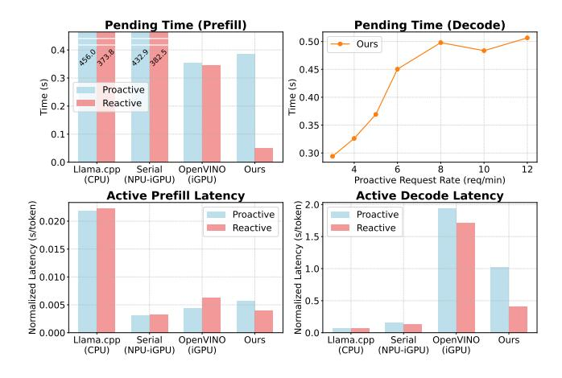

# 6 Evaluation

We evaluate Agent.xpu on diverse agentic flow against industrial baselines ([§6.1\)](#page-8-3). Overall, Agent.xpu improves proactive throughput by up to 2.4× over iGPU serving baseline, while reducing reactive latency by up to 97% under load ([§6.2\)](#page-9-0). Detailed breakdowns further attribute these gains to efficient heterogeneous co-scheduling (§[6.3\)](#page-11-1). We also examine the overhead management ([§6.4\)](#page-11-0).

### 6.1 Experimental Setup

Hetero-SoC Testbed and Models. We deploy Agent.xpu on an ASUS NUC 14 Pro+ mini-PC equipped with an Intel Core Ultra 5 125H processor [\[12\]](#page-13-4) and 64GB DDR5 DRAM, running Ubuntu 24.04. The processor integrates an Intel Arc iGPU and Intel AI Boost NPU, with NPU driver v1.19.0, Intel

> **[图片提取文字 (无描述)]:**
> 1e-2 ProactiveBench 1e-2 CNN/Daily Mail SAMSum 1e-2 2.5 2.5 -Input (mean: 766.4) Input (mean: 165.2) Input (mean: 763.6) 1.5 -2.0 Output (mean: 126.8) 2.0 Output (mean: 48.4) Output (mean: 120.4) Density Density Density 1.5 1.5 1.0 1.0 1.0 0.5 -0.5 0.5 0.0 0.0 0.0 1000 1500 100 200 500 600 500 n 300 400 250 500 1250 # Tokens # Tokens # Tokens Proactive-Mixed Reactive-Mixed 1e-2 1e-2 1.5 Input (mean: 434.9) Input (mean: 213.0) 3 Output (mean: 81.3) Output (mean: 69.7) Density 0.5 Density 0.5 0.0 200 400 600 800 1000 200 400 600 800 1000 1200 # Tokens # Tokens

Figure 9: **Composition of Agentic Workloads.** Input/output length distributions of three proactive datasets and two proactive- or reactive-mixed datasets.

iGPU Compute Runtime 24.39.31294.12, and performance power mode. We evaluate Llama-3.1-8B-Instruct and Llama-3.2-3B-Instruct [44] as central LLM, covering representative model architecture (GQA, dense FFN) and sizes for on-device deployment. We adopt W8A16 channel-wise quantization, incurring negligible accuracy loss [29].

Agentic Workloads. To approximate realistic personal agent behavior, we construct both proactive and reactive workloads: *Proactive:* 1) ProactiveBench [41] with real user events such as keyboard, clipboard, and browser activity; 2) SAM-Sum [23], modeling group chat reply drafting; and 3) CNN/DailyMail [28], for news summarization. *Reactive:* 1) LMSyschat-1M [75], covering diverse one-on-one conversations; 2) MTRAG [31], a multi-turn retrieval-augmented generation benchmark; and 3) Berkeley Function Call Leaderboard [51], which produces structured API calls.

We evaluate two regimes: 1) proactive-only: each proactive benchmark is run individually; 2) mixed flows: proactive and reactive requests coexist. To synthesize mixed workloads, we uniformly sample from all proactive or reactive benchmarks to form proactive- or reactive-mixed datasets. As shown in Fig. 9, the datasets exhibit remarkably different input-length distributions, reflecting the wide variation in prefill intensity across agentic tasks. Output lengths follow a long-tailed pattern, with outliers reaching up to 1.6k tokens—consistent with on-device agents producing summarized responses or compact function-call instructions, while more verbose reasoning tasks remain predominantly cloud-served.

Since the original datasets lack timestamps, we synthesize the arrival times using a Poisson process with request rates varying between 1-30 requests per minute (req/min), matching observed densities for personal agents. Proactive and reactive arrivals are generated independently. For each dataset, we evaluate the baselines and Agent.xpu with 15-minute traces, corresponding to increasing request rates.

**Baselines.** We compare against industrial on-device LLM engines with *concurrent-serving* support and optimizations for the underlying Intel SoC, as well as a customized NPU-

iGPU *static-inference* baseline. All baselines use the same W8A16 precision as Agent.xpu.

- Llama.cpp (CPU) [22], a widely used inference engine optimized for multi-core CPUs. We evaluate its serving mode with continuous batching.
- OpenVINO (iGPU) [48], Intel's deployment stack for Core Ultra SoCs. Since Agent.xpu also builds on OpenVINO's low-level APIs, single-batch performance is nearly identical. For serving, OpenVINO supports continuous batching only on iGPUs, which we use as the iGPU-serving baseline.
- Serial (NPU-iGPU). To generalize static tensor-parallel acceleration across NPU and iGPU [6,7], we craft a serial pipeline that partitions prefill prompts into optimal NPU-iGPU ratios tuned for various lengths, and executes decode fully on the iGPU as NPU-iGPU parallelism barely yields decode benefit on our evaluated SoC.

**Metrics.** We measure both performance and efficiency metrics under varying proactive and reactive request densities: 1) *Normalized Latency*, calculated as the average request end-to-end latency divided by combined input and output lengths, gauging throughput under high request rates. We also measure P90 latency of reactive requests to highlight user-facing responsiveness; 2) *iGPU Utilization*, the weighted sum of stable utilization percentage measured under distinctive loads or stages, averaged by the corresponding active execution periods; 3) *Energy per Token*, measured as the energy consumed (J/token), normalized by the processed token count.

#### **6.2** End-to-End Performance

Proactive-Only Workloads. We first examine proactive-only workloads, where throughput is the primary metric. In this regime, Agent.xpu assigns uniform priority without preemption or adaptive batching. Although designed for mixed workloads, Agent.xpu already outperforms other single- or dual-accelerator baselines in throughput (Fig. 10). OpenVINO (iGPU) ranks second, benefitting from throughput-oriented continuous batching. Llama.cpp (CPU) excels in decode but is bottlenecked by slow prefill, while serial NPU-iGPU execution is limited by non-overlapping execution. Agent.xpu shares low-level kernels with OpenVINO with similar single-batch inference speed, but it achieves lower iGPU utilization (§ 6.4) by leveraging NPU-iGPU co-execution.

The performance advantage of Agent.xpu is further amplified under higher request rates or larger models. On SAMSum, where prompts and outputs are relatively short, all systems sustain higher rates before saturation. With Llama-3B, Agent.xpu achieves 2.0-2.4× throughput over OpenVINO (iGPU), and delivers  $\sim$ 20% more requests at 1.0 s/token latency on ProactiveBench and CNN/DailyMail. Gains are even larger with Llama-8B, as a heavier load amplifies the benefit of heterogeneous scheduling. Compared with Llama.cpp (CPU) and

> **[图片提取文字 (无描述)]:**
> → Llama.cpp (CPU) Serial (NPU-iGPU) OpenVINO (iGPU) Ours Normalized Latency (s/token) 0.0 CNN/Daily Mail (Llama-3B) ProactiveBench (Llama-3B) SAMSum (Llama-3B) 1.0 0.5 0.5 0.0 30 Request Rate (reg/min) Request Rate (reg/min) Request Rate (reg/min) Normalized Latency (s/token) 0.0 - 0.1 ProactiveBench (Llama-8B) CNN/Daily Mail (Llama-8B) SAMSum (Llama-8B) 1.0 0.5 0.5 0.0 0.0 18 16 Request Rate (reg/min) Request Rate (reg/min) Request Rate (reg/min)

Figure 10: Proactive-Only Workloads. End-to-end results with Llama-3B/8B models on three proactive datasets.

> **[图片提取文字 (无描述)]:**
> → Llama.cpp (CPU) Serial (NPU-iGPU) OpenVINO (iGPU) Ours Reactive Proactive P90 Latency Reactive Rate: 1 (Llama-3B) Reactive Rate: 3 (Llama-3B) Reactive Rate: 5 (Llama-3B) 1.0 Normalized Latency (s/token) 0.5 0.5 0.0 0.0 12 10 10 12 Proactive Request Rate (reg/min) Proactive Request Rate (reg/min) Proactive Request Rate (reg/min) Reactive Rate: 1 (Llama-8B) Reactive Rate: 3 (Llama-8B) Reactive Rate: 5 (Llama-8B) 2.0 2.0 2.0 Normalized Latency (s/token) 1.5 1.5 1.0 1.0 1.0 0.5 0.5 0.0 0.0 0.0 10 10 Proactive Request Rate (reg/min) Proactive Request Rate (reg/min) Proactive Request Rate (reg/min)

Figure 11: **Reactive-Proactive Mixed Workloads.** End-to-end results with Llama-3B/8B models on mixed datasets with varying reactive/proactive rate combinations. P90 latencies of reactive requests are displayed alongside mean latencies.

Serial (NPU-iGPU), Agent.xpu achieves up to  $3.9 \times$  and  $4.9 \times$  throughput, respectively.

**Reactive-Proactive Mixed Workloads.** We next evaluate mixed workloads, where proactive throughput and reactive latency must be balanced. Baselines lack request prioritization, so they treat proactive and reactive inputs equally. In contrast, Agent.xpu enforces reactive-first scheduling with adaptive batching. Fig. 11 reports mean and P90 latencies to capture both responsiveness and tail behavior.

Agent.xpu consistently achieves much lower reactive latencies while sustaining higher proactive throughput. For Llama-3B at 6 proactive req/min, Agent.xpu reduces mean reactive latency by 91.61%, 93.84%, and 96.01% at 1, 3, and 5 reactive req/min, respectively, compared to OpenVINO (iGPU). With Llama-8B, the reductions are 96.23%, 96.01%, and 96.70%. Tail (P90) latency reductions are even larger, underscoring

improved user experience. On the proactive side, mean latency improvements reach 34.4%-0.3% for Llama-3B and 58.7%-6.1% for Llama-8B.

Reactive latency in Agent.xpu grows slowly with increasing proactive rates by only 19% (3B) and 49% (8B) from 4 to 10 proactive req/min, thanks to adaptive batching that caps batch sizes for reactive-first scheduling. Moreover, the gap between P90 and mean latency remains narrow, showing stable performance without outliers. In contrast, baselines degrade quickly under higher load: latencies inflate, tails widen, and responsiveness collapses. In baselines, reactive latencies consistently exceed proactive ones, as independent and irregular arrival patterns increase queuing delays under concurrency, and the absence of priority scheduling exacerbates delays for reactive requests. These results confirm the effectiveness of our co-scheduling policies.

> **[图片提取文字 (无描述)]:**
> Pending Time (Prefill) Pending Time (Decode) 0.50 Ours 0.4 32.9 382.5 0.45 0.3 0.2 0.2 Time (s) Proactive 0.40 Reactive 0.35 0.1 0.30 0.0 Serial OpenVINO Ours 10 12 Llama.cpp (NPU-iGPU) Proactive Request Rate (reg/min) (CPU) (iGPU) Active Prefill Latency Active Decode Latency Normalized Latency (s/token) 0.000 0.000 0.000 0.000 2.0 Normalized Latency (s/token) Proactive Proactive Reactive Reactive 1.5 1.0 0.5 0.000 Llama.cpp Serial OpenVINO Serial OpenVINO Ours Llama.cpp Ours (CPU) (CPU) (NPU-iGPU) (iGPU) (NPU-iGPU) (iGPU)

Figure 12: **Breakdown of Agentic Serving Latencies.** Most measured under mixed workloads (3 reactive and 6 proactive req/min), except the decode pending time with varying proactive rates on Agent.xpu, which is zero on baselines with serial scheduling or continuous batching.

#### 6.3 Latency Breakdown

To explain the end-to-end gains, we decompose the inference latency of each request into prefill/decode pending time, active prefill latency, and active decode latency (Fig. 12). The results are normalized within either proactive or reactive agentic flows. This breakdown also serves as a compact ablation.

Baselines suffer from long prefill pending times: CPU serving is delayed by slow prefill, and static NPU-iGPU inference is stalled by serial scheduling. OpenVINO (iGPU) shows significantly longer reactive pending time than Agent.xpu due to the absence of effective prioritized scheduling. In contrast, Agent.xpu keeps reactive prefill pending time to 0.048s on average, enabled by kernel-level sub-100 ms preemption. Decode pending appears only in Agent.xpu due to its unique decoupled scheduling, and grows with proactive load until saturated by the maximum reactive-first batch size.

Active prefill speeds of Agent.xpu and OpenVINO (iGPU) are similar, but Agent.xpu accelerates reactive prefill via NPU-iGPU parallelism. Serial (iGPU-NPU) has uniformly better performance than Agent.xpu with optimal workload partition for both reactive and proactive inputs, despite its limitation to static inference. Decode shows different trends: CPU benefits from multithreading and large caches, while Serial (NPU-iGPU) reflects fast single-batch iGPU decoding. iGPU decode latencies increase due to co-batching with long prefills, but Agent.xpu reduces reactive decode interference through reactive-first batching and fine-grained iGPU arbitration. This demonstrates why reactive requests consistently outperform proactive ones under our design.

> **[图片提取文字 (无描述)]:**
> iGPU Usage Energy Efficiency 70 ()/token) 1.76 58.7 iGPU Utilization (%) 10-20-20-20-20-20-20-20-20-20-20-20-20-20 54.6 Energy 36.9 1.0 Normalized 0.0 0.0 0.56 0.5 0.41 0.30 OpenVINO Serial Llama.cpp Serial OpenVINO Ours Ours (iGPU) (NPU-iGPU) (CPU) (NPU-iGPU) (iGPU)

Figure 13: **Overhead Analysis.** iGPU usage and energy efficiency under the same mixed workloads as Fig. 12.

#### **6.4** Overhead Analysis

**iGPU Utilization.** We measure iGPU utilization across inference stages on the same mini PC running Windows 11, using the system resource monitor. Pure-iGPU prefill can strike 100% utilization, while decode averages 46%. The higher-than-expected decode utilization (relative to FLOPS) arises from memory traffic and synchronization overheads. We account only for active prefill and decode time, excluding duplicated computation from batching. As shown in Fig. 13, Agent.xpu reduces overall iGPU utilization by 32.5% and 37.1% compared with Serial (NPU-iGPU) and OpenVINO (iGPU). Although NPU offloading reduces iGPU occupation in NPU-iGPU baseline, the serial execution without decode batching increases accumulative iGPU usage over all requests. **Energy Efficiency.** Using Intel VTune [30], we measure that NPU power remains stable around 10W for chunked prompt length. iGPU power grows from 25W (decode) to 31W (prefill), with little sensitivity to batch size ( $\leq$ 32). CPU workloads consume 12W during single-threaded NPU kernel compilation and up to 58W under multi-threaded inference. Fig. 13 compares per-token energy: Llama.cpp (CPU) is the least efficient, followed by Serial (NPU-iGPU) with deficient singlebatch iGPU decode. Agent.xpu achieves 26.8% lower energy consumption than OpenVINO (iGPU) by offloading prefill to the NPU and employing efficient batching.

#### 7 Related Work

Stateful LLM Serving. Recent systems address stateful and agentic LLM serving with caching or workflow optimizations. InferCept [1] intercepts intermediate states to avoid recomputation, while Parrot [39] and Ayo [62] expose application-level dataflows or primitive graphs for coordinated execution. Autellix [42] and SGLang [76] generalize LLM agents into program-like structures with specialized runtimes. These systems target multi-tenant cloud settings with abundant resources, whereas our focus is on single-device agents operating under tight SoC constraints.

On-Device LLM Inference. On-device inference efforts have

explored heterogeneous accelerator use and architectural specialization. HeteroInfer [\[6,](#page-12-0)[7\]](#page-12-1) and LLM.npu [\[66\]](#page-16-5) exploit NPU-GPU (or CPU) parallelism, while PowerInfer-2 [\[68\]](#page-16-6) adopts neuron-cluster decomposition for polymorphic execution on smartphones. These works primarily optimize isolated inference latency relying on accuracy-reducing 4-bit quantization, and lack support for stateful workloads. Orthogonal researches include 1) hybrid execution among server-grade accelerators [\[5,](#page-12-5) [32,](#page-14-14) [46\]](#page-14-15), which has different assumptions from on-device scenarios, and 2) co-design with novel memory architecture [\[27,](#page-13-20) [35,](#page-14-16) [54\]](#page-15-15) or in-storage computing [\[61\]](#page-15-16), which requires specialized hardware and limits deployability on personal devices.

Preemptive Scheduling of DNN Workloads. Preemption mechanisms improve responsiveness under concurrent deep learning workloads. PipeSwitch [\[4\]](#page-12-6) pipelines GPU context switching, PREMA [\[8\]](#page-12-7) predicts phases for NPU preemption, REEF [\[26\]](#page-13-15) achieves microsecond-scale preemption via GPU reset. Pantheon [\[25\]](#page-13-21) enables fine-grained preemption through sliced execution and early exits. XSched [\[56\]](#page-15-17) proposes unified abstractions for XPU-based preemption. While effective for traditional DNN tasks on high-end GPUs or customized NPUs, these techniques are not applicable to the unique challenges of scheduling reactive and proactive agentic LLM flows on hetero-SoC.

