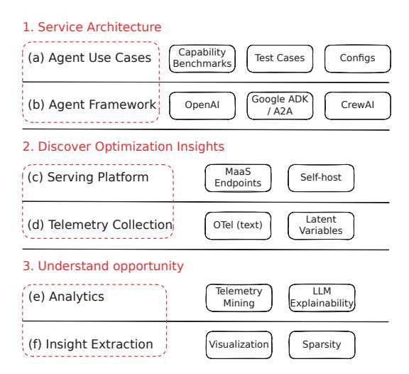

# 1 Introduction

The landscape of AI systems is rapidly evolving from single-turn chat completions to complex agentic workflows that autonomously plan, invoke tools, and execute multi-step tasks [\[1–](#page-4-0)[7\]](#page-4-1). This shift has spawned capability benchmarks—GAIA [\[8\]](#page-4-2), WebArena [\[9\]](#page-4-3), AgentBench [\[10\]](#page-4-4), and PaperBench [\[11\]](#page-4-5)—that evaluate agents on multi-turn tasks requiring reasoning, decision-making, and sophisticated tool use. Yet a critical disconnect exists: performance benchmarks like MLPerf [\[12,](#page-4-6) [13\]](#page-4-7) and Artificial Analysis [\[14\]](#page-4-8) remain anchored to non-agentic workloads (text-to-image generation, MMLU-Pro [\[15\]](#page-4-9), GPQA Diamond [\[16\]](#page-5-0), LiveCodeBench [\[17\]](#page-5-1)), measuring cost and latency for tasks that bear little resemblance to the iterative, tool-heavy patterns of modern agents.

This gap has practical consequences. Without performance benchmarks that capture agentic behaviors, critical questions remain unanswered: What fraction of latency stems from tool calls versus reasoning? How do inter-agent handoffs impact token efficiency? When do best-of-N sampling strategies justify their computational cost? Current understanding relies on anecdotal evidence rather than systematic measurement, hindering both research progress and production deployment of agentic systems.

We introduce the Agentic Bridge Framework (Figure [1\)](#page-1-0) to transform capability evaluations into actionable performance insights. Our framework provides a structured approach to instrument agent systems, collect trace-level telemetry, and extract optimization opportunities. Through a concrete implementation on GAIA, we show how this framework reveals bottlenecks—search operations

> **[图片提取文字 (无描述)]:**
> Service Architecture Capability (a) Agent Use Cases Test Cases Configs Benchmarks Google ADK (b) Agent Framework OpenAl CrewAl / A2A Discover Optimization Insights MaaS (c) Serving Platform Self-host Endpoints Latent (d) Telemetry Collection OTel (text) Variables Understand opportunity Telemetry HM (e) Analytics Explainability Minina (f) Insight Extraction Visualization Sparsity

Figure 1: The Agentic Bridge Framework from Capability Tasks to Performance Insights.

dominating compute, context preservation exceeding reasoning costs—that inform both immediate optimizations and longer-term research directions.

