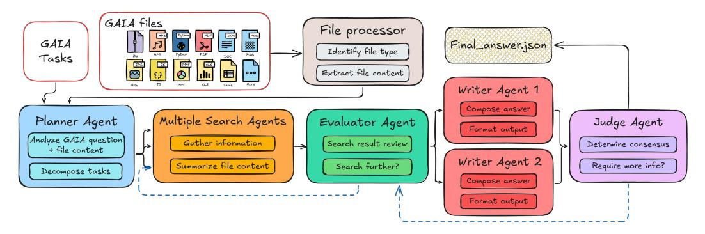

# 2 The Agentic Bridge Framework

The Agentic Bridge Framework (Figure [1\)](#page-1-0) provides a structured approach for extracting performance insights from capability-oriented agent evaluations. The framework consists of three layers that progressively transform high-level agent tasks into actionable system optimizations.

Service Architecture This layer captures the design decisions that define agent workloads and their implementation.

- (a) Agent Use Cases: The choice of workload fundamentally shapes performance characteristics. Agents can execute established capability benchmarks (GAIA [\[8\]](#page-4-2), PaperBench [\[11\]](#page-4-5)) that stress multistep reasoning and tool use, or simpler test patterns from frameworks like OpenAI Agents SDK [\[18\]](#page-5-2). Key configuration parameters significantly impact both accuracy and cost: (i) Pass@N strategies: Running workflows multiple times increases accuracy but multiplies computational cost; (ii) Model selection: Backend choice affects task completion patterns due to differences in model capabilities, tool-use pretraining, instruction following, and zero-shot prompt adaptation; (iii) Workload intensity: Single-user latency optimization differs fundamentally from multi-tenant throughput optimization.
- (b) Agent Framework: Framework choice determines critical trade-offs between flexibility, development speed, and observability. OpenAI Agents SDK [\[18\]](#page-5-2) exemplifies the integrated approach: built-in tracing (OpenTelemetry [\[19\]](#page-5-3) spans for LLM/tool/handoffs [\[20\]](#page-5-4)), native tool support (web search, MCP), and tight API integration enable rapid deployment but lock users to OpenAI models. In contrast, frameworks like CrewAI [\[21\]](#page-5-5) provide granular control over agent modules and support diverse model backends, but require manual implementation of tracing, routing, and guardrails. A middle path exists through OpenAI-compatible API endpoints that enable OSS model integration, though developers must still implement custom tools or wrestle with inter-framework compatibility issues. This tension between ease-of-use and flexibility directly impacts performance measurement: frameworks with rich telemetry simplify optimization but constrain architectural choices, while flexible frameworks enable novel optimizations but complicate systematic evaluation.

Discover Optimization Insights. This layer reveals performance bottlenecks and optimization opportunities through systematic telemetry collection and analysis.

(c) Serving Platform: Serving infrastructure choices create fundamental trade-offs between control and convenience. Model-as-a-Service (MaaS) endpoints provide immediate deployment with pertoken pricing but constrain model selection and telemetry access. Self-served deployments (e.g. GPU rental + vLLM) enable arbitrary open-source model selection and fine-grained monitoring, with hourly pricing that favors continuous workloads and potentially offers cost advantages at high

> **[图片提取文字 (无描述)]:**
> GAIA files File processor GAIA Final\_answer.json | Identify file type Tasks E . 0 **=** Extract file content Writer Agent 1 Compose answer Multiple Search Agents Planner Agent Evaluator Agent Judge Agent Format output Analyze GAIA question Gather information Search result review Determine consensus + file content Writer Agent 2 Summarize file content Search Further? Require more info? Decompose tasks Compose answer Format output

Figure 2: Multi-agent system example for GAIA. Solid arrows show the primary flow: task→planning→parallel search→evaluation→parallel writing→consensus. Dashed arrows indicate re-evaluation loops when consensus fails or more information is needed.

utilization. The serving choice cascades through the stack: MaaS limits telemetry to API-provided metrics, while self-hosting enables access to internal model states critical for optimization.

(d) Telemetry Collection: The depth of observable system behavior depends on serving architecture. API-based frameworks (OpenAI Agents SDK, LangChain [\[22\]](#page-5-6)) provide OpenTelemetry (OTel) traces [\[19\]](#page-5-3) capturing LLM inputs/outputs, tool calls, handoffs, exceptions, token usage, and span timing. Self-hosted deployments unlock richer telemetry: per-token logits/logprobs, layer activations, attention scores, KV cache states, MoE routing decisions, and RAG similarity scores. This granularity gap has practical implications—API traces suffice for identifying high-level bottlenecks, while diagnosing root causes requires low-level signals.

Understand Opportunity. This layer transforms telemetry into actionable optimizations.

- (e) Analytics: Telemetry analysis operates at two levels. High-level OpenTelemetry traces identify macro-patterns: which agents dominate costs, tool-selection accuracy, planning effectiveness. These patterns can reveal which components dominate resource consumption and where context accumulates in multi-agent workflows. Low-level telemetry enables micro-optimizations: declining KV cache hit rates during tool calls indicate memory pressure; logit entropy spikes reveal model uncertainty requiring specialized prompting. Beyond debugging, telemetry enables workload characterization for system design. Sparse autoencoders [\[23\]](#page-5-7) can classify execution phases (planning/tool-use/reasoning) from hidden states, informing phase-aware resource allocation strategies such as dynamic batch sizing, adaptive KV cache allocation, and precision tuning.
- (f) Insight Extraction: Analytics crystallize into workload characterizations that bridge capability and performance evaluation. From telemetry patterns, we extract reproducible performance profiles: token distribution across agent roles, latency breakdowns by phase, accuracy-cost Pareto frontiers for pass@N strategies. These profiles enable systematic optimization—for instance, batching tool calls could reduce latency despite token overhead, while aggressive caching might cut redundant API calls. More importantly, these insights define performance benchmarks for agentic systems: QoS metrics (P90/95/99 latencies under multi-tenant load), scaling characteristics (throughput degradation with concurrent agents), and system-level trade-offs (time-to-first-token versus end-to-end latency). This transformation—from agent traces to performance workloads—provides the foundation for MLPerf-style evaluation of agentic systems, finally closing the gap between what agents can do and how efficiently they do it.

