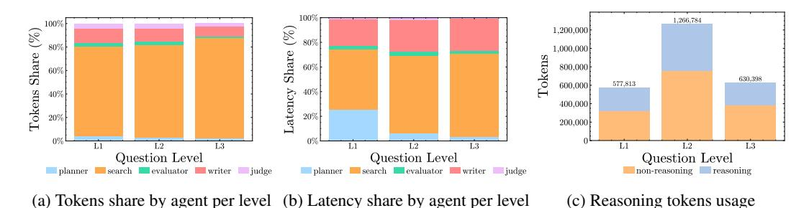

# 3 Case Study: Agent System For GAIA

We instantiate our framework on GAIA validation set as a proof-of-concept, chosen for its diverse task types (reasoning, tool-use, and file handling). We use a multi-agent system (Figure [2\)](#page-2-0) implemented with OpenAI Agents SDK and Pydantic Logfire [\[24\]](#page-5-8) telemetry. The system employs model specialization: o4-mini for orchestration (Planner, Evaluator, Judge), gpt-4.1 for information gathering (Search Agents), and o3 for synthesis (dual Writer Agents). The workflow processes GAIA's diverse file formats, decomposes questions into parallel searches, and enforces answer consensus through

> **[图片提取文字 (无描述)]:**
> 100% 1.266.784 100% 8 1,200,000 8 80% 1,000,000 Share Share Tokens 60% 800,000 60% 630,398 577.813 600.000 Tokens ! Latency 40% 400,000 20% 200,000 L2 Question Level Question Level Question Level planner search evaluator writer judge planner search evaluator writer judge non-reasoning reasoning (a) Tokens share by agent per level (b) Latency share by agent per level (c) Reasoning tokens usage

Figure 3: Token and latency distribution across GAIA validation set (165 tasks)

**3**. . . . . . . . . . . . . . . . . . .

independent writers. We evaluate on the GAIA validation set containing 165 tasks (53 Level-1, 86 Level-2, 26 Level-3), running each task once for pass@1 and twice for pass@2 measurements.

#### 4 Evaluation

Our GAIA validation results reveal critical insights about agentic system performance. The system achieves 52.12% accuracy (pass@1, 86/165 tasks) and 55.67% (pass@2, 92/165 tasks)—a modest 3.55% gain at doubled computational cost. Interestingly, pass@2 provides uniform absolute improvement across difficulty levels (+2 tasks each): L1:  $66.04\% \rightarrow 69.81\%$  (+3.77%,  $35 \rightarrow 37$  tasks), L2:  $51.16\% \rightarrow 53.49\%$  (+2.33%,  $44 \rightarrow 46$  tasks), L3:  $26.92\% \rightarrow 34.62\%$  (+7.69%,  $7 \rightarrow 9$  tasks). These results highlight that simply increasing N offers diminishing returns, underscoring the need for architectural and system-level optimizations beyond repeated sampling.

Figure 3 exposes two fundamental bottlenecks. First, search agents dominate resource consumption (60-80% of tokens and latency across all levels), identifying web data gathering as the primary optimization target—explaining the emergence of specialized tools like Tavily [25] and browser-use [26]. Second, reasoning models spend more tokens on context than reasoning itself: non-reasoning tokens exceed reasoning tokens by about 2x for L1-L2 and 1.5x for L3 (Figure 3c). This overhead stems from inter-agent handoffs where aggregated search results must be passed wholesale to downstream agents, presenting a stark trade-off: preserve full context at high token cost or risk information loss through summarization.

The economic implications are striking: our validation costs \$67.06 via OpenAI APIs (\$0.60/task), with total runtime of 2,931 minutes yielding \$1.37/hour effective rate—comparable to Lambda's \$1.49/hour on-demand GH200 (96GB) pricing [27]. However, this cost parity masks performance disparities: a self-hosted GH200 + Llama-3.1-70B could potentially reduce latency through dedicated compute and optimized batching, eliminating the 2-15 second compounding queuing delays we observed in API calls due to GPU multiplexing across users. These findings suggest a hybrid strategy: leverage APIs for o3-level reasoning (Writers) while self-hosting search agents where speed matters more than sophistication—especially for continuous evaluation, which benefits from per-hour pricing.

#### 5 Limitations and Future Work

**Limitations.** Our results face three constraints: (1) temporal instability—web content and API latencies drift across runs, limiting reproducibility; (2) observability gaps—MaaS endpoints provide only OpenTelemetry traces, hiding low-level signals (KV-cache states, attention patterns) critical for micro-optimizations; (3) limited ablations—infinite multi-agent system design space and compute quotas restrict exploration of agent topologies and pass@N scaling beyond N=2.

**Future work.** The framework points to concrete optimizations: *Serving*—implement phase-aware resource allocation (larger KV cache during reasoning, reduced precision during handoffs) and heterogeneous model routing. *Telemetry*—standardize minimal agentic schemas combining OTel spans with critical latents (logit entropy, cache hit rates). *Analytics*—build phase detectors to enable real-time budgeting. *Insights*—develop context-engineering policies (intelligent summarization before handoffs) and search result caching. These optimizations, suggested by our telemetry patterns, warrant investigation for their potential to reduce token usage while maintaining accuracy.

