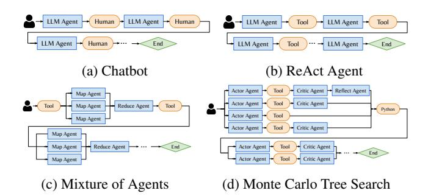
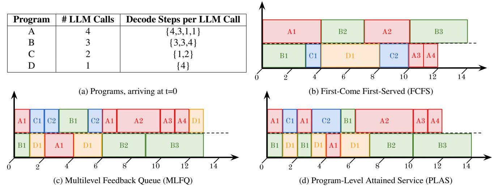

# 1 Introduction

Large language models (LLMs) as autonomous agents enhance their problem solving capabilities by scaling their inference computation—that is, increasing the number of output tokens or LLM calls [\[10,](#page-12-0) [12,](#page-12-1) [22,](#page-12-2) [30,](#page-13-0) [31,](#page-13-1) [66\]](#page-14-0). With more calls and tokens, LLMs endow agents with improved reasoning [\[19,](#page-12-3) [75,](#page-15-0) [83,](#page-15-1) [84\]](#page-15-2), planning and search capabilities [\[57,](#page-14-1) [91\]](#page-15-3), self-reflection from prior experiences [\[34,](#page-13-2) [65,](#page-14-2) [87\]](#page-15-4), and collaboration between multiple agents [\[20,](#page-12-4) [77,](#page-15-5) [95\]](#page-15-6). These techniques enable agents to effectively navigate external environments via tools [\[55,](#page-14-3) [59,](#page-14-4) [84\]](#page-15-2) and solve complex tasks, such as autonomously browsing the web [\[27,](#page-13-3) [82,](#page-15-7) [92\]](#page-15-8), resolving GitHub issues [\[29,](#page-13-4) [73,](#page-14-5) [79\]](#page-15-9), performing deep research [\[52\]](#page-14-6), and proving difficult math problems [\[18,](#page-12-5) [35\]](#page-13-5).

> **[图片提取文字 (无描述)]:**
> LLM Agent LLM Agent Human LLM Agent Human LLM Agent Tool Tool LLM Agent LLM Agent Human End Tool LLM Agent End (a) Chatbot (b) ReAct Agent Critic Agent Reflect Agent Actor Agent Tool Map Agent Actor Agent Tool Critic Agent Reduce Agent Tool Map Agent Tool Python Actor Agent Tool Map Agent Critic Agent Actor Agent Tool Map Agent Map Agent Reduce Agent End Actor Agent Tool Critic Agent End Critic Agent Map Agent Actor Agent Tool (c) Mixture of Agents (d) Monte Carlo Tree Search

Figure 1: Execution workflows for *Agentic Programs*. Agentic programs are highly dynamic execution workflows that follow a directed acyclic graph (DAG). It consists of LLM calls from one or more LLM agents and external interrupts (i.e. tool calls, humans).

The rise of inference-time techniques and agentic applications signifies a shift from static, specialized LLM applications [\[15,](#page-12-6) [41\]](#page-13-6) to highly dynamic, general *agentic programs* [\[37,](#page-13-7) [77,](#page-15-5) [90\]](#page-15-10). More precisely, an agentic program is a dynamic execution workflow, represented by a directed acyclic graph (DAG), that consists of LLM calls from one or more agents, and external interrupts, which include tool calls (i.e. external API calls), generic code execution, or human inputs ([§2\)](#page-2-0). We assume that the LLM invocation pattern of programs emerges only at runtime, making it difficult to fully know or predict the entire graph in advance, which presents challenges beyond static DAG schedulers [\[4,](#page-12-7) [14,](#page-12-8) [41\]](#page-13-6).

Figure [1](#page-0-0) illustrates the highly dynamic nature of agentic programs with single and multi-threaded examples. Singlethreaded programs vary in two dimensions: 1) the length of the program, which depends on the user prompt, and 2) the sequence of LLM calls and interrupts, determined by a program's control flow. For instance, both Chatbot and ReAct (Reasoning and Acting) [\[84\]](#page-15-2) agents cycle between LLM calls and interrupts (human or tool call) and terminate based on a human or LLM's decision. (Fig. [1a,](#page-0-0) [1b\)](#page-0-0) [\[84\]](#page-15-2). Multi-threaded programs generally form DAGs. Both Mixture of Agents, used for fact-checking and summarization [\[23\]](#page-12-9), and Monte Carlo Tree Search (MCTS), widely used for search and

†Equal and significant contribution.

> **[图片提取文字 (无描述)]:**
> # LLM Calls **Decode Steps per LLM Call** Program  $\{4,3,1,1\}$ Α A1 B2 A2 **B**3 В  $\{3,3,4\}$ C {1,2} A3 A4 C1 D1 C2 **B**1  $\{4\}$ (a) Programs, arriving at t=0 (b) First-Come First-Served (FCFS) C2 A1 A2 A3 A4 D1 C2 B1 A2 A3 A4 B1 B1 D1 A1 **B**1 A1 D1 B2 **B3** B1 D1 B2 **B3** (c) Multilevel Feedback Queue (MLFQ) (d) Program-Level Attained Service (PLAS)

Figure 2: Gantt chart of LLM call execution on an LLM serving engine with a max batch size (BS) of 2 (Y-axis) over decoding steps (Xaxis). (a) Four programs vary in the number of LLM calls and decode steps per call. Long programs (A, B) and short programs (C, D) are shown. (b) First-Come First-Served (FCFS) incurs *head-of-line blocking* as long LLM calls delay short LLM calls, resulting in a waiting time of 18 units. (c) Multilevel Feedback Queue (MLFQ) reduces blocking with preemption but still incurs *program-level* blocking. Programs A and B's new LLM calls are placed in the highest priority queue, delaying Program D, incurring 18 units of waiting time. (d) Program-Level Attained Service (PLAS) leverages program-level statistics, delaying subsequent calls in A and B to prioritize programs C and D, reducing waiting time to 12 units.

planning for reasoning and web-based agents [\[11,](#page-12-10) [44,](#page-13-8) [57,](#page-14-1) [91\]](#page-15-3). vary in the number of threads that fork and merge over time, where each thread may contain different sequences of LLM calls and interrupts (Fig. [1c,](#page-0-0) [1d\)](#page-0-0).

Existing LLM serving engines, like vLLM [\[36\]](#page-13-9) and Parrot [\[41\]](#page-13-6), focus on optimizing individual LLM calls or static LLM applications by improving key-value (KV) cache efficiency [\[36,](#page-13-9) [90\]](#page-15-10), accelerating CUDA kernels [\[76,](#page-15-11) [94\]](#page-15-12), and better scheduling algorithms for LLM requests [\[2,](#page-12-11) [76\]](#page-15-11). However, these optimizations fail to account for the program-level context, such as the dependencies between LLM calls in the same program or program-level statistics, like total execution time. As a result, these systems often suffer from suboptimal end-to-end performance for complex programs—in particular, programs' end-to-end latencies ([§3\)](#page-3-0).

Figure [2](#page-1-0) illustrates a burst of two long programs (A, B) and two short programs (C, D) submitted to an LLM serving engine with a max batch size of 2 at t=0. Each program has one or more LLM calls with varying decoding lengths in Fig. [2a.](#page-1-0) Under a program-agnostic First-Come-First-Served (FCFS) policy, the default policy for vLLM [\[36\]](#page-13-9), long LLM calls block other calls from running, resulting in *call-level* head-of-line (HoL) blocking, as shown in Fig. [2b.](#page-1-0) Program A and B's initial, long LLM calls execute first, delaying program C and D's execution until t=3,4. Repeated cases of HoL blocking result in a total waiting time of 18 units. To address this, preemptive scheduling, such as Multi-Level Feedback Queue (MLFQ) [\[76\]](#page-15-11), reduces HoL blocking by preempting long LLM calls to let short calls execute. However, without program-level context, newer programs are repeatedly delayed by subsequent calls from older programs, incurring *program-* *level* HoL blocking. In Fig. [2c,](#page-1-0) MLFQ successfully preempts program A and B's long calls to start executing C and D. However, MLFQ repeatedly prioritizes A and B's subsequent calls from t=6-12, which delays program D's execution. Consequently, MLFQ incurs the same wait time of 18 units as FCFS.

We present Agentix, an LLM inference system designed to run programs, not individual LLM calls. Inspired by OS and DAG schedulers for processes, our key idea is to prioritize LLM calls by the total execution time of their program's previously completed calls; LLM calls from long programs, which are unlikely to complete soon, are deprioritized, allowing shorter programs to complete first. In Fig. [2d,](#page-1-0) short programs C and D are no longer blocked by subsequent LLM calls from long programs A and B, effectively eliminating HoL blocking and reducing the total wait time to 12 units.

Agentix introduces a novel framework that leverages global, program-level statistics, such as program's cumulative execution time on an engine, to minimize waiting times and improve engine throughput. We propose two non-clairvoyant scheduling algorithms that assume no prior workload knowledge of programs: *PLAS* (Program-Level Attained Service) for single-threaded programs and *ATLAS* (Adaptive Thread-Level Attained Service) for multi-threaded programs represented as general, dynamic DAGs. *PLAS* prioritizes LLM calls based on the current cumulative service, or execution times, of their source program. Generalizing *PLAS*, *ATLAS* prioritizes LLM calls based on the maximum cumulative service time across all threads in the same program, which sorts calls based on their program's critical path [\[88\]](#page-15-13). Beyond reduced wait times, *ATLAS* decreases program's makespans by prioritizing critical LLM calls that

would otherwise block programs' progress ([§4\)](#page-4-0).

Programs comprised of tens to hundreds of LLM calls impose significant demands to the serving systems with a single LLM engine capable of handling only 0.2 programs per second for MCTS ([§6\)](#page-8-0). Hence, Agentix also routes programs' LLM calls across multiple engines. For agentic workloads, our key observation is that LLM calls within a program often share common prefixes and cumulative conversation states, while calls across programs typically share only the system prompt [\[67\]](#page-14-7). To avoid recomputing the programs' KV-cache, Agentix respects a program's data locality by routing long calls to their programs' engines, while load-balancing shorter calls to other engines, where system prompts make up most of the input for shorter calls.

We implement a system prototype of Agentix as a layer on top of LLM serving engines and expose a stateful API that allows users to establish persistent sessions with Agentix, unlike traditional stateless APIs [\[51\]](#page-14-8). We evaluate Agentix across different LLMs and four representative agentic workloads ([§6\)](#page-8-0). Our results show that Agentix improves throughput by 4-15x over state-of-the-art inference systems like vLLM [\[36\]](#page-13-9), or 2-5x over *fully optimized* engines[1](#page-2-1) . Across engines, Agentix improves throughput by up to 1.5x over standard load-balancers.

In summary, the primary contributions of this paper are:

- This work is the first to formalize agentic programs as dynamic DAGs of LLM calls and interrupts. ([§2\)](#page-2-0)
- Agentix utilizes program-level statistics to better inform its scheduler. Agentix's non-clairvoyant scheduler requires only the cumulative service times of LLM calls within the same program. ([§4\)](#page-4-0)
- Agentix leverages a simple load-balancing policy across multiple engines to balance data locality and KV-cache recomputation. ([§4\)](#page-4-0)
- Our system is easily deployable, seamlessly integrates a stateful API with existing programming and agent frameworks, and demonstrates significant throughput gains ([§6\)](#page-8-0).

